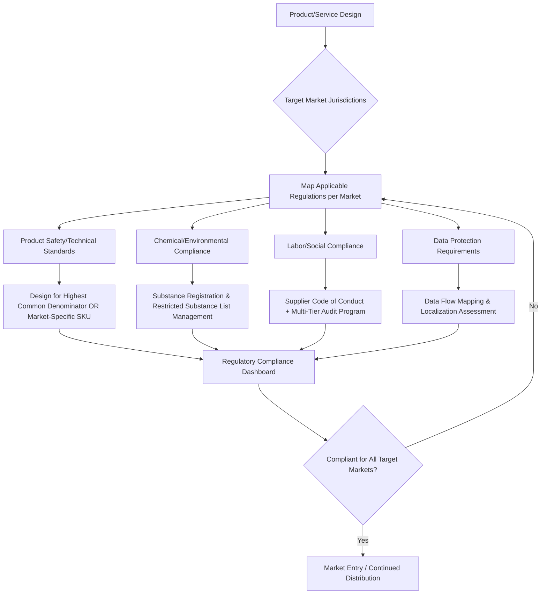

## Regulatory Frameworks Across Jurisdictions

### Overview

Global supply chain networks must operate within a heterogeneous set of national and supranational regulatory regimes governing product safety, labor, environmental standards, data handling, and market access. Unlike customs and tariffs (which govern the movement of goods across borders), this domain governs the conditions under which goods, materials, and business operations are legally permitted to exist and be sold within a given jurisdiction. Divergence between jurisdictions creates both compliance burden and, when navigated well, competitive differentiation.

### Categories of Cross-Jurisdictional Regulation

**Product Safety and Technical Standards**

Requirements governing whether a product may legally be sold, covering safety testing, technical specifications, and certification marks.

- **CE Marking (EU)**: mandatory conformity marking for a wide range of product categories (electronics, machinery, toys, medical devices) indicating compliance with relevant EU directives/regulations
- **UL Listing (US)**: voluntary but market-expected safety certification for electrical and electronic products, administered by Underwriters Laboratories
- **CCC Mark (China)**: mandatory China Compulsory Certification for products sold in the Chinese domestic market
- **PSE Mark (Japan)**: required for specified electrical products under Japan's Electrical Appliance and Material Safety Law

**Regulatory divergence example**: a single electronic product may require different voltage tolerances, plug configurations, EMC (electromagnetic compatibility) testing, and labeling language across the EU, US, Japan, and China markets—driving either SKU proliferation or a "highest common denominator" design approach.

**Environmental and Chemical Regulations**

- **REACH (EU)**: Registration, Evaluation, Authorisation and Restriction of Chemicals — requires registration of chemical substances manufactured or imported into the EU above 1 tonne/year, with substances of very high concern (SVHCs) subject to authorization or restriction
- **RoHS (EU)**: Restriction of Hazardous Substances — limits use of specific hazardous materials (lead, mercury, cadmium, certain flame retardants) in electrical and electronic equipment
- **TSCA (US)**: Toxic Substances Control Act — governs chemical substance manufacture, import, and use in the United States
- **WEEE Directive (EU)**: Waste Electrical and Electronic Equipment — imposes extended producer responsibility (EPR) for end-of-life collection and recycling

**Labor and Social Compliance**

- **ILO Core Conventions**: international baseline standards on forced labor, child labor, freedom of association, and non-discrimination, though enforcement depends on national ratification and implementation
- **National minimum wage, working hour, and safety regulations**: vary substantially by jurisdiction and are frequently the subject of supply chain audits (e.g., SA8000, WRAP, Sedex/SMETA frameworks)
- **Forced labor import bans**: e.g., the US Uyghur Forced Labor Prevention Act (UFLPA), which creates a rebuttable presumption that goods from specified regions are made with forced labor and are therefore prohibited from import absent clear and convincing evidence otherwise

**Data Protection and Digital Trade**

- **GDPR (EU)**: General Data Protection Regulation — governs processing of personal data, with extraterritorial reach to any entity processing EU residents' data regardless of where the processing occurs
- **Data localization requirements**: some jurisdictions (e.g., Russia, China, India in certain sectors) require that specified categories of data be stored on servers physically located within the country, directly affecting supply chain IT/ERP architecture for multinational operations
- [Inference] Data protection regulation increasingly intersects with physical supply chain operations because modern logistics, track-and-trace, and supplier management systems process personal data (driver information, employee records, customer shipping details) across borders, making data flow compliance a supply chain IT architecture concern rather than purely a legal one.

### Comparative Regulatory Regime Table

| Domain | EU | United States | China |
| --- | --- | --- | --- |
| Product safety | CE marking, harmonized standards (EN) | Sector-specific (CPSC, FDA, FCC); no single mark | CCC mark mandatory for listed categories |
| Chemicals | REACH, RoHS | TSCA | China REACH (MEE Order 12) |
| Data | GDPR, extraterritorial | Sectoral (HIPAA, CCPA state-level) | PIPL, data localization requirements |
| Labor/forced labor | EU Forced Labour Regulation (import ban) | UFLPA (rebuttable presumption) | N/A (subject of above regulations) |
| Extended producer responsibility | WEEE, Packaging & Packaging Waste Regulation | State-level EPR laws (varies) | Emerging EPR pilot programs |

### Extraterritorial Reach and Compliance Complexity

A defining feature of modern regulatory frameworks is **extraterritoriality**—regulations that apply based on where affected individuals/markets are located, not where the regulated entity is headquartered or where the conduct occurs.

- GDPR applies to any company processing EU residents' personal data, regardless of the company's location
- UFLPA applies to any importer bringing goods into the US, regardless of where in the supply chain forced labor concerns arise (extending due diligence obligations deep into sub-tier suppliers)
- EU Corporate Sustainability Due Diligence Directive (CSDDD) [Unverified — implementation timelines and final scope have been subject to ongoing legislative revision, so current applicability thresholds should be verified against the latest official EU documentation] extends human rights and environmental due diligence obligations across a company's full value chain, not just direct (Tier 1) suppliers.

This extraterritorial reach means a company's regulatory compliance surface is often larger than its direct legal presence, requiring supply chain visibility into Tier 2, Tier 3, and beyond suppliers to satisfy due diligence obligations.

### Regulatory Compliance Architecture for Supply Chains

### Strategic Response Patterns

**Highest Common Denominator (HCD) Design**

Designing a single global product configuration that meets the most stringent applicable regulation across all target markets (e.g., using RoHS-compliant materials globally even in markets without a RoHS equivalent), trading some cost efficiency for reduced SKU complexity and compliance risk.

**Market-Specific Configuration**

Maintaining distinct product variants per jurisdiction to optimize cost/performance for each market's specific regulatory floor, at the cost of increased inventory complexity, tooling, and compliance management overhead—directly interacting with the global/regional/local network strategy decision, since market-specific configuration favors regional or local production and final configuration.

**Regulatory Intelligence and Horizon Scanning**

[Inference] Given the pace of regulatory change (particularly in EU sustainability and chemical regulation, and evolving US forced-labor and national-security-driven trade restrictions), mature compliance programs typically maintain dedicated regulatory intelligence functions or subscribe to specialized regulatory tracking services, since reactive compliance (responding only after a regulation takes effect) creates material risk of supply disruption or market access loss.

### Supplier Multi-Tier Due Diligence

Modern regulatory frameworks (UFLPA, CSDDD, German Supply Chain Due Diligence Act/LkSG) increasingly require visibility beyond direct (Tier 1) suppliers:

- **Tier 1**: direct contractual suppliers — typically well-mapped in existing procurement systems
- **Tier 2/3**: sub-suppliers and raw material sources — often opaque without deliberate supply chain mapping initiatives
- **Traceability mechanisms**: chain-of-custody documentation, blockchain-based provenance tracking, and supplier self-declaration combined with third-party audit are common approaches to establishing the evidentiary basis needed to rebut forced-labor presumptions or demonstrate due diligence compliance

### Certification and Conformity Assessment Pathways

| Pathway | Description | Example |
| --- | --- | --- |
| Self-declaration | Manufacturer certifies compliance without third-party testing | CE marking for lower-risk product categories |
| Third-party testing/certification | Independent lab verifies compliance before market access | UL listing, most CCC mark categories |
| Notified body assessment | EU-designated body conducts conformity assessment for higher-risk products | Medical devices, certain machinery under EU regulations |
| Government pre-market approval | Regulator directly approves product before sale | Pharmaceuticals (FDA, EMA), some medical devices |

### Key Points

- Regulatory frameworks are distinct from customs/tariff regimes: they govern market access legality and operational conduct rather than the cross-border movement and taxation of goods, though both must be satisfied simultaneously for successful international trade.
- Extraterritorial regulations (GDPR, UFLPA, CSDDD-type frameworks) mean compliance obligations frequently extend beyond a company's direct legal jurisdiction and beyond Tier 1 suppliers, requiring deep supply chain visibility.
- The choice between highest-common-denominator global design and market-specific configuration is a direct extension of the global/regional/local network strategy decision, with regulatory complexity as an additional driver toward regionalization.
- Regulatory regimes evolve continuously, particularly in sustainability, data protection, and forced-labor domains, making regulatory intelligence a standing operational requirement rather than a one-time compliance project.

**Next Steps**

- Multi-tier supplier mapping and traceability system design
- Extended Producer Responsibility (EPR) program compliance across jurisdictions
- Forced labor due diligence frameworks (UFLPA, CSDDD, LkSG comparative analysis)
- Product certification pathway selection (self-declaration vs. third-party vs. notified body)
- Data localization architecture for global ERP/logistics systems
- Regulatory intelligence and horizon-scanning program design
- Highest-common-denominator vs. market-specific product configuration strategy