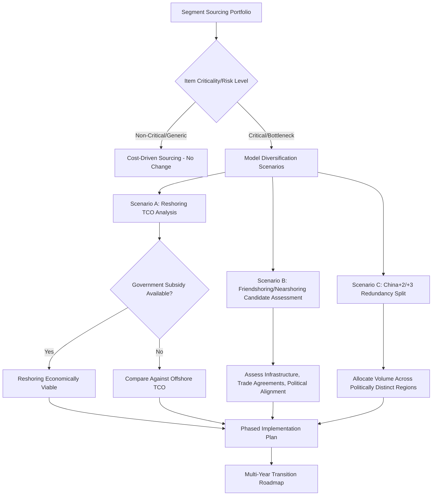

## Friendshoring and Anywhere-but-China Sourcing Strategies

### Overview

Friendshoring and "anywhere-but-China" (also called "China+1," "de-risking," or "decoupling-lite") strategies describe a family of sourcing approaches that emerged primarily after 2018–2020, driven by tariff escalation, pandemic-era disruption, and geopolitical realignment. These strategies deliberately weight political alignment and supply chain resilience alongside (and sometimes above) pure cost optimization when selecting sourcing and manufacturing locations. They represent a partial departure from the efficiency-maximizing logic that dominated globalization strategy from the 1990s through the mid-2010s.

### Terminology and Distinctions

These terms are frequently used interchangeably in practice but describe analytically distinct strategies:

| Strategy | Primary Driver | Geographic Logic | China Relationship |
| --- | --- | --- | --- |
| **Friendshoring** | Geopolitical alignment | Countries with political/diplomatic alignment to home market | Diversifies away from adversarial or non-aligned states |
| **Nearshoring** | Logistics/proximity | Physical closeness to end-market demand | Not necessarily China-related |
| **Reshoring** | Domestic policy/resilience | Return production to home country | Full exit from offshore production |
| **China+1** | Risk diversification | China remains core; add one secondary base | China retained as primary production hub |
| **China+2/+3** | Redundancy | Split production across multiple distinct regions | Reduced but not eliminated China role |
| **Decoupling/De-risking** | Strategic/national security | Broad reduction of economic interdependence | Most aggressive reduction of China exposure |

[Inference] Distinguishing these terms matters practically because they imply different network architectures: friendshoring is fundamentally a government-policy-oriented framing (which countries a nation's firms *should* trade with), while nearshoring and China+1 are corporate operational decisions that may or may not align with any government's friendshoring agenda. A company can nearshore to a geopolitically non-aligned country, and a company can friendshore to a country that is not geographically near its end market.

### Historical and Policy Context

The term "friendshoring" gained prominence after U.S. Treasury Secretary Janet Yellen's 2022 remarks advocating that firms source from countries "we can count on," rather than remaining dependent on nations where geopolitical relationships create risk to supply chains or economic security. [Cosmo Sourcing](https://www.cosmosourcing.com/blog/what-is-friend-shoring)

US tariffs on Chinese goods beginning in 2018, compounded by COVID-19 disruptions, drove China's share of US imports down from approximately 22% in 2017 to roughly 9% by mid-2025. This accelerated in 2023, when Mexico overtook China as the largest single source of US imports — a milestone frequently cited as the clearest quantitative signal of the sourcing shift underway. [Tocco Earth](https://tocco.earth/article/china-plus-one-nearshoring-friendshoring)[maseconomics](https://maseconomics.com/supply-chain-economics-nearshoring-reshoring-and-friendshoring-explained/)

In the United States, the CHIPS and Science Act of 2022 provided a policy example of state-backed reshoring, authorizing over $50 billion for semiconductor-related activities along with tax credits for qualifying private investment, illustrating how friendshoring/reshoring strategy is often reinforced by direct government subsidy rather than market forces alone. [Xpert](https://xpert.digital/en/us-strategies-to-reduce-china-dependence/)

### Why Companies Do Not Simply Exit China

Despite the sourcing shift, the reason most companies do not fully exit China comes down to industrial infrastructure that took over three decades to build and remains difficult to replicate elsewhere. This creates a persistent tension in strategy design: [Tocco Earth](https://tocco.earth/article/china-plus-one-nearshoring-friendshoring)

- **Supplier ecosystem depth**: dense, co-located networks of component suppliers, tooling shops, and sub-assemblers that reduce coordination cost and enable rapid iteration
- **Skilled labor availability at scale**: large pools of manufacturing-experienced labor for specific process types (electronics assembly, precision machining)
- **Established logistics infrastructure**: port capacity, customs processing efficiency, and domestic transportation networks refined over decades
- **Capital sunk into existing facilities**: switching costs for owned or long-term-leased manufacturing assets

This is why **China+1** (retaining China as the core while adding a secondary base) has been a more common initial response than full exit, and why most "anywhere-but-China" initiatives are gradual and partial rather than immediate wholesale relocation.

### Alternative Destination Analysis

**Southeast Asia**

Vietnam, Malaysia, and Indonesia have become increasingly attractive destinations for manufacturing diversification away from China, offering lower labor costs, developing infrastructure, and participation in regional trade agreements. Vietnam in particular has absorbed substantial electronics and apparel manufacturing capacity, benefiting from proximity to Chinese component supply chains (a "China+1 within Asia" pattern) while offering different tariff treatment. [Medium](https://medium.com/@adhvikvak/friendshoring-the-new-face-of-global-trade-56ca3bbd0ee0)

**Mexico and Latin America**

Mexico combines both nearshoring (proximity to the US market) and friendshoring (USMCA trade agreement alignment) logic, making it a preferred destination for North American-focused firms across electronics, automotive, and appliance manufacturing.

**India**

Positioned as a friendshoring destination partly through the **Quad Partnership** (US, Australia, India, Japan), which fosters collaboration and technology transfer among member states, alongside India's own domestic manufacturing incentive programs (e.g., Production-Linked Incentive schemes). [Medium](https://medium.com/@adhvikvak/friendshoring-the-new-face-of-global-trade-56ca3bbd0ee0)

**Eastern Europe**

Serves as the EU-market equivalent of Mexico for North America—combining geographic proximity with political/regulatory alignment for European buyers seeking to diversify away from Asian dependency.

### Strategic Sourcing Decision Framework

A structured approach to friendshoring/diversification decisions typically segments the sourcing portfolio before applying different logic to each segment:

For non-critical, low-value, generic items, sourcing strategy remains purely cost-driven, since the risk exposure and strategic value of diversification do not justify the added complexity. For critical and bottleneck items, firms typically model multiple scenarios: [The Daily Explainer](https://thedailyexplainer.com/friendshoring-reshoring-supply-chain-guide-2026/)

- **Reshoring scenario**: calculating total cost of ownership—including automation, labor, energy, and government subsidies—for domestic production versus continued offshore sourcing, while analyzing impact on lead time and carbon footprint [The Daily Explainer](https://thedailyexplainer.com/friendshoring-reshoring-supply-chain-guide-2026/)
- **Friendshoring/nearshoring scenario**: identifying viable allied or nearby nations and assessing their infrastructure stability, trade agreement benefits, labor skills, and political relationship — for example, a US firm comparing Mexico, Vietnam, and Poland as alternative bases [The Daily Explainer](https://thedailyexplainer.com/friendshoring-reshoring-supply-chain-guide-2026/)
- **Diversification scenario**: developing a "China+2 or +3" strategy that splits production across multiple geographically and politically distinct regions to build redundancy, recognizing that a full, immediate shift away from an existing base is usually impossible and prohibitively expensive [The Daily Explainer](https://thedailyexplainer.com/friendshoring-reshoring-supply-chain-guide-2026/)[The Daily Explainer](https://thedailyexplainer.com/friendshoring-reshoring-supply-chain-guide-2026/)

### Decision Framework Flow

### Persistent Limitations and Risks

Diversification strategies have not fully resolved underlying supply chain vulnerabilities. Industry analysis of Q4 2025 procurement data found that friendshoring and nearshoring in the Americas were offering limited relief as trade deals and tariffs continued to unsettle global supply chains, with a clear slowdown in U.S. overseas procurement observed from August onward, as procurement strategies were stress-tested by shifting alliances and new trade barriers. Analysts in that report specifically cautioned that alliances forming between other major economies outside U.S. policy influence may prove more consequential for long-term trade stability than domestically-focused headlines suggest. [Report: Nearshoring and Friendshoring Are Not Yet Solving Trade War Problems | SupplyChainBrain +2](https://www.supplychainbrain.com/articles/42681-report-nearshoring-and-friendshoring-are-not-yet-solving-trade-war-problems)

**Additional structural risks in diversification strategies**

- **New chokepoint concentration**: shifting volume to Vietnam or Mexico can recreate single-point-of-failure risk in a new location if diversification is not spread across genuinely uncorrelated risk profiles
- **Capacity constraints at destination**: rapid demand shift to alternative countries can outpace their infrastructure, skilled labor, and port capacity buildout, causing cost inflation and lead-time degradation in the "friend" location
- **Rules-of-origin circumvention scrutiny**: goods routed through a third country with minimal finishing to disguise Chinese origin face increasing enforcement risk (see tariff engineering/anti-circumvention topic), meaning genuine substantial transformation must occur at the new location
- **China's own market repositioning**: Chinese executives are reported to see 2026 growth coming from expanding into diversified export markets rather than defending their current position, indicating China is adapting its own trade posture in response to friendshoring trends rather than remaining a static counterparty [Yahoo Finance](https://finance.yahoo.com/economy/policy/articles/china-supply-chain-execs-prioritizing-155900967.html)

### Financial and Operational Cost Modeling

Diversification is rarely cost-neutral in the near term. A useful framing is total transition cost against risk-adjusted benefit:

$$NB_{diversify} = \left(\Delta Risk_{avoided} \times C_{disruption}\right) - \left(C_{transition} + C_{ongoing\_premium}\right)$$

where $\Delta Risk_{avoided}$ is the reduction in probability-weighted disruption exposure, $C_{disruption}$ is the estimated cost of a disruption event (lost sales, expedited freight, contract penalties), $C_{transition}$ is one-time cost (new supplier qualification, tooling, dual-sourcing overhead), and $C_{ongoing\_premium}$ is any sustained unit cost premium at the new location relative to the incumbent source.

[Inference] Because $C_{transition}$ and $C_{ongoing\_premium}$ are certain and immediate while $\Delta Risk_{avoided} \times C_{disruption}$ is probabilistic and realized only if a disruption event occurs, this calculation is highly sensitive to a firm's risk tolerance and disruption probability assumptions—explaining why diversification decisions vary so widely across firms facing similar underlying exposure, and why board-level risk appetite (not purely quantitative modeling) often drives the final pace of diversification.

### Key Points

- Friendshoring, nearshoring, reshoring, and China+1/+2 are related but analytically distinct strategies—friendshoring prioritizes political alignment, nearshoring prioritizes proximity, and reshoring prioritizes domestic return; a real transition plan usually blends elements of all three by product category.
- China's deeply embedded industrial ecosystem means most firms pursue partial diversification (China+1/+2) rather than full exit, given the infrastructure and switching-cost barriers involved.
- Segmenting the sourcing portfolio by criticality before applying diversification logic (cost-driven for generic items, scenario-modeled for critical/bottleneck items) is the standard structured approach to avoid unnecessary transition cost on low-risk categories.
- Empirical evidence through late 2025 suggests these strategies have provided only partial relief from underlying trade volatility, and new destinations carry their own emerging capacity, cost, and circumvention-scrutiny risks that must be actively managed rather than assumed away.

**Related Topics**

- Global vs. Regional vs. Local Network Strategies (diversification as a network topology decision)
- Customs, Tariffs, and Trade Compliance (Section 301/232 tariffs as a primary friendshoring driver)
- Free Trade Zones and Tariff Engineering (rules-of-origin circumvention risk in diversified sourcing)
- Multi-tier supplier due diligence and forced labor compliance (UFLPA exposure in alternative sourcing regions)
- Dual-sourcing and supplier qualification program design
- Total cost of ownership (TCO) modeling for reshoring decisions
- Regional trade agreement landscape (USMCA, RCEP, CPTPP) as friendshoring enablers