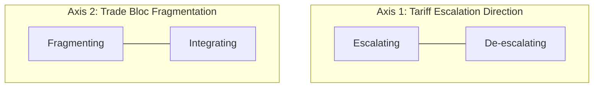
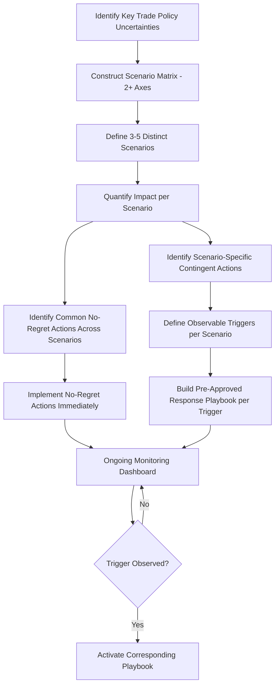

## Trade Policy Volatility and Scenario Planning

### Overview

Trade policy volatility refers to the frequency and magnitude of unpredictable shifts in tariffs, sanctions, export controls, and trade agreements that materially affect supply chain economics. Unlike stable regulatory regimes with long lead times for change, recent trade policy has exhibited rapid, sometimes unilateral shifts—driven by national security concerns, election cycles, and retaliatory dynamics between major trading blocs. Scenario planning is the structured discipline supply chain organizations use to build resilience against this volatility without waiting for certainty that may never arrive.

### Sources of Trade Policy Volatility

**Unilateral executive action**

Tariffs imposed via national security or trade remedy authority (e.g., US Section 301 and Section 232 actions) can be enacted, modified, or escalated with limited advance notice and without requiring legislative approval, producing much shorter policy cycles than treaty-based trade agreements.

**Retaliatory escalation dynamics**

Trade actions frequently trigger reciprocal measures from affected trading partners, creating multi-round escalation sequences where the eventual equilibrium tariff level is difficult to predict at the outset of a dispute.

**Election and political cycle risk**

Trade policy stances can shift substantially with changes in government, and even anticipated elections create a period of forward uncertainty during which firms hesitate to commit capital to a specific network configuration.

**Sanctions and export control expansion**

Entity lists, sectoral sanctions, and export control classifications are updated on an ongoing basis, and can be applied with immediate effect, unlike tariff schedules which sometimes include phase-in periods.

**Trade agreement renegotiation and review clauses**

Modern trade agreements increasingly include periodic review or sunset provisions (e.g., USMCA's joint review mechanism) that create recurring windows of potential renegotiation, embedding cyclical uncertainty into otherwise "settled" agreements.

### Why Traditional Forecasting Fails for Trade Policy

Standard supply chain forecasting techniques (time-series extrapolation, regression on historical patterns) are poorly suited to trade policy risk because:

- Trade policy shifts are **discontinuous** (step changes) rather than continuous trends
- Policy decisions are driven by **political and geopolitical variables** largely uncorrelated with historical trade volume or pricing data
- The **probability distribution of outcomes** is not stationary—the likelihood of a given policy action changes based on evolving diplomatic relationships, making historical base rates unreliable
- **Reflexivity** exists: firms' own repositioning in anticipation of policy changes can itself influence subsequent policy decisions (e.g., a wave of reshoring reducing political pressure for further tariff escalation)

[Inference] This is why scenario planning, rather than point-forecasting, is the dominant analytical approach for trade policy risk: it substitutes a discrete set of plausible futures and pre-built response plans for a single-point prediction that policy volatility makes inherently unreliable.

### Scenario Planning Methodology

**Step 1: Identify Key Uncertainties**

Isolate the specific policy variables most material to the network (e.g., "Will Section 301 tariffs on Category X increase, remain flat, or be removed within 18 months?" or "Will Country Y's most-favored-nation status be revoked?").

**Step 2: Construct Scenario Axes**

Combine two or more high-impact, high-uncertainty variables into a scenario matrix. A common approach uses two orthogonal axes to generate four distinct scenarios:

This produces four quadrant scenarios, for example:

- **Escalating + Fragmenting**: "Trade War Intensifies" — high tariffs, shrinking trade blocs, maximum diversification pressure
- **Escalating + Integrating**: "Managed Rivalry" — high tariffs between rival blocs but strengthening ties within aligned blocs (friendshoring-favorable)
- **De-escalating + Fragmenting**: "Selective Thaw" — some tariff relief but continued bloc realignment (mixed signals, cautious hedging)
- **De-escalating + Integrating**: "Trade Normalization" — broad tariff reduction and strengthening multilateral ties (efficiency-favorable, consolidation-favorable)

**Step 3: Assign Indicative Probabilities and Impact Magnitudes**

For each scenario, estimate rough probability weighting and quantify the financial impact on the network (landed cost delta, lead time delta, working capital impact) using the total landed cost and network cost frameworks established elsewhere in this domain.

**Step 4: Develop Trigger-Based Response Playbooks**

Rather than committing to a single strategy in advance, define specific observable triggers that would activate a pre-built response plan for each scenario—converting scenario planning from an analytical exercise into an operational capability.

**Step 5: Monitor and Update**

Establish a regulatory intelligence/horizon-scanning function (see Regulatory Frameworks topic) to track leading indicators and update scenario probabilities on a recurring cadence.

### Scenario Planning Process Flow

### No-Regret vs. Contingent Actions

A critical output of scenario planning is distinguishing actions that create value **regardless of which scenario materializes** from actions that should only be taken if a specific scenario is confirmed.

**No-regret actions** (common across most/all scenarios)

- Improving supply chain visibility and multi-tier supplier mapping
- Diversifying supplier base for single-sourced critical components, even absent a specific tariff trigger
- Building flexible/modular product designs that ease re-sourcing of components
- Establishing relationships (even if unused) with qualified alternate suppliers in multiple geographies
- Investing in trade compliance and classification infrastructure that pays off under any tariff regime

**Contingent actions** (scenario-specific, held in reserve)

- Full production line relocation (high capital cost, only justified if escalation scenario is confirmed)
- FTZ activation for a specific inverted-tariff opportunity (only valuable if the specific tariff differential persists)
- Long-term supply contracts locking in current-regime pricing (valuable in a de-escalation scenario, potentially costly in an escalation scenario)

[Inference] Prioritizing no-regret actions allows organizations to build resilience without over-committing capital to a specific policy prediction, which is important given how frequently trade policy trajectories have reversed or moderated from initially announced positions in recent cycles.

### Quantitative Risk Exposure Modeling

**Expected cost impact across scenarios**, weighted by assigned probability:

$$E[C_{impact}] = \sum_{i=1}^{n} P_i \times C_i$$

where $P_i$ is the assigned probability of scenario $i$ and $C_i$ is the estimated cost impact (landed cost increase, working capital change, revenue impact from delayed market entry) under that scenario.

**Value of flexibility (real options framing)**

Because scenario planning often involves deferring an irreversible commitment (e.g., a new plant) until more information arrives, the decision can be framed using real options logic:

$$V_{flex} = E[V_{informed decision}] - V_{commit now}$$

where $V_{informed decision}$ is the expected value of waiting for scenario resolution before committing capital (avoiding the cost of building capacity that turns out unnecessary), and $V_{commit now}$ is the value of committing immediately. A positive $V_{flex}$ favors maintaining optionality (e.g., dual-qualifying two supplier locations without committing full volume to either) over premature full commitment.

### Stress Testing and War-Gaming

Beyond scenario matrices, mature trade risk programs conduct structured **stress tests** against specific severe-but-plausible events:

- Sudden imposition of a punitive tariff (e.g., 25%+) on a single-sourced critical input with no immediate alternative
- Complete loss of access to a specific trade corridor (chokepoint closure, sanctions-driven cutoff)
- Simultaneous escalation across multiple trading relationships (a "compound shock" scenario, more severe than any single-variable scenario)

**Cross-functional war-gaming exercises**, involving procurement, legal/trade compliance, finance, and commercial teams, simulate the organization's actual decision-making process under a specific severe scenario, surfacing coordination gaps and decision bottlenecks that purely analytical scenario planning may miss.

### Organizational Capabilities Required

| Capability | Function |
| --- | --- |
| Regulatory intelligence / horizon scanning | Tracks leading indicators and policy developments to update scenario probabilities |
| Trade compliance and classification infrastructure | Enables rapid re-classification/re-sourcing response when triggers activate |
| Multi-tier supply chain visibility | Identifies true exposure to a given country/policy risk beyond Tier 1 |
| Flexible/modular network design | Physical and contractual capacity to shift volume without full re-engineering |
| Cross-functional governance forum | Ensures rapid, coordinated decision-making when a trigger is observed |
| Financial hedging and contractual risk-sharing | Buffers the financial impact of policy shifts during the response lag |

### Key Points

- Trade policy volatility is structurally different from typical demand or supply variability because it is discontinuous, politically driven, and non-stationary, making point forecasts unreliable and scenario planning the more appropriate analytical tool.
- Effective scenario planning separates "no-regret" actions (valuable under any scenario) from "contingent" actions (valuable only if a specific scenario is confirmed), avoiding over-commitment to any single predicted future.
- Trigger-based response playbooks convert scenario analysis from a periodic strategic exercise into an operational capability that can activate quickly when specific observable conditions are met.
- Real options framing helps justify maintaining flexibility (dual-sourcing, deferred capital commitment) even when it appears less cost-efficient than full commitment under a single assumed scenario, because the value of avoided downside under alternative scenarios often outweighs the efficiency cost of optionality.

**Next Steps**

- Real options valuation methods for supply chain flexibility investments
- Regulatory intelligence and horizon-scanning program design
- Cross-functional trade risk governance structures
- War-gaming exercise design for supply chain disruption response
- Multi-tier supplier visibility and mapping methodologies
- Dual-sourcing and supplier qualification frameworks under uncertainty
- Friendshoring and Anywhere-but-China Sourcing Strategies (as a contingent action category)