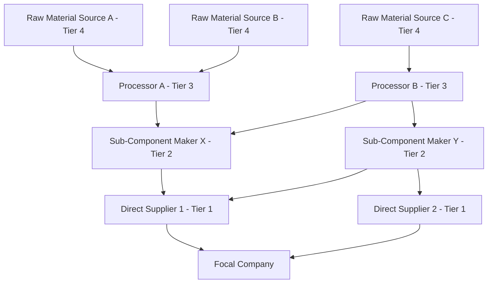
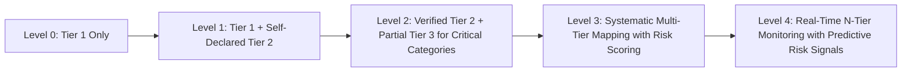

## N-Tier Visibility Architecture

### Overview

N-Tier visibility architecture refers to the systems, data models, and organizational processes that extend supply chain observability beyond a company's direct (Tier 1) suppliers into deeper sub-tiers—Tier 2, Tier 3, and beyond, down to raw material origin where required. This architecture is a foundational enabler for risk management, regulatory compliance (forced labor due diligence, conflict minerals reporting), and network resilience planning, since disruptions and compliance exposures frequently originate below the tier a company directly contracts with.

### The Tier Structure

**Tier 1**: Direct contractual suppliers who ship components, materials, or finished goods directly to the focal company. This tier is typically well-mapped, since it exists in the company's own procurement and ERP systems as active vendor records.

**Tier 2**: Suppliers to the Tier 1 suppliers—the sub-component and sub-material providers that Tier 1 vendors rely on. Visibility here typically requires active elicitation, since these relationships exist in the Tier 1 supplier's systems, not the focal company's.

**Tier 3 and beyond**: Raw material extraction, processing, and further upstream sub-suppliers. Visibility at this depth is the most difficult to establish and is often only achieved for specific high-risk categories (conflict minerals, forced-labor-flagged regions, single-source critical materials) rather than comprehensively across the entire bill of materials.

**N-Tier**: The general term denoting visibility extending an arbitrary number of tiers upstream, as deep as the specific risk, regulatory, or resilience objective requires—not a fixed number of tiers, but a capability to extend as far as needed for a given use case.

### Why N-Tier Visibility Matters

[Inference] Direct (Tier 1) visibility alone is insufficient for several reasons that have become increasingly consequential:

- **Disruption origin mismatch**: major disruptions (natural disasters, geopolitical events, factory fires) frequently occur at Tier 2/3 suppliers unknown to the focal company, who only discovers the exposure when a Tier 1 supplier reports a shortage with no visibility into why
- **Regulatory extraterritoriality**: frameworks like forced-labor import bans (see Regulatory Frameworks topic) impose due diligence obligations that require evidence about sub-tier conditions, not just direct supplier attestations
- **Concentration risk masking**: multiple Tier 1 suppliers may unknowingly share the same Tier 2 or Tier 3 source, creating a hidden single point of failure that appears diversified at the Tier 1 level but is concentrated deeper in the network
- **Sustainability and ESG reporting**: scope 3 emissions reporting and environmental impact assessment require data from across the extended supply chain, not just direct suppliers

### Data Model Architecture

An N-Tier visibility system requires a graph-based (not purely relational/tabular) data model, since supply relationships form a many-to-many network rather than a simple hierarchy.

**Core entity types**

- **Node**: a supplier, sub-supplier, facility, or raw material source, with attributes (location, certifications, risk scores, capacity)
- **Edge**: a supply relationship between two nodes, with attributes (material/component supplied, volume/percentage of total input, contractual vs. informal relationship, relationship confidence/verification level)
- **Material/SKU flow**: tracks which specific inputs flow along which edges, enabling material-specific traceability (e.g., tracing a specific mineral through multiple processing steps) rather than only company-level relationship mapping

**Representative graph structure**

This structure reveals hidden concentration: both Tier 1 suppliers ultimately depend on Processor B (Tier 3), a shared exposure invisible from a Tier-1-only view.

### Data Acquisition Methods

Because the focal company does not have direct contractual visibility into sub-tier relationships, N-Tier data must be acquired through indirect methods, each with different reliability and coverage trade-offs:

| Method | Description | Reliability | Coverage |
| --- | --- | --- | --- |
| Tier 1 supplier self-declaration | Direct suppliers disclose their own sub-suppliers | Moderate (subject to disclosure willingness/accuracy) | Depends on cooperation |
| Contractual cascading requirements | Contracts require Tier 1 to obtain and pass through Tier 2 disclosure | Moderate-High (contractually enforceable) | Limited to compliant suppliers |
| Third-party supply chain mapping platforms | Specialized data providers aggregate customs, shipping, and corporate registry data | Variable (inferred relationships, not always verified) | Broad but less precise |
| Blockchain/distributed ledger provenance | Each tier records material transfer on a shared ledger | High (if adopted) | Limited to participating networks |
| Physical/chemical traceability (isotopic, DNA markers) | Material-level scientific verification of origin | Very High for origin claims | Narrow (specific high-value/high-risk materials only) |
| Industry consortia data sharing | Shared databases across an industry for common sub-tier suppliers (e.g., conflict minerals reporting templates) | High for participating suppliers | Sector-specific |

[Inference] In practice, most mature N-Tier programs combine several of these methods, using contractual cascading and self-declaration for broad coverage across the supplier base, reserving the more rigorous (and expensive) methods like physical traceability or blockchain for specific high-risk or high-regulatory-scrutiny material categories, since comprehensive high-assurance tracing of an entire bill of materials is rarely economically justified.

### Visibility Maturity Model

- **Level 0**: Company has visibility only into its direct contractual suppliers; no systematic sub-tier data
- **Level 1**: Tier 1 suppliers periodically self-report their key sub-suppliers, typically via questionnaire, with limited verification
- **Level 2**: Selected high-risk material categories (conflict minerals, single-source critical components, forced-labor-flagged regions) receive verified deep-tier mapping, while the broader base remains at Level 1
- **Level 3**: Systematic mapping extends across the majority of the supply base with consistent risk scoring methodology, integrated into procurement and risk management systems
- **Level 4**: Continuous, near-real-time monitoring integrates external risk signals (news, satellite imagery, financial health indicators, port/customs data) with the mapped network graph to generate predictive alerts before disruptions fully materialize

### Control Tower Integration

N-Tier visibility architecture typically feeds into a **control tower**—a centralized (though not necessarily physically centralized) capability that aggregates visibility data across the network and supports decision-making. Key integration points:

- **Risk scoring engine**: combines node-level attributes (geographic risk, financial health, compliance history) and network-level attributes (concentration, redundancy) into composite risk scores per node and per material flow
- **Alert and exception management**: surfaces deviations (a sub-tier facility closure, a sanctioned entity appearing in the extended network) that require human review or trigger predefined response playbooks
- **Scenario simulation**: allows "what-if" analysis using the network graph—e.g., simulating the cascading impact if a specific Tier 3 node were to become unavailable, identifying all downstream Tier 1/Tier 2/focal-company impacts

### Technical Implementation Considerations

**Graph database selection**

Given the inherently networked (not hierarchical) nature of supply relationships, purpose-built graph databases (e.g., Neo4j, Amazon Neptune) are commonly used over traditional relational databases for N-Tier visibility systems, since graph traversal queries (e.g., "find all Tier 1 suppliers exposed to Region X within 3 hops") are computationally expensive to express and execute efficiently in a relational model at scale.

**Data quality and confidence scoring**

Because much sub-tier data originates from indirect or self-reported sources, a robust N-Tier system attaches a **confidence/verification level** to each edge and node in the graph (e.g., "verified via third-party audit," "self-declared, unverified," "inferred from customs data"), allowing risk assessments to appropriately discount lower-confidence relationships rather than treating all mapped data as equally reliable.

**Update frequency and staleness management**

Supply relationships change (suppliers switch sub-suppliers, new facilities come online), so the architecture must define refresh cadences per data source type—self-declared data might refresh annually via supplier audit cycles, while high-risk category tracking might require continuous or event-triggered updates.

**Privacy and competitive sensitivity**

Sub-tier supplier identities are often considered commercially sensitive by Tier 1 suppliers (revealing them may expose the Tier 1 supplier to disintermediation risk). [Inference] This commercial sensitivity is a frequently cited practical barrier to N-Tier data collection, and mature programs often address it through anonymized/aggregated risk reporting (e.g., a Tier 1 supplier confirms "X% of this material originates from Region Y" without naming the specific Tier 2 entity) or through neutral third-party data intermediaries that can verify claims without directly disclosing competitively sensitive relationships to the focal company.

### Key Points

- N-Tier visibility is a graph, not a hierarchy: the same Tier 2 or Tier 3 supplier can serve multiple Tier 1 suppliers, and revealing this shared dependency is often the primary value of extending visibility beyond Tier 1.
- Data acquisition methods vary widely in cost, reliability, and coverage; mature programs deliberately match acquisition method to the risk/regulatory stakes of the specific material category rather than applying uniform rigor across the entire supply base.
- A maturity model approach—starting with Tier 1 and self-declared Tier 2, then extending verified deep-tier mapping to specific high-risk categories—is more practical than attempting comprehensive Level 4 visibility across an entire bill of materials from the outset.
- Graph database architecture, confidence scoring on data sources, and integration with a control tower's risk scoring and alerting capabilities are the core technical components that convert raw N-Tier data into actionable supply chain risk management.

**Related Topics**

- Control tower architecture and real-time exception management
- Blockchain and distributed ledger provenance systems for supply chain traceability
- Conflict minerals reporting and material-level chemical/isotopic traceability
- Forced labor due diligence frameworks (UFLPA, CSDDD) and their N-Tier data requirements
- Graph database design patterns for supply chain network modeling
- Supplier risk scoring methodologies
- Scope 3 emissions data collection across extended supply networks