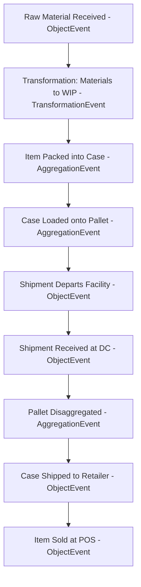
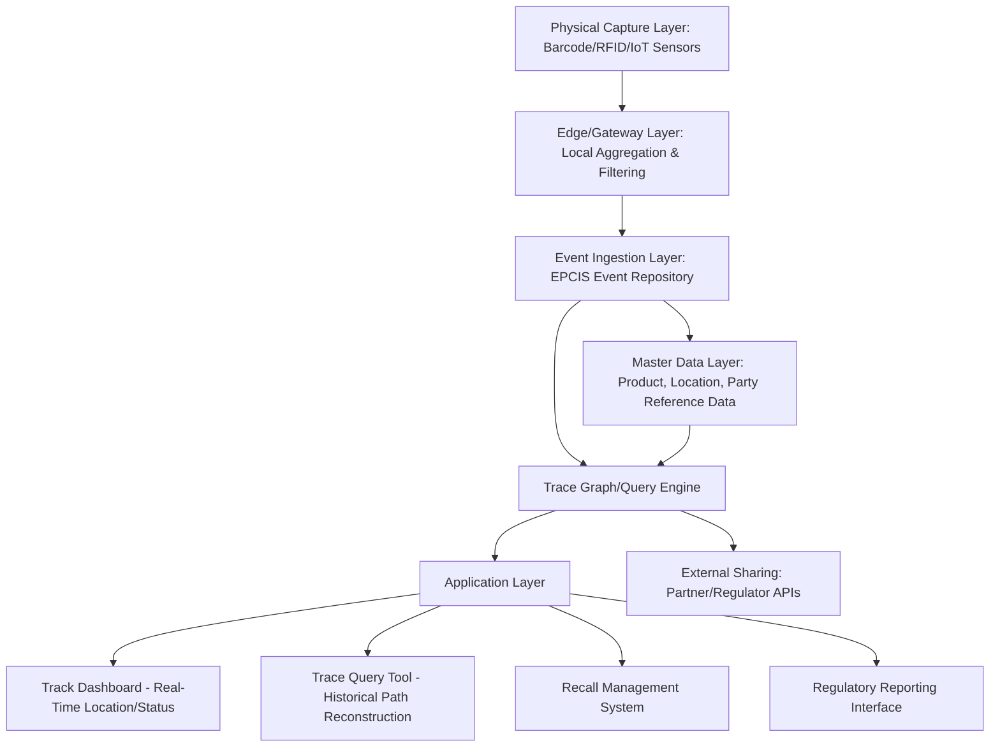

## Track-and-Trace System Design

### Overview

Track-and-trace systems capture, store, and expose the movement and state history of physical goods as they progress through a supply chain. "Tracking" refers to determining a unit's current location and status; "tracing" refers to reconstructing a unit's historical path, typically backward from a point of interest (e.g., a quality defect, a recall trigger, or a regulatory audit). Together they form the operational backbone that feeds N-Tier visibility, control towers, and regulatory traceability requirements.

### Track vs. Trace: Distinct Capabilities

| Capability | Question Answered | Direction | Primary Use Case |
| --- | --- | --- | --- |
| **Track** | Where is this unit right now? | Forward, real-time | Shipment monitoring, ETA prediction, exception alerting |
| **Trace** | Where has this unit been, and what did it touch? | Backward, historical | Recall management, root-cause investigation, compliance audit |

A well-designed system supports both from a single underlying data model, since the same event stream (location and state updates over time) serves both forward-looking tracking queries and backward-looking trace reconstruction.

### Granularity Levels

Track-and-trace can be implemented at different levels of granularity, each with different cost, precision, and use-case trade-offs:

- **Batch/lot level**: tracks a production batch or lot as a single unit; sufficient for many food safety and pharmaceutical use cases where recall scope is defined at the batch level
- **Case/pallet level**: tracks aggregated units (a case of items, a pallet of cases); balances granularity against tagging/scanning cost for high-volume distribution
- **Unit/item level (serialized)**: tracks each individual unit with a unique identifier; required for high-value goods, regulated pharmaceuticals (serialization mandates), and anti-counterfeiting use cases
- **Component/ingredient level**: traces constituent materials within an assembled or compounded product, enabling traceability to flow both up (which finished products contain a given input) and down (which inputs compose a given finished unit) the bill of materials

[Inference] Granularity selection is fundamentally a cost-benefit decision: unit-level serialization provides the most precise recall scoping (minimizing the volume of product needlessly recalled) but imposes the highest tagging, scanning, and data volume cost, so most systems apply higher granularity only where regulatory mandate or high unit value justifies it, defaulting to batch/lot tracking elsewhere.

### Core Data Model: The EPCIS Event Pattern

The most widely adopted standard for track-and-trace event modeling is **EPCIS (Electronic Product Code Information Services)**, maintained by GS1. EPCIS structures traceability data around four questions for every recorded event:

- **What**: which object(s) — the specific identifiers (serial numbers, lot numbers, batch IDs) involved
- **Where**: the physical location (read point) and business location where the event occurred
- **When**: event time and record time (distinguishing when the event actually happened from when it was recorded in the system)
- **Why**: the business step (e.g., shipping, receiving, packing) and disposition (e.g., in-transit, sold, damaged)

**EPCIS event types**

- **ObjectEvent**: something happened to one or more objects (e.g., a case was packed, a shipment was received)
- **AggregationEvent**: objects were physically associated/disassociated (e.g., items packed into a case, cases loaded onto a pallet)
- **TransactionEvent**: objects were associated with a business transaction (e.g., linked to a purchase order or invoice)
- **TransformationEvent**: input objects were consumed to create new output objects (e.g., raw materials transformed into a finished product, breaking direct identity linkage but preserving traceability through the event record)

### Representative Event Flow

Each arrow in this flow corresponds to a discrete EPCIS event recording What/Where/When/Why, forming a queryable chain that supports both forward tracking (where is this pallet now) and backward tracing (which raw material lot is in this specific sold item).

### Identifier Standards

- **GTIN (Global Trade Item Number)**: identifies a product at the class level (this SKU), not a specific unit
- **SGTIN (Serialized GTIN)**: adds a unique serial number to a GTIN, enabling unit-level identification
- **SSCC (Serial Shipping Container Code)**: identifies a specific logistics unit (case, pallet) for shipment tracking
- **GLN (Global Location Number)**: identifies a specific physical or business location (a facility, a specific dock door)
- **Batch/Lot Number**: identifies a production batch, typically used when unit-level serialization is not required or feasible

### Physical Data Capture Technologies

| Technology | Read Range | Line-of-Sight Required | Typical Use Case |
| --- | --- | --- | --- |
| Barcode (1D/2D/QR) | Contact to ~1m | Yes | General retail, low-cost item-level marking |
| RFID (passive) | ~1-10m | No | Pallet/case tracking, apparel item-level, asset tracking |
| RFID (active) | 10-100+ m | No | High-value asset tracking, yard management |
| GPS/GNSS | N/A (satellite) | No | Vehicle/container-level location tracking |
| Bluetooth Low Energy (BLE) beacons | ~10-50m | No | Indoor/warehouse proximity tracking |
| IoT sensors (temperature, humidity, shock) | N/A (data logging) | No | Cold chain and fragile goods condition monitoring |
| Blockchain-anchored digital twin | N/A (data integrity layer) | No | High-assurance provenance where tamper-evidence is critical |

**Selection criteria**: [Inference] technology selection typically balances per-unit tagging cost against required read range, environmental durability (RFID performance degrades near metal/liquid, requiring tag placement engineering), and whether line-of-sight scanning is operationally feasible at the point of capture (e.g., barcode scanning requires a manual or fixed-position scan step, while passive RFID enables bulk reads without individual item handling).

### System Architecture Layers

**Edge/gateway layer rationale**: high-frequency IoT sensor readings (e.g., continuous temperature logging) generate data volumes unsuitable for direct transmission to a central repository; edge processing filters, aggregates, and applies threshold-based alerting locally, forwarding only exceptions and periodic summaries to reduce bandwidth and central storage requirements.

**Master data layer rationale**: event records reference product, location, and party identifiers by code (GTIN, GLN); a separate master data layer resolves these codes to human-readable and business-context-rich records, keeping the high-volume event stream lean while supporting rich queries.

### Trace Query Patterns

**Forward trace (push)**: given a specific input lot (e.g., a contaminated ingredient batch), identify all finished products that contain it — critical for proactive recall scoping.

**Backward trace (pull)**: given a specific finished unit or complaint (e.g., a specific serial number reported defective), identify all upstream inputs, processes, and facilities involved in its production — critical for root-cause investigation.

**One-up-one-down minimum standard**: many regulatory traceability requirements (e.g., US FDA Food Safety Modernization Act, produce traceability rules) mandate at minimum that each party in the chain can identify who they received a product from (one up) and who they shipped it to (one down), even without full end-to-end system integration — this is the baseline traceability requirement that full EPCIS-based systems substantially exceed.

### Data Sharing and Interoperability Challenges

Track-and-trace value increases substantially when data is shared across organizational boundaries (supplier to manufacturer to distributor to retailer), but this introduces challenges distinct from single-organization tracking:

- **Data ownership and access control**: parties are typically willing to share event data relevant to shared custody but not proprietary business data (e.g., a supplier will confirm shipment events but not internal production cost data)
- **Standard adherence variance**: not all supply chain partners implement EPCIS or GS1 standards identically, requiring data transformation/mapping layers at integration points
- **Selective disclosure**: a party may need to prove a specific fact (e.g., "this lot passed inspection") without disclosing the full underlying event history, motivating interest in cryptographic selective-disclosure and blockchain-based approaches in some implementations

### Recall Management Integration

Track-and-trace systems are foundationally linked to recall management effectiveness:

$$Recall\ Precision = \frac{\text{Units correctly identified as affected}}{\text{Total units recalled}}$$

Higher trace granularity and data completeness directly increase recall precision, reducing the cost and reputational impact of over-broad recalls (recalling more product than actually affected) while ensuring recall completeness (not missing genuinely affected units). [Inference] This trade-off between recall precision and recall completeness is a key business justification often used to fund investment in finer-grained track-and-trace capability, since the cost of an imprecise, overly broad recall in a high-value or high-volume category can substantially exceed the incremental system investment required to achieve tighter trace granularity.

### Key Points

- Track (real-time location/status) and trace (historical path reconstruction) are distinct but complementary capabilities that should share a common underlying event data model rather than being built as separate systems.
- EPCIS's What/Where/When/Why event structure is the dominant industry standard for structuring traceability data, with event types (Object, Aggregation, Transaction, Transformation) covering the full range of supply chain state changes.
- Granularity (batch, case, unit, ingredient level) should be matched to regulatory requirement and value-at-risk per category rather than applied uniformly, since unit-level serialization carries meaningfully higher capture and data infrastructure cost.
- Cross-organizational data sharing is often the harder problem than the internal technical architecture, requiring negotiated data-sharing agreements, standard interoperability, and selective disclosure mechanisms rather than purely technical solutions.

**Next Steps**

- GS1 EPCIS and CBV (Core Business Vocabulary) standard implementation details
- RFID system design: tag selection, read infrastructure, and interference mitigation
- Cold chain IoT sensor integration and condition-based alerting thresholds
- Blockchain-based provenance systems and selective disclosure mechanisms
- Recall management process design and regulatory reporting requirements
- N-Tier Visibility Architecture (as the organizational graph that track-and-trace event data populates)
- Master data management for product, location, and party reference data