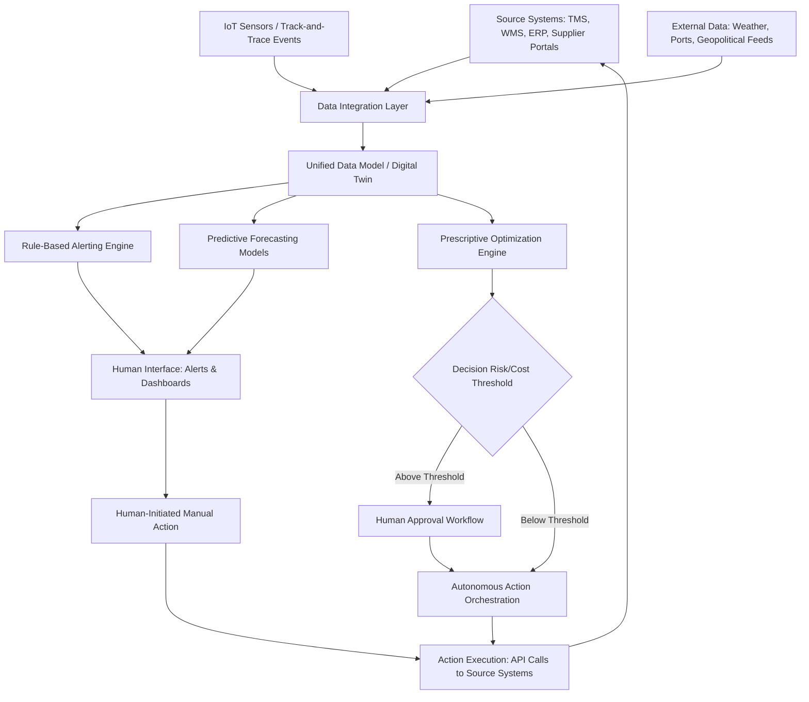

## Control Towers: From Reporting Dashboards to Decision Systems

### Overview

A supply chain control tower is a centralized capability—organizational, technological, or both—that aggregates data across a supply network to provide visibility, analysis, and increasingly, automated or semi-automated decision support. Control towers have evolved through distinct generations, from passive reporting dashboards that display historical status, to predictive systems that flag emerging risk, to prescriptive and increasingly autonomous decision systems that recommend or execute responses. Understanding this evolution is essential to correctly scoping what a given control tower investment can and cannot do.

### Maturity Evolution

**Generation 1 — Descriptive Dashboards**

Aggregates data from multiple systems (TMS, WMS, ERP) into a unified visual display showing current and historical status: shipment locations, inventory levels, order status. Answers "what happened / what is happening" but requires a human to interpret significance and decide on action.

**Generation 2 — Diagnostic and Alerting**

Adds rule-based exception detection: flags deviations from expected state (a shipment behind schedule, inventory below safety stock threshold) and answers "why did this happen" through drill-down capability. Still fundamentally reactive—alerts fire after a deviation has already occurred.

**Generation 3 — Predictive**

Applies statistical or machine learning models to forecast future states before they materialize: predicted late deliveries based on current transit patterns and historical performance, projected stockouts based on demand and replenishment lead time trends. Answers "what is likely to happen," shifting the control tower from reactive to anticipatory.

**Generation 4 — Prescriptive**

Generates specific recommended actions in response to predicted or detected conditions, often ranking multiple response options by estimated cost/benefit (e.g., "reroute shipment via Path B: +$4,200 cost, -18 hours delay" vs. "hold current route: on-time probability 62%"). Answers "what should be done," but a human decision-maker still selects and authorizes the action.

**Generation 5 — Autonomous/Self-Correcting**

For a defined subset of lower-risk, high-frequency decisions, the system executes the recommended action directly within pre-approved boundaries (e.g., automatically re-routing a shipment when a delay threshold is crossed and cost impact is below an approval limit), with human oversight retained for exceptions outside those boundaries or for periodic audit of autonomous decisions.

[Inference] Most organizations do not progress linearly and uniformly through these generations across their entire network; rather, different decision types mature at different rates, so a mature control tower environment typically contains a mix—Generation 5 automation for routine, well-understood, low-risk decisions (e.g., automatic carrier re-tendering below a cost threshold) alongside Generation 3/4 predictive-prescriptive support for higher-stakes or less-standardized decisions (e.g., network redesign, supplier switching).

### Core Architectural Components

**Data integration layer**

Aggregates data from source systems: Transportation Management Systems (TMS), Warehouse Management Systems (WMS), Enterprise Resource Planning (ERP), supplier portals, IoT sensor feeds, and external data (weather, geopolitical events, port congestion indices). This layer must reconcile differing data formats, update frequencies, and identifier schemes across sources.

**Unified data model / digital twin**

A normalized representation of the physical supply chain—nodes (facilities, suppliers, transportation legs) and their current and historical states—against which analytics and decision logic operate. This is architecturally related to, and often built on, the N-Tier visibility graph and track-and-trace event streams described elsewhere in this domain.

**Analytics and decision engine**

Houses the rule-based alerting logic (Generation 2), forecasting/ML models (Generation 3), and optimization/recommendation logic (Generation 4). This layer increasingly incorporates purpose-built optimization solvers (for routing, allocation, and scheduling decisions) alongside statistical/ML forecasting models.

**Action/orchestration layer**

For Generation 4/5 capability, this layer translates a recommended or approved decision into an executable action, typically via API integration back into the source transactional systems (e.g., issuing a re-route instruction to a TMS, triggering a purchase order adjustment in the ERP).

**Human interface layer**

Dashboards, alert feeds, and decision-approval workflows that present information and recommendations to human operators, sized appropriately to the decision's stakes—routine decisions may surface only as a log entry for periodic audit, while high-stakes decisions require an active approval workflow before execution.

### End-to-End Architecture

Note the feedback loop: executed actions (whether autonomous or human-approved) flow back into source systems, updating the data that feeds subsequent control tower cycles—this closed-loop structure is what distinguishes a true control tower from a static reporting dashboard.

### Decision Authority Framework

A critical control tower design decision is defining which decisions may be automated (Generation 5) versus which require human judgment, typically governed by a risk/cost threshold matrix:

| Decision Type | Frequency | Typical Cost Impact | Automation Suitability |
| --- | --- | --- | --- |
| Carrier re-tender for minor delay | High | Low | High — good Gen 5 candidate |
| Safety stock replenishment trigger | High | Low-Moderate | High — good Gen 5 candidate |
| Alternate route selection (known options) | Moderate | Moderate | Moderate — Gen 4 with fast-track approval |
| Emergency air freight authorization | Low | High | Low — requires human approval (Gen 4) |
| Supplier switching decision | Low | Very High | Low — strategic, requires full human decision process |
| Network redesign / facility relocation | Very Low | Very High | Not automatable — strategic planning process |

[Inference] This framework reflects a general principle in decision automation: frequency and reversibility favor automation (frequent, low-cost, easily-reversed decisions benefit most from automation since errors are cheap and quickly correctable), while infrequent, high-cost, difficult-to-reverse decisions should retain human judgment regardless of how sophisticated the underlying predictive model is, since model confidence intervals widen for rare/novel situations that such models are less likely to have been trained on extensively.

### Organizational Model Variants

**Centralized control tower**

A single team/function operates the control tower for the entire network, providing consistent decision logic and cross-regional visibility, but potentially creating a bottleneck for region-specific nuance and slower response for geographically distant operations.

**Federated/regional control towers**

Regional teams operate control towers for their geography with a shared underlying technology platform and data model, balancing local responsiveness against network-wide consistency; typically feed summarized cross-regional status up to a smaller central coordination function.

**Outsourced/3PL-operated control tower**

A third-party logistics provider or specialized control tower service operates the capability on the company's behalf, often chosen when the company lacks internal scale or expertise to build/maintain the technology and analytics capability independently.

[Inference] The choice among these models often correlates with company size and network complexity: very large, geographically dispersed enterprises more commonly adopt federated models to balance consistency and responsiveness, while mid-market companies more commonly adopt centralized or outsourced models given the fixed cost of building sophisticated Generation 3+ analytics capability internally.

### Key Performance Metrics for Control Tower Effectiveness

- **Alert-to-action latency**: time elapsed between an exception being detected/predicted and a corrective action being initiated
- **Prediction accuracy**: for Generation 3+ capability, measured against actual outcomes (e.g., predicted vs. actual on-time delivery rate)
- **Automation rate**: percentage of eligible decisions handled autonomously (Generation 5) versus requiring human intervention, tracked over time as a maturity indicator
- **False positive/alert fatigue rate**: excessive low-value alerts degrade human trust in and attention to the system, making this a critical governance metric independent of raw detection accuracy
- **Decision reversal rate**: for autonomous decisions, the frequency with which a human subsequently overrides or reverses an automated action, indicating whether automation boundaries are correctly calibrated

### Common Implementation Pitfalls

[Inference] Based on the general pattern of control tower implementations across the generations described above, several recurring pitfalls are commonly reported in practitioner literature:

- **Data integration underinvestment**: organizations often underestimate the effort required to reconcile source system data into a coherent unified model, leading to a control tower that displays inconsistent or unreliable information, undermining user trust before advanced analytics capability is even reached
- **Skipping generations**: attempting to implement Generation 4 prescriptive capability without first establishing reliable Generation 1-2 data foundations typically produces recommendations users do not trust, since the underlying data quality has not been validated
- **Alert fatigue from over-broad rule design**: overly sensitive exception rules in Generation 2 alerting produce high volumes of low-value alerts, training users to ignore the system entirely
- **Automation scope creep without governance**: expanding Generation 5 autonomous action scope faster than the decision authority framework and audit processes can support, creating risk of unmonitored high-impact automated decisions

### Key Points

- Control towers exist on a maturity spectrum from descriptive (what happened) through diagnostic, predictive, prescriptive, to autonomous (Generation 1-5), and most mature implementations operate a deliberate mix of generations across different decision types rather than uniform capability everywhere.
- The closed-loop architecture—where executed actions feed back into source systems and subsequent control tower cycles—is the defining structural difference between a true control tower and a static reporting dashboard.
- A decision authority framework based on frequency, reversibility, and cost impact should govern which decisions are eligible for autonomous execution, since automation suitability does not depend solely on predictive model sophistication.
- Reliable data integration and a validated unified data model are prerequisites for advanced (predictive/prescriptive) capability; skipping this foundation to pursue advanced analytics typically undermines user trust in the resulting recommendations.

**Related Topics**

- N-Tier Visibility Architecture (the network graph underlying control tower data models)
- Track-and-Trace System Design (the event stream feeding control tower state)
- Digital twin architecture for supply chain simulation and scenario testing
- Optimization solver selection for routing, allocation, and scheduling decisions
- Alert governance and false-positive reduction methodologies
- Organizational design for centralized vs. federated control tower operations
- Machine learning model validation for supply chain forecasting applications