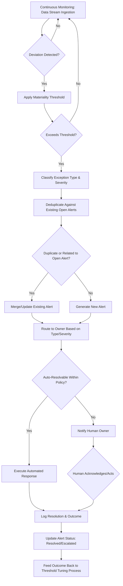

## Real-Time Alerting and Exception Management

### Overview

Real-time alerting and exception management is the discipline of detecting deviations from expected supply chain state as close to their occurrence as possible, and routing those deviations to the appropriate response mechanism—automated, human-assisted, or fully manual. It is the operational core of Generation 2 control tower capability (see Control Towers topic) but extends further, encompassing the design principles that determine whether an alerting system produces actionable signal or degrades into ignored noise.

### Defining an Exception

An exception is any observed or predicted deviation between actual/projected state and expected state, where the deviation exceeds a defined materiality threshold. This definition has three necessary components:

- **Expected state**: a baseline, plan, or forecast against which actual conditions are compared (a planned delivery date, a target inventory level, a contracted lead time)
- **Observed or predicted state**: the actual current condition, or a forecasted future condition derived from current trends
- **Materiality threshold**: the magnitude of deviation required before the difference is considered an exception worth surfacing, rather than normal operational variance

[Inference] The materiality threshold is the most consequential and frequently under-engineered design parameter in exception management: setting it too sensitively produces alert fatigue (see below), while setting it too loosely causes genuine problems to go undetected until they become costly to resolve.

### Exception Categories

**Status exceptions**: a shipment, order, or asset is in an unexpected state (delayed, damaged, misrouted, held at customs)

**Threshold exceptions**: a monitored metric crosses a predefined boundary (inventory below safety stock, temperature outside acceptable range, supplier on-time performance below service level agreement)

**Trend exceptions**: a metric's rate of change, rather than its absolute value, signals an emerging problem (demand accelerating beyond forecast, a supplier's on-time performance steadily degrading over several periods even though no single period has crossed an absolute threshold)

**Relational exceptions**: a deviation only becomes apparent when comparing multiple related data points (a shipment's GPS location is consistent with its stated route, but its reported temperature log shows a gap during the same window — individually unremarkable, jointly concerning)

**Predictive exceptions**: a forecasting model projects a future exception before it has actually occurred (predicted late delivery based on current transit velocity and remaining distance, projected stockout based on current depletion rate and open replenishment orders)

### Alert Lifecycle

The final feedback loop—outcomes feeding back into threshold tuning—is essential: without it, materiality thresholds remain static even as underlying operational conditions (typical variance, seasonal patterns) shift, gradually degrading alert relevance.

### Severity and Routing Framework

Effective exception management requires a severity classification scheme that determines routing, urgency, and escalation path, typically combining **impact** and **urgency**:

| Severity | Impact | Urgency | Example | Typical Routing |
| --- | --- | --- | --- | --- |
| Critical | High | Immediate | Cold chain temperature breach on pharmaceutical shipment | Immediate page/call to on-call owner |
| High | High | Same-day | Single-sourced critical component shipment delayed 3+ days | Alert with required same-day acknowledgment |
| Medium | Moderate | Within SLA window | Non-critical SKU below reorder point | Queued alert, reviewed in normal work cycle |
| Low | Low | Informational | Minor routing deviation with no ETA impact | Dashboard/log entry only, no active notification |

**Escalation logic**: alerts unacknowledged or unresolved within a severity-appropriate time window should automatically escalate to a broader audience or higher authority level, preventing a single unavailable owner from becoming a silent failure point.

### Alert Fatigue: Causes and Mitigation

Alert fatigue—the degradation of response quality and attentiveness caused by excessive or low-value alerting—is one of the most commonly cited failure modes in exception management systems.

**Primary causes**

- Materiality thresholds set too sensitively relative to normal operational variance
- Insufficient deduplication, causing a single underlying issue to generate multiple redundant alerts across different monitoring rules
- Lack of severity differentiation, presenting low-impact and high-impact exceptions with equal visual/notification prominence
- Static thresholds that do not adapt to seasonal or contextual variance (e.g., a fixed lead-time threshold that is appropriate in normal conditions but generates constant false alerts during a known seasonal peak)

**Mitigation approaches**

- **Statistical/adaptive thresholding**: setting materiality thresholds based on historical variance (e.g., flagging deviations beyond 2 standard deviations from a rolling baseline) rather than fixed absolute values, so thresholds automatically adjust to contextual normal variance
- **Alert correlation and deduplication**: grouping related alerts triggered by a common root cause into a single incident rather than presenting them as independent items
- **Severity-based notification channels**: routing only critical/high severity alerts to interruptive channels (push notification, page, call), reserving passive channels (dashboard, digest email) for medium/low severity
- **Periodic threshold review**: scheduled reassessment of alert rules against actual outcome data (false positive rate, time-to-resolution, whether alerts led to meaningful action) to prune or recalibrate low-value rules

**Quantifying alert quality**

$$Precision = \frac{\text{True exceptions correctly alerted}}{\text{Total alerts generated}}$$

$$Recall = \frac{\text{True exceptions correctly alerted}}{\text{Total actual exceptions}}$$

[Inference] Exception management system tuning generally involves an explicit trade-off between these two metrics: increasing threshold sensitivity improves recall (fewer missed genuine exceptions) at the cost of precision (more false alarms), and the appropriate balance point depends on the relative cost of a missed exception versus the cost of alert fatigue for that specific exception category—a cold-chain temperature breach likely justifies prioritizing recall over precision, while a minor routing deviation likely justifies the reverse.

### Predictive Exception Detection

Beyond reactive threshold-crossing detection, predictive exception management uses forecasting models to surface likely future exceptions before they occur, extending the response window:

- **Time-series forecasting** (e.g., exponential smoothing, ARIMA-family models) applied to shipment transit progress to predict on-time/late delivery probability before arrival
- **Machine learning classification models** trained on historical exception patterns (weather, route, carrier, seasonality features) to estimate exception probability for in-progress shipments
- **Anomaly detection algorithms** (statistical process control, isolation forests, or similar unsupervised methods) applied to multivariate sensor or transaction data to flag unusual patterns without requiring an explicitly predefined rule for every possible failure mode

[Inference] Anomaly detection approaches are particularly valuable for relational and multivariate exceptions that would be impractical to capture through explicitly authored threshold rules, since the number of potential rule combinations grows rapidly with the number of monitored variables; however, these models generally require sufficient historical data volume and a labeled outcome history to train and validate reliably, making them more commonly applied to high-volume, well-instrumented exception categories than to rare or novel failure modes.

### Response Automation Boundaries

Consistent with the decision authority framework for control towers, exception response automation should be scoped based on the exception's reversibility and cost impact:

| Exception Type | Automated Response Example | Human Judgment Retained For |
| --- | --- | --- |
| Minor carrier delay, low-value shipment | Automatic customer notification, ETA update | N/A — fully automatable |
| Inventory below reorder point, standard SKU | Automatic replenishment order generation | Approval only if order value exceeds threshold |
| Temperature excursion, pharmaceutical shipment | Automatic quarantine flag on affected units | Human review before disposition decision (destroy/release) |
| Single-source supplier disruption | Automatic alert and impact assessment | Human decision on sourcing response |

### Organizational and Process Considerations

**Alert ownership clarity**: every alert type should have an unambiguous designated owner (role, not just individual) to prevent diffusion of responsibility, particularly across shift changes or regional handoffs in 24/7 operations.

**Runbook documentation**: recurring exception types benefit from documented response runbooks specifying diagnostic steps and standard response options, reducing response time variance and enabling less experienced staff to handle routine exceptions consistently.

**Post-incident review for high-severity exceptions**: critical/high severity exceptions warrant structured post-resolution review to identify whether the underlying root cause was addressed (versus only the immediate symptom) and whether detection could have occurred earlier.

**Cross-functional escalation paths**: exceptions frequently require coordination across functions (procurement, logistics, quality, customer service); escalation logic should route to the correct cross-functional forum rather than assuming a single function can resolve all exception types independently.

### Key Points

- An exception is defined by the combination of expected state, observed/predicted state, and a materiality threshold; the threshold is the most impactful and most frequently under-tuned design parameter in the entire system.
- Alert fatigue is a primary failure mode that undermines exception management effectiveness regardless of detection sophistication; adaptive thresholding, deduplication, and severity-based routing are the core mitigation techniques.
- Precision and recall represent a fundamental trade-off in threshold tuning, and the appropriate balance should be set per exception category based on the relative cost of missed exceptions versus alert fatigue for that category, not applied uniformly.
- Predictive and anomaly-detection approaches extend exception management beyond reactive threshold-crossing, but require adequate historical data and are best suited to high-volume, well-instrumented exception categories rather than rare or novel failure modes.

**Related Topics**

- Control Towers: From Reporting Dashboards to Decision Systems (the broader system exception management feeds into)
- Statistical process control and adaptive thresholding methods
- Anomaly detection model selection for multivariate supply chain data
- Track-and-Trace System Design (the event data feeding exception detection)
- Incident response runbook design for recurring supply chain exceptions
- Cold chain monitoring and quarantine/disposition decision workflows
- Service level agreement (SLA) design and supplier performance threshold-setting