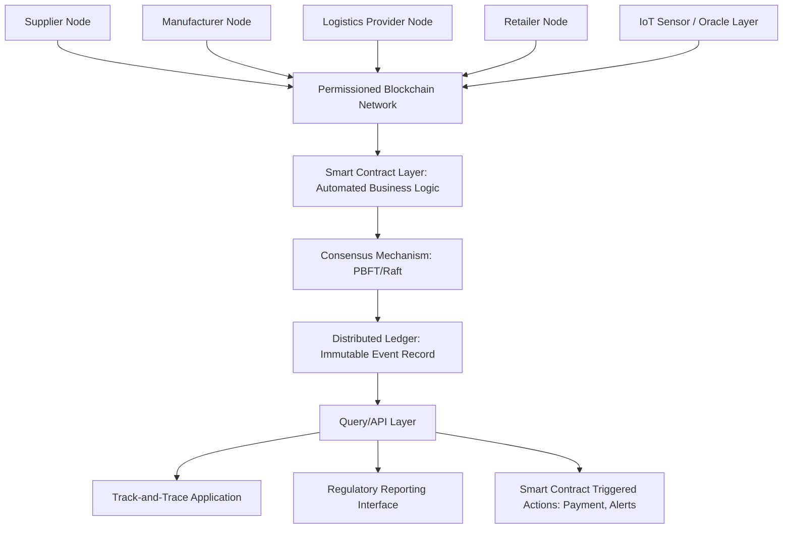

## Blockchain for Supply Chain Traceability

### Overview

Blockchain applied to supply chain traceability uses distributed ledger technology to create a shared, tamper-evident record of transactions and state changes as goods move across organizational boundaries. Its core value proposition is enabling mutually distrustful or loosely-trusting parties (competitors sharing a supply base, or parties with no pre-existing trust relationship) to agree on a shared history of events without requiring a single central authority to maintain and be trusted with that record. This distinguishes it from conventional track-and-trace databases, which are typically owned and controlled by a single organization.

### Core Technical Properties Relevant to Supply Chain

**Immutability / tamper-evidence**

Once a transaction is recorded and confirmed, altering it requires altering all subsequent blocks and achieving consensus across the distributed network to accept the change—computationally and organizationally impractical in a properly designed system. This does not guarantee the *original* data entered was accurate (a fraudulent input recorded to the chain remains fraudulent, just immutably so), which is a frequently misunderstood limitation.

**Decentralization / distributed consensus**

No single party unilaterally controls the ledger; changes require agreement according to the network's consensus mechanism. For supply chain applications, this typically means a **permissioned/consortium blockchain** (participants are known, vetted entities—suppliers, manufacturers, logistics providers) rather than a fully public, permissionless blockchain like those used for cryptocurrency.

**Smart contracts**

Self-executing code stored on the blockchain that automatically performs actions when predefined conditions are met (e.g., automatically releasing payment when a shipment's delivery is confirmed via an oracle-fed GPS/IoT signal, or flagging a batch as non-compliant if a temperature threshold is breached during transit).

**Cryptographic hashing and provenance chaining**

Each block contains a cryptographic hash of the previous block, creating a verifiable chain; for supply chain traceability, this is used to link sequential custody/state-change events for a given item or lot in a way that any alteration to historical records becomes detectable.

### Permissioned vs. Public Blockchain for Supply Chain

| Dimension | Permissioned/Consortium | Public/Permissionless |
| --- | --- | --- |
| Participant identity | Known, vetted members | Anonymous/pseudonymous |
| Governance | Consortium-defined rules | Protocol-defined, decentralized |
| Transaction throughput | Higher (fewer nodes, optimized consensus) | Lower (broad decentralization overhead) |
| Data privacy control | Fine-grained (selective sharing among members) | Limited (typically fully transparent) |
| Regulatory/compliance fit | Better suited to commercial confidentiality needs | Poor fit for most B2B supply chain data |
| Common consensus mechanism | Practical Byzantine Fault Tolerance (PBFT), Raft | Proof of Work, Proof of Stake |

[Inference] Nearly all production supply chain blockchain implementations use permissioned/consortium architectures (e.g., Hyperledger Fabric-based systems) rather than public blockchains, because supply chain participants require known counterparty identity, governance control over who can join and write to the ledger, and the ability to restrict sensitive commercial data (pricing, volumes) to relevant parties rather than exposing it network-wide—requirements that conflict with the transparency model of public blockchains.

### Architecture Pattern

**Oracle layer significance**: blockchains cannot natively access external real-world data (a sensor reading, a GPS coordinate); an **oracle**—a trusted or cryptographically-attested data feed—bridges physical-world IoT/sensor data into the blockchain, and the reliability of this oracle layer is often the actual point of trust in the system, since the blockchain itself only guarantees the immutability of data *after* it has been recorded, not the accuracy of that data at the point of entry.

### Where Blockchain Adds Genuine Value vs. Where It Is Overengineered

**Genuine value scenarios**

- **Multi-party mutual distrust with need for shared truth**: when several independent organizations (that may not fully trust each other, including competitors sharing common sub-suppliers) need to agree on a shared event history without appointing one party as the trusted central record-keeper
- **High-value provenance verification with fraud/counterfeiting risk**: luxury goods, pharmaceuticals, and conflict-mineral-sensitive materials, where the economic incentive to falsify origin claims is high and cryptographic tamper-evidence provides meaningful deterrent and audit value
- **Cross-border, multi-jurisdiction transactions requiring shared audit trail**: where a single centralized system operator would create jurisdictional or antitrust complications among competing participants

**Commonly overengineered scenarios**

- **Single-organization internal tracking**: where all relevant data is already under one entity's control, a permissioned blockchain adds consensus and distributed-ledger overhead without solving a trust problem that does not exist internally — a conventional database is typically simpler, faster, and cheaper
- **Two-party relationships with existing trust/contracts**: where a bilateral contractual relationship and existing EDI/API integration already establish sufficient trust and auditability, blockchain's multi-party consensus overhead offers limited incremental value
- **Data quality problems at the source**: blockchain guarantees immutability of recorded data, not accuracy of that data at entry — if the fundamental problem is unreliable or fraudulent data capture at the point of origin (a supplier misreporting a harvest location), blockchain does not solve this "garbage in, immutable garbage out" problem; it requires complementary solutions (IoT sensor verification, physical/chemical testing, third-party audit) addressed at the data capture layer

[Inference] This distinction is important because blockchain has at times been proposed as a general-purpose supply chain visibility solution rather than a targeted tool for specific multi-party trust problems; evaluating any specific application against the "genuine value" criteria above helps avoid investing in blockchain infrastructure where a conventional shared database or API integration would achieve the same traceability outcome with lower complexity and cost.

### Representative Use Case: Food Safety Traceability

A widely cited pattern (reflecting the type of architecture pursued by industry consortium initiatives such as IBM Food Trust and similar programs) applies blockchain to farm-to-table food traceability:

1. Farm/grower records harvest event (location, date, lot ID) to the blockchain
2. Each subsequent handler (processor, distributor, retailer) records custody transfer and any transformation events
3. Temperature/condition data from cold-chain IoT sensors is periodically anchored to the ledger via the oracle layer
4. In the event of a contamination incident, retailers or regulators can query the chain to trace the affected lot back to its specific farm origin in a fraction of the time required by paper-based or siloed-database traceability methods

[Inference] The commonly cited benefit in such implementations is a dramatic reduction in trace time (from days using traditional paper/siloed-system methods to seconds/minutes via blockchain query), which directly improves recall precision (see Track-and-Trace System Design topic) by narrowing the scope of affected product identified during an active food safety incident.

### Integration with Existing Traceability Standards

Blockchain implementations for supply chain traceability are generally not a replacement for standards like EPCIS (see Track-and-Trace System Design topic), but rather an alternative or complementary storage/consensus layer:

- EPCIS defines *what* traceability data looks like (the What/Where/When/Why event structure)
- Blockchain defines *how* that data is stored, shared, and made tamper-evident across multiple organizational participants

Some implementations record full EPCIS-formatted events directly to the blockchain; others record only a cryptographic hash of the event data (with full data stored off-chain in each participant's own system), using the on-chain hash purely as a tamper-evidence anchor while keeping bulk data storage costs and privacy exposure lower.

### Smart Contract Applications in Supply Chain

| Application | Trigger Condition | Automated Action |
| --- | --- | --- |
| Automated payment release | Delivery confirmation via GPS/IoT oracle | Release payment from escrow to supplier |
| Quality-based conditional acceptance | Sensor data confirms cold chain compliance | Automatically mark shipment as accepted |
| Penalty/rebate calculation | SLA breach detected (late delivery threshold) | Automatically calculate and apply contractual penalty |
| Automated compliance flagging | Origin data matches a restricted/sanctioned source list | Automatically flag lot for compliance review, halt further transfer |

[Inference] Smart contract reliability for these applications depends entirely on the accuracy of the oracle-fed input data, reinforcing that the traceability data capture layer (sensors, GPS, manual entry validation) remains the critical trust dependency even in a fully smart-contract-automated workflow.

### Limitations and Practical Challenges

- **Onboarding and standardization overhead**: getting all relevant supply chain participants (including smaller Tier 2/3 suppliers with limited technical infrastructure) onto a common blockchain platform with consistent data formats is often the largest practical barrier, exceeding the technical complexity of the blockchain itself
- **Governance complexity**: consortium blockchains require ongoing agreement among participants (who can join, what data is shared, how disputes are resolved), which can be organizationally slower and more contentious than technology deployment
- **Data privacy vs. transparency tension**: participants often want traceability benefits without exposing competitively sensitive volume, pricing, or sub-supplier relationship data to other consortium members, requiring careful selective-disclosure design
- **Scalability and throughput**: while permissioned blockchains offer better throughput than public chains, very high-transaction-volume supply chains (e.g., high-SKU-count retail) may still face performance and cost considerations at scale compared to conventional databases
- **Legacy system integration cost**: connecting existing ERP/WMS/TMS systems to a blockchain layer requires middleware development, which is a genuine implementation cost distinct from the blockchain platform itself

### Key Points

- Blockchain's core supply chain value proposition is enabling multiple, potentially mutually distrustful parties to share a tamper-evident record without a central trusted authority—a fundamentally multi-party trust problem, not a general-purpose data storage upgrade.
- Blockchain guarantees immutability of recorded data, not accuracy of that data at the point of entry; the oracle layer bridging physical-world sensor/IoT data into the chain remains the critical trust dependency, and garbage data recorded to a blockchain remains immutably unreliable.
- Permissioned/consortium blockchain architectures (not public blockchains) are the dominant pattern for production supply chain implementations, given the need for known participant identity, governance control, and selective data privacy.
- Blockchain should be evaluated against specific multi-party trust criteria before adoption; single-organization tracking, established bilateral trust relationships, and source data quality problems are commonly cited as scenarios where blockchain adds complexity without solving the actual underlying problem.

**Related Topics**

- Track-and-Trace System Design (EPCIS standards as the data structure blockchain systems often carry)
- N-Tier Visibility Architecture (multi-party consortium data sharing challenges)
- IoT sensor integration and oracle layer reliability for cold chain and condition monitoring
- Smart contract design patterns for automated trade finance and payment release
- Permissioned blockchain platform selection (Hyperledger Fabric, Corda, and similar consortium frameworks)
- Conflict minerals and high-value goods provenance verification
- Food safety traceability regulatory requirements (FSMA and international equivalents)