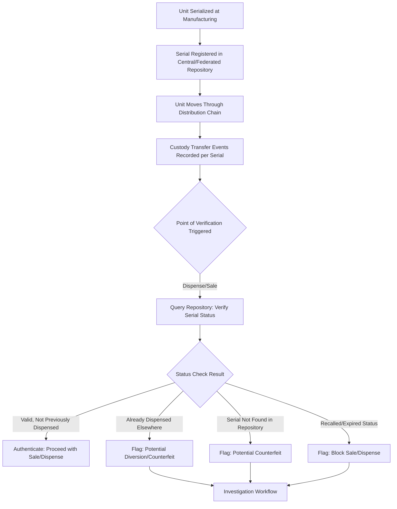

## Serialization and Product Provenance Tracking


### Overview

Serialization is the assignment of a unique identifier to each individual unit of a product, rather than tracking at the batch, lot, or SKU-class level. Product provenance tracking builds on serialization to establish and verify the documented chain of custody and origin claims for a specific unit throughout its life, from manufacture through distribution to end sale. Together they form the highest-granularity tier of the traceability hierarchy introduced in Track-and-Trace System Design, and are typically deployed where regulatory mandate, anti-counterfeiting need, or high unit value justifies the additional cost over batch/lot-level tracking.

### Serialization vs. Batch/Lot Tracking

| Dimension | Batch/Lot Tracking | Unit-Level Serialization |
| --- | --- | --- |
| Identifier scope | Shared across all units in a production run | Unique per individual unit |
| Recall precision | Recalls entire batch even if only some units affected | Can isolate exact affected units |
| Anti-counterfeiting capability | Limited (lot number can be copied across counterfeits) | Strong (each serial number verifiable individually) |
| Data volume | Low (one record per batch) | High (one record per unit, potentially billions at scale) |
| Implementation cost | Lower (existing lot-marking practices often sufficient) | Higher (unique code generation, printing/marking, verification infrastructure) |
| Typical mandate driver | General food safety, general manufacturing | Pharmaceuticals, high-value goods, specific regulatory serialization mandates |

### Regulatory Serialization Mandates

**US Drug Supply Chain Security Act (DSCSA)**

Requires prescription drug packages to bear a unique product identifier (product code, serial number, lot number, expiration date) and mandates increasing interoperable, electronic traceability across the pharmaceutical distribution chain, with the framework designed to progress toward full unit-level electronic verification at the point of dispense.

**EU Falsified Medicines Directive (FMD)**

Requires prescription medicines sold in the EU to carry a unique identifier (typically a 2D data matrix code) and a tamper-evident feature, verified against a centralized European repository system at the point of dispensing to confirm authenticity before the product reaches the patient.

**China's Drug Traceability System**

Mandates unique identification codes for pharmaceutical products, feeding into a centralized government-operated traceability platform.

[Inference] These regulatory regimes share a common structural pattern despite differing in specific technical requirements: unique unit-level identification, a centralized or federated verification repository, and a point-of-dispense/point-of-sale check against that repository to confirm the unit is genuine and has not already been dispensed elsewhere (preventing both counterfeiting and diversion). Exact technical specifications, compliance deadlines, and repository architecture differ meaningfully by jurisdiction and are updated periodically, so implementation teams should verify current requirements against the relevant regulatory authority's latest published guidance rather than relying on general pattern knowledge alone.

### Serialization Identifier Architecture

**Hierarchical identifier structure**

A well-designed serialization scheme typically encodes multiple layers of information within or alongside the unique serial number:

- **Product identifier** (e.g., GTIN): identifies the product class/SKU
- **Serial number**: unique value distinguishing this specific unit from all others of the same product identifier
- **Batch/lot number**: retained even in serialized systems, linking the unit back to its production batch for manufacturing-level quality investigations
- **Expiration/manufacture date**: particularly critical for pharmaceuticals and perishables

**Combined encoding example (GS1 2D Data Matrix pattern, common in pharmaceutical serialization)**



```
(01) 00312345678905  ← GTIN (Application Identifier 01)
(21) SN123456789ABC   ← Serial Number (Application Identifier 21)
(17) 261231           ← Expiration Date YYMMDD (Application Identifier 17)
(10) LOT789XYZ        ← Batch/Lot Number (Application Identifier 10)
```

This combined structure allows a single scan to simultaneously support unit-level serialization use cases (authentication, anti-diversion) and batch-level use cases (recall scoping, manufacturing quality investigation) without maintaining separate identifier systems.

### Serial Number Generation and Management

**Randomization requirements**

Many regulatory frameworks (including DSCSA and FMD) require serial numbers to be sufficiently random/non-sequential to prevent counterfeiters from predicting valid serial numbers based on observed patterns. This typically requires a **serial number management system** that generates, allocates, and tracks issued serials, rather than simple sequential counters.

**Serial number pool management**

Given the throughput requirements of high-volume manufacturing lines (packaging lines can require thousands of unique serials per minute), architecture typically pre-generates and caches serial number pools at line-level systems, avoiding real-time round-trips to a central generation authority for every single unit — with reconciliation back to the central system to prevent pool overlap across multiple lines/facilities.

### Provenance Verification Architecture



The critical design principle here is the **status check at point of dispense/sale**: verification is most valuable at the final transaction point, since this is where a counterfeit or diverted unit would otherwise successfully reach the end consumer undetected.

### Anti-Counterfeiting Applications

Serialization's anti-counterfeiting value derives from three properties working together:

- **Uniqueness**: each legitimate unit has exactly one valid serial number, so any duplicate or unregistered serial encountered in the field is immediately suspect
- **Verifiability at point of transaction**: enabling real-time or near-real-time checking against the authoritative repository, rather than relying on visual inspection of a physical security feature alone
- **Non-predictability**: randomized (non-sequential) serials prevent counterfeiters from generating plausible-looking fake serials by extrapolating from observed legitimate ones

**Layered anti-counterfeiting approach**

[Inference] Serialization is typically deployed as one layer within a broader anti-counterfeiting strategy rather than a standalone solution, since a sufficiently sophisticated counterfeiter could in principle clone a legitimate serial number onto a fake product; combining serialization with physical security features (holograms, tamper-evident seals, forensic taggants) and, for high-risk categories, physical/chemical origin verification provides defense in depth rather than relying on any single mechanism.

### Provenance for Non-Pharmaceutical High-Value Goods

**Luxury goods**

Brands increasingly embed serialized identifiers (often paired with NFC chips or QR codes) allowing consumers to verify authenticity and view a product's documented provenance history directly, addressing both counterfeiting and, for resale markets, establishing legitimate chain-of-custody value.

**Diamonds and precious materials (Kimberley Process and beyond)**

The Kimberley Process Certification Scheme establishes chain-of-custody documentation for rough diamonds to prevent "conflict diamond" entry into legitimate supply chains; contemporary implementations increasingly pair this documentary process with physical provenance techniques (e.g., laser inscription of unique identifiers on individual stones) to strengthen the link between the physical unit and its documented origin claim.

**Art and collectibles**

Provenance tracking here is largely documentary (ownership history, certificates of authenticity) rather than manufacturing serialization, but increasingly incorporates digital certificates and, in some implementations, blockchain-anchored ownership records (see Blockchain for Supply Chain Traceability topic) to create tamper-evident provenance chains for high-value transactions.

### Data Volume and Infrastructure Considerations

[Inference] Unit-level serialization at scale generates data volumes substantially larger than batch-level tracking — a facility producing millions of units annually generates a corresponding number of unique serial records plus associated event history at every custody transfer point, which has direct infrastructure implications:

- **Database architecture** must support high-throughput writes at packaging line speed and high-throughput reads at distributed verification points (pharmacies, retail points of sale) with low latency, since verification checks occurring at transaction time cannot tolerate significant delay
- **Repository architecture choice** (fully centralized vs. federated/distributed) involves trade-offs between verification consistency (a single source of truth) and resilience/latency (avoiding a single point of failure or a long-distance round-trip for every local transaction) — many national pharmaceutical verification systems use federated architectures for this reason
- **Master data synchronization** between manufacturers, distributors, and repository operators must handle serial number registration promptly enough that legitimate units are verifiable as soon as they enter the distribution chain, avoiding false "not found" flags on genuine product

### Integration with Broader Traceability Systems

Serialization is not a standalone system but the highest-granularity data layer within the broader track-and-trace architecture (see Track-and-Trace System Design topic): serialized unit events are recorded using the same EPCIS event patterns (ObjectEvent, AggregationEvent, TransformationEvent) with the serial number as the "What" component at maximum granularity, and serialization data feeds into N-Tier visibility and control tower systems exactly as batch/lot-level data would, simply at finer resolution.

### Key Points

- Serialization trades higher implementation cost and data volume for maximum recall precision and anti-counterfeiting capability, making it most commonly justified by specific regulatory mandate (pharmaceuticals) or high unit value/counterfeiting risk (luxury goods, precious materials) rather than applied universally.
- Regulatory serialization regimes (DSCSA, EU FMD, and international equivalents) share a common structural pattern of unique unit identification plus point-of-dispense verification against a repository, though exact technical requirements and deadlines are jurisdiction-specific and should be verified against current official guidance.
- Non-sequential, randomized serial number generation combined with point-of-transaction verification against an authoritative repository are the two properties that give serialization its anti-counterfeiting value; serialization alone is typically deployed as one layer within a broader, multi-layered anti-counterfeiting strategy.
- Serialization data integrates into the same EPCIS-based track-and-trace architecture used for batch/lot tracking, simply at finer identifier granularity, and inherits the same data volume, repository architecture, and synchronization considerations at correspondingly larger scale.

**Related Topics**

- Track-and-Trace System Design (EPCIS event structures at serialized granularity)
- Blockchain for Supply Chain Traceability (as a provenance verification layer for high-value goods)
- Pharmaceutical supply chain compliance (DSCSA, EU FMD implementation specifics)
- Anti-counterfeiting strategy design and layered security feature selection
- Kimberley Process and conflict-free sourcing certification for precious materials
- Federated vs. centralized repository architecture for national verification systems
- Recall management and precision scoping using serialized identifiers