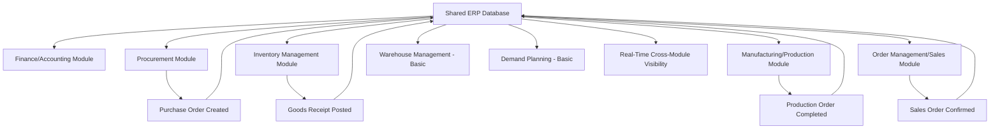
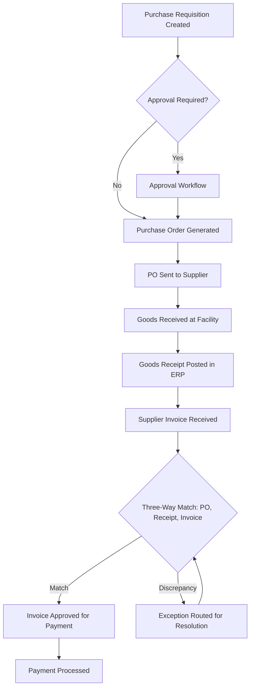
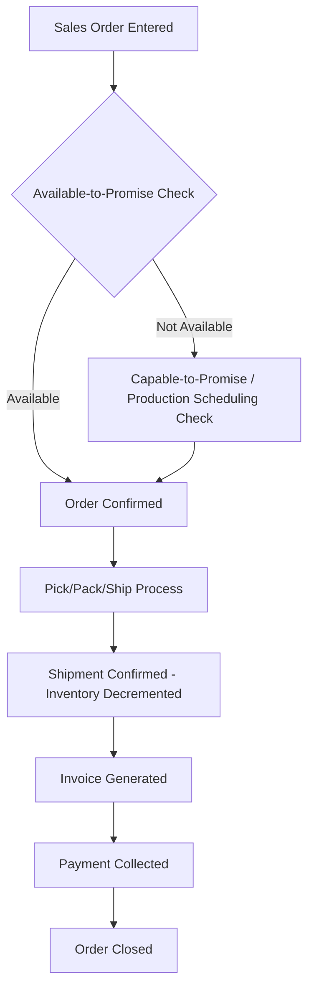
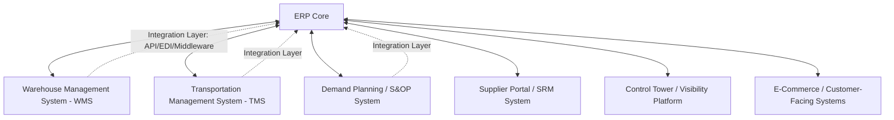

## ERP Systems and Supply Chain Modules

### Overview

Enterprise Resource Planning (ERP) systems provide the integrated transactional backbone for supply chain operations, unifying financial, procurement, inventory, manufacturing, and order management data within a single logical system of record. Supply chain modules within an ERP handle the day-to-day transaction processing (purchase orders, inventory movements, production orders) that other specialized systems—TMS, WMS, control towers—consume, augment, or orchestrate around.

### Core ERP Architectural Concept

An ERP's defining architectural principle is a **shared, unified database** across functional modules, eliminating the data silos and reconciliation burden of separate, disconnected departmental systems. A transaction entered in one module (e.g., a goods receipt in inventory management) is immediately reflected in related modules (e.g., accounts payable three-way matching, available-to-promise calculations in order management) without manual data transfer or batch reconciliation between separate systems.

### Core Supply Chain-Relevant ERP Modules

**Procurement / Purchasing (P2P — Procure-to-Pay)**

Manages the full cycle from purchase requisition through purchase order issuance, goods receipt, invoice matching, and payment. Key functions include vendor master data management, purchase order approval workflows, and three-way matching (purchase order, goods receipt, invoice) to prevent payment discrepancies.

**Inventory Management**

Tracks stock levels, locations, and movements across the organization's facilities. Core functions include stock valuation (FIFO, LIFO, weighted average costing methods), cycle counting and physical inventory reconciliation, and reorder point/safety stock parameter management feeding replenishment triggers.

**Manufacturing / Production Planning (MRP — Materials Requirements Planning)**

Translates demand (forecast or actual orders) into material and production requirements, generating planned production orders and purchase requisitions based on bill of materials (BOM) explosion and lead time offsetting. Modern ERP MRP modules are typically extended into MRP II (Manufacturing Resource Planning), incorporating capacity constraints alongside material requirements.

**Order Management / Order-to-Cash (O2C)**

Manages the customer order lifecycle from order entry through fulfillment, shipping, invoicing, and payment collection, including available-to-promise (ATP) and capable-to-promise (CTP) checks against inventory and production capacity.

**Warehouse Management (Basic/Embedded)**

Many ERPs include embedded, lighter-weight warehouse management functionality (bin location tracking, basic pick/pack/ship workflows) suitable for simpler distribution operations, though high-complexity warehouse operations typically require a dedicated best-of-breed WMS (see related topic) integrated with the ERP rather than relying on embedded functionality alone.

**Demand Planning / Forecasting (Basic/Embedded)**

Provides foundational statistical forecasting capability, though organizations with sophisticated demand planning requirements typically layer a dedicated demand planning or S&OP (Sales and Operations Planning) system on top of, or integrated with, the ERP's transactional data.

### The Procure-to-Pay (P2P) Process Flow

### The Order-to-Cash (O2C) Process Flow

### MRP Logic Fundamentals

Materials Requirements Planning operates on a core calculation logic that translates a Master Production Schedule (MPS) into time-phased material and component requirements:

$$Net\ Requirements = Gross\ Requirements - (On\text{-}hand\ Inventory + Scheduled\ Receipts)$$

This calculation is performed recursively down the bill of materials structure (BOM explosion): the net requirement for a finished good generates gross requirements for its component parts (offset by each component's own lead time), which in turn generates requirements for sub-components, continuing down to purchased raw materials.

**Lead time offsetting**: MRP calculates when to *start* production or *place* a purchase order by working backward from the required completion date, subtracting the item's lead time — this is why accurate lead time master data is foundational to MRP output quality, since systematic lead time inaccuracy propagates errors throughout the entire planning cascade.

### Major ERP Platform Landscape

| Platform Tier | Representative Systems | Typical Target Segment |
| --- | --- | --- |
| Tier 1 (Enterprise) | SAP S/4HANA, Oracle Cloud ERP (Fusion) | Large multinational enterprises, complex multi-entity operations |
| Tier 2 (Mid-Market) | Microsoft Dynamics 365, Infor CloudSuite, Epicor | Mid-market manufacturers and distributors |
| Tier 3 (Small Business) | NetSuite (also used by larger orgs), Odoo, smaller cloud ERPs | Small to mid-size businesses, faster/lower-cost implementation |
| Industry-Specific | Various vertical ERPs (e.g., for process manufacturing, apparel, food & beverage) | Companies with industry-specific process requirements not well served by generalist ERPs |

[Inference] Platform selection typically depends on organizational scale, process complexity, industry-specific requirements (e.g., process manufacturing with co-products/by-products, or apparel with size/color matrix management), existing technology ecosystem (particularly for Microsoft- or Oracle-centric IT environments), and total cost of ownership including implementation and ongoing customization/maintenance cost, rather than any single platform being universally superior.

### ERP as System of Record vs. Best-of-Breed Specialized Systems

A recurring architectural decision in supply chain technology strategy is the balance between relying on ERP-embedded functionality versus integrating dedicated best-of-breed specialized systems:

| Function | ERP-Embedded Adequate When | Best-of-Breed Preferred When |
| --- | --- | --- |
| Warehouse management | Simple, low-SKU, single-facility operations | Complex, high-volume, multi-facility, automation-integrated operations |
| Transportation management | Simple carrier relationships, domestic-only | Multi-modal, international, complex carrier optimization needs |
| Demand planning | Stable, low-variability demand patterns | Complex, high-variability, multi-echelon planning needs |
| Warehouse execution / automation | Manual/basic pick processes | Automated material handling, robotics integration |

[Inference] This is fundamentally a build-vs-integrate trade-off common across enterprise architecture generally: ERP-embedded modules reduce integration complexity and total system count (fewer interfaces to maintain, single vendor relationship) but typically offer less depth of functionality than a system purpose-built for a specific domain, so the decision usually hinges on how far the organization's specific operational complexity exceeds the embedded module's designed capability ceiling.

### Integration Architecture with Adjacent Systems

Because ERP is rarely the sole system in a supply chain technology stack, integration patterns to adjacent specialized systems are a core architectural concern:

**Common integration mechanisms**:

- **EDI (Electronic Data Interchange)**: standardized transaction formats (e.g., X12, EDIFACT) for exchanging purchase orders, invoices, and advance ship notices with trading partners; remains widely used in supply chain B2B transactions despite being an older technology paradigm
- **API-based integration**: REST/SOAP APIs for real-time data exchange between the ERP and adjacent systems, increasingly favored for new integrations over batch-file-based methods
- **iPaaS (Integration Platform as a Service)**: middleware platforms (e.g., MuleSoft, Boomi, Dell Boomi) that manage transformation, routing, and orchestration across multiple point-to-point integrations, reducing the complexity of maintaining many bilateral system connections

### Master Data Management Within ERP

Supply chain ERP effectiveness depends heavily on master data quality across several core entities:

- **Material master**: product attributes, units of measure, lead times, sourcing data, planning parameters (safety stock, reorder points, lot sizing rules)
- **Vendor master**: supplier identification, payment terms, addresses, approved sourcing relationships
- **Bill of Materials (BOM)**: component structure for each manufactured item, driving MRP explosion accuracy
- **Routing/work center data**: for manufacturing modules, defines the sequence of operations and capacity requirements for production

[Inference] Because MRP and other planning logic is fundamentally a calculation performed against this master data, inaccurate master data (wrong lead times, outdated BOMs, incorrect safety stock parameters) is a commonly cited root cause of poor planning output even when the underlying ERP system and algorithms are functioning correctly — this is frequently summarized as a "garbage in, garbage out" dynamic and is why master data governance is treated as an ongoing operational discipline rather than a one-time implementation task.

### Deployment Models

- **On-premises**: ERP hosted on company-owned/managed infrastructure, offering maximum customization control but requiring internal IT infrastructure management and typically higher upfront capital cost
- **Cloud/SaaS**: ERP hosted and managed by the vendor, offering lower upfront cost, automatic updates, and reduced internal IT burden, at the cost of some customization flexibility and dependency on vendor infrastructure/update cadence
- **Hybrid**: core ERP on one deployment model with specific modules or extensions on another, often used during phased cloud migration

[Inference] The industry trend over the past decade has been a general shift toward cloud/SaaS ERP deployment, driven by lower upfront cost, reduced internal infrastructure burden, and vendor-driven innovation cadence, though large enterprises with extensive historical customization of on-premises systems often face substantial migration complexity and cost that can extend transition timelines considerably.

### Key Points

- ERP's core value for supply chain operations is the unified, shared data model across procurement, inventory, manufacturing, and order management, eliminating reconciliation burden between siloed departmental systems.
- MRP's core logic—net requirements calculation via BOM explosion with lead time offsetting—depends fundamentally on accurate master data (lead times, BOMs, planning parameters), making master data governance a critical and ongoing operational discipline rather than a one-time setup task.
- The build-vs-integrate decision between ERP-embedded modules and best-of-breed specialized systems (WMS, TMS, demand planning) should be driven by how far actual operational complexity exceeds the embedded module's functional ceiling, not treated as a uniform choice across all functions.
- Because ERP typically operates within a broader systems ecosystem, integration architecture (EDI, API, iPaaS middleware) is a core and ongoing architectural concern, not a one-time implementation activity, particularly as organizations add or replace adjacent best-of-breed systems over time.

**Related Topics**

- Warehouse Management Systems (WMS) architecture and ERP integration patterns
- Transportation Management Systems (TMS) and multi-modal routing optimization
- Master data management governance frameworks
- MRP vs. MRP II vs. DDMRP (Demand-Driven MRP) planning methodologies
- EDI transaction standards and B2B integration architecture
- Cloud ERP migration strategy and legacy system decommissioning
- Sales and Operations Planning (S&OP) process integration with ERP demand data