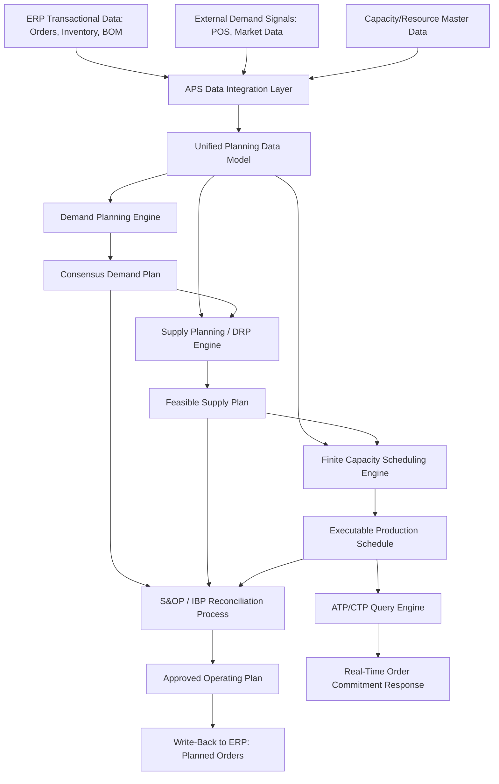
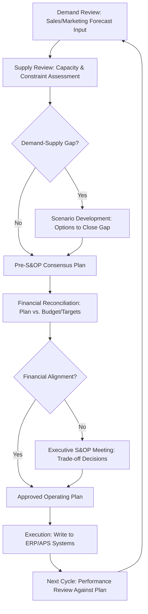

## Advanced Planning and Scheduling Systems

### Overview

Advanced Planning and Scheduling (APS) systems are specialized software layers that sit above or alongside ERP transactional systems, applying optimization and simulation algorithms to solve planning problems that basic ERP MRP logic cannot handle well—specifically, problems involving finite capacity constraints, multi-echelon dependencies, and simultaneous optimization across competing objectives. Where MRP calculates *what* is needed and *when* based on infinite-capacity assumptions, APS determines *how* to feasibly and optimally sequence and allocate constrained resources to meet those requirements.

### Why APS Exists: The MRP Capacity Gap

Standard MRP logic (see ERP Systems and Supply Chain Modules topic) performs infinite-capacity planning: it calculates when orders *should* start based on lead time offsetting, without checking whether the required production capacity, labor, or material actually exists at that time. This frequently produces theoretically correct but practically infeasible schedules—multiple orders "requiring" the same bottleneck resource simultaneously.

APS addresses this gap through **finite capacity scheduling**, explicitly modeling resource constraints (machine availability, labor shift patterns, tooling changeover time) and producing schedules that are executable given actual constrained capacity, not just materially sufficient.

$$\text{MRP output: theoretically required timing} \neq \text{APS output: feasible executable schedule}$$

### Core APS Functional Domains

**Demand Planning**

Statistical and machine learning-based forecasting, often incorporating causal factors (promotions, price changes, weather, macroeconomic indicators) beyond simple historical extrapolation, and supporting collaborative forecast adjustment across sales, marketing, and supply chain stakeholders.

**Supply Planning / Distribution Requirements Planning (DRP)**

Determines how to allocate available or planned supply across multiple distribution nodes and time periods to meet forecasted and actual demand, extending single-facility MRP logic across a multi-echelon network.

**Production Scheduling (Finite Capacity Scheduling, FCS)**

Sequences and schedules production orders against actual, finite machine/labor/tooling capacity, typically using optimization algorithms to minimize a combination of changeover time, late orders, and resource idle time.

**Sales and Operations Planning (S&OP) / Integrated Business Planning (IBP)**

A cross-functional process (supported by APS tools) that reconciles demand plans, supply capability, and financial targets into a single consensus operating plan, typically on a monthly cycle, escalating unresolved conflicts (demand exceeding feasible supply, or financial targets misaligned with operational capability) to executive review.

**Available-to-Promise / Capable-to-Promise (ATP/CTP)**

Real-time or near-real-time checking of whether a specific customer order commitment can be met from existing inventory (ATP) or from feasible future production capacity (CTP), often the most latency-sensitive APS function since it operates at the point of order entry.

### APS System Architecture

**Write-back architecture significance**: APS systems typically operate on a copy or extract of ERP data (to enable computationally intensive optimization without impacting transactional system performance), then write approved planning results back into the ERP as planned or firmed orders — this separation of planning and transactional processing is a defining APS architectural pattern distinct from performing planning calculations directly within the ERP.

### Optimization Techniques Underlying APS

**Linear and Mixed-Integer Programming (LP/MIP)**

Used for supply/distribution planning problems where the objective (minimize cost, maximize service level) and constraints (capacity limits, minimum order quantities) can be expressed as linear relationships, solved to global or near-global optimality using commercial solvers.

**Constraint-Based Scheduling**

For production scheduling, constraint programming techniques model complex sequencing rules (changeover sequences, resource eligibility, precedence relationships) that are difficult to express in pure linear form, often solved via heuristic or metaheuristic search (genetic algorithms, simulated annealing, tabu search) when problem size makes exact optimization computationally impractical.

**Theory of Constraints (TOC) / Bottleneck-Focused Scheduling**

Some APS scheduling approaches explicitly identify the system's bottleneck resource and subordinate all other scheduling decisions to maximizing bottleneck utilization, based on the principle that overall system throughput is limited by its most constrained resource regardless of how efficiently non-bottleneck resources are utilized.

**Simulation-Based Planning**

Discrete-event simulation models the probabilistic behavior of the network under uncertainty (demand variability, yield variability, equipment failure rates), used particularly for evaluating plan robustness rather than generating a single deterministic optimal schedule.

### Multi-Echelon Inventory Optimization (MEIO)

A specialized APS capability that determines optimal inventory targets (safety stock, reorder points) simultaneously across multiple network echelons (raw material, component, finished goods at multiple distribution tiers), accounting for how variability and lead time compound across echelons—in contrast to single-echelon methods that optimize each stocking point's inventory independently without considering network-wide interactions.

$$SS_{total\_network} \neq \sum_{i} SS_{single\text{-}echelon,i}$$

[Inference] MEIO typically produces lower total network inventory than independently optimized single-echelon safety stock, because it accounts for risk pooling and the actual propagation of variability through lead times across echelons rather than treating each stocking point's demand variability as if it must be independently buffered—this is analytically related to, though more complex in multi-echelon application than, the basic square root law of inventory pooling.

### S&OP / IBP Process Cycle

**IBP distinction from traditional S&OP**: Integrated Business Planning extends the classical S&OP process by more tightly integrating financial planning into the same cycle (rather than reconciling financials as a separate, later step) and often operates at a greater level of product/customer granularity, supported by more sophisticated underlying APS technology than earlier generation S&OP tools required.

### Comparison: MRP vs. APS vs. S&OP/IBP

| Dimension | MRP (ERP-native) | APS (Finite Capacity) | S&OP/IBP |
| --- | --- | --- | --- |
| Capacity assumption | Infinite | Finite, explicitly modeled | Aggregate feasibility check |
| Time horizon | Short-term operational | Short-to-medium term | Medium-to-long term (rolling 12-24 months typical) |
| Granularity | Item/order level | Item/order/resource level | Product family/category level |
| Primary output | Planned orders | Executable schedule | Consensus operating plan |
| Cross-functional scope | Supply chain/operations only | Supply chain/operations | Sales, marketing, finance, operations |
| Update frequency | Continuous/daily | Daily-to-weekly | Monthly cycle (typical) |

### Implementation Architecture Considerations

**Planning horizon segmentation**

APS systems typically implement distinct planning logic across different time horizon segments, since the appropriate level of detail and the primary planning objective differ by horizon:

- **Strategic horizon** (12+ months): network design, capacity investment decisions — typically supported by separate network optimization tools rather than day-to-day APS
- **Tactical horizon** (1-12 months): S&OP/IBP-level aggregate planning, supply/demand balancing
- **Operational horizon** (days-to-weeks): finite capacity scheduling, detailed sequencing

**Data synchronization frequency**

Because APS operates on data extracted/replicated from ERP and other source systems, synchronization frequency (real-time, near-real-time, or batch) is a key architectural decision balancing planning accuracy (fresher data produces more accurate plans) against system performance and integration complexity (more frequent synchronization increases integration overhead and computational load).

**Exception-based planning**

Given the volume of planning decisions in a typical operation, mature APS implementations emphasize exception-based review—surfacing only plans or schedule elements that violate constraints, fall outside acceptable parameters, or require human judgment—rather than requiring planners to manually review every generated planning output, analogous to the alert/exception management principles described in the Real-Time Alerting topic.

### Common Implementation Challenges

[Inference] Based on the general pattern of enterprise planning system implementations, several challenges are commonly reported:

- **Master data quality dependency**: APS optimization quality is highly sensitive to the accuracy of capacity, routing, and constraint master data; inaccurate data produces mathematically optimal but practically infeasible or suboptimal schedules — this mirrors the "garbage in, garbage out" dynamic noted for MRP but is often more consequential given APS's more complex constraint modeling
- **Organizational change management for S&OP adoption**: S&OP/IBP processes require genuine cross-functional collaboration and executive commitment to trade-off decisions; technology alone does not create the organizational alignment the process requires
- **Over-reliance on "black box" optimization**: planners who do not understand the underlying optimization logic may distrust or manually override system-generated schedules, undermining the value of the optimization investment — this is analytically related to the automation trust and decision authority considerations discussed in the Control Towers topic
- **Integration complexity with ERP and adjacent systems**: maintaining synchronized master data and transactional data flow between APS, ERP, and execution systems (WMS, MES) represents ongoing integration architecture work, not a one-time implementation task

### Key Points

- APS exists specifically to address the finite-capacity gap left by standard ERP MRP logic, converting theoretically required order timing into practically executable schedules against real resource constraints.
- The APS functional domain spans demand planning, supply/distribution planning, finite capacity scheduling, and ATP/CTP, typically unified through S&OP/IBP as the cross-functional reconciliation process operating at a higher (product family, monthly) level of aggregation than day-to-day scheduling.
- Multi-echelon inventory optimization produces materially different (typically lower) network-wide inventory targets than independently optimizing each stocking point, because it explicitly accounts for variability propagation and risk pooling across the network.
- APS optimization quality is highly sensitive to master data accuracy (capacity, routing, constraints), and organizational adoption—particularly for S&OP/IBP cross-functional processes—depends as much on change management and executive commitment as on the underlying technology capability.

**Next Steps**

- Multi-echelon inventory optimization (MEIO) algorithm selection and implementation
- Sales and Operations Planning (S&OP) organizational process design and governance
- Finite capacity scheduling algorithm selection (exact optimization vs. metaheuristics)
- ERP Systems and Supply Chain Modules (the transactional foundation APS extends)
- Demand sensing and machine learning-enhanced forecasting techniques
- Theory of Constraints and bottleneck-focused production scheduling
- Integrated Business Planning (IBP) financial reconciliation process design