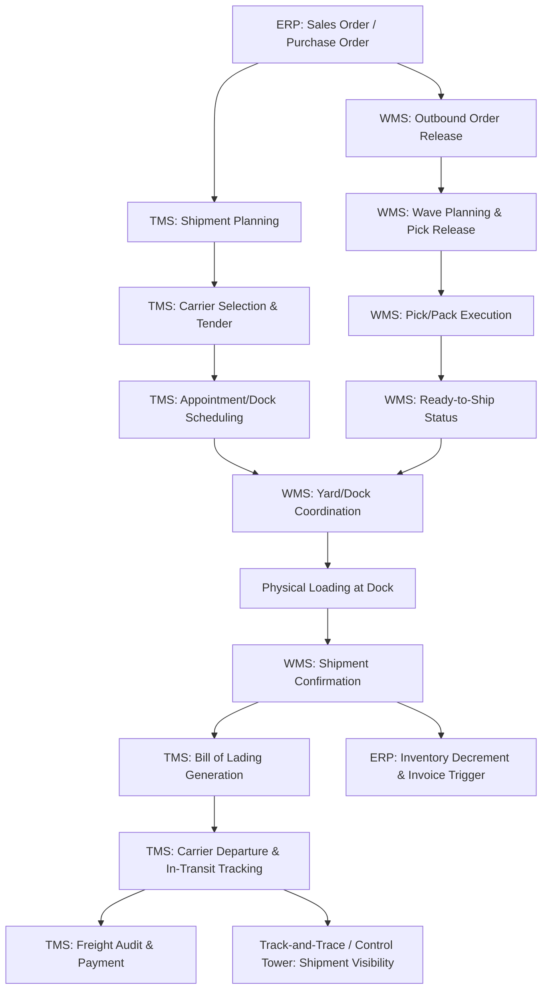
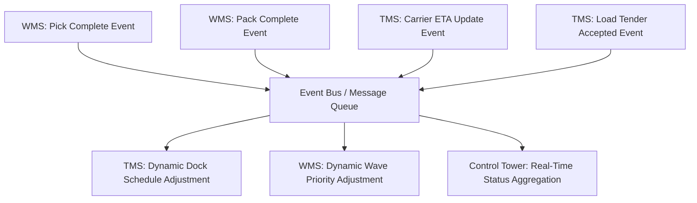

## Transportation and Warehouse Management System Integration

### Overview

Transportation Management Systems (TMS) and Warehouse Management Systems (WMS) are the two dominant execution-layer specialized systems in supply chain technology architecture, handling the movement of goods between facilities and the movement/storage of goods within facilities, respectively. While each can operate independently, their integration—with each other and with the ERP system of record—determines whether an organization achieves genuinely coordinated, end-to-end execution or merely a collection of disconnected point solutions generating reconciliation overhead.

### System Scope and Boundaries

**Transportation Management System (TMS)**

Manages the planning, execution, and optimization of the physical movement of goods between locations, typically encompassing:

- Carrier selection and rate management (contracted rates, spot market rates)
- Load planning and consolidation (combining shipments to optimize truckload utilization)
- Route optimization and mode selection (truckload, less-than-truckload, rail, ocean, air)
- Freight audit and payment (verifying carrier invoices against contracted rates and actual services)
- Shipment tracking and visibility (often integrating with track-and-trace systems described elsewhere in this domain)

**Warehouse Management System (WMS)**

Manages the operations occurring within a distribution center or warehouse facility, typically encompassing:

- Inbound receiving and putaway logic (directed putaway based on velocity, storage type requirements)
- Inventory location tracking (bin/slot-level accuracy)
- Pick, pack, and ship execution (wave planning, pick path optimization, packing/cartonization logic)
- Labor management (task assignment, productivity tracking, incentive-based labor standards)
- Yard management (trailer/dock scheduling, often as an extension or adjacent module)

### Why Integration (Not Just Coexistence) Matters

[Inference] TMS and WMS address adjacent but distinct problem domains—inside-the-four-walls execution versus between-facility movement—and the handoff point between them (the shipping dock) is precisely where uncoordinated systems most commonly produce operational friction: a WMS that completes picking without awareness of the actual assigned carrier/trailer arrival time can create dock congestion or missed carrier pickup windows, while a TMS that plans loads without real-time visibility into WMS pick/pack completion status cannot accurately predict when a shipment will actually be ready for carrier pickup.

### Core Integration Points

**Bidirectional data flow requirements**

- **TMS → WMS**: planned carrier arrival windows, load/trailer assignments, required ship-by dates driving wave planning priority
- **WMS → TMS**: actual pick/pack completion status and timing, actual package/pallet dimensions and weights (often differing from planned/estimated figures, directly affecting load planning and freight cost calculation), loading confirmation
- **Both → ERP**: inventory movement confirmation, shipment/delivery status for order-to-cash processing, cost data for landed cost and freight accrual accounting

### Sequencing and Timing Coordination

**Appointment scheduling synchronization**

A critical, frequently underestimated integration requirement is synchronizing the TMS's carrier appointment scheduling with the WMS's labor and dock capacity planning: if the TMS schedules more carrier pickups in a given window than the WMS can physically load given available dock doors and labor, the result is carrier detention costs (demurrage charges for carriers waiting beyond appointment windows) and potential service failures — this requires either a shared appointment/dock scheduling capability or tight real-time integration between the two systems' scheduling logic.

**Wave planning alignment**

WMS wave planning (grouping orders for simultaneous picking) should ideally be informed by TMS shipment consolidation decisions (which orders are being combined into a single truckload), since picking and packing orders in a sequence that does not match how they will ultimately be loaded and shipped creates unnecessary staging, re-handling, or loading sequence complications at the dock.

### Dimensional and Weight Data Reconciliation

A commonly encountered practical integration challenge: TMS load planning and freight cost estimation typically rely on planned/estimated package dimensions and weights (from product master data), while actual picked/packed dimensions and weights (captured by WMS at the point of packing, often via dimensioning/weighing equipment) frequently differ due to packaging variability, multi-item consolidation, or product master data inaccuracy.

$$\text{Freight Cost Estimate Error} \propto |\text{Planned Dimensional Weight} - \text{Actual Dimensional Weight}|$$

[Inference] Integration architectures that feed actual WMS-captured dimensional data back into the TMS (and ultimately into product master data for future planning accuracy) reduce this discrepancy over time, whereas architectures that treat TMS planning data as static and never reconciled against WMS execution reality tend to accumulate systematic freight cost estimation error, particularly for products with variable packaging configurations.

### Integration Architecture Patterns

| Pattern | Description | Trade-offs |
| --- | --- | --- |
| **Point-to-point integration** | Direct API/EDI connections between TMS, WMS, and ERP | Simple for few systems; becomes unmanageable ("integration spaghetti") as system count grows |
| **Hub-and-spoke via ERP** | ERP serves as the central integration point; TMS and WMS each integrate only with ERP | Reduces total integration count; ERP may become a bottleneck for high-frequency execution data |
| **Middleware/iPaaS orchestration** | Dedicated integration platform manages transformation, routing, and orchestration across all systems | Reduces point-to-point complexity at the cost of an additional platform to manage and a potential additional latency layer |
| **Unified/embedded suite** | Single vendor platform providing both TMS and WMS (and often ERP) natively integrated | Minimizes integration overhead; may sacrifice best-of-breed depth in one or both domains compared to specialized standalone systems |

[Inference] The choice among these patterns is generally driven by the number of systems requiring integration, the frequency and latency-sensitivity of data exchange (dock scheduling coordination typically requires near-real-time exchange, while freight audit reconciliation can tolerate batch/periodic exchange), and organizational preference for single-vendor simplicity versus best-of-breed functional depth — there is no universally correct pattern independent of these specific organizational factors.

### Event-Driven Integration for Real-Time Coordination

Given the time-sensitivity of dock/appointment coordination, modern TMS-WMS integrations increasingly favor **event-driven architecture** over traditional batch file transfers:

**Event-driven rationale**: [Inference] batch integration (e.g., nightly or hourly file exchange) is generally inadequate for dock/appointment coordination use cases specifically because the operational decisions involved (which dock door, which labor crew, whether to hold or expedite a carrier) require information that is current to within minutes, not hours; event-driven/message-based architecture (using patterns like publish-subscribe over a message queue or event bus) allows each system to react to relevant state changes in the other system as they occur, rather than waiting for the next batch cycle.

### Data Model Alignment Challenges

TMS and WMS systems, even from the same vendor, often maintain distinct data models for shared concepts (a "shipment" in TMS terms may not map one-to-one to an "order" or "wave" in WMS terms, particularly when consolidation or split-shipment scenarios occur), requiring an explicit mapping/reconciliation layer:

- **Shipment-to-order mapping**: a single TMS-planned shipment (one truckload) may correspond to multiple WMS orders/waves (multiple customer orders consolidated); conversely a single large WMS order may be split across multiple TMS shipments
- **Identifier reconciliation**: TMS and WMS may use different identifier schemes for the same physical entity (a pallet, a case), requiring either a shared identifier standard (see Track-and-Trace System Design topic, particularly SSCC for logistics units) or a cross-reference table maintained by the integration layer

### Performance and Service Metrics Enabled by Integration

| Metric | Requires Integration Because |
| --- | --- |
| Dock-to-departure cycle time | Requires both WMS completion timestamp and TMS departure timestamp |
| On-time carrier pickup rate | Requires WMS ready-to-ship status compared against TMS scheduled appointment time |
| Freight cost accuracy (planned vs. actual) | Requires TMS planned cost compared against WMS-captured actual dimensional/weight data |
| Perfect order rate (end-to-end) | Requires order accuracy (WMS), on-time delivery (TMS), and complete/undamaged delivery (both) combined |

### Common Integration Pitfalls

[Inference] Based on the general pattern of TMS-WMS integration implementations, frequently reported issues include:

- **Treating integration as a one-time project rather than ongoing architecture**: system upgrades, new facility onboarding, or carrier/customer requirement changes require ongoing integration maintenance, not a single implementation event
- **Insufficient exception handling for edge cases**: split shipments, partial deliveries, and order changes after WMS pick release create data reconciliation scenarios that a minimally-designed integration (built only for the standard "happy path") may not handle correctly
- **Latency mismatches causing race conditions**: if TMS and WMS updates are not properly sequenced or timestamped, systems may act on stale data (e.g., TMS scheduling a dock appointment based on WMS status that has since changed), particularly in architectures without a shared event ordering mechanism
- **Underestimating dimensional/weight data reconciliation effort**: as noted above, this specific data quality issue is commonly underestimated in integration scoping despite its direct impact on freight cost accuracy

### Key Points

- TMS and WMS address adjacent but distinct problem domains (between-facility movement versus within-facility execution), and the shipping dock is the critical handoff point where integration quality most directly affects operational outcomes.
- Bidirectional, near-real-time data exchange—particularly for appointment scheduling and actual dimensional/weight data—is generally necessary for genuine coordination, since one-directional or batch-only integration tends to produce dock congestion, carrier detention costs, or systematic freight cost estimation error.
- Integration architecture pattern selection (point-to-point, hub-and-spoke, middleware, or unified suite) should be driven by system count, data exchange latency requirements, and organizational preference for vendor simplicity versus best-of-breed depth, rather than any universally preferred pattern.
- Data model misalignment between TMS and WMS (differing definitions of "shipment" versus "order"/"wave") requires an explicit mapping/reconciliation layer, and integration should be treated as an ongoing architectural responsibility rather than a one-time implementation deliverable.

**Related Topics**

- ERP Systems and Supply Chain Modules (the transactional system of record both TMS and WMS typically integrate with)
- Event-driven architecture and message queue/event bus design patterns for supply chain systems
- Track-and-Trace System Design (shared identifier standards like SSCC supporting TMS-WMS reconciliation)
- Freight audit and payment process design
- Yard management and dock appointment scheduling optimization
- Labor management and warehouse productivity measurement systems
- iPaaS and middleware platform selection for supply chain system integration