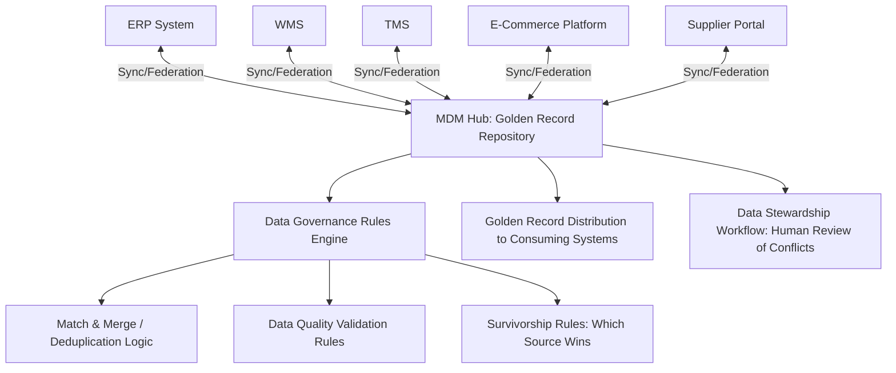
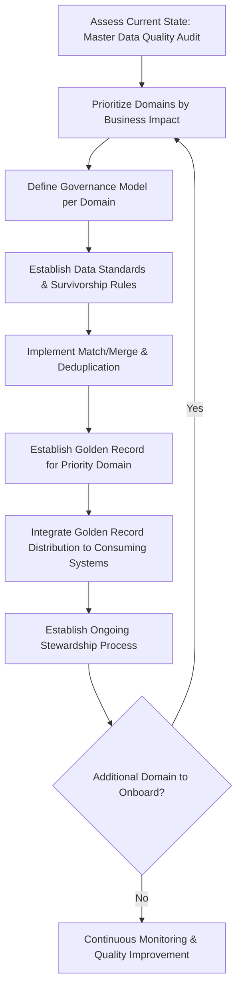

## Master Data Management Across Tiers

### Overview

Master Data Management (MDM) is the discipline and technology infrastructure for creating and maintaining a single, consistent, authoritative version of core business entities—products, locations, suppliers/customers, and related reference data—across an organization's systems landscape. In a supply chain context, "across tiers" refers to two distinct but related dimensions: MDM across organizational/system tiers (ERP, WMS, TMS, APS, and other systems each needing consistent master data) and MDM across supply chain network tiers (extending consistent identification and attribute data to Tier 1, Tier 2, and deeper suppliers, connecting to the N-Tier visibility architecture described elsewhere in this domain).

### Why MDM Is Foundational, Not Optional

Every system and process examined elsewhere in this domain—MRP calculations, APS optimization, TMS/WMS integration, N-Tier visibility, track-and-trace—depends on master data accuracy as an input. This creates a structural dependency: sophisticated algorithms and integration architecture cannot compensate for unreliable underlying data about what a product is, where a location exists, or who a supplier/customer actually is.

$$\text{System Output Quality} \leq f(\text{Master Data Quality})$$

[Inference] This is why master data quality issues tend to surface as symptoms in downstream systems (inaccurate MRP output, failed EDI transactions, mismatched shipment records) rather than being immediately visible at their true root cause, often leading organizations to invest in downstream system fixes before recognizing that the underlying master data governance is the actual point of failure.

### Core Master Data Domains in Supply Chain

**Material/Product Master**

Product identification (SKU, GTIN), descriptive attributes, unit of measure conversions, planning parameters (lead time, safety stock, lot sizing), sourcing relationships, and physical attributes (dimensions, weight) — the last of these directly relevant to the dimensional/weight reconciliation challenges discussed in the TMS/WMS integration topic.

**Location Master**

Facility identification (often standardized via GLN — Global Location Number, see Track-and-Trace System Design topic), addresses, facility type/capability attributes, and hierarchical relationships (which locations belong to which region/network node).

**Business Partner Master (Supplier/Customer)**

Legal entity identification, addresses, contact information, payment/commercial terms, certifications and compliance status, and — critically for N-Tier visibility purposes — relationships to other business partners in the extended network.

**Bill of Materials (BOM) / Recipe Master**

Component structure defining how materials combine into finished products, directly consumed by MRP explosion logic and requiring synchronization between engineering (design BOM) and manufacturing (production BOM) versions where these differ.

### The Single Source of Truth Problem

In practice, most organizations do not have a literal single database serving as master data source; instead, they typically operate multiple systems that each maintain their own copy of overlapping master data (a product exists in the ERP, the WMS, the e-commerce platform, and a supplier portal, potentially with slightly different attribute values in each). MDM architecture addresses this through one of several governance models:

**Registry style**

A central MDM system maintains cross-references and identifies which source system is authoritative for which attribute, without physically consolidating all data into one place; source systems remain authoritative and the registry provides a "map" for resolving queries across systems.

**Consolidation style**

Data is physically copied from source systems into a central MDM repository for reporting, analytics, or read-only reference purposes, while source systems remain the transactional system of record for their respective domains.

**Coexistence style**

A central MDM system both consolidates data for reference purposes and allows bidirectional synchronization back to source systems, with defined governance rules for which system "wins" in case of conflicting updates.

**Centralized/transactional style**

The MDM system itself becomes the single point of data entry and update for a given domain (e.g., all new product creation happens in the MDM system, which then propagates to ERP, WMS, and other consuming systems) — the most rigorous but also most organizationally demanding model, requiring all relevant systems and processes to route through the central MDM for that domain.

### MDM Architecture Pattern

**"Golden record" concept**: the MDM hub's core output is a "golden record"—the single, reconciled, authoritative version of a given entity (a specific product, a specific supplier) that consuming systems reference, resolving conflicts between potentially divergent source system values through defined survivorship rules (e.g., "product description defaults to the value from the Product Information Management system, but weight defaults to the value most recently captured by WMS dimensioning equipment").

### Match and Merge / Deduplication

A core MDM technical function is identifying when records from different source systems (or even within the same system) refer to the same real-world entity despite differing identifiers or attribute values (e.g., "Acme Corp" and "ACME Corporation, Inc." as separate supplier records that should be recognized as the same legal entity).

**Matching approaches**

- **Deterministic matching**: exact match on a reliable unique identifier (tax ID, DUNS number for organizations; GTIN for products)
- **Probabilistic/fuzzy matching**: statistical similarity scoring across multiple attributes (name similarity, address similarity, phone number) when no reliable unique identifier is consistently available, producing a match confidence score rather than a binary match/no-match determination

[Inference] Probabilistic matching is particularly relevant for supplier/business partner master data given the frequent absence of universally adopted unique identifiers across all trading partners, though matching accuracy depends heavily on data quality and consistency of the underlying attributes being compared, meaning probabilistic match results typically require some threshold-based automatic acceptance combined with human review for lower-confidence matches rather than fully automated resolution.

### Cross-Tier Extension: MDM Into the Supply Network

Extending master data consistency beyond the focal company's own systems into the N-Tier supplier network (see N-Tier Visibility Architecture topic) introduces additional challenges beyond internal MDM:

- **No shared identifier authority**: unlike internal systems where the organization can mandate a common identifier scheme, external supply chain partners may use entirely different internal identification systems, requiring cross-reference mapping rather than identifier standardization
- **Data ownership and update authority**: a Tier 2 supplier's master data (their own sub-suppliers, their facility certifications) is not something the focal company can directly control or update; it must be obtained, and its accuracy verified, through the data acquisition methods described in the N-Tier Visibility topic (self-declaration, contractual cascading, third-party verification)
- **Standard identifier adoption as an enabler**: broad industry adoption of standards like GS1's GLN (location) and GTIN (product) meaningfully reduces cross-tier MDM friction where adopted, since it provides a common identifier language across organizational boundaries — though adoption is inconsistent across industries, geographies, and supplier sophistication levels

### Data Quality Dimensions

A structured MDM data quality framework typically assesses master data against multiple dimensions:

| Dimension | Definition | Supply Chain Example |
| --- | --- | --- |
| Completeness | Required attributes are populated | Product record missing weight/dimension data needed for freight planning |
| Accuracy | Values correctly reflect real-world state | Lead time master data reflecting outdated (no longer current) supplier performance |
| Consistency | Same entity has matching values across systems | Product description differs between ERP and e-commerce platform |
| Timeliness | Data reflects current state, not stale history | Supplier certification status not updated after expiration |
| Uniqueness | No duplicate records for the same real-world entity | Same supplier entered twice under slightly different names |
| Validity | Values conform to defined format/business rules | Postal code format invalid for the stated country |

### Governance Organization

**Data stewardship roles**

Effective MDM typically requires designated data steward roles (often business-function-aligned rather than purely IT-aligned) responsible for defining data standards, resolving data quality exceptions flagged by the MDM system, and approving significant master data changes (e.g., new supplier onboarding, product master creation) — a purely technical MDM platform without designated organizational ownership tends to accumulate quality issues over time even with sound underlying technology.

**Governance council / cross-functional oversight**

Given that master data domains span multiple business functions (product master relevant to both engineering and sales; supplier master relevant to both procurement and finance/compliance), a cross-functional governance body is commonly used to resolve conflicting requirements or priorities across functions and to prioritize data quality remediation efforts.

### MDM Implementation Sequencing

[Inference] A common implementation pattern prioritizes the master data domain with the highest immediate business impact and most acute pain (frequently product master or supplier master, given their direct connection to MRP accuracy and compliance/onboarding processes respectively) rather than attempting to implement comprehensive MDM across all domains simultaneously, since the organizational change management and technical integration effort scales considerably with domain count and consuming system count.

### Key Points

- Master data quality is a structural dependency underlying nearly every other supply chain system and process discussed in this domain (MRP, APS, TMS/WMS integration, N-Tier visibility), meaning MDM investment often has outsized leverage relative to its visibility as a standalone initiative.
- The "single source of truth" is typically implemented not as one literal database but through a defined governance model (registry, consolidation, coexistence, or centralized) that reconciles multiple source systems' overlapping master data into a golden record with clear survivorship rules.
- Extending MDM across supply chain network tiers (beyond the focal company's own systems) faces distinct challenges from internal MDM, primarily the absence of a shared identifier authority and the inability to directly control external partners' data, requiring the acquisition and verification methods described in N-Tier visibility architecture.
- Sustainable MDM requires designated organizational data stewardship and governance, not purely technical platform implementation; technology without organizational ownership tends to see data quality degrade over time even when initially well-implemented.

**Related Topics**

- N-Tier Visibility Architecture (cross-tier MDM extension into the supplier network)
- ERP Systems and Supply Chain Modules (material, vendor, and BOM master data consumed by MRP)
- Transportation and Warehouse Management System Integration (dimensional/weight master data reconciliation)
- Track-and-Trace System Design (GS1 GLN/GTIN identifier standards as MDM enablers)
- Data governance organizational design and data steward role definition
- Probabilistic record matching and deduplication algorithm selection
- Data quality monitoring and continuous improvement program design