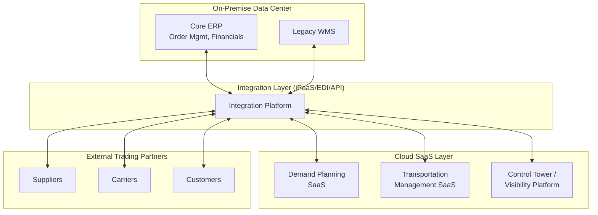

## Cloud versus On-Premise Supply Chain Architecture

### Definition

Cloud versus on-premise architecture describes the fundamental deployment model decision for supply chain management systems — ERP, Warehouse Management Systems (WMS), Transportation Management Systems (TMS), demand planning, and control tower platforms — regarding where the computing infrastructure, application logic, and data reside, and who bears responsibility for maintaining them. **On-premise** architecture hosts systems on infrastructure owned and operated within the organization's own data centers; **cloud** architecture hosts systems on infrastructure owned and operated by a third-party provider, accessed over the internet, typically under a subscription or consumption-based commercial model.

### Deployment Model Spectrum

| Model | Infrastructure Ownership | Application Management | Typical Commercial Model |
| --- | --- | --- | --- |
| On-Premise | Organization-owned data center | Organization's IT team | Capital expenditure (CapEx), perpetual license |
| Colocation/Hosted | Third-party data center, dedicated hardware | Organization's IT team | Lease + operational expenditure |
| IaaS (Infrastructure as a Service) | Cloud provider (AWS, Azure, GCP) | Organization's IT team | Consumption-based OpEx |
| PaaS (Platform as a Service) | Cloud provider | Shared (provider manages runtime/OS) | Consumption-based OpEx |
| SaaS (Software as a Service) | Cloud provider | Cloud provider (fully managed application) | Subscription, often per-user/per-transaction |

Most modern supply chain software vendors (SAP S/4HANA Cloud, Oracle SCM Cloud, Blue Yonder, Manhattan Associates, Kinaxis) now default to a **multi-tenant SaaS** model, with on-premise or single-tenant private cloud offered as a legacy or specialized option.

### Architectural Comparison

| Dimension | On-Premise | Cloud (SaaS) |
| --- | --- | --- |
| Upfront cost | High (hardware, licenses, data center) | Low (subscription-based) |
| Ongoing cost structure | CapEx-heavy, amortized | OpEx-heavy, recurring |
| Scalability | Manual capacity planning, physical procurement lead time | Elastic, on-demand scaling |
| Upgrade cycle | Organization-controlled, often infrequent (years) | Vendor-controlled, continuous/frequent (weeks-months) |
| Customization depth | Deep code-level customization possible | Configuration-based; deep customization often restricted or unsupported |
| Data residency/control | Full physical control | Contractual/regional data residency guarantees, not physical control |
| Disaster recovery | Organization's responsibility to design/fund | Typically included in provider SLA |
| Integration with partner networks | Requires custom-built connectivity | Often pre-built connectors to common EDI/API networks and partner ecosystems |
| Latency for global operations | Depends on internal network architecture | Depends on provider's regional data center footprint |
| IT staffing burden | High (infrastructure, patching, security) | Lower (shifted to provider), but requires cloud/SaaS administration skills |

### Why Deployment Model Matters Specifically for Supply Chain Systems

Supply chain systems have architectural characteristics that make the cloud/on-premise decision particularly consequential compared to generic enterprise software:

- **Multi-party network effects**: Supply chain systems must connect to external trading partners (suppliers, carriers, 3PLs, customers) via EDI/API. Cloud SaaS platforms increasingly offer pre-built **business networks** (e.g., SAP Business Network, Oracle Supply Chain Collaboration) that aggregate many trading partners onto a shared cloud infrastructure, reducing per-partner integration effort — an advantage difficult to replicate on-premise without significant custom middleware investment.
- **Elastic demand for compute during planning cycles**: Demand planning, network optimization, and S&OP processes often require burst compute capacity (e.g., running thousands of forecast scenarios or optimization models periodically) that is well suited to cloud elasticity but often results in over-provisioned, underutilized on-premise hardware.
- **Real-time visibility requirements**: Control tower and track-and-trace capabilities benefit from cloud-native architectures that can ingest and correlate IoT/telematics data streams from carriers and facilities at scale.
- **M&A and multi-entity complexity**: Organizations with multiple business units, subsidiaries, or frequent M&A activity often find cloud multi-tenant architectures easier to onboard new entities into compared to extending on-premise infrastructure.
- **Regulatory/data sovereignty constraints**: Government and defense-related supply chains, or industries with strict data residency requirements, may mandate on-premise or private-cloud deployment regardless of general cost/agility trade-offs.

### Hybrid Architecture Pattern

Many organizations, particularly those transitioning from legacy on-premise ERP, adopt a **hybrid architecture**: core transactional systems (ERP, financials) remain on-premise or in private cloud due to customization depth or migration risk, while newer capabilities (demand planning, control towers, analytics) are deployed as cloud SaaS and integrated back to the core system via API/EDI middleware or iPaaS.

### Migration Considerations (On-Premise to Cloud)

- **Data migration complexity**: Historical transactional data, master data (SKUs, BOMs, supplier records), and configuration must be extracted, cleansed, and mapped to the new cloud data model
- **Customization rationalization**: Deep on-premise customizations (custom code, modified workflows) often must be re-architected as configuration or extensions compatible with the SaaS provider's upgrade-safe extensibility framework (e.g., SAP BTP extensions, Oracle PaaS extensions)
- **Integration re-platforming**: EDI/AS2 gateways and point-to-point integrations must be re-pointed to new cloud endpoints, often via a modernized middleware/iPaaS layer
- **Change management**: Continuous cloud upgrade cycles (vendor-driven, often quarterly) require an internal governance process for regression testing and user training that differs from the multi-year on-premise upgrade cadence
- **Total Cost of Ownership (TCO) reassessment**: Comparing multi-year CapEx amortization against recurring subscription OpEx requires a normalized time horizon (commonly 5–7 years) to produce a comparable figure

[Inference: The general TCO and migration considerations above reflect standard enterprise IT and SCM implementation practice; the actual cost-benefit outcome for a specific organization depends heavily on existing infrastructure age, customization depth, and contract terms, which cannot be generalized further without organization-specific data]

### **Example**

A mid-sized manufacturer running a 15-year-old on-premise ERP with heavily customized inventory logic migrates its demand planning and transportation management to cloud SaaS platforms while retaining the core ERP on-premise during a multi-year transition. Trading partner EDI connections are re-routed through a new cloud-based iPaaS layer that translates between the on-premise ERP's legacy data formats and the SaaS platforms' modern REST APIs, allowing the organization to gain cloud elasticity for planning workloads without a disruptive, high-risk full ERP replacement in a single cutover.

### **Key Points**

- The cloud-vs-on-premise decision for supply chain systems is rarely binary in practice — hybrid architectures combining legacy on-premise transactional cores with cloud-based planning/visibility layers are common during transition periods.
- Cloud SaaS platforms offer a distinct supply-chain-specific advantage through pre-built multi-party business networks that reduce per-trading-partner integration overhead, beyond generic cloud benefits like elasticity and lower CapEx.
- Deep, code-level customization — common in mature on-premise supply chain deployments — is often the primary technical barrier to cloud migration, since SaaS platforms typically restrict customization to configuration and sanctioned extension frameworks.
- Regulatory, data sovereignty, or defense-related constraints can override general cost/agility arguments and mandate on-premise or private-cloud deployment regardless of other trade-offs.

### **Related Topics**

- iPaaS and Middleware Architecture for Multi-Partner Integration
- EDI, APIs, and System-to-System Integration
- Supply Chain Control Towers and Real-Time Visibility Platforms
- ERP Selection and Total Cost of Ownership Analysis
- Data Governance and Master Data Management in Multi-Tier Supply Chains
- Multi-Tenant SaaS Security and Data Residency Considerations