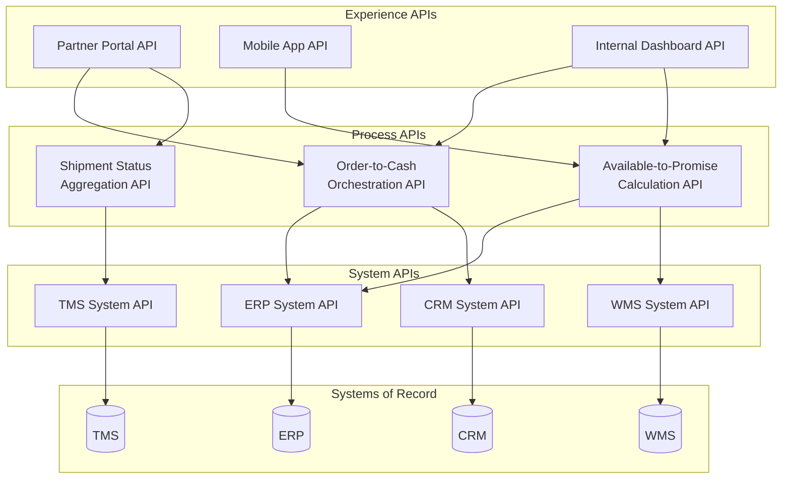

## API-Led Integration and System Interoperability

### Definition

API-led integration (sometimes called **API-led connectivity**, a term popularized by MuleSoft) is an architectural approach to connecting enterprise systems, data sources, and external trading partners through a structured, layered set of reusable APIs — rather than through ad hoc, point-to-point integrations. The goal is to treat integration itself as a reusable, composable capability by organizing APIs into distinct layers based on their purpose and consumer, enabling faster onboarding of new applications, partners, and use cases without repeatedly rebuilding connectivity from scratch.

### The Three-Layer API Architecture

**1. System APIs**

- Provide direct, standardized access to underlying systems of record (ERP, WMS, TMS, CRM, legacy databases)
- Abstract away system-specific protocols, authentication, and data formats behind a consistent interface
- Designed to be stable and rarely changed, since they encapsulate the "source of truth" access pattern
- Example: a System API exposing inventory levels directly from a WMS database, regardless of the WMS vendor's native protocol

**2. Process APIs**

- Orchestrate and combine data from one or more System APIs to implement specific business processes or logic
- Contain business rules independent of any single underlying system (e.g., combining inventory from a WMS System API with order data from an ERP System API to compute available-to-promise)
- Reusable across multiple downstream consumers/experiences

**3. Experience APIs**

- Tailor data and functionality for a specific consumption channel or audience (mobile app, partner portal, internal dashboard, B2B trading partner)
- Shape Process API outputs into the specific format, granularity, and structure required by the consuming experience
- Allow the same underlying Process/System API logic to serve multiple front-ends without duplicating business logic per channel

### Why This Layering Matters for Supply Chain Interoperability

Supply chain integration is characterized by a many-to-many connectivity problem: multiple internal systems (ERP, WMS, TMS, planning) must each connect to multiple external parties (suppliers, carriers, 3PLs, customers, marketplaces), and multiple internal consumers (dashboards, partner portals, mobile apps) need access to overlapping subsets of that data. Without layering, this produces a combinatorial explosion of point-to-point connections:

$$\text{Point-to-Point Connections} = \frac{n(n-1)}{2}$$

For $n$ systems requiring pairwise integration, connections grow quadratically. API-led architecture converts this into a hub-and-spoke-like model where each system integrates once (as a System API) and is then reused across arbitrarily many Process and Experience API consumers, converting the growth pattern closer to linear ($O(n)$ new System APIs plus reusable Process/Experience compositions) as new consumers are added.

### Interoperability Standards Relevant to Supply Chain APIs

| Standard/Pattern | Purpose | Common Use |
| --- | --- | --- |
| REST/JSON | Resource-oriented, stateless HTTP APIs | General-purpose system, process, and experience APIs |
| OpenAPI Specification (OAS) | Machine-readable API contract/documentation | API design-first development, partner onboarding |
| GraphQL | Client-specified query flexibility | Experience APIs needing variable data shape per consumer |
| OAuth 2.0 / OIDC | Authorization and identity federation | Securing API access across organizational boundaries |
| Webhooks | Event-driven push notifications | Real-time status updates (shipment departed, order fulfilled) |
| GS1 Digital Link / EPCIS | Standardized product/traceability event data exchange | Cross-industry product identification and track-and-trace |
| AS2/AS4 (as EDI-over-API bridge) | Secure document exchange with modern transport | Hybrid EDI/API environments |

### API Gateway and Management Layer

A practical API-led architecture requires infrastructure beyond the three logical layers to govern access, reliability, and observability:

- **API Gateway**: Enforces authentication, rate limiting, request/response transformation, and routing at the network edge
- **API Catalog/Developer Portal**: Central registry where internal teams and external partners discover available APIs, view documentation (typically OpenAPI-based), and self-service onboard
- **API Versioning Strategy**: Explicit version management (URI versioning, header versioning) to allow System/Process API evolution without breaking existing Experience API consumers
- **Observability/Monitoring**: Centralized logging, tracing, and alerting across the API layers to diagnose failures spanning multiple hops (Experience → Process → System)

### Design Principles for Reusability

- **System APIs should not encode business logic** — logic belongs in the Process layer, keeping System APIs a thin, stable abstraction over the underlying system
- **Process APIs should be channel-agnostic** — designed for reuse by multiple Experience APIs rather than built for a single specific consumer
- **Experience APIs should not be reused across unrelated consumers** — each is intentionally tailored, and forcing reuse here typically reintroduces tight coupling that the layering was meant to avoid
- **Contract-first design**: defining the API's OpenAPI specification before implementation allows parallel development of consumers and providers and creates a stable interface contract

### Comparison: API-Led vs. Point-to-Point Integration

| Attribute | Point-to-Point | API-Led (Layered) |
| --- | --- | --- |
| Connection growth as systems added | Quadratic | Approximately linear (via reuse) |
| Reusability of integration logic | Low — each integration built for one pair | High — System/Process APIs reused across consumers |
| Time to onboard new partner/channel | High — new custom integration each time | Lower — compose existing Process/System APIs into new Experience API |
| Failure isolation | Difficult — tightly coupled dependencies | Easier — layered architecture isolates failures by layer |
| Governance/discoverability | Poor — integrations often undocumented | Centralized via API catalog/developer portal |
| Initial architectural investment | Lower upfront | Higher upfront (design layers, gateway, governance) |

[Inference: the quadratic-vs-linear growth comparison is the standard theoretical justification cited for API-led architecture; actual integration effort in practice also depends on data model heterogeneity across systems, which layering alone does not eliminate]

### **Example**

A retailer's supply chain organization needs to expose real-time order status to three different consumers: an internal operations dashboard, a customer-facing mobile app, and a B2B partner portal for wholesale customers. Instead of building three separate integrations directly against the ERP and WMS, the architecture defines System APIs for ERP order data and WMS fulfillment status, a single Process API that combines both into a unified "order status" business object with computed fields (e.g., estimated delivery date), and three thin Experience APIs — one per consumer — that each shape that same Process API output into the specific format and field set each channel requires. When a new consumer (e.g., a carrier-facing tracking widget) is later needed, only a new Experience API must be built; the System and Process layers are reused unchanged.

### **Key Points**

- API-led integration organizes connectivity into System, Process, and Experience layers to maximize reuse and reduce the quadratic growth problem of point-to-point integration.
- System APIs abstract underlying systems of record; Process APIs encode reusable business logic; Experience APIs tailor output per consumer channel — business logic placement in the correct layer is central to achieving reusability.
- Supply chain environments are particularly suited to this pattern due to inherent many-to-many connectivity needs across internal systems, external trading partners, and multiple consumption channels.
- Effective API-led architecture requires supporting infrastructure (API gateway, developer portal, versioning strategy, observability) beyond the three logical layers themselves to be operationally viable at scale.

### **Related Topics**

- EDI, APIs, and System-to-System Integration
- iPaaS and Middleware Architecture for Multi-Partner Integration
- GS1 Standards and EPCIS for Product Traceability
- Event-Driven Architecture and Webhook-Based Supply Chain Notifications
- API Governance, Versioning, and Developer Portal Design
- Cloud versus On-Premise Supply Chain Architecture