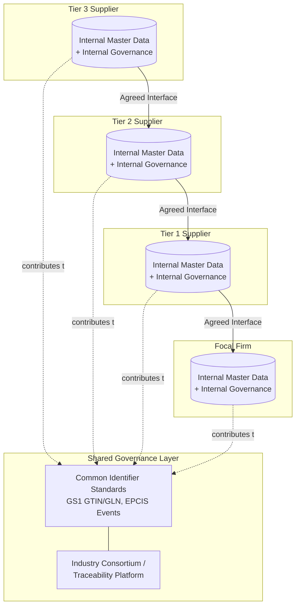

## Data Governance in Multi-Tier Networks

### Definition

Data governance in multi-tier supply chain networks refers to the policies, standards, roles, and technical controls that ensure data — master data, transactional data, and event/traceability data — remains accurate, consistent, secure, and appropriately shared across organizationally independent tiers (focal firm, Tier 1, Tier 2, Tier 3+) that each operate their own systems, data models, and governance domains. Unlike governance within a single enterprise, multi-tier supply chain data governance must reconcile data ownership, quality standards, and access rights across trading partners who do not share common IT infrastructure, incentive structures, or organizational authority.

### Core Governance Dimensions

**1. Master Data Management (MDM)**

- Establishing a consistent, authoritative representation of shared reference entities: product/SKU identifiers, supplier/location codes, unit-of-measure conventions, and pricing structures
- Cross-organizational MDM requires either (a) each party maintaining its own master data with a cross-reference/mapping table, or (b) adoption of shared external identifier standards (e.g., GS1 GTIN for products, GLN for locations) that all parties reference directly

**2. Data Quality**

- Accuracy, completeness, timeliness, and consistency of data as it moves across tier boundaries
- Multi-tier quality degradation compounds: an error introduced at a Tier 3 supplier's system (e.g., incorrect unit of measure) can propagate upstream through Tier 2 and Tier 1 systems before surfacing as a discrepancy at the focal firm, by which point root-cause diagnosis is more difficult

**3. Data Ownership and Stewardship**

- Defining which organization is the authoritative "system of record" for each data domain (e.g., the manufacturer owns product specification data; the carrier owns in-transit location data; the retailer owns point-of-sale demand data)
- Data stewardship roles are typically assigned per domain, but across tiers this requires **inter-organizational agreement**, not just internal policy, since no single governance body has authority over independent trading partners

**4. Data Access and Sharing Policies**

- Determining what data each tier is contractually or technically permitted to see from adjacent and non-adjacent tiers
- Balances transparency needed for risk management/traceability against legitimate confidentiality concerns (competitive pricing, proprietary formulations, customer lists)

**5. Data Security and Privacy**

- Protecting data in transit and at rest as it crosses organizational and often jurisdictional boundaries
- Compliance with data protection regulations (e.g., GDPR where personal data is involved, sector-specific regulations) that may apply differently to each tier depending on jurisdiction

### The Visibility-Confidentiality Tension

Multi-tier data governance is structurally shaped by a tension between two competing objectives:

$$\text{Governance Design} = \text{Optimize}(\text{Upstream Visibility for Risk/Traceability}, \text{Confidentiality of Competitive Data})$$

Focal firms increasingly want Tier 2/3 visibility for risk management, ESG compliance, and traceability regulation (e.g., conflict minerals, deforestation-free sourcing). However, Tier 1 suppliers often resist fully disclosing their own supplier relationships (Tier 2) to the focal firm, since doing so could expose sourcing strategy, pricing leverage, or allow the focal firm to disintermediate the Tier 1 supplier by contracting directly with Tier 2. This creates a structural incentive misalignment that pure technology solutions cannot resolve on their own. [Inference: this incentive tension is a well-documented factor in why deep-tier visibility initiatives face adoption resistance; the degree of resistance varies by industry and by the relative power balance between focal firm and Tier 1 supplier]

### Governance Architecture Patterns

**Federated Governance**

- Each tier/organization retains full ownership and governance of its own internal data
- Cross-tier data exchange occurs only through defined, agreed-upon interfaces (EDI transaction sets, APIs) with explicitly negotiated data-sharing scope
- No central authority; governance operates through bilateral or multilateral trading partner agreements
- Most common pattern in traditional multi-tier supply chains

**Centralized/Hub Governance**

- A neutral third party (industry consortium, platform provider, or dominant focal firm) operates a shared data repository or network that multiple tiers contribute to and draw from under common governance rules
- Examples: industry data-sharing platforms for traceability (e.g., blockchain-based consortiums), GS1's global standards registry
- Reduces duplication of mapping/translation effort but requires trust in the central governance body and often requires all participants to conform to a common schema

**Hybrid/Layered Governance**

- Internal data governed federally within each organization; specific shared data domains (e.g., product traceability events under EPCIS, or sustainability/ESG data) governed centrally through an industry standard or consortium
- Most large-scale multi-tier traceability initiatives (e.g., in food safety, apparel, electronics) adopt this hybrid pattern

### Common Identifier Standards Enabling Cross-Tier Governance

| Standard | Governing Body | Purpose |
| --- | --- | --- |
| GTIN (Global Trade Item Number) | GS1 | Unique product identification across all tiers |
| GLN (Global Location Number) | GS1 | Unique identification of physical locations/legal entities |
| EPCIS (Electronic Product Code Information Services) | GS1 | Standardized event data model for "what, where, when, why" traceability events |
| DUNS Number | Dun & Bradstreet | Unique business entity identification for supplier master data |
| ISO 8000 | ISO | General data quality standard applicable to master data exchange |

### Data Governance Failure Modes Specific to Multi-Tier Networks

- **Identifier fragmentation**: Different tiers use incompatible internal SKU/part numbering schemes with no shared cross-reference, requiring manual or error-prone mapping at every tier boundary
- **Stale cascading data**: A product specification change at a Tier 1 supplier not propagated timely to Tier 2/3 systems, causing quality or compliance mismatches
- **Governance asymmetry**: A dominant focal firm imposing its data standards unilaterally on smaller upstream suppliers who lack the technical capacity to comply, creating compliance gaps at the weakest-resourced tier
- **Shadow/manual workarounds**: When formal data exchange is too rigid or slow, tiers revert to informal channels (spreadsheets, email) that bypass governance controls entirely, reintroducing the data quality and latency problems the governance framework was meant to solve

### **Example**

A food manufacturer implementing farm-to-shelf traceability requires Tier 1 co-packers, Tier 2 ingredient suppliers, and Tier 3 raw agricultural producers to report harvest lot data using a common EPCIS event schema and GS1 GTIN product identifiers. Each tier retains full internal governance over its own production and quality systems, but all parties agree, through an industry consortium-managed platform, to publish specific standardized traceability events (harvest, processing, shipment) to a shared repository. When a food safety issue is detected at the retail level, the focal firm can trace the affected lot back through all tiers using the common identifier scheme — something that would be operationally infeasible if each tier used incompatible internal lot-numbering systems with no shared governance layer.

### **Key Points**

- Multi-tier data governance differs fundamentally from single-enterprise governance because no central authority has organizational control over independent trading partners — governance must be negotiated, not mandated, except where a dominant focal firm has sufficient leverage.
- The visibility-confidentiality tension is a structural, not merely technical, challenge — Tier 1 suppliers' incentive to protect their own upstream relationships often conflicts with focal firms' risk/compliance visibility needs.
- Shared identifier standards (GS1 GTIN, GLN, EPCIS) are the primary technical enabler of cross-tier interoperability, reducing reliance on bilateral, ad hoc data mapping between every tier pair.
- Federated, centralized, and hybrid governance patterns each represent different trade-offs between local autonomy and cross-network consistency; hybrid/layered approaches are most common in large-scale, regulation-driven traceability initiatives.

### **Related Topics**

- GS1 Standards and EPCIS for Product Traceability
- Deep-Tier Supply Chain Visibility and Mapping Techniques
- Blockchain-Based Supply Chain Traceability
- Conflict Minerals and Raw Material Traceability Regulations
- EDI, APIs, and System-to-System Integration
- Supplier Risk Management and Single-Source Dependency