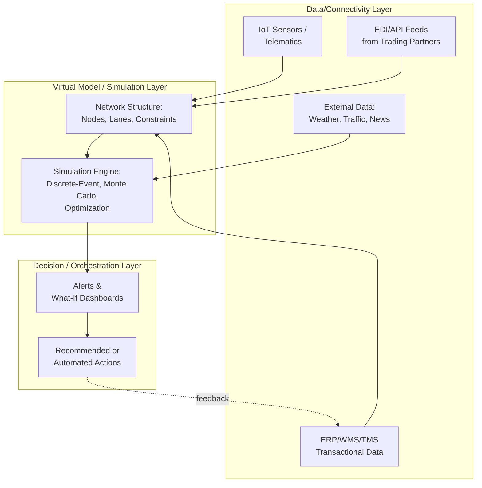

## Digital Twins of Supply Chain Networks

### Definition

A digital twin of a supply chain network is a dynamic, data-driven virtual representation of a physical supply chain — its nodes (facilities, warehouses, suppliers), links (transportation lanes, information flows), and processes — that is continuously synchronized with real-world operational data and used to monitor current state, simulate hypothetical scenarios, and support decision-making without disrupting live operations. Unlike a static supply chain model built once for planning purposes, a true digital twin maintains an ongoing bidirectional data connection to the physical system it represents, so the virtual model reflects near-real-time conditions rather than a point-in-time snapshot.

### Distinction from Related Concepts

| Concept | Data Currency | Purpose | Connection to Physical System |
| --- | --- | --- | --- |
| Static Network Model | Point-in-time snapshot | One-off design/planning analysis | None (manually rebuilt) |
| Simulation Model | Historical or synthetic data | Scenario testing, training | None (standalone) |
| Control Tower | Real-time | Monitoring and alerting | Live data feed, largely one-directional |
| Digital Twin | Real-time, continuously synchronized | Monitoring + simulation + decision support | Live bidirectional feed; virtual state mirrors and can inform physical state |

The distinguishing feature of a digital twin versus a control tower is the added **simulation/what-if capability** layered on top of live visibility — a control tower shows what is happening now, while a digital twin additionally allows testing what would happen under hypothetical conditions using the current, live network state as the simulation's starting point.

### Three Interconnected Architectural Layers

Industry framing of supply chain digital twins consistently describes the architecture as three interconnected layers spanning data capture, virtual modeling, and decision support.

**1. Data/Connectivity Layer**

- Ingests real-time and near-real-time data from IoT sensors, telematics (GPS/RFID on shipments and vehicles), ERP/WMS/TMS transactional systems, EDI/API feeds from trading partners, and external data sources (weather, traffic, geopolitical/news feeds)
- Responsible for data normalization, timestamping, and reconciling data arriving at different frequencies (sensor streams vs. batch EDI transactions) into a common temporal and semantic model

**2. Virtual Model/Simulation Layer**

- Maintains the structural representation of the network: nodes (plants, DCs, suppliers, ports), edges (lanes, routes, relationships), and the business logic/constraints governing how the network behaves (capacity limits, lead times, cost functions, inventory policies)
- Executes simulation and optimization engines against this model — discrete-event simulation, Monte Carlo risk simulation, or mathematical optimization (linear/mixed-integer programming) depending on the analysis type
- Continuously reconciled against live data so that simulations start from the network's actual current state rather than a stale baseline

**3. Decision/Orchestration Layer**

- Surfaces insights, alerts, and recommended actions to human planners, or in more mature implementations, triggers automated or semi-automated actions (re-routing, reallocation, order acceleration)
- This is the layer where organizations transition from a **passive visibility** posture to an **active orchestration** posture — a shift multiple industry sources describe as the current direction of digital twin maturity as digital twins move supply chains from reactive reporting to real-time intelligence, with the shift from visibility to orchestration already underway. [mixmove](https://www.mixmove.io/blog/from-visibility-to-orchestration-how-digital-supply-chain-twins-are-reshaping-logistics)

### Core Use Cases

- **Disruption scenario simulation**: Modeling the impact of a supplier outage, port closure, or transportation lane disruption before it happens, to identify contingency options and their trade-offs in advance rather than scrambling to respond once a crisis has already begun [growthaccelerationpartners](https://www.growthaccelerationpartners.com/?p=28430)
- **Network design and re-design**: Evaluating warehouse locations, transportation modes, service levels, cost, resilience, and sustainability/CO2 trade-offs under alternative network configurations to support fact-based decisions and continuous improvement across regions [siemens](https://blogs.sw.siemens.com/digital-logistics/2026/02/11/realize-live-europe-2026-transforming-supply-chain-management-with-digital-twins-and-ai/)
- **Demand shock simulation**: Testing network response to sudden demand spikes or drops for specific product lines or regions
- **Predictive maintenance integration**: Combining asset-level digital twins (equipment, vehicles) with network-level twins to anticipate capacity-affecting failures before they occur, shifting from reactive to condition-based maintenance planning
- **Deep-tier risk exposure modeling**: Extending network visibility and simulation beyond Tier 1 into Tier 2/3 where many real-world disruptions actually originate, since most organizations have clear insight into Tier 1 suppliers while disruptions often originate further upstream in tiers that have no direct relationship with the focal company [sdcexec](https://www.sdcexec.com/software-technology/emerging-technologies/article/22957701/alcatellucent-enterprise-the-technologies-reshaping-supply-chains-in-2026)

### Technical Prerequisites

Building a functional supply chain digital twin depends on several of the architectural capabilities covered elsewhere in this curriculum, since a digital twin is fundamentally a composition of existing supply chain digital infrastructure rather than a standalone technology:

- **Real-time data integration** (EDI/API connectivity) to keep the virtual model synchronized with actual operational state
- **Master data governance** across the network, since node and product identities must be consistent across every data source feeding the twin
- **Sufficient upstream/downstream network visibility**, particularly into Tier 2/3 suppliers, to represent the full scope of the physical network rather than only the focal firm's immediate tier
- **Computational capacity for simulation workloads**, which are often bursty (e.g., running hundreds of disruption scenarios) and well suited to elastic cloud infrastructure

### Implementation Maturity Considerations

Digital twin adoption in supply chain contexts is described in current literature as following a maturity progression rather than being implemented all at once. [Inference: the general maturity-model framing is consistent across current academic and industry sources reviewed, though specific stage definitions vary by source and no single universally adopted maturity scale was confirmed]

| Maturity Stage | Characteristic Capability |
| --- | --- |
| Descriptive | Static or periodically-updated network visualization; limited real-time sync |
| Diagnostic | Real-time visibility layer identifying what happened and why (control-tower-like) |
| Predictive | Simulation capability layered on real-time data; what-if scenario testing |
| Prescriptive/Orchestrating | Automated or semi-automated recommended/triggered actions based on simulation outcomes |

### Reported Drivers and Challenges

**Drivers cited in current sources:**

- Increasing supply chain complexity from globalization, SKU proliferation, and multi-system landscapes creating an environment requiring scalable means of turning disparate data sources into valuable insights [dataiku](https://www.dataiku.com/blog/supply-chain-ai-trends-2026)
- Stakeholder demand for end-to-end transparency, requiring data teams to build trust in data products through transparent analytics as new technologies are adopted [dataiku](https://www.dataiku.com/blog/supply-chain-ai-trends-2026)
- Elevated disruption costs creating pressure to shift from reactive to anticipatory operations, since supply chain disruptions cost organizations a substantial share of a year's cash profit according to industry analysis [mixmove](https://www.mixmove.io/blog/from-visibility-to-orchestration-how-digital-supply-chain-twins-are-reshaping-logistics)

**Challenges commonly cited:**

- Data integration complexity across heterogeneous, multi-tier source systems
- Skill/talent shortages for building and maintaining simulation and data engineering capability
- Extending visibility credibly beyond Tier 1, which remains a widely acknowledged gap even where digital twin tooling exists

### **Example**

A consumer electronics manufacturer builds a network-level digital twin covering its assembly plants, regional distribution centers, and key Tier 1/Tier 2 supplier nodes, fed by IoT-tracked shipment data, ERP order data, and weather/geopolitical news feeds. When early signals indicate a potential port congestion event in a key transshipment hub, planners run a what-if simulation within the twin, rerouting affected lanes through an alternate port and evaluating the resulting cost, lead-time, and service-level impact — deciding on a contingency routing plan before the disruption actually affects any shipments, rather than reacting after delays have already occurred.

### **Key Points**

- The defining feature of a digital twin, distinct from a static model or a control tower, is the combination of continuous real-time synchronization with the physical network **and** an active simulation/what-if capability built on top of that live state.
- Digital twins are compositions of existing supply chain digital capabilities (real-time integration, master data governance, multi-tier visibility) rather than a wholly separate technology stack — organizations without mature data integration and governance foundations will struggle to implement an effective twin.
- Current industry framing consistently describes an evolution from passive visibility toward active orchestration as the direction of digital twin maturity, though specific implementations vary widely in how far along that progression they actually are. [Unverified: adoption maturity claims come from vendor and industry-analysis sources, which may have incentive to characterize the technology's readiness favorably]
- Extending digital twin visibility into deep-tier (Tier 2/3+) suppliers remains a widely cited gap, since most disruptions with material impact originate beyond the tiers where organizations currently have strong data visibility.

### **Related Topics**

- Supply Chain Control Towers and Real-Time Visibility Platforms
- Deep-Tier Supply Chain Visibility and Mapping Techniques
- Data Governance in Multi-Tier Networks
- Scenario Planning and Monte Carlo Risk Simulation
- Predictive Maintenance and Asset-Level Digital Twins
- Network Design Optimization Models