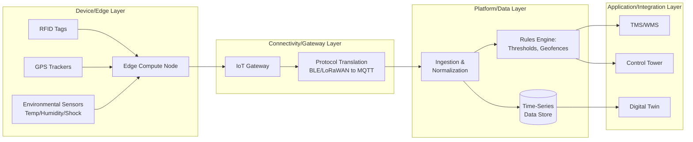

## Internet of Things Sensing and Asset Tracking

### Definition

Internet of Things (IoT) sensing and asset tracking in supply chain contexts refers to the use of networked physical devices — sensors, tags, and gateways — embedded in or attached to products, packaging, vehicles, and facility equipment to automatically capture and transmit real-time data on location, condition, and status without manual intervention. This data feeds directly into the information flow layer of the supply chain, closing the gap between physical movement (product flow) and its digital representation, and forms a primary data source for downstream capabilities like control towers and digital twins.

### Core Sensing Modalities

| Modality | What It Captures | Typical Range/Method |
| --- | --- | --- |
| RFID (Radio-Frequency Identification) | Item/pallet/case identity via tag read | Passive: centimeters-meters (no battery); Active: up to ~100m (battery-powered) |
| GPS/GNSS | Absolute geographic location | Global, outdoor; degraded indoors |
| Bluetooth Low Energy (BLE) | Proximity/location within a defined zone | Meters, indoor-friendly |
| Cellular (LTE-M, NB-IoT) | Location + connectivity over wide areas | Kilometers, works where cellular coverage exists |
| LPWAN (LoRaWAN, Sigfox) | Long-range, low-power location/telemetry | Kilometers, very low power draw, low bandwidth |
| Environmental Sensors | Temperature, humidity, shock, light, tilt | Local to the tagged asset; transmitted via above connectivity |
| Barcode/QR (adjacent, non-IoT) | Static identity, scanned manually or by fixed readers | Point-in-time capture, not continuous |

### Architectural Layers

**1. Device/Edge Layer**

- Physical sensors and tags attached to assets (pallets, containers, vehicles, individual high-value items)
- Increasingly includes **edge computing** capability — local processing on or near the device to filter, aggregate, or pre-analyze data before transmission, reducing bandwidth consumption and enabling faster local alerting (e.g., a reefer container triggering an immediate local alarm on temperature excursion rather than waiting for a round-trip to the cloud)

**2. Connectivity/Gateway Layer**

- Gateways aggregate signals from multiple nearby sensors/tags and relay them to backend systems via cellular, satellite, or Wi-Fi uplink
- Protocol translation occurs here: device-level protocols (BLE, LoRaWAN) are converted to standard network protocols (MQTT, HTTP/REST) for onward transmission
- **MQTT (Message Queuing Telemetry Transport)** is the dominant lightweight publish/subscribe protocol for IoT telemetry due to its low overhead and support for intermittent connectivity

**3. Platform/Data Management Layer**

- IoT platforms (cloud-based or on-premise) ingest, normalize, timestamp, and store the incoming device data streams
- Handles device management (provisioning, firmware updates, health monitoring) at scale across potentially thousands to millions of tracked assets
- Applies business rules/thresholds (e.g., geofence breach, temperature excursion) to trigger alerts

**4. Application/Integration Layer**

- Exposes processed IoT data to downstream supply chain systems (TMS, WMS, control towers, digital twins) via APIs or event streams
- Correlates IoT telemetry with transactional data (linking a GPS trace to a specific shipment/order ID in the ERP/TMS)

### RFID: Passive vs. Active

| Attribute | Passive RFID | Active RFID |
| --- | --- | --- |
| Power source | None (powered by reader's RF field) | Onboard battery |
| Read range | Centimeters to a few meters | Tens to hundreds of meters |
| Cost per tag | Very low (cents) | Higher (dollars) |
| Typical use case | Item/case-level identification at fixed checkpoints (dock doors, conveyor scanners) | Continuous tracking of high-value or long-transit assets (containers, reusable pallets) |
| Data transmitted | Identity only (read on demand) | Identity + can carry sensor data (temperature, location) transmitted proactively |

### Data Volume and Time-Series Handling

IoT asset tracking generates high-frequency, high-volume telemetry that differs structurally from traditional transactional supply chain data (EDI documents, ERP orders), requiring purpose-built handling:

$$\text{Data Volume} \approx N_{\text{assets}} \times f_{\text{sampling}} \times S_{\text{payload}}$$

Where $N_{\text{assets}}$ is the number of tracked assets, $f_{\text{sampling}}$ is the reporting frequency, and $S_{\text{payload}}$ is the payload size per reading. For large fleets reporting at high frequency, this can generate a data volume substantially larger than transactional order/shipment data, necessitating **time-series databases** (optimized for high-write-throughput, timestamp-indexed data) rather than conventional relational databases for the platform layer's storage.

### Key Use Cases in Supply Chain

- **Condition monitoring**: Continuous temperature/humidity tracking for cold chain (pharmaceuticals, perishable food), with automated alerts on excursion outside acceptable thresholds
- **Shock/tilt detection**: Identifying rough handling or drops during transit for high-value or fragile goods, supporting claims and root-cause quality investigations
- **Real-time location tracking (RTLS)**: Continuous shipment position visibility for ETA prediction, exception management, and customer-facing tracking
- **Yard and warehouse asset tracking**: BLE/RFID-based tracking of trailers, forklifts, and reusable containers within a facility to reduce search time and improve asset utilization
- **Geofencing-triggered events**: Automatically generating a system event (e.g., "arrived at DC") when a tracked asset crosses a predefined geographic boundary, replacing manual check-in processes
- **Predictive maintenance inputs**: Vibration, temperature, and usage sensors on transportation and material-handling equipment feeding failure-prediction models

### Comparative Trade-Offs: Connectivity Choice

| Connectivity | Power Consumption | Range | Bandwidth | Best Fit |
| --- | --- | --- | --- | --- |
| Passive RFID | None | Very short | Minimal | Fixed checkpoint scanning |
| BLE | Low | Short (indoor) | Low-moderate | Warehouse/yard asset tracking |
| LoRaWAN/Sigfox | Very low | Long | Very low | Infrequent telemetry over wide areas (e.g., remote asset check-ins) |
| Cellular (LTE-M/NB-IoT) | Moderate | Wide (coverage-dependent) | Moderate | Continuous in-transit tracking |
| Satellite | High | Global (including ocean/remote) | Low-moderate | Ocean freight, remote areas without cellular coverage |

[Inference: the specific power/range/bandwidth trade-offs listed reflect well-established general characteristics of these connectivity standards; actual performance varies by device manufacturer, network conditions, and deployment environment]

### Integration with Downstream Systems

Raw IoT telemetry has limited standalone value; its supply chain utility depends on correlation with transactional context:

- A GPS coordinate becomes actionable only when linked to a specific **shipment ID, order, or asset record** in the TMS/ERP
- A temperature reading becomes actionable only when linked to the **product/lot** it is protecting and the **acceptable threshold range** defined for that product category
- This correlation typically occurs at the platform/application layer via API-based integration (see API-led integration patterns), matching device identifiers to business object identifiers maintained in the master data layer

### **Example**

A pharmaceutical distributor attaches active RFID temperature loggers to pallets of vaccines requiring strict cold-chain compliance. Each logger transmits temperature readings every few minutes via a cellular gateway on the transport vehicle to a cloud IoT platform, which applies a rules engine checking readings against the product's defined acceptable temperature range (linked via the pallet's RFID identifier to its shipment record in the TMS). When a reading briefly exceeds the threshold during a loading dock delay, the platform triggers an immediate alert to the logistics team, who can flag the affected pallet for quality review before it reaches the distribution center — rather than discovering the excursion only after delivery, when the pharmaceutical product may already have been compromised and distributed.

### **Key Points**

- IoT sensing data volume and structure (high-frequency, timestamped telemetry) differs fundamentally from traditional transactional supply chain data (EDI documents, periodic ERP updates), requiring distinct data infrastructure such as time-series databases and edge processing to be practical at scale.
- Passive and active RFID serve fundamentally different use cases based on the power/range/cost trade-off — passive suits fixed-checkpoint identification, active suits continuous high-value asset tracking.
- Raw sensor data has limited standalone value; its supply chain utility comes from correlation with transactional/master data context (linking a location or condition reading to a specific shipment, product, or threshold).
- IoT sensing is a foundational data source feeding higher-order capabilities — control towers, digital twins, and predictive maintenance models all depend on reliable, well-integrated IoT telemetry as an input layer.

### **Related Topics**

- Supply Chain Control Towers and Real-Time Visibility Platforms
- Digital Twins of Supply Chain Networks
- Cold Chain Management and Condition Monitoring
- Time-Series Data Infrastructure for Telemetry at Scale
- EDI, APIs, and System-to-System Integration
- Predictive Maintenance and Asset-Level Digital Twins