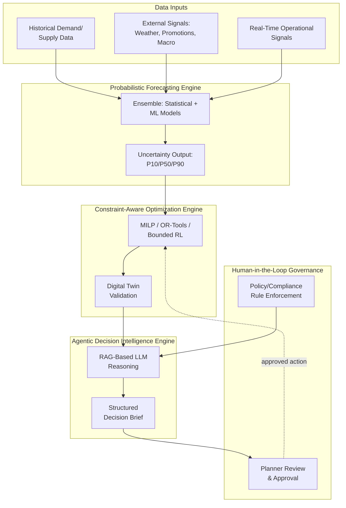

## Artificial Intelligence and Machine Learning in Planning

### Definition

Artificial Intelligence (AI) and Machine Learning (ML) in supply chain planning refers to the application of algorithmic systems — ranging from classical statistical/ML models to modern deep learning and large language model (LLM)-based agentic systems — to augment or automate demand forecasting, supply planning, inventory optimization, and operational decision-making. Unlike traditional rule-based or purely statistical planning approaches, AI/ML systems learn patterns from historical and real-time data and, in current-generation architectures, increasingly incorporate autonomous reasoning and recommendation capabilities layered on top of forecasting and optimization engines.

### Distinguishing AI/ML from Traditional Statistical Forecasting

| Attribute | Traditional Statistical (Time Series) | ML/AI-Augmented |
| --- | --- | --- |
| Input variables | Primarily the demand series itself | Demand series plus many exogenous signals (weather, promotions, social/web signals, macroeconomic data) simultaneously |
| Pattern complexity | Linear/parametric relationships (trend, seasonality) | Non-linear, high-dimensional relationships across many variables |
| Adaptation | Manual re-parameterization/re-fitting | Continuous or frequent re-training on new data |
| Causal factor discovery | Requires manual hypothesis and model specification | Can surface latent causal/contributing factors via feature importance and explainability techniques |
| Typical output | Point forecast, optionally with confidence interval | Point forecast plus increasingly probabilistic ranges (e.g., P10/P50/P90) and explainability output |

Current-generation platforms extend beyond point forecasts toward explicitly probabilistic output — generating uncertainty-aware predictions across low, median, and high scenarios (commonly expressed as P10/P50/P90 percentiles) that capture volatility across demand, lead time, and supply signals, rather than a single deterministic number.

### Three-Engine Reference Architecture

A common architectural pattern separates AI/ML-driven planning capability into three functionally distinct engines, each addressing a different stage of the plan-to-decision pipeline:

**1. Probabilistic Forecasting Engine**

- Generates demand, lead-time, and supply forecasts as probability distributions rather than single-point estimates
- Typically combines classical statistical methods (exponential smoothing, ARIMA) with ML techniques (gradient boosting, neural network-based forecasting) in an ensemble, since no single method dominates across all demand patterns
- Outputs uncertainty ranges (e.g., P10/P50/P90) that feed directly into downstream inventory safety-stock and risk calculations

**2. Constraint-Aware Optimization Engine**

- Takes probabilistic forecasts as input and produces feasible operational plans (production schedules, inventory allocation, replenishment quantities) subject to real-world constraints (capacity, budget, contractual minimums)
- Commonly implemented using Mixed-Integer Linear Programming (MILP), constraint solvers (e.g., Google OR-Tools), and increasingly bounded reinforcement learning (RL) approaches for sequential decision problems
- Plans may be validated through simulation (including digital twin scenario testing) before being finalized, catching infeasibilities or unintended trade-offs the optimization model alone might miss

**3. Agentic Decision Intelligence Engine**

- The most recent architectural layer, using LLM-based reasoning (often retrieval-augmented generation, RAG) to synthesize forecasts, optimization outputs, and contextual/policy knowledge into structured recommendations or "decision briefs" for human planners
- Operates under explicit governance constraints — human-in-the-loop review, policy/compliance rule enforcement, and explainability requirements — reflecting an industry-wide emphasis on transparent, auditable AI actions rather than unconstrained autonomous decision-making

### Common Platform Architecture Patterns

Current supply chain planning platforms tend to follow one of two broad architectural strategies:

- **Unified data-model platforms**: Demand, supply, S&OP, and financial planning run on a single connected data model (sometimes marketed as a "knowledge graph" architecture), so that a change in the demand signal propagates automatically to every downstream plan without manual data handoffs or reconciliation between separate modules
- **Modular/composable platforms**: Separate best-of-breed tools for demand sensing, supply planning, and execution are integrated via APIs/middleware, trading unified-model consistency for flexibility in selecting specialized tools per function

[Inference: the trade-off framing between unified and modular platform architectures reflects standard vendor-positioning language in current market analyses; actual implementation outcomes depend heavily on organizational data maturity and are not independently verifiable from marketing sources alone]

### Key AI/ML Application Areas in Planning

- **Demand sensing**: Using near-real-time signals (POS data, web traffic, social indicators) to detect demand shifts faster than traditional periodic forecast cycles allow, improving forecast confidence and providing more transparent understanding of the underlying causal factors of demand
- **Explainable forecasting**: Surfacing which factors (price, weather, promotions) are driving a given forecast change, combining statistical methods, ML, and AI to produce forecasts that are both accurate and interpretable to planners
- **Automated order promising**: Using AI to calculate and commit to delivery promises in real time based on current inventory, capacity, and in-flight orders across the network
- **Anomaly detection**: Flagging unusual patterns in supply, demand, or operational data that may indicate data quality issues, fraud, or emerging disruptions
- **Reinforcement learning for sequential decisions**: Applying RL to problems with sequential, state-dependent decisions (e.g., dynamic inventory replenishment policies) where classical optimization struggles with the combinatorial complexity of multi-period decision chains

### Governance and Risk Considerations

Industry commentary increasingly emphasizes that AI-driven planning introduces new categories of operational risk requiring explicit contingency planning, since geopolitical events or outages can disrupt the models, APIs, or data pipelines that AI-driven planning now depends on. This reflects a broader shift where AI dependencies themselves become a supply chain risk factor requiring the same resilience thinking traditionally applied to physical supply chains.

Common governance mechanisms cited in current architecture:

- **Human-in-the-loop checkpoints**: Requiring planner review/approval before AI-generated recommendations translate into committed operational actions
- **Explainability requirements**: Ensuring model outputs can be traced to contributing factors, both for planner trust and regulatory/audit purposes
- **Policy-grounded constraints**: Encoding business rules and compliance requirements (e.g., via policy engines) that bound what an agentic system is permitted to recommend or execute autonomously
- **Model/data pipeline resilience**: Contingency planning for AI infrastructure outages, treating model and API availability as a dependency requiring its own risk mitigation

### **Example**

A retailer's demand planning team uses an ML-driven demand sensing platform that ingests point-of-sale data, regional weather forecasts, and promotional calendars to continuously recalibrate SKU-level forecasts. During a period of volatile seasonal demand, the platform's machine learning algorithms process regional sales data to dynamically update replenishment orders, reducing stockouts at top-performing stores. When the system detects an anomaly — a sudden demand spike inconsistent with historical seasonal patterns — it does not automatically commit a large reorder; instead, it generates a decision brief flagging the anomaly, the contributing factors it identified (a regional weather event), and a recommended order adjustment, which a human planner reviews and approves before execution.

### **Key Points**

- Modern AI/ML planning architecture is commonly organized into distinct forecasting, optimization, and decision-support layers rather than a single monolithic "AI model," reflecting the different mathematical and reasoning approaches each stage requires.
- Probabilistic (range-based) forecasting output is increasingly standard in current platforms, replacing single-point forecasts with uncertainty-aware predictions that better support risk-adjusted planning decisions.
- The most recent architectural addition — agentic, LLM-based decision intelligence — is explicitly paired with governance mechanisms (human-in-the-loop review, explainability, policy enforcement) in credible reference architectures, reflecting industry emphasis on auditable rather than fully autonomous decision-making. [Unverified: the specific governance patterns described are drawn from a limited set of recent industry/whitepaper sources and may not represent universal practice across all vendors or organizations]
- AI/ML dependency introduces a new class of operational risk — model, API, and data pipeline availability — that supply chain risk management practices are only beginning to formally incorporate as of current industry commentary.

### **Next Steps**

- Probabilistic Forecasting and Uncertainty Quantification (P10/P50/P90 Methods)
- Reinforcement Learning for Inventory Replenishment Policies
- Explainable AI (XAI) Techniques for Planning Transparency
- Agentic AI Governance and Human-in-the-Loop Design Patterns
- Sales & Operations Planning (S&OP) and Forecast Consumption
- AI Infrastructure Resilience and Model/API Dependency Risk