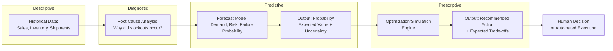

## Predictive and Prescriptive Analytics

### Definition

Predictive and prescriptive analytics represent two advanced stages in the analytics maturity spectrum applied to supply chain decision-making. **Predictive analytics** uses historical and current data to forecast what is likely to happen — future demand, potential disruptions, equipment failures — without specifying what action to take in response. **Prescriptive analytics** extends this by recommending or automatically determining the optimal course of action given predicted outcomes, explicit constraints, and defined objectives, effectively closing the loop between forecasting and decision-making.

### The Analytics Maturity Spectrum

Supply chain analytics is commonly framed as a four-stage maturity progression, with each stage building on the questions the prior stage answers:

| Stage | Core Question | Example Output | Typical Technique |
| --- | --- | --- | --- |
| Descriptive | What happened? | Historical sales report, past OTIF performance | Reporting, dashboards, basic aggregation |
| Diagnostic | Why did it happen? | Root-cause analysis of a stockout | Drill-down analysis, correlation analysis |
| Predictive | What is likely to happen? | Demand forecast, disruption risk probability | Statistical models, ML regression/classification |
| Prescriptive | What should we do about it? | Recommended reorder quantity, optimal rerouting plan | Optimization (MILP, LP), simulation, reinforcement learning |

$$\text{Analytics Value} \propto \text{Decision Impact} \times \text{Actionability}$$

Value generally increases moving up this spectrum, but so does implementation complexity and the data/modeling maturity required — prescriptive analytics cannot be reliably implemented without a sufficiently accurate predictive layer feeding it, and predictive analytics in turn depends on adequate descriptive/diagnostic data quality foundations.

### Predictive Analytics: Core Techniques

**Classification models**: Predict categorical outcomes (e.g., will this shipment arrive late: yes/no) using techniques such as logistic regression, decision trees, or gradient boosting classifiers.

**Regression models**: Predict continuous outcomes (e.g., expected demand quantity, expected lead time) using linear/non-linear regression or ML regression techniques (see also the time series and causal forecasting methods covered separately in this curriculum).

**Survival/failure analysis**: Predict time-to-event outcomes, most commonly equipment time-to-failure for predictive maintenance applications, using techniques such as Weibull analysis or Cox proportional hazards models.

**Anomaly/outlier detection**: Identify data points or patterns that deviate significantly from expected behavior, used for fraud detection, data quality issues, or early disruption signals.

### Prescriptive Analytics: Core Techniques

**Mathematical optimization**: Formulating the decision problem as an objective function subject to constraints, solved via:

$$\text{Minimize/Maximize } f(x) \text{ subject to } g_i(x) \leq b_i, \; i = 1, \dots, m$$

Where $x$ represents decision variables (e.g., order quantities, routing assignments), $f(x)$ is the objective (cost, service level, profit), and $g_i(x) \leq b_i$ represents constraints (capacity, budget, contractual minimums). Common solution methods include Linear Programming (LP) for continuous decisions and Mixed-Integer Linear Programming (MILP) when decisions involve discrete choices (e.g., open/close a facility, select a carrier).

**Simulation-based optimization**: Combining stochastic simulation (Monte Carlo methods) with optimization to identify robust decisions under uncertainty, rather than assuming deterministic inputs.

**Reinforcement learning (RL)**: Framing sequential decision problems (e.g., dynamic inventory replenishment across many periods) as a Markov Decision Process, where an agent learns a policy that maximizes cumulative reward through iterative interaction with a simulated or real environment — particularly suited to problems where the optimal action depends on evolving system state rather than a single static decision.

**Decision trees/rule-based recommendation engines**: Encoding explicit business logic and heuristics into automated recommendation systems, often used where full mathematical optimization is impractical or where transparency/auditability is prioritized over solution optimality.

### Illustration: From Prediction to Prescription

### Application Domains in Supply Chain

| Domain | Predictive Application | Prescriptive Application |
| --- | --- | --- |
| Demand Planning | Forecast future demand by SKU/location | Recommend optimal production/replenishment quantities |
| Inventory Management | Predict stockout/overstock probability | Recommend optimal safety stock levels and reorder points |
| Transportation | Predict shipment delay risk | Recommend optimal routing/carrier selection |
| Maintenance | Predict equipment failure probability/timing | Recommend optimal maintenance scheduling |
| Risk Management | Predict supplier disruption probability | Recommend contingency sourcing/allocation plan |
| Network Design | Predict future demand growth by region | Recommend optimal facility location/capacity investment |

### Predictive-Prescriptive Interdependency

A prescriptive model's recommendation quality is bounded by the accuracy and appropriate uncertainty representation of the predictive layer feeding it. A common architectural pattern is to feed prescriptive optimization not a single-point forecast but a **probability distribution** (e.g., P10/P50/P90 demand scenarios), allowing the optimization to produce recommendations that are robust across a range of likely outcomes rather than optimal only for one specific forecast that may not materialize exactly as predicted.

$$\text{Expected Cost} = \sum_{s} P(s) \cdot \text{Cost}(x, s)$$

Where $s$ represents different demand/supply scenarios weighted by their probability $P(s)$, and the optimization selects decision $x$ to minimize expected cost across the full scenario distribution rather than a single deterministic case — an approach known as **stochastic optimization**.

### Explainability as a Design Requirement

Because prescriptive recommendations directly drive operational actions (and often carry financial/service-level consequences if wrong), explainability is increasingly treated as a first-class architectural requirement rather than an afterthought:

- **Feature attribution**: Identifying which input factors most influenced a given prediction or recommendation
- **Scenario comparison**: Showing the trade-offs between the recommended action and alternative options (e.g., "this routing saves 8% cost but increases delivery time by 1 day versus the alternative")
- **Confidence/uncertainty display**: Communicating the reliability of the underlying prediction so planners can calibrate trust appropriately rather than treating all recommendations as equally certain

### Human-in-the-Loop vs. Fully Automated Execution

| Approach | Description | Typical Use Case |
| --- | --- | --- |
| Advisory/Recommendation | System suggests action; human reviews and approves | High-stakes, high-value, or low-frequency decisions (network redesign, major supplier changes) |
| Exception-Based Automation | System executes automatically within defined bounds; escalates exceptions to humans | Routine replenishment within normal parameters |
| Fully Autonomous | System executes without human review | High-frequency, low-risk, well-validated decisions (e.g., automated reorder for stable, low-value SKUs) |

[Inference: the degree of automation appropriate for a given decision is generally understood to scale inversely with decision stakes and forecast uncertainty, though the specific threshold for full automation varies by organization risk tolerance and is not governed by a universal standard]

### **Example**

A distribution network uses predictive analytics to forecast a 15% probability of a supplier disruption at a key Tier 1 facility over the next quarter, based on historical reliability data, financial health indicators, and geopolitical risk signals. Rather than stopping at this prediction, a prescriptive optimization layer evaluates several contingency sourcing scenarios — splitting orders across a backup supplier, pre-building safety stock, or securing alternate transportation capacity — and recommends the combination that minimizes expected cost across the range of possible disruption severities, weighted by their estimated probabilities, presenting planners with both the recommended action and the cost/risk trade-offs of the alternatives it considered.

### **Key Points**

- Predictive analytics answers "what is likely to happen," while prescriptive analytics answers "what should be done about it" — the two are sequential and interdependent, with prescriptive quality bounded by predictive accuracy.
- Prescriptive systems that incorporate probabilistic (rather than single-point) predictive input via stochastic optimization tend to produce more robust recommendations, since they account for the range of plausible outcomes rather than optimizing for one specific forecast.
- Explainability is a structural requirement for prescriptive systems used in operational decision-making, since planners and auditors need to understand why a recommendation was made, not just what it recommends.
- The appropriate level of automation (advisory, exception-based, fully autonomous) should generally scale with decision stakes and forecast confidence, though specific automation thresholds are organization-specific design choices rather than fixed rules.

### **Related Topics**

- Mathematical Optimization: Linear and Mixed-Integer Programming in Supply Chain
- Artificial Intelligence and Machine Learning in Planning
- Stochastic Optimization and Scenario-Based Planning
- Predictive Maintenance and Failure Analysis Techniques
- Digital Twins of Supply Chain Networks
- Explainable AI (XAI) for Operational Decision Systems