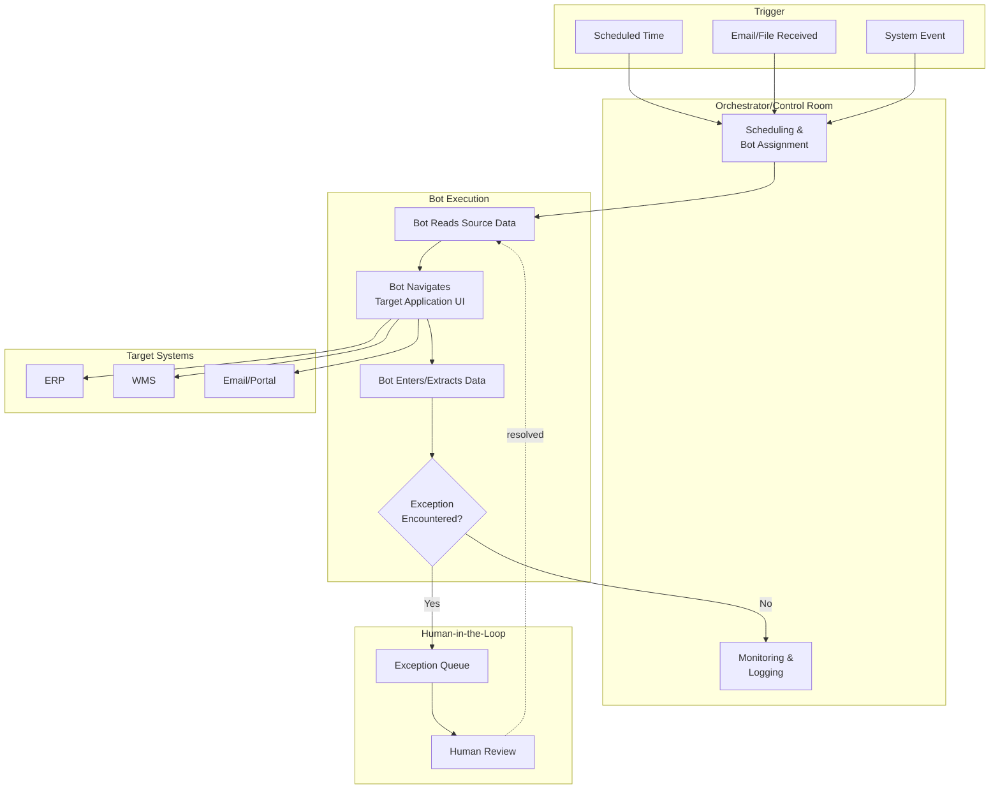

## Robotic Process Automation in Supply Chain Operations

### Definition

Robotic Process Automation (RPA) is a software technology that uses configured "software robots" (bots) to emulate human interactions with digital systems — clicking, typing, reading screens, extracting data, and navigating application interfaces — in order to automate structured, rule-based, repetitive digital tasks without requiring changes to the underlying systems being automated. In supply chain operations, RPA is distinct from physical warehouse robotics (automated guided vehicles, robotic arms); RPA operates entirely at the software/data layer, automating clerical and transactional work that would otherwise require manual human execution across enterprise applications, spreadsheets, emails, and web portals.

### Core Characteristics

- **Non-invasive integration**: RPA bots interact with existing systems through the same user interface a human would use (or via API/backend calls in more advanced implementations), meaning they typically require no modification to underlying legacy systems — a key advantage when automating around older ERP/WMS/TMS platforms that lack modern API layers
- **Rule-based execution**: Bots follow explicitly defined, deterministic logic ("if this condition, do this action") rather than learning or adapting behavior; this distinguishes classic RPA from AI/ML-based automation, though many current platforms combine both (see Intelligent Automation below)
- **Structured, repetitive task focus**: Best suited to high-volume, low-variability tasks with clear, consistent rules — RPA struggles with tasks requiring judgment, exception handling outside predefined rules, or unstructured data interpretation without added AI capability

### RPA Architecture Components

| Component | Function |
| --- | --- |
| Bot/Robot | The executable automation script that performs the task sequence |
| Orchestrator/Control Room | Central management platform scheduling, monitoring, and controlling bot execution across the environment |
| Recorder/Designer | Development tool used to build automation workflows, often via a visual, low-code interface capturing user actions |
| Credential/Vault Management | Secure storage and injection of login credentials bots need to access target systems |
| Exception Handling Queue | Routes tasks the bot cannot complete (due to unexpected data or system errors) to a human reviewer |
| Analytics/Reporting Dashboard | Tracks bot performance, throughput, error rates, and ROI metrics |

### Common Supply Chain RPA Use Cases

**Order Management**

- Automated order entry from emails, faxes, or portals into the ERP, particularly for trading partners without EDI/API integration
- Order status reconciliation across multiple disconnected systems

**Procurement**

- Automated purchase order creation triggered by reorder-point thresholds
- Invoice data extraction and three-way matching (PO, receipt, invoice) for accounts payable
- Supplier master data updates across multiple systems

**Inventory and Warehouse Operations**

- Cycle count data reconciliation between physical counts and system records
- Automated inventory report generation and distribution
- Cross-system inventory level synchronization where no real-time API integration exists

**Logistics and Transportation**

- Automated freight bill auditing and rate verification against contracted rates
- Shipment tracking data aggregation from multiple carrier portals lacking a unified API
- Automated bill of lading and customs document generation

**Customer Service**

- Automated order status responses to routine customer inquiries
- Return/refund processing for standard, rule-qualifying cases

### RPA vs. Traditional System Integration

| Attribute | RPA | API/EDI Integration |
| --- | --- | --- |
| Implementation speed | Fast (weeks) | Slower (requires formal integration development) |
| Underlying system changes required | None (UI-layer automation) | Often requires API development or EDI mapping |
| Best fit | Legacy systems without APIs, low-volume/ad hoc processes, temporary bridging solutions | High-volume, ongoing, mission-critical data exchange |
| Reliability/robustness | Fragile to UI changes (a system update can break the bot) | More robust (contract-based interfaces, versioned) |
| Scalability | Limited by bot licensing/infrastructure and UI-dependent execution speed | Highly scalable (designed for machine-to-machine throughput) |
| Long-term maintainability | Lower — often considered a tactical bridge rather than permanent architecture | Higher — designed as durable integration infrastructure |

[Inference: RPA is widely characterized in enterprise architecture practice as a tactical/bridging solution rather than a long-term integration strategy, given its fragility to UI changes; however, some organizations do maintain RPA in production for extended periods where building proper API integration is not economically justified, so "bridging" characterization is directional rather than universal]

### Intelligent Automation: RPA Combined with AI/ML

Modern RPA platforms increasingly incorporate AI/ML capabilities to extend beyond purely rule-based automation into **Intelligent Automation** or **Hyperautomation**:

- **Optical Character Recognition (OCR) + Natural Language Processing (NLP)**: Enabling bots to extract structured data from unstructured documents (supplier invoices, bills of lading, customs paperwork) rather than requiring pre-structured input
- **Machine learning-based exception handling**: Using classification models to route or resolve exceptions that fall outside strict rule-based logic, reducing the volume escalated to human review
- **Process mining**: Analyzing system logs to automatically discover which processes are good automation candidates and to identify inefficiencies in existing automated workflows

This convergence blurs the line between classic deterministic RPA and the broader AI/ML planning and decision-support capabilities covered elsewhere in this curriculum — a document processing bot that uses OCR/NLP to interpret an unstructured supplier invoice is applying AI/ML techniques within what is still fundamentally an RPA-orchestrated workflow.

### Governance and Risk Considerations

- **Bot inventory and ownership**: Without central governance, RPA deployments can proliferate informally ("shadow automation") across business units, creating maintenance and security risk when the original developer leaves or documentation is inadequate
- **Change management sensitivity**: Because bots interact with UI layers, upstream system updates (a new ERP version, a changed web portal layout) can silently break bot functionality, requiring proactive monitoring rather than assuming continued correct operation
- **Credential security**: Bots often require privileged system access; credential vaulting and least-privilege access design are necessary to avoid creating new attack surface
- **Audit trail requirements**: Particularly in procurement/finance-adjacent processes (invoice matching, payment processing), bot actions typically need to be logged with the same auditability standards applied to human-executed transactions

### **Example**

A distributor receives purchase orders from several smaller retail customers via email attachment (PDF) rather than EDI, since those customers lack EDI capability. An RPA bot monitors a dedicated inbox, uses OCR to extract order line items, customer identifiers, and quantities from each PDF, validates the extracted data against expected formats, and enters the order directly into the ERP system — replicating the keystrokes a data entry clerk would otherwise perform manually. Orders with unclear or malformed data that the bot cannot confidently parse are routed to an exception queue for human review rather than being entered incorrectly, and the bot's daily throughput and exception rate are tracked on an orchestrator dashboard to monitor performance over time.

### **Key Points**

- RPA automates work at the user-interface/software layer by emulating human system interactions, distinguishing it from both physical warehouse robotics and from API/EDI-based system-to-system integration.
- RPA is best suited to structured, rule-based, repetitive tasks — particularly valuable for bridging legacy systems that lack modern API layers — but is comparatively fragile to underlying UI/system changes and is generally considered less durable than proper API integration for long-term, high-volume data exchange.
- Combining RPA with AI/ML capabilities (OCR, NLP, ML-based exception handling) under an "Intelligent Automation" or "Hyperautomation" framing extends its applicability to less-structured tasks like unstructured document processing.
- Governance — bot inventory management, change monitoring, credential security, and audit trails — becomes essential as RPA deployment scales beyond isolated pilot automations, since ungoverned "shadow automation" creates maintenance and security risk.

### **Related Topics**

- EDI, APIs, and System-to-System Integration
- API-Led Integration and System Interoperability
- Artificial Intelligence and Machine Learning in Planning
- Warehouse Automation and Physical Robotics
- Process Mining for Supply Chain Process Discovery
- Intelligent Document Processing for Trade and Customs Documentation