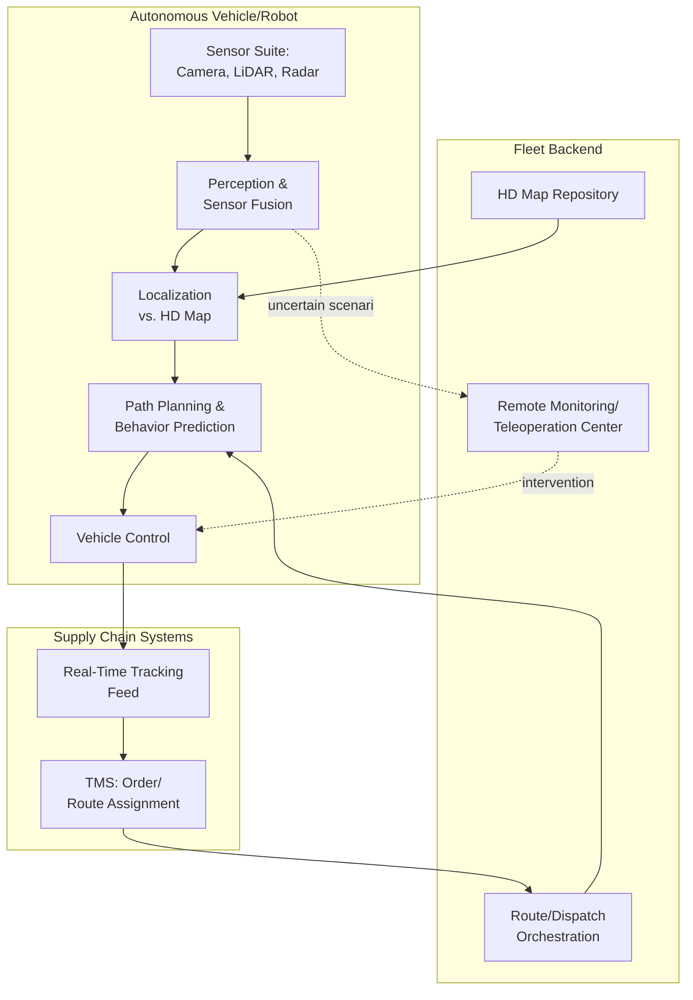

## Autonomous Vehicles and Delivery Robotics

### Definition

Autonomous vehicles and delivery robotics in supply chain operations encompass self-driving or remotely-supervised physical systems — long-haul autonomous trucks, driverless local delivery vans, sidewalk delivery robots, and delivery drones — that move goods through the physical supply chain with reduced or eliminated direct human operation. These systems automate the **product flow** layer of the supply chain at the transportation/last-mile stage, distinct from warehouse-internal robotics (AMRs, robotic arms) and from software-layer automation (RPA), though all three domains increasingly share underlying AI/perception technology stacks.

### Categories by Operating Domain

| Category | Operating Environment | Typical Range/Payload | Autonomy Level Commonly Deployed |
| --- | --- | --- | --- |
| Autonomous Trucking | Highway, long-haul freight corridors | Hundreds of miles, full truckload | High autonomy on defined highway corridors, often with human safety oversight at endpoints |
| Autonomous Local/Box Trucks | Urban/suburban surface streets, defined routes | Tens of miles, palletized/case goods | Driverless operation on pre-mapped, geofenced routes |
| Sidewalk Delivery Robots | Pedestrian sidewalks, short urban distance | 1-3 miles, small parcel/food | Autonomous navigation with remote monitoring/teleoperation fallback |
| Delivery Drones | Aerial, point-to-point | Several miles, small/light payload | Autonomous flight with regulatory-mandated oversight |

### SAE Levels of Driving Automation (Applied Context)

The SAE International J3016 framework, the standard reference for describing vehicle autonomy, defines six levels (0–5) of increasing automation. In current commercial supply chain deployments, most operational systems function in the following practical bands rather than at the theoretical extremes:

| SAE Level | Description | Current Supply Chain Relevance |
| --- | --- | --- |
| Level 2 (Partial Automation) | Driver-assist features (lane-keeping, adaptive cruise); human fully engaged | Common in conventional fleet trucks with driver-assist ADAS |
| Level 4 (High Automation) | Vehicle operates without human intervention within a defined operational design domain (ODD) | The level at which most current commercial driverless trucking and delivery deployments operate, restricted to mapped routes/geofenced areas |
| Level 5 (Full Automation) | Vehicle operates without human intervention under all conditions, no ODD restriction | Not yet commercially deployed at scale in supply chain contexts |

[Inference: characterizing most current commercial deployments as Level 4-within-a-defined-ODD reflects the consistent pattern across current reported deployments (geofenced routes, mapped corridors); this is standard industry practice rather than a claim about any single company's specific technical classification]

### Architectural Components Common Across Autonomous Delivery Systems

**Perception layer**: Sensor fusion combining cameras, LiDAR, radar, and (for ground robots) ultrasonic sensors to build a real-time model of the vehicle's surroundings — obstacles, pedestrians, other vehicles, road/path boundaries.

**Localization and mapping**: High-definition maps of the operational design domain combined with real-time GPS/inertial positioning to determine precise vehicle location relative to the mapped environment.

**Planning and decision-making**: Path planning and behavior prediction algorithms that determine vehicle trajectory, accounting for traffic rules, other road users' predicted behavior, and delivery-specific logic (e.g., finding a safe stopping/drop-off point).

**Control layer**: Translates planned trajectories into actual vehicle control commands (steering, acceleration, braking).

**Remote monitoring/teleoperation**: Many current deployments retain human oversight capability — remote monitoring centers that can intervene or take manual control when the autonomy stack encounters a scenario outside its confident operating parameters, functioning as a safety fallback rather than routine operation.

### Current Deployment Patterns Across the Value Chain

**Long-haul/middle-mile autonomous trucking**: Deployed on defined highway corridors between logistics hubs, often operating driverless box trucks moving branded goods for major consumer packaged goods companies under multi-year commercial agreements, typically restricted to specific metro-to-metro corridors rather than unrestricted nationwide operation.

**Last-mile ground robots**: Sidewalk delivery robots have expanded across many cities and countries, partnering with food delivery and grocery platforms, with large operating fleets completing deliveries within short distances (commonly under 30 minutes for a couple of miles) and high daily throughput of pedestrian/road crossings, generally under continuous remote monitoring with human fallback intervention available.

**Delivery drones**: Increasingly used for point-to-point delivery of light payloads, including committed partnerships between ride-hailing/delivery platforms and drone logistics providers targeting substantial daily delivery volumes in specific metro markets, and specialized applications such as time-critical medical/diagnostic sample transport where drone delivery has demonstrated dramatic transit-time reduction compared to ground transport in reported case studies.

### Key Benefits Cited in Current Deployments

- **Labor cost and availability**: Addressing persistent driver shortage challenges in freight trucking through autonomous middle-mile operation
- **Delivery speed for time-critical shipments**: Drone delivery for medical/diagnostic samples has demonstrated order-of-magnitude transit time reduction versus ground transport in specific reported deployments
- **Operating cost reduction for last-mile**: Sidewalk robots reduce per-delivery labor cost for short-distance, low-payload deliveries compared to human-driven last-mile options
- **Consistent, 24/7 operation**: Autonomous systems are not subject to the same duty-cycle/hours-of-service constraints as human drivers within regulatory limits set for the autonomous system itself

### Operational and Integration Constraints

- **Operational Design Domain (ODD) limitations**: Current commercial deployments are restricted to specific mapped routes, geographies, or conditions (weather, time of day) rather than operating unrestricted — this materially shapes network design, since routes must be selected or adapted to fall within a vehicle's validated ODD
- **Regulatory variation by jurisdiction**: Autonomous vehicle and drone regulations differ significantly by country, state/province, and even municipality, requiring supply chain network design to account for regulatory patchwork rather than assuming uniform deployability
- **Integration with TMS/dispatch systems**: Autonomous fleets must be integrated into existing transportation management and real-time tracking systems, typically via API, to be dispatched, monitored, and reconciled against standard logistics KPIs alongside conventional fleet assets
- **Fallback/exception handling design**: Systems must define clear escalation paths (remote teleoperation, roadside assistance dispatch) for scenarios outside normal operating parameters, since full autonomy without any human fallback remains uncommon in current commercial deployments

[Inference: the ODD-restricted, human-fallback-retained pattern is consistent across the deployment examples found in current search results; this reflects the current state of the technology as reported, not a permanent technical ceiling]

### **Example**

A consumer packaged goods manufacturer contracts with an autonomous trucking provider to move palletized product between a regional distribution center and retail fulfillment centers across several defined highway corridors, using driverless box trucks that operate within a mapped, geofenced operational design domain. Dispatch and routing are integrated with the manufacturer's TMS via API, so autonomous trips appear alongside conventional carrier shipments in the same tracking and performance dashboards. Separately, for last-mile delivery of smaller retail orders in dense urban markets, the manufacturer's retail partner uses sidewalk delivery robots for short-distance fulfillment, with a remote monitoring center providing oversight and intervention capability if a robot encounters an obstacle or situation outside its normal operating parameters.

### **Key Points**

- Current commercial autonomous vehicle and delivery robotics deployments in supply chain contexts predominantly operate within a defined, mapped Operational Design Domain with human remote-monitoring fallback, rather than unrestricted full autonomy — this shapes both technical architecture and network/route design.
- Different autonomy form factors (long-haul trucking, local box trucks, sidewalk robots, drones) address different segments of the transportation network, and are increasingly deployed as complementary rather than substitutable technologies within the same logistics network.
- Integration with existing TMS and tracking infrastructure via API is a practical prerequisite for autonomous fleets to be operationally managed alongside conventional transportation assets, rather than as an isolated parallel system.
- Regulatory variation by jurisdiction is a significant, non-technical constraint on deployment scope, requiring supply chain network design to account for where autonomous operation is currently legally permitted rather than assuming uniform availability. [Unverified: specific regulatory status varies by jurisdiction and changes frequently; current status should be verified for any specific operating region rather than assumed from general industry patterns]

### **Related Topics**

- Warehouse Automation and Physical Robotics (AMRs, Robotic Arms)
- EDI, APIs, and System-to-System Integration
- IoT Sensing and Asset Tracking
- Last-Mile Delivery Network Design
- Transportation Management Systems (TMS) Architecture
- Digital Twins of Supply Chain Networks