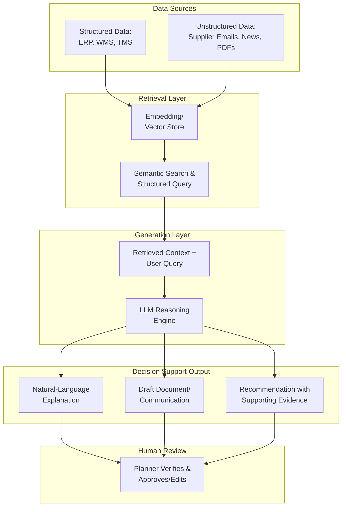

## Generative AI for Supply Chain Decision Support

### Definition

Generative AI for supply chain decision support refers to the application of large language models (LLMs) and related generative techniques to synthesize unstructured and structured supply chain data, generate natural-language explanations and scenario narratives, and produce draft artifacts (communications, reports, purchase orders, code) that assist human planners in making and executing decisions. It is distinct from — but frequently combined with — traditional predictive/prescriptive analytics: where predictive models forecast outcomes and prescriptive models recommend optimal actions through mathematical optimization, generative AI's core capability is synthesizing and communicating information in flexible, natural-language form, and increasingly, reasoning across multiple steps toward a decision.

### Distinguishing Three Related AI Architectures

Current industry framing consistently distinguishes three architecturally distinct AI capabilities that are often conflated under a single "AI" label:

| Architecture | Core Behavior | Initiative | Typical Output |
| --- | --- | --- | --- |
| Traditional/Predictive AI | Predicts what will happen based on statistical/ML models | Passive (queried or scheduled) | Forecast, probability, classification |
| Generative AI (Copilot/Conversational) | Explains, summarizes, or drafts content from data, responds when prompted | Reactive — waits for a prompt | Natural-language explanation, draft document, chart with narrative |
| Agentic AI | Perceives a change, reasons about it, decides an action, and executes across connected systems | Proactive — acts without waiting for instruction at each step | Executed action (e.g., placed order, updated schedule, sent alert) |

A useful summary distinction: traditional AI predicts what will happen; generative AI explains or summarizes what the data shows; agentic AI acts — for example, detecting that a supplier shipment will be late, evaluating alternatives, initiating a purchase order with a next-best supplier, updating the production schedule, and alerting customer service, within minutes of the disruption signal appearing, without waiting for step-by-step human instruction.

[Inference: this three-way distinction is consistently used across multiple current industry sources reviewed, though terminology and exact boundaries vary somewhat by vendor/analyst — treat this as the standard current framing rather than a single universally fixed taxonomy]

### Core Generative AI Capabilities in Decision Support

**Natural-language querying of supply chain data**

- Allows planners to ask questions in plain language ("why did fill rate drop in the Northeast region last week?") rather than building manual reports or dashboards
- Typically implemented via retrieval-augmented generation (RAG), where the LLM retrieves relevant structured/unstructured data before generating a response, grounding its answer in actual enterprise data rather than relying solely on pre-trained knowledge

**Scenario narrative generation**

- Converts the numerical output of simulation or optimization engines into human-readable explanations of trade-offs, contributing factors, and recommended actions
- Bridges the gap between a prescriptive optimization engine's mathematical output and a planner's need to understand and communicate the reasoning behind a recommendation

**Document and communication drafting**

- Drafting supplier communications, customer delay notifications, exception reports, and RFP/contract language
- Automating customs and trade compliance documentation drafting from structured shipment data

**Code and query generation**

- Generating data queries, spreadsheet formulas, or analysis scripts from natural-language requests, lowering the technical barrier for planners to perform ad hoc analysis without depending on a dedicated analytics team

**Multimodal synthesis**

- Combining structured data (inventory levels, order data), unstructured text (supplier emails, news reports), and in some implementations image/document data (scanned invoices, shipping manifests) into a unified analysis or summary

### Architecture: RAG-Grounded Decision Support Pipeline

### Reported Application Areas

| Application | Description |
| --- | --- |
| Demand forecasting narrative | Generating plain-language explanations of what is driving a forecast change, alongside the numerical output |
| Root-cause exploration | Answering ad hoc natural-language questions about performance drops, synthesizing multiple data sources without requiring a pre-built report |
| Supplier communication | Drafting delay notifications, RFQ requests, and negotiation correspondence |
| Customs/trade compliance documentation | Automating generation of trade documentation from structured shipment data |
| Scenario simulation narration | Explaining the trade-offs of alternative network or sourcing scenarios in accessible business language |
| Exception summarization | Synthesizing a large volume of exceptions/alerts into a prioritized, human-readable summary for planner triage |

### Adoption Signals and Current Maturity

Current industry surveys report substantial reported deployment activity, though independent verification of specific percentages was not possible from a single authoritative source: multiple industry surveys report a majority of supply chain organizations have deployed or initiated generative AI initiatives, with the stated trajectory across current commentary shifting emphasis from generative/conversational copilots toward agentic systems capable of autonomous execution. [Unverified: specific adoption percentages (e.g., "72%", "80%") come from vendor-sponsored or analyst surveys with varying methodologies and should be treated as directional industry signal rather than precise, independently verified figures]

A commonly cited maturity gap: most currently deployed capability stops a step short of full agentic execution — the system recommends, and a human approves — with the distance between recommending and deciding-and-acting characterized as depending on how reversible a decision is, how much rides on it, and whose accountability attaches to the outcome, rather than being purely a question of model capability.

### Governance and Reliability Considerations

Current industry commentary consistently identifies reliability and governance as the primary constraints on generative AI's practical impact in supply chain decision support, rather than model capability alone:

- **Grounding/hallucination risk**: LLM outputs not properly grounded via retrieval-augmented generation against verified enterprise data carry risk of generating plausible-sounding but factually incorrect recommendations
- **Data curation dependency**: The success of generative AI in supply chains depends substantially on data quality/curation, effective prompt design, and organizational leadership to orchestrate the systems, not just the underlying model
- **Accountability for autonomous action**: As capability shifts from explanation (generative) toward execution (agentic), questions of accountability for automated decisions become more consequential, driving the continued prevalence of human-in-the-loop approval steps for higher-stakes decisions
- **Explainability requirement**: Decision-support output needs to show its reasoning/evidence trail (what data it drew on, why it reached a conclusion) for planners to appropriately calibrate trust rather than accept recommendations uncritically

### Generative AI vs. Pure Optimization: Complementary Roles

Generative AI does not replace the mathematical optimization and probabilistic forecasting engines covered under predictive and prescriptive analytics — it operates as a **communication and reasoning layer** on top of them. A prescriptive optimization engine determines the mathematically optimal reorder quantity or routing plan; generative AI's role is to explain that recommendation in accessible language, answer follow-up questions about the reasoning, draft any resulting communications, and in agentic implementations, orchestrate the actual execution of the decision across connected systems — but the underlying optimization mathematics is typically still performed by dedicated engines rather than by the LLM itself. [Inference: this division of labor — optimization engines for the mathematical decision, generative AI for the language/communication/orchestration layer — reflects the reference architecture pattern described across current industry sources, though specific vendor implementations vary in how tightly integrated these components are]

### **Example**

A planning team receives an automated exception alert that a key supplier's shipment will arrive three days late. A generative AI-based decision support layer synthesizes the disruption context — pulling the supplier's historical reliability data, current inventory positions at affected distribution centers, and alternative supplier lead times — and generates a plain-language summary explaining the likely downstream impact (which customer orders are at risk, by how much) along with two or three ranked mitigation options drawn from an underlying optimization engine's output. In an advisory (non-agentic) configuration, a human planner reviews this summary and approves one option; in a more mature agentic configuration, the system would instead initiate the purchase order with the next-best qualified supplier and notify affected customers directly, escalating to a human only if the situation falls outside pre-defined guardrails.

### **Key Points**

- Generative AI, conversational/copilot AI, and agentic AI are architecturally distinct capabilities frequently conflated under a single "AI" label; the key differentiator is initiative — whether the system waits to be asked (copilot) or acts on its own within defined guardrails (agentic) — not merely which underlying model technology is used.
- Generative AI's core value in decision support is synthesis and communication — explaining, summarizing, and drafting — layered on top of, rather than replacing, the predictive forecasting and prescriptive optimization engines that perform the underlying mathematical analysis.
- Grounding generative AI output in verified enterprise data (typically via retrieval-augmented generation) is a structural requirement for reliable decision support, since ungrounded LLM output carries meaningful risk of confident-sounding but incorrect conclusions.
- Current industry commentary describes a maturity gap between widespread generative/conversational AI adoption and comparatively limited agentic (autonomous execution) deployment, with the gap characterized as a question of decision reversibility and accountability more than model capability. [Unverified: the pace and extent of this maturity shift is based on recent industry analyst and vendor commentary, which carries some incentive to characterize the technology's trajectory favorably]

### **Related Topics**

- Artificial Intelligence and Machine Learning in Planning
- Predictive and Prescriptive Analytics
- Agentic AI Governance and Human-in-the-Loop Design Patterns
- Retrieval-Augmented Generation (RAG) Architecture
- Digital Twins of Supply Chain Networks
- Data Governance in Multi-Tier Networks