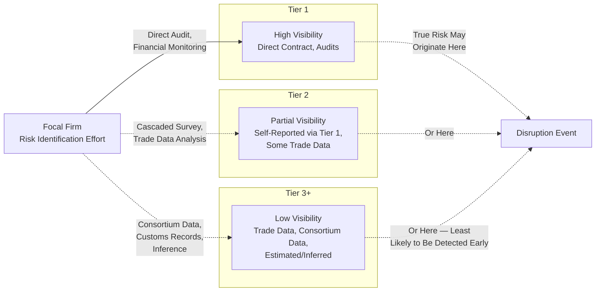

## Risk Identification Across Tiered Networks

### Definition

Risk identification across tiered networks is the systematic process of discovering, cataloguing, and characterizing potential disruption sources throughout a multi-tier supply chain — spanning Tier 1 through sub-tier suppliers — rather than limiting risk assessment to directly contracted (Tier 1) relationships. Because the majority of supply chain value and dependency often originates in tiers beyond direct contractual visibility, effective risk identification requires extending analysis upstream through supplier networks the focal firm does not directly control or, in many cases, does not even know exist.

### Why Tiered Risk Identification Differs from Single-Tier Risk Management

Traditional supplier risk management historically focused on Tier 1 suppliers, since these are the parties under direct contract and with the most readily available data (financial statements, audit access, performance history). However, many significant disruptions originate at Tier 2, Tier 3, or deeper — a single-source raw material producer or specialized component maker several tiers removed from the focal firm can halt production across an entire network despite having no direct contractual relationship with the affected end customer. This creates a structural **visibility gap** that widens with tier distance, as covered under supplier tiering: the focal firm's ability to identify risk decreases sharply as transactional distance from the focal firm increases, even though the potential disruption impact does not necessarily decrease correspondingly.

$$\text{Risk Exposure}(\text{Tier}_n) \neq f(\text{Visibility}(\text{Tier}_n))$$

Risk exposure at a given tier is not a function of how visible that tier is to the focal firm — a critical single-source Tier 3 supplier can carry disproportionate risk relative to its visibility, which is precisely why deliberate risk identification effort (rather than passive reliance on default visibility) is required at deeper tiers.

### Categories of Supply Chain Risk

| Risk Category | Description | Example Sources |
| --- | --- | --- |
| Operational Risk | Disruption to a specific supplier's ability to produce/deliver | Equipment failure, labor strikes, quality failures |
| Financial Risk | Supplier financial distress affecting continuity | Bankruptcy, credit downgrades, cash flow crisis |
| Geopolitical Risk | Government/political events affecting trade or operations | Sanctions, tariffs, export controls, conflict |
| Environmental/Climate Risk | Natural disaster or climate-related disruption | Floods, hurricanes, droughts, wildfires |
| Cyber/Digital Risk | IT system compromise affecting operations or data | Ransomware, data breaches, system outages |
| Compliance/Regulatory Risk | Failure to meet legal/regulatory requirements | Labor violations, environmental non-compliance, product safety |
| Concentration Risk | Over-reliance on a single source | Single-source suppliers, single geographic region |
| Reputational Risk | Association with unethical practices anywhere in the network | Forced labor, environmental violations at deep-tier suppliers |

### Risk Identification Techniques

**Supply Chain Mapping**

- Systematically documenting which suppliers exist at each tier and their interdependencies, often the foundational prerequisite for any deeper-tier risk identification effort
- Approaches range from **top-down** (focal firm surveys Tier 1 suppliers, who in turn survey their own suppliers, cascading the mapping request through the network) to **bottom-up** (specialized mapping services or data providers independently identify network relationships through trade data, customs records, or other public/commercial data sources)

**Trade and Customs Data Analysis**

- Bill-of-lading and customs import/export records can reveal actual shipment relationships between companies, providing an independent, less-cooperation-dependent data source for identifying deep-tier relationships that self-reported supplier surveys might miss or a Tier 1 supplier might be reluctant to disclose

**Financial and Public Data Monitoring**

- Continuous monitoring of supplier financial health indicators (credit ratings, public financial filings, news sentiment) for early warning signals of financial distress that could precede a disruption
- News and media monitoring (increasingly AI/NLP-assisted) to detect emerging risk signals — labor disputes, regulatory actions, natural disasters — affecting known or suspected supplier locations

**Supplier Self-Reporting and Audits**

- Direct surveys, questionnaires, and on-site audits of Tier 1 (and where contractually achievable, Tier 2) suppliers to capture risk factors not visible through external data sources
- Reliability depends on supplier cooperation and honesty, and coverage typically diminishes sharply beyond Tier 1 due to the focal firm's lack of direct contractual leverage over deeper tiers

**Industry Consortium and Shared Data Platforms**

- Participation in industry-wide data-sharing initiatives or traceability consortiums that pool supply chain mapping data across multiple focal firms, reducing duplicated mapping effort and improving deep-tier visibility beyond what any single firm could achieve independently

**Geographic and Concentration Analysis**

- Overlaying supplier location data against known risk factors (natural disaster zones, politically unstable regions, single points of geographic concentration) to identify structural concentration risk even without specific incident data

### Illustration: Risk Identification Coverage by Tier

### Structured Risk Identification Framework

A common structured approach organizes risk identification into sequential stages:

**1. Network Mapping**: Establish which entities exist at each tier and their relationships (the prerequisite for any risk identification beyond Tier 1)

**2. Risk Categorization**: Classify identified entities and relationships against the risk category taxonomy (operational, financial, geopolitical, environmental, cyber, compliance, concentration)

**3. Exposure Assessment**: Estimate the potential business impact if a risk materializes at each identified node — this typically depends on factors like single-source dependency, substitutability, and the criticality of the component/material to end-product production

**4. Likelihood Estimation**: Assess the probability of each identified risk materializing, using historical data, geographic/political risk indices, financial health indicators, or predictive analytics

**5. Prioritization**: Combine exposure and likelihood to focus limited risk mitigation resources on the highest-priority risk sources, since exhaustive deep-tier risk management of every node is rarely feasible

$$\text{Risk Priority Score} = \text{Impact} \times \text{Likelihood} \times \text{Visibility Gap Factor}$$

[Inference: this specific formula is a simplified illustrative framing combining the standard risk-prioritization logic (impact × likelihood) with an additional visibility-gap weighting factor reflecting the tiered-network context discussed here; organizations use varying specific prioritization methodologies and this is not a single universally standardized formula]

### Structural Challenges Specific to Tiered Risk Identification

- **Incentive misalignment**: As noted in data governance discussions, Tier 1 suppliers may resist disclosing their own upstream relationships to the focal firm due to competitive or disintermediation concerns, limiting the completeness of cascaded mapping efforts
- **Data staleness**: Supply networks change (suppliers switch sub-suppliers, add new sourcing relationships) faster than most mapping exercises are refreshed, meaning point-in-time risk identification can become outdated
- **Common supply base risk**: The same deep-tier supplier may serve multiple Tier 1 suppliers across a focal firm's own network (or across competing focal firms), creating hidden concentration risk that is invisible when each Tier 1 relationship is assessed in isolation rather than in aggregate
- **Resource constraints**: Comprehensive risk identification across every node in a large multi-tier network is often operationally and financially infeasible, requiring prioritization frameworks to focus effort where it matters most

### **Example**

An automotive OEM's Tier 1 supplier of electronic control units reports no known risk issues in its own operations. However, when the OEM commissions a deep-tier mapping analysis using customs trade data, it discovers that this Tier 1 supplier, along with two other seemingly unrelated Tier 1 suppliers in the OEM's network, all source a specific semiconductor component from the same single Tier 3 manufacturer located in a region with elevated natural disaster risk. This common supply base risk — invisible when each Tier 1 relationship was assessed independently — is only identified through deliberate deep-tier mapping, revealing that a single disruption event at that Tier 3 facility could simultaneously affect multiple points in the OEM's supply network.

### **Key Points**

- Risk identification limited to Tier 1 suppliers systematically misses a substantial share of actual disruption risk, since disruption impact does not correlate with the focal firm's visibility into a given tier.
- Effective deep-tier risk identification typically combines multiple complementary techniques — supplier self-reporting, trade/customs data analysis, financial monitoring, and industry consortium data — since no single source provides complete coverage, particularly beyond Tier 1.
- The incentive misalignment between focal firms (wanting visibility) and Tier 1 suppliers (wanting to protect their own upstream relationships) is a structural, not purely technical, barrier to comprehensive risk identification.
- Common supply base risk — where seemingly unrelated Tier 1 relationships share a hidden deep-tier dependency — is a distinct risk pattern that only becomes visible through network-level (rather than relationship-by-relationship) risk identification analysis.

### **Related Topics**

- Data Governance in Multi-Tier Networks
- Supply Chain Mapping and Deep-Tier Visibility Techniques
- Supplier Risk Management and Single-Source Dependency
- Digital Twins of Supply Chain Networks (Disruption Scenario Simulation)
- Defining Tier 1, Tier 2, Tier 3, and Sub-Tier Suppliers
- Risk Mitigation and Contingency Planning Strategies