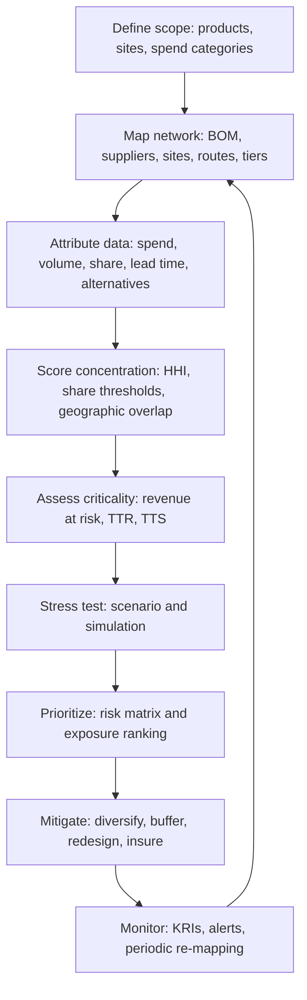
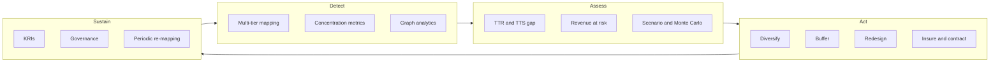

## Single Point of Failure and Concentration Risk Analysis


### Overview

A **Single Point of Failure (SPOF)** in a supply chain is any node, link, resource, process, or actor whose disruption alone can halt or materially degrade end-to-end flow of goods, information, or funds. **Concentration risk** is the broader exposure that arises when a disproportionate share of supply, capacity, demand, or dependency is held by a small number of entities, geographies, technologies, or channels. SPOFs are the extreme case (concentration = 100% with no alternative); concentration risk describes the continuum leading up to it.

Within the tiered structure of a supply chain (Tier 0 = OEM/focal firm, Tier 1 = direct suppliers, Tier 2+ = sub-tier suppliers, down to raw material extraction), SPOFs frequently hide in deep tiers where the focal firm has little visibility. The 2011 Thailand floods (hard-disk-drive component clusters), the 2021 Renesas Naka fab fire (automotive microcontrollers), the 2021 Suez Canal blockage (a maritime chokepoint), and the 2021 Ever Given event are commonly cited illustrations of concentration turning into systemic disruption. Specific loss figures vary by source and methodology.

**Key Points**

- A SPOF is defined by **substitutability and recovery time**, not merely by size.
- Concentration can exist along multiple dimensions: supplier, geography, technology, logistics route, energy/utility, IT platform, labor, and financial.
- Tier-1 diversification does not guarantee resilience if Tier-2/3 suppliers converge on the same upstream source ("hidden concentration" or "nth-tier convergence").
- Analysis is a repeatable cycle: map, quantify, stress-test, mitigate, monitor.

---

### 1. Conceptual Foundations

#### 1.1 Definitions

| Term | Definition |
| --- | --- |
| Single Point of Failure | A component whose failure disables the whole system, with no redundancy or timely alternative |
| Concentration Risk | Exposure from over-reliance on one or few entities, regions, or assets |
| Single Sourcing | Deliberate choice to use one qualified supplier (a strategy, not always a risk) |
| Sole Sourcing | Only one supplier exists in the market (a constraint, not a choice) |
| Dual/Multi-Sourcing | Qualified capacity from two or more independent suppliers |
| Chokepoint | A geographic or infrastructural narrowing (canal, strait, port, border crossing) through which flows concentrate |
| Common-Cause Failure | A single event causing simultaneous failure of nominally independent nodes |
| Time-to-Recover (TTR) | Time for a node to return to full function after disruption |
| Time-to-Survive (TTS) | Time the network can sustain operations without the node (buffer inventory, alternate routes, etc.) |

#### 1.2 Single Sourcing vs. Sole Sourcing vs. SPOF

Single sourcing is a **decision**; sole sourcing is a **market condition**; a SPOF is an **outcome** that depends on whether alternatives can be activated inside the TTS window. A single-sourced part with a qualified, pre-approved second source at 30% allocation is not a SPOF. A dual-sourced part where both suppliers buy the same wafer from one foundry is.

#### 1.3 The TTR/TTS Criterion

The Simchi-Levi et al. framework (MIT, "Reprint of Identifying Risks and Mitigating Disruptions in the Automotive Supply Chain") introduced the TTR/TTS logic, which remains widely adopted:

$$\text{Exposure Gap} = \text{TTR} - \text{TTS}$$

- If $\text{TTR} \le \text{TTS}$: the node is buffered; disruption is absorbed.
- If $\text{TTR} > \text{TTS}$: the node is a **critical exposure**, and financial/service impact accrues per unit time over the gap.

---

### 2. Dimensions of Concentration

**Key Points**

Concentration should be analyzed across independent axes, since mitigation on one axis (e.g., supplier) may leave another (e.g., geography) untouched.

| Dimension | Example Manifestation | Common-Cause Trigger |
| --- | --- | --- |
| Supplier | One vendor provides 80% of a component | Bankruptcy, fire, cyberattack, labor strike |
| Geographic | Multiple suppliers located in one seismic zone or flood plain | Earthquake, typhoon, flood, regional conflict |
| Technology/Process | Only one facility worldwide can perform a specialized process | Equipment failure, IP dispute |
| Material/Commodity | Reliance on a mineral mined in few countries (e.g., cobalt, rare earths, neon gas) | Export controls, political instability |
| Logistics/Route | One port, canal, rail line, or carrier | Blockage, strike, weather, sanction |
| Energy/Utility | Single grid, water source, or gas pipeline | Outage, drought, curtailment |
| IT/Data Platform | One ERP, EDI provider, or cloud region | Outage, ransomware |
| Labor/Skill | Specialized workforce concentrated in one location | Pandemic, migration, strike |
| Customer/Demand | One buyer represents a large share of a supplier's revenue | Contract loss (supplier viability risk) |
| Financial | Single bank, insurer, or currency | Credit event, sanctions |
| Regulatory/Certification | Single certifying body or approved-vendor list | Recall, decertification |

---

### 3. Tiered Visibility and Hidden Concentration

#### 3.1 The Visibility Problem

Most focal firms have contractual visibility into Tier 1 only. Empirical surveys (reported by industry bodies and consultancies; figures vary by study) consistently find that a minority of companies can map beyond Tier 1. The consequence is **nth-tier convergence**: many Tier-1 suppliers independently depend on the same Tier-3 source.

#### 3.2 Illustration of Convergence

Below is an SVG illustration of a converging tiered network. The raw SVG source is output inline.

<svg xmlns="http://www.w3.org/2000/svg" viewBox="0 0 760 460" width="760" height="460" font-family="Arial, Helvetica, sans-serif" font-size="12">
<title>Nth-Tier Convergence (svg_diagram)</title>
<rect x="0" y="0" width="760" height="460" fill="#ffffff" stroke="#cccccc" />
<text x="380" y="24" text-anchor="middle" font-size="15" font-weight="bold">Nth-Tier Convergence Hidden Behind Tier-1 Diversification (svg_diagram)</text>

<text x="20" y="80" font-weight="bold">Tier 0</text>

<text x="20" y="170" font-weight="bold">Tier 1</text>

<text x="20" y="270" font-weight="bold">Tier 2</text>

<text x="20" y="370" font-weight="bold">Tier 3</text>

<line x1="380" y1="100" x2="180" y2="150" stroke="#555" stroke-width="1.5" />
<line x1="380" y1="100" x2="380" y2="150" stroke="#555" stroke-width="1.5" />
<line x1="380" y1="100" x2="580" y2="150" stroke="#555" stroke-width="1.5" />
<line x1="180" y1="190" x2="140" y2="250" stroke="#555" stroke-width="1.5" />
<line x1="380" y1="190" x2="380" y2="250" stroke="#555" stroke-width="1.5" />
<line x1="580" y1="190" x2="620" y2="250" stroke="#555" stroke-width="1.5" />
<line x1="140" y1="290" x2="380" y2="345" stroke="#c0392b" stroke-width="2.5" />
<line x1="380" y1="290" x2="380" y2="345" stroke="#c0392b" stroke-width="2.5" />
<line x1="620" y1="290" x2="380" y2="345" stroke="#c0392b" stroke-width="2.5" />
<rect x="320" y="60" width="120" height="40" rx="6" fill="#dbe9f6" stroke="#2c3e50" />
<text x="380" y="85" text-anchor="middle">Focal Firm (OEM)</text>
<rect x="120" y="150" width="120" height="40" rx="6" fill="#e8f5e9" stroke="#2c3e50" />
<text x="180" y="175" text-anchor="middle">Supplier A</text>
<rect x="320" y="150" width="120" height="40" rx="6" fill="#e8f5e9" stroke="#2c3e50" />
<text x="380" y="175" text-anchor="middle">Supplier B</text>
<rect x="520" y="150" width="120" height="40" rx="6" fill="#e8f5e9" stroke="#2c3e50" />
<text x="580" y="175" text-anchor="middle">Supplier C</text>
<rect x="80" y="250" width="120" height="40" rx="6" fill="#fff8e1" stroke="#2c3e50" />
<text x="140" y="275" text-anchor="middle">Sub-supplier X</text>
<rect x="320" y="250" width="120" height="40" rx="6" fill="#fff8e1" stroke="#2c3e50" />
<text x="380" y="275" text-anchor="middle">Sub-supplier Y</text>
<rect x="560" y="250" width="120" height="40" rx="6" fill="#fff8e1" stroke="#2c3e50" />
<text x="620" y="275" text-anchor="middle">Sub-supplier Z</text>
<rect x="300" y="345" width="160" height="50" rx="6" fill="#fdecea" stroke="#c0392b" stroke-width="2" />
<text x="380" y="368" text-anchor="middle" font-weight="bold">Single Foundry / Mine</text>
<text x="380" y="384" text-anchor="middle">(Hidden SPOF)</text>

<text x="380" y="435" text-anchor="middle" font-style="italic">Three "diversified" Tier-1 suppliers all depend on one Tier-3 source.</text>

</svg>

#### 3.3 Detection Techniques

- **Bill of Materials (BOM) explosion** to sub-tier levels, matching parts to manufacturing sites.
- **Supplier questionnaires and attestations** (sub-tier disclosure clauses in contracts).
- **Trade data analysis** (bills of lading, customs records, import/export databases).
- **Graph analytics** on supplier networks (see Section 5.4).
- **Third-party risk intelligence platforms** that infer sub-tier relationships from public data. Coverage and accuracy vary by vendor and region [Inference: accuracy is not independently benchmarked across vendors].

---

### 4. Identification Methodology

#### 4.1 End-to-End Process



#### 4.2 Step-by-Step Detail

**Step 1 - Scope.** Select the product families, plants, or revenue streams under analysis. Prioritize by revenue contribution, margin, strategic importance, or regulatory exposure.

**Step 2 - Network Mapping.** Build a multi-tier map: parts to suppliers to manufacturing sites to ports/routes to customers. Capture attributes for each node: location (lat/long), capacity, utilization, certifications, ownership (parent company), and dependence on utilities.

**Step 3 - Quantification.** Compute concentration metrics (Section 5) at each tier and across each dimension.

**Step 4 - Criticality Assessment.** For each candidate SPOF, estimate financial impact per unit time, TTR, TTS, and qualification lead time for an alternative.

**Step 5 - Stress Testing.** Run disruption scenarios (Section 6).

**Step 6 - Prioritization.** Rank exposures using a risk matrix or expected loss.

**Step 7 - Mitigation and Monitoring.** Implement controls (Section 8) and define KRIs (Section 9).

---

### 5. Quantitative Metrics

#### 5.1 Concentration Ratio (CRn)

The share of total spend or supply held by the top $n$ suppliers:

$$CR_n = \sum_{i=1}^{n} s_i$$

where $s_i$ is supplier $i$'s share of the category (sorted in descending order). A common screening convention is $CR_1$ and $CR_3$.

#### 5.2 Herfindahl-Hirschman Index (HHI)

$$HHI = \sum_{i=1}^{N} (100 \cdot s_i)^2$$

where $s_i$ is a share expressed as a fraction ($0 \le s_i \le 1$). HHI ranges from near 0 (fragmented) to 10,000 (monopoly/single source).

**Interpretation bands.** Antitrust agencies use HHI bands to characterize market concentration, and these bands are frequently borrowed for supplier-base analysis. The exact thresholds have been revised over time (e.g., U.S. DOJ/FTC merger guidelines), so treat the following as illustrative screening heuristics rather than authoritative supply chain standards:

| HHI | Interpretation (illustrative) |
| --- | --- |
| < 1,500 | Low concentration |
| 1,500 - 2,500 | Moderate concentration |
| > 2,500 | High concentration |

**Example**

A component category has four suppliers with spend shares of 60%, 20%, 15%, and 5%.

$$HHI = 60^2 + 20^2 + 15^2 + 5^2 = 3600 + 400 + 225 + 25 = 4250$$


$$CR_1 = 0.60, \quad CR_3 = 0.95$$

**Output**

HHI = 4,250, which falls in the high-concentration band under the illustrative thresholds above. Although four suppliers exist, effective diversification is low.

#### 5.3 Effective Number of Suppliers

The inverse of the normalized HHI gives an intuitive "effective supplier count":

$$N_{eff} = \frac{1}{\sum_{i=1}^{N} s_i^2}$$

For the example above: $\sum s_i^2 = 0.36 + 0.04 + 0.0225 + 0.0025 = 0.425$, so $N_{eff} = 1/0.425 \approx 2.35$. A base of four nominal suppliers behaves like roughly 2.35 equal-sized suppliers.

#### 5.4 Graph-Theoretic Measures

Model the supply network as a directed graph $G = (V, E)$ where nodes are facilities and edges are material/service flows.

- **In-degree / out-degree centrality**: nodes with high out-degree feed many downstream nodes.
- **Betweenness centrality** ($C_B$): the fraction of shortest paths passing through a node. High betweenness indicates a bottleneck or chokepoint.

$$C_B(v) = \sum_{s \ne v \ne t} \frac{\sigma_{st}(v)}{\sigma_{st}}$$

where $\sigma_{st}$ is the number of shortest paths from $s$ to $t$ and $\sigma_{st}(v)$ is the number passing through $v$.

- **Articulation points (cut vertices)**: nodes whose removal disconnects the graph. These are structural SPOFs in an undirected representation.
- **Min-cut / max-flow**: the minimum capacity whose removal severs flow from raw source to customer; small min-cuts flag fragile paths.
- **k-connectivity**: the minimum number of nodes whose removal disconnects the network; $k = 1$ indicates at least one SPOF.

**Example (Python, NetworkX)**

```python
import networkx as nx

# Directed supply network: edges point downstream (supplier -> customer)
G = nx.DiGraph()
edges = [
    ("Foundry", "SubX"), ("Foundry", "SubY"), ("Foundry", "SubZ"),
    ("SubX", "SupA"), ("SubY", "SupB"), ("SubZ", "SupC"),
    ("SupA", "OEM"), ("SupB", "OEM"), ("SupC", "OEM"),
    ("RawMineA", "SubX"),
]
G.add_edges_from(edges)

# Articulation points require an undirected view
U = G.to_undirected()
articulation = list(nx.articulation_points(U))
print("Articulation points:", articulation)

# Betweenness centrality on the directed graph
bc = nx.betweenness_centrality(G, normalized=True)
for node, score in sorted(bc.items(), key=lambda kv: -kv[1]):
    print(f"{node:10s} {score:.3f}")

# Node connectivity between the raw source and the OEM
# (number of node-disjoint paths from Foundry to OEM)
k = nx.node_connectivity(G, "Foundry", "OEM")
print("Node-disjoint paths Foundry -> OEM:", k)
```

**Output** (expected behavior; exact ordering of tied scores may vary by NetworkX version)

- The `Foundry` and `OEM` nodes are not articulation points in this undirected view by themselves in the sense of disconnecting the middle layers, but `RawMineA` connects only through `SubX`, so `SubX` appears as an articulation point separating `RawMineA` from the rest.
- Three node-disjoint paths exist from `Foundry` to `OEM` (via SubX-SupA, SubY-SupB, SubZ-SupC), which superficially suggests redundancy. However, all three originate at one node (`Foundry`), so the **source itself** is the SPOF. This highlights that path-disjointness downstream does not remove an upstream common source; analysts must evaluate connectivity from *independent origins*, not from a shared node.

#### 5.5 Revenue-at-Risk and Expected Loss

$$\text{Loss}_{i} = \max(0,\ \text{TTR}_i - \text{TTS}_i) \times \text{Daily Margin at Risk}_i$$


$$\text{Expected Annual Loss}_i = P_i \times \text{Loss}_i$$

where $P_i$ is the estimated annual probability of a disruption at node $i$. Probability estimates are typically judgment-based or sourced from historical frequency data; treat them as uncertain [Inference: probabilities for low-frequency, high-impact events are rarely statistically robust].

**Example**

- Node: sole-source specialty resin plant
- TTR (fire scenario): 20 weeks (140 days)
- TTS (inventory + alternate routing): 6 weeks (42 days)
- Daily gross margin at risk: $400,000
- Annual disruption probability: 2% (assumed)

$$\text{Loss} = (140 - 42) \times 400{,}000 = 98 \times 400{,}000 = \$39{,}200{,}000$$


$$\text{Expected Annual Loss} = 0.02 \times 39{,}200{,}000 = \$784{,}000$$

**Output**

Expected annual loss of roughly $784,000, with a tail loss of $39.2M. The tail figure, not just the expectation, should drive mitigation decisions for rare high-severity events.

---

### 6. Stress Testing and Scenario Analysis

#### 6.1 Scenario Types

| Scenario Class | Description | Example |
| --- | --- | --- |
| Node failure | Loss of a single supplier/site | Fire at a sole-source plant |
| Regional failure | Loss of all nodes in a geography | Earthquake, flood, conflict |
| Route failure | Loss of a logistics corridor | Canal closure, port strike |
| Common-cause | Single trigger hitting multiple tiers | Regional power outage |
| Cyber | Loss of a shared IT/EDI platform | Ransomware on a logistics provider |
| Policy | Tariffs, export controls, sanctions | Mineral export ban |
| Demand shock | Sudden spike straining a bottleneck | Pandemic-driven demand surge |

#### 6.2 Simulation Approaches

- **Deterministic scenario analysis:** hand-defined "what if node X fails for T weeks" cases; fast and communicable to executives.
- **Monte Carlo simulation:** sample disruption occurrence and duration from distributions to produce loss distributions (e.g., Value-at-Risk style outputs).
- **Discrete-event / agent-based simulation:** model inventory, lead times, and rerouting dynamically.
- **Optimization-based (e.g., mixed-integer programming):** determine optimal sourcing mixes under disruption constraints, often called robust or stochastic supply network design.

**Example (Monte Carlo Loss Distribution, Python)**

```python
import numpy as np

rng = np.random.default_rng(seed=42)
N = 100_000

# Assumed parameters (illustrative)
p_disruption = 0.02          # annual probability of a disruption
ttr_mean_days = 90           # lognormal duration parameters below
ttr_sigma = 0.6
tts_days = 42
daily_margin = 400_000

occurs = rng.random(N) < p_disruption
# Lognormal duration with the given median approximately equal to ttr_mean_days
durations = rng.lognormal(mean=np.log(ttr_mean_days), sigma=ttr_sigma, size=N)

gap = np.maximum(0, durations - tts_days)
loss = np.where(occurs, gap * daily_margin, 0.0)

expected_loss = loss.mean()
p95 = np.percentile(loss, 95)
p99 = np.percentile(loss, 99)
tail_given_event = loss[occurs].mean() if occurs.any() else 0.0

print(f"Expected annual loss:      ${expected_loss:,.0f}")
print(f"95th percentile loss:      ${p95:,.0f}")
print(f"99th percentile loss:      ${p99:,.0f}")
print(f"Mean loss given event:     ${tail_given_event:,.0f}")
```

**Output**

Results depend on the random draws and assumed distribution parameters. With a 2% event probability, the 95th percentile will typically be $0 (since most simulated years have no disruption), while the 99th percentile and the conditional mean loss capture the tail. This illustrates why percentile-based and conditional-on-event metrics are more informative than the mean for rare events. Behavior may vary with the seed and parameterization.

---

### 7. Risk Prioritization

#### 7.1 Criticality Matrix

Plot each candidate SPOF on two axes: **impact** (revenue at risk, safety, regulatory) and **substitutability/recovery** (TTR relative to TTS).

```mermaid
quadrantChart
    title SPOF Prioritization
    x-axis Easy to Substitute --> Hard to Substitute
    y-axis Low Impact --> High Impact
    quadrant-1 Critical: mitigate immediately
    quadrant-2 Monitor closely
    quadrant-3 Accept
    quadrant-4 Improve substitutability
    Sole-source resin plant: [0.90, 0.85]
    Single ocean carrier lane: [0.45, 0.70]
    Commodity fasteners: [0.15, 0.15]
    Custom ASIC foundry: [0.92, 0.95]
    Packaging supplier: [0.35, 0.30]
```

#### 7.2 Scoring Model

A simple weighted scoring approach:

$$\text{SPOF Score}_i = w_1 \cdot I_i + w_2 \cdot S_i + w_3 \cdot V_i + w_4 \cdot D_i$$

where $I_i$ = impact, $S_i$ = substitution difficulty, $V_i$ = supplier vulnerability (financial/operational health), $D_i$ = detectability (low visibility raises the score), and $w_k$ are weights summing to 1. Weights are organization-specific and inherently subjective.

---

### 8. Mitigation Strategies

#### 8.1 Strategy Catalog

| Strategy | Mechanism | Trade-offs |
| --- | --- | --- |
| Dual/multi-sourcing | Qualify and allocate volume to 2+ independent suppliers | Higher unit cost, less volume leverage, qualification effort |
| Geographic diversification | Spread sites across regions with uncorrelated hazards | Complexity, tariffs, lead-time variation |
| Safety stock / buffer inventory | Increase TTS with strategic inventory | Working capital, obsolescence, holding cost |
| Design standardization / redesign | Use common or substitutable components; design for supply flexibility | Engineering cost, requalification |
| Vertical integration / dual-fab | Bring critical processes in-house or fund backup capacity | Capital intensity |
| Long-term agreements with capacity reservation | Contractually secure allocation during shortages | Lock-in, take-or-pay exposure |
| Alternate logistics routes and modes | Pre-negotiated backup carriers, ports, modes | Premium costs, contract complexity |
| Supplier development | Improve supplier resilience (BCP, financial support) | Investment, uncertain return |
| Risk transfer (insurance) | Contingent business interruption (CBI) coverage, parametric insurance | Premiums, exclusions, sub-limits, coverage gaps for sub-tier events |
| Dynamic monitoring | Early-warning systems and event alerts | Data cost, false positives |
| Postponement / modularity | Delay differentiation to increase flexibility | Process redesign |

#### 8.2 Choosing Between Strategies

Match the mitigation to the TTR/TTS gap and cost structure:

- **Small gap, low cost of failure:** accept or monitor.
- **Moderate gap:** safety stock and pre-negotiated alternates.
- **Large gap, high impact, long qualification time:** early dual sourcing, redesign, or vertical integration.
- **Chokepoints with no alternative:** insurance, inventory positioning, and contingency logistics plans.

#### 8.3 Cost-Benefit Framing

Compare the annualized mitigation cost against the reduction in expected and tail loss:

$$\text{Net Benefit} = (\text{EAL}_{before} - \text{EAL}_{after}) - \text{Annual Mitigation Cost}$$

**Example**

Building a second source reduces the resin node's TTR-TTS gap from 98 days to 20 days. Using the earlier parameters, tail loss falls from $39.2M to $20 \times 400{,}000 = \$8.0M$; expected annual loss falls from $784,000 to $0.02 \times 8{,}000{,}000 = \$160{,}000$.

$$\text{Reduction} = 784{,}000 - 160{,}000 = \$624{,}000$$

If the annualized cost of qualifying and maintaining the second source is $300,000, then:

$$\text{Net Benefit} = 624{,}000 - 300{,}000 = \$324{,}000 \text{ per year}$$

**Output**

Positive expected net benefit, plus a substantial reduction in tail exposure ($39.2M to $8.0M). Because rare-event probabilities are uncertain, decision-makers often weigh tail reduction even when expected-value benefit is marginal.

---

### 9. Monitoring and Key Risk Indicators (KRIs)

| KRI | Description | Example Trigger |
| --- | --- | --- |
| Single-source share | % of spend on parts with one qualified source | > 15% of critical-part spend |
| Category HHI | Concentration by category | HHI > 2,500 for critical categories |
| Geographic overlap | % of critical volume from one hazard zone | > 30% in one seismic/flood region |
| Supplier financial health | Credit score or altman-style score deterioration | Downgrade below threshold |
| Supplier concentration on customer | % of supplier revenue from the focal firm or its industry | > 40% (viability/dependency risk) |
| Days of cover vs. TTR | Inventory cover relative to estimated TTR | Cover < TTR on critical items |
| Sub-tier visibility ratio | % of critical BOM mapped to Tier-3+ | Below target (e.g., < 80%) |
| Chokepoint exposure | % of inbound volume passing a single port/canal | > 25% |
| Qualification lead time | Time to qualify an alternate | Increasing trend |
| Event alerts | Disruption events near critical nodes | Any severity-high alert within radius |

Thresholds shown are illustrative and should be calibrated to industry, product criticality, and risk appetite.

---

### 10. Worked End-to-End Example

**Scenario.** A medical device manufacturer (focal firm) produces a device requiring a specialty polymer housing and a microcontroller (MCU).

**Step 1 - Map.**

- Polymer: Suppliers P1 (70%) and P2 (30%); both source monomer from one chemical plant, M1, in a hurricane-prone region.
- MCU: Sole-sourced from vendor V1, fabricated at one foundry F1.
- Logistics: Both components arrive via one port, PortA.

**Step 2 - Compute concentration.**

Polymer supplier HHI: $70^2 + 30^2 = 4900 + 900 = 5800$; $N_{eff} = 1/(0.49 + 0.09) \approx 1.72$.

However, at the monomer tier, share of M1 = 100%, so HHI = 10,000. The Tier-1 dual sourcing masks a Tier-2 SPOF.

**Step 3 - Assess criticality.**

| Node | TTR (weeks) | TTS (weeks) | Gap (weeks) | Substitutable? |
| --- | --- | --- | --- | --- |
| M1 (monomer plant) | 16 | 5 | 11 | No (long qualification) |
| F1 (MCU foundry) | 26 | 8 | 18 | No (design lock-in) |
| PortA | 3 | 2 | 1 | Yes (alternate ports) |

**Step 4 - Prioritize.** F1 and M1 are critical exposures; PortA is a moderate concern.

**Step 5 - Mitigate.**

- MCU: start a redesign to qualify a pin-compatible second MCU; build 6 months of buffer stock as an interim measure; negotiate capacity reservation.
- Monomer: qualify an alternate monomer source outside the hurricane region; require sub-tier disclosure from P1 and P2.
- Port: pre-negotiate routing through PortB.

**Step 6 - Monitor.** Track HHI at Tier-2, days of cover vs. TTR, and hurricane-season alerts for the M1 region.

**Conclusion of example.** Tier-1 diversification created a false sense of security; only sub-tier mapping revealed the actual SPOFs.

---

### 11. Common Pitfalls

**Key Points**

- **Equating supplier count with resilience.** Two suppliers with a shared upstream source provide little redundancy.
- **Ignoring shared infrastructure.** Common utilities, ports, and IT platforms create correlated failure.
- **Static analysis.** Networks change; a one-time map becomes stale quickly.
- **Optimizing purely for cost.** Lean, single-source strategies raise efficiency but reduce buffer against disruption; the trade-off should be explicit.
- **Overweighting probability, underweighting severity.** Rare events dominate tail loss.
- **Unqualified "backup" suppliers.** An unqualified alternate cannot be activated within TTS; qualification lead time must be included in TTR.
- **Assuming insurance covers everything.** CBI policies commonly have sub-limits, waiting periods, and exclusions; sub-tier dependent-property coverage varies by policy.
- **Neglecting capacity of the alternate.** A second source with insufficient capacity, or one that also serves competitors, may not absorb the volume during a shared shock.
- **Data quality.** Sub-tier maps built from incomplete or inferred data can contain errors [Inference: error rates depend on data source and are rarely published].

---

### 12. Governance and Organizational Aspects

- **Ownership:** assign accountable owners for critical-node risk (procurement, supply chain risk, or a cross-functional resilience council).
- **Risk appetite statements:** define tolerance for single-source exposure by category.
- **Policy gates:** require SPOF assessments at sourcing decisions, new product introduction (NPI), and supplier onboarding.
- **Contractual controls:** sub-tier transparency clauses, business continuity plan (BCP) requirements, notification obligations, and step-in rights.
- **Regulatory context:** some jurisdictions and sectors (e.g., critical infrastructure, medical devices, defense) impose supply chain due diligence or resilience reporting. Specific obligations vary by jurisdiction and change over time; consult current regulations.
- **Cadence:** re-run mapping and stress tests at least annually and after major events (M&A, plant changes, geopolitical shifts).

---

### 13. Summary Framework



**Conclusion**

Single points of failure and concentration risk are structural properties of a supply network, not just supplier-performance issues. Effective analysis combines multi-tier visibility, quantitative concentration metrics (CRn, HHI, graph measures), time-based criticality (TTR vs. TTS), and scenario-driven loss estimation, then translates results into prioritized, cost-justified mitigation and continuous monitoring. Behavior of real networks under stress may vary from model outputs, and estimates for rare events carry substantial uncertainty.

**Related Topics**

- Supply Chain Mapping and Multi-Tier Visibility
- Supplier Risk Assessment and Scorecarding
- Business Continuity Planning and Disaster Recovery for Supply Chains
- Supply Network Design under Uncertainty (Stochastic and Robust Optimization)
- Contingent Business Interruption and Parametric Insurance
- Geopolitical and Trade Policy Risk
- Digital Twins for Supply Chain Resilience
- Supplier Diversification and Dual-Sourcing Strategy
- Inventory Buffering and Safety Stock Positioning
- Cybersecurity and Third-Party IT Concentration Risk