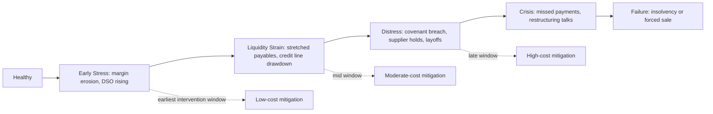
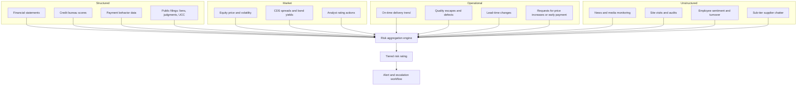
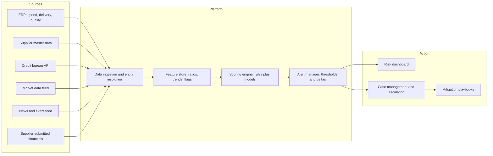
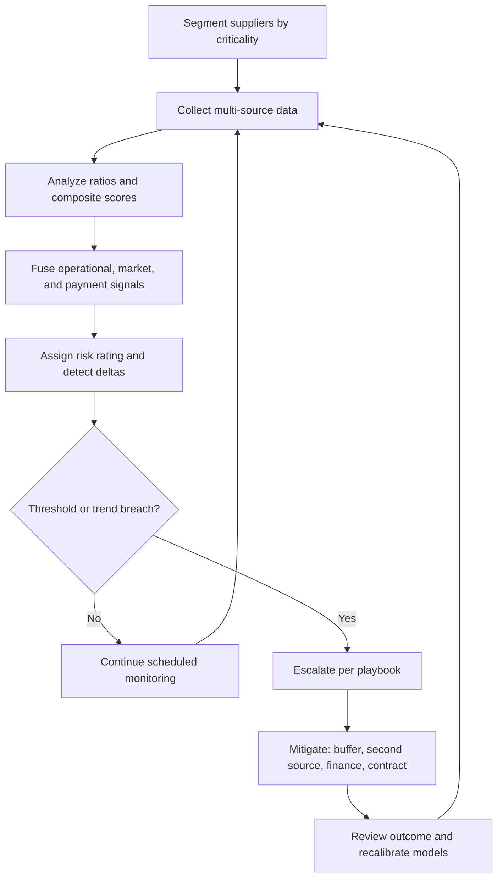

## Supplier Financial Health and Viability Monitoring


### Overview

**Supplier financial health monitoring** is the continuous practice of assessing whether a supplier has the economic capacity to keep delivering contracted goods and services at the agreed quality, volume, and price. **Viability** is the forward-looking question: will this supplier still be operating, solvent, and investing adequately over the planning horizon of the relationship? Financial distress at a supplier rarely arrives as a sudden event. It typically emerges as a progression of deteriorating signals (liquidity strain, late payments to sub-tier suppliers, deferred maintenance, quality slippage, management turnover, and covenant pressure) that precede insolvency by months or quarters.

In a tiered supply structure, financial fragility propagates in both directions. A distressed Tier-2 supplier can starve a Tier-1 supplier of inputs, which then fails to deliver to the OEM. Conversely, an OEM's own payment behavior and demand volatility can push a thinly capitalized Tier-1 supplier toward failure. This makes financial monitoring a structural component of supply chain risk management, complementary to single-point-of-failure analysis: a sole-source supplier that is also financially fragile represents compounded exposure.

**Key Points**

- Financial viability monitoring is **predictive and continuous**, not a one-time onboarding check.
- No single metric is sufficient; robust programs combine **financial statement analysis, market signals, payment behavior, operational indicators, and qualitative intelligence**.
- Monitoring intensity should be **risk-tiered**: spend, criticality, substitutability, and sole-source status determine depth and frequency.
- Data quality varies sharply by supplier type (public vs. private, large vs. small, jurisdiction). Private-company data is often stale, incomplete, or unaudited.
- Early detection has value only if paired with **pre-defined escalation and mitigation playbooks**.

---

### 1. Conceptual Foundations

#### 1.1 Key Terms

| Term | Definition |
| --- | --- |
| Liquidity | Ability to meet short-term obligations with readily available assets |
| Solvency | Ability to meet long-term obligations; assets exceed liabilities over time |
| Viability | Forward-looking capacity to continue operating and serving customers |
| Financial distress | Condition where obligations cannot be met on time or without severe restructuring |
| Insolvency | Inability to pay debts as they fall due (cash-flow test) or liabilities exceeding assets (balance-sheet test); legal definitions vary by jurisdiction |
| Going concern | Accounting assumption that an entity will continue operating for the foreseeable future |
| Covenant | Contractual financial condition imposed by lenders (e.g., maximum leverage) |
| Probability of Default (PD) | Estimated likelihood a borrower defaults within a stated horizon |
| Loss Given Default (LGD) | Fraction of exposure lost if default occurs |
| Days Sales Outstanding (DSO) | Average days to collect receivables |
| Days Payable Outstanding (DPO) | Average days taken to pay suppliers |

#### 1.2 Why Suppliers Fail

Common root causes include:

- **Working-capital squeeze:** extended customer payment terms, rapid growth consuming cash, or inventory build-up.
- **Over-leverage:** heavy debt service combined with margin pressure or rising interest rates.
- **Customer concentration:** loss or volume cut from a dominant customer (often the focal firm itself).
- **Input-cost shocks:** commodity, energy, or labor inflation not passed through in contracts.
- **Demand volatility:** cyclical end markets, program cancellations.
- **Operational failures:** quality escapes, recalls, plant incidents.
- **Governance and fraud:** misreporting, key-person dependency, related-party dealings.
- **Macro and regulatory shocks:** currency moves, tariffs, credit tightening.

#### 1.3 The Distress Progression



The value of monitoring is largely the **length of the intervention window** it buys. Mitigation cost rises steeply as a supplier moves from early stress toward crisis.

---

### 2. Financial Statement Analysis

Financial statement analysis relies on the balance sheet, income statement, and cash flow statement. Ratios should be interpreted **against industry benchmarks, historical trend, and peer group**, since acceptable levels differ widely across sectors (e.g., asset-heavy semiconductor fabrication vs. light assembly).

#### 2.1 Liquidity Ratios

$$\text{Current Ratio} = \frac{\text{Current Assets}}{\text{Current Liabilities}}$$


$$\text{Quick Ratio} = \frac{\text{Cash} + \text{Marketable Securities} + \text{Receivables}}{\text{Current Liabilities}}$$


$$\text{Cash Ratio} = \frac{\text{Cash} + \text{Marketable Securities}}{\text{Current Liabilities}}$$

Interpretation: values persistently below 1.0 on the current or quick ratio indicate potential difficulty meeting near-term obligations, though negative-working-capital business models (some retail and subscription businesses) can legitimately run lower.

#### 2.2 Leverage and Solvency Ratios

$$\text{Debt-to-Equity} = \frac{\text{Total Debt}}{\text{Total Equity}}$$


$$\text{Net Debt / EBITDA} = \frac{\text{Total Debt} - \text{Cash}}{\text{EBITDA}}$$


$$\text{Interest Coverage} = \frac{\text{EBIT}}{\text{Interest Expense}}$$


$$\text{Fixed Charge Coverage} = \frac{\text{EBITDA} - \text{Capex}}{\text{Interest} + \text{Scheduled Principal}}$$

Interpretation: interest coverage below roughly 1.5x is commonly treated as a warning threshold, and below 1.0x means operating profit does not cover interest. Net Debt/EBITDA thresholds are highly industry-specific [Inference: many lenders treat sustained levels above 4x to 5x as elevated for non-infrastructure industrials, but this is a heuristic, not a standard].

#### 2.3 Profitability and Margin Trend

$$\text{Gross Margin} = \frac{\text{Revenue} - \text{COGS}}{\text{Revenue}}$$


$$\text{EBITDA Margin} = \frac{\text{EBITDA}}{\text{Revenue}}$$


$$\text{Return on Assets} = \frac{\text{Net Income}}{\text{Total Assets}}$$

Trend matters more than level: three or more consecutive periods of margin compression, especially when paired with revenue growth, can signal underpricing or cost-pass-through failure.

#### 2.4 Efficiency and Working-Capital Metrics

$$\text{DSO} = \frac{\text{Accounts Receivable}}{\text{Revenue}} \times 365$$


$$\text{DPO} = \frac{\text{Accounts Payable}}{\text{COGS}} \times 365$$


$$\text{DIO} = \frac{\text{Inventory}}{\text{COGS}} \times 365$$


$$\text{Cash Conversion Cycle (CCC)} = \text{DIO} + \text{DSO} - \text{DPO}$$

Interpretation: a rising CCC consumes cash. A sharply rising DPO can signal that the supplier is **stretching its own suppliers to conserve cash**, a classic distress indicator visible in trade-credit data.

#### 2.5 Cash Flow Indicators

$$\text{Free Cash Flow} = \text{Operating Cash Flow} - \text{Capex}$$


$$\text{Operating Cash Flow to Debt} = \frac{\text{Operating Cash Flow}}{\text{Total Debt}}$$

Persistent negative operating cash flow funded by new debt or asset sales is a stronger distress signal than a single accounting loss, because it shows the core business is consuming rather than generating cash.

#### 2.6 Worked Ratio Example

A Tier-1 supplier reports the following (in $ millions):

| Item | Prior Year | Current Year |
| --- | --- | --- |
| Revenue | 200 | 230 |
| COGS | 160 | 195 |
| EBITDA | 24 | 15 |
| EBIT | 16 | 6 |
| Interest expense | 5 | 5.5 |
| Cash | 20 | 8 |
| Total debt | 60 | 78 |
| Accounts receivable | 30 | 46 |
| Accounts payable | 22 | 39 |
| Inventory | 25 | 40 |
| Current assets | 85 | 100 |
| Current liabilities | 55 | 90 |

**Computation**

$$\text{Interest Coverage}_{PY} = \frac{16}{5} = 3.2\times \qquad \text{Interest Coverage}_{CY} = \frac{6}{5.5} \approx 1.09\times$$


$$\text{Net Debt/EBITDA}_{PY} = \frac{60 - 20}{24} \approx 1.67\times \qquad \text{Net Debt/EBITDA}_{CY} = \frac{78 - 8}{15} \approx 4.67\times$$


$$\text{Current Ratio}_{PY} = \frac{85}{55} \approx 1.55 \qquad \text{Current Ratio}_{CY} = \frac{100}{90} \approx 1.11$$


$$\text{DSO}_{PY} = \frac{30}{200} \times 365 = 54.8 \text{ days} \qquad \text{DSO}_{CY} = \frac{46}{230} \times 365 = 73.0 \text{ days}$$


$$\text{DPO}_{PY} = \frac{22}{160} \times 365 = 50.2 \text{ days} \qquad \text{DPO}_{CY} = \frac{39}{195} \times 365 = 73.0 \text{ days}$$


$$\text{DIO}_{PY} = \frac{25}{160} \times 365 = 57.0 \text{ days} \qquad \text{DIO}_{CY} = \frac{40}{195} \times 365 = 74.9 \text{ days}$$


$$\text{CCC}_{PY} = 57.0 + 54.8 - 50.2 = 61.6 \text{ days} \qquad \text{CCC}_{CY} = 74.9 + 73.0 - 73.0 = 74.9 \text{ days}$$

**Output**

Despite 15% revenue growth, the supplier shows sharply weakened metrics: EBITDA fell from 24 to 15, gross margin compressed from 20.0% to 15.2%, interest coverage collapsed to about 1.09x, leverage nearly tripled to about 4.67x, cash fell by 60%, and the cash conversion cycle lengthened by about 13 days. The DPO jump of about 23 days indicates the supplier is stretching its own payables. This profile (growth financed by debt and supplier credit with margin erosion) is a textbook "growing into distress" pattern warranting escalation.

---

### 3. Composite Scoring Models

#### 3.1 Altman Z-Score

The Altman Z-Score is a widely cited multivariate discriminant model for predicting corporate bankruptcy. The original (1968) model targets publicly traded manufacturers:

$$Z = 1.2X_1 + 1.4X_2 + 3.3X_3 + 0.6X_4 + 1.0X_5$$

where:

- $X_1$ = Working Capital / Total Assets
- $X_2$ = Retained Earnings / Total Assets
- $X_3$ = EBIT / Total Assets
- $X_4$ = Market Value of Equity / Total Liabilities
- $X_5$ = Sales / Total Assets

Commonly cited interpretation zones for the original model: $Z > 2.99$ "safe," $1.81 \le Z \le 2.99$ "grey," and $Z < 1.81$ "distress."

**Variants** exist for other contexts:

| Variant | Applicability | Notes |
| --- | --- | --- |
| Z-Score (original) | Public manufacturers | Requires market value of equity |
| Z'-Score | Private manufacturers | Substitutes book value of equity for market value; different coefficients and cutoffs |
| Z''-Score | Non-manufacturers and emerging markets | Drops the sales-to-assets term to reduce industry bias |

**Limitations.** The model was calibrated on historical US manufacturing data; predictive accuracy varies by era, industry, and geography. It relies on accounting data that may be lagged or manipulated, and it should be treated as a **screening signal**, not a definitive prediction [Inference: out-of-sample performance on modern service-sector or asset-light suppliers is generally weaker than on the original sample].

**Example (Python)**

```python
def altman_z(working_capital, retained_earnings, ebit,
             market_equity, sales, total_assets, total_liabilities):
    x1 = working_capital / total_assets
    x2 = retained_earnings / total_assets
    x3 = ebit / total_assets
    x4 = market_equity / total_liabilities
    x5 = sales / total_assets
    z = 1.2*x1 + 1.4*x2 + 3.3*x3 + 0.6*x4 + 1.0*x5
    if z > 2.99:
        zone = "Safe"
    elif z >= 1.81:
        zone = "Grey"
    else:
        zone = "Distress"
    return round(z, 3), zone

# Illustrative supplier figures in $ millions
print(altman_z(
    working_capital=10,      # current assets - current liabilities (100 - 90)
    retained_earnings=18,
    ebit=6,
    market_equity=35,
    sales=230,
    total_assets=190,
    total_liabilities=140,
))
```

**Output**

$$X_1 = 0.053,\ X_2 = 0.095,\ X_3 = 0.032,\ X_4 = 0.25,\ X_5 = 1.211$$


$$Z = 1.2(0.053) + 1.4(0.095) + 3.3(0.032) + 0.6(0.25) + 1.0(1.211) \approx 1.66$$

The result of roughly 1.66 falls in the distress zone (below 1.81) under the original cutoffs, consistent with the deteriorating ratio profile in Section 2.6. Exact values depend on rounding.

#### 3.2 Other Statistical and Structural Models

| Model | Type | Brief Description |
| --- | --- | --- |
| Ohlson O-Score | Logistic regression | Uses nine accounting variables to estimate bankruptcy probability |
| Zmijewski Score | Probit model | Uses ROA, leverage, and liquidity |
| Merton / distance-to-default | Structural (option-based) | Treats equity as a call option on firm assets; requires market data and volatility estimates |
| Piotroski F-Score | Rule-based (0-9) | Nine binary accounting signals of financial strength; originally for value-stock screening |
| Vendor credit scores (e.g., commercial bureau failure/delinquency scores) | Proprietary | Blend financials, payment data, public records; methodology often not fully disclosed |

Structural and market-based models respond faster than accounting-based ones but only apply to listed entities. Proprietary vendor scores should be validated against the organization's own default and disruption history where possible [Unverified: comparative predictive accuracy across vendors is rarely published independently].

#### 3.3 Building an Internal Scorecard

Organizations frequently construct a weighted internal score combining quantitative and qualitative dimensions:

$$\text{Viability Score} = \sum_{k} w_k \cdot s_k, \qquad \sum_k w_k = 1$$

| Dimension | Example Weight | Example Inputs |
| --- | --- | --- |
| Liquidity | 20% | Current ratio, cash runway, available credit lines |
| Leverage / solvency | 20% | Net Debt/EBITDA, interest coverage |
| Profitability trend | 15% | Margin trajectory, EBITDA trend |
| Cash flow quality | 15% | Operating cash flow, free cash flow |
| Payment behavior | 10% | Days beyond terms, trade-credit reports |
| Concentration and dependency | 10% | Customer share, key-input dependency |
| Governance and qualitative | 10% | Audit opinion, management turnover, ownership changes |

Weights are organization-specific and inherently subjective; they should be calibrated back-tested against historical supplier failures where data allows.

---

### 4. Multi-Source Signal Framework

Financial statements are **lagging, periodic, and sometimes unavailable** (private suppliers). A mature program fuses multiple signal classes to shorten detection time.



#### 4.1 Signal Catalog

| Signal Class | Example Indicators | Latency | Coverage |
| --- | --- | --- | --- |
| Financial statements | Ratios, audit opinion, going-concern note | Quarterly to annual (lagging) | Public firms strong; private weak |
| Payment behavior | Days beyond terms, dunning notices, trade-credit tightening | Near real time to monthly | Broad where data is shared |
| Market data | Equity drawdown, credit spread widening, rating downgrade | Real time | Listed or rated entities only |
| Legal/public records | Liens, tax judgments, litigation, bankruptcy filings | Event-driven | Jurisdiction-dependent |
| Operational | Delivery slippage, quality drift, unusual expedite or price-increase requests | Real time (internal) | All active suppliers |
| Behavioral | Requests for advance payment, changes to payment terms, sudden inventory sell-offs | Real time (internal) | All active suppliers |
| Qualitative/intel | News, layoffs, executive departures, site condition | Event-driven | Variable |

#### 4.2 Operational Early-Warning Indicators

Operational and behavioral signals are often the **earliest available and cheapest** to observe because the focal firm already holds the data:

- Rising late deliveries or shrinking on-time-in-full (OTIF) performance.
- Quality deterioration (higher defect rates), which may indicate deferred maintenance or reduced inspection.
- Requests for **shorter payment terms, advance payment, or price increases** outside normal cycles.
- Reduced responsiveness, missing meetings, or unexplained management turnover.
- Reduced capital spending, deferred tooling investment, or plant underutilization.
- Sudden changes to the supplier's own sub-tier sourcing.

#### 4.3 Payment-Behavior Analytics

Trade-payment data is a strong leading indicator because firms often pay suppliers late **before** defaulting on bank debt. Commercial data providers aggregate payment experiences across many buyers. Interpretation typically focuses on:

- Average days beyond terms and its trend.
- Share of invoices paid more than 30 or 60 days late.
- Sudden divergence between a supplier's payment behavior toward itself and toward peers.

Coverage and representativeness depend on the provider and region, so results should be treated as indicative rather than conclusive.

---

### 5. Tiering the Monitoring Program

Not every supplier merits the same depth of analysis. Monitoring effort is allocated using a **criticality-by-vulnerability** logic.

#### 5.1 Supplier Segmentation

| Segment | Criteria | Monitoring Depth | Frequency |
| --- | --- | --- | --- |
| Critical | Sole/single source, long qualification time, high revenue at risk, low substitutability | Deep: full financial analysis, market signals, site visits, direct management dialogue | Continuous alerts plus quarterly formal review |
| Important | High spend or moderate substitutability | Standard: scorecard, vendor credit score, payment behavior | Monthly automated, semiannual review |
| Routine | Low spend, easily substitutable | Light: vendor credit score, public-record alerts | Annual or event-triggered |
| Transactional | One-time or spot purchases | Minimal: onboarding screening | At onboarding only |

#### 5.2 Prioritization Logic

$$\text{Monitoring Priority}_i = \text{Criticality}_i \times \text{Financial Vulnerability}_i$$

A critical sole-source supplier with mediocre financial health should rank above a fragile but easily replaced commodity supplier. This links directly to Single Point of Failure analysis: **financial fragility at a SPOF node is the highest-priority exposure**.

#### 5.3 Onboarding vs. Ongoing Monitoring

- **Onboarding due diligence:** verify legal entity, ownership structure and beneficial owners, audited financials (where available), credit report, insurance, sanctions screening, references, and evidence of business continuity planning.
- **Ongoing monitoring:** track deltas, not just levels. Changes in trajectory (e.g., a sudden drop in score) often matter more than a static rating.

---

### 6. Handling Data Gaps: Private and Small Suppliers

Many important suppliers are private, small, or located in jurisdictions with limited disclosure.

**Approaches**

- **Request financial statements contractually,** including audited statements where materiality justifies it, and require prompt notice of covenant breaches, going-concern doubts, or major customer losses.
- **Use commercial credit bureaus** for modeled scores, payment histories, and public-record data.
- **Rely on operational and behavioral proxies** (Section 4.2), which do not depend on disclosure.
- **Leverage supplier self-reporting** with verification through site visits or third-party audits.
- **Use industry benchmarks** and estimation from observable capacity, headcount, and volumes when direct data is unavailable [Inference: estimates derived this way carry wide uncertainty].
- **Accept and document residual uncertainty:** where data is thin, compensate with stronger contractual protections and mitigation (buffer stock, second source).

**Limitations.** Self-reported and unaudited figures may be inaccurate, and some jurisdictions have weaker accounting standards or enforcement. Score reliability generally falls as data quality falls.

---

### 7. Implementation Architecture

A scalable monitoring capability generally integrates data ingestion, scoring, alerting, and workflow.



#### 7.1 Key Design Considerations

- **Entity resolution:** map supplier records (name variants, DUNS-style identifiers, parent-subsidiary hierarchies) so that risk is attributed to the ultimate parent and to affiliated entities. Failure to resolve entities causes duplicate or missed exposure.
- **Corporate family linkage:** a healthy subsidiary of a distressed parent may still be at risk through cash pooling or parent guarantees; conversely, parent support may reduce risk.
- **Change detection:** alert on threshold breaches **and** on rapid changes (rate-of-change alerts).
- **Data lineage and auditability:** retain source, timestamp, and calculation logic for every score to support defensibility.
- **Privacy and legal considerations:** credit data and news scraping may be subject to data-protection, contractual, and competition-law constraints that vary by jurisdiction.

**Example (Python: rule-based flagging with delta detection)**

```python
import pandas as pd

def flag_supplier(row):
    flags = []
    if row["interest_coverage"] < 1.5:
        flags.append("LOW_INTEREST_COVERAGE")
    if row["net_debt_ebitda"] > 4.0:
        flags.append("HIGH_LEVERAGE")
    if row["current_ratio"] < 1.0:
        flags.append("LOW_LIQUIDITY")
    if row["dpo_change_days"] > 15:
        flags.append("STRETCHING_PAYABLES")
    if row["days_beyond_terms"] > 20:
        flags.append("LATE_PAYER")
    if row["ebitda_margin_change_pts"] < -3:
        flags.append("MARGIN_EROSION")
    if row["z_score"] < 1.81:
        flags.append("ALTMAN_DISTRESS")
    return flags

data = pd.DataFrame([
    {"supplier": "Alpha Components", "interest_coverage": 1.09, "net_debt_ebitda": 4.67,
     "current_ratio": 1.11, "dpo_change_days": 22.8, "days_beyond_terms": 28,
     "ebitda_margin_change_pts": -5.5, "z_score": 1.66, "criticality": "Critical"},
    {"supplier": "Beta Fasteners", "interest_coverage": 6.2, "net_debt_ebitda": 1.4,
     "current_ratio": 1.8, "dpo_change_days": 2.0, "days_beyond_terms": 3,
     "ebitda_margin_change_pts": 0.4, "z_score": 3.4, "criticality": "Routine"},
])

data["flags"] = data.apply(flag_supplier, axis=1)
data["flag_count"] = data["flags"].apply(len)

def escalation(row):
    if row["criticality"] == "Critical" and row["flag_count"] >= 3:
        return "ESCALATE_IMMEDIATE"
    if row["flag_count"] >= 3:
        return "ESCALATE_STANDARD"
    if row["flag_count"] >= 1:
        return "WATCHLIST"
    return "NORMAL"

data["action"] = data.apply(escalation, axis=1)
print(data[["supplier", "flag_count", "action"]])
```

**Output**

`Alpha Components` triggers all seven flags and, being critical, is set to `ESCALATE_IMMEDIATE`. `Beta Fasteners` triggers none and remains `NORMAL`. Thresholds in the code are illustrative and should be calibrated per industry and risk appetite.

---

### 8. Escalation and Mitigation Playbooks

Detection is only valuable if it triggers timely, proportionate action. Playbooks should be defined **before** distress emerges.

#### 8.1 Response Ladder

| Risk Level | Trigger Examples | Typical Actions |
| --- | --- | --- |
| Watchlist | One to two flags; mild deterioration | Increase monitoring frequency, request updated financials, verify with supplier management |
| Elevated | Multiple flags; falling score; covenant pressure | Executive review, joint financial deep-dive, review contract protections, evaluate qualified alternates, raise safety stock |
| High | Distress-zone score; missed payments to sub-tiers; loss of key customer | Activate dual-source qualification, secure tooling and IP, negotiate financial support or supply-chain financing, build buffer, prepare contingency logistics |
| Crisis | Formal restructuring, insolvency filing, imminent shutdown | Execute continuity plan, invoke step-in rights, emergency purchasing, legal counsel, protect tooling and inventory in transit |

#### 8.2 Mitigation Options

| Option | Mechanism | Considerations |
| --- | --- | --- |
| Buffer inventory | Increase time-to-survive | Working capital, obsolescence |
| Qualify alternate source | Reduce dependence | Qualification lead time and cost |
| Supply chain finance / reverse factoring | Buyer's credit strength lowers supplier's financing cost and accelerates supplier cash | Accounting and disclosure treatment can vary; concentration of financing provider risk |
| Accelerated payment / adjusted terms | Relieve supplier liquidity | Reduces buyer's own working capital; moral hazard |
| Direct financial support or prepayments | Loans, advances, or equity | Legal, accounting, preferential-treatment and control implications; potentially "throwing good money after bad" |
| Tooling and IP protection | Buyer-owned tooling, escrow of designs and processes | Enforceability depends on jurisdiction and insolvency regime |
| Contractual protections | Financial covenants, notification duties, step-in rights, termination-for-insolvency | Enforceability during insolvency varies; ipso facto clauses may be restricted in some jurisdictions |
| Supplier development / turnaround support | Operational improvement assistance | Resource-intensive; uncertain outcome |
| Exit / resourcing | Planned transition to alternate supplier | Cost and quality risk during transition |

#### 8.3 Insolvency-Law Considerations

Behavior in insolvency differs materially across jurisdictions. Important variables include automatic stays on creditor actions, treatment of pre-petition claims, rules on clawback of preferential payments, and limits on terminating contracts due to insolvency filings. Legal counsel should review critical contracts and jurisdictions in advance; outcomes may vary by case and forum.

---

### 9. Contractual and Commercial Controls

**Key Points**

- Embed **financial reporting obligations** (periodic statements, notice of material adverse change) in supply agreements.
- Include **financial covenants or triggers** (e.g., minimum liquidity, maximum leverage) that grant enhanced audit, information, or remedy rights when breached.
- Secure **business continuity and disaster recovery plan** requirements and evidence of testing.
- Consider **performance security**: parent guarantees, letters of credit, or performance bonds for critical, higher-risk suppliers.
- Retain **ownership or control of critical tooling, molds, and technical data**, with documented release procedures.
- Provide **step-in or transition-assistance rights** to enable orderly resourcing.
- Balance protection against **supplier relationship health**: overly punitive terms can themselves worsen supplier liquidity or deter honest disclosure.

---

### 10. Buyer-Induced Risk and Ethical Considerations

Focal firms can create or amplify supplier distress through their own behavior:

- **Extended payment terms** shift working-capital burden to suppliers; some jurisdictions regulate maximum terms or require reporting.
- **Volume volatility and late order changes** strain capacity and cash.
- **Aggressive price-downs** without cost transparency can erode margins.
- **Payment-term extensions combined with supply chain finance** can obscure true supplier financial strain and create hidden leverage; the supplier's dependence on the financing program becomes its own concentration risk [Inference: this risk is most acute if the financing provider withdraws or the buyer's credit deteriorates].

Monitoring programs should therefore include **buyer-side metrics** (own payment performance, share of supplier revenue, order-volatility indicators) to avoid the situation in which the buyer's practices are a root cause of the failure it seeks to detect.

---

### 11. Metrics for the Program Itself

| Program KPI | Definition |
| --- | --- |
| Coverage | % of critical/important spend under active monitoring |
| Data freshness | Median age of latest financial data per critical supplier |
| Detection lead time | Average time between first alert and actual distress event (retrospective) |
| Hit rate / precision | Share of alerts that proved material |
| Miss rate / recall | Share of actual failures not flagged in advance |
| Time-to-escalate | Elapsed time from alert to documented decision |
| Mitigation coverage | % of high-risk critical suppliers with active mitigation in place |
| Financially fragile SPOF count | Number of sole-source suppliers rated high risk |

Back-testing against historical supplier failures, near-misses, and disruptions is the primary way to calibrate thresholds and weights. Small sample sizes limit statistical confidence, so results should be interpreted cautiously.

---

### 12. Common Pitfalls

**Key Points**

- **Relying on a single score** without triangulating with operational and behavioral signals.
- **Using stale data:** annual statements can be 6 to 18 months old by the time they are reviewed.
- **Ignoring corporate family structure:** assessing a subsidiary in isolation from a troubled parent, or vice versa.
- **Treating the Altman Z-Score as universally valid:** it was calibrated on a specific population and can mislead for asset-light, financial, or emerging-market firms.
- **Threshold rigidity:** applying one-size-fits-all cutoffs across industries with different capital structures.
- **Alert fatigue:** excessive low-quality alerts cause real signals to be ignored.
- **No playbook:** detection without predefined actions leads to delay.
- **Ignoring sub-tier suppliers:** a healthy Tier-1 can be undermined by a failing Tier-2.
- **Over-supporting failing suppliers:** financial rescue without a credible turnaround plan can waste resources and delay necessary resourcing.
- **Neglecting buyer-induced stress** (Section 10).
- **Assuming vendor scores are validated:** methodologies are often proprietary and vary in accuracy by region and sector.

---

### 13. End-to-End Worked Scenario

**Context.** An automotive OEM depends on "Alpha Components," a sole-source Tier-1 supplier of a precision-machined module with a 9-month qualification time for an alternate. Alpha is privately held with unaudited management accounts shared semiannually.

**Detection Timeline**

| Month | Observation | Signal Class |
| --- | --- | --- |
| 0 | Baseline: coverage 3.2x, net debt/EBITDA 1.7x | Financial |
| 3 | Alpha requests 15-day shorter payment terms and a 4% price increase | Behavioral |
| 5 | On-time delivery slips from 98% to 91%; defect rate rises | Operational |
| 6 | Semiannual accounts: EBITDA down 38%, DPO up 23 days, cash down 60% | Financial |
| 7 | Commercial bureau reports days-beyond-terms rising to 28; a tax lien appears | Payment / legal |
| 8 | Local news reports layoffs and second-shift closure | Unstructured |

**Analysis**

- Month 3 (behavioral) and Month 5 (operational) signals arrived **before** the financial statements confirmed distress at Month 6, illustrating the lead-time value of internal data.
- Alpha is critical (sole-source, 9-month qualification), so monitoring priority is at maximum.
- Time-to-survive with current buffer stock is 6 weeks versus a 9-month alternate qualification time, giving a large exposure gap.

**Actions Taken**

1. Escalate to executive risk council at Month 6 (multiple converging flags).
2. Launch second-source qualification immediately (9-month clock starts).
3. Increase safety stock to cover as much of the qualification window as economically justified.
4. Secure buyer-owned tooling and confirm IP/drawing escrow.
5. Offer targeted, conditional liquidity support (e.g., accelerated payment on specific invoices in exchange for open-book visibility and a turnaround plan), after legal review.
6. Prepare contingency logistics and an insolvency response plan, including counsel review of contract termination and step-in rights.

**Conclusion of scenario.** Because the operational and behavioral signals were monitored, the intervention window opened around Month 3 to 5 rather than after a missed shipment. Outcomes remain uncertain: the supplier may recover, be acquired, or fail. The value of the program lies in having options and time.

---

### 14. Summary Framework



**Conclusion**

Supplier financial health and viability monitoring converts scattered financial, behavioral, operational, and market signals into an actionable, forward-looking view of supplier failure risk. Its effectiveness depends on risk-based segmentation, triangulation across signal types, careful treatment of data gaps for private suppliers, pre-defined escalation playbooks, and honest accounting for buyer-induced stress. Composite models such as the Altman Z-Score and proprietary vendor scores are useful screening tools but carry known limitations and should not replace judgment. Real-world outcomes vary by industry, jurisdiction, and market conditions, and rare-event predictions carry substantial uncertainty.

**Related Topics**

- Single Point of Failure and Concentration Risk Analysis
- Supply Chain Finance and Reverse Factoring
- Supplier Risk Assessment and Scorecarding
- Supplier Business Continuity Planning and Assurance
- Sub-Tier Visibility and Multi-Tier Mapping
- Contract Design for Supply Continuity and Insolvency Protection
- Insolvency Law and Supply Contract Termination
- Working Capital Optimization in Supply Networks
- Early-Warning Systems and Supply Chain Control Towers
- Supplier Development and Turnaround Support