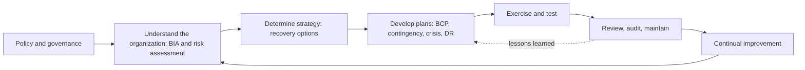
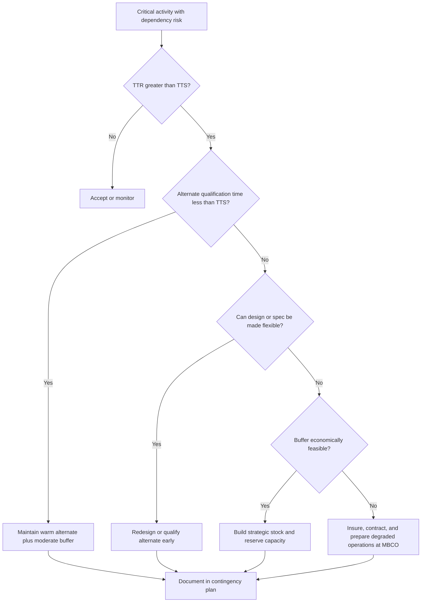
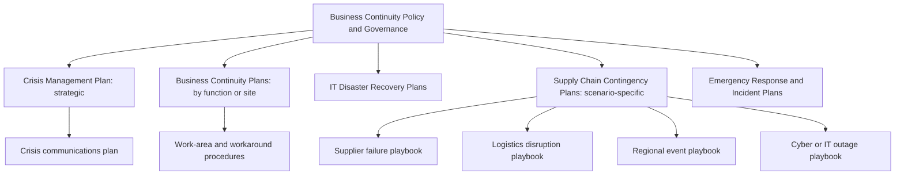
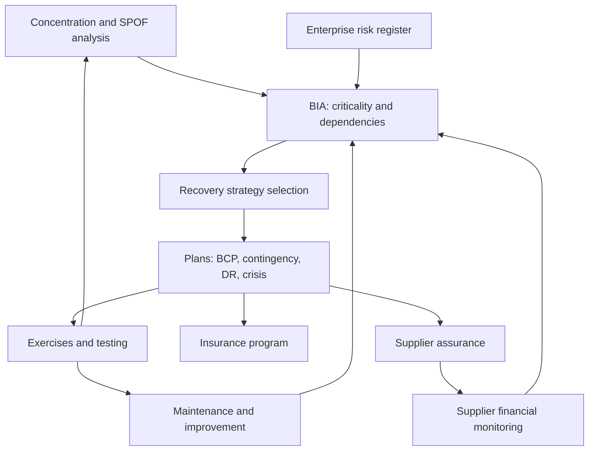
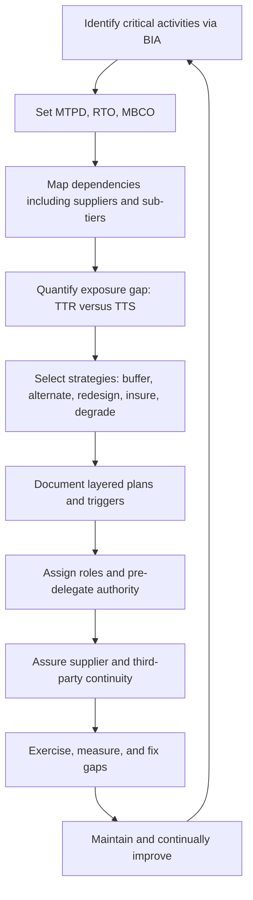

## Business Continuity and Contingency Planning


### Overview

**Business Continuity Planning (BCP)** is the structured discipline of preparing an organization to continue delivering its critical products and services at acceptable, pre-defined levels during and after a disruptive event. **Contingency planning** is the narrower, scenario-specific component: a documented set of pre-agreed actions, resources, roles, and decision rules to be activated when a particular risk materializes (for example, "sole-source resin plant offline for 12 weeks" or "primary port closed"). **Business Continuity Management (BCM)** is the overarching management system that governs the lifecycle of planning, exercising, maintaining, and improving these capabilities.

In supply chain contexts, continuity planning spans the focal firm and its tiered network. A focal firm can have an excellent internal plan and still fail if a Tier-2 supplier has none, if a logistics provider's recovery assumptions conflict with the firm's own, or if multiple suppliers share a single recovery dependency (a common data center, utility, or port). Continuity planning therefore complements the preceding topics in this chapter: **Single Point of Failure and Concentration Risk Analysis** identifies *where* the network is fragile, **Supplier Financial Health and Viability Monitoring** identifies *when* a node is likely to fail, and **Business Continuity and Contingency Planning** defines *what the organization does* when disruption occurs.

**Key Points**

- Continuity planning is **impact-driven**: it begins with what must keep running and how quickly, not with a list of threats.
- The core planning parameters are **Maximum Tolerable Period of Disruption (MTPD)**, **Recovery Time Objective (RTO)**, **Recovery Point Objective (RPO)**, and **Minimum Business Continuity Objective (MBCO)**.
- Plans are **all-hazards at the capability level** (loss of site, people, technology, suppliers) and **scenario-specific at the tactical level**.
- A plan that has not been exercised should be considered unvalidated. Exercising, maintenance, and governance are as important as the plan document.
- Supplier and sub-tier continuity must be **assured, not assumed**, through contractual requirements, evidence, and joint testing.

---

### 1. Conceptual Foundations

#### 1.1 Key Terms

| Term | Definition |
| --- | --- |
| Business Continuity Plan (BCP) | Documented procedures guiding an organization to respond, recover, resume, and restore operations to a pre-defined level after disruption |
| Contingency Plan | Scenario-specific plan with pre-agreed triggers, actions, and resources for a defined risk event |
| Disaster Recovery (DR) | Subset of continuity focused on restoring IT systems, data, and infrastructure |
| Crisis Management | Strategic-level leadership, decision-making, and communication during a severe event |
| Incident Response | Tactical, immediate actions to contain and stabilize the event |
| Business Impact Analysis (BIA) | Process of analyzing the operational and financial effects of disruption to prioritize activities |
| MTPD (or MAO) | Maximum Tolerable Period of Disruption (or Maximum Acceptable Outage): the time after which the organization's viability is threatened |
| RTO | Recovery Time Objective: target time to resume a product, service, or activity; must be less than MTPD |
| RPO | Recovery Point Objective: maximum tolerable data loss, measured as the time between the last recoverable data point and the disruption |
| MBCO | Minimum Business Continuity Objective: the minimum level of services or products acceptable during disruption |
| WRT | Work Recovery Time: time needed to verify data and return to normal operations after systems are restored |
| Resilience | Ability to absorb, adapt to, and recover from disruption |
| Trigger / Invocation Criteria | Pre-defined conditions that activate a plan |
| Time-to-Survive (TTS) | Time the network can sustain operations without the affected node, given buffers and alternates |
| Time-to-Recover (TTR) | Time for the affected node to return to full function |

#### 1.2 Relationship Among Timing Parameters

$$\text{RTO} + \text{WRT} \le \text{MTPD}$$

The recovery time objective plus the work recovery time must fit within the maximum tolerable period of disruption. If the sum exceeds MTPD, the recovery strategy is inadequate for that activity and must be redesigned (for example, by adding redundancy, alternate sources, or buffer stock).

In supply chain terms, this links to the exposure gap from network analysis:

$$\text{Exposure Gap} = \text{TTR} - \text{TTS}$$

Continuity strategies exist to either **raise TTS** (buffers, alternates, pre-positioned capacity) or **reduce TTR** (rapid recovery agreements, spare capacity, pre-qualified sources) so that the gap closes.

#### 1.3 Continuity vs. Resilience vs. Risk Management

| Concept | Orientation | Question Answered |
| --- | --- | --- |
| Risk management | Likelihood and impact of identified threats | "What could go wrong, and how do we reduce it?" |
| Business continuity | Capability to sustain critical outputs | "What do we do when it does go wrong?" |
| Resilience | Adaptive capacity of the whole system | "How well does the system absorb and adapt?" |

Continuity planning accepts that not all risks can be prevented and focuses on **impact reduction and recovery speed** regardless of cause.

---

### 2. Standards and Frameworks

Several widely used frameworks structure continuity programs. Specific clause numbering and revision status should be verified against the current published versions.

| Framework | Scope | Notes |
| --- | --- | --- |
| ISO 22301 (Security and resilience: Business continuity management systems) | Requirements for a BCM system; certifiable | Follows a Plan-Do-Check-Act structure; includes BIA and risk assessment, strategies, plans, exercising, and improvement |
| ISO 22313 | Guidance for implementing ISO 22301 | Non-certifiable guidance |
| ISO 22318 | Supply chain continuity guidance | Focused on supply chain continuity management |
| ISO 28000 (Security management systems for the supply chain) | Supply chain security management | Emphasizes security risks across the supply chain |
| ISO 31000 | General risk management principles | Foundation for integrating continuity into enterprise risk management |
| BCI Good Practice Guidelines | Professional practice lifecycle | Business Continuity Institute; defines a six-stage professional practice cycle |
| DRI Professional Practices | Professional practice | Disaster Recovery Institute International |
| NIST SP 800-34 | Contingency planning for federal information systems | IT-focused; widely referenced in the private sector |
| NFPA 1600 | Disaster/emergency management and business continuity | Emergency management orientation |

#### 2.1 Typical Lifecycle (PDCA-Aligned)



---

### 3. Business Impact Analysis (BIA)

The BIA is the analytical foundation of continuity planning. It determines **which activities are critical, how quickly they must recover, and what resources they depend on**.

#### 3.1 BIA Process

1. **Scope and identify activities:** list products, services, and the processes that deliver them (procurement, inbound logistics, production, quality, outbound logistics, customer service).
2. **Assess impact over time:** for each activity, estimate financial, operational, contractual, regulatory, safety, and reputational impact as disruption duration increases (for example, 4 hours, 1 day, 1 week, 4 weeks, 3 months).
3. **Set MTPD, RTO, and MBCO:** define the tolerable outage, the target recovery time, and the minimum acceptable output level.
4. **Map dependencies:** identify people, sites, technology, information, equipment, utilities, and **suppliers and outsourced providers** required for each activity.
5. **Identify single points of failure and gaps:** compare current recovery capability to required RTO.
6. **Prioritize and validate** with business owners and senior management.

#### 3.2 Impact Scoring Example

| Activity | Impact at 1 Day | Impact at 1 Week | Impact at 4 Weeks | MTPD | Proposed RTO |
| --- | --- | --- | --- | --- | --- |
| Final assembly | Moderate | Severe | Catastrophic | 2 weeks | 3 days |
| Inbound receiving | Low | Moderate | Severe | 3 weeks | 5 days |
| Order management (ERP) | Severe | Catastrophic | Catastrophic | 2 days | 4 hours |
| Spare-parts distribution | Low | Moderate | Severe | 4 weeks | 2 weeks |

Impact scales are organization-specific and frequently defined on a 1 to 5 or 1 to 10 scale with documented anchors (for example, dollar thresholds).

#### 3.3 Supply Chain Dependency Mapping

For each critical activity, capture:

- **Critical inputs:** part numbers, materials, services, and quantities per unit time.
- **Source structure:** supplier, tier, site, qualification status, and share of volume.
- **Lead times and qualification times:** including time to onboard an alternate.
- **Buffers:** inventory days of cover, in-transit stock, and consignment stock.
- **Shared dependencies:** common utilities, ports, IT platforms, or sub-tier sources (linking to concentration analysis).
- **Contractual position:** capacity reservation, allocation priority, force majeure terms, and step-in rights.

#### 3.4 Worked BIA Calculation

A manufacturer's daily contribution margin at risk for a product line is $500,000. A sole-source component supplier has a modeled TTR of 60 days after a fire. Buffer stock plus in-transit inventory provides 21 days of cover, and a pre-qualified alternate can begin partial supply (40% of demand) after 35 days.

**Step 1: Uncovered days without an alternate**

$$\text{Gap}_{\text{no alt}} = 60 - 21 = 39 \text{ days}$$


$$\text{Loss}_{\text{no alt}} = 39 \times 500{,}000 = \$19{,}500{,}000$$

**Step 2: With the alternate at 40% after day 35**

- Days 22 to 35 (14 days): no supply, full loss: $14 \times 500{,}000 = \$7{,}000{,}000$.
- Days 36 to 60 (25 days): 40% supplied, 60% unmet: $25 \times 0.60 \times 500{,}000 = \$7{,}500{,}000$.

$$\text{Loss}_{\text{alt}} = 7{,}000{,}000 + 7{,}500{,}000 = \$14{,}500{,}000$$

**Output**

The pre-qualified alternate reduces modeled loss from $19.5M to $14.5M, a $5.0M improvement. Closing the remaining gap would require higher buffer levels, faster ramp-up of the alternate, or higher alternate allocation. These figures are illustrative, assume linear margin loss, and ignore secondary effects such as contractual penalties and customer attrition.

---

### 4. Recovery Strategy Design

Once critical activities and dependencies are known, strategies are selected to meet RTO and MBCO within cost and risk appetite.

#### 4.1 Strategy Options by Resource Category

| Resource | Strategy Options |
| --- | --- |
| People | Cross-training, succession and deputy roles, remote work, alternate staffing pools, mutual aid agreements |
| Premises / production sites | Multi-site production, standby capacity, contract manufacturers, work-area recovery sites, relocation plans |
| Technology / data | High availability, geographic redundancy, cloud failover, backup and restore, manual workarounds |
| Information / records | Backups, offsite storage, vital-records protection, digital escrow |
| Suppliers / materials | Dual and multi-sourcing, safety stock, capacity reservation, pre-qualified alternates, design flexibility |
| Logistics | Alternate carriers, modes, routes, and ports; pre-positioned inventory; third-party logistics surge agreements |
| Utilities / energy | Backup generation, fuel reserves, alternate utility feeds, water storage |
| Finance | Liquidity reserves, credit facilities, insurance, emergency funding |

#### 4.2 Supply-Side Continuity Strategies in Detail

| Strategy | How It Improves Continuity | Trade-Offs |
| --- | --- | --- |
| Strategic safety stock | Raises TTS | Working capital, storage cost, shelf-life and obsolescence |
| Dual/multi-sourcing | Provides substitute capacity | Volume-leverage loss, qualification effort, possible shared upstream dependency |
| Pre-qualified "warm" alternate | Shortens TTR to resume supply | Retainer or minimum-volume cost; alternate must have real capacity |
| Capacity reservation agreements | Guarantees allocation during shortages | Take-or-pay exposure |
| Consignment or vendor-managed inventory | Places stock nearer to point of use | Contract complexity; supplier's own continuity still matters |
| Design flexibility (common parts, alternate specifications) | Widens the pool of acceptable inputs | Engineering and requalification cost |
| Postponement / modularity | Delays commitment, absorbs variability | Process redesign |
| Regional or dual-hub production | Limits regional common-cause failure | Footprint cost, complexity |
| Alternate logistics arrangements | Maintains flow if a route fails | Premium rates, contract overhead |
| Contingent business interruption (CBI) insurance | Transfers residual financial loss | Sub-limits, waiting periods, exclusions, and coverage of sub-tier dependent properties vary by policy |

#### 4.3 Strategy Selection Logic



#### 4.4 Cost-Justification Framing

$$\text{Net Benefit} = \left(\text{EAL}_{\text{before}} - \text{EAL}_{\text{after}}\right) - \text{Annualized Cost of Strategy}$$

Where EAL is expected annual loss. Because low-probability events dominate tail exposure, decision-makers frequently supplement expected-value analysis with **tail-loss** and **maximum-acceptable-loss** criteria. Probability estimates for rare events are typically judgment-based and uncertain [Inference: rare-event probabilities are seldom statistically robust].

---

### 5. Plan Architecture and Documentation

A continuity capability usually comprises **layered plans** with clear scope, ownership, and interfaces.

#### 5.1 Plan Hierarchy



| Plan Type | Audience | Focus |
| --- | --- | --- |
| Crisis Management Plan | Executive leadership | Strategic decisions, stakeholder communication, resource authorization |
| Business Continuity Plan | Functional and site teams | Continuing critical activities using alternate methods and resources |
| Supply Chain Contingency Plan | Procurement, planning, logistics, quality | Actions for specific supply disruptions |
| IT Disaster Recovery Plan | IT operations | System, data, and infrastructure recovery |
| Emergency Response Plan | Site personnel | Life safety, evacuation, first response |
| Crisis Communications Plan | Communications, legal, leadership | Internal, customer, supplier, regulator, and media messaging |

#### 5.2 Recommended Contents of a Supply Chain Contingency Plan

1. **Scope and scenario definition:** the specific disruption addressed (for example, "loss of Supplier A for up to 16 weeks").
2. **Activation criteria (triggers):** objective, measurable thresholds.
3. **Roles and responsibilities:** named owners, deputies, and decision authorities (RACI).
4. **Communication tree:** contact details, escalation paths, and notification templates.
5. **Immediate actions (first 24 to 72 hours):** containment, situation assessment, notifications.
6. **Recovery actions:** activate alternate sources, reallocate inventory, expedite logistics, adjust production plans.
7. **Resource requirements:** budget authority, personnel, inventory, transport, and tooling.
8. **Dependencies and assumptions:** with explicit validity conditions.
9. **Prioritization rules:** allocation of scarce supply across customers, products, and plants.
10. **Customer and stakeholder management:** messaging, commitments, and service-level relief.
11. **Return-to-normal criteria:** conditions and steps for standing down.
12. **Appendices:** supplier data, alternate-source qualification status, BOM criticality, contracts, and checklists.

#### 5.3 Trigger Design

Triggers convert monitoring signals into action. Good triggers are objective and tiered.

| Level | Example Trigger | Response |
| --- | --- | --- |
| Watch | Supplier announces unplanned maintenance; weather warning near key site | Heightened monitoring, confirm inventory, pre-alert teams |
| Alert | Confirmed outage with uncertain duration; port congestion exceeds threshold | Activate contingency team, assess exposure, begin expediting and pre-allocation |
| Activate | Confirmed disruption with TTR exceeding TTS | Invoke plan, engage alternates, execute allocation rules, executive notification |
| Crisis | Multi-site or prolonged disruption with material customer or financial impact | Convene crisis management team, external communications, funding authorization |

Avoid triggers that require perfect information: plans should authorize action under uncertainty, since delay is often the costliest failure mode.

---

### 6. Governance, Roles, and Command Structure

#### 6.1 Organization During an Event

| Role | Responsibility |
| --- | --- |
| Executive sponsor | Owns the program, sets risk appetite, allocates resources |
| Crisis Management Team (CMT) | Strategic decisions during a severe event |
| Business Continuity Manager/Coordinator | Runs the program, maintains plans, facilitates exercises |
| Function/site recovery teams | Execute continuity procedures |
| Supply chain response lead | Coordinates supplier actions, allocation, and logistics workarounds |
| Communications lead | Controls messaging to customers, suppliers, employees, media, regulators |
| Legal/compliance | Advises on contracts, force majeure, regulatory obligations, and insolvency implications |
| Finance | Funding, insurance claims, cost tracking |

#### 6.2 Decision Rights and Authority

Plans should define **who can declare an event, commit funds, and allocate scarce product** without waiting for committee approval. Pre-delegated authority limits (for example, spend up to a defined threshold for expedited freight or alternate purchasing) shorten response time. Delegation limits should be documented and approved in advance.

#### 6.3 Incident Command Alignment

Many organizations align crisis structures with an incident command model (clear command, defined span of control, common terminology, and integrated communications). The specific model adopted varies by organization and sector.

---

### 7. Supplier and Third-Party Continuity Assurance

A focal firm's continuity is only as strong as the continuity of its critical suppliers and providers. Assurance should be **tiered by criticality** and **evidence-based**.

#### 7.1 Assurance Program Elements

| Element | Description |
| --- | --- |
| Contractual requirements | Obligation to maintain a BCP, test it periodically, notify of disruptions promptly, and disclose sub-tier dependencies |
| Self-assessment questionnaires | Structured questionnaires covering BCP maturity, recovery objectives, site redundancy, and sub-tier dependence |
| Evidence requests | Plan summaries, test reports, certifications (for example, ISO 22301 where held), and insurance certificates |
| Audits and site visits | Verification of resilience measures for critical suppliers |
| Recovery-time alignment | Compare supplier RTO and capability against the buyer's required RTO |
| Joint exercises | Tabletop or live exercises involving both parties |
| Sub-tier visibility | Map and assess critical Tier-2 and Tier-3 dependencies |
| Continuous monitoring | Event alerts, financial monitoring, and performance indicators |

#### 7.2 Supplier BCP Assessment Scorecard (Illustrative)

| Criterion | Weight | Scoring Guide (0 to 4) |
| --- | --- | --- |
| Documented and approved BCP | 15% | 0 = none; 4 = current, approved, covers critical products |
| BIA-based recovery objectives | 15% | 0 = undefined; 4 = defined and aligned to customer needs |
| Exercise history | 20% | 0 = never tested; 4 = tested annually with documented remediation |
| Site and capacity redundancy | 20% | 0 = single site, no backup; 4 = multi-site with qualified spare capacity |
| Sub-tier dependency management | 15% | 0 = unknown; 4 = mapped with contingencies |
| Notification and escalation process | 15% | 0 = none; 4 = defined, 24-hour notification commitment |

$$\text{Score} = \sum_k w_k \cdot s_k$$

Weights and scales are organization-specific. Self-reported scores can be optimistic; verification effort should scale with supplier criticality [Inference: self-assessment inflation is widely reported in practice but its magnitude varies].

#### 7.3 Contractual Levers

- **Notification duties:** prompt notice (for example, within 24 hours) of events that may affect supply.
- **Allocation priority:** commitment on how limited output is shared during shortages.
- **Business continuity requirements:** maintenance and testing of a plan, with right to review.
- **Step-in rights and transition assistance:** ability to take over or transfer production in defined circumstances.
- **Tooling, IP, and data access:** buyer ownership or escrow of critical tooling, designs, and process documentation.
- **Force majeure clauses:** carefully drafted to clarify what events excuse performance and whether supplier-side sub-tier failures qualify. Enforceability and interpretation vary by jurisdiction.
- **Audit rights:** for critical suppliers.

---

### 8. Crisis Communication

Effective communication is often the deciding factor in perceived and actual recovery performance.

**Key Points**

- Pre-approve **templates and holding statements** for common scenarios.
- Define **audiences**: employees, customers, suppliers, regulators, insurers, investors, media, and communities.
- Establish **single-voice** spokespersons and clear approval routes.
- Maintain **redundant communication channels** (alternate email, messaging, phone trees, and out-of-band systems) that do not depend on the affected infrastructure.
- Communicate **what is known, what is unknown, what is being done, and when the next update will occur**.
- Coordinate with legal to avoid statements that create unintended liability, while preserving transparency.

#### 8.1 Customer Communication Under Shortage

When supply is constrained, customers need timely, credible information for their own planning. Useful elements:

- Confirmed impact scope and expected duration range (with stated uncertainty).
- Allocation approach (for example, pro-rata, priority customers, safety-critical uses first) and the rationale.
- Available alternatives or substitutions.
- Update cadence and a dedicated contact point.

Allocation rules should be reviewed against contractual obligations and applicable competition and fairness regulations, which vary by jurisdiction.

---

### 9. Exercising, Testing, and Validation

An untested plan is a hypothesis. Exercising validates assumptions, trains personnel, and reveals gaps.

#### 9.1 Exercise Types

| Exercise Type | Description | Typical Cost / Effort | Value |
| --- | --- | --- | --- |
| Plan review / walkthrough | Team reads through the plan for completeness | Low | Catches documentation errors |
| Tabletop exercise | Facilitated discussion of a scenario | Low to moderate | Tests decision-making and roles |
| Functional / simulation | Teams perform specific functions with simulated inputs | Moderate | Tests procedures and coordination |
| Full-scale / live exercise | Actual activation of alternates, failover, or relocation | High | Validates real capability; highest fidelity |
| Communication test | Callout and notification drill | Low | Verifies contact data and channel availability |
| Supplier joint exercise | Buyer and supplier rehearse a shared scenario | Moderate | Tests interface and alignment |
| Unannounced exercise | Surprise activation | Variable | Reveals true readiness; requires careful risk control |

#### 9.2 Designing a Supply Chain Tabletop Exercise

1. **Objectives:** for example, validate trigger thresholds, allocation decisions, and supplier notification speed.
2. **Scenario:** realistic, time-phased, with injects (new information arriving over time).
3. **Participants:** cross-functional (procurement, planning, logistics, quality, finance, legal, communications), plus selected suppliers.
4. **Injects:** escalating complications, such as "alternate supplier reports partial capacity only" or "port closure extends by two weeks."
5. **Facilitation and observation:** neutral facilitator; observers record decisions and gaps.
6. **Debrief and action tracking:** document findings, assign owners and deadlines, and track closure.

**Example Scenario Inject Timeline**

| Time | Inject | Decision Required |
| --- | --- | --- |
| T+0 h | Supplier reports a fire at its sole production site | Confirm scope; activate Alert level |
| T+8 h | Supplier estimates 12 to 20 weeks to restore output | Trigger Activate level; convene response team |
| T+24 h | Alternate supplier can supply 30% of demand in 5 weeks | Decide on ramp-up commitment and volume |
| T+72 h | Customer demands firm delivery dates | Approve allocation policy and customer message |
| T+1 wk | Buffer stock tracking shows 3 weeks of cover | Decide on spot purchases and production reschedule |

#### 9.3 Exercise Metrics

| Metric | Definition |
| --- | --- |
| Activation time | Time from trigger to team convened |
| Decision latency | Time to decide on key actions |
| Contact success rate | % of contacts reached within target time |
| RTO attainment | Whether recovery met the objective in the exercise |
| Action-item closure rate | % of findings closed on time |
| Plan accuracy | Number of documentation or assumption errors found |

---

### 10. Analytical Support: Modeling and Simulation

Quantitative modeling helps size buffers, evaluate alternates, and stress-test plans.

#### 10.1 Inventory Buffer Sizing Against a Disruption

For an activity with daily demand $d$, required cover to bridge a recovery gap of $G$ days (for a mitigated fraction $\alpha$ of demand supplied by an alternate after a lead time $L$):

$$\text{Buffer Units} = d \times \left[ L + (G - L)(1 - \alpha) \right], \quad G \ge L$$

**Example**

- Daily demand $d = 1{,}000$ units
- Gap to bridge $G = 60$ days
- Alternate lead time $L = 35$ days
- Alternate supplies $\alpha = 0.40$ of demand after day 35

$$\text{Buffer Units} = 1{,}000 \times \left[ 35 + (60 - 35)(1 - 0.40) \right] = 1{,}000 \times \left[ 35 + 15 \right] = 50{,}000 \text{ units}$$

**Output**

Full bridging would require about 50,000 units of buffer (50 days of cover). The organization may deliberately hold less and accept degraded operation at the MBCO for part of the period, trading carrying cost against shortfall cost.

#### 10.2 Monte Carlo Contingency Evaluation (Python)

```python
import numpy as np

rng = np.random.default_rng(7)
N = 100_000

# Illustrative assumptions
p_event = 0.03                 # annual probability of the disruption
daily_margin = 500_000         # $ contribution margin per day
median_ttr = 60                # days, lognormal median
sigma = 0.5

def simulate(buffer_days, alt_lead_days=None, alt_share=0.0):
    occurs = rng.random(N) < p_event
    ttr = rng.lognormal(mean=np.log(median_ttr), sigma=sigma, size=N)
    loss_days = np.maximum(0, ttr - buffer_days)
    if alt_lead_days is not None:
        # Portion of the gap before the alternate starts: full loss
        pre = np.minimum(loss_days, max(0, alt_lead_days - buffer_days))
        post = np.maximum(0, loss_days - pre)
        effective_loss_days = pre + post * (1 - alt_share)
    else:
        effective_loss_days = loss_days
    loss = np.where(occurs, effective_loss_days * daily_margin, 0.0)
    return loss

def summarize(name, loss):
    occ = loss[loss > 0]
    print(f"{name:32s} EAL=${loss.mean():>10,.0f} | "
          f"P99=${np.percentile(loss, 99):>12,.0f} | "
          f"Mean|event=${occ.mean() if occ.size else 0:>12,.0f}")

summarize("Baseline (21d buffer)", simulate(21))
summarize("+ warm alternate (40%, day 35)", simulate(21, alt_lead_days=35, alt_share=0.40))
summarize("+ larger buffer (45d) + alternate", simulate(45, alt_lead_days=35, alt_share=0.40))
```

**Output**

The script prints expected annual loss (EAL), 99th-percentile loss, and mean loss given an event for three configurations. In general, adding a warm alternate and a larger buffer reduces both EAL and tail loss, with diminishing returns as buffer approaches the modeled TTR. Numerical results depend on the random seed, distribution assumptions, and the simplified loss logic, and should not be interpreted as predictions. Behavior may vary with parameterization.

---

### 11. Special Scenarios and Playbook Examples

#### 11.1 Sole-Source Supplier Failure

- **Immediate:** confirm scope with the supplier; request site status, recovery estimate, and tooling/inventory location; secure in-transit stock.
- **Assess:** compute TTR vs. TTS by SKU; identify products at risk by revenue and customer priority.
- **Act:** activate pre-qualified alternate; invoke capacity reservation; expedite qualification of second source; move tooling if owned by the buyer; reprioritize production.
- **Communicate:** customers (allocation and dates), internal leadership, insurers.
- **Recover:** stagger return to primary supplier; re-audit before full volume restoration.

#### 11.2 Port or Logistics Chokepoint Disruption

- **Immediate:** identify shipments in transit and at risk; contact carriers and forwarders.
- **Act:** reroute via alternate ports or modes (air freight for high-value critical items, rail or truck where feasible); adjust delivery schedules; use pre-positioned inventory or regional buffers.
- **Consider:** demurrage, detention, and surge-cost exposure; carrier capacity contention during regional events (other shippers competing for the same alternates).

#### 11.3 Regional Natural Disaster

- **Immediate:** life safety and personnel accounting; assess damage to own and supplier sites within the affected region.
- **Act:** activate multi-site production shifts; use geographic diversification; coordinate with insurers on claims.
- **Consider:** correlated failure among suppliers in the same region (common-cause), utilities, and local labor availability.

#### 11.4 Cyber or IT Outage (Own or Third-Party)

- **Immediate:** isolate affected systems; activate incident response and IT DR; engage legal and regulatory notification as required.
- **Act:** switch to manual or degraded procedures (paper-based picking, offline order processing); use out-of-band communications with suppliers and customers.
- **Consider:** dependency on shared platforms (EDI providers, logistics visibility tools, cloud regions), and supplier systems that connect to the focal firm's network.

#### 11.5 Supplier Insolvency

- **Immediate:** legal counsel on contract status, stays, and preferential-payment rules; secure tooling, IP, and inventory.
- **Act:** transition volume to alternates; consider conditional financial support only after legal and commercial review.
- **Consider:** insolvency law varies by jurisdiction, including limits on terminating contracts and treatment of pre-petition claims.

#### 11.6 Geopolitical or Trade-Policy Shock

- **Immediate:** assess exposure by country, part, and material; check regulatory obligations (sanctions, export controls, tariffs).
- **Act:** re-source or relocate volume; use bonded storage or alternate customs strategies where legal; renegotiate contract terms.
- **Consider:** compliance obligations may restrict certain workarounds; legal review is essential.

#### 11.7 Pandemic or Workforce Disruption

- **Immediate:** health and safety measures; workforce availability assessment.
- **Act:** cross-train staff; adjust shifts; enable remote work for non-production roles; prioritize essential products.
- **Consider:** labor disruptions across multiple tiers simultaneously, and border or transport restrictions.

---

### 12. Integration with Adjacent Disciplines



| Adjacent Area | Integration Point |
| --- | --- |
| Concentration / SPOF analysis | Provides the list of critical exposures; contingency plans target the highest-ranked SPOFs |
| Supplier financial monitoring | Provides early-warning triggers for supplier-failure playbooks |
| Sourcing strategy | Dual-sourcing and design decisions embed continuity into category strategy |
| Sales and operations planning (S&OP) | Allocation decisions and revised plans during disruption |
| Insurance and risk financing | Funds residual losses and post-event recovery |
| Cybersecurity | Shared incident response and DR for IT-dependent processes |
| Compliance and legal | Contract, regulatory, and insolvency obligations during events |
| ESG / due diligence | Overlap with supplier resilience and regional risk exposure |

---

### 13. Maintenance, Metrics, and Continual Improvement

#### 13.1 Maintenance Triggers

Plans should be reviewed at defined intervals (commonly annually) and **whenever material change occurs**:

- Organizational change (M&A, restructuring, key personnel turnover).
- New products, suppliers, sites, or technologies.
- Findings from exercises and real incidents.
- Changes in the threat landscape, regulation, or customer requirements.
- Changes in supplier status or financial health.

#### 13.2 Program KPIs

| KPI | Definition |
| --- | --- |
| BIA coverage | % of critical activities with current BIA |
| Plan currency | % of plans reviewed within the required interval |
| Exercise coverage | % of critical plans exercised in the last 12 months |
| Supplier assurance coverage | % of critical suppliers with verified BCP evidence |
| RTO attainment | % of exercised recoveries meeting RTO |
| Contact data accuracy | % of emergency contacts verified in the last quarter |
| Gap closure rate | % of audit and exercise findings closed on time |
| Exposure-gap coverage | Number of critical parts where TTR exceeds TTS |
| Time-to-activate | Median time from trigger to plan invocation |

#### 13.3 Post-Incident Review

After any real event or major exercise, conduct a structured review:

1. What happened and when (factual timeline).
2. What worked and what did not.
3. Were triggers, thresholds, and roles adequate?
4. Were assumptions valid (for example, alternate capacity, lead times)?
5. What is the cost of the event (direct, indirect, and opportunity)?
6. Action plan with owners and deadlines; update plans and training.

---

### 14. Common Pitfalls

**Key Points**

- **Plan-as-document mindset:** producing a binder without exercising it or assigning owners.
- **Threat-first rather than impact-first planning:** enumerating risks while neglecting the criticality analysis that sets priorities.
- **Ignoring supplier and sub-tier dependencies:** assuming suppliers' plans exist and are aligned.
- **Unvalidated alternates:** listing "backup suppliers" that are unqualified, capacity-constrained, or share the same upstream source.
- **Shared-recovery-resource conflicts:** many organizations compete for the same alternate site, carrier capacity, or spare inventory during regional events.
- **Over-reliance on a single communication channel** that fails in the same event.
- **Stale contact and asset data:** plans fail on the first call because the phone number is out of date.
- **Overly complex plans:** long procedures that cannot be followed under stress; prefer concise checklists and decision aids.
- **Undefined decision authority:** delays while awaiting approvals.
- **Neglecting return to normal:** unmanaged transitions back to primary suppliers can introduce quality or supply issues.
- **Assuming insurance is sufficient:** coverage has limits, waiting periods, exclusions, and claim delays; it compensates loss but does not restore supply.
- **Underestimating recovery time:** optimistic TTR estimates, especially for qualification, permitting, and specialized equipment replacement [Inference: recovery estimates for complex facilities are frequently revised upward as damage assessments progress].
- **Lack of executive engagement:** insufficient funding and authority undermine execution.
- **Treating continuity as a one-time project** rather than a managed, funded, continuously improved program.

---

### 15. End-to-End Worked Example

**Context.** A consumer-electronics manufacturer produces a flagship device requiring a custom display driver chip (sole-sourced from a single foundry in a seismically active region), a specialty adhesive from a Tier-2 chemical supplier, and inbound ocean freight through one major port.

**Step 1: BIA outcomes**

| Activity | MTPD | RTO Target | MBCO | Critical Dependencies |
| --- | --- | --- | --- | --- |
| Final assembly | 3 weeks | 5 days | 60% of planned output | Display driver chip, adhesive, ocean freight |
| Order management | 2 days | 4 hours | Full | ERP, EDI links |
| Aftermarket parts shipping | 5 weeks | 10 days | 30% | Inventory, regional distribution |

**Step 2: Exposure analysis (illustrative)**

| Node | TTR (weeks) | TTS (weeks) | Gap (weeks) | Notes |
| --- | --- | --- | --- | --- |
| Display driver foundry | 26 | 8 | 18 | 12-month redesign to qualify alternate |
| Adhesive Tier-2 supplier | 10 | 6 | 4 | Alternate formulation qualified on paper only |
| Primary port | 3 | 2 | 1 | Alternate port available |

**Step 3: Strategy selection**

- **Display driver chip:** initiate redesign for a second-source-compatible variant (long lead), meanwhile hold 20 weeks of strategic stock (raising TTS from 8 to 20 weeks), negotiate wafer-capacity reservation, and purchase CBI insurance with foundry-dependent property coverage. Residual gap drops from 18 to 6 weeks; degraded operations at MBCO (60%) bridge part of the residual.
- **Adhesive:** complete qualification testing of the alternate formulation to move from "paper-qualified" to "warm"; add sub-tier visibility clause; hold 10 weeks of stock.
- **Port:** pre-negotiate routing and dray agreements through the alternate port; maintain 2 weeks of regional buffer.

**Step 4: Plan artifacts**

- Supply chain contingency playbooks: foundry outage, adhesive supplier failure, port closure.
- Trigger table (Watch / Alert / Activate / Crisis) tied to monitoring feeds (seismic alerts, supplier notifications, port status).
- RACI and pre-delegated spend authority (for example, expedited freight and spot purchases up to a defined limit).
- Customer allocation policy (safety-critical and highest-contribution SKUs prioritized), reviewed with legal.
- Communication templates and channel redundancy.

**Step 5: Exercise**

Run a tabletop with a scenario in which an earthquake halts the foundry for 20 weeks. Injects test decision speed, allocation policy, customer communication, and insurer notification. Findings: the allocation policy lacked a rule for contractual penalty trade-offs, and the alternate-port contract had no surge clause. Actions assigned and closed within 60 days.

**Step 6: Maintain**

Quarterly review of buffer levels versus updated TTR; annual full plan review; re-mapping after any supplier or product change; supplier BCP evidence refreshed annually for critical suppliers.

**Conclusion of example.** The program does not eliminate the foundry SPOF quickly, because redesign takes a year. It **reduces the exposure gap** in the interim through buffers, capacity reservation, degraded-mode planning, and insurance, while the structural fix proceeds. Outcomes in a real event depend on the accuracy of TTR estimates, execution quality, and factors outside the firm's control.

---

### 16. Summary Framework



**Conclusion**

Business continuity and contingency planning converts risk insight into executable capability. Its foundation is the BIA, which sets what must be recovered and how fast; its substance is a portfolio of recovery strategies chosen to close the gap between time-to-recover and time-to-survive; and its credibility rests on clear triggers, defined authority, supplier assurance, and regular exercising. In tiered supply chains, plans must extend beyond the focal firm to critical suppliers, logistics providers, and shared dependencies, since correlated failures can defeat otherwise sound plans. No plan guarantees an outcome: real disruptions rarely match scenarios, recovery estimates are uncertain, and results vary with execution and external conditions.

**Related Topics**

- Single Point of Failure and Concentration Risk Analysis
- Supplier Financial Health and Viability Monitoring
- Supply Chain Resilience Metrics and Stress Testing
- Contingent Business Interruption and Parametric Insurance
- Crisis Management and Stakeholder Communication
- Supplier Business Continuity Assurance and Audits
- Multi-Sourcing and Alternate Supplier Qualification
- Strategic Inventory Positioning and Safety Stock
- IT Disaster Recovery and Cyber Resilience in Supply Chains
- Supply Chain Control Towers and Early-Warning Systems