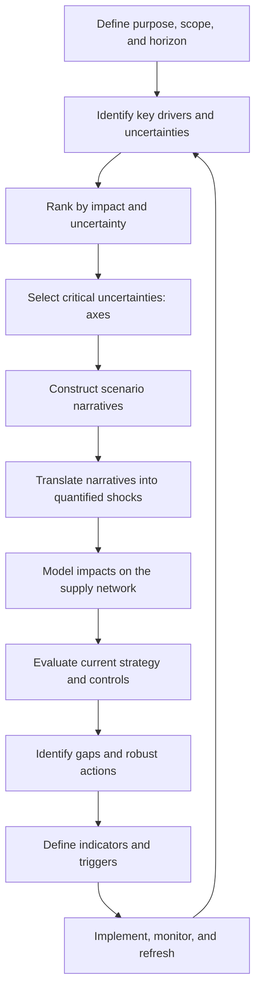
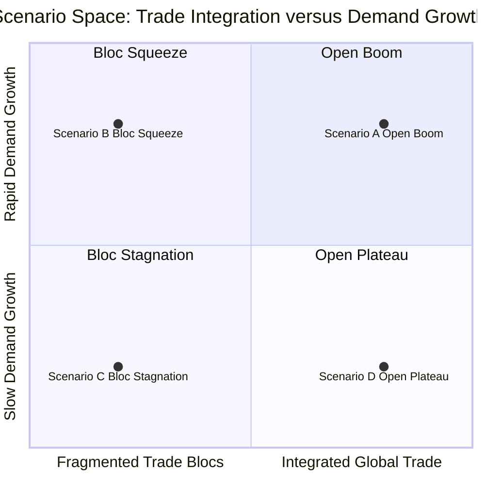
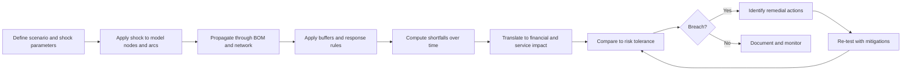
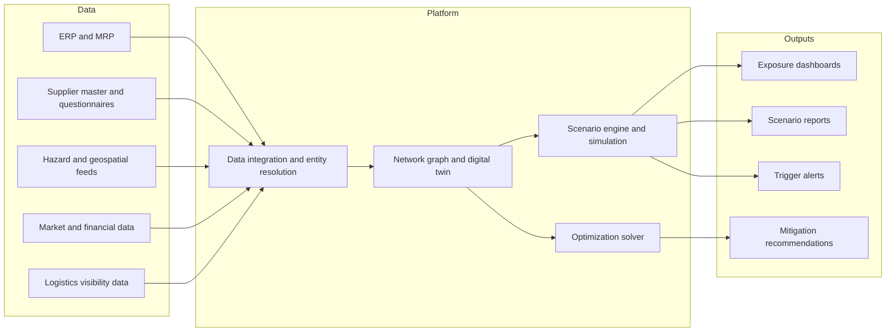
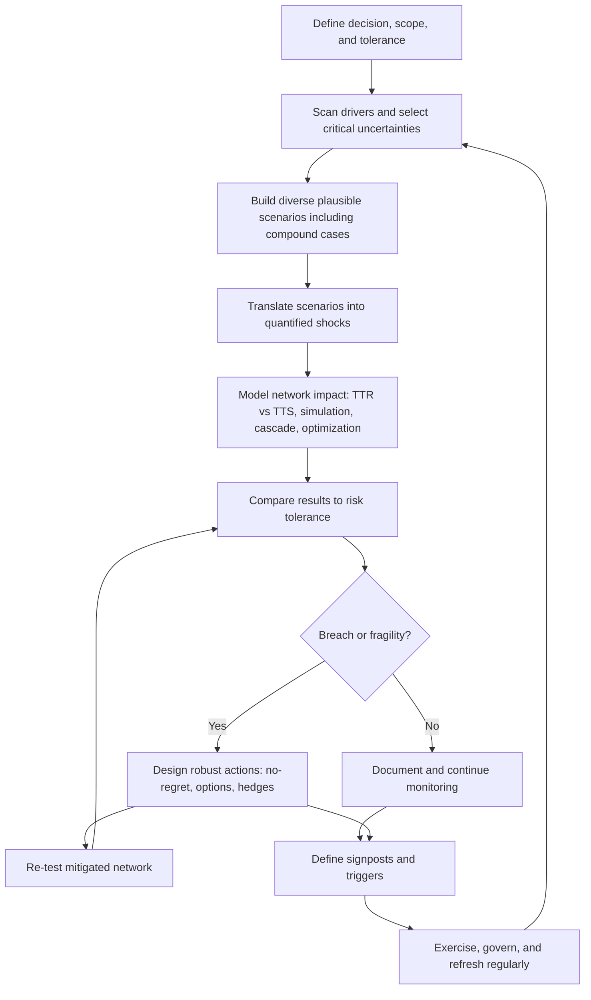

## Scenario Planning and Stress Testing


### Overview

**Scenario planning** is a structured method for exploring multiple plausible futures and evaluating how a supply chain would perform, and what the organization would do, in each. It does not attempt to predict a single outcome. Instead, it builds a set of internally consistent narratives about how key uncertainties (demand, geopolitics, climate, technology, regulation, supplier health) might unfold, then uses those narratives to test strategy, expose hidden dependencies, and prepare decisions in advance. **Stress testing** is the quantitative counterpart: a deliberate application of severe-but-plausible shocks to a model of the supply network to measure resulting loss, service degradation, recovery time, and breaking points.

In a tiered supply structure, scenario planning and stress testing serve a specific analytical function. Concentration and single-point-of-failure analysis identifies *where* the network is fragile. Supplier financial monitoring indicates *when* a node is likely to fail. Business continuity planning defines *what to do* when disruption occurs. Scenario planning and stress testing answer the remaining question: **how bad could it get, how do the pieces interact, and are the planned responses adequate under conditions we have not yet experienced?** They are the validation and calibration layer of supply chain risk management.

**Key Points**

- Scenarios are **narratives of plausible futures**, not forecasts; stress tests are **quantitative shocks applied to a model**. The two are used together.
- The goal is **decision robustness**: identifying strategies that perform acceptably across many futures, rather than optimally in one.
- Effective programs test **interactions and cascades** (correlated failures, capacity contention, demand surges, and delayed recovery), not only isolated single-node failures.
- Stress-test outputs are only as reliable as the **network model and assumptions** behind them; assumptions must be explicit, documented, and challenged.
- Results should drive **action**: changes to inventory, sourcing, design, contracts, insurance, and triggers, with owners and deadlines.
- Rare-event parameters (probabilities, durations) are inherently uncertain; robust analysis emphasizes **impact and recoverability** over precise probability.

---

### 1. Conceptual Foundations

#### 1.1 Key Terms

| Term | Definition |
| --- | --- |
| Scenario | A coherent, plausible description of a possible future state or event sequence, including its drivers and consequences |
| Scenario planning | Process of developing and using scenarios to inform strategy and preparedness |
| Stress test | Application of a severe-but-plausible shock to a model or system to measure resilience and loss |
| Sensitivity analysis | Measurement of how outputs change as one or a few inputs vary |
| Reverse stress test | Starting from an unacceptable outcome (for example, insolvency, or production halt beyond a threshold) and identifying which combination of events would cause it |
| Black swan | An extreme, low-probability, high-impact event that is hard to anticipate from past data (concept popularized by Nassim Taleb) |
| Gray rhino | A high-probability, high-impact threat that is obvious yet neglected (concept popularized by Michele Wucker) |
| Wargaming | Interactive, adversarial or dynamic simulation with human decision-makers responding to evolving events |
| Tail risk | Risk of extreme outcomes in the far end of a loss distribution |
| Cascading failure | Propagation of a failure through dependencies, causing successive failures |
| Common-cause failure | A single event causing simultaneous failure of nominally independent nodes |
| Time-to-Recover (TTR) | Time for a node to return to full function |
| Time-to-Survive (TTS) | Time the network sustains operations without the affected node |
| Risk appetite / tolerance | The level of loss or disruption the organization is prepared to accept |
| Early-warning indicator | Observable signal that a scenario is beginning to materialize |

#### 1.2 Scenario Planning vs. Forecasting vs. Stress Testing

| Approach | Question Answered | Output | Typical Horizon |
| --- | --- | --- | --- |
| Forecasting | What is most likely to happen? | Point estimate or distribution | Short to medium |
| Scenario planning | What could plausibly happen, and what would we do? | Set of narratives and strategic responses | Medium to long |
| Stress testing | How much damage does a specified severe shock cause? | Quantified loss, service impact, recovery time | Any (event-specific) |
| Sensitivity analysis | Which inputs matter most? | Ranked drivers, elasticities | Any |
| Monte Carlo simulation | What is the distribution of outcomes given uncertain inputs? | Probability distributions, percentiles | Any |
| Wargaming / exercise | How do people and processes behave under pressure? | Decisions, gaps, lessons | Event-specific |

These methods are complementary. Forecasting is optimized for the expected case; scenario and stress methods deliberately probe away from it.

#### 1.3 Why Traditional Forecasting Is Insufficient for Risk

- Historical data underrepresents rare, extreme events.
- Extrapolation assumes structural stability, which shocks often break.
- Correlations observed in normal times can change sharply under stress (diversification that works in calm conditions may fail in a crisis).
- Human judgment tends to be overconfident and anchored on recent experience [Inference: this is well documented in behavioral research, though magnitude varies by context].

Scenario planning was developed partly to counter these tendencies by legitimizing "what if" thinking about discontinuities. Its use is commonly associated with corporate planning practice at Royal Dutch Shell from the early 1970s; readers should verify specific historical attributions against primary sources.

---

### 2. The Scenario Planning Process

#### 2.1 End-to-End Workflow



#### 2.2 Step-by-Step Detail

**Step 1 - Define purpose, scope, and horizon.**

Clarify the decision the scenarios must inform (for example, "Where should we locate safety stock?" or "Should we invest in a second source for component X?"). Set the time horizon (operational: weeks to months; tactical: one to three years; strategic: five to ten years) and the boundary of the analysis (products, regions, tiers).

**Step 2 - Identify drivers and uncertainties.**

Use structured frameworks to scan the environment broadly.

| Framework | Categories Scanned |
| --- | --- |
| PESTLE | Political, Economic, Social, Technological, Legal, Environmental |
| STEEP | Social, Technological, Economic, Environmental, Political |
| Supply chain specific | Demand, supply, logistics, labor, energy, materials, regulation, cyber, financial, climate, geopolitical |

Distinguish **predetermined elements** (relatively certain trends, such as demographic shifts) from **critical uncertainties** (high impact and high unpredictability).

**Step 3 - Rank and select axes.**

Plot drivers on an impact-versus-uncertainty grid. The two or three most impactful and uncertain drivers become the axes that define the scenario space.

**Step 4 - Construct scenarios.**

For a two-axis approach, the four resulting quadrants each become a scenario. Give each a memorable name, a narrative, and defining characteristics. Scenarios should be **plausible, internally consistent, distinct from each other, and relevant to the decision**.

**Step 5 - Translate into quantified shocks.**

Convert narrative elements into model inputs: duration of disruption, percentage capacity loss, demand change, price changes, lead-time changes, tariff levels, and so on.

**Step 6 - Model impacts.**

Apply the shocks to the network model (Section 5) and measure outcomes such as lost sales, service level, cost increases, inventory depletion, and time to recover.

**Step 7 - Evaluate strategy and controls.**

Assess how existing sourcing, inventory, contracts, and continuity plans perform in each scenario. Identify where the organization is over- or under-protected.

**Step 8 - Identify robust and flexible actions.**

Classify actions (Section 7) and prioritize those that perform well across many scenarios.

**Step 9 - Define indicators and triggers.**

Specify observable signals that indicate which scenario is unfolding and thresholds that trigger pre-agreed actions.

**Step 10 - Implement, monitor, and refresh.**

Assign owners, track early-warning indicators, and revisit scenarios periodically and after significant events.

#### 2.3 Scenario Matrix Example (Two-Axis Approach)

Consider a manufacturer of electronic equipment assessing the next five years. The two critical uncertainties chosen are:

- **Axis 1:** Degree of geopolitical fragmentation (integrated global trade versus fragmented trade blocs).
- **Axis 2:** Pace of demand growth for the product category (slow versus rapid).



| Scenario | Narrative Summary | Supply Chain Implications |
| --- | --- | --- |
| A: Open Boom | Open trade with surging demand | Capacity tightness, allocation risk, lead-time inflation, price escalation |
| B: Bloc Squeeze | Fragmented blocs with high demand | Dual regional supply chains, tariffs, duplicated capacity, scarce compliant sources |
| C: Bloc Stagnation | Fragmented blocs with weak demand | Stranded capacity, margin pressure, supplier financial distress |
| D: Open Plateau | Open trade with slow demand | Price competition, consolidation, supplier viability risk, efficiency focus |

Note how each scenario stresses a **different** part of the supply chain: capacity and allocation in A, regional duplication and compliance in B, supplier failure in C, and consolidation in D. A strategy tuned to one scenario may be fragile in another.

---

### 3. Scenario Design Techniques

#### 3.1 Approaches to Building Scenarios

| Technique | Description | Strengths | Limitations |
| --- | --- | --- | --- |
| Two-axis matrix (Shell/GBN style) | Choose two critical uncertainties; build four scenarios | Simple, communicable | Can oversimplify; only two dimensions |
| Morphological analysis | Enumerate all combinations of driver states, then prune inconsistent ones | Systematic coverage | Combinatorial explosion |
| Cross-impact analysis | Assess how developments affect each other's probability | Captures interdependence | Requires subjective estimates |
| Delphi method | Iterative anonymous expert surveys converging on a view | Reduces dominance and groupthink | Time-consuming; depends on expert quality |
| Historical analog | Use past events (for example, a prior flood or trade embargo) as templates | Grounded in reality | Future may differ structurally |
| Backcasting | Start from a desired or feared future and work backward to identify paths | Focuses on pathways and triggers | Can be normative |
| Reverse stress testing | Start from an unacceptable outcome and identify causal combinations | Reveals hidden vulnerabilities | Requires a good model |
| Pre-mortem | Imagine the plan has failed and explain why | Surfaces overlooked risks | Qualitative |
| Red team / adversarial | Independent team designs attacks or worst cases | Challenges blind spots | Requires organizational openness |

#### 3.2 Characteristics of Good Scenarios

- **Plausible:** could realistically occur; each step follows from the previous.
- **Internally consistent:** elements do not contradict one another.
- **Distinct:** scenarios differ in ways that matter for decisions.
- **Decision-relevant:** tied to the choices being informed.
- **Challenging:** stretch conventional thinking without becoming implausible.
- **Traceable:** assumptions are explicit and auditable.

#### 3.3 Severity Calibration: "Severe but Plausible"

A common design principle, borrowed from financial-sector stress-testing practice, is that shocks should be **severe but plausible**: more extreme than typical experience but not so remote as to be dismissed. Practical calibration approaches:

- **Historical worst-case plus a margin:** for example, the longest observed outage in comparable events, extended by a multiplier.
- **Percentile-based:** a duration at a stated high percentile (for example, 95th or 99th) of an assumed distribution.
- **Expert elicitation:** structured judgment on plausible worst cases.
- **Capacity-based:** shocks defined by what would exhaust buffers or breach tolerances (reverse approach).

Calibration choices are judgmental; documenting the rationale and testing several severity levels is good practice [Inference: severity thresholds have no universally accepted standard in supply chain contexts].

---

### 4. Scenario Categories for Supply Chains

#### 4.1 Scenario Library

| Category | Example Scenarios | Typical Shock Parameters |
| --- | --- | --- |
| Supplier / node failure | Fire, explosion, insolvency, quality shutdown at a sole source | Capacity loss 100% for T weeks; ramp-back profile |
| Regional natural hazard | Earthquake, flood, typhoon, wildfire, extreme heat, drought | Multi-node simultaneous loss; utility and transport outages |
| Logistics / chokepoint | Canal blockage, port strike, carrier bankruptcy, air-freight capacity crunch | Transit delay of X days; freight cost multiplier |
| Geopolitical / trade | Sanctions, export controls, tariff escalation, conflict, border closures | Loss of access to a country's supply; cost uplifts |
| Pandemic / labor | Workforce absence, lockdowns, strikes | Capacity reduction of Y% across region for T weeks |
| Cyber / IT | Ransomware, EDI provider outage, cloud region failure | Loss of planning, ordering, or visibility systems for T days |
| Demand shock | Sudden surge or collapse in demand | Demand multiplier over time; bullwhip amplification |
| Input price / commodity | Energy, metals, semiconductor price spikes | Cost inflation of Z% on selected inputs |
| Financial | Credit crunch, supplier liquidity crisis, currency shock | Multiple supplier failures; higher financing costs |
| Regulatory / ESG | Carbon border adjustments, forced-labor import bans, chemical restrictions | Loss of non-compliant sources; compliance cost |
| Technology disruption | Sudden obsolescence, standards change, new-entrant substitution | Product redesign; stranded inventory |
| Compound / cascading | Combination such as regional disaster plus port closure plus demand surge | Multiple simultaneous shocks with interactions |

#### 4.2 Compound and Cascading Scenarios

Real crises often combine shocks. Examples of interaction patterns to test:

- **Common-cause overlap:** a regional event disables several "independent" suppliers.
- **Capacity contention:** during a widespread disruption, competitors simultaneously activate the same alternate sources, carriers, or spare inventory, so a backup that works alone fails in aggregate.
- **Bullwhip amplification:** panic ordering and hoarding distort demand signals upstream, worsening shortages.
- **Financial contagion:** a demand collapse strains supplier liquidity, causing failures that then constrain supply when demand rebounds.
- **Recovery mismatch:** downstream demand rebounds faster than upstream capacity can be restored.
- **Information failure:** the disruption also degrades visibility systems, delaying detection and response.

Testing only single-event scenarios can materially understate exposure to these interactions.

---

### 5. Stress Testing Methodology

#### 5.1 Building the Network Model

A stress test requires a representation of the supply chain that can propagate shocks. The level of fidelity depends on the decision and available data.

| Model Fidelity | Description | Typical Use |
| --- | --- | --- |
| Spreadsheet / bill-of-materials model | Static mapping of parts to suppliers with inventory cover and lead times | Rapid exposure screening |
| Network graph model | Nodes and edges with capacities and flows | Structural vulnerability, cascade analysis |
| Discrete-event simulation | Time-stepped dynamics of inventory, production, and transport | Detailed operational response |
| System dynamics | Feedback loops (for example, bullwhip) at aggregate level | Strategic behavior |
| Agent-based simulation | Autonomous agents (firms) with decision rules interacting | Emergent and cascading behavior |
| Optimization model (LP/MIP) | Determines best response (allocation, sourcing) under constraints | Recovery planning, network design |
| Digital twin | Continuously updated virtual replica linked to live data | Ongoing simulation and what-if analysis |

A minimum viable model includes: parts and BOM structure, supplier and site attributes, inventory positions, lead times, capacity, alternate-source data, and revenue or margin per product.

#### 5.2 Core Stress-Test Workflow



#### 5.3 Time-Phased Impact Calculation

A widely used analytical approach is the time-to-survive versus time-to-recover method applied at the part or product level. For each disrupted node $i$:

$$\text{Exposure Gap}_i = \max\left(0,\ \text{TTR}_i - \text{TTS}_i\right)$$


$$\text{Loss}_i = \text{Exposure Gap}_i \times \text{Daily Margin at Risk}_i$$

For multiple nodes disrupted simultaneously, overlapping impacts on the same product should not be double counted. The product-level exposure is generally governed by the **binding constraint**, the input with the largest gap:

$$\text{Product Gap}_p = \max_{i \in \text{BOM}(p)} \text{Exposure Gap}_i$$


$$\text{Product Loss}_p = \text{Product Gap}_p \times \text{Daily Margin}_p$$

**Example**

A product line generating $300,000 daily margin depends on three inputs affected by a regional flood scenario:

| Input | TTR (days) | TTS (days) | Exposure Gap (days) |
| --- | --- | --- | --- |
| Component A | 45 | 20 | 25 |
| Component B | 30 | 35 | 0 |
| Component C | 60 | 25 | 35 |

$$\text{Product Gap} = \max(25, 0, 35) = 35 \text{ days}$$


$$\text{Product Loss} = 35 \times 300{,}000 = \$10{,}500{,}000$$

**Output**

Component C is the binding constraint. Improving Component A would not reduce the product's loss unless Component C's gap is also addressed. Improving C to a 25-day gap (for example, through added buffer or an alternate) would make A the binding constraint at 25 days, yielding a loss of $25 \times 300{,}000 = \$7{,}500{,}000$, a $3.0M reduction. This shows why stress tests should identify **binding constraints** rather than summing independent losses.

#### 5.4 Partial Recovery and Ramp Profiles

Real recovery is rarely a step function. Model it as a ramp:

$$\text{Available Supply}(t) = \text{Capacity} \times r(t), \qquad 0 \le r(t) \le 1$$

where $r(t)$ is the recovery fraction at time $t$. The cumulative unmet demand over a horizon $H$ is:

$$\text{Unmet Demand} = \int_{0}^{H} \max\left(0,\ d(t) - S(t)\right) dt$$

where $d(t)$ is demand and $S(t)$ is available supply including buffers and alternates. In discrete time, this is a sum over daily or weekly periods.

#### 5.5 Reverse Stress Testing

Reverse stress testing inverts the question: **what would it take to break us?**

1. **Define the failure condition:** for example, "production of flagship product halts for more than 4 weeks" or "quarterly EBITDA falls below covenant threshold."
2. **Search the scenario space** for shock combinations that produce the failure (manual analysis, optimization, or simulation with search).
3. **Assess plausibility** of those combinations.
4. **Design mitigations** for plausible combinations and re-test.

Reverse tests are especially useful for uncovering non-obvious combinations, such as a supplier failure coinciding with a port delay and an inventory-system outage.

**Example (Python: brute-force search for breaking combinations)**

```python
import itertools

# Baseline network assumptions (illustrative)
buffer_days = {"chip": 30, "adhesive": 14, "housing": 21, "freight": 10}
recovery_days = {
    "chip":     {"none": 0, "minor": 20, "major": 70},
    "adhesive": {"none": 0, "minor": 10, "major": 40},
    "housing":  {"none": 0, "minor": 14, "major": 35},
    "freight":  {"none": 0, "minor": 7,  "major": 30},
}
daily_margin = 400_000
loss_limit = 20_000_000   # unacceptable loss threshold

def product_loss(severity_map):
    """Binding constraint: product halts when any input is exhausted.
    Freight delay adds to the effective TTR of physical inputs."""
    freight_delay = recovery_days["freight"][severity_map["freight"]]
    gaps = []
    for node in ("chip", "adhesive", "housing"):
        ttr = recovery_days[node][severity_map[node]]
        # Freight delay only matters if the node itself is disrupted or ships late
        effective_ttr = ttr + (freight_delay if ttr > 0 else 0)
        gaps.append(max(0, effective_ttr - buffer_days[node]))
    return max(gaps) * daily_margin

levels = ["none", "minor", "major"]
breaking = []
for combo in itertools.product(levels, repeat=4):
    sev = dict(zip(("chip", "adhesive", "housing", "freight"), combo))
    loss = product_loss(sev)
    if loss > loss_limit:
        breaking.append((sev, loss))

print(f"Breaking combinations: {len(breaking)} of {3**4}")
for sev, loss in sorted(breaking, key=lambda x: -x[1])[:5]:
    print(sev, f"-> ${loss:,.0f}")
```

**Output**

The script enumerates all 81 severity combinations and reports those exceeding the $20M loss limit, sorted by loss. In this illustrative model, only combinations involving a major chip disruption (70-day recovery against 30 days of buffer) approach or exceed the limit, and adding a freight delay to a major chip event worsens it. This reveals that **chip buffer** is the dominant vulnerability, and that adding freight disruption compounds it. The model is deliberately simplified (single binding constraint, additive freight delay) and its results depend entirely on the assumed parameters. Behavior will vary with real network structure.

#### 5.6 Sensitivity Analysis

Sensitivity analysis identifies which assumptions most influence results.

- **One-at-a-time (OAT):** vary a single input (for example, recovery time) across a range while holding others fixed; plot output response. Simple but ignores interactions.
- **Tornado diagram:** rank inputs by the swing in output when each is varied between low and high values.
- **Global sensitivity analysis (for example, Sobol indices, Morris method):** vary all inputs jointly to attribute output variance and capture interactions; more computationally intensive.
- **Break-even analysis:** find the parameter value at which a decision changes (for example, the recovery time above which a second source becomes cost-justified).

**Example (break-even)**

A second source costs $600,000 per year to maintain and eliminates a supply gap. Daily margin at risk is $400,000, and the annual probability of the disruption is 3%. The break-even expected outage length $D^{*}$ (days of avoided loss given an event) satisfies:

$$0.03 \times D^{*} \times 400{,}000 = 600{,}000$$


$$D^{*} = \frac{600{,}000}{0.03 \times 400{,}000} = 50 \text{ days}$$

**Output**

The second source pays back in expected-value terms only if the avoided outage exceeds roughly 50 days per event. If plausible outages are shorter, other mitigations (buffer stock) may be more economical; if tail outages are longer or reputational effects are large, the investment may still be justified on tail-risk grounds. The 3% probability is an assumption and highly uncertain.

---

### 6. Quantitative Simulation Approaches

#### 6.1 Monte Carlo Simulation

Monte Carlo methods sample uncertain inputs (event occurrence, duration, demand, recovery speed) many times to produce a **distribution of outcomes**.

Common outputs:

- Expected loss and standard deviation.
- **Value-at-Risk (VaR):** the loss not exceeded with a stated confidence (for example, 95% or 99%) over a horizon.
- **Conditional Value-at-Risk (CVaR) / Expected Shortfall:** the average loss in the tail beyond the VaR threshold.
- Probability of breaching a service or financial threshold.

$$\text{VaR}_{\alpha} = \inf\{ x : P(L \le x) \ge \alpha \}$$


$$\text{CVaR}_{\alpha} = E\left[ L \mid L \ge \text{VaR}_{\alpha} \right]$$

CVaR captures the severity of tail outcomes, which VaR alone ignores.

**Example (Python: multi-node Monte Carlo with correlated regional shock)**

```python
import numpy as np

rng = np.random.default_rng(2024)
N = 200_000

daily_margin = 350_000
nodes = {
    # name: (annual_event_prob, median_ttr_days, sigma, buffer_days, region)
    "supplier_A": (0.03, 50, 0.5, 25, "East"),
    "supplier_B": (0.03, 40, 0.5, 30, "East"),
    "supplier_C": (0.02, 60, 0.6, 20, "West"),
}
p_regional_event_east = 0.02   # common-cause event knocking out both East suppliers
regional_ttr_median, regional_sigma = 45, 0.5

def lognorm(median, sigma, size):
    return rng.lognormal(mean=np.log(median), sigma=sigma, size=size)

gaps = np.zeros((N, len(nodes)))
names = list(nodes)

# Independent node events
for j, name in enumerate(names):
    p, med, sig, buf, region = nodes[name]
    occurs = rng.random(N) < p
    ttr = np.where(occurs, lognorm(med, sig, N), 0.0)
    gaps[:, j] = np.maximum(0, ttr - buf)

# Common-cause regional event affecting all East nodes simultaneously
regional = rng.random(N) < p_regional_event_east
regional_ttr = np.where(regional, lognorm(regional_ttr_median, regional_sigma, N), 0.0)
for j, name in enumerate(names):
    if nodes[name][4] == "East":
        buf = nodes[name][3]
        gaps[:, j] = np.maximum(gaps[:, j], np.maximum(0, regional_ttr - buf))

# Product requires all three inputs: binding constraint = max gap
product_gap = gaps.max(axis=1)
loss = product_gap * daily_margin

var95 = np.percentile(loss, 95)
var99 = np.percentile(loss, 99)
cvar99 = loss[loss >= var99].mean()

print(f"Expected annual loss:      ${loss.mean():,.0f}")
print(f"P(any loss > 0):           {(loss > 0).mean():.3%}")
print(f"VaR 95%:                   ${var95:,.0f}")
print(f"VaR 99%:                   ${var99:,.0f}")
print(f"CVaR 99%:                  ${cvar99:,.0f}")
```

**Output**

The script reports expected loss, the probability of any loss, and tail metrics (VaR and CVaR). Because the two East suppliers share a common-cause event, joint failures appear more often than independent modeling would imply, fattening the tail. Removing the common-cause term and comparing outputs is a useful demonstration of how ignoring correlation understates tail risk. Numerical values depend on the seed, distributions, and structural assumptions and are illustrative only.

#### 6.2 Discrete-Event Simulation (DES)

DES models the network as entities (orders, shipments, parts) flowing through processes (production, transport, inventory) with events occurring at specific times. Advantages:

- Captures queueing, lead-time variability, and inventory policy dynamics.
- Allows testing of operational response rules (reorder policies, allocation, expediting).
- Produces time series of inventory, service level, and backlog.

Common tools include general-purpose simulation environments and Python libraries (for example, SimPy). Tool selection depends on scale and team skills.

**Example (Python: minimal SimPy-style inventory disruption sketch)**

```python
import simpy
import numpy as np

def run(disruption_start=10, disruption_len=30, buffer_units=600,
        daily_demand=20, supply_rate=20, horizon=90, seed=1):
    rng = np.random.default_rng(seed)
    env = simpy.Environment()
    inventory = simpy.Container(env, capacity=10_000, init=buffer_units)
    stats = {"unmet": 0, "log": []}

    def supplier(env):
        while True:
            yield env.timeout(1)
            disrupted = disruption_start <= env.now < disruption_start + disruption_len
            if not disrupted:
                yield inventory.put(supply_rate)

    def demand(env):
        while True:
            yield env.timeout(1)
            need = max(0, int(rng.normal(daily_demand, 3)))
            available = inventory.level
            take = min(need, available)
            if take > 0:
                yield inventory.get(take)
            stats["unmet"] += need - take
            stats["log"].append((env.now, inventory.level))

    env.process(supplier(env))
    env.process(demand(env))
    env.run(until=horizon)
    return stats["unmet"], min(level for _, level in stats["log"])

for buf in (200, 400, 600, 800):
    unmet, low = run(buffer_units=buf)
    print(f"Buffer {buf:4d} units -> unmet demand {unmet:5d}, minimum inventory {low:4d}")
```

**Output**

For each buffer size, the script reports total unmet demand and the lowest inventory level during a 30-day supply outage. Larger buffers reduce or eliminate unmet demand, with diminishing returns once the buffer exceeds outage demand (roughly $30 \times 20 = 600$ units in this setup). Exact figures vary with the random demand draws; the sketch omits reorder policy, lead times, and backlog logic.

#### 6.3 Network-Cascade Simulation

Graph-based cascade models propagate failures through dependencies:

1. Represent facilities as nodes with capacity and buffer attributes; edges represent material flows.
2. Remove or degrade initial nodes according to the scenario.
3. A downstream node **fails** when its inputs fall below its threshold after buffers deplete.
4. Iterate until no further failures occur; record the failure set and timing.

**Example (Python: NetworkX cascade)**

```python
import networkx as nx

G = nx.DiGraph()
# edge: supplier -> customer; each node has a buffer (days) and required inputs
G.add_edges_from([
    ("RawMine", "SmelterX"), ("RawMine", "SmelterY"),
    ("SmelterX", "PartsA"), ("SmelterY", "PartsB"),
    ("PartsA", "OEM"), ("PartsB", "OEM"),
])
buffer = {"RawMine": 0, "SmelterX": 15, "SmelterY": 10,
          "PartsA": 20, "PartsB": 12, "OEM": 25}
ttr = {"RawMine": 40}          # initial shock: RawMine offline for 40 days

def cascade(G, buffer, ttr):
    """Return the day each node starves, given upstream outage durations.
    A node starves when the accumulated buffers upstream are exhausted
    before its suppliers recover."""
    starve_day = {}
    for node in nx.topological_sort(G):
        preds = list(G.predecessors(node))
        if not preds:
            outage = ttr.get(node, 0)
            starve_day[node] = 0 if outage > 0 else None
            continue
        # A node needs ALL predecessors (conservative: AND logic).
        pred_starve = [starve_day[p] for p in preds]
        if any(d is not None for d in pred_starve):
            first = min(d for d in pred_starve if d is not None)
            starve_day[node] = first + buffer[node]
            # If the source recovers before starvation, no failure
            if starve_day[node] >= ttr.get("RawMine", 0):
                starve_day[node] = None
        else:
            starve_day[node] = None
    return starve_day

print(cascade(G, buffer, ttr))
```

**Output**

The function returns the day each node exhausts its buffer following a 40-day raw-material outage (or `None` if the source recovers first). In this setup, `SmelterY` (10-day buffer) and `PartsB` (cumulative 22-day upstream buffer) starve before the 40-day recovery, whereas the `OEM`, with its larger buffer and the AND logic, is reached only if all upstream paths have failed. The simplified logic (fixed buffers, AND dependency, single recovery time) is a teaching sketch; real cascades require flow and capacity modeling, and results vary with structure.

#### 6.4 Optimization-Based Stress Testing

Mixed-integer or linear programs compute the **best possible response** to a scenario, revealing the resilience ceiling of the network (for example, the maximum demand that can still be served by rerouting and reallocating).

A simplified formulation for post-disruption allocation:

$$\max \sum_{p} m_p \cdot x_p \quad \text{subject to} \quad \sum_{p} a_{ip} x_p \le c_i^{\text{post}} \ \ \forall i, \quad 0 \le x_p \le d_p$$

where $x_p$ is production of product $p$, $m_p$ is unit margin, $a_{ip}$ is consumption of resource/input $i$ per unit of $p$, $c_i^{\text{post}}$ is post-shock available capacity of input $i$, and $d_p$ is demand. Solving this under each scenario shows the margin preserved by optimal reallocation and which inputs constrain it (shadow prices indicate the value of an extra unit of each scarce resource).

The shadow price of a binding input constraint identifies **where an additional unit of buffer or alternate capacity would deliver the most value**, directly informing mitigation investment.

---

### 7. From Scenarios to Strategy

#### 7.1 Classifying Actions by Robustness

| Action Class | Definition | Example |
| --- | --- | --- |
| No-regret moves | Beneficial in essentially all scenarios | Improve sub-tier visibility; improve data quality; define triggers |
| Low-regret moves | Modest cost, valuable in many scenarios | Qualify a warm alternate; increase modest buffers on critical parts |
| Options / real options | Pay a small premium to preserve future flexibility | Capacity reservation, retainers, framework agreements, design flexibility |
| Hedges | Reduce exposure to a specific scenario | Financial hedges, insurance, geographic diversification |
| Big bets | Large commitments justified only in specific scenarios | Relocating a plant; vertical integration |
| Wait-and-monitor | Defer until indicators signal | Pre-approved plans triggered by signposts |

Strategy under uncertainty favors **no-regret and option-like actions** first, reserving big bets for cases where indicators strongly point to a scenario.

#### 7.2 Regret and Robustness Analysis

Evaluate each candidate strategy against all scenarios to build a payoff matrix.

| Strategy | Scenario A (Open Boom) | Scenario B (Bloc Squeeze) | Scenario C (Bloc Stagnation) | Scenario D (Open Plateau) |
| --- | --- | --- | --- | --- |
| S1: Lean single-source | +8 | -12 | -6 | +5 |
| S2: Dual-source, moderate buffer | +5 | +2 | 0 | +3 |
| S3: Regionalized footprint | +2 | +6 | -3 | -1 |
| S4: Heavy buffer, single-source | +3 | -2 | -8 | -2 |

(Payoffs in illustrative units of net value, for demonstration.)

**Maximin (worst-case) criterion:** choose the strategy with the best worst-case payoff. Worst cases: S1 = -12, S2 = 0, S3 = -3, S4 = -8. **S2** is best under maximin.

**Minimax regret criterion:** regret is the shortfall versus the best strategy in each scenario.

| Strategy | Regret A | Regret B | Regret C | Regret D | Max Regret |
| --- | --- | --- | --- | --- | --- |
| S1 | 0 | 18 | 6 | 0 | 18 |
| S2 | 3 | 4 | 0 | 2 | 4 |
| S3 | 6 | 0 | 3 | 6 | 6 |
| S4 | 5 | 8 | 8 | 7 | 8 |

**Output**

S2 has the smallest maximum regret (4) and the best worst case (0), making it the most robust across scenarios, even though it is not the best in any single scenario except Scenario C where it ties as best. S1 wins in Scenario A but suffers severely in B. The example illustrates how robustness criteria can favor a balanced strategy over an optimized one. Payoff numbers are illustrative; real payoffs require modeling, and criteria like maximin can be overly conservative when tail scenarios are very unlikely.

#### 7.3 Signposts, Indicators, and Triggers

Each scenario should have **leading indicators** that signal its emergence.

| Scenario | Example Signposts | Trigger Action |
| --- | --- | --- |
| Open Boom | Order backlog growth; lead-time extensions; allocation notices from suppliers | Lock capacity reservations; build strategic stock |
| Bloc Squeeze | New tariffs or export-control announcements; supplier compliance changes | Accelerate regional sourcing; qualify compliant suppliers |
| Bloc Stagnation | Supplier covenant breaches; rising days-beyond-terms; demand softening | Tighten financial monitoring; secure tooling; consolidate volume selectively |
| Open Plateau | Price competition; supplier consolidation announcements | Renegotiate terms; assess dependency on merged suppliers |

Indicators should be **measurable, timely, and tied to pre-approved responses** so that action does not wait on debate. Link them to the monitoring capabilities described under supplier financial monitoring and continuity planning.

---

### 8. Stress-Testing Design Patterns

#### 8.1 Tiered Testing Program

| Level | Purpose | Frequency | Example |
| --- | --- | --- | --- |
| Routine screening | Rapid exposure check on all critical parts | Quarterly | BOM-level TTR vs. TTS report |
| Deep-dive scenario tests | Detailed analysis of top scenarios | Semiannual / annual | Regional disaster with cascade simulation |
| Enterprise-wide integrated test | Cross-functional test including finance, demand, and logistics | Annual | Compound scenario linking supply, demand, and liquidity |
| Reverse stress test | Search for breaking combinations | Annual | Identify combinations exceeding loss tolerance |
| Event-triggered test | Rapid re-assessment after a real event or signal | As needed | After a supplier acquisition or geopolitical escalation |
| Exercise / wargame | Human decision-making under scenario | Annual | Cross-functional tabletop |

#### 8.2 Integrating Financial and Operational Views

A complete stress test carries operational shortfalls through to financial statements:

- **Income statement:** lost revenue, expedite costs, penalties, and cost inflation.
- **Cash flow:** working-capital effects of buffer builds, delayed receipts, and supplier prepayments.
- **Balance sheet and covenants:** whether liquidity or covenant thresholds are breached.

This integration reveals whether an operationally survivable scenario is still financially destabilizing.

#### 8.3 Demand-Side and Bullwhip Stress

Test demand shocks explicitly:

$$\text{Bullwhip Ratio} = \frac{\text{Var}(\text{Orders placed})}{\text{Var}(\text{Demand observed})}$$

A ratio above 1 indicates order variance amplification upstream. During a shortage, precautionary ordering can raise the ratio sharply and worsen upstream constraints. Stress tests should include demand surges, hoarding behavior, and cancellations, along with the supply shock.

---

### 9. Data, Assumptions, and Model Governance

#### 9.1 Input Data Requirements

| Data Element | Source | Common Issues |
| --- | --- | --- |
| BOM and product structure | PLM/ERP | Incomplete sub-tier detail |
| Supplier sites and locations | Supplier master data, questionnaires | Multiple site or entity naming variants |
| Inventory and in-transit | ERP, WMS, carriers | Timing lag, accuracy |
| Lead times and capacity | Supplier data, ERP history | Nominal versus actual variance |
| Alternate-source status | Sourcing and quality records | "Qualified" status may be outdated or paper-only |
| Recovery-time estimates | Supplier input, engineering, historical analogs | Optimism bias; rarely validated |
| Financial impact parameters | Finance | Margin allocation and fixed-cost treatment |
| Hazard and geographic data | Third-party risk data, public hazard maps | Resolution and update frequency vary |

#### 9.2 Assumption Management

- Maintain an **assumption register** listing each assumption, source, owner, confidence level, and validity date.
- Classify assumptions as **structural** (network logic), **parametric** (numbers), or **behavioral** (how people respond).
- Explicitly test the **most influential and least certain** assumptions via sensitivity analysis.
- Record **known limitations** and exclusions so results are not over-interpreted.

#### 9.3 Model Risk

Models introduce their own risk: errors, oversimplification, and false precision. Governance practices include independent model review, version control, back-testing against actual events where possible, documentation, and clear communication of uncertainty. Back-testing is limited by the rarity of severe disruptions [Inference: most organizations have too few comparable events for statistically meaningful validation].

#### 9.4 Cognitive Biases to Manage

| Bias | Effect on Scenario Work | Countermeasure |
| --- | --- | --- |
| Anchoring | Scenarios cluster near recent experience | Use outside views and historical extremes |
| Optimism / planning fallacy | Recovery times underestimated | Apply reference-class adjustments; challenge estimates |
| Availability bias | Overweight vivid recent events | Use structured scanning frameworks |
| Groupthink | Narrow scenario set | Delphi, red teams, diverse participants |
| Normalization of deviance | Accepting growing risk because nothing has gone wrong | Independent review; trigger-based reassessment |
| Confirmation bias | Selecting evidence that supports current strategy | Pre-mortems, adversarial review |
| Overconfidence in probabilities | False precision on rare events | Emphasize impact and recoverability; use ranges |

---

### 10. Organizational Integration and Governance

#### 10.1 Roles

| Role | Responsibility |
| --- | --- |
| Executive sponsor | Sets risk appetite; ensures results drive decisions and funding |
| Risk / resilience lead | Owns the program, methodology, and scenario library |
| Supply chain planning and procurement | Provide network data; own mitigation actions |
| Finance | Provides financial parameters; integrates results into liquidity and covenant analysis |
| Operations / engineering | Validate recovery estimates and feasibility of alternates |
| IT / data | Data pipelines, model tooling |
| Legal / compliance | Contractual and regulatory implications |
| Suppliers and partners (selected) | Provide data; participate in joint scenarios |

#### 10.2 Cadence and Integration

- Embed scenario outputs into **annual planning, budgeting, and sourcing strategy**.
- Link to **S&OP/IBP** so that scenarios inform inventory and capacity decisions.
- Feed results into the **enterprise risk register** and the **business continuity program** to update plans and exercises.
- Report to senior leadership with **decision-oriented summaries**: exposure, tolerance breaches, recommended actions, cost, and residual risk.

#### 10.3 Communicating Results

Effective reports emphasize:

- The **question** the analysis addresses.
- **Scenarios in plain language** with key assumptions.
- **Impact ranges** (not single numbers) with uncertainty stated.
- **Where tolerance is breached** and by how much.
- **Recommended actions** ranked by robustness and cost-effectiveness.
- **Indicators to monitor** and triggers.
- **Limitations** of the analysis.

---

### 11. Regulatory and Sectoral Context

Some sectors and regulators expect formal scenario analysis and stress testing:

- **Financial services:** supervisors commonly require stress testing and operational resilience testing of critical services and third-party dependencies.
- **Climate-related disclosure:** frameworks such as the Task Force on Climate-related Financial Disclosures (TCFD) and successor standards encourage climate scenario analysis (for example, physical and transition risk pathways); requirements and adoption vary by jurisdiction and change over time.
- **Critical infrastructure and healthcare:** some jurisdictions impose resilience or continuity testing obligations, including for medical-supply and essential-goods chains.
- **Trade and supply chain due diligence laws:** may require risk analysis of upstream suppliers, which can be enriched with scenario analysis.

Specific obligations vary by jurisdiction and sector and evolve; current regulatory texts and legal counsel should be consulted.

#### 11.1 Climate Scenario Considerations

Climate scenario analysis for supply chains typically distinguishes:

- **Physical risk (acute and chronic):** floods, storms, heat stress, water scarcity, sea-level rise, affecting sites, transport, and labor.
- **Transition risk:** carbon pricing, border carbon adjustments, changing customer preferences, technology shifts, and regulation.

Common practice is to use standardized climate pathways (for example, those published by the IPCC, IEA, or NGFS) as external reference scenarios and overlay company-specific supply chain exposure. Pathway assumptions and regional downscaling involve considerable uncertainty [Inference: local hazard projections are less certain than global aggregates].

---

### 12. Digital Enablement and Emerging Practice

#### 12.1 Technology Stack



#### 12.2 Supply Chain Digital Twins

A digital twin maintains a continuously updated virtual model of the network, enabling rapid what-if analysis when events occur. Effectiveness depends on data freshness, model fidelity, and integration with planning systems. Capabilities differ widely across vendors and implementations [Unverified: claims of real-time full-network twins should be assessed against actual data coverage and latency].

#### 12.3 AI and Advanced Analytics

Machine learning and language models are increasingly used to:

- Extract supplier relationships and site locations from unstructured documents and news.
- Detect early-warning signals in event feeds.
- Suggest scenario variations or generate scenario narratives for human review.
- Surrogate-model complex simulations for faster exploration.

These tools can accelerate analysis but introduce risks such as inaccurate extraction, hallucinated relationships, opaque model behavior, and data-privacy concerns. Outputs used for high-stakes decisions should be validated by qualified staff.

---

### 13. Worked End-to-End Example

**Context.** A medical-device manufacturer sells a critical diagnostic instrument. Key inputs: a custom sensor (sole-sourced from one supplier in a flood-prone region), a specialty polymer housing (two suppliers sharing one monomer source), and ocean freight through one major port. Annual instrument margin is $180M (approximately $500,000 per day). The leadership's tolerance: no more than $25M loss in a severe scenario and no stock-out of the instrument beyond 4 weeks.

**Step 1: Define scenarios**

| ID | Scenario | Shocks |
| --- | --- | --- |
| S1 | Regional flood | Sensor supplier offline 14 weeks; port closed 2 weeks |
| S2 | Monomer plant fire | Both polymer suppliers lose material for 12 weeks |
| S3 | Trade escalation | 25% tariff and export delay of 6 weeks on a key component |
| S4 | Compound | Flood (S1) plus 40% demand surge driven by an emergency-procurement event |
| S5 | Reverse test target | Find combinations exceeding $25M loss |

**Step 2: Current buffers (TTS)**

| Input | Buffer (weeks) |
| --- | --- |
| Sensor | 6 |
| Polymer housing | 5 |
| Freight in pipeline | 2 |

**Step 3: Baseline stress results**

Scenario S1 (flood):

- Sensor exposure gap: $14 - 6 = 8$ weeks (56 days).
- Port closure delays other inbound by 2 weeks, but the pipeline buffer (2 weeks) absorbs it.
- Product gap: 56 days.

$$\text{Loss}_{S1} = 56 \times 500{,}000 = \$28{,}000{,}000$$

Scenario S2 (fire):

- Polymer gap: $12 - 5 = 7$ weeks (49 days).

$$\text{Loss}_{S2} = 49 \times 500{,}000 = \$24{,}500{,}000$$

Scenario S4 (compound): the demand surge raises unmet demand during the 56-day gap and shortens effective buffers by consuming inventory faster. With demand at 1.4 times normal, the sensor buffer of 6 weeks of normal demand covers only $6/1.4 \approx 4.3$ weeks. Effective gap: $14 - 4.3 = 9.7$ weeks (approximately 68 days).

$$\text{Loss}_{S4} \approx 68 \times 500{,}000 \times 1.4 = \$47{,}600{,}000$$

(The 1.4 factor reflects margin on incremental demand that would also go unfilled; this is a simplification assuming incremental demand carries the same margin.)

**Output summary**

| Scenario | Modeled Loss | Tolerance ($25M) | Stock-Out Duration | Tolerance (4 weeks) |
| --- | --- | --- | --- | --- |
| S1 | $28.0M | Breach | 8 weeks | Breach |
| S2 | $24.5M | Within (marginal) | 7 weeks | Breach |
| S3 | Moderate (cost-driven) | Within | Not applicable | Within |
| S4 | $47.6M | Breach | about 9.7 weeks | Breach |

The sensor is the dominant vulnerability; the compound scenario shows how a demand surge magnifies the exposure by consuming buffer faster. Figures are illustrative and depend on assumed margins and recovery times.

**Step 4: Candidate mitigations**

| Mitigation | Effect | Annualized Cost (illustrative) |
| --- | --- | --- |
| M1: Raise sensor buffer from 6 to 12 weeks | Sensor gap in S1 falls from 8 to 2 weeks | $1.2M carrying cost |
| M2: Qualify a second sensor source in a different region (pre-qualified, 30% allocation, ramp in 8 weeks) | Reduces gap in S1 and S4 | $0.9M |
| M3: Secure monomer from a second source and add 4 weeks buffer | Polymer gap in S2 falls from 7 to about 0 to 2 weeks | $0.7M |
| M4: Capacity reservation and allocation priority with sensor supplier | Faster restart; priority after recovery | $0.3M |

**Step 5: Re-test with M1 + M2 + M3**

- S1: buffer 12 weeks; alternate supplies 30% after 8 weeks. Uncovered period is $14 - 12 = 2$ weeks at most for the primary, and the alternate begins to cover part before the buffer is exhausted, so the modeled gap is effectively about 0 to 2 weeks. Loss falls to roughly $0 to $7M.
- S2: polymer gap approximately 0 to 2 weeks. Loss falls to roughly $0 to $7M.
- S4: with 1.4 times demand, the 12-week buffer covers about 8.6 weeks; the 14-week outage leaves about 5.4 weeks uncovered, partly offset by the alternate's 30% allocation starting at week 8. Loss remains material but falls sharply from $47.6M, on the order of $15M to $25M under the illustrative assumptions.

**Step 6: Robustness and cost-benefit**

- Combined annualized cost: $1.2 + 0.9 + 0.7 = \$2.8\text{M}$ (before M4).
- Tail-loss reduction in the severe scenarios: tens of millions of dollars.
- Because event probabilities are highly uncertain, leadership evaluates the package primarily against the stated **tolerance** (loss cap and stock-out limit) rather than expected value alone.
- The residual breach risk in the compound scenario S4 is documented and addressed through triggers (for example, pre-approved air-freight and spot-market purchasing authority) and insurance review.

**Step 7: Signposts and triggers**

- Hydrological forecasts and flood warnings near the sensor region: Watch/Alert levels trigger expedited shipments and buffer top-ups.
- Supplier notification of production interruption: triggers Activate level and alternate allocation.
- Sharp order-book acceleration or emergency-procurement announcements: triggers protective allocation policy.

**Step 8: Exercise and refresh**

Run a tabletop for S4 with injects (flood warning, port closure, demand surge, alternate supplier reports partial capacity). Update assumptions and re-run stress tests semiannually and after any supplier, site, or design change.

**Conclusion of example.** The stress tests convert vague concern into quantified breaches of stated tolerances, identify the binding constraint (the sensor), show how compound scenarios magnify exposure, and support a prioritized, cost-justified package with clear triggers. Real outcomes depend on the accuracy of recovery estimates, execution quality, and external conditions.

---

### 14. Common Pitfalls

**Key Points**

- **Treating scenarios as predictions:** choosing the "most likely" scenario and ignoring the rest defeats the purpose.
- **Too few or too similar scenarios:** narrow sets fail to stretch thinking; scenarios that differ only in degree are not decision-useful.
- **Testing only single events:** missing compound, correlated, and cascading effects.
- **Ignoring capacity contention:** assuming backup suppliers, carriers, or spare capacity are exclusively available to you during widespread events.
- **Overprecision:** presenting single-number losses or probabilities without ranges or caveats.
- **Uncalibrated severity:** shocks either trivial (not informative) or absurd (dismissed).
- **Stale or unvalidated data:** old BOMs, outdated alternate-source status, optimistic recovery times.
- **One-off exercise:** running a study once and shelving the results rather than maintaining a living program.
- **No decision linkage:** producing reports without owners, budgets, or triggers.
- **Ignoring financial transmission:** overlooking liquidity and covenant consequences of operationally survivable events.
- **Modeling beyond what data supports:** complex simulations built on thin data can create false confidence.
- **Ignoring human and organizational response:** assuming ideal execution; exercises reveal delays, misunderstandings, and authority gaps.
- **Neglecting demand-side dynamics:** bullwhip effects, hoarding, and post-shock rebound.
- **Political resistance:** scenarios that challenge entrenched strategies may be dismissed without sponsorship from senior leadership.
- **Underestimating recovery duration:** especially for specialized equipment, regulatory re-approval, and requalification.

---

### 15. Summary Framework



**Conclusion**

Scenario planning and stress testing turn uncertainty into structured preparation. Scenario planning broadens what the organization is willing to consider, while stress testing quantifies how the supply network behaves under severe-but-plausible shocks, revealing binding constraints, cascading and common-cause effects, and gaps between current protections and stated risk tolerance. The most valuable outputs are not point predictions but **robust decisions**: actions that perform acceptably across many futures, supported by explicit assumptions, clear signposts, and pre-authorized triggers. Effectiveness depends on model quality, data currency, honest treatment of uncertainty, integration with planning and continuity programs, and sustained executive sponsorship. All quantitative results are conditional on their assumptions, rare-event parameters are inherently uncertain, and real disruptions frequently differ from any modeled scenario.

**Related Topics**

- Single Point of Failure and Concentration Risk Analysis
- Supplier Financial Health and Viability Monitoring
- Business Continuity and Contingency Planning
- Supply Chain Resilience Metrics and KPIs
- Digital Twins and Simulation for Supply Chain Networks
- Monte Carlo and Discrete-Event Simulation for Supply Chains
- Climate Risk and Physical Hazard Assessment for Supply Networks
- Geopolitical and Trade-Policy Risk Analysis
- Bullwhip Effect and Demand Volatility Management
- Risk Transfer, Insurance, and Parametric Coverage
- Supply Network Design under Uncertainty (Stochastic and Robust Optimization)
- Early-Warning Systems and Supply Chain Control Towers