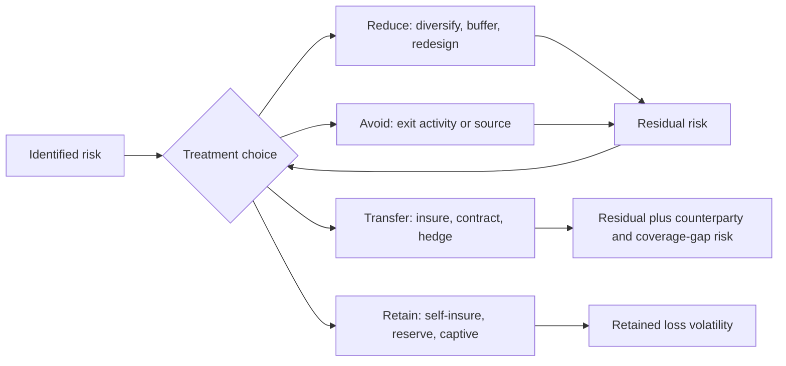
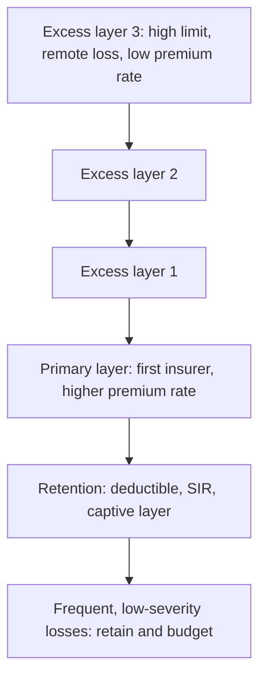
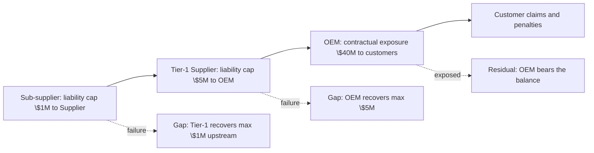
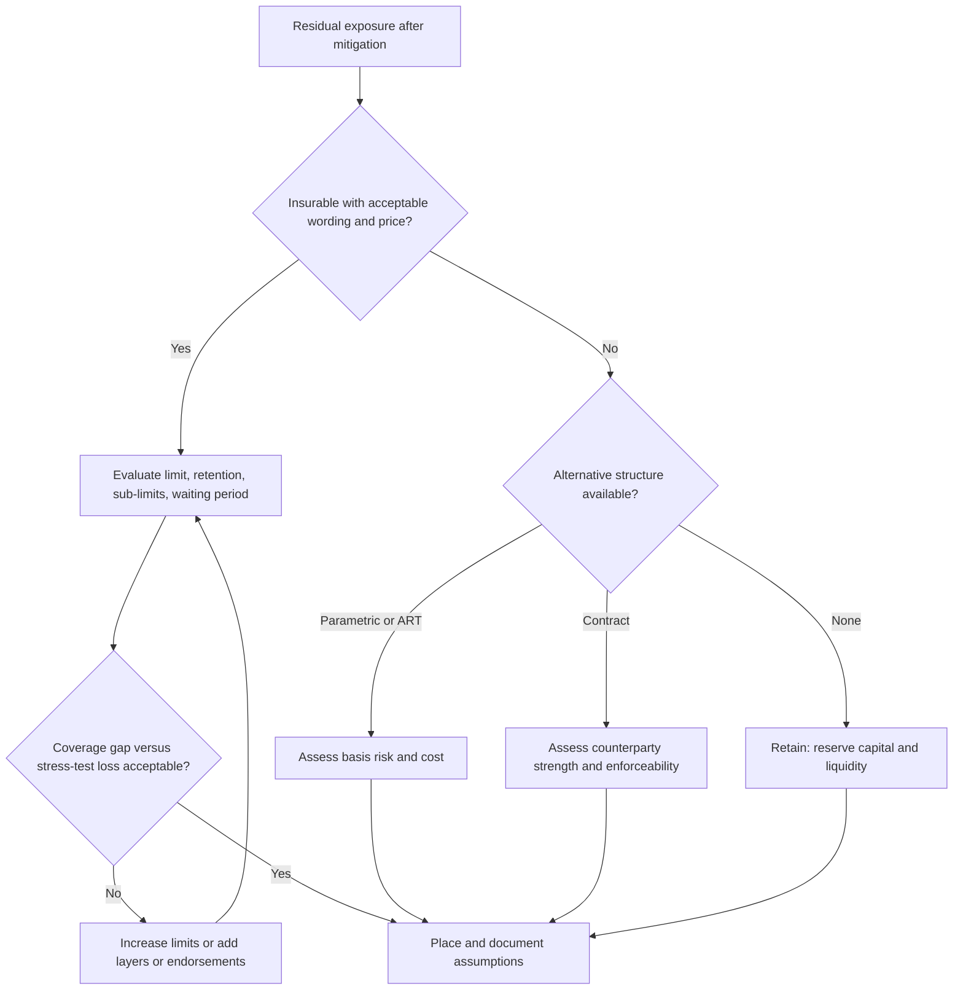
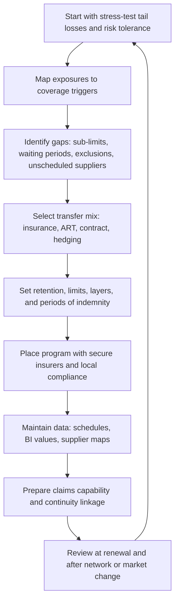

## Insurance and Risk Transfer Mechanisms


### Overview

**Risk transfer** is the deliberate shifting of the financial consequences of a defined risk from one party to another, typically through an insurance contract, a contractual allocation of liability, or a financial instrument. It is one of several risk treatment options alongside avoidance, reduction (mitigation), and retention (acceptance). In supply chain risk management, risk transfer addresses the **residual financial exposure** that remains after diversification, buffering, and continuity planning have done what is economically feasible. It compensates for loss; it does not restore supply, protect customer relationships, or recover lost market share.

**Insurance** is the most formalized transfer mechanism: an insurer accepts a premium in exchange for a promise to indemnify (or pay a pre-agreed sum) if a covered event occurs. **Alternative risk transfer (ART)** encompasses captives, parametric structures, catastrophe bonds, finite-risk arrangements, and other techniques that supplement or replace traditional insurance. **Contractual risk transfer** (indemnities, limitation-of-liability clauses, force majeure allocation, warranties, and guarantees) shifts risk among supply chain partners without an insurer, though it often relies on the counterparty's ability to pay.

In a tiered supply structure, transfer mechanisms are complicated by **visibility and dependency**: the events that hurt most frequently originate at Tier-2 or Tier-3 suppliers with whom the focal firm has no contract, and standard property policies respond only to damage at the insured's own locations. This is why **Contingent Business Interruption (CBI)** and **dependent property** coverage are central to supply chain insurance, and why their limits, triggers, and exclusions deserve close scrutiny.

**Key Points**

- Risk transfer is a **residual-risk tool**: it follows, and does not replace, diversification, buffering, and continuity planning.
- Insurance pays money; it does **not** restore capacity, retain customers, or shorten time-to-recover. Continuity capability and financial protection are complements.
- Standard property coverage typically requires **physical damage** at an **insured location** as the trigger. Many supply chain losses (cyber outages, regulatory shutdowns, port closures, pandemics, supplier insolvency) fall outside that trigger unless specifically endorsed or separately insured.
- **Sub-limits, waiting periods, exclusions, and named-supplier requirements** frequently determine whether a policy pays. Policy wording, not the product name, governs.
- Parametric and captive structures offer speed and flexibility but introduce **basis risk** and **retained credit/capital exposure**.
- Contractual risk transfer is only as good as the **enforceability of the clause and the financial strength of the indemnitor**.

---

### 1. Conceptual Foundations

#### 1.1 Key Terms

| Term | Definition |
| --- | --- |
| Risk transfer | Shifting financial consequences of a risk to another party by contract or instrument |
| Risk financing | Arranging funds to pay for losses (retention, transfer, or a mix) |
| Premium | Price paid to the insurer for coverage |
| Deductible / retention (SIR) | Loss amount borne by the insured before insurance responds |
| Limit | Maximum amount the insurer will pay (per occurrence and/or aggregate) |
| Sub-limit | Lower cap for a specific peril, location, or coverage part within the overall limit |
| Indemnity | Compensation designed to restore the insured to its pre-loss financial position, not to profit |
| Waiting period (time deductible) | Elapsed time after a loss before business interruption coverage begins |
| Period of indemnity | Maximum duration for which lost income is covered |
| Extended period of indemnity (EPI) | Additional coverage period for post-restoration lost income while sales recover |
| Business Interruption (BI) | Coverage for lost income and continuing expenses due to insured physical damage at the insured's own site |
| Contingent Business Interruption (CBI) / Dependent Property | BI coverage triggered by damage at a supplier's or customer's site |
| Extra expense | Costs to reduce or avoid interruption (expedited freight, temporary facilities) |
| Named-peril vs. all-risk | Coverage limited to listed perils vs. covering all perils not excluded |
| Trigger | Condition that must occur for coverage to respond (for example, physical damage, index breach) |
| Basis risk | Mismatch between the insurance payout and the insured's actual loss |
| Moral hazard | Reduced incentive to prevent loss because of insurance |
| Adverse selection | Tendency of higher-risk parties to seek more coverage |
| Subrogation | Insurer's right to pursue a responsible third party after paying a claim |
| Captive | An insurance company owned by its insured (or group) to underwrite its own risks |
| Parametric insurance | Coverage paying a pre-agreed amount when a measurable index or event threshold is met |
| Insurance-linked security (ILS) | Capital-market instrument transferring insurance risk (for example, catastrophe bonds) |
| Risk retention | Deliberately bearing loss internally |
| Force majeure | Contract clause excusing performance for defined extraordinary events |

#### 1.2 Risk Treatment Spectrum



Transfer is rarely complete. It exchanges one exposure for others: **premium cost, coverage gaps, counterparty credit risk (the insurer or indemnitor may not pay), and claims friction**.

#### 1.3 Where Transfer Fits in the Chapter's Logic

| Preceding Topic | Role | Interaction with Risk Transfer |
| --- | --- | --- |
| Single Point of Failure and Concentration Risk Analysis | Identifies critical exposures | Ranks which dependencies merit CBI/dependent-property cover and named-supplier scheduling |
| Supplier Financial Health and Viability Monitoring | Signals supplier distress | Informs trade credit insurance, supplier default cover, and cost of coverage |
| Business Continuity and Contingency Planning | Reduces time-to-recover and raises time-to-survive | Determines the period of indemnity and waiting period you actually need |
| Scenario Planning and Stress Testing | Quantifies tail losses | Sets limits, retentions, and identifies uninsured scenarios |

#### 1.4 Insurable vs. Uninsurable Risk

Classic criteria for insurability include: losses that are **definite and measurable**, **fortuitous** (accidental, not intended), **large enough to matter but not catastrophic to the insurer's whole portfolio**, and **sufficiently independent** across policyholders for pooling to work. Supply chain risks that are systemic, correlated, or poorly measurable (widespread pandemic, war, sanctions, cyber events with systemic reach) are often **excluded, sub-limited, or priced very high** [Inference: insurer appetite for systemic and correlated perils has historically tightened after large loss events, though it varies by market cycle and jurisdiction].

---

### 2. Core Property and Business Interruption Coverage

#### 2.1 Property Damage and Business Interruption (PD/BI)

A conventional commercial property policy covers physical loss to insured property (buildings, machinery, stock) and, through a BI section, the resulting loss of earnings and continuing costs. BI coverage generally requires that the interruption result from **direct physical loss or damage caused by an insured peril at an insured location**.

**BI loss measure** (conceptual):

$$\text{BI Loss} = \text{Lost Net Profit} + \text{Continuing Normal Operating Expenses (including payroll where covered)} + \text{Extra Expense}$$

More precisely, the insured amount is commonly framed as **gross earnings** or **gross profit**:

$$\text{Gross Profit} \approx \text{Revenue} - \text{Variable Costs (costs that cease during interruption)}$$

Policy definitions of "gross earnings," "gross profit," and "business income" differ by form and jurisdiction, so the specific policy definition governs the calculation.

**Key coverage variables**

| Variable | Effect |
| --- | --- |
| Waiting period | Reduces recoverable loss; longer waiting period lowers premium |
| Period of indemnity | Caps duration of coverage; must exceed realistic restoration time |
| Extended period of indemnity | Covers the sales-recovery "tail" after physical restoration |
| Sum insured / limit | Must reflect realistic annual exposure and peak-season concentration |
| Peril scope | All-risk vs. named perils; natural-catastrophe sub-limits (flood, earthquake, windstorm) |

#### 2.2 Contingent Business Interruption (CBI) / Dependent Property

CBI compensates the insured for lost earnings when **physical damage at a supplier's, customer's, or other dependent location** interrupts the insured's business.

**Structural features that matter**

| Feature | Description | Common Pitfall |
| --- | --- | --- |
| Named vs. unnamed dependents | Some policies cover only scheduled (named) suppliers; others provide broader "any direct supplier" cover, often with lower sub-limits | Unscheduled or unknown Tier-2/3 suppliers may be excluded or capped |
| Direct vs. indirect suppliers | Many forms cover only direct (Tier-1) suppliers; "extended" wordings reach Tier-2 and beyond | Hidden sub-tier SPOFs are frequently uninsured |
| Supplier type | Direct suppliers, direct customers ("recipient"), and service providers (utilities, logistics) may be treated separately | Utilities/service interruption often needs separate endorsement |
| Trigger | Typically physical damage from an insured peril at the dependent location | Non-damage triggers (regulatory closure, insolvency, cyber outage) usually excluded unless endorsed |
| Sub-limits | Often much lower than the main BI limit | Large exposures can exceed the sub-limit substantially |
| Waiting period | Often longer for dependent locations | Erodes recovery for short/medium disruptions |
| Geographic scope | Some policies restrict territories | Overseas supplier events may be excluded |

**Example: CBI adequacy check**

A manufacturer's daily gross profit at risk from a sole-source supplier failure is $400,000. The stress test indicates a realistic 90-day supply gap after buffers. The policy provides a $25,000,000 CBI sub-limit, a 21-day waiting period, and a 180-day period of indemnity.

$$\text{Gross Loss over Gap} = 90 \times 400{,}000 = \$36{,}000{,}000$$


$$\text{Loss after Waiting Period} = (90 - 21) \times 400{,}000 = 69 \times 400{,}000 = \$27{,}600{,}000$$


$$\text{Recoverable} = \min(27{,}600{,}000,\ 25{,}000{,}000) = \$25{,}000{,}000$$


$$\text{Uninsured (retained) Loss} = 36{,}000{,}000 - 25{,}000{,}000 = \$11{,}000{,}000$$

**Output**

Although the modeled loss is $36.0M, the insured recovery is capped at $25.0M by the sub-limit, and $8.4M of the excess is lost to the waiting period alone ($21 \times 400{,}000$). The uninsured portion is $11.0M. This shows why waiting periods and sub-limits must be evaluated against **stress-test outputs**, not against headline policy limits. The illustration assumes the loss is fully covered as gross profit and ignores co-insurance, salvage, mitigation credits, and other policy conditions.

#### 2.3 Utility Service Interruption and Off-Premises Power

Endorsements can cover BI resulting from loss of **power, water, gas, or telecommunications** supplied to the insured. Coverage often requires physical damage at the utility's facilities and may be sub-limited, with defined "distance" or provider restrictions. Confirm whether **upstream transmission** or only **local supply** is included.

#### 2.4 Transit, Marine Cargo, and Stock Throughput

| Coverage | Scope | Notes |
| --- | --- | --- |
| Marine cargo insurance | Goods in international/domestic transit against loss or damage | Coverage clauses (for example, the Institute Cargo Clauses A/B/C) define perils; ICC (A) is broadest all-risk form |
| Stock throughput | Combines transit, storage, and processing in one policy | Reduces coverage gaps between stages |
| Cargo delay / loss of market | Compensation for delay-related loss | Frequently excluded from standard cargo forms unless endorsed |
| General average / salvage | Shared maritime losses | Cargo owners contribute to general average; cover addresses this |
| Warehouse legal liability / bailee coverage | Third-party goods in the insured's custody | Distinct from own-goods coverage |
| Freight forwarder / carrier liability | Statutory and contractual liability limits | Carrier liability is often capped by convention (for example, per-kilogram limits) and may not cover full cargo value |

Carrier liability limits under international transport conventions are frequently far below the goods' actual value, which is why cargo owners buy their own cargo insurance rather than rely on carrier liability [Inference: exact limits vary by convention, mode, and jurisdiction; verify current instruments].

---

### 3. Specialized Supply Chain Coverages

#### 3.1 Coverage Landscape

| Coverage | Risk Addressed | Typical Trigger | Common Limitations |
| --- | --- | --- | --- |
| Contingent BI (CBI) / dependent property | Supplier or customer site damage | Physical damage at dependent location | Named-supplier schedules; sub-limits; sub-tier gaps |
| Non-damage BI / "denial of access" | Interruption without physical damage (for example, government order, blocked access) | Specified non-damage event | Narrow forms; often heavily sub-limited or excluded |
| Trade credit insurance | Customer non-payment (insolvency or protracted default) | Buyer insolvency or default beyond the waiting period | Covers receivables, not supply continuity; buyer limits set by insurer |
| Supplier default / non-performance insurance | Supplier failure to deliver | Defined supplier insolvency or failure | Limited market; underwriting-intensive; narrow wording |
| Political risk insurance | Expropriation, currency inconvertibility, political violence, contract frustration | Government or political action | Country and asset specific; long tenor products exist |
| Cyber insurance (first-party and third-party) | Cyberattack, data breach, system failure | Cyber event; sometimes system failure | Systemic-event and war exclusions; sub-limits; dependent-system (vendor) coverage varies |
| Product recall / contamination | Recall costs, business loss from contamination | Recall event | Definitions of trigger; exclusions for known defects |
| Product liability | Third-party injury or damage from products | Liability claim | Distinct from first-party loss |
| Environmental / pollution liability | Contamination liability and cleanup | Pollution event | Often excluded from general forms |
| Marine cargo / stock throughput | Goods in transit and storage | Physical loss or damage | Delay often excluded |
| Parametric (natural catastrophe, weather, transit) | Index-triggered loss | Measured index breach | Basis risk |
| Terrorism / political violence | Terror and related acts | Defined acts | Government backstops in some jurisdictions; forms vary |
| Pandemic / communicable disease cover | Business loss from disease events | Specific disease trigger | Widely excluded after 2020; specialty products limited [Inference: market availability for pandemic cover has been limited since 2020] |
| Directors and officers (D&O), errors and omissions (E&O) | Management and professional liability | Claims against directors or professionals | Not a supply continuity product but relevant to governance failure |
| Credit insurance for suppliers / prepayments | Advance-payment loss to failed supplier | Supplier default on prepaid goods | Niche; documentation-heavy |

#### 3.2 Trade Credit Insurance in the Supply Context

Although trade credit insurance primarily protects **sellers against buyer non-payment**, supply chain participants use it in two ways:

1. **As a seller** (the focal firm or a supplier) to protect receivables and support financing.
2. **Indirectly**, as the supplier's insurer response can affect **supplier liquidity**: if a credit insurer reduces or cancels coverage on the focal firm (or on a supplier's customers), suppliers may tighten terms, which propagates financial stress.

Key mechanics:

- **Credit limits** are set by the insurer per buyer and can be reduced or withdrawn on short notice.
- **Policy structure:** whole-turnover, key-account, or single-buyer; with a **coinsurance** share (commonly the insured retains a percentage, often in the range of 5% to 15% [Inference: typical range; varies by market and policy]).
- **Indemnification** is often triggered after a **waiting period** following insolvency or protracted default.

$$\text{Insured Recovery} = \text{Insured Percentage} \times \min(\text{Unpaid Invoices},\ \text{Approved Credit Limit})$$

**Example**

A supplier has $2.0M unpaid invoices to an insolvent buyer, an approved credit limit of $1.5M, and 90% insured percentage.

$$\text{Insured Recovery} = 0.90 \times \min(2.0, 1.5) = 0.90 \times 1.5 = \$1.35\text{M}$$

**Output**

Recovery is $1.35M; the supplier bears $0.65M (the $0.5M above the credit limit plus the 10% coinsurance on the insured portion). Terms are illustrative; actual policy conditions (for example, notification requirements, excess) may reduce the payment.

#### 3.3 Cyber and Digital Supply Chain Coverage

Cyber events are a major driver of supply chain disruption. Coverage structure:

| Cover Type | Protects Against |
| --- | --- |
| First-party: incident response and forensics | Costs to investigate and contain |
| First-party: business interruption | Lost income from network or system outage |
| First-party: data restoration | Cost to recover data and systems |
| First-party: extortion | Ransom and negotiation costs (subject to legal restrictions) |
| Third-party: liability | Claims from customers or partners after a breach |
| Dependent business interruption (dependent system failure) | Outage at an IT provider, cloud vendor, or supplier's system |
| Regulatory defense and fines | Where insurable by law |

Points requiring careful reading:

- **War and state-backed attack exclusions:** wording has been tightened in many markets; scope varies and disputes have occurred [Unverified: the interpretation of state-attribution exclusions has been contested and depends on specific wording and jurisdiction].
- **Systemic/widespread event exclusions or sub-limits** for events affecting many insureds simultaneously.
- **Dependent BI limits** for third-party IT providers, often below the primary limit and sometimes restricted to named providers.
- **Security-control conditions:** insurers commonly require baseline controls (for example, multi-factor authentication, backups) and may deny or reduce claims if representations were inaccurate.
- **Legal restrictions** on ransom payment vary by jurisdiction and sanctions regime.

---

### 4. Insurance Program Design

#### 4.1 Program Architecture

Large organizations build **layered programs** in which each layer responds after the layer beneath is exhausted.



| Layer | Loss Character | Typical Treatment |
| --- | --- | --- |
| Working layer / retention | Frequent, predictable, low-severity | Retain; budget; manage through operations |
| Primary and lower excess | Moderate severity | Insure; premium reflects expected loss |
| Upper excess / catastrophe | Rare, high severity | Insure for balance-sheet protection; lower rate-on-line |
| Uninsured / uninsurable | Systemic, excluded, or beyond market capacity | Mitigation, contractual transfer, capital reserves |

**Rate on line (ROL):**

$$\text{ROL} = \frac{\text{Premium}}{\text{Limit}}$$

Lower ROL layers (higher up the tower) cost proportionally less per unit of limit because the probability of reaching them is lower.

#### 4.5 Retention Optimization

The optimal retention balances premium savings against volatility of retained losses and the organization's capacity to absorb them.

$$\text{Total Cost of Risk (TCOR)} = \text{Retained Losses} + \text{Premiums} + \text{Risk Control Costs} + \text{Administrative Costs} + \text{Cost of Capital Held for Risk}$$

Raising retention typically reduces premium but increases expected retained loss and volatility. Retention should be set relative to **earnings volatility tolerance, liquidity, and covenants**, not merely premium savings.

**Example (Python: simple retention comparison)**

```python
import numpy as np

rng = np.random.default_rng(11)
N = 200_000

# Illustrative annual loss model: frequency ~ Poisson, severity ~ lognormal
freq = rng.poisson(lam=1.2, size=N)
def annual_loss():
    losses = np.zeros(N)
    for i in range(N):
        if freq[i] > 0:
            sev = rng.lognormal(mean=np.log(400_000), sigma=1.3, size=freq[i])
            losses[i] = sev.sum()
    return losses

L = annual_loss()

def evaluate(retention, limit, premium):
    # Per-occurrence retention is approximated at annual-aggregate level for simplicity
    insurer_pays = np.clip(L - retention, 0, limit)
    retained = L - insurer_pays
    return {
        "retention": retention,
        "premium": premium,
        "mean_retained": retained.mean(),
        "p95_retained": np.percentile(retained, 95),
        "p99_retained": np.percentile(retained, 99),
        "tcor_mean": retained.mean() + premium,
    }

options = [
    evaluate(250_000, 20_000_000, 950_000),
    evaluate(1_000_000, 20_000_000, 650_000),
    evaluate(2_500_000, 20_000_000, 420_000),
]
for o in options:
    print(f"Retention ${o['retention']:>9,.0f} | Premium ${o['premium']:>9,.0f} | "
          f"Mean retained ${o['mean_retained']:>10,.0f} | "
          f"P95 ${o['p95_retained']:>11,.0f} | P99 ${o['p99_retained']:>11,.0f} | "
          f"TCOR ${o['tcor_mean']:>10,.0f}")
```

**Output**

The script prints, for each retention option, mean retained loss, 95th and 99th percentile retained loss, and expected total cost of risk (mean retained plus premium). Typically, higher retentions lower premium but raise the mean and tail of retained loss; the lowest expected TCOR is not necessarily the option the organization can tolerate if the P99 retained loss threatens liquidity or covenants. Premiums in the script are assumed placeholders, the loss model is simplified (annual-aggregate retention rather than per-occurrence), and results vary with the random seed and parameters.

#### 4.3 Program Design Decisions

| Decision | Considerations |
| --- | --- |
| Limit selection | Base on stress-test tail losses, maximum foreseeable loss (MFL), and risk appetite, not on last year's program |
| Retention level | Financial capacity, earnings volatility, covenants |
| Period of indemnity | Realistic restoration time including specialized equipment lead time and requalification |
| Waiting period | Balance cost savings vs. uncovered days; compare to time-to-survive |
| Named-supplier scheduling | Include critical Tier-1 and identified sub-tier SPOFs; maintain the schedule as the supply base changes |
| Currency, territory, and jurisdiction | Alignment with locations of assets and suppliers; local admitted-insurance requirements |
| Policy structure | Single global master with local policies (controlled master program) vs. purely local placements |
| Insurer security | Financial strength ratings; concentration across insurers; claims-paying reputation |
| Broker and claims support | Expertise in claims presentation and BI quantification |

#### 4.4 Global Programs and Local Compliance

Many jurisdictions require insurance covering local risks to be issued by a locally licensed (admitted) insurer, a principle often referred to as **non-admitted insurance restrictions**. Multinationals typically use a **master policy** with **local policies** and difference-in-conditions/difference-in-limits (DIC/DIL) coverage to align coverage globally. Tax, premium allocation, and claim-payment rules vary by country and evolve; local advice is essential.

---

### 5. Coverage Gaps and Insurability Limits

#### 5.1 Common Gaps in Supply Chain Coverage

| Gap | Why It Arises | Mitigation Approach |
| --- | --- | --- |
| No physical damage trigger | Losses from regulatory shutdowns, port closures, cyber events, supplier insolvency, or strikes | Endorsements for non-damage BI; specialty covers; contractual protections |
| Unnamed or unknown sub-tier suppliers | CBI often limited to scheduled/direct suppliers | Sub-tier mapping; extended wording; schedule critical suppliers |
| Sub-limits far below exposure | Insurer capacity control | Negotiate higher sub-limits for critical dependencies; layered or supplemental placements |
| Long waiting periods | Cost control | Align with time-to-survive; buy down where economically justified |
| Period of indemnity too short | Underestimating recovery time | Extended period of indemnity |
| Pandemic, war, nuclear, government action exclusions | Systemic uninsurability | Scenario planning; retention; alternative capital (for example, parametric or ILS where available) |
| Cyber "war" and systemic exclusions | Accumulation concerns | Read wording carefully; consider standalone cyber with clear terms |
| Loss of market / customer attrition | Insurance covers defined BI, not lasting brand or market-share damage | Continuity planning; customer communication; contractual protections |
| Reputational harm | Rarely fully insurable | Crisis management; some specialty covers exist for defined events |
| Price/inflation and demand-surge | Cost of rebuilding or expedited procurement may exceed insured values | Valuation reviews; inflation guard; adequate sums insured |
| Contractual penalties and liquidated damages | Often excluded as consequential loss | Negotiate limits with customers; separate coverage where available |
| Delay-related loss in cargo | Standard cargo forms exclude loss of market | Delay endorsement or separate covers |
| Under-insurance and co-insurance penalties | Sum insured below true value | Regular valuation; declared-value reviews |

#### 5.2 Insurance Mapped to Stress-Test Scenarios

| Scenario | Typical Insurance Response | Likely Gaps |
| --- | --- | --- |
| Fire at sole-source supplier | CBI/dependent property responds if named or covered | Sub-limit, waiting period, sub-tier unnamed suppliers |
| Regional flood or earthquake | Property/BI with nat-cat sub-limit; CBI if supplier damaged | Nat-cat sub-limits and aggregates; correlated claims among insureds |
| Port closure by strike | Usually no cover (no physical damage) | Full gap; consider non-damage BI or contractual remedies |
| Canal blockage | Cargo general average; delay generally excluded | Business loss from delay |
| Supplier insolvency | Typically not covered by property policies | Requires supplier-default/credit covers or contractual protection |
| Ransomware at a logistics provider | Dependent cyber BI if covered | Sub-limits, named-provider restrictions, war/systemic exclusions |
| Sanctions or export-control action | Political risk cover may respond in narrow cases | Often excluded; compliance and re-sourcing are the response |
| Pandemic-driven lockdown | Widely excluded | Retain; scenario planning; liquidity buffers |
| Product contamination recall | Recall/contamination policy | Definition of trigger; known-defect exclusions |

---

### 6. Alternative Risk Transfer (ART)

ART instruments complement traditional insurance, especially where standard capacity is limited or expensive.

#### 6.1 Captive Insurance

A **captive** is a licensed insurance company owned by the parent (single-parent captive) or by several unrelated firms (group or association captive, or "rent-a-captive" cells).

| Aspect | Description |
| --- | --- |
| Purpose | Retain and finance predictable risks; access reinsurance markets directly; smooth earnings; customize coverage |
| Typical risks | Property deductibles, BI, product liability, cargo, cyber layers, employee benefits (jurisdiction-dependent) |
| Benefits | Premium stability, direct reinsurance access, potential retention of underwriting profit, coverage flexibility |
| Costs and risks | Capitalization requirements, regulatory compliance, administration, retained volatility, claims discipline |
| Governance | Independent management, actuarial support, and regulatory reporting |
| Tax and accounting | Treatment varies by jurisdiction and structure (for example, whether premiums to a captive are deductible; whether arrangements qualify as insurance); requires specialist advice |

A captive changes **who holds the risk** within the corporate group; without reinsurance or adequate capital, it does not reduce the group's economic exposure. Regulators and tax authorities scrutinize whether sufficient risk distribution and risk shifting exist.

#### 6.2 Parametric Insurance

Parametric (index-based) insurance pays a **pre-agreed amount** when an objectively measured index reaches a threshold, regardless of the insured's actual loss.

**Example triggers:** earthquake magnitude within a defined radius, wind speed at a station, rainfall or river gauge level, hurricane category passing a defined box, temperature extremes, or transit-time indices.

$$\text{Payout} = \sum_{j} \text{Tier Payment}_j \times \mathbb{1}\left[\text{Index} \ge \text{Trigger}_j\right]$$

A stepped structure pays different amounts at different index levels, or a linear structure pays proportionally between an attachment and exhaustion point:

$$\text{Payout} = \text{Limit} \times \min\left(1, \max\left(0, \frac{\text{Index} - \text{Attachment}}{\text{Exhaustion} - \text{Attachment}}\right)\right)$$

**Advantages**

- **Speed:** payment often within days or weeks since no loss adjustment is required.
- **Transparency:** clear, objective trigger.
- **Coverage of non-damage effects:** can be designed around events that cause indirect disruption (for example, river level closing a waterway).
- **Flexibility:** payout is not restricted to defined property-damage use; funds can finance expediting or alternate sourcing.

**Limitations**

- **Basis risk:** payout may not match actual loss; the event may hurt without triggering, or trigger without hurting.
- **Design complexity:** trigger selection, calibration, and data-source reliability.
- **Regulatory and accounting treatment** varies by jurisdiction (whether it qualifies as insurance or a derivative).

**Example (parametric sizing and basis risk)**

A manufacturer relies on a barge route on a river. Low water levels have historically halted shipments. A parametric policy pays on a gauge reading below 1.5 meters.

| Gauge Reading (m) | Payout (linear between 1.8 attachment and 1.2 exhaustion) with $10M limit |
| --- | --- |
| 2.0 | $0 |
| 1.8 | $0 |
| 1.5 | $5.0M |
| 1.2 | $10.0M |

$$\text{Payout at 1.5 m} = 10{,}000{,}000 \times \frac{1.8 - 1.5}{1.8 - 1.2} = 10{,}000{,}000 \times 0.5 = \$5{,}000{,}000$$

**Output**

At 1.5 m the policy pays $5.0M. If actual loss from rerouting is $3.0M, the insured is over-compensated (positive basis); if actual loss is $9.0M, the insured is under-compensated (negative basis). Insurers and insureds calibrate triggers using historical data, but rare-event calibration is uncertain.

#### 6.3 Catastrophe Bonds and Insurance-Linked Securities

**Catastrophe (cat) bonds** transfer defined catastrophe risk to capital-market investors. The sponsor pays a coupon; if a qualifying event occurs, principal is reduced or lost and used to pay the sponsor's losses. Trigger types include indemnity, industry loss index, modeled loss, and parametric. Cat bonds typically suit large, sophisticated sponsors with concentrated catastrophe exposure; issuance involves structuring costs and modeling requirements. Availability and pricing depend on market conditions.

#### 6.4 Finite Risk, Multi-Line and Multi-Year Structures

| Structure | Description | Consideration |
| --- | --- | --- |
| Finite risk | Limited risk transfer combined with a funding element; smooths timing of losses | Accounting and regulatory scrutiny over whether sufficient risk transfer exists |
| Multi-year, multi-line ("integrated risk") | Combines several risk classes under a single aggregate limit | Can reduce cost through diversification; complexity in structuring |
| Aggregate stop-loss | Insurer covers when annual retained losses exceed a threshold | Protects earnings volatility |
| Committed capital / contingent credit lines | Pre-arranged liquidity after a loss event | Financing, not indemnity; counterparty risk of lender |
| Contingent surplus notes or capital facilities | Access to capital upon defined events | Cost and covenant considerations |

#### 6.5 Comparison of Financing Mechanisms

| Mechanism | Speed of Funds | Basis Risk | Coverage Breadth | Cost Predictability | Best Suited For |
| --- | --- | --- | --- | --- | --- |
| Traditional insurance | Slow to moderate (claims adjustment) | Low (indemnity) | Moderate (limited by wording) | Moderate | Insurable physical losses |
| Captive | Depends on structure | Low | Customizable | High within limits | Predictable, frequent losses and retention layers |
| Parametric | Fast | Higher | Flexible triggers | High | Events with measurable indices; non-damage disruption |
| Cat bond / ILS | Moderate (event verification) | Depends on trigger | Catastrophe perils | Fixed coupon | Large, concentrated catastrophe exposure |
| Contingent credit / committed capital | Fast | None (financing not indemnity) | Broad | Fee-based | Liquidity backstop |
| Self-insurance (reserves) | Immediate | None | Unlimited by wording but limited by resources | Variable | Frequent, small losses |

---

### 7. Contractual Risk Transfer

Contractual mechanisms allocate risk among supply chain parties. They rely on **enforceability** and **counterparty financial capacity**.

#### 7.1 Common Clauses

| Clause | Function | Practical Considerations |
| --- | --- | --- |
| Indemnification | One party compensates the other for defined losses (often third-party claims) | Scope, caps, carve-outs, and procedures; indemnitor's ability to pay |
| Limitation of liability | Caps and excludes types of loss (for example, consequential damages) | Buyer often faces low caps versus large downstream loss; negotiate carve-outs for gross negligence, IP, and confidentiality |
| Force majeure | Excuses performance for defined extraordinary events | Wording, notice requirements, mitigation duty, and whether sub-supplier failure qualifies; interpretation varies by jurisdiction |
| Warranties and guarantees | Assurance of quality, conformity, and remedies | Remedy scope (repair, replace, refund) versus actual downstream loss |
| Liquidated damages / delay penalties | Pre-agreed compensation for delay | Enforceability standards vary (penalty doctrines); may cap supplier's exposure |
| Allocation / priority of supply | Guarantee of share during shortage | Supplier's ability and willingness to honor; disputes over "fair allocation" |
| Step-in and transition rights | Ability to take over or move production | Practical execution and legal enforceability in insolvency |
| Insurance requirements | Require suppliers to hold specified insurance, name buyer as additional insured or loss payee | Verify certificates, coverage terms, and insurer security; certificates alone do not confirm coverage adequacy |
| Additional insured / waiver of subrogation | Extends the buyer's protection or limits insurer recovery against certain parties | Coordination with own insurance; scope varies |
| Performance security | Bank guarantees, standby letters of credit, performance bonds, parent guarantees | Cost; call conditions; issuer credit |
| Change-of-control and financial-covenant triggers | Rights when supplier financial condition deteriorates | Links to financial monitoring; enforceability during insolvency |
| Governing law and dispute resolution | Determines interpretation and enforcement | Arbitration vs. litigation; local enforcement issues |

#### 7.2 Limitations of Contractual Transfer

- **Counterparty credit risk:** an indemnity is worthless if the indemnitor is insolvent or judgment-proof.
- **Caps and exclusions** often leave the buyer bearing the largest losses, especially consequential loss.
- **Bargaining power:** smaller buyers may be unable to negotiate favorable terms.
- **Cascading contracts:** liability chains may not align (a supplier's liability cap to the buyer may be lower than the buyer's exposure to its customers, creating a **back-to-back gap**).
- **Enforcement friction:** cross-border enforcement, insolvency stays, and dispute duration.
- **Relationship cost:** aggressive risk allocation can raise supplier prices or reduce willingness to invest in resilience.

#### 7.3 Back-to-Back Liability Gap Illustration



At each interface, the liability cap decreases as one moves upstream, so the focal firm's net exposure can far exceed what contracts and supplier indemnities will return. Insurance and retained capital fill this gap.

---

### 8. Financial Risk Transfer: Hedging

Market-price and currency exposures can be transferred through financial instruments rather than insurance.

| Exposure | Instrument | Notes |
| --- | --- | --- |
| Commodity price | Forwards, futures, swaps, options | Hedge ratio, basis risk between hedged benchmark and physical purchase; margin and liquidity requirements |
| Foreign exchange | Forwards, options, cross-currency swaps | Hedge accounting requirements; cost of carry |
| Interest rate | Swaps, caps | Relevant to supplier finance and buffer inventory funding |
| Freight rates | Freight forward agreements, freight derivatives (in certain markets) | Thin markets; basis risk; counterparty and regulatory considerations |
| Energy | Forwards, swaps, fixed-price contracts | Volume and delivery-location basis risk |
| Physical supply | Long-term supply agreements, fixed-price contracts, take-or-pay | Locks price but adds volume and counterparty risk |

**Example (hedge ratio)**

An OEM expects to purchase 10,000 tonnes of copper over the next 12 months and hedges 60% with futures at $9,000 per tonne.

$$\text{Hedged Volume} = 0.60 \times 10{,}000 = 6{,}000 \text{ tonnes}$$

If the spot price rises to $10,500 per tonne:

$$\text{Physical cost increase (hedged portion)} = 6{,}000 \times (10{,}500 - 9{,}000) = \$9{,}000{,}000$$


$$\text{Futures gain} = 6{,}000 \times (10{,}500 - 9{,}000) = \$9{,}000{,}000$$


$$\text{Net effect on hedged portion} \approx \$0$$

**Output**

The hedge offsets the price increase on the 6,000 tonnes hedged; the unhedged 4,000 tonnes bear a cost increase of $4{,}000 \times 1{,}500 = \$6{,}000{,}000$. Real hedges have basis risk (differences between the futures contract grade/location/timing and the physical purchase), margin funding needs, and accounting complexity, all ignored here. If prices fall, the hedge loses money while the physical purchase gets cheaper, which is the intended trade-off of a hedge, not a defect.

---

### 9. Underwriting, Pricing, and the Insurer's Perspective

Understanding how insurers evaluate risk helps buyers obtain better terms.

#### 9.1 What Underwriters Assess

| Factor | Considerations |
| --- | --- |
| Loss history | Frequency, severity, and trend |
| Exposure data | Values at risk by location, BI values, supplier dependencies, and accumulation |
| Risk quality | Engineering surveys, fire protection, maintenance, natural-hazard exposure |
| Management and governance | Risk culture, continuity planning, exercising, and supplier assurance |
| Supply chain transparency | Sub-tier mapping and CBI schedule quality |
| Catastrophe modeling | Modeled loss for earthquake, flood, windstorm, and other perils |
| Financial strength | For credit-related covers |
| Cyber controls | For cyber coverage (for example, authentication, backup, patching, segmentation) |

#### 9.2 Pricing Concepts

$$\text{Technical Premium} = \frac{\text{Expected Loss} + \text{Expense Loading} + \text{Risk/Capital Loading}}{1 - \text{Profit and Commission Margin}}$$

The **expected loss** for a layer is:

$$E[\text{Layer Loss}] = \int_{a}^{a+\ell} S(x)\, dx$$

where $S(x)$ is the survival function of the loss distribution, $a$ is the attachment point, and $\ell$ is the layer limit. This is the standard "exposure curve" or layer-pricing framework; in practice, insurers blend it with experience rating and cat model output.

**Market cycles.** Insurance markets alternate between **soft** markets (ample capacity, lower prices, broader terms) and **hard** markets (constrained capacity, higher prices, tighter terms), influenced by loss events, investment returns, and reinsurance costs. Buyers with good data and relationships often fare better in hard markets [Inference: the extent varies by line and region].

#### 9.3 Improving Insurability

- Provide **high-quality exposure data**, including BI worksheets tied to actual product margins and supplier dependencies.
- Demonstrate **risk engineering and continuity capability** (exercise records, buffer strategy, alternate sources).
- Share **supply chain maps** and scheduled critical suppliers with evidence of assurance.
- Maintain **cyber hygiene** and document controls.
- Consider **higher retentions** and **structured layers** when appropriate.
- Engage insurers and brokers early, well before renewal.

---

### 10. Claims Management and Recovery

#### 10.1 Claims Lifecycle

```mermaid
flowchart LR
    A[Loss event] --> B[Immediate notice to insurer and broker]
    B --> C[Mitigate loss and preserve evidence]
    C --> D[Loss adjuster appointed]
    D --> E[Document and quantify: BI, extra expense, property]
    E --> F[Advance or interim payments]
    F --> G[Negotiate and settle final claim]
    G --> H[Subrogation by insurer against responsible party]
    H --> I[Lessons learned and program review]
```



#### 10.2 Best Practices

- **Notify promptly** as policies impose notice conditions; late notice can prejudice recovery.
- **Mitigate loss:** policies generally require reasonable steps to minimize loss (and typically cover reasonable extra expense).
- **Preserve evidence:** photographs, records, correspondence, and chain-of-custody for damaged goods.
- **Document BI systematically:** pre-loss financials, production and sales data, orders, and forecast support; establish a clear counterfactual of what would have happened absent the loss.
- **Engage forensic accountants** for large BI claims; BI quantification is often the most contested element.
- **Request advance payments** for large losses to support liquidity.
- **Coordinate with continuity teams:** claim documentation is easier if incident logs are maintained during response.
- **Understand subrogation:** insurers may pursue a negligent third party; contractual waivers of subrogation can affect this.

#### 10.3 BI Claim Quantification Example

A plant is shut for 60 days after an insured fire. Pre-loss average daily revenue is $700,000 with variable costs (ceasing during interruption) of 45%. Extra expense (expedited freight and temporary contract manufacturing) totals $1.8M. The waiting period is 7 days. Sales recovery after restart takes another 30 days at 70% of normal revenue; an extended period of indemnity of 60 days applies.

**Step 1: Insured gross profit per day**

$$\text{Gross Profit/day} = 700{,}000 \times (1 - 0.45) = \$385{,}000$$

**Step 2: Interruption period loss after waiting period**

$$(60 - 7) \times 385{,}000 = 53 \times 385{,}000 = \$20{,}405{,}000$$

**Step 3: Extended period of indemnity (recovery tail)**

Revenue at 70% of normal means a 30% shortfall over 30 days:

$$30 \times 0.30 \times 385{,}000 = \$3{,}465{,}000$$

**Step 4: Extra expense**

$$\$1{,}800{,}000$$

**Step 5: Total claimed (before adjustments)**

$$20{,}405{,}000 + 3{,}465{,}000 + 1{,}800{,}000 = \$25{,}670{,}000$$

**Output**

The gross claim is approximately $25.67M, subject to sub-limits, deductibles, mitigation credits (for example, recovered production or make-up sales), co-insurance clauses, and adjuster review. The waiting period alone removes $7 \times 385{,}000 = \$2{,}695{,}000$ from recovery. This example is illustrative; policy wording governs how gross profit, savings, and extra expense are computed.

---

### 11. Evaluating and Selecting Risk Transfer

#### 11.1 Decision Framework



#### 11.2 Cost-Benefit Framing

$$\text{Net Value of Cover} = E[\text{Recovery}] - \text{Premium} - \text{Admin Costs} + \text{Value of Risk Reduction (volatility, financing cost, covenant headroom)}$$

Because insurance premiums generally exceed expected recoveries (they include expense and profit loads), insurance rarely has positive expected monetary value; its rationale is **volatility reduction, protection against ruinous loss, lender and stakeholder requirements, and access to insurer services** (risk engineering, claims expertise) [Inference: this is standard economic reasoning about insurance demand; individual cases can differ].

**Example**

A firm faces a 1.5% annual chance of a $60M uninsured supplier-related loss, with an alternative of a $1.6M annual premium for a $60M CBI limit above a $5M retention.

$$E[\text{Loss}] = 0.015 \times 60{,}000{,}000 = \$900{,}000$$


$$E[\text{Recovery}] \approx 0.015 \times (60{,}000{,}000 - 5{,}000{,}000) = 0.015 \times 55{,}000{,}000 = \$825{,}000$$


$$\text{Expected net monetary value} = 825{,}000 - 1{,}600{,}000 = -\$775{,}000$$

**Output**

The expected monetary value of the policy is negative (about -$0.78M per year), which is normal for insurance. The decision then rests on whether the firm can absorb a $60M loss without breaching covenants, losing investment-grade status, or suffering distress costs; if the answer is no, buying the cover (or reducing exposure by other means) is justified despite negative expected value. Probability and loss figures are assumptions and highly uncertain for rare events.

#### 11.3 Selection Checklist

| Criterion | Question |
| --- | --- |
| Alignment to exposure | Do limits, waiting periods, and periods of indemnity match stress-test results? |
| Trigger fit | Does the trigger cover the scenarios that matter (damage vs. non-damage)? |
| Supplier scope | Are critical Tier-1 and identified sub-tier suppliers named or covered? |
| Sub-limits and aggregates | Are they adequate, and do nat-cat aggregates fit correlated events? |
| Exclusions | Which exclusions (war, cyber, pandemic, government action) apply, and how are they worded? |
| Insurer security | Ratings, concentration, and claims record |
| Claims process | Speed, adjuster expertise, and advance-payment provisions |
| Cost | Premium, retention, and total cost of risk |
| Basis risk (parametric) | Correlation between index and actual loss |
| Compliance | Local admitted-insurance and tax rules |
| Governance | Ownership of the program, review cadence, and documentation |

---

### 12. Governance, Data, and Organizational Integration

#### 12.1 Roles

| Role | Responsibility |
| --- | --- |
| Risk manager / head of insurance | Owns program strategy, broker and insurer relationships, renewals |
| Supply chain and procurement | Provide supplier data, critical-part lists, and contract terms |
| Finance / treasury | Set retention capacity, capital allocation, liquidity, and captive oversight |
| Legal | Contract risk allocation, policy wording review, claims and subrogation |
| Operations / engineering | Site risk quality and BI drivers |
| IT / security | Cyber control evidence and dependent-system mapping |
| Executive sponsor / board | Risk appetite and program approval |
| Broker | Market access, placement, claims advocacy |

#### 12.2 Data and Process Integration

- Maintain a **single source of truth** for critical suppliers, dependent locations, values at risk, and BI worksheets.
- **Update schedules** (named suppliers, locations, values) when the network changes; stale schedules are a common cause of claim disputes.
- Feed **stress-test scenarios** into limit and retention decisions.
- Link **continuity metrics** (time-to-recover, buffers) to the insured period of indemnity and waiting period.
- Reconcile **BI values** with financial forecasts and product margins periodically.
- Align **contractual insurance requirements** for suppliers with actual risk and verify compliance.

#### 12.3 Metrics

| Metric | Definition |
| --- | --- |
| Total cost of risk (TCOR) | Retained loss plus premiums plus risk-control and administrative cost, over revenue or assets |
| Coverage ratio for critical scenarios | Insured recovery / modeled loss in each stress scenario |
| Sub-limit adequacy | Sub-limit / modeled exposure at the dependency |
| Critical-supplier scheduling coverage | % of critical suppliers named or covered in CBI |
| Uninsured exposure | Modeled loss not recoverable under current program |
| Claim cycle time | Days from notice to first payment and to final settlement |
| Insurer security concentration | Share of program with any single insurer, and average rating |

---

### 13. Regulatory, Legal, and Ethical Considerations

- **Insurable interest and indemnity principle:** insurance generally must not produce profit from loss; parametric structures may pay without proof of loss but are typically designed with a legitimate financial exposure in mind.
- **Utmost good faith / disclosure duties:** insureds must accurately disclose material facts; misrepresentation or non-disclosure can void coverage. Standards vary by jurisdiction.
- **Sanctions and legal restrictions:** insurers may be unable to pay claims or provide cover involving sanctioned parties, jurisdictions, or activities.
- **Ransom and illicit-payment restrictions** affect the cyber extortion component in some jurisdictions.
- **Solvency and regulatory oversight:** insurers are regulated; frameworks such as risk-based capital regimes influence capacity and pricing.
- **Accounting treatment:** captives, finite risk, and parametric or derivative-like contracts may be treated differently under accounting standards; risk-transfer testing may apply.
- **Data protection and privacy:** sharing supplier and exposure data with insurers and brokers may implicate confidentiality and data-protection obligations.
- **Ethical considerations:** avoid using insurance to substitute for legitimate safety, labor, or environmental controls; moral hazard should be managed through risk engineering and governance.

Specific legal and regulatory requirements differ by jurisdiction and change over time; legal and tax counsel should be consulted.

---

### 14. Common Pitfalls

**Key Points**

- **Assuming insurance restores supply:** it pays money after loss; it does not maintain customers or output.
- **Buying to the headline limit while ignoring sub-limits:** CBI and nat-cat sub-limits often govern actual recovery.
- **Ignoring waiting periods:** a long waiting period can remove most of the recovery for short or moderate outages.
- **Under-scheduled suppliers:** unnamed or unknown Tier-2/3 suppliers may be excluded, leaving hidden SPOFs uninsured.
- **Relying on physical-damage triggers for non-damage risks:** port closures, strikes, regulatory actions, cyber outages, and insolvency often fall outside standard forms.
- **Insufficient period of indemnity:** underestimating recovery for specialized equipment or requalification.
- **Ignoring correlation and accumulation:** multiple insureds claiming simultaneously after a regional event may strain insurer capacity, aggregates, and reinsurance.
- **Believing contractual indemnities are collectible:** without financial capacity or guarantees, they may be worthless; caps rarely match downstream exposure.
- **Insurer security neglect:** ignoring ratings and concentration of counterparties.
- **Stale BI values and valuations:** under-insurance and co-insurance penalties.
- **Assuming parametric is "better":** speed comes with basis risk; calibration errors can leave large uncovered losses.
- **Overlooking cyber and war exclusions** in wording and their interaction with dependent-system coverage.
- **Neglecting claims readiness:** poorly documented BI loss slows and reduces recovery.
- **Treating insurance as a substitute for mitigation:** underwriters reward resilience; poor risk quality raises cost or reduces capacity.
- **Compliance gaps in global programs:** non-admitted placements or premium-tax mistakes.
- **Moral hazard:** reduced investment in prevention because "we are insured."

---

### 15. End-to-End Worked Example

**Context.** A consumer-appliance manufacturer sells $1.2B annually with roughly 45% gross margin on the relevant product families. Stress tests (from the prior topic) identified three critical exposures:

| Exposure | Modeled Gap After Buffers | Daily Gross Profit at Risk | Modeled Loss |
| --- | --- | --- | --- |
| Sole-source motor supplier (fire scenario) | 70 days | $450,000 | $31.5M |
| Regional flood affecting three suppliers plus a port | 45 days | $450,000 | $20.25M |
| Cyber outage at the logistics visibility provider | 10 days | $450,000 | $4.5M |

Board risk tolerance: maximum tolerable uninsured loss from any single event of $10M.

**Step 1: Review existing program**

| Coverage | Current Terms |
| --- | --- |
| Property/BI (own sites) | $300M limit, 14-day waiting period |
| CBI | $15M sub-limit, named direct suppliers only, 30-day waiting period, 180-day indemnity |
| Nat-cat (flood) | $50M aggregate sub-limit for BI |
| Cyber | $10M limit; dependent BI sub-limit $2M; 12-hour waiting period |
| Marine cargo | All-risk (ICC A basis), no delay cover |

**Step 2: Coverage adequacy versus scenarios**

Scenario 1 (motor supplier fire, named):

$$\text{Loss after waiting period} = (70 - 30) \times 450{,}000 = 40 \times 450{,}000 = \$18{,}000{,}000$$


$$\text{Recoverable} = \min(18{,}000{,}000,\ 15{,}000{,}000) = \$15{,}000{,}000$$


$$\text{Uninsured} = 31{,}500{,}000 - 15{,}000{,}000 = \$16{,}500{,}000$$

Scenario 2 (regional flood): suppliers are direct but two are unscheduled; the port closure is a non-damage event.

- CBI covers only the scheduled supplier(s); assume one of three is scheduled, contributing roughly one third of the gap: loss after waiting period for that supplier is $(45 - 30) \times 150{,}000 = \$2{,}250{,}000$ (attributing $150,000 of daily gross profit to that supplier's parts, an illustrative allocation).
- Two unscheduled suppliers and the port closure: no cover.

Approximate uninsured: $20{,}250{,}000 - 2{,}250{,}000 = \$18{,}000{,}000$.

Scenario 3 (cyber dependent BI):

$$\text{Loss} = 4{,}500{,}000, \quad \text{Dependent BI sub-limit} = 2{,}000{,}000$$


$$\text{Uninsured} = 4{,}500{,}000 - 2{,}000{,}000 = \$2{,}500{,}000 \text{ (plus time-deductible effects)}$$

**Step 3: Gap analysis versus $10M tolerance**

| Scenario | Uninsured Loss | Tolerance | Status |
| --- | --- | --- | --- |
| S1: Motor supplier fire | $16.5M | $10M | Breach |
| S2: Regional flood | about $18.0M | $10M | Breach |
| S3: Cyber dependent outage | about $2.5M | $10M | Within |

**Step 4: Combined mitigation and transfer plan**

| Action | Type | Effect |
| --- | --- | --- |
| Increase CBI sub-limit to $40M and reduce waiting period to 14 days | Insurance | Motor scenario recovery becomes $\min((70-14) \times 450{,}000,\ 40M) = \min(25.2M, 40M) = \$25.2M$; uninsured falls to about $6.3M |
| Schedule all direct suppliers and negotiate extended "any direct supplier" wording; add sub-tier where available | Insurance | Flood scenario recovers supplier-damage portions above waiting period |
| Add non-damage BI/parametric river/flood-index cover for the port and inland corridor, $8M limit | ART / insurance | Partial cover for port-driven interruption without physical damage |
| Second-source qualification for motors (30% allocation, 8-week ramp) | Mitigation | Reduces gap and therefore modeled loss and premium |
| Raise dependent cyber BI sub-limit to $8M with named IT/logistics providers | Insurance | Cyber scenario covered |
| Require critical suppliers to carry BI/CBI with the OEM as loss payee where feasible; obtain performance guarantees from Tier-1 motor supplier | Contract | Partial upstream recovery and stronger supplier resilience |
| Establish $15M committed liquidity facility | Financing | Liquidity backstop for retained losses and claim delays |

**Step 5: Re-test after changes**

- Motor scenario: uninsured falls from $16.5M to about $6.3M, and further reduces once the second source shortens the gap.
- Flood scenario: uninsured falls materially with expanded CBI scheduling and the parametric layer; residual depends on port closure duration and index calibration.
- Cyber scenario: fully within limits.

**Step 6: Cost-benefit and governance**

- Incremental annual premium (illustrative): $2.4M for increased CBI, cyber, and parametric covers.
- Expected-value analysis is negative (typical for insurance), but the program brings modeled uninsured loss inside the $10M tolerance in all tested scenarios except a residual portion in the compound flood case, which is addressed through liquidity and continuity actions.
- Assign ownership: risk manager (program), procurement (schedule maintenance and supplier contract requirements), finance (retention and liquidity), and legal (wording review).
- Schedule review at each renewal and after any material change to the supply base or product mix.

**Step 7: Claims readiness**

- Maintain a BI claim template tied to product margins and supplier dependencies.
- Pre-appoint forensic accounting support and confirm advance-payment provisions.
- Integrate incident logging into continuity plans so documentation supports the claim.

**Conclusion of example.** Insurance and transfer mechanisms were sized against **stress-test outputs and stated tolerance**, not last year's program. The largest gains came from fixing **sub-limits, waiting periods, and supplier scheduling**, adding a non-damage/parametric layer for a scenario standard forms would not cover, and combining insurance with mitigation and liquidity. Real claims outcomes depend on policy wording, adjuster interpretation, and the facts of the loss; premiums and probabilities are assumptions and vary by market.

---

### 16. Summary Framework



**Conclusion**

Insurance and risk transfer mechanisms convert a portion of supply chain risk into a known cost, but they operate on the **financial consequence** of disruption, not its operational cause or duration. Effective programs are built backward from stress-test results and stated risk tolerance; they scrutinize triggers, sub-limits, waiting periods, exclusions, and supplier scheduling; and they combine traditional insurance with parametric or captive structures, contractual allocation, hedging, and liquidity backstops where each is fit for purpose. Transfer works best alongside diversification, buffering, and continuity planning, since insurers reward and depend on demonstrated resilience, and since no policy replaces the ability to recover supply. Coverage terms, market availability, legal enforceability, and pricing vary by jurisdiction, insurer, and market cycle; outcomes in a real claim depend on exact policy wording and the facts of the loss.

**Related Topics**

- Single Point of Failure and Concentration Risk Analysis
- Supplier Financial Health and Viability Monitoring
- Business Continuity and Contingency Planning
- Scenario Planning and Stress Testing
- Contingent Business Interruption and Dependent Property Underwriting
- Parametric Insurance Design and Basis Risk
- Captive Insurance Structures and Governance
- Trade Credit and Supplier Default Insurance
- Cyber Insurance and Third-Party Technology Dependency
- Commodity, Currency, and Freight Hedging Strategies
- Contract Design for Supply Continuity and Liability Allocation
- Supply Chain Finance and Liquidity Backstops