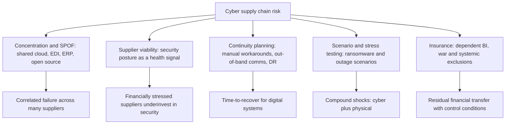
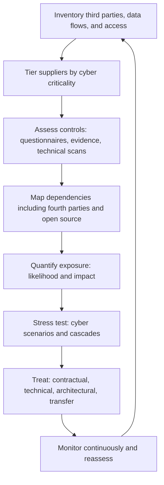
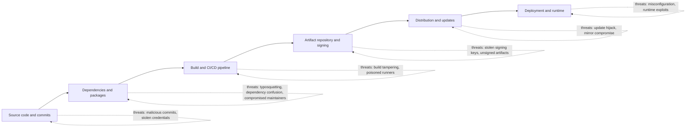
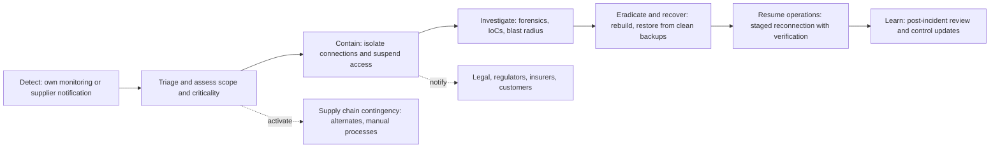
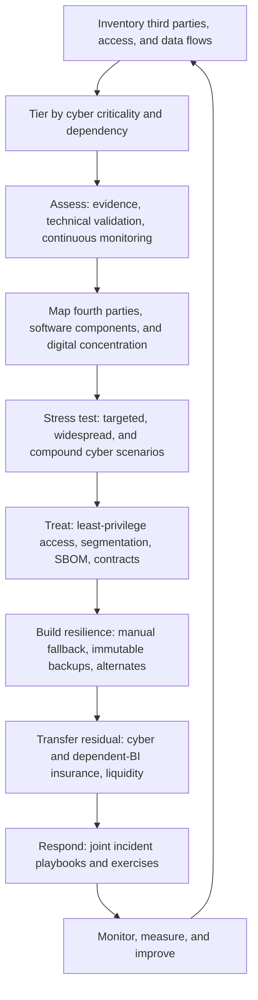

## Cybersecurity Risk Across Extended Supply Networks


### Overview

**Cybersecurity risk across extended supply networks** is the exposure that arises when an organization's information systems, operational technology (OT), software, data, and business processes depend on, or are reachable through, the digital estates of suppliers, service providers, logistics partners, and their own sub-tier dependencies. Unlike physical disruption, which is usually local and visible, cyber disruption propagates through **trust relationships**: shared credentials, network connections, software updates, managed service access, data exchanges (EDI, APIs, portals), and cloud platforms. A compromise at a small, poorly defended supplier can therefore become an entry point into a large, well-defended customer.

The topic extends the chapter's earlier themes into the digital domain. **Concentration risk** appears as reliance on one cloud region, one EDI provider, one ERP vendor, or one open-source component. **Supplier viability monitoring** must incorporate security posture alongside financial health. **Business continuity** must include manual workarounds and out-of-band communication when systems are unavailable. **Scenario planning** must test cyber events as compound shocks (for example, ransomware at a logistics provider coinciding with a port delay). **Insurance** must be read for dependent-system coverage, war and systemic-event exclusions, and control-based conditions.

The attack surface of an extended network covers multiple layers: **IT** (enterprise systems), **OT/ICS** (plant control and industrial systems), **software supply chain** (code, libraries, build systems, updates), **hardware supply chain** (firmware, components, counterfeit or tampered parts), **third-party services** (managed service providers, SaaS, cloud), **data flows** (EDI, APIs, file transfers), and **people and processes** (privileged access, social engineering).

**Key Points**

- Attackers often target the **weakest, most trusted link**: a supplier with less mature security but privileged access to the target.
- Cyber supply chain risk is **multi-layered**: it spans software, hardware, services, data, and physical logistics systems.
- **Visibility is limited**: most organizations cannot see below Tier-1 for cyber posture, yet fourth-party and open-source dependencies are frequent sources of systemic vulnerabilities.
- Third-party questionnaires provide **point-in-time, self-reported** assurance; continuous monitoring, technical evidence, and architecture controls (least privilege, segmentation, zero trust) are stronger complements.
- **Assume breach**: design so that a compromised supplier cannot easily traverse into core systems, and so that operations can degrade gracefully.
- Cyber risk is **systemic and correlated**: one vulnerability in a widely used component can affect thousands of organizations simultaneously, which strains both recovery resources and insurance capacity.

---

### 1. Conceptual Foundations

#### 1.1 Key Terms

| Term | Definition |
| --- | --- |
| Cyber supply chain risk | Risk that adversaries or failures in ICT products, services, or suppliers compromise confidentiality, integrity, or availability of an organization's assets or operations |
| Third-party risk | Risk arising from external entities with access to systems, data, or processes |
| Fourth-party (nth-party) risk | Risk from the suppliers of your suppliers |
| Attack surface | Sum of points where an adversary could attempt to enter or extract data |
| Lateral movement | Adversary movement from an initial foothold to other systems within or across networks |
| Software supply chain attack | Compromise of software during development, build, distribution, or update |
| SBOM (Software Bill of Materials) | Machine-readable inventory of components in a software product |
| Vulnerability | Weakness that can be exploited |
| CVE | Common Vulnerabilities and Exposures identifier for publicly disclosed vulnerabilities |
| Zero-day | Vulnerability exploited before a patch is available or publicly known |
| Ransomware | Malware that encrypts or exfiltrates data and demands payment |
| Business Email Compromise (BEC) | Fraud using compromised or spoofed email to redirect payments or extract data |
| OT / ICS / SCADA | Operational technology, industrial control systems, and supervisory control and data acquisition |
| Zero trust | Security model that does not implicitly trust any network location or identity and continuously verifies access |
| Least privilege | Granting only the minimum access required |
| MFA | Multi-factor authentication |
| MSP / MSSP | Managed service provider / managed security service provider |
| Incident response (IR) | Structured process to detect, contain, eradicate, and recover from incidents |
| Indicator of Compromise (IoC) | Observable evidence of intrusion |
| Threat actor | Individual or group conducting malicious activity (criminal, state-linked, hacktivist, insider) |
| CIA triad | Confidentiality, Integrity, Availability |

#### 1.2 Why Supply Networks Amplify Cyber Risk

| Amplifier | Mechanism |
| --- | --- |
| Trust and connectivity | VPNs, shared credentials, APIs, and remote-access tools create pathways across organizational boundaries |
| Uneven security maturity | Smaller suppliers often lack dedicated security staff and controls |
| Concentration and commonality | Shared software, cloud platforms, and service providers create correlated vulnerabilities |
| Opacity | Limited visibility into sub-tier suppliers and embedded components |
| Speed and scale of propagation | Automated updates and integrations spread compromise quickly |
| Convergence of IT and OT | Connected industrial systems extend cyber risk into physical production |
| Regulatory and contractual complexity | Different jurisdictions and obligations along the chain |
| Time pressure and lean operations | Just-in-time flows leave little buffer when digital systems fail |

#### 1.3 Relationship to Other Chapter Topics



---

### 2. Threat Landscape and Attack Vectors

#### 2.1 Threat Actors

| Actor Type | Typical Motivation | Supply Chain Relevance |
| --- | --- | --- |
| Financially motivated criminals (ransomware, fraud groups) | Extortion, theft | Target suppliers and logistics providers whose downtime creates pressure to pay |
| State-linked actors | Espionage, pre-positioning, disruption, IP theft | May compromise vendors or software to reach high-value targets |
| Hacktivists | Ideological disruption | Target companies or sectors tied to political issues |
| Insiders (malicious or negligent) | Financial gain, grievance, error | Trusted access at suppliers or partners |
| Opportunistic actors | Exploit widely known vulnerabilities at scale | Mass exploitation of unpatched internet-facing systems |
| Affiliate ecosystems (ransomware-as-a-service) | Profit-sharing models lowering barrier to entry | Wide range of victims including small suppliers |

Attribution is difficult and often uncertain; public claims should be treated with caution [Inference: attribution confidence varies and is sometimes revised after initial reporting].

#### 2.2 Attack Vector Catalog

| Vector | Description | Illustrative Pathway |
| --- | --- | --- |
| Compromised third-party credentials | Stolen or reused credentials of a supplier user or service account | Attacker logs into customer portal or VPN using supplier account |
| Trusted software update compromise | Malicious code inserted into a legitimate update or build pipeline | Signed update deploys malware to all customers |
| Open-source dependency compromise | Malicious or vulnerable package, typosquatting, or maintainer account takeover | Package pulled automatically into builds |
| Managed service provider compromise | Attacker uses MSP's remote management tools to reach client environments | Single MSP breach affects many downstream clients |
| Vulnerable internet-facing appliance | Unpatched VPN, file-transfer, or gateway product | Mass exploitation across many organizations |
| Cloud misconfiguration and identity abuse | Over-permissive roles, exposed storage, token theft | Access to data or workloads across tenants |
| Phishing and BEC | Social engineering of supplier or customer staff | Fraudulent invoice or bank-detail change |
| EDI/API abuse | Compromised interfaces or poorly authenticated integrations | Data manipulation or injection via trusted channel |
| Remote-access tool abuse | Vendor maintenance access left permanent or weakly secured | Persistent access into OT networks |
| Hardware and firmware tampering | Malicious or counterfeit components, altered firmware | Backdoor in networking gear or industrial controllers |
| Physical and logistics system compromise | Attacks on port, terminal, or transport management systems | Cargo release delays; misrouted shipments |
| Data exfiltration and double extortion | Data stolen before encryption, then threatened with release | Pressure on suppliers and their customers |
| Denial-of-service against portals or logistics platforms | Overwhelm availability | Order and tracking systems inaccessible |
| Insider access at third parties | Contractor or vendor employee misuse | Data theft or sabotage |
| Business-process compromise | Tampering with master data (bank details, part specs, routing) | Payment diversion or quality issues |

#### 2.3 Illustrative Attack Path


Each hop uses a legitimate trust relationship, which is why controls at trust boundaries (authentication, segmentation, monitoring) are critical.

---

### 3. Notable Incident Patterns

Publicly documented incidents illustrate recurring patterns. Details and figures below are summarized at a high level; readers should verify specifics against authoritative post-incident reports, since early reporting was often revised.

| Pattern | Illustrative Incident (High Level) | Lesson |
| --- | --- | --- |
| Malicious update of trusted software | The 2020 compromise of a widely deployed network-management platform's build process, distributing trojanized updates to thousands of customers | Build-pipeline integrity, update verification, and monitoring for anomalous behavior from trusted software |
| Destructive malware via accounting software | The 2017 NotPetya campaign spread through a compromised update mechanism of a widely used accounting package in one country; major global firms, including shipping and logistics operators, suffered severe operational disruption | Trusted-channel compromise can cause massive collateral damage; segmentation and offline backups matter |
| Third-party access to a retailer | The 2013 breach of a large US retailer reportedly began with credentials stolen from an HVAC vendor | Vendor access should be limited, segmented, and monitored |
| Managed service provider compromise | The 2021 attack exploiting a vulnerability in remote-management software used by MSPs, affecting many downstream customers | Concentration in management tooling creates correlated risk |
| Software component vulnerability at scale | The 2021 Log4Shell vulnerability in a ubiquitous Java logging library | Need for SBOMs and rapid dependency inventory |
| File-transfer product exploitation | The 2023 exploitation of a managed file-transfer product affecting many organizations | Internet-facing enterprise tools are high-value targets; data-exfiltration extortion is common |
| Logistics and port-system outages | Cyber incidents at major terminal operators and shipping firms have disrupted cargo handling and booking systems | Logistics IT is a chokepoint |
| Healthcare/clearinghouse outage | The 2024 ransomware event at a major healthcare payments intermediary disrupted claims processing across a sector | Central intermediaries create sector-wide dependency |
| Vendor-caused global outage (non-malicious) | The 2024 faulty security-software update that crashed millions of Windows systems worldwide | Availability risk arises from defective updates, not only attacks; staged rollout and vendor concentration matter |

These incidents show that **malicious and accidental failures share the same propagation mechanism**: trusted, widely deployed, centrally managed software and services.

---

### 4. Risk Assessment Methodology

#### 4.1 End-to-End Process



#### 4.2 Step 1: Inventory and Data-Flow Mapping

Build a register of third parties with attributes:

| Attribute | Examples |
| --- | --- |
| Service type | Software vendor, SaaS, MSP, logistics provider, contract manufacturer, IT staffing |
| Access type | Network (VPN, direct connect), application (portal, API), physical, data-only |
| Data handled | Personal data, IP, financial, operational, credentials |
| Integration type | EDI, API, file transfer, shared identity, remote administration |
| Privilege level | Read-only, write, admin |
| Criticality | Impact on operations, revenue, safety, and compliance |
| Substitutability | Ease and time to replace |
| Subcontractors | Known fourth parties and hosting locations |

Data-flow diagrams reveal where sensitive data or privileged access crosses organizational boundaries, which is where controls should concentrate.

#### 4.3 Step 2: Tiering by Cyber Criticality

| Tier | Criteria | Assessment Depth |
| --- | --- | --- |
| Critical | Privileged or persistent access; handles sensitive data; sole-source; operational dependency | Deep: evidence review, technical validation, audit or on-site review, joint exercises, continuous monitoring |
| High | Significant data or access; moderate substitutability | Detailed questionnaire, evidence sampling, external scanning, annual review |
| Moderate | Limited access or data | Standard questionnaire, external ratings, periodic review |
| Low | No access or sensitive data | Lightweight due diligence at onboarding |

#### 4.3.1 Inherent Risk Scoring

$$\text{Inherent Risk}_i = f(\text{Access Privilege}_i,\ \text{Data Sensitivity}_i,\ \text{Operational Criticality}_i,\ \text{Substitutability}_i)$$

A simple weighted model:

$$\text{IR}_i = w_1 A_i + w_2 D_i + w_3 O_i + w_4 S_i, \qquad \sum_k w_k = 1$$

where each factor is scored on a common scale (for example, 1 to 5). Then the **residual risk** adjusts for control effectiveness:

$$\text{Residual Risk}_i = \text{IR}_i \times (1 - \text{Control Effectiveness}_i)$$

Control effectiveness is an estimate between 0 and 1 based on evidence quality; it is subjective and should be treated as a ranking aid rather than a precise measure.

#### 4.4 Step 3: Control Assessment

| Method | Description | Strengths | Limitations |
| --- | --- | --- | --- |
| Questionnaires (for example, standardized industry sets) | Supplier self-reports controls | Scalable, comparable | Self-reported, point-in-time, can be inflated |
| Evidence requests | Policies, test results, audit reports, certifications | More reliable than answers alone | Evidence can be stale or scoped narrowly |
| Certifications and attestations (for example, ISO/IEC 27001, SOC 2, sector schemes) | Independent assessment of controls | Third-party assurance | Scope may exclude the relevant system; certificate does not mean secure |
| External attack-surface scanning / security ratings | Outside-in observation of exposed services, vulnerabilities, and hygiene signals | Continuous, non-intrusive | Incomplete view; false positives and attribution errors; methodology varies by vendor [Unverified: correlation between ratings and breach likelihood is contested and varies across providers] |
| Penetration testing / red team (with consent) | Active testing of defenses | Realistic | Costly; scope-limited |
| Audit / on-site review | Direct verification | High fidelity | Resource-intensive |
| Contractual right to audit | Enables verification | Legal leverage | Rarely exercised at scale |
| Incident and breach history review | Past events and response quality | Indicator of maturity | Past does not predict future |
| Shared assessments or industry utilities | Common assessments reused across buyers | Reduces supplier burden | Depth varies |

#### 4.5 Step 4: Dependency Mapping (Fourth Parties and Software)

- **Fourth-party identification:** require disclosure of critical subcontractors, hosting providers, and data locations; use external scanning to infer technology and hosting dependencies.
- **Concentration analysis:** count how many critical suppliers rely on the same cloud provider, MSP, identity provider, or software product. This applies the HHI and shared-source logic from concentration analysis to digital dependencies:

$$HHI_{\text{cloud}} = \sum_{j} \left( 100 \cdot s_j \right)^2$$

where $s_j$ is the share of critical suppliers (or critical workloads) hosted by provider $j$.

- **Software composition:** use **SBOMs** and software-composition analysis to catalog open-source and third-party components, then match against vulnerability databases.

#### 4.6 Quantifying Cyber Exposure

**Frequency-severity approach:**

$$\text{Expected Annual Loss} = \lambda \times E[\text{Severity}]$$

where $\lambda$ is the expected annual frequency of qualifying events and severity includes response costs, downtime loss, data-related costs, legal, and extortion where applicable.

**FAIR-style decomposition** (Factor Analysis of Information Risk):

$$\text{Risk} = \text{Loss Event Frequency} \times \text{Loss Magnitude}$$


$$\text{Loss Event Frequency} = \text{Threat Event Frequency} \times \text{Vulnerability}$$

Inputs are usually elicited as ranges or distributions rather than point values, then simulated. Data for rare cyber events is sparse and heterogeneous, so estimates carry wide uncertainty [Inference: published loss statistics differ by methodology, sampling, and definitions].

**Example (Python: Monte Carlo of a supplier-compromise scenario)**

```python
import numpy as np

rng = np.random.default_rng(101)
N = 200_000

# Illustrative assumptions for a critical logistics-platform provider compromise
lam = 0.08                      # annual probability of a qualifying event (assumed)
downtime_days_median = 9        # lognormal median outage days
downtime_sigma = 0.7
daily_margin_at_risk = 250_000  # $ gross profit/day affected
response_cost_median = 600_000  # forensics, legal, comms (lognormal median)
response_sigma = 0.8
data_cost_prob = 0.35           # probability sensitive data is also affected
data_cost_median = 1_200_000
data_sigma = 0.9

occurs = rng.random(N) < lam
downtime = rng.lognormal(np.log(downtime_days_median), downtime_sigma, N)

# Manual workaround reduces effective loss days by an assumed fraction
workaround_effectiveness = 0.40
effective_days = downtime * (1 - workaround_effectiveness)

bi_loss = effective_days * daily_margin_at_risk
resp = rng.lognormal(np.log(response_cost_median), response_sigma, N)
data_hit = rng.random(N) < data_cost_prob
data_loss = np.where(data_hit, rng.lognormal(np.log(data_cost_median), data_sigma, N), 0.0)

total = np.where(occurs, bi_loss + resp + data_loss, 0.0)

print(f"Expected annual loss:  ${total.mean():,.0f}")
print(f"P(loss > 0):           {(total > 0).mean():.2%}")
print(f"VaR 95%:               ${np.percentile(total, 95):,.0f}")
print(f"VaR 99%:               ${np.percentile(total, 99):,.0f}")
tail = total[total >= np.percentile(total, 99)]
print(f"CVaR 99%:              ${tail.mean():,.0f}")
```

**Output**

The script prints expected annual loss, the probability of any loss, and tail metrics. Because events are rare (8% per year in this assumption), the 95th percentile may be zero while the 99th percentile and CVaR reveal severity. Changing `workaround_effectiveness` demonstrates the value of manual continuity procedures: a higher value reduces business-interruption loss proportionally. All parameters are illustrative assumptions; results vary with distributions, correlation, and the seed.

---

### 5. Software Supply Chain Security

#### 5.1 The Software Supply Chain Lifecycle



#### 5.2 Controls by Stage

| Stage | Controls |
| --- | --- |
| Source | Branch protection, mandatory code review, signed commits, secrets scanning, least-privilege repository access |
| Dependencies | Pin versions and hashes, use private registries or mirrors, dependency-confusion protections, software composition analysis, vulnerability triage, maintain SBOM |
| Build | Hardened, ephemeral build environments; isolated runners; reproducible or hermetic builds; provenance attestations |
| Artifact | Sign artifacts and verify signatures; protect signing keys (hardware security modules); artifact immutability |
| Distribution | Secure channels; integrity verification; staged/canary rollouts to limit blast radius |
| Deployment | Policy enforcement (admission controls), configuration baselines, runtime monitoring |
| Governance | Vendor SBOM requirements, vulnerability disclosure and patch SLAs, secure development attestation |

#### 5.3 Frameworks and Standards (Verify Current Versions)

| Framework / Standard | Focus |
| --- | --- |
| SLSA (Supply-chain Levels for Software Artifacts) | Incremental build integrity and provenance levels |
| NIST Secure Software Development Framework (SSDF, SP 800-218) | Secure development practices |
| NIST SP 800-161 (Cybersecurity Supply Chain Risk Management) | C-SCRM practices for organizations |
| NIST Cybersecurity Framework (CSF) 2.0 | Includes a supply chain risk management category within governance |
| ISO/IEC 27036 | Information security for supplier relationships |
| ISO/IEC 27001 / 27002 | Information security management systems and controls |
| IEC 62443 | Industrial automation and control systems security |
| SBOM formats (SPDX, CycloneDX) | Machine-readable component inventories |
| VEX (Vulnerability Exploitability eXchange) | Communicates whether a vulnerability in a component is actually exploitable in a product |
| OpenSSF Scorecard and related projects | Automated checks of open-source project security practices |

#### 5.4 SBOM Usage Example

An SBOM lets an organization quickly answer "Which of our products or suppliers include component X version Y?" when a new vulnerability is disclosed.

**Example (Python: querying a CycloneDX-style SBOM inventory)**

```python
import json

# Simplified SBOM inventory across products
sboms = {
    "product_alpha": {
        "components": [
            {"name": "log4j-core", "version": "2.14.1"},
            {"name": "openssl", "version": "3.0.7"},
            {"name": "jackson-databind", "version": "2.15.0"},
        ]
    },
    "product_beta": {
        "components": [
            {"name": "log4j-core", "version": "2.17.1"},
            {"name": "openssl", "version": "1.1.1k"},
        ]
    },
    "supplier_gamma_module": {
        "components": [
            {"name": "log4j-core", "version": "2.12.0"},
            {"name": "zlib", "version": "1.2.13"},
        ]
    },
}

def parse(v):
    return tuple(int(x) for x in v.split(".") if x.isdigit())

def affected(component, min_v, fixed_v):
    """Flag versions >= min_v and < fixed_v."""
    hits = []
    for prod, sbom in sboms.items():
        for c in sbom["components"]:
            if c["name"] == component and parse(min_v) <= parse(c["version"]) < parse(fixed_v):
                hits.append((prod, c["version"]))
    return hits

# Illustrative: treat log4j-core 2.0 through < 2.17.1 as affected (example range only)
for prod, ver in affected("log4j-core", "2.0.0", "2.17.1"):
    print(f"AFFECTED: {prod} uses log4j-core {ver}")
```

**Output**

The script flags `product_alpha` (2.14.1) and `supplier_gamma_module` (2.12.0) as affected while `product_beta` (2.17.1) is not, under the illustrative version range. Real vulnerability applicability depends on the exact advisory, configuration, and exploitability (which VEX statements help communicate); an SBOM match indicates *presence*, not necessarily *exploitability*. The version-range logic here is simplified and does not replace authoritative vulnerability data.

---

### 6. Operational Technology (OT) and Industrial Supply Chains

#### 6.1 IT/OT Convergence Risk

Industrial systems (programmable logic controllers, SCADA, distributed control systems) prioritize **availability and safety** and often run legacy, hard-to-patch software. Vendor remote access, integrator laptops, and connected sensors create pathways into OT networks. Consequences of compromise can be physical (production stoppage, quality deviation, safety incidents).

| OT Risk Factor | Description |
| --- | --- |
| Legacy and unpatchable systems | Long life cycles; vendor support may lapse |
| Persistent vendor remote access | Convenience connections left open |
| Flat networks | Insufficient segmentation between IT and OT and among zones |
| Shared credentials | Generic accounts across sites and contractors |
| Third-party integrators and maintenance | Portable media and laptops moving between customers |
| Limited monitoring | Passive monitoring tools uncommon in older plants |
| Safety-cyber interplay | Attacks that manipulate process values or safety systems |

#### 6.2 Controls for OT and Third-Party Access

- **Segmentation and zones/conduits** aligned to IEC 62443 concepts; a demilitarized zone between IT and OT.
- **Brokered, time-limited, recorded vendor access** (jump hosts, privileged access management) rather than standing VPN connections.
- **Multi-factor authentication** for all remote access.
- **Asset inventory and passive network monitoring** for OT.
- **Change control and portable-media hygiene** for contractor devices.
- **Offline backups and tested restoration** for controller configurations and engineering projects.
- **Manual operating procedures** and safe-state design for loss-of-view or loss-of-control situations.
- **Vendor security requirements** in procurement of industrial equipment (secure-by-design, patch commitments, default-credential removal).

#### 6.3 Product and Hardware Supply Chain Integrity

| Concern | Controls |
| --- | --- |
| Counterfeit or gray-market components | Authorized-channel purchasing, traceability, inspection and test |
| Firmware tampering | Secure boot, signed firmware, firmware integrity monitoring |
| Hardware backdoors and malicious implants | Trusted-supplier programs, design review, testing; risk-based sourcing of critical components |
| Provenance and origin | Documentation of manufacturing locations and key components; consider geopolitical exposure |
| End-of-life and vulnerability disclosure | Vendor commitments on support periods and coordinated disclosure |

Some jurisdictions restrict or scrutinize specific technology suppliers for critical infrastructure and government use; requirements change and vary by country.

---

### 7. Logistics, Trade Platforms, and Data-Exchange Risk

Logistics networks are highly digitized and interconnected, and typically involve many small parties with uneven security maturity.

| Component | Cyber Exposure |
| --- | --- |
| Transportation management systems (TMS), warehouse management systems (WMS) | Downtime disrupts routing, picking, and shipping |
| Port and terminal operating systems, customs platforms | Cargo release delays; regulatory clearance disruptions |
| Freight forwarder and carrier portals | Credential theft; fraudulent bookings or diversions |
| Track-and-trace and IoT telematics | Data manipulation, loss of visibility, location leakage |
| EDI and API gateways | Injection of fraudulent messages; interruption of order flow |
| Electronic documents (bills of lading, invoices) | Forgery, payment diversion (BEC) |
| Cloud-based visibility platforms | Concentrated dependency; multi-tenant risk |

#### 7.1 Payment-Diversion and Master-Data Fraud

Business-process compromise targets supplier master data:

1. Attacker compromises a supplier's or buyer's email.
2. Sends a convincing request to change bank details on an invoice or master record.
3. Payments divert to attacker-controlled accounts.

**Controls:** out-of-band verification (callback to known contact) for any bank-detail change; dual approval; vendor master-data change logging and alerts; payment-anomaly detection; strong email authentication (SPF, DKIM, DMARC); user training.

#### 7.2 Secure Data-Exchange Practices

- Authenticate and authorize every integration (mutual TLS, OAuth with scoped tokens, signed messages).
- Validate and sanitize inbound data (schema validation, anomaly detection on volumes and values).
- Rotate secrets and credentials; avoid shared accounts; use secrets managers.
- Monitor for abnormal transaction patterns (sudden changes in order quantities, destinations, or amounts).
- Maintain fallback channels (secure email, phone verification, manual order entry) for system outages.

---

### 8. Governance, Contracts, and Assurance

#### 8.1 Contractual Security Requirements

| Clause Area | Typical Provisions |
| --- | --- |
| Minimum security controls | Baseline requirements (MFA, patching timelines, encryption, logging, endpoint protection), aligned to a recognized framework |
| Access management | Least privilege, named accounts, privileged access controls, prompt deprovisioning |
| Incident notification | Notice within a defined window (for example, 24 to 72 hours) of suspected or confirmed incidents affecting the customer; ongoing updates; cooperation |
| Right to audit and assess | Rights to review evidence, conduct assessments or penetration tests with agreed scope |
| Subcontractor and fourth-party controls | Disclosure, flow-down of requirements, consent for critical subcontractors |
| Software transparency | SBOM delivery, vulnerability disclosure, patch SLAs |
| Data protection | Data classification, location restrictions, retention, deletion, breach responsibilities |
| Business continuity and recovery | RTO/RPO commitments, backup and restoration testing, geographic redundancy |
| Insurance | Minimum cyber and technology E&O coverage with adequate limits; certificate and, ideally, verification of coverage terms |
| Liability and indemnity | Caps, carve-outs for data breach and gross negligence; alignment with the customer's downstream exposure |
| Exit and transition | Data return, transition assistance, and continuity during termination |
| Regulatory compliance | Obligations under applicable laws and sector rules |

Contractual enforceability and effective notification windows depend on jurisdiction and drafting; overly aggressive terms may deter suppliers or be unenforceable.

#### 8.2 Regulatory and Legal Landscape (Verify Current Status)

| Domain | Examples of Instruments (High Level) | Relevance |
| --- | --- | --- |
| Data protection | GDPR and comparable national privacy laws | Breach notification, processor obligations, cross-border transfers |
| Network and information security | EU NIS2 Directive | Supply chain security measures and incident reporting for essential and important entities |
| Financial-sector resilience | EU Digital Operational Resilience Act (DORA); banking supervisory guidance on third-party risk | Register of ICT third parties, testing, exit strategies, oversight of critical providers |
| Critical infrastructure | Sector-specific regulations and national laws | Security and incident-reporting duties |
| Product security | EU Cyber Resilience Act; product security requirements for connected devices | Security obligations for manufacturers of products with digital elements |
| Public procurement and government contractors | Frameworks setting cybersecurity requirements for suppliers (for example, US contractor certification programs) | Flow-down obligations to subcontractors |
| Securities disclosure | Requirements in some jurisdictions to disclose material cyber incidents | Timeliness and materiality assessment |
| Sanctions and export controls | Restrictions on technology and dealings with certain parties | Constraints on sourcing and incident payments |

The scope, timelines, and enforcement of these instruments are evolving; legal counsel and current primary texts should be consulted.

#### 8.3 Governance Structure

| Role | Responsibility |
| --- | --- |
| Board / executive sponsor | Risk appetite; oversight; resource authorization |
| CISO / security function | Standards, assessments, monitoring, incident response |
| Procurement / sourcing | Embed security in supplier selection and contracts; supplier relationship management |
| Supply chain and operations | Identify critical dependencies; manual workarounds; recovery priorities |
| Legal and compliance | Contracts, regulation, incident notification, privilege |
| IT / architecture | Access design, segmentation, integration security |
| OT / engineering | Industrial security and vendor-access controls |
| Finance / treasury / insurance | Loss quantification, cyber insurance program |
| Communications | Crisis messaging |
| Business owners | Accept and manage residual risk in their domains |

Cross-functional ownership is essential because cyber supply chain risk cuts across procurement, IT, operations, legal, and finance.

---

### 9. Technical Architecture Controls

#### 9.1 Zero Trust and Least-Privilege for Third-Party Access

```mermaid
flowchart LR
    subgraph External
        V[Supplier user or system]
    end
    subgraph Access Layer
        IDP[Identity provider with MFA]
        PAM[Privileged access broker: just-in-time, recorded sessions]
        GW[API gateway: authN, authZ, rate limiting, schema validation]
    end
    subgraph Segmented Zones
        DMZ[Partner DMZ]
        APP[Application zone: scoped resources only]
        OT[OT zone: no direct external access]
        CORE[Core data and ERP: restricted]
    end
    V --> IDP --> PAM
    V --> GW
    PAM --> DMZ
    GW --> APP
    DMZ --> APP
    APP -. controlled conduit .-> CORE
    APP -. broker only .-> OT
    M[Monitoring: SIEM, UEBA, anomaly detection] --- Access Layer
    M --- Segmented Zones
```

#### 9.2 Control Catalog

| Control Category | Measures |
| --- | --- |
| Identity and access | MFA everywhere for third-party access; federated identity; unique named accounts; conditional access; just-in-time privileges; periodic access recertification; rapid offboarding |
| Network | Segmentation and micro-segmentation; partner DMZs; egress filtering; restrict lateral movement; secure remote access instead of broad VPN |
| Application and API | Strong authentication, scoped tokens, input validation, rate limiting, logging |
| Endpoint | Endpoint detection and response on managed devices; restrictions on unmanaged supplier devices |
| Data | Classification, encryption in transit and at rest, minimization of data shared, tokenization, data-loss prevention |
| Secrets management | Central vaults; rotation; no hard-coded credentials |
| Logging and detection | Centralized logging of third-party activity; behavioral analytics; alert on anomalies (unusual times, volumes, locations) |
| Vulnerability and patch management | Asset inventory; risk-based patching; rapid response to critical vulnerabilities; exposure management for internet-facing assets |
| Resilience | Immutable and offline backups; tested restoration; segmentation of backup infrastructure; disaster-recovery and manual fallback procedures |
| Email and fraud controls | DMARC enforcement, secure email gateways, payment verification procedures |
| Change and configuration management | Baselines, review of third-party changes, staged rollout of updates |
| Vendor diversity and exit readiness | Avoid single points of digital failure; maintain exit and portability plans |

#### 9.3 Third-Party Access Lifecycle

| Phase | Actions |
| --- | --- |
| Onboarding | Due diligence; define minimum required access; provision least privilege; document data flows |
| Operation | Monitor activity; enforce MFA; review access periodically; track changes |
| Change | Reassess on scope, ownership, or architecture changes; re-verify controls |
| Incident | Suspend or restrict access rapidly; require evidence and cooperation |
| Offboarding | Revoke credentials and tokens; remove network paths; retrieve or verify deletion of data; confirm return of assets |

Orphaned accounts and forgotten integrations are a frequent, avoidable source of exposure.

---

### 10. Concentration and Systemic Cyber Risk

#### 10.1 Digital Single Points of Failure

| Dependency | Failure Mode | Correlated Effect |
| --- | --- | --- |
| Single cloud region or provider | Outage, misconfiguration, provider incident | Many suppliers and internal systems fail together |
| Shared identity provider | Compromise or outage | Loss of authentication across services |
| Dominant endpoint or security software | Defective update or compromise | Mass endpoint failure |
| Common ERP or logistics platform | Vulnerability or ransomware on vendor | Downtime across all customers |
| Managed service provider | Compromise of management tooling | Multi-customer compromise |
| Widely used open-source library | Zero-day vulnerability | Simultaneous exposure across organizations |
| Single EDI/VAN or payment network | Outage or attack | Order and payment flow stops |
| Telecommunications or DNS provider | Attack or failure | Loss of connectivity or name resolution |

#### 10.2 Quantifying Digital Concentration

Apply the concentration metrics to digital dependencies:

$$CR_n = \sum_{i=1}^{n} s_i, \qquad N_{eff} = \frac{1}{\sum_{i} s_i^2}$$

**Example**

Among a firm's 40 critical suppliers, hosting is distributed as: Provider X hosts 22, Provider Y hosts 10, Provider Z hosts 5, and others host 3 (one each).

Shares: $s_X = 0.55,\ s_Y = 0.25,\ s_Z = 0.125,\ s_{\text{others}} = 0.075$ (treating the three others as separate providers of 0.025 each).

$$\sum s_i^2 = 0.55^2 + 0.25^2 + 0.125^2 + 3 \times 0.025^2 = 0.3025 + 0.0625 + 0.015625 + 0.001875 = 0.3825$$


$$HHI = 0.3825 \times 10{,}000 = 3{,}825, \qquad N_{eff} = \frac{1}{0.3825} \approx 2.61$$

**Output**

An HHI of about 3,825 indicates high concentration under illustrative thresholds, and the effective number of hosting providers is about 2.6 despite six nominal providers. A single outage at Provider X would simultaneously affect 55% of critical suppliers, a common-cause failure that supplier-level diversification does not address.

#### 10.3 Systemic-Event Considerations

- **Correlated response constraints:** during a widespread vulnerability event, incident-response firms, forensic capacity, and patch resources are stretched.
- **Simultaneous demand on shared alternates:** many organizations may shift to the same backup provider.
- **Insurance accumulation:** insurers apply sub-limits and exclusions for widespread events; coverage may be less than expected.
- **Information asymmetry:** initial disclosures can be incomplete or evolving.

Scenario planning should therefore include a **widespread-event scenario** (for example, a critical vulnerability in a ubiquitous component or an outage at a major platform) in addition to targeted attacks.

---

### 11. Cyber Incident Response and Continuity Across the Network

#### 11.1 Extended Incident Response Lifecycle



#### 11.2 Supplier-Originated Incident Playbook

| Phase | Actions |
| --- | --- |
| Notification received | Log and timestamp; verify source; assess what data, systems, and access are involved; involve security, legal, procurement, and operations |
| Immediate containment | Suspend or restrict the supplier's access; rotate credentials and tokens shared with the supplier; block indicators of compromise; increase monitoring on related accounts and integrations |
| Impact assessment | Identify data exposure and system interfaces; determine dependency-related operational impact (TTR versus TTS); check whether the supplier is a single source |
| Continuity activation | Move to alternates or manual procedures; adjust production and order plans; use out-of-band communications |
| Investigation cooperation | Request evidence, timelines, and forensic findings; align on communications; preserve logs and evidence |
| Legal and regulatory | Assess notification duties (regulators, individuals, customers); preserve privilege; coordinate with counsel |
| Insurance | Notify carriers promptly per policy conditions; document losses and costs |
| Restoration | Require validation that the supplier's environment is clean; staged reconnection with enhanced monitoring; re-assess residual risk |
| Lessons learned | Update assessments, contracts, controls, and playbooks; consider supplier diversification |

#### 11.3 Manual and Degraded-Mode Operations

Because digital systems can be unavailable for days or weeks, continuity plans should define **minimum viable operations** without IT:

- Paper or offline order entry, pick lists, and shipping documents.
- Offline copies of critical master data (part numbers, customer priority lists, supplier contacts, bills of materials).
- Alternate communication channels independent of corporate systems (personal or out-of-band messaging, phone trees, secondary email domain).
- Pre-agreed procedures for confirming orders and payments verbally with known contacts.
- Manufacturing execution fallback modes and safe-state procedures for OT.
- Clear authority for spending on emergency logistics and alternative sourcing.

#### 11.4 Time-to-Recover for Digital Systems

Apply the exposure-gap logic with digital recovery estimates:

$$\text{Exposure Gap}_{\text{digital}} = \text{TTR}_{\text{system}} - \text{TTS}_{\text{operations}}$$

**Example**

A logistics visibility platform used to release shipments is offline after a ransomware attack. Estimated restoration time is 14 days. Operations can continue 3 days on cached data and then 5 more days using manual processes at 50% throughput. Daily gross profit dependent on the platform is $300,000.

$$\text{Full-loss days} = 0 \text{ (first 3 days at full function)}$$

\text{Days 4 to 8 (5 days) at 50%}: \quad 5 \times 0.50 \times 300{,}000 = \$750{,}000
\text{Days 9 to 14 (6 days): assume manual throughput drops to 25% due to backlog}: \quad 6 \times 0.75 \times 300{,}000 = \$1{,}350{,}000


$$\text{Total} = 750{,}000 + 1{,}350{,}000 = \$2{,}100{,}000$$

**Output**

Estimated loss is about $2.1M under these assumptions. Extending manual-process capability (for example, raising throughput from 25% to 50% in the later period) would reduce the last term from $1.35M to $0.9M, saving $0.45M, illustrating the value of investing in practiced manual fallbacks. Assumptions about throughput, duration, and backlog dynamics are illustrative.

---

### 12. Cyber Insurance and Risk Transfer Interface

This topic connects directly to the preceding coverage of insurance mechanisms.

| Coverage Element | Considerations |
| --- | --- |
| First-party incident costs | Forensics, legal, notification, restoration, and crisis communications |
| Business interruption | Waiting period (often measured in hours), period of restoration, and how "system failure" and "security failure" are defined |
| Dependent BI | Cover for outages at third-party providers; check whether named providers are required and sub-limits apply |
| Data breach liability | Regulatory defense and third-party claims |
| Extortion | Ransom and negotiation costs, subject to legal and sanctions limitations |
| Contingent coverage for supplier systems | Often sub-limited; scope varies |
| War, state-backed, and infrastructure exclusions | Wording varies and has been contested; interpretation depends on the policy and jurisdiction |
| Systemic-event limits | Aggregates or exclusions for widespread events |
| Control-based conditions | Warranties or application representations about MFA, backups, patching; inaccuracies can jeopardize claims |
| Supplier insurance requirements | Require minimum cyber and technology E&O limits; confirm policy terms, not only certificates |

Insurance pays for financial consequences; it does not restore systems, protect customer trust, or replace security controls, and underwriters increasingly price and condition coverage on demonstrated control maturity.

---

### 13. Metrics and Continuous Monitoring

#### 13.1 Program Metrics

| Metric | Definition |
| --- | --- |
| Third-party coverage | % of critical and high-tier suppliers with completed, current assessments |
| Evidence quality ratio | % of assessments backed by independent evidence versus self-attestation only |
| Mean time to assess new supplier | Elapsed time from onboarding request to risk decision |
| Access hygiene | % of third-party accounts with MFA; % of accounts reviewed in the last quarter; count of orphaned accounts |
| Privileged third-party access | Number of standing privileged third-party connections |
| Remediation SLA compliance | % of supplier findings closed within agreed time |
| Vulnerability exposure | Number of critical vulnerabilities in supplier-facing or supplier-provided components; time to remediate |
| SBOM coverage | % of critical software suppliers providing SBOMs |
| Fourth-party visibility | % of critical suppliers with mapped critical subcontractors |
| Digital concentration index | HHI or $N_{eff}$ for hosting, identity, and platform dependencies |
| Incident notification timeliness | Median time from supplier detection to notification |
| Exercise coverage | % of critical suppliers included in a joint cyber or continuity exercise in the last 12 months |
| Manual-fallback readiness | % of critical processes with tested manual procedures |
| Backup restoration success | % of restoration tests meeting RTO/RPO |
| Loss and near-miss rate | Third-party-related incidents and near misses per period |

#### 13.2 Continuous Monitoring Signals

| Signal | Source |
| --- | --- |
| Exposed services, expired certificates, unpatched internet-facing systems | External attack-surface monitoring |
| Leaked credentials and data on illicit forums | Threat-intelligence and dark-web monitoring (subject to legal and ethical constraints) |
| Breach and incident news; ransomware leak-site postings | Open-source and commercial intelligence |
| Vulnerability advisories affecting supplier products | Vulnerability feeds; SBOM matching |
| Behavioral anomalies in supplier connections | Internal telemetry (SIEM/UEBA) |
| Changes in ownership, hosting, or subcontractors | Corporate and technical intelligence |
| Financial distress indicators | Supplier viability monitoring (financially stressed suppliers may underinvest in security) |

Ratings and monitoring feeds should be treated as **triage inputs**, validated with the supplier before consequential decisions, due to false positives and incomplete visibility.

---

### 14. Emerging Considerations

#### 14.1 AI in Supply Chains: Attack and Defense

| Aspect | Considerations |
| --- | --- |
| AI-enabled social engineering | More convincing phishing, voice or video impersonation targeting payment and access processes |
| Model and data supply chain | Dependence on third-party models, datasets, and plug-ins introduces provenance, poisoning, and leakage risks |
| AI-assisted defense | Anomaly detection, triage automation, supplier-intelligence extraction; accuracy and false-positive limits apply |
| Governance | Inventory of AI-enabled services used by suppliers; contractual terms on data use and model training |

Guidance and best practice in this area are evolving [Inference: standards and regulations for AI supply chain security are still maturing].

#### 14.2 Post-Quantum Cryptography

Adversaries may harvest encrypted data now for future decryption ("harvest now, decrypt later"). Organizations with long-lived sensitive data or long-lived embedded devices should inventory cryptographic dependencies, including in suppliers and products, and plan migration to quantum-resistant algorithms according to evolving standards. Timelines are uncertain and vary by data sensitivity [Unverified: the date at which cryptographically relevant quantum computers may exist remains uncertain].

#### 14.3 Cloud and SaaS Concentration

Reliance on a few hyperscalers and SaaS platforms increases both resilience (economies of scale in security) and systemic risk (correlated outages and shared vulnerabilities). Architectures may adopt multi-region, multi-cloud, or portable designs where justified by criticality, balancing complexity and cost.

#### 14.4 Regulatory Convergence

Regulators increasingly require formal third-party and supply chain security oversight, incident reporting, and resilience testing (for example, in financial services, critical infrastructure, and connected-product regulation). Organizations operating globally should plan for overlapping and sometimes inconsistent obligations.

---

### 15. Common Pitfalls

**Key Points**

- **Questionnaire-only assurance:** treating a completed form or a certificate as proof of security; certificates may not cover the relevant systems.
- **Ignoring fourth parties and open-source components:** the compromise often originates below Tier-1.
- **Standing, broad third-party access:** permanent VPNs and shared accounts instead of scoped, monitored, time-limited access.
- **Flat networks and weak segmentation:** allowing a compromised supplier connection to reach core systems or OT.
- **Assuming the supplier will tell you in time:** missing or slow notification clauses and no independent monitoring.
- **No manual fallback:** total dependence on digital systems with untested workarounds.
- **Over-reliance on security ratings:** using outside-in scores as definitive verdicts.
- **Backups that share the same compromise path:** connected, unprotected, or untested backups fail during ransomware.
- **Neglecting business-process fraud:** focusing on malware while payment-diversion and master-data manipulation cause direct loss.
- **Siloed ownership:** procurement, security, and operations acting independently; no clear accountability.
- **Treating cyber and physical scenarios separately:** missing compound events (for example, cyber outage plus port delay).
- **Ignoring digital concentration:** assuming supplier diversification implies infrastructure diversification.
- **Insurance assumptions:** overlooking dependent-BI sub-limits, war and systemic exclusions, and control-based conditions.
- **Ineffective offboarding:** leaving credentials, tokens, and network paths active after the relationship ends.
- **Compliance-only mindset:** meeting audit checklists without reducing real exposure.
- **Excessive supplier burden:** duplicative, overly long assessments that reduce response quality and goodwill.
- **Unpatched internet-facing enterprise tools:** slow response to critical advisories on remote-access, gateway, and file-transfer products.

---

### 16. End-to-End Worked Example

**Context.** A global industrial-equipment manufacturer (OEM) with $3B revenue depends on:

- A **cloud-based logistics visibility and customs platform** (single provider, used by all plants).
- A **Tier-1 contract manufacturer** with a persistent VPN into the OEM's engineering network for design exchange.
- A **managed service provider (MSP)** administering endpoints at three plants.
- Widespread use of an **open-source logging library** across in-house and supplier software.
- Daily gross profit dependent on the logistics platform: $1.1M. Tolerance: no more than $15M loss from any single cyber event.

**Step 1: Inventory and tiering**

| Third Party | Access / Data | Substitutability | Cyber Tier |
| --- | --- | --- | --- |
| Logistics platform | API and portal; shipment and customer data | Low (12-week migration) | Critical |
| Contract manufacturer | Standing VPN; engineering IP | Low | Critical |
| MSP | Privileged admin on endpoints | Moderate | Critical |
| Packaging supplier | Portal-only, minimal data | High | Low |

**Step 2: Assessment findings**

- Logistics platform: SOC 2 report scoped to the core service; provides 48-hour incident notification; single cloud region; no documented manual fallback in OEM's process.
- Contract manufacturer: no MFA on VPN accounts; flat internal network; shared engineering credentials.
- MSP: remote-management tool with broad, persistent privileges; no just-in-time access; logs not shared.
- Open-source library: SBOM coverage for in-house software at 60%; only 2 of 10 critical software suppliers provide SBOMs.

**Step 3: Digital concentration**

Nine of ten critical suppliers' workloads depend on one cloud provider: $s = 0.9$ for the dominant provider plus one other at 0.1.

$$HHI = (90)^2 + (10)^2 = 8100 + 100 = 8200, \qquad N_{eff} = \frac{1}{0.81 + 0.01} \approx 1.22$$

A single provider outage or compromise would hit nearly all critical suppliers at once.

**Step 4: Stress-test scenarios**

| Scenario | Description | Modeled Impact (illustrative) |
| --- | --- | --- |
| C1: Ransomware at logistics platform | 14-day outage; manual fallback undeveloped | 14 days at average 60% loss: $14 \times 0.60 \times 1{,}100{,}000 = \$9.24\text{M}$ plus response costs of $1.0M = about $10.2M |
| C2: Compromised contract-manufacturer VPN leading to OEM engineering-network intrusion | IP theft and ransomware on engineering systems; 10-day design freeze | $4M in delayed programs plus $3M response and legal = $7M, with unquantified IP loss |
| C3: MSP tool compromise | Ransomware on endpoints at three plants; 7-day production disruption | Daily gross profit at risk of $2.0M for affected plants at 70% impact: $7 \times 0.70 \times 2{,}000{,}000 = \$9.8\text{M}$ plus $2M response = $11.8M |
| C4: Widespread open-source vulnerability | Simultaneous exposure across suppliers; patching takes 3 weeks | Response cost and partial outages: $5M to $8M range |
| C5: Compound: platform outage (C1) plus cloud-provider regional outage | Fallback systems also unavailable | Loss could exceed $25M, breaching tolerance |

Compound scenario C5 demonstrates why digital concentration matters: fallback and dependent systems share the same provider.

**Step 5: Mitigation and transfer plan**

| Action | Type | Effect |
| --- | --- | --- |
| Require MFA, segmentation, and named accounts for contract-manufacturer access; replace standing VPN with brokered, recorded, time-limited access | Technical / contractual | Reduces likelihood and blast radius for C2 |
| Move MSP to just-in-time privileged access with logging shared to OEM SIEM; segment OEM management network | Technical | Reduces likelihood and impact of C3 |
| Develop and rehearse manual shipment-release and customs procedures, with offline data extracts refreshed daily | Continuity | Raises manual throughput from 40% to 70%: C1 loss falls from about $9.24M to $14 \times 0.30 \times 1{,}100{,}000 = \$4.62\text{M}$ |
| Contractually require logistics-platform SBOM-style disclosure, multi-region resilience, 24-hour notification, and joint exercise | Contractual | Faster response; shorter effective outage |
| Qualify a secondary logistics provider for priority lanes (partial capacity, 8-week ramp) | Diversification | Reduces exposure in C1 and C5 |
| Achieve SBOM coverage for all critical software and adopt VEX-based triage | Governance | Faster response to C4 |
| Diversify hosting for OEM's own critical fallback systems onto a separate provider or region | Architecture | Reduces compound-event exposure in C5 |
| Adjust cyber insurance: raise dependent-BI sub-limit, name the logistics platform and MSP, review war and systemic exclusions, confirm control conditions are met | Transfer | Improves financial recovery |
| Establish liquidity backstop for retained losses | Financing | Supports tolerance in tail scenarios |

**Step 6: Re-test**

- C1: reduced to about $5.6M ($4.62M BI plus $1.0M response) with manual fallback in place.
- C2 and C3: likelihood and impact reduced through access and segmentation controls; residual estimates fall to roughly $4M to $7M.
- C5: with a separate fallback environment and partial secondary logistics capacity, modeled loss falls to the $12M to $18M range, still near the $15M tolerance and therefore flagged for continued attention and insurance support.

**Step 7: Monitoring and governance**

- Continuous external-surface monitoring for all critical third parties; quarterly access recertification.
- Annual joint tabletop exercise with the logistics platform and MSP using scenario C5.
- KPIs: MFA coverage of third-party accounts (target 100%), SBOM coverage (target 100% of critical suppliers), digital-concentration HHI (target reduction below 4,000 for critical workloads), manual-fallback test success rate.
- Ownership: CISO for control assurance; procurement for contractual requirements; operations for manual procedures; finance for insurance and liquidity.

**Conclusion of example.** The assessment shows the largest exposures come not from any single supplier's weakness alone but from **standing privileged access, digital concentration, and the absence of tested manual fallbacks**. Combining architectural controls, contractual requirements, continuity capability, diversification of fallback infrastructure, and insurance reduces modeled losses toward stated tolerance. Real outcomes depend on adversary behavior, execution quality, and events outside the organization's control; all figures are illustrative.

---

### 17. Summary Framework



**Conclusion**

Cybersecurity risk across extended supply networks arises from the trust, connectivity, and shared technology that make modern supply chains efficient. Adversaries and accidental failures exploit the same pathways: compromised credentials, trusted software updates, managed service tooling, and widely used platforms and components. Effective management combines risk-tiered third-party assurance that goes beyond questionnaires, architectural controls that assume breach (least privilege, segmentation, brokered and monitored access), software supply chain transparency (SBOMs, provenance, patch discipline), attention to OT and logistics systems, explicit analysis of digital concentration and correlated failure, tested manual and degraded-mode operations, joint incident response across organizational boundaries, and appropriately structured contractual and insurance risk transfer. No control set eliminates the risk: supplier posture changes over time, visibility below Tier-1 remains limited, systemic events can overwhelm shared recovery capacity, and regulatory expectations continue to evolve. Programs should therefore be measured, exercised, and continuously updated, with outcomes and figures understood as conditional on assumptions and subject to substantial uncertainty.

**Related Topics**

- Single Point of Failure and Concentration Risk Analysis
- Supplier Financial Health and Viability Monitoring
- Business Continuity and Contingency Planning
- Scenario Planning and Stress Testing
- Insurance and Risk Transfer Mechanisms
- Software Bill of Materials (SBOM) and Software Supply Chain Security
- Operational Technology and Industrial Control System Security
- Third-Party Risk Management Programs and Tooling
- Zero Trust Architecture for Partner Access
- Incident Response and Crisis Management for Multi-Party Events
- Payment Fraud and Business Email Compromise Prevention
- Regulatory Frameworks for Supply Chain Cybersecurity (NIS2, DORA, Cyber Resilience Act)