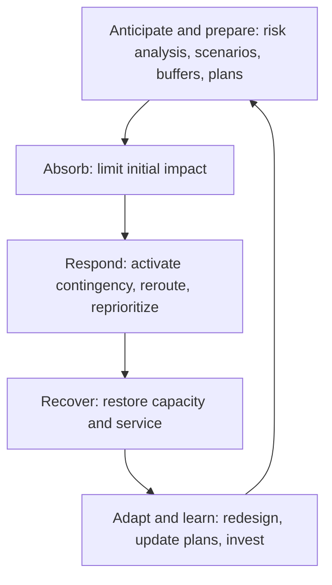
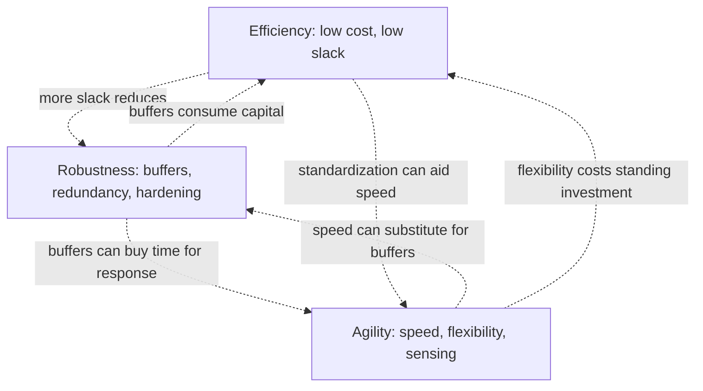
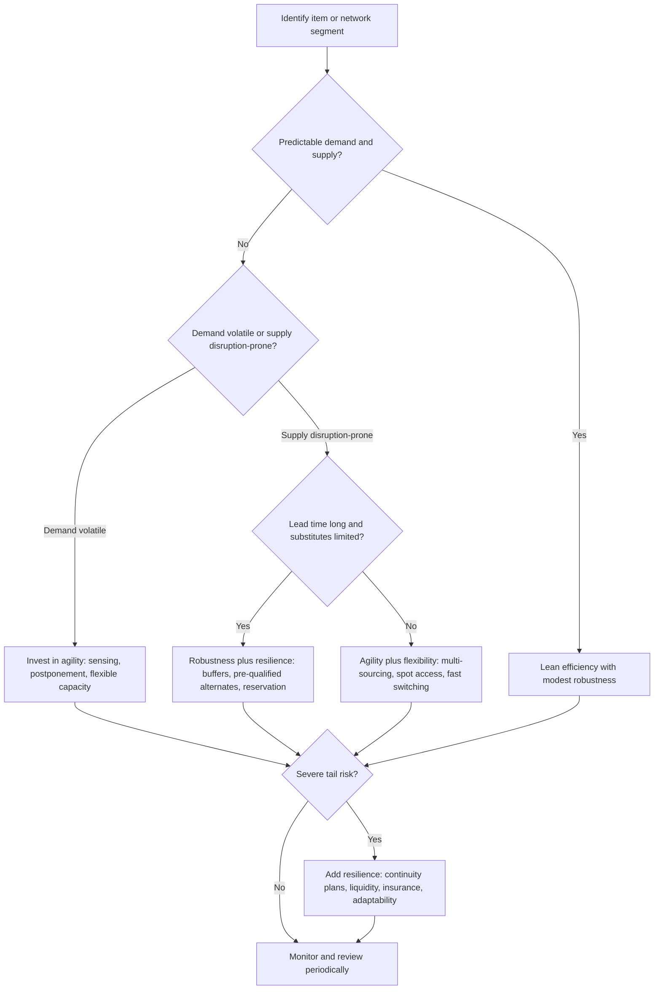
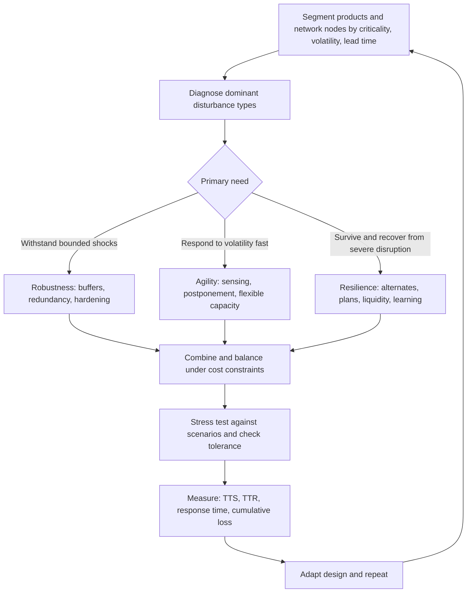

## Resilience versus Robustness versus Agility


### Overview

**Resilience**, **robustness**, and **agility** are three related but distinct capabilities that describe how a supply chain behaves under change, disturbance, and uncertainty. They are frequently used interchangeably in practice, which produces muddled strategy: organizations invest in buffers and call it "resilience," or invest in flexible sourcing and call it "agility," without a shared vocabulary for what each capability does, when it applies, and what it costs.

The distinctions can be summarized at a high level:

- **Robustness** is the ability to **withstand** disturbance and continue operating **without changing** structure or behavior. A robust supply chain absorbs the shock and stays on its existing course.
- **Resilience** is the ability to **anticipate, absorb, adapt to, and recover from** disruption, returning to the original state or moving to a new acceptable state within an acceptable time. It emphasizes **recovery and adaptation after** impact.
- **Agility** is the ability to **sense and respond quickly** to changes in demand, supply, or the environment, typically to exploit opportunity or avoid disruption. It emphasizes **speed and responsiveness** under both normal and abnormal variability.

A useful shorthand is: robustness **resists**, resilience **recovers and adapts**, and agility **responds fast**. Related concepts include **flexibility** (the range of options available), **adaptability** (structural change over the longer term), **antifragility** (improvement from stress), **redundancy** (spare capacity or duplicate resources), and **leanness** (waste minimization), each of which interacts with the three primary capabilities.

**Key Points**

- The three capabilities are **complementary but partially in tension**: for example, lean efficiency can reduce robustness, while heavy buffering can slow agility.
- **No single capability is universally best.** The right mix depends on the type of disturbance (frequency, severity, predictability), product characteristics, competitive priorities, and cost of capital.
- **Time is the discriminating dimension**: robustness operates *during* the shock, resilience *across the shock-and-recovery timeline*, and agility mostly *before, during, and after* through detection and reconfiguration speed.
- Definitions vary across academic literature, standards bodies, and industry practice; readers should **state the definition in use** when setting goals or metrics.
- Quantitative measurement is possible for each capability but rests on modeling assumptions; results should be interpreted as decision aids rather than precise predictions.

---

### 1. Conceptual Foundations

#### 1.1 Definitions

| Term | Working Definition | Emphasis |
| --- | --- | --- |
| Robustness | Capacity of the supply chain to maintain function and performance despite disturbance, without significant change in structure or operating mode | Resistance; stability; "bend but do not break" |
| Resilience | Capacity to anticipate, prepare for, respond to, recover from, and adapt to disruption, restoring acceptable performance within acceptable time | Recovery; adaptation; time-to-recover |
| Agility | Capacity to detect changes and respond rapidly and flexibly in a cost-effective way | Speed; responsiveness; sensing |
| Flexibility | Range and ease of alternative actions available (volume, mix, routing, sourcing) | Options and switching cost |
| Adaptability | Ability to modify structure, strategy, or design over the medium to long term in response to shifts in environment | Structural change |
| Redundancy | Duplicate or spare capacity, inventory, or paths held in reserve | Slack; buffer |
| Antifragility | Tendency to gain from volatility, stress, and disorder (concept popularized by Nassim Taleb) | Learning and improvement from shocks |
| Leanness | Elimination of waste to maximize efficiency with minimal buffers | Efficiency; low slack |
| Vulnerability | Susceptibility to loss from a disturbance | Exposure |
| Survivability | Ability to remain viable (not fail permanently) after severe disruption | Persistence |
| Absorptive / adaptive / restorative capacity | Components of resilience: absorbing impact, adjusting operations, and restoring function | Resilience sub-capabilities |

Definitions have been debated extensively in the operations and supply chain literature; some authors treat robustness as a component or antecedent of resilience, and others treat agility as a distinct paradigm oriented to demand volatility rather than to disruption [Inference: the boundaries between these terms are contested and usage varies by author and discipline].

#### 1.2 The Performance-Time Curve

The distinction is clearest on a performance-versus-time plot for a disruption event.


In quantitative form, let $P(t)$ be normalized performance (for example, service level or throughput as a fraction of baseline, with baseline $P_0 = 1$). A disruption begins at time $t_0$:

- **Robustness** relates to the **depth** of the drop: the minimum performance $P_{\min}$ reached, or equivalently the **magnitude of loss**.
- **Agility** relates to the **speed of detection and response**, which shortens the interval between $t_0$ and the start of recovery actions and steepens the recovery slope.
- **Resilience** relates to the **entire trajectory**: the depth of the drop, the duration below acceptable performance, the recovery rate, and the level to which performance returns.

A commonly used integral measure of resilience loss (the "resilience triangle" concept) is:

$$\text{Resilience Loss} = \int_{t_0}^{t_1} \left[ P_0 - P(t) \right] dt$$

where $t_1$ is the time at which performance is restored (or the end of the evaluation horizon). A related normalized resilience index is:

$$R = \frac{1}{T} \int_{t_0}^{t_0 + T} \frac{P(t)}{P_0}\, dt$$

with $R \in [0, 1]$ over an evaluation window $T$; higher values indicate better resilience (less cumulative loss). These are modeling conventions, not universal standards.

#### 1.3 Illustrative Trajectory Comparison

Consider three supply chains hit by the same 4-week supplier outage. Performance is normalized to 1.0 at baseline.

| Supply Chain Profile | Depth of Drop ($P_{\min}$) | Time Below 90% of Baseline | Recovery Shape |
| --- | --- | --- | --- |
| High robustness, low agility | 0.90 (small drop due to buffers) | 0 weeks (stays at or above 90%) until buffers exhaust, then drops sharply | Sudden cliff if buffers run out |
| High agility, low robustness | 0.50 (large drop, no buffers) | 2 weeks (quick rerouting after detection) | Fast recovery slope |
| Balanced resilience | 0.75 (moderate drop) | 1.5 weeks | Moderate, reliable recovery to baseline |

Each profile emphasizes a different attribute; none dominates across all criteria, which is why measurement should reflect the objective (minimize worst-case depth, minimize recovery time, or minimize cumulative loss).

#### 1.4 Signature Contrast Table

| Dimension | Robustness | Resilience | Agility |
| --- | --- | --- | --- |
| Central question | "Can we withstand this without changing?" | "Can we recover and adapt after this?" | "Can we respond fast to change?" |
| Primary time focus | During the disturbance | Whole cycle: before, during, after | Detection-to-response interval |
| Typical mechanisms | Buffers, redundancy, overdesign, safety margins, hardening | Contingency plans, alternate sourcing, recovery capacity, learning | Sensing, visibility, postponement, modularity, fast decision cycles |
| Change to structure | Little or none | May adapt structure | Continual reconfiguration |
| Typical cost profile | Standing cost (holding, capacity) | Mix of standing and activation costs | Investment in information, flexibility, and decision speed |
| Vulnerability if over-emphasized | Rigidity; cliff-edge failure beyond design envelope; cost | Slower response if over-planned; false confidence | Fragility to severe shocks without buffers; coordination overhead |
| Best suited for | Predictable, bounded disturbances | Severe, uncertain, or novel disruptions | High demand volatility, short product cycles, opportunity capture |
| Typical metric | Depth of loss; maximum tolerable disturbance; safety margin | Time-to-recover, cumulative loss, recovery rate | Response time, lead-time compression, forecast-to-action latency |

---

### 2. Robustness in Depth

#### 2.1 Concept and Mechanisms

Robustness is analogous to structural engineering: design the system so that ordinary and even extreme loads do not cause failure. In supply chains, robustness is achieved by **absorbing** variation using margins and by **preventing propagation**.

| Mechanism | Description | Example |
| --- | --- | --- |
| Safety stock and strategic buffers | Inventory that covers variability or short outages | Holding weeks of critical components |
| Capacity headroom | Spare production or logistics capacity | Running plants below full utilization |
| Redundant suppliers and routes | Duplicate sources or paths in place | Two qualified suppliers with active allocation |
| Design margins and overspecification | Components rated above nominal requirements | Higher-rated parts tolerant of variation |
| Diversification | Reducing dependence on any one node or region | Multi-region sourcing |
| Hardening and protection | Physical and cyber protection of key assets | Flood defenses, segmented networks, backup power |
| Long-term contracts and capacity reservation | Contractual assurance of supply | Take-or-pay agreements |
| Quality and reliability engineering | Reduce failure likelihood at source | Preventive maintenance, supplier quality programs |

#### 2.2 Robustness Metrics

| Metric | Definition | Use |
| --- | --- | --- |
| Time-to-Survive (TTS) | Duration operations continue at acceptable levels after loss of a node | Buffer adequacy |
| Depth of performance loss | $1 - P_{\min}/P_0$ | Severity of impact |
| Service-level maintenance under stress | Fill rate during a defined disturbance | Customer-facing robustness |
| Maximum tolerable disturbance (design envelope) | Largest shock magnitude (duration, capacity loss) that still meets service targets | Boundary of protection |
| Safety margin ratio | $\dfrac{\text{Capacity or Buffer}}{\text{Expected Peak Requirement}}$ | Design headroom |
| Network robustness (graph) | Fraction of demand still served after removal of $k$ nodes | Structural resilience to failure |

**Example (buffer-based robustness)**

A plant consumes 500 units per day of a critical component. It holds 6,000 units of buffer.

$$\text{TTS} = \frac{6{,}000}{500} = 12 \text{ days}$$

A supplier outage lasting 9 days produces no shortfall; the system is robust to that disturbance. A 20-day outage exceeds the buffer by 8 days, causing $8 \times 500 = 4{,}000$ units of unmet demand.

**Output**

The system is robust for outages up to 12 days and non-robust beyond. The buffer defines a **design envelope**; performance beyond it degrades abruptly (the "cliff edge"), which is the characteristic weakness of purely robust designs.

#### 2.3 Limits of Robustness

- **Envelope dependence:** protection covers only disturbances within the design assumptions; novel or larger shocks may exceed it.
- **Cost of standing slack:** inventory, capacity, and redundancy carry ongoing costs (working capital, storage, obsolescence, underutilization).
- **Rigidity and inertia:** heavy investment in a fixed configuration can slow adaptation and lock in outdated assumptions.
- **False confidence:** apparent redundancy may share a hidden common cause (for example, two suppliers relying on the same upstream source).
- **Diminishing returns:** each additional unit of buffer or redundancy yields less protection.
- **Complacency and moral hazard:** buffers can mask upstream deterioration until exhausted.

---

### 3. Resilience in Depth

#### 3.1 Concept and Lifecycle

Resilience integrates preparedness with response and recovery, and includes learning. A widely used decomposition is the four-stage cycle **anticipate/prepare, absorb, recover, adapt**.



Resilience thus **contains** elements of robustness (absorb), agility (respond), and adaptability (adapt). This is one reason many frameworks treat resilience as the umbrella concept.

#### 3.2 Resilience Capabilities

| Capability | Description | Examples |
| --- | --- | --- |
| Visibility | Seeing network state, dependencies, and risks | Multi-tier mapping, event monitoring |
| Redundancy | Spare resources ready to use | Safety stock, warm alternate suppliers |
| Flexibility | Ability to switch sources, routes, products, or plants | Multi-sourcing, common components, flexible manufacturing |
| Collaboration | Coordinated response with partners | Joint planning, information sharing, mutual aid |
| Velocity | Speed of response and recovery | Pre-approved authority, expedited logistics |
| Financial strength | Capacity to fund response and recovery | Liquidity reserves, insurance |
| Governance and culture | Clear roles, decision rights, learning orientation | Crisis teams, exercises, post-incident reviews |
| Learning | Converting events into improvements | After-action reviews, model updating |

#### 3.3 Resilience Metrics

| Metric | Definition |
| --- | --- |
| Time-to-Recover (TTR) | Time for a node or the network to return to acceptable function |
| Exposure gap | $\text{TTR} - \text{TTS}$; the period during which operations are unprotected by buffers |
| Cumulative performance loss | Area between baseline and actual performance over the event |
| Recovery rate | Slope of performance restoration, for example percentage points per week |
| Time to full recovery / time to acceptable recovery | Time to reach 100% or a defined threshold, such as 95% of baseline |
| Resilience index | Normalized integral of performance over a window (see Section 1.2) |
| Recovery cost | Total incremental cost of response and restoration |
| Survivability probability | Probability the network remains viable after a defined shock |

**Example (resilience index computation)**

Weekly normalized performance over an 8-week window following a disruption is:

| Week | 1 | 2 | 3 | 4 | 5 | 6 | 7 | 8 |
| --- | --- | --- | --- | --- | --- | --- | --- | --- |
| $P(t)$ | 0.60 | 0.55 | 0.65 | 0.75 | 0.85 | 0.92 | 0.97 | 1.00 |

$$R = \frac{1}{8} \sum_{t=1}^{8} P(t) = \frac{0.60 + 0.55 + 0.65 + 0.75 + 0.85 + 0.92 + 0.97 + 1.00}{8} = \frac{6.29}{8} \approx 0.786$$


$$\text{Cumulative Loss} = \sum_{t=1}^{8} (1 - P(t)) = 8 - 6.29 = 1.71 \text{ week-equivalents of lost output}$$

**Output**

The resilience index over the window is about 0.79, corresponding to about 1.71 weeks of lost output. Compare alternative response strategies by re-computing $R$ under each modeled trajectory. The result depends on the evaluation window and the discretization.

#### 3.4 Resilience Trade-Offs and Limits

- **Preparedness cost vs. expected benefit:** investments pay off only if disruptions occur and are appropriately handled [Inference: rare-event probabilities are highly uncertain].
- **Over-planning:** highly detailed plans can become brittle if reality deviates from scenarios.
- **Recovery constraints:** some recoveries are physically or legally slow (requalification, permitting, specialized equipment).
- **Correlated events:** shared dependencies can defeat redundancy.
- **Definition drift:** returning to the *original* state may be undesirable if the environment has changed; "bounce forward" (adapting to a better state) may be preferable.

---

### 4. Agility in Depth

#### 4.1 Concept and Origins

Agility, as a supply chain concept, was popularized in the 1990s through work on **agile manufacturing** and later "agile supply chains," particularly for **volatile, unpredictable demand** and short product life cycles. Its emphasis is on **market sensitivity, speed, and flexibility**, and it is often contrasted with leanness (efficiency in stable, predictable settings).

Common characteristics attributed to agile supply chains include:

- **Market sensitivity:** capability to read and respond to real demand signals.
- **Virtual integration:** information-based coordination among partners.
- **Process integration:** joint processes and shared planning.
- **Network-based structure:** flexible partnerships that can be reconfigured.

The specific framing and lists of characteristics differ across authors; verify against primary sources when citing.

#### 4.2 Agility Mechanisms

| Mechanism | Description | Example |
| --- | --- | --- |
| Demand sensing | Using near-real-time signals (point-of-sale, orders, external data) to detect shifts early | Short-horizon forecasting with fresh data |
| End-to-end visibility | Transparency of inventory, orders, and shipments | Control towers, shared platforms |
| Postponement | Delay product differentiation until demand is known | Final configuration, labeling, or packaging near customer |
| Modular design | Standard modules combinable into varied products | Platform architectures |
| Flexible capacity | Ability to shift volume or mix quickly | Cross-trained labor, multi-purpose lines |
| Quick-response sourcing | Nearshore or local capacity with short lead times | Regional production for fast-turn items |
| Short planning cycles | Frequent re-planning and decision cadence | Weekly or daily S&OP adjustments |
| Empowered decision-making | Decentralized authority within guardrails | Pre-delegated spending limits |
| Collaborative partnerships | Rapid coordination with suppliers and logistics providers | Shared dashboards, joint teams |
| Dynamic routing and allocation | Reassign inventory and shipments as conditions change | Inventory pooling, expediting |

#### 4.3 Agility Metrics

| Metric | Definition |
| --- | --- |
| Response time | Time from detecting a change to executing an effective action |
| Order-to-delivery lead time and variability | Speed and predictability of fulfillment |
| Forecast-to-action latency | Delay between signal and planning change |
| Time-to-reconfigure | Time to shift sourcing, production mix, or routing |
| Volume and mix flexibility | Percentage change in volume or mix achievable within a given time at acceptable cost |
| Changeover time | Time to switch production between products |
| New-product introduction speed | Time-to-market |
| Demand-signal capture rate | Share of decisions using recent demand data |
| Cost of flexibility | Incremental cost per unit of flexibility exercised |

**Example (response-time value)**

A demand surge of 30% begins on day 0. Supply can be increased by expediting, which takes effect after a decision-and-execution delay $d$. Unmet demand accrues each day at 500 units until the response takes effect.

| Response delay $d$ | Unmet demand |
| --- | --- |
| 2 days | $2 \times 500 = 1{,}000$ units |
| 7 days | $7 \times 500 = 3{,}500$ units |
| 14 days | $14 \times 500 = 7{,}000$ units |

$$\text{Unmet Demand} = d \times r$$

where $r$ is the daily shortfall rate.

**Output**

Cutting response delay from 14 days to 2 days reduces unmet demand from 7,000 to 1,000 units, an 86% reduction, without adding any buffer. This illustrates agility as **speed substituting for inventory**, a key trade-off relative to robustness.

#### 4.4 Limits of Agility

- **Depends on information quality:** poor visibility or noisy signals produce fast but wrong responses (overreaction, bullwhip amplification).
- **Requires actual flexibility:** speed without available options (alternate sources, spare capacity) cannot resolve a physical shortage.
- **Vulnerability to severe shocks:** without buffers, agile systems may still suffer deep drops before responses take effect.
- **Coordination overhead and instability:** frequent re-planning can create nervousness in schedules and supplier relations.
- **Cost:** investments in technology, cross-training, and flexible contracts are ongoing.

---

### 5. Relationships and Interactions

#### 5.1 Conceptual Relationships

There are several ways the literature positions the three concepts:

| Perspective | Description |
| --- | --- |
| Resilience as umbrella | Robustness (resist), agility (respond), and adaptability (change) are components of resilience |
| Sequential / temporal | Robustness acts first (absorb), agility next (respond), resilience closes the loop (recover and learn) |
| Distinct paradigms | Robustness for stable, bounded shocks; agility for demand volatility; resilience for severe disruptions |
| Trade-off view | Efficiency, robustness, and agility compete for finite resources |

Each perspective is valid for particular purposes; clarity comes from stating which is being used.

#### 5.2 Interaction Matrix

| Combination | Synergy | Tension |
| --- | --- | --- |
| Robustness + Agility | Buffers buy time for agile response to take effect; buffers can be smaller if response is fast | Large buffers may reduce urgency to invest in speed; buffers hold stale stock that reduces flexibility |
| Robustness + Resilience | Robust design limits initial damage, easing recovery | Over-investment in robustness may divert funds from recovery capability; cliff-edge failures |
| Agility + Resilience | Fast detection and reconfiguration shorten disruption; agility supports adaptation | Agility alone does not supply capacity when supply is physically short |
| Efficiency (lean) + Robustness | Low waste leaves resources for targeted buffers | Lean minimizes slack, reducing absorptive capacity |
| Efficiency (lean) + Agility | Lean processes can be fast and standardized | Lean, tightly optimized processes can be inflexible |
| Efficiency + Resilience | Efficient recovery processes reduce cost | Resilience investments look like waste in stable periods |

#### 5.3 The Efficiency-Robustness-Agility Trade-Off



Resources are finite; strategies typically combine capabilities at different points in the network (for example, robust buffers at long-lead single-source parts, agile response for short-lead, high-variability items).

#### 5.4 Substitution Between Buffers and Speed

A simple analytical illustration: the buffer needed to bridge a disruption is roughly proportional to **how long the system is exposed** before an effective response begins.

$$\text{Required Buffer} \approx d_{\text{daily}} \times (T_{\text{detect}} + T_{\text{respond}} + T_{\text{ramp}})$$

where $d_{\text{daily}}$ is daily demand, $T_{\text{detect}}$ is detection time, $T_{\text{respond}}$ is decision-and-execution time, and $T_{\text{ramp}}$ is the time for the alternate source or action to reach useful volume.

**Example**

Daily demand is 800 units.

| Configuration | $T_{\text{detect}}$ | $T_{\text{respond}}$ | $T_{\text{ramp}}$ | Total exposure (days) | Required buffer (units) |
| --- | --- | --- | --- | --- | --- |
| Low agility (weak visibility, slow decisions) | 5 | 7 | 14 | 26 | $800 \times 26 = 20{,}800$ |
| High agility (control tower, pre-authorized actions) | 1 | 1 | 14 | 16 | $800 \times 16 = 12{,}800$ |

$$\text{Buffer Reduction} = 20{,}800 - 12{,}800 = 8{,}000 \text{ units (38\% smaller)}$$

**Output**

Faster sensing and decision-making reduce the buffer needed by 8,000 units. With unit holding cost of $3 per unit per year, the recurring saving is $24,000 per year; if the visibility and authority program costs less than that annually (and delivers other benefits), agility is economically substituting for robustness. The unit ramp time $T_{\text{ramp}}$ is unchanged, showing that agility cannot eliminate physical lead times, which is why buffers or pre-qualified alternates remain necessary.

---

### 6. Matching Capability to Context

Different environments call for different emphases.

#### 6.1 Contingency Framework

| Context Characteristic | Emphasize | Rationale |
| --- | --- | --- |
| Stable, predictable demand; low-value, low-variety products | Efficiency (lean), moderate robustness | Predictability makes leanness effective; modest buffers suffice |
| Volatile demand; short life cycles; fashion or consumer electronics | Agility | Cost of stock-outs and obsolescence favors speed and postponement |
| Long lead times; single-source critical inputs; high consequences of stock-out | Robustness plus resilience (buffers, pre-qualified alternates) | Physical lead times cannot be shortened by agility alone |
| Severe, low-probability, high-impact disruption risk | Resilience (recovery capability, diversification, liquidity) | Robust envelope cannot cover all extremes |
| Highly regulated or safety-critical (medical, aerospace) | Robustness and resilience, with controlled agility | Qualification burdens limit switching speed; consequences of failure are high |
| Perishable goods with short shelf life | Agility, localization | Buffers spoil; speed and proximity matter |
| Commodity inputs with liquid markets | Agility (spot sourcing) and financial hedging | Alternative sources are readily available |

#### 6.2 Product-Level Segmentation (Fisher-Style Reasoning)

A commonly cited framework matches supply chain type to product characteristics: **functional products** with predictable demand suit efficient (physically efficient) supply chains, while **innovative products** with unpredictable demand suit responsive supply chains. Later work added risk-hedging and combined types. Applying this segmentation within a single company often yields a **portfolio**: different SKUs or product families receive different capability mixes.

| Segment | Example Profile | Capability Emphasis |
| --- | --- | --- |
| Stable, high-volume, long-life | Standard components | Efficiency and moderate robustness; strategic stock at chokepoints |
| Volatile, short-life | Seasonal or trend items | Agility, postponement, flexible capacity |
| Critical, sole-source, long lead | Custom chips, specialized materials | Robustness (buffers), resilience (alternate qualification, capacity reservation) |
| Regulated critical | Medical device parts | Robustness plus resilience; formal continuity; controlled agility |
| Commodity | Standard materials | Agility through multi-sourcing and market access |

#### 6.3 Disturbance-Type Mapping

| Disturbance Type | Frequency / Severity | Best Primary Capability |
| --- | --- | --- |
| Routine variability (demand noise, lead-time fluctuation) | High frequency, low severity | Robustness (safety stock) and agility (fast replenishment) |
| Moderate disruptions (short supplier delays, port congestion) | Medium | Agility and flexibility, moderate buffers |
| Severe localized disruption (plant fire, insolvency) | Low frequency, high severity | Resilience: alternates, capacity reservation, recovery plans |
| Systemic shocks (pandemic, major geopolitical event, regional disaster) | Very low frequency, very high severity | Resilience, financial strength, and adaptability; robust envelope insufficient |
| Structural change (regulation, technology shift, shifting trade patterns) | Persistent | Adaptability and strategic reconfiguration |
| Opportunity events (sudden demand upside) | Variable | Agility |

#### 6.4 Decision Flow



---

### 7. Quantitative Modeling and Comparison

#### 7.1 Simulating Three Strategies Against a Disruption

The following Python simulation compares three archetypes over repeated random disruptions using a simple inventory model:

- **Robust strategy:** large buffer, slow response.
- **Agile strategy:** small buffer, fast response.
- **Resilient (balanced) strategy:** moderate buffer, moderate response, and an alternate source that ramps after activation.

**Example (Python)**

```python
import numpy as np

rng = np.random.default_rng(2025)

def simulate(strategy, n_runs=20_000, horizon=120, daily_demand=100,
             p_disrupt=0.03, margin_per_unit=50, seed=None):
    """Return distribution of total profit loss over the horizon.
    Disruptions: at most one per run for clarity; duration lognormal.
    """
    local = np.random.default_rng(seed) if seed is not None else rng
    losses = np.zeros(n_runs)
    holding_cost_per_unit_day = strategy["hold_cost"]

    for i in range(n_runs):
        occurs = local.random() < p_disrupt * (horizon / 30)  # scaled to horizon
        inventory = strategy["buffer"]
        unmet = 0.0
        carrying = 0.0

        if occurs:
            start = int(local.integers(10, horizon - 30))
            duration = int(np.clip(local.lognormal(np.log(25), 0.5), 5, 80))
            detect = strategy["detect_days"]
            respond_start = start + detect + strategy["respond_days"]
        else:
            start = duration = respond_start = None

        for day in range(horizon):
            supply = daily_demand  # baseline replenishment matches demand
            if occurs and start <= day < start + duration:
                supply = 0
                # Alternate/expedite capacity after response delay
                if day >= respond_start:
                    supply = daily_demand * strategy["alt_capacity_share"]
            net = supply - daily_demand
            inventory += net
            if inventory < 0:
                unmet += -inventory
                inventory = 0
            carrying += inventory * holding_cost_per_unit_day

        losses[i] = unmet * margin_per_unit + carrying
    return losses

strategies = {
    "Robust (large buffer, slow response)": dict(
        buffer=2400, detect_days=5, respond_days=8, alt_capacity_share=0.30, hold_cost=0.15),
    "Agile (small buffer, fast response)": dict(
        buffer=300, detect_days=1, respond_days=1, alt_capacity_share=0.50, hold_cost=0.15),
    "Resilient (balanced buffer, fast-ish response, alternate)": dict(
        buffer=1200, detect_days=2, respond_days=3, alt_capacity_share=0.60, hold_cost=0.15),
}

print(f"{'Strategy':58s} {'Mean':>10s} {'P95':>10s} {'P99':>10s}")
for name, s in strategies.items():
    L = simulate(s, seed=7)
    print(f"{name:58s} {L.mean():10,.0f} {np.percentile(L,95):10,.0f} {np.percentile(L,99):10,.0f}")
```

**Output**

The script prints the mean, 95th, and 99th percentile total loss (unmet-demand margin loss plus inventory carrying cost) for each strategy. Typically, the results show a pattern like: the robust strategy has higher carrying cost but lower tail loss for moderate outages; the agile strategy has low carrying cost but higher tail loss in severe outages because of thin buffers; and the balanced resilient strategy tends to reduce the tail relative to agile while costing less than the heavily buffered robust option. The precise ranking depends on parameter choices (disruption probability, duration distribution, buffer size, response times, alternate capacity, margin, and holding cost), and the model is deliberately simplified (single disruption, deterministic demand, and fixed response parameters). Behavior may vary with the seed and assumptions, and the results should not be treated as predictions.

#### 7.2 Graph-Based Robustness of a Network

For structural robustness, model the network as a graph and measure the fraction of demand still served after node removal.

**Example (Python, NetworkX)**

```python
import networkx as nx
import itertools

G = nx.DiGraph()
# Sources -> Suppliers -> Plants -> Customers
G.add_edges_from([
    ("Src1", "SupA"), ("Src1", "SupB"), ("Src2", "SupB"), ("Src2", "SupC"),
    ("SupA", "Plant1"), ("SupB", "Plant1"), ("SupB", "Plant2"), ("SupC", "Plant2"),
    ("Plant1", "Cust"), ("Plant2", "Cust"),
])
for e in G.edges:
    G.edges[e]["capacity"] = 100

# Add super-sink demand of 200 through Cust
G.add_edge("Cust", "SINK", capacity=200)
# Add super-source
for s in ("Src1", "Src2"):
    G.add_edge("SRC", s, capacity=200)

def max_served(graph):
    val, _ = nx.maximum_flow(graph, "SRC", "SINK")
    return val

baseline = max_served(G)

def robustness_k(k, candidates):
    worst = baseline
    for nodes in itertools.combinations(candidates, k):
        H = G.copy()
        H.remove_nodes_from(nodes)
        try:
            served = max_served(H)
        except nx.NetworkXError:
            served = 0
        worst = min(worst, served)
    return worst / baseline

candidates = ["Src1", "Src2", "SupA", "SupB", "SupC", "Plant1", "Plant2"]
for k in (1, 2):
    print(f"Worst-case fraction of demand served after removing {k} node(s): {robustness_k(k, candidates):.2f}")
```

**Output**

The script computes the baseline maximum flow and then the worst-case fraction of demand still served after removing any $k$ nodes among the listed candidates. In this small network, single-node removal reduces service only partially because of parallel paths (for example, removing `Plant1` leaves `Plant2` to serve some demand), while removing two nodes can cut service sharply (for example, removing both plants). This "worst-case fraction served" is a structural **robustness** measure; it does not capture recovery speed (resilience) or response time (agility). The graph is illustrative and capacities are assumptions.

#### 7.3 Multi-Criteria Comparison

Because the three capabilities trade off, organizations often use a weighted multi-criteria score to compare strategies:

$$\text{Score}_s = w_R\, r_s + w_A\, a_s + w_C\, (1 - c_s)$$

where $r_s$ is a resilience/robustness score, $a_s$ an agility score, $c_s$ normalized cost (so $1 - c_s$ rewards lower cost), and weights sum to 1. Weights and scoring scales are subjective and should be documented and stress-tested through sensitivity analysis.

| Strategy | Robustness/Resilience Score | Agility Score | Normalized Cost | Score ($w_R = 0.45, w_A = 0.30, w_C = 0.25$) |
| --- | --- | --- | --- | --- |
| S1: Heavy buffer | 0.85 | 0.30 | 0.80 | $0.45(0.85) + 0.30(0.30) + 0.25(0.20) = 0.3825 + 0.09 + 0.05 = 0.5225$ |
| S2: Agile lean | 0.40 | 0.90 | 0.35 | $0.45(0.40) + 0.30(0.90) + 0.25(0.65) = 0.18 + 0.27 + 0.1625 = 0.6125$ |
| S3: Balanced | 0.70 | 0.65 | 0.55 | $0.45(0.70) + 0.30(0.65) + 0.25(0.45) = 0.315 + 0.195 + 0.1125 = 0.6225$ |

**Output**

The balanced strategy S3 scores highest (0.6225), narrowly above S2 (0.6125). The near-tie signals that the ranking is **sensitive to weights**: raising the robustness weight favors S1 or S3, while raising the agility weight favors S2. This is why sensitivity analysis and stress testing against specific scenarios should accompany scoring.

---

### 8. Design Levers by Capability

#### 8.1 Lever Catalog

| Lever | Robustness | Resilience | Agility | Notes |
| --- | --- | --- | --- | --- |
| Safety stock / strategic buffer | Strong | Supports (time to respond) | Weak or negative (stale stock) | Positioning matters (upstream vs. downstream) |
| Capacity headroom | Strong | Supports | Supports | Costly if idle |
| Dual/multi-sourcing | Strong | Strong | Supports (switch speed) | Must be independent; qualification needed |
| Pre-qualified warm alternates | Supports | Strong | Supports | Shortens time-to-recover |
| Geographic diversification | Strong | Strong | Neutral | Guard against common-cause events |
| Nearshoring / regional footprint | Supports | Supports | Strong (short lead time) | May raise unit cost |
| Postponement / modularity | Neutral | Supports | Strong | Design-for-flexibility |
| Common parts / design standardization | Supports | Strong | Strong | Broadens substitution options |
| Demand sensing and visibility | Neutral | Supports | Strong | Depends on data quality |
| Control tower / event monitoring | Neutral | Strong | Strong | Reduces detection time |
| Pre-delegated decision authority | Neutral | Strong | Strong | Reduces response delay |
| Flexible contracts (options, capacity reservation) | Supports | Strong | Strong | Real-options logic |
| Cross-training and flexible labor | Supports | Supports | Strong |  |
| Business continuity and crisis management | Neutral | Strong | Supports | Structured response |
| Financial liquidity and insurance | Neutral | Strong | Supports | Absorbs residual loss |
| Supplier development and collaboration | Supports | Strong | Supports | Improves reliability and recovery |
| Lean process discipline | Negative (less slack) | Mixed | Supports (standard work) | Balance with targeted buffers |
| Redundant IT systems / cyber hardening | Strong | Strong | Supports | Digital equivalents of buffers |

#### 8.2 Real-Options Perspective on Flexibility

Many agility and resilience investments behave like **options**: a modest premium (a retainer, a qualification cost, a capacity reservation fee) secures the right, but not the obligation, to act later. The value of an option increases with uncertainty and with the payoff when exercised.

$$\text{Option Value} \approx E\left[\max\left(0,\ \text{Payoff}_{\text{exercise}} - \text{Cost}_{\text{exercise}}\right)\right] - \text{Premium}$$

**Example**

A firm pays $200,000 per year for a capacity-reservation option covering 30% of demand from an alternate supplier. In a disruption (annual probability 4%), the option prevents $12M in lost margin and costs $1.5M in premium pricing to exercise.

$$\text{Expected Exercise Payoff} = 0.04 \times (12{,}000{,}000 - 1{,}500{,}000) = 0.04 \times 10{,}500{,}000 = \$420{,}000$$


$$\text{Net Option Value} = 420{,}000 - 200{,}000 = \$220{,}000 \text{ per year}$$

**Output**

The option has a positive expected net value of about $220,000 per year under these assumptions, and it also reduces tail exposure. The 4% probability is highly uncertain, so decision-makers commonly evaluate the tail-loss reduction alongside the expected value.

---

### 9. Measurement Frameworks and Dashboards

#### 9.1 Balanced Scorecard for the Three Capabilities

| Dimension | Metric | Definition | Direction |
| --- | --- | --- | --- |
| Robustness | Time-to-Survive coverage | % of critical items where TTS meets or exceeds target | Higher |
| Robustness | Depth of loss under standard stress scenarios | Modeled percent performance drop | Lower |
| Robustness | Single-source share of critical spend | % of critical spend with one qualified source | Lower |
| Resilience | Exposure gap | Critical items with TTR > TTS (count and margin) | Lower |
| Resilience | Time-to-recover | Median modeled or observed time to acceptable performance | Lower |
| Resilience | Alternate qualification coverage | % of critical parts with a qualified, capacity-verified alternate | Higher |
| Resilience | Exercise coverage | % of critical plans exercised in the last 12 months | Higher |
| Agility | Detection-to-decision time | Median time from signal to decision | Lower |
| Agility | Lead-time compression | Ratio of actual to baseline order-to-delivery lead time | Lower |
| Agility | Flexibility range | % volume or mix swing achievable within a set number of days | Higher |
| Agility | Visibility coverage | % of critical flows with near-real-time tracking | Higher |
| Cross-cutting | Total cost of resilience | Standing and activation cost as a share of revenue | Monitored |
| Cross-cutting | Service level under stress | Fill rate during actual or simulated disruption | Higher |

#### 9.2 Assessment Maturity Model (Illustrative)

| Level | Robustness | Resilience | Agility |
| --- | --- | --- | --- |
| 1: Ad hoc | Buffers set by habit; no analysis | Reactive response; no plans | Slow, manual, siloed decisions |
| 2: Defined | Buffers based on variability analysis for key items | Basic continuity plans; some alternates | Regular planning cycles; limited visibility |
| 3: Managed | Buffers linked to TTR/TTS and criticality | Tested plans; qualified alternates for critical parts | Demand sensing; event monitoring; defined decision rights |
| 4: Quantified | Stress-tested buffers and structural robustness metrics | Scenario-based recovery metrics; integrated with finance and insurance | Measured response times; flexible contracts and capacity |
| 5: Optimizing | Continuous rebalancing of buffers via simulation | Continuous learning; adaptive redesign | Automated sensing and decision support with human oversight |

Maturity models are heuristic tools; levels and criteria differ across frameworks.

---

### 10. Organizational and Governance Aspects

#### 10.1 Balancing Competing Objectives

Functions often optimize different capabilities: finance favors low inventory (efficiency), operations favors buffers (robustness), sales favors responsiveness (agility), and risk favors recoverability (resilience). Alignment mechanisms include:

- **Shared scenarios and tolerance statements** so tradeoffs are evaluated against agreed impact thresholds.
- **Total cost of resilience/risk** accounting that includes expected disruption losses, not only holding cost.
- **Segmented policies** by product, customer, and criticality rather than uniform rules.
- **Clear ownership** of critical dependencies and decision rights during disruption.
- **Incentives** that reward preparedness and speed of response, not only quarterly cost and inventory turns.

#### 10.2 Culture and Learning

Resilience and agility depend on organizational behavior: psychological safety to escalate bad news early, rehearsed decision-making, cross-functional collaboration, and structured after-action learning. Highly rigid hierarchies can slow response, while excessive decentralization can produce inconsistent decisions; pre-delegated authority within guardrails is a common compromise.

---

### 11. Case-Style Illustrations

The following illustrations are simplified composites for teaching purposes; they are not accounts of specific companies.

#### 11.1 Robustness Without Agility: The Cliff Edge

A manufacturer of industrial pumps holds 10 weeks of critical castings stock and uses a single foundry. A regional flood halts the foundry for 16 weeks. Buffers cover 10 weeks; the remaining 6 weeks cause stock-outs. Because detection was slow, alternate qualification began only after the outage was confirmed, requiring 20 weeks.

- **Observation:** robustness delayed impact but the design envelope was exceeded; lack of agility (slow detection and qualification) extended exposure.
- **Lesson:** buffers should be paired with pre-qualified alternates and fast decision processes.

#### 11.2 Agility Without Buffers: Fast but Thin

A consumer-electronics assembler uses just-in-time delivery and highly responsive planning. A port strike delays inbound components by 3 weeks. The firm reroutes some shipments by air within days, but air capacity is scarce and costs spike; production is still disrupted for two weeks.

- **Observation:** agility limited the damage but could not eliminate physical constraints; expedite costs were high.
- **Lesson:** agility depends on available options; strategic buffers at chokepoint parts can reduce reliance on scarce expedite capacity.

#### 11.3 Balanced Resilience

A medical-device firm holds moderate buffers on long-lead sensors, maintains a qualified second source at 25% allocation, monitors supplier events through a control tower, and runs annual exercises. When its primary sensor supplier suffers a fire, the firm detects the event within hours, shifts allocation within days, draws down buffers, and restores full supply in 10 weeks (versus 26 weeks for the primary supplier's restoration).

- **Observation:** robustness (buffer) bought time, agility (fast detection and decision) started the response early, and resilience (qualified alternate, rehearsed plan, financial capacity) closed the gap.
- **Lesson:** the capabilities work best in combination, allocated according to lead time, criticality, and cost.

---

### 12. Common Pitfalls

**Key Points**

- **Using the terms interchangeably:** leads to strategies that address the wrong problem (for example, buying speed when the constraint is physical capacity).
- **Equating buffers with resilience:** buffers provide time, not recovery; without plans, alternates, and finance, the cliff edge simply arrives later.
- **Equating speed with safety:** agility cannot overcome long qualification times or physical shortages.
- **Uniform policies across all products:** ignoring segmentation by criticality, volatility, and lead time.
- **Ignoring common-cause dependencies:** redundancy that shares a hidden upstream source provides false assurance.
- **Neglecting the cost side:** standing cost of robustness and flexibility must be weighed against expected and tail losses.
- **Over-optimizing for the last disruption:** designing for the most recent event rather than a broad scenario set.
- **Data-poor agility:** rapid responses based on inaccurate or delayed data can amplify volatility (bullwhip).
- **Unexercised plans:** resilience claims without testing are unvalidated.
- **Treating recovery as the return to the old state only:** sometimes adaptation to a new configuration is superior.
- **Measuring what is easy rather than what matters:** relying on inventory days or supplier count while ignoring TTR, response time, and dependency structure.
- **Weight sensitivity blindness:** trusting a single composite score without testing alternative weightings.
- **Misaligned incentives:** rewarding low inventory and cost without recognizing disruption exposure.

---

### 13. End-to-End Worked Example

**Context.** A consumer-appliance manufacturer (annual revenue $900M) evaluates its capability mix across three product families. Leadership wants a coherent strategy rather than a uniform policy.

| Family | Characteristics | Daily Margin at Risk | Key Input Profile |
| --- | --- | --- | --- |
| A: Core washers | Stable demand, 5-year life, standard parts | $600,000 | Multiple suppliers, short lead times |
| B: Smart controllers | Volatile demand, 9-month life, rapid design changes | $350,000 | Semiconductor sole source, 30-week lead time |
| C: Medical-grade sterilizers | Regulated, long life, high consequence | $250,000 | Custom sensor, sole-source, 40-week qualification |

**Step 1: Classify the dominant risk and required capability**

| Family | Dominant Risk | Primary Capability | Supporting Capability |
| --- | --- | --- | --- |
| A | Routine variability; cost pressure | Efficiency with modest robustness | Agility (replenishment speed) |
| B | Demand volatility and semiconductor supply shocks | Agility plus targeted robustness | Resilience (alternate design) |
| C | Sole-source failure with long recovery | Robustness plus resilience | Controlled agility (pre-qualified alternates) |

**Step 2: Quantify exposure**

Family C's sensor: TTR (fire scenario) 40 weeks; TTS 10 weeks.

$$\text{Exposure Gap} = 40 - 10 = 30 \text{ weeks} = 210 \text{ days}$$


$$\text{Loss} = 210 \times 250{,}000 = \$52{,}500{,}000$$

Family B's controller chip: TTR 26 weeks; TTS 12 weeks; gap 14 weeks (98 days).

$$\text{Loss} = 98 \times 350{,}000 = \$34{,}300{,}000$$

Family A: dual-sourced; worst-case gap 2 weeks (14 days).

$$\text{Loss} = 14 \times 600{,}000 = \$8{,}400{,}000$$

**Step 3: Select strategies by family**

| Family | Actions | Capability Contribution |
| --- | --- | --- |
| A | Maintain dual-sourcing; modest safety stock; weekly demand-sensing-driven replenishment; preserve lean process | Efficiency, light robustness, agility |
| B | Postponement of final firmware and packaging; second-source design variant qualified within 20 weeks; capacity reservation option; control tower on chip supply events; buffer of 16 weeks on the chip | Agility, robustness (buffer), resilience (alternate design) |
| C | Raise sensor buffer to 26 weeks; qualify second sensor source (starts now, 40-week clock); joint continuity plan with the supplier; contingent business interruption insurance; annual joint exercise | Robustness, resilience, insurance transfer |

**Step 4: Re-estimate exposure after actions (illustrative)**

- **B:** buffer raised from 12 to 16 weeks; alternate design supplies 40% of demand after 20 weeks. Uncovered period before the alternate: $26 - 16 = 10$ weeks (70 days), but the alternate covers 40% after week 20 (only 6 weeks remain after buffer exhaustion at week 16 and alternate at week 20, so weeks 16 to 20 have full loss and weeks 20 to 26 have 60% loss):

$$\text{Loss}_B = (4 \times 7 \times 350{,}000) + (6 \times 7 \times 0.60 \times 350{,}000) = 9{,}800{,}000 + 8{,}820{,}000 = \$18{,}620{,}000$$

(reduced from $34.3M)

- **C:** buffer raised to 26 weeks; gap becomes $40 - 26 = 14$ weeks (98 days) until the alternate sensor is qualified in 40 weeks (which does not help within the 40-week TTR in the fire scenario but reduces future exposure). Loss for the scenario:

$$\text{Loss}_C = 98 \times 250{,}000 = \$24{,}500{,}000$$

(reduced from $52.5M), with CBI insurance covering a portion above retention.

**Step 5: Costs and prioritization (illustrative)**

| Action Set | Annualized Cost | Modeled Tail-Loss Reduction |
| --- | --- | --- |
| A: maintain (no new spend beyond sensing upgrade) | $0.2M | Small |
| B: buffer, alternate design, reservation, control tower | $2.4M | $15.7M |
| C: buffer, second-source qualification, CBI insurance, joint exercise | $3.1M | $28.0M (before insurance recovery) |

Priority follows tail-loss reduction per dollar and stated tolerance, with C and B receiving investment first.

**Step 6: Metrics and governance**

- Track exposure gap by critical item, response-time metrics for B's control tower, and exercise completion for C.
- Review segmentation annually and after any supplier, design, or demand change.

**Conclusion of example.** A single uniform policy would have either over-buffered Family A (wasting capital) or under-protected Families B and C. Segmenting by dominant risk and blending robustness, resilience, and agility yields a coherent portfolio. Figures are illustrative, depend on assumptions, and actual outcomes vary with execution and external conditions.

---

### 14. Summary Framework



**Conclusion**

Robustness, resilience, and agility describe different points on the timeline of a disturbance and different ways of managing it. Robustness limits the initial damage by resisting the shock; agility shortens the interval between signal and effective action; resilience encompasses preparation, absorption, response, recovery, and learning, and often serves as the umbrella under which the other two operate. They trade off against each other and against efficiency: buffers cost capital and can slow reconfiguration, speed depends on information and available options, and recovery capability requires sustained investment that appears unnecessary until a disruption occurs. Effective strategy therefore matches the mix to context (demand volatility, lead-time length, criticality, disruption severity, and cost of capital), applies different emphasis to different products and nodes, quantifies exposure with measures such as time-to-survive versus time-to-recover, response time, and cumulative loss, and validates the design through scenario testing. Definitions and metrics vary across the literature, all quantitative results rest on modeling assumptions, and rare-event parameters are inherently uncertain, so conclusions should be treated as decision support and revisited as conditions and data change.

**Related Topics**

- Supply Chain Resilience Metrics and KPIs
- Redundancy and Buffering Strategies
- Flexibility and Postponement in Supply Chain Design
- Lean versus Agile versus Resilient Supply Chain Paradigms
- Antifragility and Adaptive Supply Networks
- Demand Sensing and Supply Chain Visibility
- Supply Network Design under Uncertainty
- Real Options in Supply Chain Contracts
- Dual Sourcing and Multi-Sourcing Strategies
- Scenario Planning and Stress Testing
- Business Continuity and Contingency Planning
- Digital Twins for Supply Chain Resilience