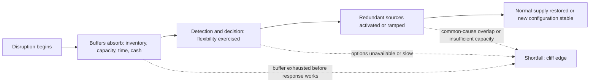
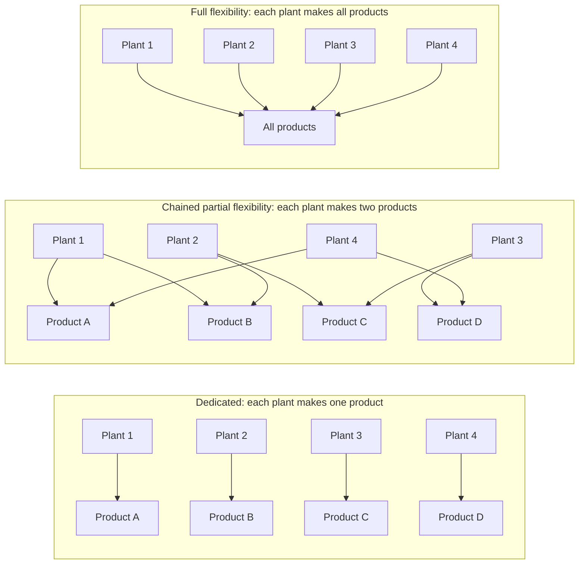
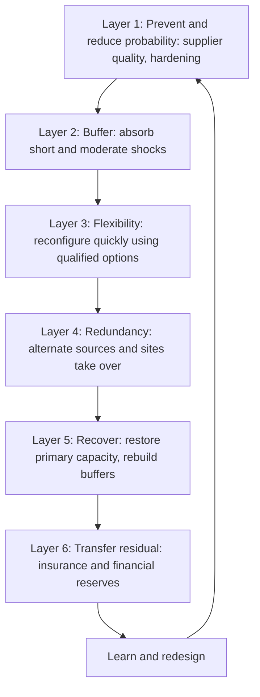
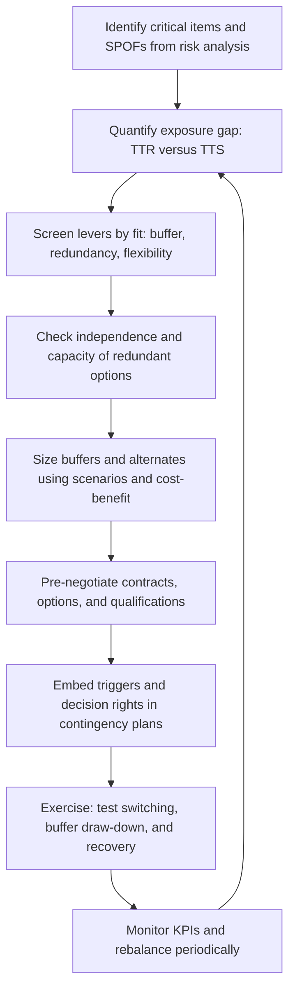
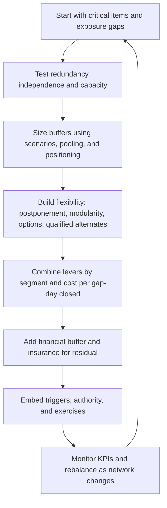

## Redundancy, Buffering, and Flexibility Strategies


### Overview

**Redundancy**, **buffering**, and **flexibility** are the three principal structural levers for building resilience into a supply chain's design. Each addresses disruption and variability differently:

- **Redundancy** duplicates critical resources (suppliers, sites, routes, systems) so that when one element fails, another can take over. It answers the question, "What if this node is lost?"
- **Buffering** places slack in the system (inventory, capacity, time, or financial reserves) to absorb variability and to bridge the gap between the onset of disruption and the arrival of an effective response. It answers, "How long can we keep operating while we respond?"
- **Flexibility** widens the range of feasible actions (switching sources, changing product mix, rerouting flows, reallocating capacity) so that the system can adapt quickly at low switching cost. It answers, "How many good alternatives can we execute, and how fast?"

These levers are related to the capabilities discussed in the preceding topic (robustness, resilience, and agility): redundancy and buffering are the primary instruments of **robustness**, flexibility is the primary instrument of **agility**, and a well-designed combination produces **resilience**. They also connect to earlier risk topics: single-point-of-failure analysis identifies *where* to apply them, stress testing sizes them, continuity planning activates them, and insurance and financial reserves cover the residual.

The core design tension is that every unit of slack carries a **standing cost** (capital, space, complexity, obsolescence), while the benefit arrives only when a disruption occurs and is uncertain in timing and magnitude. Effective strategy therefore targets slack where it is most valuable and combines the three levers so that each compensates for the others' weaknesses.

**Key Points**

- **Redundancy is only as real as its independence.** Two suppliers that share a sub-tier source, a utility, a port, or a software platform provide the appearance of redundancy without the substance.
- **Buffers buy time, not recovery.** They shift the cliff edge later; without an effective response (alternates, plans, funding), the shortfall eventually arrives.
- **Flexibility is often the cheapest resilience per unit of protection**, because it is exercised only when needed (an option-like structure), but it depends on qualified alternatives, information, and decision speed.
- **Positioning matters as much as quantity.** The same inventory has different value at different tiers (raw material, semi-finished, finished) and locations (upstream pooling versus downstream proximity).
- **Slack should be prioritized by criticality and exposure gap**, not spread uniformly. Stress-test outputs (TTR versus TTS) provide the objective basis.
- Quantitative sizing rests on **assumed distributions and disruption parameters**; rare-event inputs are uncertain, so sensitivity analysis and tail-based criteria are recommended.

---

### 1. Conceptual Foundations

#### 1.1 Key Terms

| Term | Definition |
| --- | --- |
| Redundancy | Duplication of critical resources so that failure of one does not cause system failure |
| Active redundancy | Duplicate resources operating in parallel and sharing load (for example, two suppliers each with regular allocation) |
| Passive / standby redundancy | Duplicate resources held ready but not carrying load until needed (for example, a warm alternate supplier or a cold standby site) |
| Hot / warm / cold standby | Ranges of readiness, from immediately available (hot) through partly prepared (warm) to requiring significant activation time (cold) |
| N+1, N+2, 2N | Redundancy schemes: one or two spare units beyond the N needed, or full duplication of the entire capacity |
| Common-cause failure | A single event disabling nominally independent redundant elements |
| Buffer | Slack that absorbs variability or delay (inventory, capacity, time, or money) |
| Safety stock | Inventory held to protect against demand or supply variability |
| Strategic (resilience) stock | Inventory held specifically against low-probability, high-impact disruptions |
| Capacity buffer | Reserve production, storage, or transport capacity |
| Time buffer | Schedule slack or lead-time margin |
| Financial buffer | Liquidity reserves, credit lines, and insurance that fund response and recovery |
| Flexibility | Ability to change or adapt with low time and cost penalties |
| Volume flexibility | Ability to scale output up or down |
| Mix flexibility | Ability to vary the product portfolio produced |
| Sourcing flexibility | Ability to shift purchases among suppliers |
| Routing / logistics flexibility | Ability to change modes, routes, and nodes |
| Process / manufacturing flexibility | Ability to produce different products on the same assets with low changeover cost |
| Design flexibility | Product architecture permitting alternative components and configurations |
| Postponement | Delaying commitment (differentiation, location, or timing) until better information is available |
| Risk pooling | Aggregating demand or inventory so that variability partially cancels |
| Time-to-Survive (TTS) | Time operations continue at acceptable levels after loss of a node |
| Time-to-Recover (TTR) | Time for the node to return to acceptable function |
| Exposure gap | $\text{TTR} - \text{TTS}$ (when positive) |
| Switching cost | Cost and time required to change from one option to another |
| Qualification lead time | Time required to approve an alternate source, process, or component |

#### 1.2 The Three Levers Compared

| Attribute | Redundancy | Buffering | Flexibility |
| --- | --- | --- | --- |
| Mechanism | Parallel or standby duplicates | Absorb and delay via slack | Reconfigure using options |
| Primary protection | Loss of a node or path | Variability and short outages | Uncertainty in demand, mix, and supply |
| Time profile | Immediate (active) or short activation (standby) | Immediate but finite in duration | Depends on switching speed |
| Standing cost | Medium to high (duplicate assets, qualification, lost scale) | Medium (holding cost, capital, obsolescence) | Low to medium (design, cross-training, contracts, data) |
| Exercise cost | Usually low (already in place) | Consumption of stock | Switching or premium costs |
| Failure mode | Hidden common cause; capacity inadequacy; complacency | Exhaustion; obsolescence; masking upstream problems | Options unavailable when needed; slow decision; unqualified alternatives |
| Best for | Critical, single-source, long-lead nodes | Short/moderate disruptions; variability | Volatile demand; multi-option networks; mix shifts |
| Metrics | Independent-path count; effective supplier number; qualified alternate coverage | TTS; days of cover; buffer adequacy ratio | Switching time; range of volume/mix swing; cost of flexibility |

#### 1.3 How the Levers Combine Over a Disruption Timeline



The three levers act in sequence and in parallel: buffers cover the initial interval, flexibility determines how quickly a response is chosen and executed, and redundancy determines whether alternative supply actually exists. A shortfall arises if any link in this chain is inadequate.

---

### 2. Redundancy Strategies

#### 2.1 Forms of Supply Chain Redundancy

| Category | Examples | Notes |
| --- | --- | --- |
| Supplier redundancy | Dual or multi-sourcing; qualified backup supplier | Requires independent upstream dependencies |
| Site redundancy | Multiple plants able to produce the same item; dual-fab or multi-plant footprint | Geographic separation reduces common-cause exposure |
| Capacity redundancy | Spare lines, tooling duplicates, unused shifts | Cost of idle assets |
| Tooling and IP redundancy | Duplicate molds and dies; escrowed designs and process documentation | Enables rapid production transfer |
| Logistics redundancy | Alternate carriers, modes, ports, and routes; multiple distribution centers | Contracts must be pre-negotiated; capacity contention during regional events |
| Information/IT redundancy | Backup systems, failover cloud regions, alternate data paths | Digital equivalents of physical slack |
| Energy and utility redundancy | Backup generation, dual utility feeds, water storage | Often overlooked in supplier assessment |
| Workforce redundancy | Cross-trained staff, alternate labor pools | Supports both continuity and flexibility |
| Financial redundancy | Multiple banks, credit lines, insurers | Guards against financial-system concentration |
| Supplier-relationship redundancy | Multiple contacts and channels at key suppliers | Reduces person-dependency |

#### 2.2 Sourcing Redundancy Models

| Model | Description | Advantages | Disadvantages |
| --- | --- | --- | --- |
| Sole sourcing (baseline for comparison) | One supplier | Scale, simplicity, close relationship | Highest exposure |
| Single sourcing with warm backup | One primary at high share; qualified backup at low share | Low added cost; faster activation than cold | Backup may not scale quickly; capacity must be verified |
| Dual sourcing (split) | Two suppliers with meaningful shares (for example, 70/30 or 60/40) | Continuous access to both; competitive tension | Some scale loss; management burden |
| Multi-sourcing | Three or more suppliers | Strong diversification | Higher complexity; lower volume per supplier |
| Regional / geographic dual sourcing | Sources located in different hazard zones or blocs | Reduces regional and geopolitical exposure | Cost and lead-time trade-offs; compliance complexity |
| Backup by design | Product redesigned to accept alternative components | Structural flexibility | Engineering investment; requalification |
| Consortium or mutual aid | Agreements with peers or competitors to share capacity or stock in emergencies | Access to capacity otherwise unavailable | Competition-law and confidentiality constraints; reliability uncertain |
| Vertical integration or captive capacity | Owned or controlled backup production | Control | Capital intensity; can become a new concentration |

#### 2.3 Independence: The Critical Test

A redundancy structure protects only against failures that affect elements **independently**. Failure correlation must be examined along multiple dimensions.

| Dimension | Question | Example of Hidden Dependency |
| --- | --- | --- |
| Upstream | Do the redundant suppliers buy from the same sub-tier source? | Two Tier-1 suppliers both rely on one foundry or one monomer plant |
| Geographic | Are they exposed to the same hazard footprint? | Both in the same seismic zone, floodplain, or typhoon track |
| Logistics | Do they ship through the same port, canal, or carrier? | Single chokepoint for both |
| Utility / energy | Do they depend on the same grid, pipeline, or water source? | Regional power outage stops both |
| Technology / IT | Do they run on the same platform, cloud region, or EDI provider? | Common cyber or outage exposure |
| Ownership / financial | Are they owned by the same parent or financed by the same lender? | Parent insolvency affects both |
| Labor | Do they draw on the same constrained labor pool? | Strike or migration affecting both |
| Regulatory | Do they face the same regulatory or policy risk? | Export controls or tariffs on one country |
| Competitive demand | Do other customers compete for the same backup capacity in a crisis? | Backup fully consumed by others during a regional event |

#### 2.4 Quantifying Redundancy Effectiveness

**Probability of simultaneous failure (independent case).** If node $i$ fails with probability $p_i$ over a period and failures are independent, the probability that all $k$ redundant nodes fail together is:

$$P_{\text{all fail}} = \prod_{i=1}^{k} p_i$$

For identical nodes, $P_{\text{all fail}} = p^k$. For example, with $p = 0.05$ and $k = 2$, $P_{\text{all fail}} = 0.0025$ (0.25%), a twentyfold reduction relative to a single source.

**With a common-cause factor.** A simple beta-factor model splits each node's failure probability into an independent part and a common-cause part $\beta p$:

$$P_{\text{all fail}} \approx \left[(1 - \beta)p\right]^{k} + \beta p$$

where $\beta \in [0,1]$ is the fraction of failures attributable to a common cause. The common-cause term $\beta p$ typically **dominates** for larger $k$, illustrating why adding a third or fourth source with the same shared dependencies yields diminishing returns.

**Example**

With $p = 0.05$, compare independent and common-cause cases for $k = 2$ and $k = 3$:

| Case | $k=1$ | $k=2$ | $k=3$ |
| --- | --- | --- | --- |
| Independent ($\beta = 0$) | 5.000% | 0.250% | 0.0125% |
| Common cause ($\beta = 0.3$) | 5.000% | $[0.7 \times 0.05]^2 + 0.3 \times 0.05 = 0.001225 + 0.015 = 1.6225\%$ | $[0.035]^3 + 0.015 = 0.0000429 + 0.015 \approx 1.5043\%$ |

**Output**

With a 30% common-cause fraction, going from two to three sources reduces the probability of total failure only from about 1.62% to 1.50%, because the shared-cause term of 1.5% dominates. In contrast, the independent model suggests a reduction from 0.25% to 0.0125%. The gap illustrates why **reducing common-cause dependence** is often worth more than adding another nominal supplier. The $\beta$ value is judgmental and uncertain [Inference: beta-factor estimates for supply networks are rarely derived from robust data].

#### 2.5 Effective Supplier Count

Concentration metrics from earlier topics apply to redundancy: the effective number of suppliers is

$$N_{eff} = \frac{1}{\sum_{i} s_i^{2}}$$

For a 70/30 split, $N_{eff} = 1/(0.49 + 0.09) = 1.72$; for 50/50, $N_{eff} = 2.0$. A nominal dual-sourcing arrangement at 90/10 gives $N_{eff} = 1/(0.81 + 0.01) = 1.22$, close to single sourcing in practice, though the small share may still maintain a **qualified, active** backup.

#### 2.6 Warm, Cold, and Hot Backup Economics

| Backup Type | Readiness | Standing Cost | Activation Time | Typical Use |
| --- | --- | --- | --- | --- |
| Hot (active split) | Producing regularly | Highest (scale loss) | Immediate | Very high criticality items |
| Warm (qualified, minimal orders) | Qualified; small recurring volume; capacity reservation | Moderate | Days to weeks | Critical parts with long qualification times |
| Cold (identified, unqualified) | Identified only | Low | Months (qualification time) | Lower criticality; long-horizon contingency |
| Standby capacity (owned) | Idle or partly used assets | High (asset cost) | Days to weeks | Strategic or safety-critical products |

The choice depends on the relationship between **qualification lead time** and **time-to-survive**: if a cold alternate can be qualified within the buffer's coverage period, cold backup may suffice; if qualification exceeds TTS, a warm or hot alternate is required.

$$\text{Backup adequate if: } \ T_{\text{qual}} + T_{\text{ramp}} \le \text{TTS} + T_{\text{tolerable shortfall}}$$

**Example**

- TTS (buffer plus in-transit) = 8 weeks
- Qualification time of a cold alternate = 20 weeks; ramp time = 6 weeks
- Warm alternate (pre-qualified): activation and ramp = 5 weeks

The cold alternate would leave $20 + 6 - 8 = 18$ weeks of exposure; the warm alternate leaves $5 - 8 < 0$, so no exposure beyond the buffer for that failure duration. Justifying the warm alternate then depends on the retainer and minimum-volume cost relative to the avoided loss.

#### 2.7 Capacity Adequacy of Redundant Sources

A redundant source must have **sufficient real capacity** at the moment of need.

| Check | Question |
| --- | --- |
| Nameplate vs. available capacity | Is the backup's spare capacity actually uncommitted? |
| Ramp profile | How quickly can it move from small to required volume? |
| Allocation priority | Will the backup prioritize you during a shortage when other customers also seek supply? |
| Input availability | Does the backup have its own raw material and sub-tier supply for the higher volume? |
| Logistics | Can the backup deliver to your locations at the required volume and frequency? |
| Quality equivalence | Does the backup meet specification and regulatory requirements at scale? |

**Example (partial-coverage arithmetic)**

Demand is 1,000 units per week. The primary fails for 16 weeks. A warm alternate supplies up to 300 units per week beginning in week 4. Buffer stock covers 3 weeks.

- Weeks 1 to 3: covered by buffer (no shortfall).
- Weeks 4 to 16 (13 weeks): alternate supplies 300 per week; shortfall $700$ per week.

$$\text{Total shortfall} = 13 \times 700 = 9{,}100 \text{ units}$$

Without the alternate, shortfall would be $13 \times 1{,}000 = 13{,}000$ units.

**Output**

The alternate reduces shortfall by 3,900 units (30%). Increasing the alternate's capacity share to 600 per week would reduce the shortfall to $13 \times 400 = 5{,}200$ units, illustrating that redundancy value scales with **capacity available at the time of need**, not merely with the existence of an alternate.

#### 2.8 Costs and Downsides of Redundancy

- **Loss of scale economies:** splitting volume can raise unit prices and weaken negotiating leverage.
- **Qualification and management cost:** audits, testing, quality systems, and relationship management for multiple suppliers.
- **Complexity:** more interfaces, more variability in quality and lead time.
- **Supplier commitment:** smaller share can reduce a supplier's willingness to prioritize you or invest in dedicated capacity.
- **Complacency:** perceived safety may reduce monitoring and continuity effort.
- **Hidden concentration:** false diversification (Section 2.3).
- **Increased system fragility in some cases:** in complex networks, added connections can create new pathways for cascading failure [Inference: network-science literature shows that redundancy can sometimes increase interdependence and cascade risk, though the effect depends on structure].

---

### 3. Buffering Strategies

#### 3.1 Types of Buffers

| Buffer Type | Description | Examples |
| --- | --- | --- |
| Inventory buffer | Stock held at various points | Raw materials, components, WIP, finished goods, spare parts |
| Capacity buffer | Reserve productive or logistics capacity | Overtime capability, spare lines, contracted surge capacity |
| Time buffer | Lead-time or schedule margin | Earlier ordering, safety lead time, longer planning horizons |
| Financial buffer | Cash and credit reserves; insurance | Liquidity facilities; contingent capital |
| Information buffer | Redundant data and forecasting margin | Backup records, forecast error allowances |
| Human buffer | Excess or cross-trained workforce | Reserve staffing, on-call labor pools |
| Quality buffer | Design margins and tolerances | Specification headroom |

#### 3.2 Inventory Buffer Fundamentals

##### 3.2.1 Safety Stock for Routine Variability

For an item with demand variability and lead-time variability, a standard formulation for safety stock at a target cycle-service level is:

$$SS = z \cdot \sqrt{ L\,\sigma_d^{2} + \bar{d}^{\,2}\,\sigma_L^{2} }$$

where:

- $z$ is the standard normal quantile for the target service level (for example, $z = 1.645$ for 95%, $z = 2.326$ for 99%),
- $\bar{d}$ and $\sigma_d$ are the mean and standard deviation of demand per period,
- $\bar{L}$ (written $L$ here) and $\sigma_L$ are the mean and standard deviation of lead time in periods.

This formula assumes approximately normal, independent demand and lead-time errors, which may not hold for intermittent or heavy-tailed patterns.

**Example**

- Mean demand $\bar{d} = 200$ units/day, $\sigma_d = 40$ units/day
- Mean lead time $L = 10$ days, $\sigma_L = 3$ days
- Target service level 98%, $z \approx 2.054$

$$SS = 2.054 \times \sqrt{10 \times 40^{2} + 200^{2} \times 3^{2}} = 2.054 \times \sqrt{16{,}000 + 360{,}000} = 2.054 \times \sqrt{376{,}000}$$


$$\sqrt{376{,}000} \approx 613.2, \qquad SS \approx 2.054 \times 613.2 \approx 1{,}259 \text{ units}$$

**Output**

Safety stock of about 1,259 units (about 6.3 days of average demand) protects against routine variability at a 98% cycle service level. Note the lead-time variance term contributes most of the variance ($360{,}000$ of $376{,}000$), showing that **reducing supplier lead-time variability** can be far more effective than adding stock.

##### 3.2.2 Strategic (Disruption) Stock

Safety stock formulas address routine variability; **disruption buffers** are sized against rare, long outages using time-based logic:

$$\text{Strategic Buffer (units)} = \bar{d} \times \left( T_{\text{target cover}} \right)$$

where $T_{\text{target cover}}$ is chosen from the stress-test exposure gap, the qualification time of alternates, and economic constraints. A more refined approach accounts for partial recovery and alternate supply (see Section 3.5).

##### 3.2.3 Days of Cover and Inventory Positioning

$$\text{Days of Cover} = \frac{\text{Inventory on hand}}{\text{Average daily consumption}}$$

Track days of cover by critical item and by location against TTR and TTS estimates.

##### 3.2.4 Where to Hold Inventory: Positioning Across Tiers

| Position | Advantages | Disadvantages |
| --- | --- | --- |
| Raw material / upstream | Flexibility (can be used for many products); lower unit value; risk pooling | Longer time to convert to finished goods; requires processing capacity |
| Semi-finished / components | Balance of flexibility and speed | Requires specific processes and sometimes has shelf-life or obsolescence risk |
| Finished goods (near customer) | Speed to customer; protects service | High value; product-specific; obsolescence and mix risk |
| Consignment / vendor-managed at the supplier | Reduces own capital | Depends on supplier's continuity; may be inaccessible if supplier fails |
| Consignment at the buyer's site | Immediate access | Ownership, financing, and legal considerations |
| Regional hubs and strategic reserves | Balance of proximity and pooling | Facility and management cost |
| In-transit inventory | Contributes to cover but is exposed to logistics failure | Pipeline visibility needed |

**Principle.** Holding stock at the **most generic, highest-commonality point** that still meets response-time requirements typically maximizes risk pooling and minimizes total inventory (the logic behind postponement and decoupling points).

#### 3.3 Risk Pooling

When demand from several locations is aggregated into a single stock point, the combined variability is smaller than the sum of individual variabilities (for independent demands):

$$\sigma_{\text{pooled}} = \sqrt{\sum_{i=1}^{n} \sigma_i^{2}} \quad \text{versus} \quad \sum_{i=1}^{n} \sigma_i \ \text{(unpooled)}$$

For $n$ identical locations with standard deviation $\sigma$:

$$\sigma_{\text{pooled}} = \sqrt{n}\,\sigma, \qquad \text{unpooled total} = n\sigma$$

so safety stock scales roughly as $\sqrt{n}$ instead of $n$ (the "square-root law" of inventory pooling, valid under stated assumptions).

**Example**

Four regional warehouses each face demand standard deviation $\sigma = 100$ units per week over the relevant lead time. Using $z = 1.645$:

- Unpooled safety stock: $4 \times 1.645 \times 100 = 658$ units
- Pooled at one central location: $1.645 \times \sqrt{4} \times 100 = 1.645 \times 200 = 329$ units

**Output**

Pooling halves the required safety stock (a 50% reduction), at the cost of longer delivery distances to customers and greater exposure to a failure at the central site. The trade-off between pooling benefits and **concentration risk** is a recurring theme: pooling improves efficiency but increases dependence on the pooled node, so it often works best combined with a secondary site or postponed differentiation. The result assumes independent and identically distributed demand; positive correlation reduces the benefit.

#### 3.4 Capacity, Time, and Financial Buffers

**Capacity buffer sizing.** Capacity headroom of $h\%$ above normal utilization allows recovery from a disruption by working off backlog:

$$T_{\text{catch-up}} = \frac{\text{Backlog}}{\text{Spare capacity per period}}$$

**Example**

A 3-week outage creates a backlog of 30,000 units. Normal output is 10,000 units per week. With 20% spare capacity (2,000 units/week):

$$T_{\text{catch-up}} = \frac{30{,}000}{2{,}000} = 15 \text{ weeks}$$

With 50% spare capacity (5,000 units/week):

$$T_{\text{catch-up}} = \frac{30{,}000}{5{,}000} = 6 \text{ weeks}$$

**Output**

Higher capacity buffers shorten the tail of lost sales and customer dissatisfaction after the physical outage ends, but idle capacity is costly; targeted headroom on bottleneck operations tends to be more economical than across-the-board slack.

**Time buffers.** Adding safety lead time (ordering earlier than the nominal lead time) converts uncertainty into inventory-in-transit or early arrival. It is effective against delivery-time variability but does not protect against production outages.

**Financial buffers.** Liquidity reserves (cash, undrawn committed credit lines) fund expedited freight, spot purchases, premium pricing for alternates, and working-capital strain during recovery, and they mitigate the financial-distress channel of disruption. Sizing guidance:

$$\text{Liquidity Need} \approx \text{Extra costs (expedite, premium)} + \text{Lost cash inflow during outage} + \text{Working-capital swing during recovery} - \text{Insurance recoveries timely available}$$

#### 3.5 Sizing Buffers Against Disruption: Time-Phased Approach

The buffer required to bridge a disruption of duration $D$ with an alternate that begins to supply at time $T_a$ with a fraction $\alpha$ of demand is:

$$\text{Buffer} = \bar{d} \left[ T_a + (D - T_a)(1 - \alpha) \right], \qquad D \ge T_a$$

**Example**

- Daily demand $\bar{d} = 1{,}000$ units
- Disruption duration $D = 70$ days
- Alternate begins at $T_a = 28$ days, supplying $\alpha = 0.50$ of demand

$$\text{Buffer} = 1{,}000 \times [28 + (70 - 28)(0.5)] = 1{,}000 \times [28 + 21] = 49{,}000 \text{ units (49 days of cover)}$$

**Output**

Full bridging needs 49 days of cover. Raising $\alpha$ to 0.80 would reduce the requirement to $1{,}000 \times [28 + 42 \times 0.2] = 36{,}400$ units, illustrating the **substitution between buffer and alternate-source capacity**.

#### 3.6 Economic Buffer Optimization

The economic trade-off can be framed with a newsvendor-style critical ratio for a single disruption-type decision, or through expected total cost:

$$\text{Total Expected Cost}(B) = h \cdot B + \mathbb{E}\left[ \text{Shortage Cost}(B) \right]$$

where $B$ is buffer size, $h$ is holding cost per unit over the period, and shortage cost includes lost margin and penalties. The **newsvendor critical fractile** for the optimal buffer under a continuous distribution of required cover $X$ is:

$$F(B^{*}) = \frac{c_u}{c_u + c_o}$$

where $c_u$ is the cost of underage (shortage per unit) and $c_o$ is the cost of overage (holding or obsolescence per unit). Higher shortage cost relative to holding cost pushes the optimal buffer into the distribution's upper tail.

**Example (Python: buffer optimization via simulation)**

```python
import numpy as np

rng = np.random.default_rng(314)
N = 200_000

# Assumptions (illustrative)
daily_demand = 1_000
p_event_year = 0.04                      # annual probability of disruption
median_outage_days = 55
sigma = 0.6                              # lognormal spread for outage duration
alt_start_days = 28
alt_share = 0.5
margin_per_unit = 60
holding_cost_per_unit_year = 9           # capital + storage + obsolescence

occurs = rng.random(N) < p_event_year
outage = rng.lognormal(np.log(median_outage_days), sigma, N)

def shortage_units(buffer_units):
    """Units unmet given buffer and a partial alternate after alt_start_days."""
    covered_days = buffer_units / daily_demand
    # Days uncovered by buffer (if any) with alternate contribution after alt_start_days
    unmet = np.zeros(N)
    D = outage
    for i in np.where(occurs)[0]:
        d = D[i]
        # timeline: buffer covers [0, covered_days); alternate covers alt_share of demand after alt_start
        # unmet demand accumulated day-level continuous approximation
        t = np.linspace(0, d, 200)
        supply_frac = np.where(t >= alt_start_days, alt_share, 0.0)
        # demand on day t uses buffer first until exhausted
        cum_demand = daily_demand * t
        cum_alt = np.cumsum(np.gradient(t) * daily_demand * supply_frac)
        needed_from_buffer = np.maximum(0, cum_demand - cum_alt)
        shortage = np.maximum(0, needed_from_buffer - buffer_units)
        unmet[i] = shortage[-1]
    return unmet

buffers = [10_000, 20_000, 30_000, 40_000, 50_000, 60_000]
print(f"{'Buffer':>8s} {'Annual holding':>15s} {'Expected shortage cost':>24s} {'Total':>12s} {'P99 shortage cost':>19s}")
for B in buffers:
    unmet = shortage_units(B)
    shortage_cost = unmet * margin_per_unit
    holding = B * holding_cost_per_unit_year
    total = holding + shortage_cost.mean()
    print(f"{B:8,d} {holding:15,.0f} {shortage_cost.mean():24,.0f} {total:12,.0f} {np.percentile(shortage_cost, 99):19,.0f}")
```

**Output**

For each candidate buffer, the script prints annual holding cost, expected annual shortage cost, their sum, and the 99th-percentile shortage cost. Expected total cost typically has a minimum at a moderate buffer, whereas tail cost keeps falling as the buffer grows, so the "cost-minimizing" buffer may differ from the buffer that satisfies a tail-loss tolerance. The simulation uses a continuous approximation, a single disruption per year, and assumed distributions; results depend on the seed and parameters and should be read as illustrative.

#### 3.7 Downsides and Limits of Buffers

| Issue | Description | Mitigation |
| --- | --- | --- |
| Holding cost and capital | Inventory ties up working capital; storage and insurance costs | Target buffers to critical items; use cost-benefit analysis |
| Obsolescence and shelf life | Design changes, expiry, or technological change strand stock | Rotate stock (FIFO/FEFO); limit buffers on volatile designs; use common components |
| Masking of problems | Buffers hide upstream quality, reliability, and lead-time problems | Track buffer consumption; investigate causes |
| Cliff-edge failure | Performance collapses when the buffer is exhausted | Pair with alternates and response plans |
| Bullwhip contribution | Excess buffers and hoarding amplify order variability | Coordinate; use consumption-based replenishment |
| Location risk | Buffers concentrated in one warehouse are exposed to the same hazards | Distribute or protect stock; include buffer sites in risk analysis |
| Quality and condition risk | Stock may degrade or be damaged | Storage conditions, testing, and inspection |
| Accounting and tax treatment | Inventory write-downs and obsolescence reserves affect financials | Finance involvement in policy |
| Access risk | Stock held at a failed supplier or in blocked ports is unavailable | Position stock under your control in resilient locations |
| Competitive and regulatory scrutiny | Strategic stockpiling of scarce goods during shortages may attract attention or regulation | Legal review; transparent policy |

---

### 4. Flexibility Strategies

#### 4.1 Dimensions of Flexibility

| Dimension | Definition | Examples |
| --- | --- | --- |
| Sourcing flexibility | Ability to shift volume among suppliers | Framework agreements with several qualified suppliers; spot-market access |
| Volume flexibility | Scale output up or down economically | Variable-capacity contracts; overtime; contract manufacturers |
| Mix flexibility | Change product portfolio quickly | Flexible lines; quick changeover; modular design |
| Routing / logistics flexibility | Change paths, modes, and nodes | Multiple ports; multi-modal contracts; cross-docking |
| Manufacturing / process flexibility | Produce multiple products at multiple sites | Cross-plant qualification; standard processes; flexible tooling |
| Product / design flexibility | Product architecture accommodates alternative parts | Common platforms; interchangeable components; open interfaces |
| Delivery flexibility | Adjust delivery timing and quantity | Flexible delivery windows; VMI; consignment |
| Labor flexibility | Reallocate workforce | Cross-training; multi-skilled teams; flexible shifts |
| Contractual flexibility | Options and terms that permit adjustment | Volume bands; reopeners; termination and step-in rights; capacity options |
| Information / decision flexibility | Ability to re-plan and reallocate quickly | Control towers; pre-delegated authority |
| Financial flexibility | Ability to fund adaptations | Credit lines; contingent capital |

#### 4.2 Key Flexibility Mechanisms

##### 4.2.1 Postponement

Postponement delays commitment until better demand or supply information is available. Forms include:

- **Form postponement:** delay final assembly, configuration, or customization.
- **Time postponement:** delay production or purchasing decisions.
- **Place postponement:** hold inventory centrally and ship to specific locations only upon demand.

**Effect on required inventory.** Holding generic semi-finished stock and differentiating late pools variability across variants. If demand for $m$ variants is independent with equal standard deviation $\sigma$, safety stock for the common component scales as $\sqrt{m}\,\sigma$ rather than $m\,\sigma$ for variant-specific stock, a square-root pooling benefit.

**Example**

A firm sells 6 variants, each with demand standard deviation $\sigma = 50$ units per lead time. With $z = 1.645$:

- Variant-specific safety stock: $6 \times 1.645 \times 50 = 493.5$ units
- Common-component safety stock (postponed differentiation): $1.645 \times \sqrt{6} \times 50 = 1.645 \times 122.5 = 201.5$ units

**Output**

Postponement reduces safety stock by about 59% (from 493.5 to 201.5 units) under these assumptions, at the cost of final-assembly capability near the market and possibly slightly higher unit cost. The benefit shrinks if variant demands are positively correlated.

##### 4.2.2 Modularity and Commonality

Using common components and modular architectures increases the number of products a given part can serve, raising pooling benefits and widening substitution options.

- **Commonality:** sharing components across products reduces the number of unique parts and aggregate variability.
- **Modularity:** standardized interfaces permit swapping modules or suppliers without redesign.
- **Design for supply flexibility:** specify parts with multiple acceptable alternatives (approved-equivalents lists) from the start.

**Trade-off.** Commonality can create concentration (one part used everywhere, thereby raising the impact of its failure) and can constrain product differentiation.

##### 4.2.3 Flexible Manufacturing and Multi-Site Qualification

- **Chaining and limited flexibility.** Theoretical and empirical work in manufacturing flexibility shows that a **chain** of partial flexibility (each plant able to produce two products, arranged in a cycle so that all plants and products are linked) captures most of the benefit of full flexibility at much lower cost [Inference: this "long chain" result is well documented in operations research for certain demand models, and its magnitude depends on the model and assumptions].



The chained configuration links all plants and products in a single cycle so that surplus capacity can shift across the network, giving most of the benefit of full flexibility with far fewer qualifications.

**Example (Python: chained vs dedicated flexibility)**

```python
import numpy as np

rng = np.random.default_rng(2026)
n = 6
capacity = 100.0
mean_d, sd_d = 100.0, 40.0
trials = 5_000

def simulate(flex_type):
    served_total = 0.0
    for _ in range(trials):
        d = np.maximum(0, rng.normal(mean_d, sd_d, n))
        if flex_type == "dedicated":
            served = np.minimum(d, capacity).sum()
        elif flex_type == "full":
            served = min(d.sum(), capacity * n)
        elif flex_type == "chain":
            # Plant i can serve product i and product (i+1) mod n.
            # Solve as a max-flow via a simple LP-free greedy with iterative balancing.
            # Use linear programming through scipy for exactness.
            from scipy.optimize import linprog
            # Variables x[i,j]: plant i to product j, j in {i, (i+1)%n}
            idx = {}
            k = 0
            for i in range(n):
                for j in (i, (i + 1) % n):
                    idx[(i, j)] = k
                    k += 1
            c = -np.ones(k)  # maximize total served
            A, b = [], []
            for i in range(n):  # plant capacity
                row = np.zeros(k)
                for j in (i, (i + 1) % n):
                    row[idx[(i, j)]] = 1
                A.append(row); b.append(capacity)
            for j in range(n):  # product demand
                row = np.zeros(k)
                for i in ((j - 1) % n, j):
                    row[idx[(i, j)]] = 1
                A.append(row); b.append(d[j])
            res = linprog(c, A_ub=np.array(A), b_ub=np.array(b), bounds=(0, None), method="highs")
            served = -res.fun
        served_total += served
    return served_total / trials

total_demand_mean = n * mean_d
for t in ("dedicated", "chain", "full"):
    avg = simulate(t)
    print(f"{t:10s} expected demand served: {avg:7.1f} of ~{total_demand_mean:.0f} mean demand "
          f"({avg/total_demand_mean:.1%})")
```

**Output**

The script estimates expected demand served under three flexibility configurations with six plants and six products, each plant at capacity equal to mean demand and volatile demand (standard deviation 40). Expected results typically show dedicated flexibility serving the least, full flexibility serving the most, and the two-product chain capturing most of the difference between them, illustrating that **limited, well-structured flexibility can deliver much of the benefit of full flexibility**. Exact percentages depend on the demand model and trials; the script requires `numpy` and `scipy`, and results vary with the seed.

##### 4.2.4 Flexible Contracts and Real Options

Contract structures can create flexibility options at modest premiums:

| Contract Form | Mechanism | Buyer Benefit | Supplier Consideration |
| --- | --- | --- | --- |
| Volume-flexibility band | Buyer may vary order volume within a range (for example, plus/minus 20%) | Adjust to demand without renegotiation | Supplier must hold flexible capacity; price premium or take-or-pay |
| Capacity reservation / option | Pay a fee to reserve capacity exercisable later | Guaranteed access in shortage or surge | Retainer income; commitment of capacity |
| Backup supply agreement | Standby agreement with a secondary supplier at minimum volume | Warm alternate at low standing cost | Small volume, possible activation |
| Call option on supply | Right to buy additional quantity at a preset price | Price protection and access | Option premium |
| Quantity flexibility contract | Buyer commits to a forecast but may adjust later within limits; supplier commits to deliver | Shares risk between buyer and supplier | Supplier bears capacity risk within bands |
| Dual-price or tiered pricing | Different prices for base and flex volumes | Predictable price for surge | Pricing for scarce capacity |
| Consignment / VMI | Supplier holds stock at buyer's site or near it | Shorter response; less capital | Supplier assumes inventory risk; needs visibility |
| Step-in / transition assistance | Right to move production or tooling | Continuity in supplier failure | Legal and practical enforceability |
| Reopener clauses | Terms can be revisited on defined triggers | Adjust to cost or market shocks | Predictability trade-off |

The economic value of such options can be assessed with option-style reasoning: the value rises with uncertainty and with the payoff when exercised.

**Example (capacity option)**

A firm pays $250,000 per year for the right to purchase up to 20% extra volume from a supplier at a $2 per unit premium. Extra demand of 40,000 units beyond baseline has a 30% chance of occurring in a year, with contribution margin of $25 per unit.

$$\text{Expected Exercise Payoff} = 0.30 \times 40{,}000 \times (25 - 2) = 0.30 \times 40{,}000 \times 23 = \$276{,}000$$


$$\text{Net Option Value} = 276{,}000 - 250{,}000 = \$26{,}000 \text{ per year}$$

**Output**

The option has a modest positive expected value, and it also protects against upside-demand stock-outs (and can serve as a disruption hedge when the supplier is a backup source). Value is sensitive to the probability and size of the excess demand, so sensitivity analysis is important.

##### 4.2.5 Logistics and Routing Flexibility

- **Multiple ports of entry and carriers:** pre-negotiated arrangements with surge terms.
- **Multi-modal capability:** ocean, rail, truck, and air, with rules for when air freight is triggered.
- **Cross-docking and regional hubs:** more rerouting options.
- **Flexible incoterms and title-transfer points:** determine who holds risk and can redirect goods.
- **Pre-cleared customs and trusted-trader programs:** faster border transit where available.
- **Capacity contention:** in regional or global events, everyone seeks the same alternates; pre-committed capacity (contracts, minimum volumes) improves access.

##### 4.2.6 Workforce and Organizational Flexibility

- Cross-training and multi-skilling so labor can shift between lines and tasks.
- Flexible shift patterns and staffing agreements.
- Pre-delegated decision authority to shorten response time.
- Modular organizational structures (crisis teams that can be assembled quickly).
- Shared-service and outsourced capabilities that can scale.

#### 4.3 Measuring Flexibility

| Metric | Definition |
| --- | --- |
| Switching time | Time to move a defined share of volume to an alternate source or route |
| Switching cost | One-time cost to switch (qualification, expediting, premiums) |
| Volume flexibility range | Percentage volume swing achievable within a given number of days at acceptable cost |
| Mix flexibility index | Fraction of the product portfolio a line or site can produce with limited changeover |
| Changeover time and cost | Time and cost to switch production between products |
| Qualified alternate coverage | % of critical items with a qualified alternate supplier or site |
| Substitutable-part share | % of BOM lines with approved alternates |
| Postponement depth | Position of the customization point relative to customer demand (and share of volume postponed) |
| Options coverage | % of critical volume with contractual options (capacity reservation, backup supply) |
| Decision latency | Median time from signal to approved action |

#### 4.4 Limits and Downsides of Flexibility

| Issue | Description |
| --- | --- |
| Flexibility must be pre-built | Qualification, tooling, contracts, and cross-training must exist before need; flexibility cannot be improvised in a crisis |
| Option availability during shocks | Alternatives may be unavailable if others exercise the same options (capacity contention) |
| Cost of maintaining options | Retainers, minimum volumes, and qualification upkeep |
| Performance trade-offs | Flexible assets can be less efficient than dedicated ones |
| Complexity | More configurations, more decisions, more coordination |
| Quality risk during switching | Changeovers and new sources raise defect risk |
| Information dependence | Flexibility exercised on poor data can worsen outcomes |
| Regulatory constraints | Switching sources may require re-approval (medical, aerospace, food) |
| Organizational readiness | Untrained staff or unclear authority nullify structural flexibility |

---

### 5. Integrating the Three Strategies

#### 5.1 Complementarity and Substitution

| Situation | Better Emphasis | Reason |
| --- | --- | --- |
| Long qualification time, sole source, high consequence | Redundancy (warm alternate) plus buffer | Flexibility alone cannot help if no qualified alternate exists |
| Volatile demand, short product life | Flexibility (postponement, modularity) with light buffers | Buffers risk obsolescence; flexibility uses information |
| Short outages, frequent variability | Buffering (safety stock, time buffer) | Cheap and immediate |
| Rare, severe, prolonged outage | Redundancy and flexibility, with financial buffers | Physical buffers cannot cover very long gaps economically |
| High-value, low-volume critical items | Buffer plus redundancy | Holding cost per unit is small relative to consequence |
| Commodity inputs with liquid markets | Flexibility (spot sourcing, multi-supplier access) | Alternatives exist in market |
| Regional common-cause exposure | Geographic redundancy and flexible routing | Buffers held in the same region share the hazard |
| Time-critical replenishment | Nearshoring, regional hubs, flexible logistics | Reduces response time |

#### 5.2 A Layered Defense Model



Each layer protects against failures of the previous ones, in the spirit of **defense in depth**.

#### 5.3 Coordinated Sizing: The Exposure-Gap Method

Use the stress-test output to determine which lever closes the gap most economically:

1. Identify critical items and compute the exposure gap: $\text{Gap} = \max(0, \text{TTR} - \text{TTS})$.
2. For each candidate lever, estimate its effect on the gap and its annualized cost:
   - **Buffer:** increases TTS by $\Delta$ days at holding cost $h \times \bar{d} \times \Delta$.
   - **Alternate source:** reduces effective TTR (or covers a share $\alpha$ of demand) at qualification and retainer cost.
   - **Flexibility (design, contract):** reduces switching time and expands substitutable supply at design and option cost.
3. Compute cost per day of gap closed and per dollar of tail-loss reduction.
4. Select the combination that achieves the risk tolerance at minimum cost, with sensitivity checks.

**Example**

A critical item has TTR of 24 weeks (168 days) and TTS of 6 weeks (42 days), so the gap is 126 days. Daily margin at risk is $180,000, so uncovered loss is $126 \times 180{,}000 = \$22{,}680{,}000$.

| Option | Effect | Annualized Cost | Gap After | Loss After | Loss Reduction |
| --- | --- | --- | --- | --- | --- |
| Buffer +6 weeks (42 days) | TTS from 42 to 84 days | $640,000 | 84 days | $15.12M | $7.56M |
| Warm alternate at 40% after 6 weeks | Covers 40% from day 42 | $520,000 | see below | see below | see below |
| Buffer +3 weeks and warm alternate at 40% | Combined | $860,000 | see below | see below | see below |

Warm alternate alone: days 43 to 168 (126 days), with 40% covered, uncovered fraction 60%:

$$\text{Loss} = 126 \times 0.60 \times 180{,}000 = \$13{,}608{,}000, \quad \text{Reduction} = 22{,}680{,}000 - 13{,}608{,}000 = \$9{,}072{,}000$$

Combined (buffer +21 days, so TTS = 63 days; alternate at 40% from day 42 but buffer still being consumed until day 63; the effect is that days 64 to 168 (105 days) are uncovered at 60%):

$$\text{Loss} = 105 \times 0.60 \times 180{,}000 = \$11{,}340{,}000, \quad \text{Reduction} = \$11{,}340{,}000 \text{ saved from } 22{,}680{,}000$$

**Output**

| Option | Annualized Cost | Loss After | Loss Reduction | Reduction per $1 of Annual Cost |
| --- | --- | --- | --- | --- |
| Buffer +6 weeks | $640,000 | $15.12M | $7.56M | 11.8 |
| Warm alternate (40%) | $520,000 | $13.61M | $9.07M | 17.4 |
| Buffer +3 weeks + alternate | $860,000 | $11.34M | $11.34M | 13.2 |

The warm alternate delivers the greatest reduction per annual dollar in this illustration, while the combination achieves the largest absolute reduction. Because these are single-event modeled losses (not annualized expected values), the decision should weigh event probability, tail-loss tolerance, and interaction with other risks. Costs and parameters are illustrative.

#### 5.4 Interaction Effects to Watch

- **Buffers reduce the value of speed (and vice versa):** if response is fast, smaller buffers suffice; if buffers are large, slow response is tolerable for longer.
- **Redundancy adds value only if activation is prompt:** a warm alternate with slow decision-making loses its advantage.
- **Flexibility depends on visibility:** control towers and event monitoring convert flexibility into timely action.
- **Financial strength supports all three:** funding for premium freight, alternate purchases, and inventory builds.
- **Insurance is a residual layer:** it compensates for loss after slack is exhausted; it does not substitute for slack.

---

### 6. Prioritization and Segmentation

#### 6.1 Criteria for Allocating Slack

| Criterion | Question |
| --- | --- |
| Criticality | How large is the revenue, safety, or regulatory impact of stock-out? |
| Substitutability | Can the item or source be replaced quickly and cheaply? |
| Lead time and qualification time | How long to obtain or qualify alternatives? |
| Demand and supply variability | How volatile are demand and supply? |
| Value density and holding cost | What is the cost of holding a unit of buffer? |
| Obsolescence and shelf life | Does the item lose value quickly? |
| Exposure gap | How large is $\text{TTR} - \text{TTS}$? |
| Supplier risk | Financial, operational, geographic, and cyber vulnerability |
| Risk correlation | Are multiple critical items exposed to the same common cause? |

#### 6.2 Segmentation Matrix

| Segment | Profile | Preferred Lever Mix |
| --- | --- | --- |
| A: High criticality, low substitutability, long lead | Sole-source custom parts | Warm/hot redundancy plus strategic buffer; design flexibility over time; capacity reservation |
| B: High criticality, high substitutability | Standard components with several qualified suppliers | Light buffer; sourcing flexibility; framework contracts |
| C: Low criticality, low substitutability | Niche low-impact items | Modest buffer or accept risk with monitoring |
| D: Low criticality, high substitutability | Commodities | Minimal buffer; flexible spot sourcing |
| E: Volatile, short life | Fashion, consumer electronics variants | Postponement, modularity, agile response; minimal finished-goods buffers |
| F: Regulated critical | Medical or aerospace parts | Redundancy and buffer combined with regulatory pre-approval for alternates |

#### 6.3 Criticality-Weighted Buffer Allocation

When the total budget for buffers is limited, allocate to maximize risk reduction per dollar. A simple heuristic ranks items by:

$$\text{Priority}_i = \frac{p_i \times \text{Daily Margin}_i \times \Delta \text{Gap}_i}{\text{Cost of Slack}_i}$$

where $\Delta \text{Gap}_i$ is the number of gap-days closed per unit of slack, $p_i$ is the estimated disruption probability, and cost of slack is annualized. Items with the highest ratios receive slack first until the budget or the risk tolerance is met. This is a heuristic; a formal approach uses knapsack or mixed-integer optimization.

**Example (Python: greedy allocation)**

```python
items = [
    # name, p_event, daily_margin, gap_days_closed_per_unit, annual_cost_per_unit
    ("Sensor",     0.03, 250_000, 1.0, 9_000),
    ("Controller", 0.04, 180_000, 1.0, 6_500),
    ("Adhesive",   0.02,  90_000, 1.0, 2_000),
    ("Fasteners",  0.01,  20_000, 1.0,   800),
]
budget = 120_000       # annual budget for buffer days across items
max_days_each = 40     # cap on days of extra cover per item

allocation = {name: 0 for name, *_ in items}
remaining = budget

def marginal_value(item):
    name, p, margin, closed, cost = item
    return (p * margin * closed) / cost

# Greedy: add one day of cover at a time to the highest value-per-cost item
while remaining > 0:
    candidates = [it for it in items
                  if allocation[it[0]] < max_days_each and it[4] <= remaining]
    if not candidates:
        break
    best = max(candidates, key=marginal_value)
    allocation[best[0]] += 1
    remaining -= best[4]

print("Allocated extra days of cover:", allocation)
print(f"Budget used: ${budget - remaining:,.0f}, remaining: ${remaining:,.0f}")
for name, p, margin, closed, cost in items:
    print(f"{name:11s} value per $ = {marginal_value((name,p,margin,closed,cost)):.3f}")
```

**Output**

The script allocates the annual budget one day of cover at a time to the item with the highest expected-loss reduction per dollar, up to a per-item cap. Higher-margin, higher-probability, cheaper-to-buffer items (for example, the adhesive in this data, whose value per dollar is high because its cost per day is low) fill first, while expensive-to-hold items may receive less. The heuristic assumes linear returns to buffer days (in reality returns diminish once TTS exceeds TTR), so results should be checked against the exposure gap for each item; parameter values are illustrative.

---

### 7. Design Patterns and Practical Playbooks

#### 7.1 Patterns

| Pattern | Description | Typical Use |
| --- | --- | --- |
| Strategic stockpile at a decoupling point | Hold long-lead, generic inputs at a point where they can feed many products | Semiconductors, specialty materials, commodity intermediates |
| Warm second source | Qualified alternate at 10% to 30% allocation, with capacity reservation and periodic ordering | Critical sole-source parts |
| Dual-region footprint | Production or sourcing in two hazard-independent regions | Regional disaster and geopolitical risk |
| Postponed differentiation | Central generic stock, final configuration near market | High variety, volatile demand |
| Design for substitution | Approved-equivalents list; modular interfaces | Long-life products with component obsolescence risk |
| Flexible-capacity contract bands | Volume flexibility with supplier | Demand volatility and surge needs |
| Buffer with rotation | FIFO/FEFO rotation of strategic stock into regular use | Perishable or shelf-life-limited items |
| Consignment near point of use | Supplier-owned stock at the buyer's site | Reduces response time and capital |
| Regional hub with cross-docking | Flexible routing among nodes | Logistics resilience |
| Financial pre-arrangement | Committed credit lines and insurance | Funding for response |

#### 7.2 Implementation Roadmap



#### 7.3 Operational Practices

- **Buffer governance:** define ownership, replenishment rules after draw-down, and release authority; avoid using strategic buffers for routine shortages without approval.
- **Alternate maintenance:** keep alternate suppliers "warm" through periodic orders, audits, and sample testing; revalidate qualification and capacity annually.
- **Reservation validation:** test capacity reservations by requesting a partial ramp in an exercise.
- **Inventory visibility and condition control:** cycle counts, shelf-life tracking, storage conditions, and location tracking (including in-transit).
- **Trigger-based release:** pre-define conditions that release strategic stock and activate alternates.
- **Interface with financial monitoring:** buffers and alternates should intensify as supplier financial health deteriorates.
- **Legal and compliance review:** competition law when coordinating with peers; regulatory approval for alternates; tax and accounting treatment of stock.

---

### 8. Metrics and Monitoring

#### 8.1 KPI Dashboard

| Lever | KPI | Definition | Direction |
| --- | --- | --- | --- |
| Redundancy | Independent alternate coverage | % of critical items with a qualified alternate that is independent on key dimensions | Higher |
| Redundancy | Effective supplier count | $N_{eff}$ for critical categories | Higher |
| Redundancy | Common-cause overlap | % of critical volume sharing a single upstream, geographic, or logistics dependency | Lower |
| Redundancy | Alternate readiness | % of alternates validated (capacity and quality) within 12 months | Higher |
| Buffering | Days of cover vs. TTR | Ratio of cover to modeled TTR for critical items | Higher (target per criticality) |
| Buffering | Buffer adequacy ratio | $\text{TTS} / \text{TTR}$ | Closer to or above 1 for critical items |
| Buffering | Buffer age and obsolescence exposure | Share of strategic stock beyond age or shelf-life thresholds | Lower |
| Buffering | Working capital in strategic buffers | $ value and share of inventory | Monitored |
| Flexibility | Switching time | Days to shift a defined share of volume | Lower |
| Flexibility | Substitutable BOM share | % of BOM lines with approved alternates | Higher |
| Flexibility | Options coverage | % of critical volume with contractual options or reservations | Higher |
| Flexibility | Decision latency | Median hours or days from signal to action | Lower |
| Cross-cutting | Exposure gap count | Number of critical items with $\text{TTR} > \text{TTS}$ | Lower |
| Cross-cutting | Modeled loss vs. tolerance | Stress-test loss by scenario vs. risk appetite | Within tolerance |
| Cross-cutting | Total cost of slack | Annualized cost of buffers, redundancy, and flexibility as % of revenue | Monitored |

#### 8.2 Review Triggers

Reassess the slack portfolio when:

- Suppliers, sites, or routes change, or M&A alters the network.
- Product design or demand patterns shift materially.
- Stress tests or actual incidents reveal shortfalls.
- Supplier financial or cyber risk changes significantly.
- Regulatory, tariff, or geopolitical conditions change.
- Cost of capital or storage costs change significantly.

---

### 9. Governance, Finance, and Organizational Considerations

| Consideration | Guidance |
| --- | --- |
| Ownership | Assign accountable owners for critical-item resilience (procurement, supply chain, engineering) |
| Funding model | Treat resilience slack as an investment justified on expected loss, tail-risk reduction, and tolerance thresholds, not solely on inventory turns |
| Performance incentives | Avoid rewarding only low inventory and unit cost; include resilience KPIs |
| Working-capital impact | Coordinate with finance on inventory financing, supply chain finance, and covenant headroom |
| Accounting | Inventory valuation, obsolescence reserves, and treatment of reservation fees vary by jurisdiction and standards; consult finance and auditors |
| Supplier relationships | Communicate the purpose of dual sourcing or reservations; unclear intent can damage trust and reduce supplier commitment |
| Competition and antitrust law | Mutual aid and capacity sharing among competitors require legal review |
| Regulatory | Some sectors mandate minimum stock or multi-sourcing (for example, in critical goods or medical supply contexts); requirements vary by jurisdiction and change over time |
| Sustainability | Excess inventory and duplicated capacity have environmental footprints; consider waste, energy, and end-of-life impacts |
| Decision authority | Pre-authorize spending and release of buffers within limits to avoid delay |

---

### 10. Common Pitfalls

**Key Points**

- **False redundancy:** counting suppliers without testing for shared upstream, geographic, logistics, IT, or financial dependencies.
- **Unvalidated alternates:** "backup" suppliers that are unqualified, have no spare capacity, or would be overwhelmed by competing demand in a shared event.
- **Uniform buffers:** applying blanket days-of-cover rules rather than segmenting by criticality and exposure gap.
- **Buffers in the wrong place:** stock held at the failing supplier, in the same flood zone, or at a non-generic stage where it cannot be redeployed.
- **Ignoring obsolescence and shelf life:** strategic stock becomes worthless after design changes or expiry.
- **Using buffers for routine shortages:** eroding strategic reserves through habitual draw-down.
- **Assuming flexibility exists without pre-building it:** qualification, tooling, contracts, and training take time.
- **Neglecting decision speed:** flexibility and redundancy underperform if authority and information are slow.
- **Over-diversification:** too many suppliers dilute volume, increase complexity, and weaken supplier commitment.
- **Ignoring the cost side:** slack must be justified by expected and tail loss reduction.
- **Assuming linear returns:** benefits of additional buffer or redundancy diminish, especially with common-cause dependencies.
- **Overlooking capacity contention:** in widespread events, competitors also activate the same alternates and carriers.
- **Confusing insurance with slack:** insurance pays after loss; it does not produce supply.
- **Complacency:** high slack can reduce attention to supplier performance and upstream problems.
- **Static design:** failure to revisit slack as networks, products, and risks evolve.
- **Neglecting digital and financial redundancy:** focusing only on physical slack while IT and liquidity remain single points of failure.

---

### 11. End-to-End Worked Example

**Context.** A power-tools manufacturer (annual revenue $1.1B) identifies three critical inputs through prior risk analysis:

| Input | Profile | Daily Margin at Risk | TTR (days) | TTS (days) | Exposure Gap (days) | Notes |
| --- | --- | --- | --- | --- | --- | --- |
| Brushless motor controller (custom ASIC) | Sole source, 30-week lead, 40-week alternate qualification | $260,000 | 182 | 56 | 126 | Foundry in seismic region |
| Lithium-ion cells | Two suppliers sharing one cathode-material source | $310,000 | 90 | 35 | 55 | Hidden upstream concentration |
| Die-cast housings | Three suppliers; standard tooling | $150,000 | 30 | 28 | 2 | High substitutability |

Board tolerance: no more than $20M loss from any single scenario.

**Step 1: Baseline losses**

$$\text{Loss}_{\text{ASIC}} = 126 \times 260{,}000 = \$32{,}760{,}000$$


$$\text{Loss}_{\text{Cells}} = 55 \times 310{,}000 = \$17{,}050{,}000$$


$$\text{Loss}_{\text{Housings}} = 2 \times 150{,}000 = \$300{,}000$$

The ASIC exceeds tolerance; cells are within tolerance but reveal a hidden common cause (the shared cathode-material source), meaning a single upstream event could hit both suppliers simultaneously.

**Step 2: Independence check for cells**

Suppliers X and Y both depend on one cathode-material producer. The effective supplier count at the upstream tier is 1. A shared-source failure would produce the 55-day gap above even though two Tier-1 suppliers exist.

**Step 3: Select levers**

| Input | Primary Levers | Rationale |
| --- | --- | --- |
| ASIC | (1) Strategic buffer from 8 to 20 weeks; (2) design flexibility: second-source-compatible variant (12-month program); (3) wafer capacity reservation; (4) financial buffer (liquidity facility) | Long qualification means flexibility arrives late, so a buffer bridges the interim; redundancy through redesign is the structural fix |
| Cells | (1) Qualify third supplier with independent cathode source in a different region (warm, 20% allocation); (2) raise buffer from 5 to 9 weeks; (3) require sub-tier disclosure | Removes the common cause; buffer covers ramp time |
| Housings | Maintain current multi-sourcing; framework contract with volume-flexibility band; no additional buffer | Flexibility already sufficient; standing cost of extra buffer not justified |

**Step 4: Re-estimate exposure**

ASIC after buffer raise to 20 weeks (TTS = 140 days):

$$\text{Gap} = 182 - 140 = 42 \text{ days}, \quad \text{Loss} = 42 \times 260{,}000 = \$10{,}920{,}000$$

(within tolerance). After the redesign-enabled second source begins supplying 50% in month 12, long-run exposure falls further, but the interim risk is covered by the buffer.

Cells after adding an independent third supplier (warm, 20% share available at full ramp after 5 weeks) and raising the buffer to 9 weeks (63 days), for a shared cathode-source failure lasting 90 days:

- Days 1 to 63: buffer covers demand.
- Days 64 to 90 (27 days): the third supplier covers 20% of demand; 80% unmet.

$$\text{Loss} = 27 \times 0.80 \times 310{,}000 = \$6{,}696{,}000$$

**Step 5: Costs (illustrative annualized)**

| Action | Annualized Cost |
| --- | --- |
| ASIC buffer increase (12 additional weeks of cover) | $2.1M (holding, obsolescence reserve) |
| ASIC second-source design program (amortized) | $1.4M |
| Wafer capacity reservation | $0.6M |
| Cells third-supplier qualification and retainer | $0.9M |
| Cells buffer increase (4 weeks) | $0.7M |
| Housings framework flexibility band | $0.1M |
| **Total** | **$5.8M** |

**Step 6: Residual risk and transfer**

- Residual loss in the ASIC scenario ($10.9M) and cell scenario ($6.7M) falls within tolerance.
- The compound regional scenario (seismic event affecting the ASIC foundry and logistics disruption at the same time) is not fully covered; the firm keeps a $40M committed liquidity facility and reviews contingent business interruption coverage for the foundry, as covered in the insurance topic.

**Step 7: Governance and monitoring**

- KPIs: exposure-gap count (target zero above tolerance), independent-alternate coverage for critical items (target 100% by month 18), buffer age (limit for strategic ASIC stock), and options coverage.
- Exercises: annual tabletop where a foundry outage triggers buffer release and wafer-capacity activation; a live ramp test with the warm cell supplier each year.
- Review: quarterly buffer condition and obsolescence check; annual re-run of stress tests.

**Conclusion of example.** The three items received different lever mixes because their exposure gaps, qualification times, and substitutability differ. A uniform buffer rule would have either over-invested in housings or under-protected the ASIC. The analysis also exposed a hidden common cause for cells that a supplier count alone would have missed. Values are illustrative and depend on assumptions; actual results vary with execution and external conditions.

---

### 12. Summary Framework



**Conclusion**

Redundancy, buffering, and flexibility are complementary structural levers for absorbing and adapting to disruption. Redundancy provides alternative sources and paths but only to the extent that failures are independent and the alternates have real capacity, qualification, and priority when needed. Buffering supplies time and absorbs variability through inventory, capacity, schedule, and financial reserves, but it delays rather than prevents shortfalls and carries standing costs including obsolescence and capital. Flexibility widens the set of feasible responses through postponement, modularity, chained multi-site qualification, contractual options, and decision speed, at relatively low standing cost but only if it is built in advance and supported by information and authority. The strongest designs segment the network by criticality, substitutability, lead time, and volatility; size slack against stress-test exposure gaps and stated tolerances; test independence and capacity of alternates explicitly; combine levers so that each covers the others' weaknesses; and revisit the portfolio as the network changes. All quantitative results depend on modeling assumptions, rare-event parameters are inherently uncertain, and real disruptions frequently differ from scenarios, so the analysis should inform judgment and be revisited as data and conditions evolve.

**Related Topics**

- Resilience versus Robustness versus Agility
- Single Point of Failure and Concentration Risk Analysis
- Business Continuity and Contingency Planning
- Scenario Planning and Stress Testing
- Dual Sourcing and Multi-Sourcing Strategies
- Safety Stock and Inventory Positioning Optimization
- Postponement, Modularity, and Design for Supply Flexibility
- Real Options and Flexible Supply Contracts
- Supplier Qualification and Alternate-Source Onboarding
- Nearshoring, Reshoring, and Regional Footprint Design
- Supply Chain Finance and Liquidity Backstops
- Insurance and Risk Transfer Mechanisms