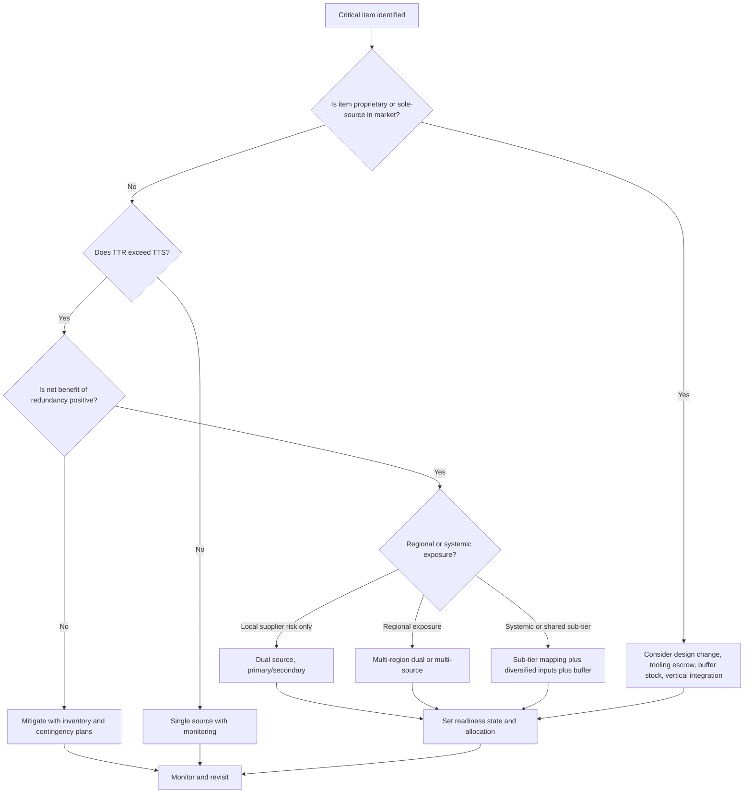

## Dual and Multi-Sourcing for Resilience


### Overview

Dual sourcing and multi-sourcing are supply base strategies in which a buyer qualifies and actively purchases the same item (or functionally equivalent items) from two or more independent suppliers, rather than relying on a single source. The primary goal is **resilience**: the ability of the supply chain to absorb, adapt to, and recover from disruption without unacceptable loss of service, cost, or continuity.

Within a tiered supply chain structure (OEM → Tier 1 → Tier 2 → Tier N → raw materials), sourcing decisions made at one tier can be undone by hidden concentration at deeper tiers. Effective resilience sourcing therefore requires reasoning about **independence** across the entire network, not only among direct suppliers.

**Key Points**

- **Single sourcing**: one supplier is qualified and used for an item, by choice (strategic partnership, cost leverage) or by necessity.
- **Sole sourcing**: only one supplier exists in the market that can provide the item (a market constraint, not a buyer choice).
- **Dual sourcing**: two qualified suppliers are used, often with a primary/secondary allocation.
- **Multi-sourcing**: three or more qualified suppliers are used, often across regions.
- **Resilience** comes from *independence* of failure modes, not from supplier count alone.
- Sourcing strategy trades off resilience against cost, quality consistency, complexity, and supplier commitment.

### Sourcing Strategy Spectrum

| Strategy | Suppliers Qualified | Typical Allocation | Resilience | Cost Leverage | Complexity |
| --- | --- | --- | --- | --- | --- |
| Sole source (forced) | 1 (market) | 100% / 0% | Very low | Low (supplier power) | Low |
| Single source (chosen) | 1 | 100% / 0% | Low | High volume leverage, but dependency | Low |
| Single source + qualified backup | 1 active, 1 dormant | 100% / 0% | Medium | Medium | Medium |
| Dual source (primary/secondary) | 2 | 70/30 to 80/20 | Medium-High | Medium-High | Medium |
| Dual source (balanced) | 2 | ~50/50 | High | Medium (split volume) | Medium-High |
| Multi-source | 3+ | Distributed | Very high | Competitive pressure, split volume | High |
| Multi-source, multi-region | 3+ across regions | Distributed | Highest | Varies | Highest |

### Why Sourcing Concentration Fails

Disruptions that motivate dual and multi-sourcing come from several categories:

- **Supplier-specific**: bankruptcy, fire, quality escape, labor dispute, cyber incident, capacity loss.
- **Regional**: earthquake, flood, typhoon, regional lockdown, port closure, regional conflict.
- **Systemic**: pandemic, sanctions, tariffs, export controls, commodity shortages, global logistics failure.
- **Sub-tier**: failure at a Tier 2 or Tier 3 supplier that multiple Tier 1 suppliers depend on.

**Key Points**

- Dual sourcing protects mainly against **supplier-specific** disruptions.
- Multi-region sourcing protects against **regional** disruptions.
- Neither protects against **systemic** or **shared sub-tier** disruptions unless independence is verified at depth.

### Concentration Risk in Tiered Structures

A frequent failure pattern: a buyer dual-sources at Tier 1, but both Tier 1 suppliers purchase the same critical input from the same Tier 2 (or the same region), producing a hidden single point of failure.

(svg_diagram) Hidden Sub-Tier Concentration

<svg xmlns="http://www.w3.org/2000/svg" viewBox="0 0 640 360" width="640" height="360" font-family="sans-serif" font-size="13">
<title>Hidden Sub-Tier Concentration (svg_diagram)</title>
<rect width="640" height="360" fill="#ffffff" />
<text x="320" y="24" text-anchor="middle" font-weight="bold" font-size="15">Hidden Sub-Tier Concentration (svg_diagram)</text>
<rect x="270" y="46" width="100" height="40" rx="6" fill="#dbeafe" stroke="#1e40af" />
<text x="320" y="71" text-anchor="middle">OEM</text>
<rect x="140" y="130" width="120" height="40" rx="6" fill="#dcfce7" stroke="#166534" />
<text x="200" y="155" text-anchor="middle">Tier 1 - Supplier A</text>
<rect x="380" y="130" width="120" height="40" rx="6" fill="#dcfce7" stroke="#166534" />
<text x="440" y="155" text-anchor="middle">Tier 1 - Supplier B</text>
<rect x="270" y="230" width="100" height="40" rx="6" fill="#fee2e2" stroke="#991b1b" />
<text x="320" y="255" text-anchor="middle">Tier 2 - Fab X</text>
<rect x="270" y="310" width="100" height="36" rx="6" fill="#fef3c7" stroke="#92400e" />
<text x="320" y="333" text-anchor="middle">Raw Material</text>
<line x1="300" y1="86" x2="220" y2="130" stroke="#334155" stroke-width="2" />
<line x1="340" y1="86" x2="420" y2="130" stroke="#334155" stroke-width="2" />
<line x1="200" y1="170" x2="300" y2="230" stroke="#991b1b" stroke-width="2" />
<line x1="440" y1="170" x2="340" y2="230" stroke="#991b1b" stroke-width="2" />
<line x1="320" y1="270" x2="320" y2="310" stroke="#92400e" stroke-width="2" />
<text x="130" y="210" fill="#991b1b" font-size="12">shared dependency</text>
</svg>

**Key Points**

- The buyer sees two suppliers; the actual supply network has one shared node.
- Mapping must extend to Tier 2/3 for critical items to expose this pattern.
- The shared node may be a supplier, a geographic cluster, a shared logistics lane, or a shared raw material.

### Independence Dimensions

Genuine resilience requires suppliers to be independent along multiple dimensions. A checklist for evaluating candidate sources:

| Dimension | Question to Ask |
| --- | --- |
| Ownership | Are the suppliers under the same parent or investor group? |
| Geography | Do plants share a seismic zone, floodplain, grid, or political jurisdiction? |
| Sub-tier inputs | Do they buy the same critical components or materials from the same source? |
| Logistics | Do shipments use the same port, lane, carrier, or chokepoint? |
| Process technology | Do they use the same proprietary process or tooling vendor? |
| Energy and utilities | Do they share a power grid, water source, or gas supply? |
| Labor market | Do they depend on the same local workforce or union? |
| IT and cyber | Do they share ERP hosting, MSP, or software vendor with common vulnerabilities? |
| Financial | Do they share the same lender or exposure to the same customer? |
| Regulatory | Are they subject to the same sanctions, export regime, or tariff exposure? |

### Quantifying the Resilience Benefit

#### Availability Model (Simplified)

Assume each supplier $i$ is independently available with probability $a_i$ over a given period. For a set of $n$ suppliers where any one can supply the full requirement, system availability is:

$$A_{sys} = 1 - \prod_{i=1}^{n}(1 - a_i)$$

If all suppliers have equal availability $a$:

$$A_{sys} = 1 - (1 - a)^n$$

**Example**

With $a = 0.95$ per supplier (independent):

- $n = 1$: $A_{sys} = 0.95$
- $n = 2$: $A_{sys} = 1 - 0.05^2 = 0.9975$
- $n = 3$: $A_{sys} = 1 - 0.05^3 = 0.999875$

**Key Points**

- Diminishing returns: the second supplier provides the largest gain; the third and beyond add progressively less.
- The model assumes **statistical independence** and **full substitutability at full volume**. Both assumptions are often violated in practice (see common-cause failures below).
- [Inference] Real-world benefit is typically lower than the model suggests because of qualification lag, capacity limits, and correlated failures.

#### Common-Cause Failure Adjustment

Let $\beta$ be the fraction of failure probability attributable to a shared cause affecting both suppliers. A simplified dual-source availability estimate:

$$A_{sys} \approx 1 - \left[\beta (1 - a) + (1 - \beta)(1 - a)^2\right]$$

**Example**

With $a = 0.95$ and $\beta = 0.2$:

$$A_{sys} \approx 1 - \left[0.2 \times 0.05 + 0.8 \times 0.0025\right] = 1 - [0.01 + 0.002] = 0.988$$

This is materially lower than the independent-case value of 0.9975, showing how shared exposure erodes the benefit of a second source. [Inference] The $\beta$-factor formulation is borrowed from reliability engineering; its calibration for supply networks is judgment-based rather than standardized.

#### Capacity-Constrained Coverage

Availability alone is insufficient if the surviving supplier cannot cover demand. Define for supplier $j$ its **surge capacity fraction** $s_j$ (share of total demand $D$ it can produce when the other supplier fails). Coverage when supplier $i$ fails:

$$C_i = \min\left(1, \frac{\sum_{j \neq i} s_j D}{D}\right) = \min\left(1, \sum_{j \neq i} s_j\right)$$

**Example**

Two suppliers each normally supply 50% of demand and can surge to 70% of total demand. If one fails, coverage is $C = \min(1, 0.70) = 0.70$, meaning 30% of demand is unserved unless additional inventory or a third source fills the gap.

### Allocation Models

#### Primary/Secondary (Dominant-Minor)

- Typical split: 70/30, 80/20, or 90/10.
- Primary gets volume and price benefits; secondary stays qualified, "warm," and capable of scaling.
- Risk: the secondary's minor share can reduce its priority, capacity investment, and ability to ramp.

#### Balanced Split

- Roughly 50/50 or 60/40.
- Provides strong competitive tension and ready surge capability.
- Cost: reduced economies of scale with each supplier; higher management overhead.

#### Item-Split (Portfolio) Sourcing

- Different items or part families are assigned to different suppliers, with each supplier qualified on adjacent items so cross-coverage is possible.
- Reduces per-item redundancy cost but requires qualification of the cross-coverage path in advance.

#### Regional Split

- Suppliers are assigned by demand region (e.g., Americas, EMEA, APAC) with cross-region backup capability.
- Aligns with "local for local" strategies and reduces transport exposure.

#### Dynamic / Performance-Based Allocation

- Volume shifts between sources based on scorecards (quality, delivery, cost, responsiveness).
- Creates incentive alignment but requires disciplined governance and stable contract terms.

**Example: Allocation Rule (Pseudocode)**

```python
def allocate(demand, suppliers, base_split, scorecards, shift_cap=0.10):
    """
    Adjust base allocation by supplier performance, capped to avoid instability.
    suppliers: list of ids; base_split: dict id->share (sums to 1)
    scorecards: dict id->score in [0,1]
    """
    avg = sum(scorecards.values()) / len(scorecards)
    raw = {s: base_split[s] + shift_cap * (scorecards[s] - avg) for s in suppliers}
    # clip and renormalize
    raw = {s: max(0.05, v) for s, v in raw.items()}
    total = sum(raw.values())
    return {s: demand * v / total for s, v in raw.items()}
```

**Key Points**

- A minimum share floor (e.g., 5-10%) preserves the "warm" status of the secondary supplier.
- A shift cap prevents allocation whiplash that destabilizes supplier planning.
- Behavior of any allocation rule depends on contract terms, capacity, and qualification status, and results may vary.

### Qualification and Readiness States

A second source is only valuable if it can actually ship conforming product when needed. Readiness can be categorized:

| State | Description | Time to Volume | Cost to Maintain |
| --- | --- | --- | --- |
| Identified | Candidate known, no formal engagement | Months to years | Very low |
| Pre-qualified | Audited, NDA/MSA in place, no parts qualified | Many months | Low |
| Technically qualified | Samples/first articles approved | Months | Medium |
| Production qualified (dormant) | PPAP/FAI complete, tooling exists, no active volume | Weeks to months | Medium-High |
| Warm (active minor share) | Regular small-volume orders, ramp-capable | Weeks | High |
| Fully active | Full production share | Immediate | Highest |

**Key Points**

- The further along the readiness ladder, the higher the carrying cost and the shorter the time-to-recover.
- Dormant qualifications can **decay**: tooling ages, certifications lapse, personnel turn over, and processes drift. Periodic "exercise" orders help keep them valid.
- Time-to-Recover (TTR) should be measured against Time-to-Survive (TTS) for each critical item (see below).

### Time-to-Recover vs. Time-to-Survive

For each critical item and node:

- **Time-to-Recover (TTR)**: how long it takes a supplier or site to return to normal output after a disruption.
- **Time-to-Survive (TTS)**: how long the buyer can continue meeting demand after supply stops, using inventory, alternate sources, or reduced service.

Resilience gap exists when:

$$TTR > TTS$$

Sourcing strategy, safety stock, and qualification depth are levers for extending TTS or shortening effective TTR (by switching to an alternate source).

**Example**

| Item | Supplier TTR | Buyer TTS (inventory) | Second-source switch time | Gap Without Second Source | Gap With Second Source |
| --- | --- | --- | --- | --- | --- |
| Custom PCB | 12 weeks | 4 weeks | 6 weeks (warm) | 8 weeks | 2 weeks |
| Standard fastener | 2 weeks | 6 weeks | 1 week | None | None |

### Design and Specification Enablers

Dual and multi-sourcing is easier or harder depending on how the item is designed and specified.

- **Standardization and commonality**: standard catalog parts are inherently multi-sourceable; proprietary parts are not.
- **Form-fit-function (FFF) equivalence**: specifications defined by performance rather than supplier-specific features allow substitution.
- **Open specifications and drawings**: buyer-owned technical data packages (TDPs) reduce lock-in.
- **Tooling ownership**: buyer-owned tooling (or tooling escrow) permits transfer between suppliers.
- **Design for supply**: qualifying alternative components at design time, including alternate footprints or pin-compatible options.
- **Process parity**: designing to processes offered by multiple vendors (e.g., common casting or machining processes).

**Key Points**

- Late-stage second sourcing of a proprietary design is slow and expensive; design-time sourcing is far cheaper.
- IP and licensing constraints can block second sourcing even when technical transfer is feasible.

### Tier-Aware Multi-Sourcing Patterns

#### Pattern 1: Tier 1 Dual Source with Independent Tier 2

Two Tier 1 suppliers whose critical sub-tier inputs are verified independent.

#### Pattern 2: Directed Buy (Buyer-Controlled Sub-Tier)

The OEM contracts with a critical Tier 2 supplier directly (or dictates the Tier 2 source), then directs its Tier 1s to buy from it. This gives visibility and control but concentrates risk at the directed node, so the directed Tier 2 should itself be dual-sourced.

#### Pattern 3: Sub-Tier Diversification Mandate

Contractual requirements that Tier 1s maintain alternate sub-tier sources for specified critical items, with disclosure and audit rights.

#### Pattern 4: Consigned or Buffered Critical Inputs

The OEM or Tier 1 holds strategic stock of the shared sub-tier input, buying time when a common node fails.

(svg_diagram) Tier-Aware Multi-Sourcing Topology

<svg xmlns="http://www.w3.org/2000/svg" viewBox="0 0 700 380" width="700" height="380" font-family="sans-serif" font-size="12">
<title>Tier-Aware Multi-Sourcing Topology (svg_diagram)</title>
<rect width="700" height="380" fill="#ffffff" />
<text x="350" y="22" text-anchor="middle" font-weight="bold" font-size="15">Tier-Aware Multi-Sourcing Topology (svg_diagram)</text>
<rect x="300" y="44" width="100" height="36" rx="6" fill="#dbeafe" stroke="#1e40af" />
<text x="350" y="67" text-anchor="middle">OEM</text>
<rect x="120" y="130" width="120" height="36" rx="6" fill="#dcfce7" stroke="#166534" />
<text x="180" y="153" text-anchor="middle">Tier 1 - A (Region 1)</text>
<rect x="290" y="130" width="120" height="36" rx="6" fill="#dcfce7" stroke="#166534" />
<text x="350" y="153" text-anchor="middle">Tier 1 - B (Region 2)</text>
<rect x="460" y="130" width="120" height="36" rx="6" fill="#dcfce7" stroke="#166534" />
<text x="520" y="153" text-anchor="middle">Tier 1 - C (Region 3)</text>
<rect x="80" y="230" width="100" height="36" rx="6" fill="#fef9c3" stroke="#854d0e" />
<text x="130" y="253" text-anchor="middle">Tier 2 - X1</text>
<rect x="250" y="230" width="100" height="36" rx="6" fill="#fef9c3" stroke="#854d0e" />
<text x="300" y="253" text-anchor="middle">Tier 2 - X2</text>
<rect x="420" y="230" width="100" height="36" rx="6" fill="#fef9c3" stroke="#854d0e" />
<text x="470" y="253" text-anchor="middle">Tier 2 - X3</text>
<rect x="200" y="320" width="300" height="36" rx="6" fill="#ede9fe" stroke="#5b21b6" />
<text x="350" y="343" text-anchor="middle">Strategic buffer stock (shared input)</text>
<line x1="330" y1="80" x2="200" y2="130" stroke="#334155" stroke-width="2" />
<line x1="350" y1="80" x2="350" y2="130" stroke="#334155" stroke-width="2" />
<line x1="370" y1="80" x2="500" y2="130" stroke="#334155" stroke-width="2" />
<line x1="170" y1="166" x2="140" y2="230" stroke="#334155" stroke-width="2" />
<line x1="350" y1="166" x2="310" y2="230" stroke="#334155" stroke-width="2" />
<line x1="510" y1="166" x2="480" y2="230" stroke="#334155" stroke-width="2" />
<line x1="130" y1="266" x2="250" y2="320" stroke="#5b21b6" stroke-dasharray="4 3" />
<line x1="300" y1="266" x2="330" y2="320" stroke="#5b21b6" stroke-dasharray="4 3" />
<line x1="470" y1="266" x2="430" y2="320" stroke="#5b21b6" stroke-dasharray="4 3" />
</svg>

### Decision Framework: When to Dual/Multi-Source

Not every item warrants redundancy. A criticality-based approach focuses investment.

#### Step 1: Classify Items

Use a supply risk / business impact matrix (Kraljic-style):

|  | Low Supply Risk | High Supply Risk |
| --- | --- | --- |
| **High Impact** | Leverage items: multi-source for price and flexibility | Strategic/bottleneck items: qualify backups, hold buffer, consider vertical integration |
| **Low Impact** | Routine items: consolidate or catalog-buy | Bottleneck-lite items: secure supply, simple backup |

#### Step 2: Score Criticality

A simple weighted score:

$$Score = w_1 \cdot Impact + w_2 \cdot Likelihood + w_3 \cdot Detectability^{-1} + w_4 \cdot Recovery\ Difficulty$$

Items with scores above a threshold become candidates for dual/multi-sourcing.

#### Step 3: Evaluate Economics

Compare the **annualized cost of redundancy** against the **expected loss avoided**:

$$Net\ Benefit = P_{disruption} \cdot L_{avoided} - C_{redundancy}$$

where $C_{redundancy}$ includes qualification cost, price premium from split volume, tooling duplication, added management overhead, and holding costs.

**Example**

| Component | Value |
| --- | --- |
| Annual disruption probability (single source) | 8% |
| Expected loss if disrupted (revenue and penalties) | $25,000,000 |
| Fraction of loss avoided by second source | 70% |
| Expected loss avoided per year | 0.08 × $25,000,000 × 0.70 = $1,400,000 |
| Annualized cost of second source (qualification amortized + price premium + overhead) | $600,000 |
| Net benefit | $800,000 per year |

[Inference] Probability and loss inputs are typically estimated with wide uncertainty; sensitivity analysis and scenario ranges are recommended rather than point estimates.

#### Step 4: Choose Structure

Select the allocation model, readiness state, and regional distribution that satisfy the required TTR/TTS gap closure at acceptable cost.

**Decision Flow**



### Costs and Trade-offs

| Factor | Effect of Adding Sources |
| --- | --- |
| Unit price | Often higher due to split volume and lost scale; competition may offset |
| Qualification cost | One-time and periodic re-qualification expenses |
| Tooling | Duplicate tooling or transfer costs |
| Quality consistency | Risk of variation between suppliers; requires tighter specs and inspection |
| Management overhead | More audits, scorecards, contracts, and relationship management |
| Supplier commitment | Smaller share can reduce supplier investment, priority, and innovation sharing |
| Information risk | IP exposure increases with the number of suppliers |
| Inventory | May rise if lot sizes or lead times differ between suppliers |
| Flexibility | Higher: volume can shift between sources |
| Bargaining position | Improved credible alternatives strengthen negotiations |

**Key Points**

- The "price of resilience" is not only unit price; it includes recurring qualification and governance costs.
- Over-fragmentation can degrade both cost and quality without proportional resilience gain.
- A common heuristic is to limit active sources for a given item to the smallest number that closes the resilience gap [Inference: heuristic, not a formal standard].

### Contractual and Commercial Mechanisms

- **Volume bands rather than fixed commitments**: allow flexing between sources without penalties.
- **Capacity reservation agreements**: pay a fee to reserve surge capacity at the secondary supplier.
- **Take-or-pay / minimum purchase clauses**: keep the secondary supplier engaged; balance against flexibility.
- **Most-favored-customer or allocation priority clauses**: secure priority during shortages.
- **Transfer and step-in rights**: allow the buyer to move tooling, IP, and processes to another supplier upon triggering events.
- **Tooling escrow and technical data escrow**: protect access if a supplier fails.
- **Financial health covenants and reporting**: early warning of supplier distress.
- **Sub-tier disclosure and audit rights**: enforce visibility into critical Tier 2/3 sources.
- **Business continuity plan (BCP) requirements**: supplier obligations to maintain and test continuity plans.
- **Force majeure carve-outs**: define whether supplier obligations are excused and how the buyer may reallocate volume.

### Implementation Roadmap

1. **Map the network**: multi-tier mapping for critical items, including sites, geographies, and shared nodes.
2. **Assess criticality and exposure**: rank items using impact, likelihood, and recovery difficulty; compute TTR/TTS gaps.
3. **Identify candidate sources**: screen for independence across the dimensions above.
4. **Prioritize by net benefit**: fund redundancy where expected loss avoided exceeds cost.
5. **Qualify and onboard**: audits, first article inspection, capability and capacity validation.
6. **Contract for resilience**: volume bands, capacity reservation, transfer rights, sub-tier disclosure.
7. **Allocate and operate**: set initial split, maintain warm status through periodic orders.
8. **Monitor**: track supplier health, risk signals, performance scorecards, and readiness drift.
9. **Test**: run switchover drills and stress tests (e.g., simulate loss of a supplier and measure recovery).
10. **Review and refine**: update as networks, markets, and risks change.

### Monitoring and KPIs

| KPI | Definition | Purpose |
| --- | --- | --- |
| Source diversification index | $1 - \sum_i s_i^2$ (Herfindahl-Hirschman-based) where $s_i$ is supplier share | Measure concentration |
| Single-source exposure ratio | Spend or item count with only one qualified source / total | Track coverage gaps |
| Time-to-Recover (TTR) | Time to restore output after disruption, by node | Recovery capability |
| Time-to-Survive (TTS) | Time demand can be met without supply | Buffer adequacy |
| Switchover time | Time to shift volume to alternate source at required quality | Readiness |
| Qualified backup coverage | % of critical items with a qualified alternate | Programme progress |
| Warm-supplier activity rate | % of secondary suppliers with orders in the last N months | Prevents decay |
| Sub-tier concentration | Share of critical inputs traced to a common Tier 2/3 or region | Hidden risk |
| Supplier risk score | Composite of financial, operational, geographic, cyber, and compliance signals | Early warning |
| Cost of resilience | Incremental cost attributable to redundancy | Trade-off tracking |

**Example: Diversification Index**

For a 70/30 split:

$$HHI = 0.7^2 + 0.3^2 = 0.58, \qquad Diversification = 1 - 0.58 = 0.42$$

For a 50/50 split:

$$HHI = 0.5^2 + 0.5^2 = 0.50, \qquad Diversification = 1 - 0.50 = 0.50$$

For a 40/30/30 split:

$$HHI = 0.16 + 0.09 + 0.09 = 0.34, \qquad Diversification = 0.66$$

### Simulation and Stress Testing

Resilience benefits should be validated rather than assumed. A basic Monte Carlo approach:

**Example: Monte Carlo Disruption Simulation (Python)**

```python
import random

def simulate(trials=100_000, suppliers=None, demand=100, shared_shock_prob=0.02):
    """
    suppliers: list of dicts with fail_prob, capacity (units/period), ttr (periods)
    Returns average fill rate and probability of shortfall.
    """
    suppliers = suppliers or [
        {"fail_prob": 0.05, "capacity": 70, "ttr": 8},
        {"fail_prob": 0.05, "capacity": 70, "ttr": 8},
    ]
    shortfalls, fill_total = 0, 0.0
    for _ in range(trials):
        shared_shock = random.random() < shared_shock_prob  # common-cause event
        available = 0
        for s in suppliers:
            failed = shared_shock or (random.random() < s["fail_prob"])
            if not failed:
                available += s["capacity"]
        fill = min(1.0, available / demand)
        fill_total += fill
        if fill < 1.0:
            shortfalls += 1
    return fill_total / trials, shortfalls / trials

avg_fill, p_short = simulate()
print(f"Average fill rate: {avg_fill:.4f}, P(shortfall): {p_short:.4f}")
```

**Output** (illustrative; exact values vary by random seed and parameters)

```plaintext
Average fill rate: 0.9821, P(shortfall): 0.1005
```

**Key Points**

- Including a **common-cause shock** term reveals how shared exposure caps the benefit of redundancy.
- Capacity constraints (70 units each against demand of 100) mean that when one supplier fails, fill rate is limited even though a second source exists.
- Results depend on the assumed distributions and correlations; behavior in real networks may differ substantially.

### Case Patterns and Lessons

The following are widely discussed illustrative patterns; specific facts should be verified against primary sources before external citation.

- **Semiconductor shortages (2020-2022)**: [Inference] Many manufacturers with multiple Tier 1 suppliers still faced shortages because the underlying fabrication capacity was concentrated in a small number of foundries, illustrating sub-tier concentration.
- **Single-plant dependence events**: Historic incidents in which a fire or quality failure at one sub-tier plant halted multiple downstream assemblers highlight the risk of shared nodes beyond the buyer's direct contracts.
- **Regional lockdowns and port closures**: Buyers with suppliers only in one region experienced simultaneous disruption despite multiple named suppliers, reinforcing the geographic independence dimension.
- **Automotive and electronics "second source" practices**: Long-standing practice of qualifying alternates for critical components (e.g., pin-compatible electronic parts) reflects design-for-supply thinking.

### Common Pitfalls

- **Counting suppliers instead of independence**: two suppliers sharing a plant location, parent, or sub-tier input is effectively one.
- **Dormant qualification decay**: an unexercised second source may not perform when called upon.
- **Underestimating ramp time**: surge capacity and material availability at the secondary are often assumed rather than verified.
- **Ignoring capacity limits**: the alternate cannot serve 100% of demand.
- **Over-fragmentation**: too many sources dilute volume, raise cost, and complicate quality control.
- **Inconsistent specifications**: variation between sources causing assembly issues or field failures.
- **IP and licensing blockers**: legal barriers to transferring designs to a second source.
- **No testing**: never having executed a switchover drill.
- **Treating multi-sourcing as a substitute for visibility**: without deep mapping, hidden concentration persists.

### Best Practices

- Extend supply mapping to Tier 2/3 for critical items and re-map periodically.
- Verify independence using the dimensions checklist, not just supplier names.
- Design for multi-sourceability early: standardize, use performance-based specs, own the technical data.
- Keep secondary suppliers warm with regular orders and joint reviews.
- Combine sourcing strategies with buffer inventory, flexible logistics, and contingency plans; redundancy is one layer of a defense-in-depth approach.
- Right-size redundancy using criticality and net benefit analysis.
- Embed resilience obligations in contracts (transfer rights, sub-tier disclosure, capacity reservation).
- Run switchover exercises and scenario stress tests at least annually.
- Monitor supplier financial and operational health with early-warning indicators.
- Align procurement, engineering, quality, and risk functions around a shared resilience policy.

**Conclusion**

Dual and multi-sourcing convert single points of failure into managed alternatives, but their value depends on genuine independence across suppliers, geographies, sub-tiers, and logistics, and on real readiness to scale when a primary source fails. Effective programmes prioritize critical items, quantify the trade-off between redundancy cost and expected loss, design products for sourcing flexibility, contract for capacity and transfer rights, and continuously verify readiness through monitoring and drills. Behavior in specific supply networks varies with market structure, contracts, and disruption type, so these principles should be validated against local conditions.

**Related Topics**

- Multi-tier supply chain mapping and visibility
- Supply risk assessment and scoring methodologies
- Safety stock, strategic buffers, and inventory positioning for resilience
- Nearshoring, reshoring, and friend-shoring strategies
- Supplier qualification, PPAP, and first article inspection
- Business continuity planning and disaster recovery for suppliers
- Time-to-Recover and Time-to-Survive analysis
- Supply chain digital twins and stress testing
- Supplier financial health monitoring and early-warning systems
- Design for supply chain (DfSC) and component standardization
- Contract structures for resilience (capacity reservation, step-in rights)
- Kraljic portfolio matrix and category strategy