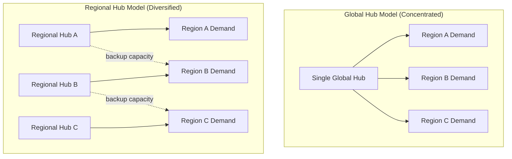

## Regionalization and Supply Base Diversification


### Definition and Scope

Regionalization is the strategic reconfiguration of a supply chain's sourcing, manufacturing, and distribution footprint away from concentrated, globally centralized nodes toward multiple geographically distinct regional clusters, each capable of serving demand within or near its own region. Supply base diversification is the related but distinct practice of deliberately expanding the number and geographic spread of qualified suppliers for a given input, category, or component, so that no single supplier, site, or country accounts for an outsized share of supply risk.

The two concepts are often paired because both are responses to the same underlying vulnerability: concentration risk. Regionalization addresses concentration at the network-topology level (where nodes are located and how they connect), while diversification addresses concentration at the supplier-relationship level (how many independent sources exist and how substitutable they are).

### Strategic Drivers

**Key Points**

- **Geopolitical risk**: Trade disputes, export controls, sanctions, and tariff volatility can abruptly cut off or tax a single-country supply lane. [Inference: the magnitude of this driver is context- and industry-dependent, since exposure varies by product classification and trade agreement coverage.]
- **Natural and climate disruption**: Floods, earthquakes, typhoons, and droughts cluster geographically; a single-region footprint inherits that region's disaster profile.
- **Pandemic and public health shocks**: COVID-19 demonstrated that even low-probability, high-impact events can simultaneously disrupt production, logistics, and labor availability across an entire concentrated region.
- **Logistics chokepoints**: Reliance on a small number of shipping lanes, canals, or ports (e.g., Suez, Panama, Malacca) creates single points of failure independent of the supplier base itself.
- **Cost volatility**: Freight rates, energy prices, and currency swings compound when long-haul, single-source lanes are the only option.
- **Regulatory and ESG pressure**: Buyers increasingly need visibility and compliance guarantees (labor standards, carbon footprint, conflict minerals) that are easier to audit and enforce with shorter, more diversified, and more regional supply relationships.
- **Demand-side responsiveness**: Regional production nodes shorten lead times and improve the ability to customize for local markets.

### Core Architectural Patterns

#### 1. Global-to-Regional Network Reconfiguration

The classic "hub-and-spoke" global model routes most production through one or two low-cost manufacturing hubs (historically often a single country) to serve worldwide demand. Regionalization restructures this into parallel regional hubs, each serving its own demand region.



The dotted "backup capacity" links represent cross-regional surge arrangements — a defining feature of mature regionalized networks: regions are self-sufficient under normal conditions but can absorb overflow demand or replace a disrupted peer region under stress.

#### 2. Tiered Supplier Diversification Matrix

Diversification is typically implemented per tier and per category, not uniformly across the whole supply base, because the cost of qualifying and maintaining redundant suppliers is nontrivial.

| Tier | Diversification Priority | Typical Approach |
| --- | --- | --- |
| Tier 1 (direct, critical components) | Highest | Dual- or multi-sourcing across ≥2 countries/regions |
| Tier 2 (sub-assemblies, specialized materials) | High for bottleneck items | Mapped and monitored; diversified selectively |
| Tier 3+ (raw materials, commodity inputs) | Variable | Diversified where geologically/commodity concentrated (e.g., rare earths) |
| Non-critical, low-risk commodity items | Low | Single-source acceptable; cost optimization prioritized over redundancy |

This prioritization is usually driven by a risk-segmentation exercise, most commonly a variant of the Kraljic Matrix, which classifies purchased items along two axes: **supply risk** and **profit/business impact**.

```mermaid
quadrantChart
    title Kraljic Matrix — Diversification Priority (svg_diagram)
    x-axis Low Supply Risk --> High Supply Risk
    y-axis Low Business Impact --> High Business Impact
    quadrant-1 Strategic (multi-source, deep partnership)
    quadrant-2 Bottleneck (diversify aggressively)
    quadrant-3 Non-critical (single-source, low priority)
    quadrant-4 Leverage (competitive bidding, moderate diversification)
```

Note: the marker above (`quadrantChart`) is Mermaid syntax shown for reference inside the fenced `plaintext` block per formatting rules; it is not rendered.

### Diversification Strategies

**Key Points**

- **Dual sourcing**: Maintaining two qualified suppliers for a single component, typically with a primary/secondary volume split (e.g., 70/30 or 60/40) so the secondary supplier stays "warm" (active tooling, current qualification, ongoing minimal volume) rather than purely on standby.
- **Multi-sourcing**: Extending dual sourcing to three or more suppliers, generally reserved for the highest-risk, highest-impact inputs.
- **Geographic diversification**: Ensuring alternate suppliers are not merely different legal entities but are located in different countries or regions with uncorrelated risk profiles (e.g., not all in the same seismic zone or under the same trade regime).
- **"China+1" / "Friend-shoring" / "Nearshoring"**: Industry-specific patterns where firms retain a primary low-cost country base while adding a second manufacturing location, often chosen for trade-agreement proximity (nearshoring) or geopolitical alignment (friend-shoring).
- **Supplier tiering with qualified backups**: Maintaining a bench of pre-qualified but non-active suppliers who can be activated on short notice — lower carrying cost than active dual sourcing, but with longer activation lead time.

### Regionalization Implementation Models

#### Regional Center of Gravity Analysis

Before restructuring a network, firms typically compute a demand-weighted "center of gravity" per region to determine optimal hub placement. A simplified weighted-center formula:

$$\bar{x} = \frac{\sum_{i=1}^{n} w_i x_i}{\sum_{i=1}^{n} w_i}, \quad \bar{y} = \frac{\sum_{i=1}^{n} w_i y_i}{\sum_{i=1}^{n} w_i}$$

where $w_i$ is the demand volume at location $i$, and $(x_i, y_i)$ are that location's coordinates. This identifies the geographic point that minimizes aggregate weighted transportation distance for a given region's demand, guiding where a new regional manufacturing or distribution hub should be sited.

#### Total Landed Cost Reassessment

Regionalization decisions cannot be justified on unit production cost alone; the standard analytical frame is Total Landed Cost (TLC):

$$TLC = C_{production} + C_{freight} + C_{duties} + C_{inventory\_carrying} + C_{risk\_adjusted\_disruption}$$

A regionalized, higher-unit-cost supplier can have a lower TLC than a cheaper but distant single source once freight, duty, buffer-inventory carrying cost, and the expected cost of disruption (probability × impact) are included. [Inference: exact disruption-cost quantification is inherently probabilistic and organization-specific; treat the $C_{risk\_adjusted\_disruption}$ term as a modeled estimate, not an observed figure.]

### Trade-offs and Constraints

**Key Points**

- **Cost premium**: Regional/diversified suppliers, especially newly qualified ones, frequently carry higher unit costs than a mature, scaled, single low-cost-country source until volume ramps.
- **Qualification overhead**: Each additional supplier requires audits, certifications, tooling investment, and quality validation — a recurring cost, not a one-time setup cost, since standards must be maintained.
- **Complexity and coordination cost**: More nodes and more suppliers increase planning, forecasting, and inventory-allocation complexity; ERP/MRP and S&OP processes must scale accordingly.
- **Loss of scale economies**: Splitting volume across multiple suppliers or plants can forfeit volume discounts and learning-curve efficiencies concentrated production would achieve.
- **Inventory duplication**: Regional hubs often require regionally held safety stock, increasing total working capital tied up in inventory.
- **Not a universal solution**: For genuinely single-source-only inputs (e.g., a component available from only one geological deposit or one patent holder), diversification may be technically infeasible regardless of strategic intent; the mitigation shifts to buffer inventory, long-term contracts, or substitute-material R&D.

### Risk Quantification Framework

A commonly used composite framing for prioritizing which items or lanes to regionalize/diversify first is expected disruption exposure:

$$Exposure = P(disruption) \times Impact \times \frac{1}{Substitutability}$$

Where $P(disruption)$ is the estimated probability of a supply interruption at that node over a defined horizon, $Impact$ is the business consequence (revenue at risk, downstream production stoppage cost), and $Substitutability$ is a factor representing how readily an alternate source could be activated (higher substitutability lowers effective exposure). [Inference: this is a synthesized simplified model reflecting standard supply-risk-management logic, not a single universally standardized formula; organizations calibrate weighting differently.]

### Illustrative Example

**Example**

A consumer electronics manufacturer sources a specialized semiconductor from a single fab in one country (100% concentration). After a regional trade disruption halts shipments for six weeks, the firm undertakes a diversification and regionalization program:

1. Qualifies a second fab in a different country/region for the same semiconductor, targeting a 65/35 primary/secondary volume split within 18 months.
2. Re-siting final assembly from one global plant into two regional assembly hubs (Region A and Region B), each sourcing from whichever fab is geographically or contractually closer.
3. Establishes a cross-region safety-stock buffer sized to cover the qualification lead time of activating the secondary fab at full volume, calculated as:

$$Buffer_{units} = D_{daily} \times (LT_{qualification} + LT_{transport}) \times SF$$

where $D_{daily}$ is average daily demand, $LT$ terms are lead times in days, and $SF$ is a safety factor (commonly 1.2–1.5 depending on demand variability). [Inference: the specific safety factor range reflects general inventory-planning convention rather than a fixed industry standard.]

4. Result: post-implementation, a comparable regional disruption event would affect an estimated 35% of semiconductor supply rather than 100%, and the affected region's assembly output could be partially rerouted to the unaffected regional hub.

### Governance and Monitoring

**Key Points**

- **Supplier risk scoring**: Ongoing (not one-time) scoring of each supplier and region on financial health, geopolitical exposure, single-point-of-failure status, and historical disruption frequency.
- **Multi-tier mapping**: Visibility must extend beyond Tier 1 suppliers to Tier 2/3, since a diversified Tier 1 base can still share a common, concentrated Tier 2 or Tier 3 chokepoint (a frequently underestimated risk).
- **Scenario planning and stress testing**: Periodic simulation of regional shutdown scenarios to validate that alternate capacity/suppliers can actually absorb the volume within acceptable lead times.
- **Dynamic rebalancing**: Volume allocation across regionalized/diversified sources is typically reviewed on a recurring cadence (quarterly/annually) and adjusted for cost, performance, and emerging risk signals rather than fixed permanently at initial design.

### Network Topology Reference Diagram

<svg xmlns="http://www.w3.org/2000/svg" viewBox="0 0 760 380" font-family="Arial, sans-serif">
<text x="380" y="24" font-size="16" font-weight="bold" text-anchor="middle">Regionalized, Diversified Supply Network (svg_diagram)</text>

<rect x="20" y="60" width="220" height="280" rx="8" fill="#eef4fb" stroke="#4a7fb5" stroke-width="1.5" />
<text x="130" y="80" font-size="13" font-weight="bold" text-anchor="middle">Region A</text>
<circle cx="70" cy="120" r="18" fill="#7fb3e8" stroke="#2c5b8a" />
<text x="70" y="124" font-size="10" text-anchor="middle">Sup A1</text>
<circle cx="180" cy="120" r="18" fill="#7fb3e8" stroke="#2c5b8a" />
<text x="180" y="124" font-size="10" text-anchor="middle">Sup A2</text>
<rect x="95" y="190" width="90" height="40" rx="6" fill="#f5c26b" stroke="#a9711c" />
<text x="140" y="214" font-size="11" text-anchor="middle">Hub A</text>
<line x1="70" y1="138" x2="130" y2="190" stroke="#555" stroke-width="1.5" />
<line x1="180" y1="138" x2="150" y2="190" stroke="#555" stroke-width="1.5" />
<rect x="95" y="280" width="90" height="36" rx="6" fill="#cfe8cf" stroke="#3f7d3f" />
<text x="140" y="302" font-size="11" text-anchor="middle">Demand A</text>
<line x1="140" y1="230" x2="140" y2="280" stroke="#555" stroke-width="1.5" />

<rect x="270" y="60" width="220" height="280" rx="8" fill="#eef4fb" stroke="#4a7fb5" stroke-width="1.5" />
<text x="380" y="80" font-size="13" font-weight="bold" text-anchor="middle">Region B</text>
<circle cx="320" cy="120" r="18" fill="#7fb3e8" stroke="#2c5b8a" />
<text x="320" y="124" font-size="10" text-anchor="middle">Sup B1</text>
<circle cx="430" cy="120" r="18" fill="#7fb3e8" stroke="#2c5b8a" />
<text x="430" y="124" font-size="10" text-anchor="middle">Sup B2</text>
<rect x="345" y="190" width="90" height="40" rx="6" fill="#f5c26b" stroke="#a9711c" />
<text x="390" y="214" font-size="11" text-anchor="middle">Hub B</text>
<line x1="320" y1="138" x2="380" y2="190" stroke="#555" stroke-width="1.5" />
<line x1="430" y1="138" x2="400" y2="190" stroke="#555" stroke-width="1.5" />
<rect x="345" y="280" width="90" height="36" rx="6" fill="#cfe8cf" stroke="#3f7d3f" />
<text x="390" y="302" font-size="11" text-anchor="middle">Demand B</text>
<line x1="390" y1="230" x2="390" y2="280" stroke="#555" stroke-width="1.5" />

<rect x="520" y="60" width="220" height="280" rx="8" fill="#eef4fb" stroke="#4a7fb5" stroke-width="1.5" />
<text x="630" y="80" font-size="13" font-weight="bold" text-anchor="middle">Region C</text>
<circle cx="570" cy="120" r="18" fill="#7fb3e8" stroke="#2c5b8a" />
<text x="570" y="124" font-size="10" text-anchor="middle">Sup C1</text>
<circle cx="680" cy="120" r="18" fill="#7fb3e8" stroke="#2c5b8a" />
<text x="680" y="124" font-size="10" text-anchor="middle">Sup C2</text>
<rect x="595" y="190" width="90" height="40" rx="6" fill="#f5c26b" stroke="#a9711c" />
<text x="640" y="214" font-size="11" text-anchor="middle">Hub C</text>
<line x1="570" y1="138" x2="630" y2="190" stroke="#555" stroke-width="1.5" />
<line x1="680" y1="138" x2="650" y2="190" stroke="#555" stroke-width="1.5" />
<rect x="595" y="280" width="90" height="36" rx="6" fill="#cfe8cf" stroke="#3f7d3f" />
<text x="640" y="302" font-size="11" text-anchor="middle">Demand C</text>
<line x1="640" y1="230" x2="640" y2="280" stroke="#555" stroke-width="1.5" />

<line x1="185" y1="205" x2="345" y2="205" stroke="#a33" stroke-width="1.5" stroke-dasharray="6,4" />
<line x1="435" y1="205" x2="595" y2="205" stroke="#a33" stroke-width="1.5" stroke-dasharray="6,4" />
<text x="265" y="198" font-size="9" fill="#a33" text-anchor="middle">backup capacity</text>
<text x="515" y="198" font-size="9" fill="#a33" text-anchor="middle">backup capacity</text>
</svg>

**Related Topics**

- Kraljic Matrix and strategic sourcing segmentation
- Nearshoring, friend-shoring, and "China+1" strategic sourcing models
- Total Landed Cost (TLC) modeling in network design
- Multi-tier supply chain mapping and visibility platforms
- Safety stock optimization under supply (vs. demand) uncertainty
- Supplier qualification and onboarding lifecycle management
- Center-of-gravity and network optimization modeling
- Scenario planning and digital twin simulation for supply chain stress testing
- Trade compliance, tariff engineering, and free trade agreement utilization
- ESG and conflict-minerals traceability in multi-tier sourcing