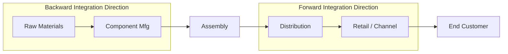

## Vertical Integration as a Resilience Lever

### Definition and Scope

Vertical integration is the strategic expansion of a firm's ownership or control across successive stages of its value chain — moving upstream toward raw materials and component production, and/or downstream toward distribution, retail, or end-customer channels — rather than relying on external, arm's-length suppliers or intermediaries for those stages. As a resilience lever specifically, vertical integration is evaluated not primarily for its traditional rationale (cost capture, margin control, differentiation) but for its capacity to reduce a firm's exposure to disruption at supplier or channel nodes it does not control.

The core resilience logic is straightforward: a stage of the value chain that the firm owns and operates cannot independently choose to allocate capacity elsewhere, renegotiate terms unilaterally, exit the relationship, or fail without direct visibility — risks inherent to any externalized (outsourced) relationship.

### Directional Taxonomy

**Key Points**

- **Backward (upstream) integration**: Acquiring or building capability in raw material extraction, component manufacturing, or sub-assembly production that was previously purchased from external suppliers.
- **Forward (downstream) integration**: Acquiring or building capability in distribution, logistics, retail, or direct customer channels that were previously handled by external partners (distributors, wholesalers, retailers).
- **Balanced/full integration**: Ownership spanning from raw material through to end-customer delivery — rare in practice due to capital intensity and capability breadth required, but occasionally pursued for the single most strategically critical value chain.
- **Partial (quasi) integration**: A hybrid position — minority equity stakes, long-term exclusive contracts, joint ventures, or captive-but-legally-separate supplier arrangements — that secures many resilience benefits of ownership without full capital commitment.

### Resilience Mechanisms

#### 1. Elimination of External Allocation Risk

When a supplier is external, that supplier allocates constrained capacity across all of its customers according to its own priorities (typically largest accounts, highest-margin accounts, or contractual priority tiers) during a shortage. A vertically integrated firm removes this allocation decision from an external party's hands entirely for the integrated stage.

#### 2. Information and Visibility Continuity

Owned operations provide direct, real-time operational visibility (production status, quality issues, capacity utilization, inventory levels) that is otherwise mediated through supplier reporting, which can be delayed, incomplete, or strategically filtered. This shortens the detection-to-response time for emerging disruptions.

#### 3. Contractual and Legal Risk Removal

External supply relationships carry counterparty risk: contract breach, bankruptcy, force majeure invocation, or unilateral renegotiation. Ownership converts these into internal operational risks, which are generally more controllable, though not eliminated (labor disputes, internal quality failures, and capital constraints remain).

#### 4. Capacity Prioritization Authority

An integrated firm can direct its owned capacity toward its own highest-priority demand during a broader industry-wide shortage (e.g., a semiconductor shortage), rather than competing for allocation against other buyers of an external merchant supplier.

### Trade-offs and Constraints

**Key Points**

- **Capital intensity**: Vertical integration typically requires substantial upfront and ongoing capital expenditure (facilities, equipment, workforce) compared to variable-cost outsourcing arrangements.
- **Loss of specialization advantage**: External specialist suppliers often achieve superior technology, scale economies, and cost efficiency in their specific process step through focused investment and cross-customer volume aggregation — advantages an integrated internal operation may not replicate.
- **Reduced flexibility**: Owned capacity is a fixed commitment; it cannot be as easily reallocated, resized, or exited as a contractual relationship when demand shifts or technology changes.
- **New internal single points of failure**: Integration does not eliminate concentration risk — it relocates it. A single owned facility for a critical stage can become as much a single point of failure as a single external supplier was, unless the integration itself is executed with redundancy (multiple owned sites).
- **Organizational and capability complexity**: Operating a new stage of the value chain (e.g., a manufacturer moving into raw material extraction) requires operational competencies, management systems, and talent the firm may not possess, with a meaningful execution-risk period during buildout or acquisition integration.
- **Opportunity cost**: Capital deployed toward vertical integration is unavailable for other resilience levers (diversification, buffer inventory, digital visibility tooling) or for core business investment.

[Inference: the relative weighting of these trade-offs against the resilience benefit is highly firm- and industry-specific; no general formula reliably determines when integration outperforms alternative resilience levers, since it depends on capital availability, the firm's existing operational competency, and the specific risk profile of the stage being considered.]

### Vertical Integration vs. Alternative Resilience Levers

| Dimension | Vertical Integration | Supply Base Diversification | Strategic (Buffer) Inventory |
| --- | --- | --- | --- |
| Capital requirement | High (fixed, long-term) | Moderate (qualification cost, ongoing) | Moderate (working capital) |
| Speed of implementation | Slow (build/acquire, often years) | Moderate (qualification cycles, months) | Fast (procurement lead time only) |
| Flexibility to reverse | Low (divestiture is costly/slow) | Moderate | High (drawdown is immediate) |
| Addresses allocation risk | Yes, directly | Partially (redundant sources) | Yes, temporarily (buffer duration only) |
| Addresses quality/capability risk | Yes, if internal capability is strong | Depends on supplier quality | No |
| Ongoing operating burden | High (new business unit to run) | Moderate (multi-supplier management) | Low-moderate (carrying cost, obsolescence risk) |

### Decision Framework: When Integration Is the Appropriate Lever

Vertical integration as a resilience response is generally most justified when several of the following conditions hold simultaneously, drawing on the same strategic/bottleneck classification used in supply base diversification decisions (Kraljic-type segmentation):

1. The input or channel stage is classified as **strategic** or **bottleneck** (high business impact, high supply risk) — not routine/leverage items, where integration capital is poorly justified.
2. **Supplier scarcity** is structural rather than temporary — i.e., few or no credible alternate external suppliers exist or could be qualified within an acceptable timeframe, making diversification an inadequate substitute.
3. The firm possesses or can credibly acquire the **operational capability** to run the integrated stage competitively, rather than merely to insource it defensively.
4. The disruption risk at that stage is **recurring or structural** (e.g., persistent geopolitical exposure, chronic capacity tightness in an industry) rather than a one-time shock better addressed with a temporary buffer.
5. **Capital availability** and balance-sheet capacity support a long-duration, illiquid investment without compromising the firm's overall financial resilience — integrating for supply resilience while creating balance-sheet fragility is self-defeating.

$$IntegrationJustification = f(StrategicImportance,\ SupplierScarcity,\ CapabilityFit,\ RiskPersistence,\ CapitalCapacity)$$

[Inference: this is a qualitative synthesis of standard strategic-sourcing and corporate-strategy decision logic, not a formalized scoring formula from a single canonical source; organizations implementing this typically build a weighted scorecard suited to their own capital constraints and risk tolerance.]

### Illustrative Example

**Example**

An automotive OEM depends on a single external supplier for advanced battery cells, a component classified as strategic (high impact, high disruption risk) due to concentrated global cell-manufacturing capacity and recurring allocation shortages across the industry.

1. **Assessment**: Diversification alone is judged insufficient because qualified alternate cell suppliers are scarce industry-wide and all draw from the same constrained upstream raw-material pool (e.g., lithium, cobalt) — meaning even a second external supplier would face correlated, not independent, risk.
2. **Action**: The OEM enters a joint venture to co-own a battery cell "gigafactory," combining its own capital and demand commitment with a specialist manufacturing partner's process expertise — a partial/balanced integration approach that captures resilience benefit without requiring the OEM to build deep battery-chemistry competency from scratch.
3. **Redundancy within integration**: Rather than building one large owned facility (which would simply relocate the single-point-of-failure risk), the OEM commits to two geographically distinct joint-venture facilities in different regions, aligning the integration decision with regionalization principles.
4. **Result**: The OEM secures a guaranteed allocation floor of internally directed cell capacity, insulated from external customer-allocation decisions during industry-wide shortages, while retaining some external purchasing for non-critical volume to preserve market-price discipline and flexibility.

### Governance Considerations

**Key Points**

- **Make-vs-buy review cadence**: Vertical integration decisions warrant periodic re-evaluation (not one-time), since supplier market conditions, technology maturity, and the firm's own capability can shift the calculus over a multi-year horizon.
- **Internal supplier accountability**: An owned upstream or downstream unit should typically still be held to competitive performance benchmarks (cost, quality, delivery) against external market alternatives, to avoid the integrated unit becoming a protected underperformer.
- **Exit and divestiture planning**: Because integration is difficult to reverse quickly, resilience-driven integration decisions benefit from an explicit contingency plan for divestiture or conversion to external sourcing if the original risk driver diminishes.
- **Capital structure impact monitoring**: Ongoing tracking of how integration-related fixed assets and debt affect the firm's overall financial flexibility, since impaired financial resilience can itself become a disruption vulnerability.

### Network Position Reference Diagram

<svg xmlns="http://www.w3.org/2000/svg" viewBox="0 0 760 320" font-family="Arial, sans-serif">
<text x="380" y="24" font-size="16" font-weight="bold" text-anchor="middle">Vertical Integration Footprint (svg_diagram)</text>

<line x1="60" y1="160" x2="700" y2="160" stroke="#999" stroke-width="2" />

<circle cx="90" cy="160" r="26" fill="#f5c26b" stroke="#a9711c" stroke-width="1.5" />
<text x="90" y="164" font-size="9" text-anchor="middle">Raw Mat.</text>
<circle cx="230" cy="160" r="26" fill="#f5c26b" stroke="#a9711c" stroke-width="1.5" />
<text x="230" y="164" font-size="9" text-anchor="middle">Component</text>
<circle cx="370" cy="160" r="26" fill="#7fb3e8" stroke="#2c5b8a" stroke-width="1.5" />
<text x="370" y="164" font-size="9" text-anchor="middle">Assembly</text>
<circle cx="510" cy="160" r="26" fill="#7fb3e8" stroke="#2c5b8a" stroke-width="1.5" />
<text x="510" y="164" font-size="9" text-anchor="middle">Distribution</text>
<circle cx="650" cy="160" r="26" fill="#7fb3e8" stroke="#2c5b8a" stroke-width="1.5" />
<text x="650" y="164" font-size="9" text-anchor="middle">Retail/Ch.</text>

<rect x="55" y="115" width="210" height="90" rx="10" fill="none" stroke="#3f7d3f" stroke-width="2" stroke-dasharray="8,4" />
<text x="160" y="105" font-size="11" fill="#3f7d3f" font-weight="bold" text-anchor="middle">Owned (Backward Integrated)</text>

<rect x="345" y="115" width="50" height="90" rx="10" fill="none" stroke="#333" stroke-width="2" />
<text x="370" y="105" font-size="11" font-weight="bold" text-anchor="middle">Core Firm</text>

<text x="580" y="105" font-size="11" fill="#a33" text-anchor="middle">External (Non-integrated)</text>

<rect x="485" y="115" width="190" height="90" rx="10" fill="none" stroke="#a33" stroke-width="2" stroke-dasharray="3,3" />

</svg>

**Related Topics**

- Make-vs-buy decision analysis and total cost of ownership modeling
- Joint ventures and partial equity integration as hybrid resilience structures
- Capacity allocation dynamics during industry-wide component shortages
- Capital structure and financial resilience under fixed-asset commitment
- Kraljic Matrix and strategic sourcing segmentation (cross-reference to diversification strategy)
- Regionalization and multi-site redundancy within integrated operations
- Mergers, acquisitions, and post-integration operational capability building
- Supplier relationship management vs. internal supplier performance benchmarking
- Divestiture and exit planning for reversible resilience investments