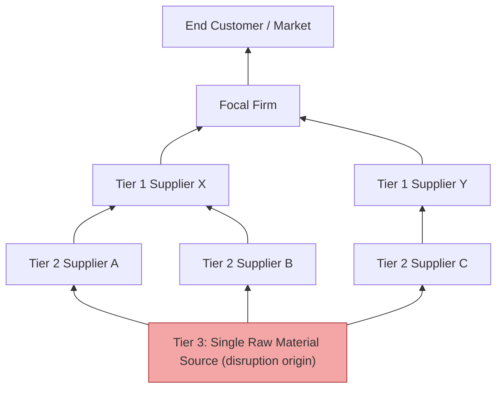

## Lessons from Major Tiered Supply Chain Disruptions

### Definition and Scope

This topic examines documented, real-world disruption events that propagated through multi-tier supply chains, extracting the structural and process-level lessons they revealed about tiered supply chain vulnerability. A "tiered" disruption is distinguished from a simple single-supplier failure by its propagation characteristic: the initiating event occurs at one tier (often Tier 2, 3, or deeper — a sub-supplier the focal firm may not even have direct visibility into) and cascades upward or outward to affect Tier 1 suppliers and ultimately the focal firm and its customers, frequently causing impact disproportionate to the initiating firm's size or the focal firm's awareness of its existence.

### Why Deep-Tier Disruptions Are Structurally Distinct

**Key Points**

- **Visibility decay with tier depth**: Focal firms typically maintain strong visibility into Tier 1 (direct contractual relationships) but rapidly declining visibility into Tier 2 and virtually none into Tier 3+, even though disruption probability does not decline correspondingly.
- **Hidden concentration**: Multiple, seemingly diversified Tier 1 suppliers can share a common, unknown Tier 2 or Tier 3 source — meaning nominal supplier diversification at Tier 1 provides no actual resilience if the deeper tier is concentrated.
- **Amplification (bullwhip-adjacent) effects**: A disruption's impact can grow as it propagates upstream-to-downstream through inventory policies, order batching, and panic-buying reactions at each tier, producing demand and shortage signals disproportionate to the original event.
- **Detection lag**: Because deep-tier visibility is limited, firms often become aware of a disruption only when its effects surface at Tier 1 (a shipment fails to arrive) rather than at the point of origin, compressing available response time.

The diagram illustrates a common failure pattern documented across multiple real disruptions: apparent Tier 1 redundancy (Suppliers X and Y) masking hidden Tier 3 concentration, so a single upstream event affects both nominally independent paths.

### Case Study 1: Automotive Semiconductor Shortage (2020–2022)

**Key Points**

- **Origin and mechanism**: Automotive OEMs, anticipating a pandemic-driven demand collapse in early 2020, cancelled semiconductor orders. Semiconductor foundries reallocated freed capacity to consumer electronics, which saw demand surge instead. When automotive demand rebounded faster than anticipated, OEMs found themselves at the back of the capacity-allocation queue behind higher-volume, higher-priority consumer electronics customers.
- **Structural lesson — demand forecasting under regime uncertainty**: The disruption originated not from a physical supply failure but from a demand-signal misjudgment during an unprecedented period, illustrating that forecasting-driven order cancellation can itself create supply risk independent of any physical disruption.
- **Structural lesson — tiered dependency invisibility**: Automotive OEMs typically had no direct commercial relationship with semiconductor foundries; chips were purchased through Tier 1/Tier 2 electronics suppliers, meaning OEMs had negligible visibility into and negotiating leverage over foundry capacity allocation decisions affecting their own production.
- **Structural lesson — capacity fungibility asymmetry**: Automotive-grade semiconductors often use older process nodes with limited fabrication capacity that cannot be quickly repurposed from newer-node consumer chip production, meaning the shortage could not be resolved simply by shifting existing capacity even when foundries wanted to help.
- **Response pattern observed industry-wide**: Several automotive manufacturers subsequently pursued direct, longer-term supply agreements with semiconductor foundries — a partial vertical/relationship integration bypassing the traditional Tier 1 intermediary layer specifically to restore visibility and priority.

### Case Study 2: Suez Canal Blockage (2021)

**Key Points**

- **Origin and mechanism**: The container ship Ever Given ran aground in the Suez Canal, blocking a chokepoint carrying a substantial share of global east-west maritime trade, for approximately six days.
- **Structural lesson — logistics-node concentration is a distinct risk category from supplier concentration**: This event demonstrated that supply base diversification and regionalization address supplier-relationship risk but do not address physical chokepoint risk — a firm can have a fully diversified, multi-region supplier base and still be disrupted if shipments from all regions transit the same physical corridor.
- **Structural lesson — queuing/backlog amplification**: The direct blockage lasted days, but resulting port congestion, container repositioning imbalances, and shipping schedule disruption extended impact for weeks to months beyond the initiating event — illustrating that disruption duration at the origin point substantially understates total recovery time.
- **Response pattern observed**: Increased firm interest in alternate routing options, multi-modal contingency planning (rail, air-freight substitution for time-critical goods), and evaluation of overland or alternate-canal routing feasibility for future contingency, though these alternatives typically carry meaningfully higher cost or lower capacity than the primary route.

### Case Study 3: Regional Natural Disaster Impact on Tiered Electronics/Automotive Supply (2011 pattern)

**Key Points**

- **Origin and mechanism**: A major earthquake and tsunami in a concentrated manufacturing region disrupted numerous specialized component manufacturers — many operating as sole-source or near-sole-source global suppliers for specific electronic components and automotive parts despite their small individual size and low visibility to end-brand firms.
- **Structural lesson — small-supplier, high-impact concentration**: This pattern revealed that supply chain risk does not correlate with supplier size or prominence; a small, specialized Tier 2/3 supplier producing a low-cost but functionally irreplaceable component can halt production for much larger downstream firms.
- **Structural lesson — the mapping gap**: Many affected focal firms discovered they did not know a given disrupted supplier was even part of their supply chain until the disruption's downstream effects surfaced, because that supplier was several tiers removed and embedded within a sub-assembly purchased as a "black box" from a Tier 1 supplier.
- **Response pattern observed**: This event is widely credited with accelerating enterprise adoption of formal multi-tier supply chain mapping initiatives — systematically identifying and documenting Tier 2, 3, and beyond suppliers for critical components, rather than treating supply chain visibility as a Tier-1-only exercise.

[Inference: specific event names, dates, and quantitative impact figures for each case above reflect general, well-documented industry knowledge; exact statistics (duration, dollar impact, unit shortfall) vary across sources and should be treated as illustrative rather than precisely cited figures without independent verification for any specific downstream use, such as an exam answer requiring exact numbers.]

### Synthesized Cross-Case Lessons

| Lesson | Disruption Type It Was Drawn From | Structural Mitigation Implied |
| --- | --- | --- |
| Deep-tier visibility gaps delay detection and response | Earthquake/tsunami component disruption | Multi-tier mapping programs (Tier 2/3+ identification) |
| Nominal Tier 1 diversification can mask deeper-tier concentration | Multiple cases | Concentration analysis extended beyond Tier 1 |
| Physical/logistics chokepoints are a risk category distinct from supplier risk | Suez Canal blockage | Route diversification, multi-modal contingency planning |
| Demand-signal misjudgment can create self-inflicted supply risk | Semiconductor shortage | Scenario-based (not point-estimate) demand forecasting |
| Capacity is not always fungible across product generations/specifications | Semiconductor shortage | Long-term capacity commitments for hard-to-substitute inputs |
| Initiating event duration understates total disruption duration | Suez Canal blockage | Buffer sizing based on recovery-tail length, not just event length |
| Small/low-visibility suppliers can carry disproportionate criticality | Earthquake/tsunami disruption | Criticality assessment independent of supplier size or spend volume |

### Formal Risk Propagation Model

A simplified representation of how disruption impact compounds across tiers, incorporating both direct probability and amplification at each hop:

$$Impact_{focal} = Impact_{origin} \times \prod_{k=1}^{n} A_k$$

where $Impact_{origin}$ is the magnitude of the initiating disruption at the deepest affected tier, $n$ is the number of tiers between the origin and the focal firm, and $A_k$ is an amplification factor at each tier $k$ (values greater than 1 represent compounding/bullwhip-type amplification through inventory and ordering behavior; values less than 1 represent dampening through buffer absorption). [Inference: this is a conceptual/pedagogical simplification illustrating propagation logic, not a validated predictive formula with empirically established $A_k$ coefficients — real propagation dynamics are typically modeled with more complex network simulation or system dynamics approaches.]

### Diagnostic Framework Derived from These Cases

**Example**

Applying the cross-case lessons as a diagnostic checklist to a hypothetical firm's supply chain:

1. **Tier depth audit**: Can the firm identify its Tier 2 and Tier 3 suppliers for its top 20% highest-impact components (by revenue/production dependency, not spend)? If not, this replicates the visibility gap seen in the earthquake/tsunami case.
2. **Hidden concentration check**: For components with multiple qualified Tier 1 suppliers, has the firm verified those suppliers do not share a common deeper-tier source? If unverified, nominal diversification may be illusory.
3. **Chokepoint dependency mapping**: Are multiple, geographically diverse suppliers nonetheless dependent on a single logistics corridor, port, or mode? If so, supplier diversification alone will not mitigate a chokepoint event like the Suez blockage.
4. **Forecast-driven order behavior review**: Does the firm's demand planning process include scenario ranges for low-probability, high-impact regime shifts, or does it rely on point forecasts that could trigger cancellation-then-scramble cycles similar to the semiconductor shortage pattern?
5. **Capacity substitutability assessment**: For critical inputs, has the firm confirmed whether alternate supply could actually be produced with existing global capacity, or does it require dedicated, non-fungible capacity that cannot be quickly reallocated?

### Governance Implications

**Key Points**

- **Multi-tier mapping as a standing capability, not a one-time project**: The supplier landscape changes continuously (M&A, capacity shifts, new sourcing decisions by Tier 1 suppliers); mapping initiatives require recurring refresh cycles to remain accurate.
- **Cross-functional ownership**: Effective response to tiered disruptions documented in these cases typically required coordination across procurement, logistics, demand planning, and executive risk functions simultaneously — siloed ownership was repeatedly identified as a factor slowing response.
- **Scenario-based contingency planning over static risk registers**: A static list of known risks proved insufficient in these cases because the specific triggering events (a ship grounding, a tsunami, a demand misjudgment) were each individually low-probability; the more durable lesson was building general propagation-response capability (rapid mapping, alternate routing evaluation, flexible allocation) rather than only planning for the last disruption's specific cause.

**Related Topics**

- Multi-tier supply chain mapping and Tier 2/3 visibility platforms
- Bullwhip effect and demand signal amplification across supply chain echelons
- Logistics chokepoint risk and multi-modal routing contingency planning
- Scenario planning and digital twin simulation for disruption stress testing
- Regionalization and supply base diversification (structural mitigation cross-reference)
- Vertical integration as a resilience lever (structural mitigation cross-reference)
- Business continuity planning and disruption recovery-time metrics
- Supplier criticality assessment independent of spend-based segmentation