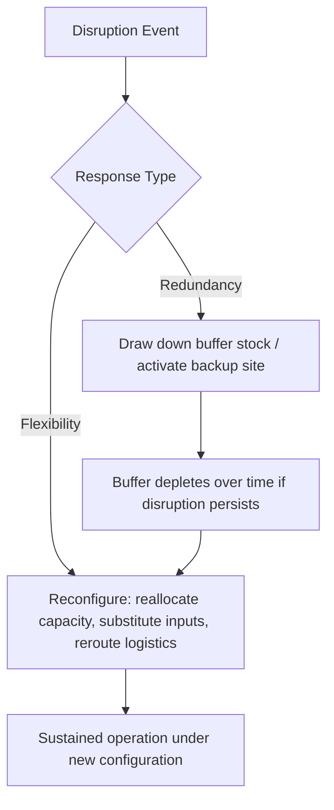
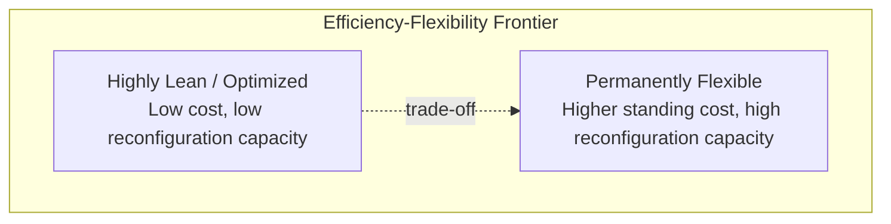

## Permanent Flexibility as an Operating Model

### Definition and Scope

Permanent flexibility as an operating model refers to the deliberate, structural embedding of adaptive capacity into a supply chain's design as a standing operational characteristic, rather than as a temporary crisis response that is dismantled once a specific disruption passes. Where earlier resilience levers (regionalization, diversification, buffer inventory, vertical integration) address specific risk vectors, permanent flexibility is a higher-order operating philosophy: the supply chain is architected from the outset to reconfigure itself continuously and cost-effectively in response to whatever disruption or demand shift emerges, including disruptions not specifically anticipated.

The distinguishing feature versus one-off resilience investments is durability of the adaptive capability itself — the goal is not to have correctly predicted and pre-solved a specific known risk, but to have built organizational, contractual, and technical mechanisms that can absorb and respond to unknown, novel disruptions on an ongoing basis.

### Flexibility vs. Redundancy: A Core Distinction

**Key Points**

- **Redundancy** (buffer inventory, dual sourcing, backup facilities) reduces disruption impact by maintaining excess capacity or stock that is drawn down when needed — it is a stock-based, largely static response requiring capital to be held idle in normal conditions.
- **Flexibility** reduces disruption impact by enabling rapid *reconfiguration* of existing resources — reallocating production across plants, substituting components, shifting suppliers, or redirecting logistics flows — without necessarily requiring pre-positioned excess capacity.
- The two are complementary, not substitutes: redundancy provides an immediate buffer during initial response, while flexibility enables sustained adaptation once the buffer is exhausted or if the disruption is prolonged or of an unanticipated type.
- [Inference: the relative cost-efficiency of flexibility versus redundancy strategies is context-dependent — flexibility mechanisms (e.g., flexible manufacturing systems, modular product design) often carry their own upfront investment and ongoing complexity cost, so "flexibility is cheaper than redundancy" is not a universal claim, only true under specific conditions where reconfiguration cost is low relative to idle-capacity carrying cost.]

### Structural Enablers of Permanent Flexibility

#### 1. Modular Product and Process Design

Designing products and manufacturing processes around interchangeable, standardized modules or components reduces the switching cost of substituting an alternate supplier, material, or production line, because fewer downstream dependencies are tightly coupled to a single specific input's exact specification.

#### 2. Flexible Manufacturing Systems (FMS)

Production equipment and lines capable of being reconfigured — through software-defined tooling, modular fixtures, or multi-product capable equipment — to produce different products or accept different input specifications without extended retooling downtime. This allows capacity to be redirected across product lines or specifications in response to shifting availability or demand.

#### 3. Flexible Contracting Structures

**Key Points**

- **Capacity options contracts**: Paying suppliers a premium to reserve the *right* (not obligation) to draw additional capacity on short notice, providing surge flexibility without committing to purchase volume that may not be needed.
- **Volume flexibility clauses**: Standard supply contracts written with wide allowable variance bands (e.g., ±30% of forecast volume) rather than fixed-volume commitments, reducing friction when demand or supply conditions shift.
- **Short-duration, renewable contracts**: Deliberately shorter contract terms with structured renewal/renegotiation points, trading some long-term price certainty for the ability to reassess and adjust supplier relationships more frequently than a multi-year fixed contract would allow.

#### 4. Workforce and Labor Flexibility

Cross-training programs enabling workers to move across production lines or facility functions, and flexible labor arrangements (temporary staffing pools, flexible shift structures) that allow labor capacity to scale with reconfigured production needs.

#### 5. Digital Visibility and Decision Infrastructure

Real-time data systems (control towers, integrated planning platforms) that provide continuous visibility into supply, demand, and capacity status across the network are a prerequisite for flexibility to function in practice — reconfiguration decisions require current information to be made quickly and correctly. [Behavior of specific commercial control-tower or planning-platform software may vary by vendor and implementation; treat platform-specific capability claims as vendor-dependent rather than universal.]

#### 6. Postponement (Delayed Differentiation)

Structuring production so that generic, undifferentiated components or sub-assemblies are produced and held in a common form as long as possible, with final product differentiation (configuration, localization, final assembly) delayed until closer to the point of actual demand signal. This allows a shared upstream production base to flexibly serve multiple downstream demand patterns without needing to have correctly forecast the exact final-product mix in advance.

$$Postponement\ Point = \arg\max_{p \in Process\ Stages} \left( \frac{Flexibility\ Gain(p)}{Cost\ of\ Delay(p)} \right)$$

where the postponement point $p$ is chosen to maximize flexibility benefit relative to the cost of holding inventory in a less-differentiated (generic) state longer. [Inference: this is a conceptual optimization framing of standard postponement strategy logic, not a single standardized formula; in practice this decision is typically made through scenario comparison rather than closed-form optimization.]

### Organizational and Governance Enablers

**Key Points**

- **Decision-rights decentralization**: Permanent flexibility requires that reconfiguration decisions (reallocating capacity, switching suppliers, adjusting logistics routing) can be made at an operational level with sufficient speed, rather than requiring slow, centralized approval chains — a governance design choice, not just a technical one.
- **Standing cross-functional response capability**: Rather than assembling an ad hoc crisis team after each disruption, organizations building permanent flexibility maintain an ongoing cross-functional capability (procurement, operations, logistics, planning) with pre-established protocols for evaluating and executing reconfiguration options.
- **Continuous scenario rehearsal**: Regular (not only post-crisis) stress testing and simulation exercises that exercise the flexibility mechanisms themselves, ensuring the organizational muscle for rapid reconfiguration remains current rather than atrophying between actual disruptions.
- **Metrics and incentive alignment**: Standard efficiency-focused KPIs (unit cost, inventory turns, utilization) can implicitly penalize flexibility investments, which often carry a cost premium or lower utilization by design; sustaining permanent flexibility as an operating model typically requires deliberately incorporating resilience-oriented metrics alongside efficiency metrics.

### The Efficiency-Flexibility Trade-off

Permanent flexibility as an operating model represents a durable strategic choice to hold a different point on the efficiency-flexibility frontier than a purely lean, single-configuration-optimized supply chain would occupy.

This trade-off is not resolved once; it is a continuous operating posture requiring the organization to accept a structurally different cost baseline (lower peak efficiency under normal, undisrupted conditions) in exchange for materially better performance under disrupted conditions across a wide, non-specific range of possible future disruptions.

### Illustrative Example

**Example**

A consumer packaged goods manufacturer redesigns its operating model around permanent flexibility rather than responding to disruptions ad hoc:

1. **Modular formulation**: Product formulations are redesigned so that multiple approved raw material sources can be substituted within defined tolerance ranges without requiring regulatory or quality re-approval each time — reducing the switching cost when a specific input becomes unavailable.
2. **Flexible packaging lines**: Manufacturing lines are retrofitted with quick-changeover tooling capable of running multiple SKU formats, allowing capacity to be redirected across product variants based on which raw materials or components are currently available.
3. **Options-based capacity contracts**: Rather than fixed-volume annual contracts, the firm negotiates standing options with a pool of pre-qualified co-packers, paying a retainer for the right to activate additional production capacity within a defined notice period.
4. **Standing network control tower**: A continuously staffed planning function monitors supply, demand, and logistics signals across the network and holds pre-authorized decision rights to reallocate production and rerouting within defined parameters, without requiring executive sign-off for each individual reconfiguration.
5. **Result**: When a specific raw material supplier experiences an unplanned outage, the firm reformulates the affected product using an approved alternate input, shifts production of that SKU to a line with available changeover capacity, and activates additional co-packer capacity — a reconfiguration executed within days, without having specifically pre-planned for that exact disruption scenario in advance.

### Comparison: Crisis-Driven vs. Permanent Flexibility Operating Models

| Dimension | Crisis-Driven (Temporary) Response | Permanent Flexibility (Standing) Model |
| --- | --- | --- |
| Trigger for building capability | After a specific disruption occurs | Built proactively, independent of any single event |
| Scope of protection | Typically narrow — addresses the specific risk just experienced | Broad — designed to absorb a wide range of unanticipated disruption types |
| Organizational capability | Ad hoc team assembled reactively | Standing cross-functional capability, continuously maintained |
| Cost profile | Spike in cost during/after crisis, often reverts afterward | Structurally elevated baseline cost, sustained continuously |
| Decision speed | Often slow initially (learning curve, approval friction) | Fast by design (pre-established decision rights and protocols) |
| Risk of atrophy | High — capability often dismantled once crisis passes | Lower, if reinforced through continuous rehearsal and metrics alignment |

### Constraints and Critiques

**Key Points**

- **Sustained cost commitment**: Because permanent flexibility is maintained continuously rather than activated only when needed, it imposes an ongoing cost even during long periods without disruption — a commitment that requires sustained organizational and financial buy-in, which can erode over time as memory of past disruptions fades.
- **Diminishing returns and over-flexibility risk**: Beyond a certain point, additional flexibility investment (excess modularity, excessive contract optionality, excessive cross-training) can add complexity and cost without proportionate resilience benefit; the appropriate degree of flexibility is bounded by the firm's actual risk exposure, not unlimited.
- **Measurement difficulty**: Unlike redundancy (whose value can be somewhat estimated via buffer-coverage calculations), the value of flexibility is harder to quantify in advance since it depends on the nature of future, unanticipated disruptions — making the business case for sustained investment inherently harder to justify with precise ROI figures. [Inference: this measurement difficulty is a widely noted characteristic of flexibility-oriented resilience investment in general management literature, not a claim about any specific organization's measurement practice.]

**Related Topics**

- Flexible manufacturing systems (FMS) and quick-changeover tooling design
- Postponement and delayed differentiation strategy
- Options contracts and flexible supply agreement structures
- Control tower architectures for real-time supply chain visibility
- Regionalization and supply base diversification (complementary resilience lever)
- Vertical integration as a resilience lever (complementary resilience lever)
- Scenario planning and continuous disruption stress-testing practices
- Efficiency-resilience trade-off frameworks in operations strategy
- Cross-training and workforce flexibility program design