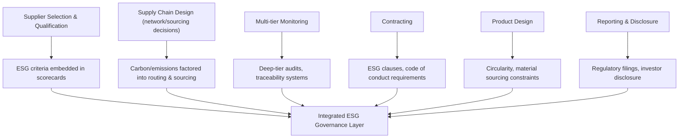

## Environmental, Social, and Governance (ESG) Integration

### Definition and Scope

ESG integration in supply chain architecture is the systematic incorporation of Environmental, Social, and Governance criteria into supply chain design, supplier selection, monitoring, and decision-making processes — treating sustainability and ethical performance as structural design parameters alongside traditional cost, quality, and delivery criteria, rather than as a separate compliance or reporting exercise layered on top of an otherwise unchanged supply chain.

The three pillars decompose as follows:

- **Environmental**: Carbon emissions, resource consumption, waste generation, pollution, and ecological impact across the supply chain's operations and materials.
- **Social**: Labor practices, human rights, worker safety, community impact, and fair treatment of workers across all tiers, not only the focal firm's direct employees.
- **Governance**: Ethical business conduct, anti-corruption practices, transparency, board/organizational accountability structures, and the governance mechanisms through which the firm ensures compliance with its own stated standards across its supply chain.

### Why ESG Requires Architectural (Not Just Reporting) Integration

**Key Points**

- **Regulatory mandate expansion**: An increasing number of jurisdictions require supply chain due diligence and disclosure (e.g., mandatory human rights and environmental due diligence laws, climate-related financial disclosure requirements), shifting ESG from voluntary reporting to a compliance-driven design constraint with legal consequence for non-compliance.
- **Multi-tier exposure**: Because ESG risks (forced labor, environmental violations, corruption) frequently originate deep in the supply chain — well beyond Tier 1 — genuine ESG integration requires the same multi-tier visibility infrastructure needed for resilience risk management, making ESG and resilience programs structurally overlapping rather than independent initiatives.
- **Investor and capital market pressure**: ESG performance increasingly affects access to and cost of capital, as investors and lenders incorporate ESG risk into valuation and lending decisions, creating a direct financial (not only reputational) incentive for structural integration.
- **Customer and brand risk**: Downstream customers, particularly institutional and B2B buyers, increasingly require ESG compliance as a condition of the commercial relationship, making ESG performance a market-access requirement rather than a discretionary differentiator in many sectors.

### Architectural Integration Points

#### 1. Supplier Selection and Qualification

ESG criteria integrated directly into supplier scorecards alongside cost, quality, and delivery performance — commonly implemented as a weighted composite score where ESG factors carry explicit, non-trivial weight rather than serving as a pass/fail gate applied only after commercial terms are agreed.

$$SupplierScore = w_1 \cdot Cost + w_2 \cdot Quality + w_3 \cdot Delivery + w_4 \cdot ESG$$

where $w_4$ (ESG weighting) varies by industry, regulatory environment, and category risk, with $\sum w_i = 1$. [Inference: specific weighting values are organization- and industry-specific policy choices, not a standardized figure.]

#### 2. Multi-Tier Traceability and Monitoring

Extending ESG due diligence beyond Tier 1 to deeper tiers where the highest-risk practices (forced labor, unpermitted environmental discharge, unsafe working conditions) are statistically more likely to occur due to reduced direct oversight. Mechanisms include:

- **Chain-of-custody documentation**: Tracking material origin through each transformation step, common in industries with conflict-mineral or forced-labor regulatory exposure.
- **Third-party audits**: Independent verification of supplier and sub-supplier practices against defined standards, typically conducted on a recurring (not one-time) cycle.
- **Self-assessment questionnaires (SAQs) with verification sampling**: Lower-cost initial screening across a broad supplier base, combined with targeted independent verification of a risk-weighted sample.
- **Traceability technology**: Digital tools (including blockchain-based systems in some implementations, though adoption and maturity vary considerably by industry and remain an evolving area) [Unverified: the maturity and actual production adoption rate of blockchain-based supply chain traceability varies significantly across sources and industries and should be verified against current implementation data for any specific claim] used to create auditable records of material provenance across tiers.

#### 3. Carbon and Emissions Accounting in Network Design

Supply chain network design decisions (sourcing location, transportation mode, facility siting) increasingly incorporate emissions as an explicit optimization constraint or cost factor, commonly structured around the Scope 1/2/3 emissions framework:

| Scope | Definition | Supply Chain Relevance |
| --- | --- | --- |
| Scope 1 | Direct emissions from owned/controlled sources | Focal firm's own manufacturing and fleet operations |
| Scope 2 | Indirect emissions from purchased energy | Focal firm's purchased electricity, heating, cooling |
| Scope 3 | All other indirect emissions across the value chain | Supplier production emissions, logistics, product use/end-of-life — typically the largest share for manufacturing and retail firms |

[Inference: for most manufacturing, retail, and consumer goods firms, Scope 3 emissions substantially exceed Scope 1 and 2 combined, though the exact proportion is highly industry- and firm-specific and should not be treated as a fixed universal ratio.] This concentration of emissions in Scope 3 is the primary reason ESG integration requires supply chain architectural changes (supplier selection, logistics design) rather than being addressable solely through the focal firm's own operational improvements.

#### 4. Contractual Integration

**Key Points**

- **Supplier codes of conduct**: Standardized ESG behavioral requirements incorporated as binding contractual terms rather than aspirational guidelines, typically covering labor standards, environmental compliance, and anti-corruption provisions.
- **Audit rights clauses**: Contractual provisions granting the focal firm or its designated auditors the right to inspect supplier (and in some structures, sub-supplier) facilities and records.
- **Remediation and corrective action requirements**: Defined processes and timelines for addressing identified non-compliance, typically structured with escalating consequences (corrective action plan, then contract review, then termination) rather than immediate termination for first-instance findings — since immediate termination of all non-compliant suppliers is often neither commercially feasible nor the most effective mechanism for improving actual practices industry-wide.
- **ESG-linked commercial terms**: Some contracting structures tie pricing, payment terms, or volume commitments to ESG performance metrics, creating direct financial incentive alignment.

#### 5. Product and Material Design Constraints

ESG integration at the product design stage — material selection constraints (avoiding conflict minerals, hazardous substances, non-recyclable composites), design-for-disassembly, and design-for-recyclability — connects directly to circular supply chain architecture (covered as a related, adjacent topic).

### Governance Structures for ESG Integration

**Key Points**

- **Cross-functional ESG governance body**: Effective integration typically requires a standing governance structure spanning procurement, legal/compliance, sustainability, and operations functions, since ESG risk originates and must be managed across multiple traditionally siloed functions.
- **Escalation and decision-rights clarity**: Defined authority for who can approve supplier onboarding despite ESG flags, who can authorize remediation timelines, and who has authority to terminate non-compliant relationships — ambiguous decision rights are a commonly cited failure point in ESG program implementation.
- **Board and executive accountability linkage**: Increasingly, ESG supply chain performance is tied to board-level oversight and, in some organizations, executive compensation structures, reflecting the governance ("G") pillar's own requirement for accountability mechanisms.
- **Data infrastructure ownership**: Because ESG integration depends heavily on data (emissions data, audit records, traceability data), clear ownership of ESG data infrastructure and its integration with broader supply chain visibility systems is a practical prerequisite for the governance structure to function.

### Common Implementation Frameworks and Standards

| Framework/Standard Area | Focus |
| --- | --- |
| GHG Protocol | Scope 1/2/3 emissions accounting methodology |
| SA8000 / similar social accountability standards | Labor practice and workplace condition certification |
| ISO 14001 | Environmental management systems |
| OECD Due Diligence Guidance | Multi-tier supply chain due diligence for responsible business conduct |
| Conflict Minerals reporting frameworks | Traceability for specific high-risk minerals (tin, tantalum, tungsten, gold, and others depending on jurisdiction) |

[Inference: this table lists commonly referenced framework categories in general ESG and supply chain literature; specific requirements, current applicability, and jurisdictional variants change over time and should be verified against current regulatory text for any compliance-dependent use.]

### Illustrative Example

**Example**

An apparel manufacturer restructures its supply chain to integrate ESG architecturally rather than through reporting alone:

1. **Supplier scorecard redesign**: ESG performance (labor audit scores, emissions intensity per unit, chemical management compliance) is incorporated as 25% of the composite supplier evaluation score, up from a prior pass/fail compliance checkbox.
2. **Multi-tier mapping extension**: The firm extends supplier mapping from Tier 1 (garment assembly) to Tier 2 (fabric/textile mills) and Tier 3 (raw fiber sourcing), identifying previously unknown sub-suppliers in higher labor-risk geographies.
3. **Traceability system deployment**: A digital traceability platform is implemented to track cotton fiber origin from farm through spinning, weaving, and garment assembly, enabling verification claims (e.g., regarding forced-labor-free sourcing) that were previously unverifiable at deeper tiers.
4. **Contractual restructuring**: New supplier contracts incorporate binding code-of-conduct terms, third-party audit rights extending to named sub-suppliers, and a defined corrective-action escalation process replacing prior ad hoc handling of compliance findings.
5. **Result**: The firm gains verifiable, auditable ESG claims suitable for both regulatory disclosure and customer-facing sustainability claims, while also gaining incidental resilience benefit from the improved multi-tier visibility the ESG program required — illustrating the structural overlap between ESG integration and general supply chain risk visibility programs.

### Trade-offs and Constraints

**Key Points**

- **Implementation cost**: Multi-tier audits, traceability technology, and enhanced supplier qualification processes carry direct and ongoing cost, which must be weighed against regulatory, capital-access, and reputational risk mitigation benefit.
- **Data quality and verification challenges**: Self-reported supplier ESG data quality varies considerably, and independent verification at scale across deep supply tiers is resource-intensive, creating a persistent gap between claimed and independently verified ESG performance in many implementations.
- **Supplier base disruption risk**: Strict ESG requirements can reduce the pool of qualified suppliers, potentially conflicting with resilience-oriented diversification goals if ESG standards eliminate otherwise viable alternate sourcing options — illustrating that ESG integration and resilience strategy require joint, not independent, optimization.
- **Standard fragmentation**: Multiple overlapping and sometimes inconsistent ESG frameworks, certifications, and regulatory requirements across jurisdictions can create compliance complexity for firms operating multi-region supply chains, an area that [Unverified: continues to evolve as regulatory harmonization efforts develop; current framework landscape should be checked for the latest status] remains an active area of regulatory development.

**Related Topics**

- Circular supply chain design and closed-loop material flows
- Scope 3 emissions measurement and reduction strategy
- Multi-tier supply chain mapping and visibility platforms
- Supplier code of conduct design and contractual ESG clauses
- Conflict minerals and responsible sourcing due diligence
- ESG-linked financing and sustainability-linked supply chain contracts
- Design-for-disassembly and design-for-recyclability principles
- Regulatory landscape for mandatory human rights and environmental due diligence