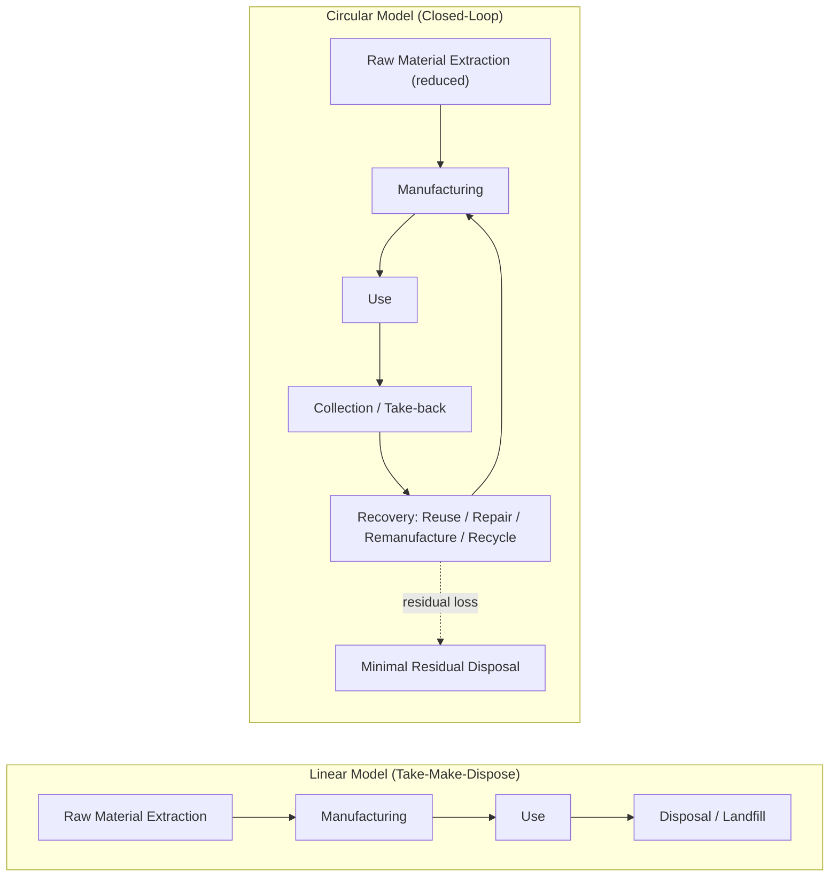
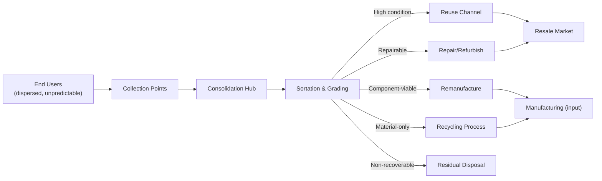

## Circular Supply Chain Design Principles

### Definition and Scope

Circular supply chain design is the architectural approach to structuring supply chains around closed-loop material flows — designing products, processes, and network structures so that materials are retained in productive use for as long as possible, recovered at end-of-use, and reintegrated into production, rather than following the traditional linear "take-make-dispose" model in which materials flow one-directionally from raw extraction to landfill or incineration.

This distinguishes circular supply chain design from ESG integration in emphasis (though the two are structurally related): ESG integration addresses ethical and environmental performance across the existing linear chain, while circularity fundamentally reconfigures the chain's topology to include reverse flows, reprocessing loops, and reduced virgin-material dependency as core design features.

### The Linear vs. Circular Model Contrast

### The Core Circularity Hierarchy (R-Framework)

Circular design principles are commonly organized into a prioritized hierarchy of intervention strategies, typically ordered from highest to lowest value/resource retention:

| Strategy | Definition | Value/Resource Retention |
| --- | --- | --- |
| **Refuse/Rethink** | Eliminating unnecessary material use or redesigning the product/business model to avoid the need for the material entirely | Highest |
| **Reduce** | Minimizing material and resource input per unit of function delivered | Very High |
| **Reuse** | Using a product again for its original purpose with minimal or no processing | High |
| **Repair** | Restoring a broken product to working condition | High |
| **Refurbish** | Restoring an older product to good working condition with upgraded components | Moderate-High |
| **Remanufacture** | Disassembling a product and rebuilding it to original (or better) specification using a mix of used and new parts | Moderate |
| **Repurpose** | Using a product or its components for a different function than originally intended | Moderate |
| **Recycle** | Processing materials to recover raw material inputs for new production, typically with some quality/value degradation | Lower |
| **Recover (energy)** | Extracting energy value from materials that cannot be materially recovered (e.g., incineration with energy capture) | Lowest (material value is lost) |

[Inference: the exact number and naming of "R" categories varies across sources — commonly cited versions range from 3R to 10R frameworks; the version presented here reflects a commonly used mid-range synthesis rather than a single universally standardized taxonomy.]

The hierarchy's design principle is that supply chain architecture should be structured to enable and prioritize the higher-value strategies (refuse, reduce, reuse) before defaulting to recycling, since each downward step in the hierarchy typically involves greater energy input, greater value loss, and lower net environmental benefit per unit of material processed.

### Structural Design Principles

#### 1. Design for Circularity (Upstream Product Design)

**Key Points**

- **Design for disassembly (DfD)**: Products engineered with fasteners, joints, and material combinations that allow straightforward separation of components at end-of-life, rather than permanent bonding (adhesives, welds, composite fusion) that makes material recovery difficult or impossible.
- **Material simplification and mono-materiality**: Reducing the number of distinct material types within a product, since mixed-material products are generally harder and more costly to sort and recycle at high purity.
- **Standardization and modularity**: Designing components (batteries, modules, sub-assemblies) to be standardized across product lines or compatible with industry-wide standards, increasing the viable market and process efficiency for reuse, repair, and remanufacturing operations.
- **Durability and reparability by design**: Engineering products for extended service life and accessible repair (avoiding proprietary fasteners, providing repair documentation/parts access) rather than designs that implicitly favor replacement over repair.
- **Avoidance of hazardous/problematic materials**: Eliminating substances that complicate safe recovery or contaminate recycling streams, aligning with both circularity and ESG environmental objectives.

#### 2. Reverse Logistics Network Design

Circular supply chains require a reverse logistics network — physical and informational infrastructure for collecting used products/materials from end-users and routing them to appropriate recovery processes — which is architecturally distinct from and often more complex than forward (linear) distribution logistics.

**Key Points**

- **Collection point density and accessibility**: The convenience of returning used products materially affects recovery rates; collection infrastructure design (retail take-back points, mail-back programs, dedicated collection events) is a primary lever for achieving target recovery volumes.
- **Reverse flow unpredictability**: Unlike forward logistics with relatively forecastable demand, reverse flows are typically more variable in timing, volume, and condition of returned material, requiring different planning and capacity approaches than standard forward-flow logistics.
- **Sortation and grading infrastructure**: Recovered products/materials typically require inspection, grading, and sortation (by condition, material type, or contamination level) before routing to the appropriate recovery pathway (reuse, remanufacture, recycle, or residual disposal) — this sortation step is frequently a primary cost and bottleneck point in reverse logistics networks.
- **Network topology differences**: Reverse logistics networks often benefit from different facility siting logic than forward networks (e.g., consolidation points optimized for aggregating dispersed, low-volume individual returns rather than distributing from few sources to many destinations).

#### 3. Closed-Loop vs. Open-Loop Recycling Architecture

**Key Points**

- **Closed-loop recycling**: Recovered material from a specific product is processed and reintegrated into the production of the same or equivalent product, maintaining material within a defined product category's supply chain (e.g., recovered aluminum from a specific product line feeding back into producing that same product line).
- **Open-loop recycling**: Recovered material is processed and used in the production of a different product category than its original use, still achieving material recovery but without the same closed material-tracking relationship (e.g., recycled plastic from one product category used in an unrelated product category).
- **Design implication**: Closed-loop architecture generally requires tighter integration between the focal firm's forward and reverse supply chains (often necessitating some degree of reverse logistics control or partnership specifically structured around the firm's own product recovery), while open-loop recycling can rely on broader, less product-specific recycling market infrastructure.

#### 4. Remanufacturing and Refurbishment Process Architecture

Remanufacturing requires supply chain and operational infrastructure structurally distinct from standard forward manufacturing:

1. **Core acquisition**: Sourcing used products ("cores") suitable for remanufacturing, often requiring dedicated core-return contractual incentive structures (deposit-refund schemes, trade-in programs) to ensure adequate and predictable core supply.
2. **Disassembly**: Systematic teardown of the returned product, typically requiring different labor skills and process design than forward assembly.
3. **Inspection and component grading**: Assessing which components can be reused as-is, which require reconditioning, and which must be replaced with new parts.
4. **Reconditioning and reassembly**: Restoring viable components to specification and reassembling with a mix of recovered and new parts.
5. **Requalification/testing**: Verifying the remanufactured product meets the same performance and quality standards as new production, a step often requiring specific quality management processes distinct from standard new-production quality control.

[For behavioral claims about specific remanufacturing outcomes such as cost savings or quality-parity rates, actual performance varies substantially by product category, core condition variability, and process maturity, and should not be assumed uniform across industries.]

### Circular Business Model Structures Enabled by This Architecture

| Model | Description | Supply Chain Implication |
| --- | --- | --- |
| Product-as-a-Service (PaaS) | Customer pays for product function/use rather than owning the product; firm retains ownership | Firm retains strong incentive and typically direct control over product recovery at end-of-life, since it owns the residual asset |
| Take-back/deposit-refund programs | Financial incentive for customers to return used products to the firm or a designated collection point | Requires reverse logistics collection infrastructure; improves core supply predictability for remanufacturing |
| Resale/secondary market platforms | Formal channel for reselling used or refurbished products | Requires grading/certification processes and a distinct sales channel from new-product distribution |
| Material-as-a-Service / leasing of materials | Suppliers retain ownership of raw materials, which are returned/recovered after product life rather than sold outright | Shifts material ownership and recovery incentive structurally toward the material supplier |

### Metrics for Circular Supply Chain Performance

**Key Points**

- **Material Circularity Indicator (MCI)-type metrics**: Composite measures assessing the proportion of material inputs from recycled/recovered sources and the proportion of outputs designed for future recovery, alongside product utility/lifetime factors.
- **Recovery rate**: The proportion of end-of-life products or materials successfully collected and routed into a recovery pathway (reuse, repair, remanufacture, recycle) versus lost to disposal.
- **Virgin material substitution rate**: The proportion of total material input sourced from recovered/recycled streams versus newly extracted virgin material.
- **Loop closure time**: The average duration between a unit of material's initial production and its return to productive use through a recovery pathway — shorter loop closure generally correlates with less quality/value degradation.

$$MCI \approx 1 - LFI \times \left(\frac{2}{X+1/X}\right)$$

where $LFI$ (Linear Flow Index) represents the proportion of material following a linear (non-recovered) path, and $X$ is a utility factor accounting for product lifetime and intensity of use relative to industry average. [Inference: this reflects the general structure of published circularity indicator methodologies (such as the Ellen MacArthur Foundation's Material Circularity Indicator); exact formula variants, parameter definitions, and calculation conventions differ across specific published methodologies, and the precise formula should be verified against the specific standard being applied for any exam or compliance use.]

### Illustrative Example

**Example**

A furniture manufacturer redesigns its supply chain around circular principles:

1. **Design phase**: Products are redesigned using mechanical fasteners instead of adhesives, standardizing on a reduced set of material types (primarily one metal alloy and one recyclable polymer) to enable straightforward disassembly and higher-purity material recovery.
2. **Business model shift**: The firm introduces a leasing/subscription option for commercial office furniture customers alongside traditional sales, retaining product ownership and creating a direct incentive and contractual right to recover units at end-of-lease.
3. **Reverse logistics build**: A take-back network is established using the firm's existing delivery fleet's return-trip capacity, consolidating collected units at regional hubs for grading.
4. **Recovery routing**: Graded units are routed to refurbishment (units in good condition, resold or re-leased), remanufacturing (units requiring component replacement, rebuilt to original specification), or material recycling (units beyond economical repair, processed into raw material stock for new production).
5. **Result**: The firm establishes a closed-loop material stream for its primary metal component, reducing virgin material purchasing dependency for that input, while the leasing model provides both a new revenue structure and improved predictability of core (used product) supply for the remanufacturing process — illustrating how business model and supply chain architecture changes are typically co-dependent in circular transitions.

### Trade-offs and Constraints

**Key Points**

- **Reverse logistics cost and complexity**: Collection, sortation, and grading infrastructure represent a genuinely new cost category not present in linear supply chains, and can be substantial relative to the recovered material's value, particularly for low-value or geographically dispersed products.
- **Quality and performance parity challenges**: Recycled or remanufactured materials/components do not always match virgin material or new-component performance specifications, which can constrain the proportion of recovered material usable in high-specification applications without additional processing investment.
- **Demand and market development for recovered material/products**: Circular models depend on sufficient market demand for recycled material, refurbished products, or remanufactured goods; underdeveloped secondary markets in certain categories can limit the economic viability of recovery investment regardless of the technical recovery capability built.
- **Design-manufacturing tension**: Design-for-disassembly and mono-material principles can sometimes conflict with other design objectives (product performance, aesthetics, cost-optimized manufacturing using composite or bonded materials), requiring deliberate trade-off resolution rather than treating circularity as a cost-free design overlay.
- **Regulatory and standards variation**: Requirements and incentive structures for extended producer responsibility, take-back mandates, and recycled-content requirements vary by jurisdiction and continue to evolve, meaning circular supply chain architecture must often be designed for adaptability across differing regulatory regimes rather than a single fixed compliance target.

**Related Topics**

- ESG integration and Scope 3 emissions reduction (structural overlap with circularity)
- Reverse logistics network design and optimization
- Extended Producer Responsibility (EPR) regulatory frameworks
- Product-as-a-Service and circular business model design
- Design for disassembly (DfD) and design for recyclability principles
- Remanufacturing process engineering and core acquisition strategy
- Material Circularity Indicator and circular economy performance metrics
- Closed-loop vs. open-loop recycling system design