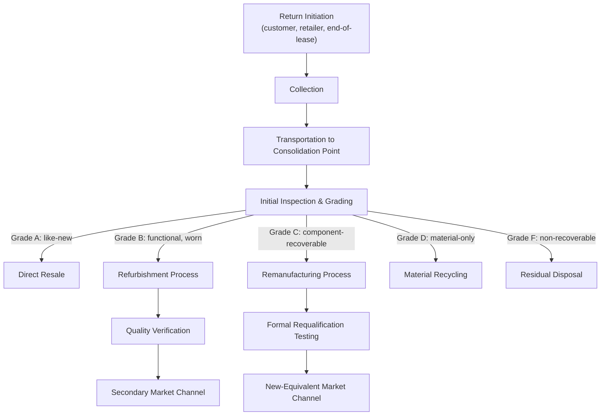

## Remanufacturing, Refurbishment, and Reverse Logistics

### Definition and Scope

This topic examines the three interrelated operational disciplines that implement the recovery side of a circular supply chain: **reverse logistics** (the physical and informational infrastructure for moving used products/materials from end-users back into the supply chain), and the two primary value-recovery processes that reverse logistics feeds — **remanufacturing** (rebuilding a used product to original or better specification through systematic disassembly and component replacement) and **refurbishment** (restoring a used product to good working condition, typically with less extensive intervention than remanufacturing). Where the prior circular design principles topic addressed the conceptual architecture, this topic addresses the operational process design, quality systems, and network mechanics required to execute recovery at scale.

### Distinguishing Remanufacturing from Refurbishment and Repair

**Key Points**

- **Repair**: Restoring a specific fault in a product to return it to working condition, typically without full disassembly and without a systematic quality requalification process equivalent to original production standards.
- **Refurbishment**: A more thorough restoration process — cleaning, cosmetic restoration, replacement of visibly worn or failed components, and functional testing — but generally without full disassembly to the component level or a formal requalification against original manufacturing specifications.
- **Remanufacturing**: A systematic industrial process involving full disassembly to component level, inspection and grading of every component, replacement of components that do not meet specification, reassembly, and formal testing/requalification to the same performance and quality standard as new production (in some regulatory contexts, remanufactured products can be legally sold as equivalent to new for warranty and performance purposes, though this varies by jurisdiction and product category).

| Dimension | Repair | Refurbishment | Remanufacturing |
| --- | --- | --- | --- |
| Disassembly level | Minimal/targeted | Partial | Full, to component level |
| Component inspection scope | Faulty component only | Visible/known wear points | Every component, systematically graded |
| Quality standard | Functional restoration | Good working condition | Original (or better) specification, formally requalified |
| Process standardization | Low-moderate | Moderate | High (industrial process design) |
| Typical warranty treatment | Limited/none | Limited | Often equivalent to new (context-dependent) |

[Inference: warranty treatment for remanufactured products varies by industry, jurisdiction, and specific company policy; the general pattern described reflects common industry practice but is not a universal guarantee across all product categories.]

### Reverse Logistics Network Architecture

#### Core Process Flow

#### 1. Return Initiation and Collection Design

**Key Points**

- **Collection channel structure**: Common architectures include retail drop-off points, mail-back programs (prepaid shipping labels), scheduled pickup services, and dedicated collection events — the choice affects both recovery rate (convenience drives return volume) and unit collection cost.
- **Incentive structures for return**: Deposit-refund schemes, trade-in credit programs, and lease-end return obligations are common mechanisms to ensure predictable and adequate volume of returned units ("cores"), since voluntary, unincentivized return rates are often insufficient to sustain remanufacturing operations at scale.
- **Reverse logistics carrier and routing design**: Some firms integrate reverse flows into existing forward-distribution vehicle routes (using return-trip capacity) to reduce incremental transportation cost, rather than operating fully separate reverse logistics fleets.

#### 2. Consolidation and Initial Grading

Because individual returns are typically low-volume and geographically dispersed, reverse networks commonly route collected units through consolidation hubs before further processing — a network topology inversion relative to forward distribution (many dispersed sources converging to fewer points, rather than few sources distributing to many destinations).

Initial grading at this stage sorts units by condition and recovery pathway suitability, directly determining which of the downstream processes (resale, refurbishment, remanufacturing, recycling, disposal) a unit is routed toward. Grading criteria typically include: functional status, cosmetic condition, component completeness, and age/technology generation relative to current production standards.

#### 3. Reverse Flow Planning Characteristics

**Key Points**

- **Volume unpredictability**: Unlike forward-flow demand, which can often be forecast from sales history and market signals, reverse flow volume depends on customer return behavior, product failure rates, and lease/warranty cycle timing — generally exhibiting higher variance and weaker correlation with standard demand-planning inputs.
- **Condition unpredictability**: Returned units arrive in variable condition, meaning the processing requirement (and thus labor/material cost) per unit cannot be determined until inspection, complicating capacity planning relative to forward manufacturing where input specifications are known in advance.
- **Timing lag structures**: Reverse flow timing is a function of original product sale/lease date plus product lifetime or lease-term distribution, meaning reverse flow volume can sometimes be partially forecast from historical forward-flow data with an appropriate time lag, though this relationship weakens for products with highly variable use patterns.

$$Reverse Flow(t) \approx \int_{0}^{t} Forward Flow(t-\tau) \cdot f(\tau)\, d\tau$$

where $f(\tau)$ is a probability density function representing the distribution of product lifetimes or return-timing lag $\tau$. [Inference: this convolution-based framing is a standard conceptual approach used in reverse logistics and returns forecasting literature; the actual functional form of $f(\tau)$ is empirically estimated per product category and is not a fixed universal function.]

### Remanufacturing Process Architecture in Detail

#### Stage 1: Core Acquisition and Management

"Core" refers to the used product or component acquired as the input to remanufacturing. Core acquisition strategy is a primary determinant of remanufacturing viability:

- **Core supply predictability**: Remanufacturing capacity planning requires reasonably predictable core inflow; firms often use deposit-refund or trade-in mechanisms specifically to stabilize this input, since remanufacturing (unlike standard manufacturing) has an input-supply constraint tied to prior product sales rather than raw material markets.
- **Core quality variability**: Cores arrive in a wide range of conditions depending on prior use intensity and maintenance history, requiring the inspection/grading process to handle this variability systematically rather than assuming uniform input condition, as standard manufacturing typically can.

#### Stage 2: Disassembly

Full disassembly to the component level, typically requiring:

- Reversal of the original assembly sequence, often necessitating disassembly-specific process design distinct from (and sometimes in tension with) the original forward-assembly process design — a key reason design-for-disassembly at the product-design stage materially affects downstream remanufacturing cost and feasibility.
- Component-level tracking/tagging to maintain traceability through inspection, reconditioning, and reassembly.

#### Stage 3: Cleaning and Inspection

Components are cleaned (removing contamination that would interfere with inspection or reconditioning) and inspected against defined specification criteria, typically resulting in a three-way disposition:

1. **Reusable as-is**: Component meets original specification without intervention.
2. **Reconditionable**: Component can be restored to specification through defined reconditioning processes (machining, replating, resurfacing, etc., depending on component type).
3. **Non-reusable**: Component must be replaced with new or another reconditioned unit's viable component.

#### Stage 4: Reconditioning

Restoring components graded as reconditionable to original specification, using processes specific to the component and material type. This stage's process design is highly product- and industry-specific. [Behavior and applicable reconditioning techniques vary substantially by product category and material; general remanufacturing process descriptions should not be assumed to transfer uniformly across industries without domain-specific validation.]

#### Stage 5: Reassembly

Reassembling the product using a mix of reused, reconditioned, and new components, following (typically) a process similar to original forward assembly, though sequencing may differ to accommodate the mixed-provenance component set.

#### Stage 6: Testing and Requalification

Formal functional and performance testing against the same (or a defined equivalent) standard used for new production. This stage is what distinguishes remanufacturing from refurbishment in rigor — the goal is a formally verified, documented equivalence claim, not merely functional operability.

### Quality Management Considerations Specific to Recovery Operations

**Key Points**

- **Mixed-provenance component traceability**: Because a single remanufactured unit may contain components from different original units (of potentially different ages/production batches), quality systems must track component-level provenance differently than standard new-production, which typically assumes uniform-batch component sourcing.
- **Statistical process control adaptation**: Standard manufacturing quality control assumes relatively homogeneous input material; remanufacturing quality control must account for input (core) heterogeneity, often requiring adapted sampling and control approaches rather than directly transplanting new-production quality methods.
- **Liability and warranty documentation**: Given that remanufactured products may carry warranty claims equivalent to new products in some markets, documentation of the testing and requalification process is often a legal and commercial necessity, not only an internal quality practice.

### Network Design Trade-offs: Centralized vs. Decentralized Recovery Operations

| Dimension | Centralized (few large facilities) | Decentralized (many smaller/local facilities) |
| --- | --- | --- |
| Transportation cost for cores | Higher (longer average distance to facility) | Lower (shorter average distance) |
| Economies of scale in processing | Higher (specialized equipment, labor utilization) | Lower per facility |
| Responsiveness/speed to market | Lower (longer cycle time including transport) | Higher (shorter cycle time) |
| Investment concentration/risk | Higher (single-point capacity risk) | Lower (distributed capacity risk) |
| Suitability | High-value, low-volume, complex products (e.g., aerospace components, heavy equipment) | Lower-value, higher-volume, simpler products where transport cost is proportionally significant |

[Inference: this trade-off framing reflects general facility-location and network-design logic applied to the reverse logistics/remanufacturing context; the optimal choice for any specific case depends on product-specific economics that require case-by-case analysis rather than a general rule.]

### Illustrative Example

**Example**

An industrial equipment manufacturer builds a remanufacturing and reverse logistics operation for a hydraulic pump product line:

1. **Core acquisition**: A trade-in program offers customers a credit toward new pump purchases when returning an end-of-life unit, structured to provide predictable core inflow correlated with new unit sales (using the forward-flow lag relationship described above, informed by the product's known multi-year service life distribution).
2. **Reverse logistics**: Returned cores are shipped by customers (using provided return logistics arrangements) to a single centralized remanufacturing facility, justified by the product's high unit value and complexity, which favors the centralized model's scale economies over the transportation-cost advantage of a decentralized approach.
3. **Grading and disassembly**: Incoming cores are inspected, disassembled to component level (housing, internal seals, bearings, drive components), and each component is individually graded.
4. **Reconditioning and reassembly**: Housings are inspected and, where within tolerance, reused after resurfacing; seals and wear components are systematically replaced with new parts (given their low reconditioning viability and safety criticality); bearings are graded and either reused or replaced based on wear measurement.
5. **Requalification**: Reassembled units undergo the same performance and pressure-testing protocol as new-production units, with documented results enabling the firm to offer a warranty equivalent to new units.
6. **Result**: The firm establishes a remanufactured product line sold at a discount to new-unit price but with equivalent warranty terms, achieving material cost reduction versus new production while also reducing virgin raw material dependency for the core housing and structural components — connecting this operational capability directly to the circular supply chain material-flow objectives covered in the related design-principles topic.

### Constraints and Critiques

**Key Points**

- **Cannibalization risk**: Remanufactured products sold alongside new products at a discount can reduce new-product sales/margin if not carefully positioned (different market segment, controlled volume, geographic separation) — a commercial strategy consideration alongside the operational design.
- **Core supply risk**: Remanufacturing capacity is fundamentally constrained by core availability; insufficient core return rates can leave built remanufacturing capacity underutilized, making core acquisition strategy as operationally critical as the remanufacturing process itself.
- **Process cost variability**: Because input (core) condition varies, per-unit remanufacturing cost is inherently less predictable than standard manufacturing cost, complicating pricing and margin planning unless sufficient volume allows cost averaging across a large core population.
- **Technology obsolescence risk**: For products with fast technology cycles, older cores may become economically unviable to remanufacture (the remanufactured unit's performance falls below current market expectations), a constraint less relevant for durable, slower-technology-cycle product categories.

**Related Topics**

- Circular supply chain design principles (upstream design enabling downstream recovery)
- Design for disassembly (DfD) and its direct impact on remanufacturing cost
- Reverse logistics network optimization and facility location modeling
- Core acquisition strategy and deposit-refund contract design
- Quality management systems for mixed-provenance component traceability
- Secondary market and resale channel strategy for recovered products
- Extended Producer Responsibility (EPR) and take-back program regulation
- Product-as-a-Service models and their effect on core supply predictability