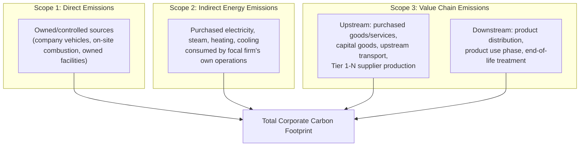
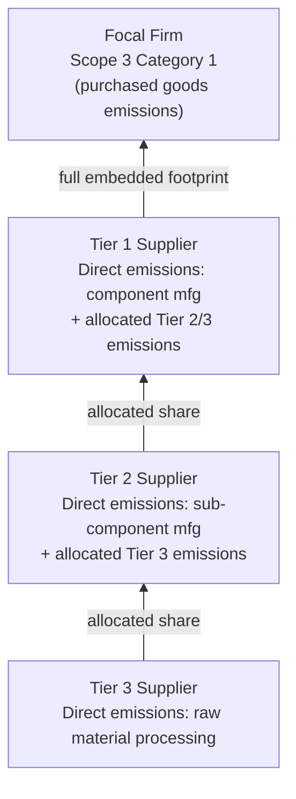

## Carbon Footprint Measurement Across Tiers

### Definition and Scope

Carbon footprint measurement across tiers is the practice of quantifying greenhouse gas (GHG) emissions attributable to a firm's products and operations, extending measurement beyond the focal firm's own direct emissions to encompass emissions generated throughout its multi-tier supply chain — from raw material extraction through component production, assembly, distribution, product use, and end-of-life. This tiered measurement challenge is structurally identical to the visibility problem discussed in multi-tier resilience mapping: emissions data becomes progressively harder to obtain, verify, and attribute accurately as measurement extends deeper into the supply chain, away from the focal firm's direct operational control.

### The Scope 1/2/3 Framework Foundation

Carbon accounting is standardized (most widely through the GHG Protocol) around three emissions scopes that map directly onto supply chain tier structure:

**Key Points**

- **Scope 1 (Direct)**: Emissions from sources owned or directly controlled by the focal firm — combustion in owned facilities, company-owned vehicle fleets, and direct process emissions from owned manufacturing.
- **Scope 2 (Indirect Energy)**: Emissions associated with the generation of purchased electricity, steam, heat, or cooling consumed by the focal firm's own operations — indirect because the emission occurs at the power generation source, not the firm's facility, but is attributable to the firm's energy purchase decision.
- **Scope 3 (Value Chain)**: All other indirect emissions occurring in the firm's value chain, both upstream (supplier production, purchased goods and services, upstream transportation) and downstream (product distribution, use-phase emissions, end-of-life treatment) — this category is where multi-tier supply chain measurement complexity concentrates, since it encompasses emissions the focal firm does not directly control or often even directly observe.

[Inference: for most manufacturing, retail, apparel, and consumer goods firms, Scope 3 typically represents the substantial majority of total corporate emissions footprint, frequently cited in general sustainability literature as commonly exceeding 70-90% of total footprint for such sectors; however, this proportion varies considerably by industry (e.g., it differs materially for firms in primarily energy-generation or heavy-manufacturing sectors where Scope 1/2 may be proportionally larger) and specific figures should be treated as illustrative rather than universally applicable without sector-specific verification.]

### The 15 Scope 3 Categories

The GHG Protocol subdivides Scope 3 into 15 standard categories, of which the following are most directly relevant to multi-tier supply chain measurement:

| Category | Description | Tier Relevance |
| --- | --- | --- |
| Category 1: Purchased goods and services | Emissions from production of all purchased materials/components | Tier 1 (direct) and embedded Tier 2+ emissions |
| Category 2: Capital goods | Emissions from production of purchased capital equipment | Primarily upstream, less tiered complexity |
| Category 3: Fuel- and energy-related activities | Upstream emissions from fuel/energy production not captured in Scope 1/2 | Upstream energy supply chain |
| Category 4: Upstream transportation and distribution | Emissions from transporting purchased goods to the focal firm | Logistics/transport tier |
| Category 5: Waste generated in operations | Emissions from disposal/treatment of the focal firm's operational waste | Downstream of focal firm's own operations |
| Category 9: Downstream transportation and distribution | Emissions from transporting sold products to customers | Downstream logistics |
| Category 11: Use of sold products | Emissions from customer use of the product (highly significant for energy-consuming products) | Downstream, product-use phase |
| Category 12: End-of-life treatment of sold products | Emissions from disposal/recycling of the product after use | Downstream, connects to circular supply chain measurement |

[Inference: category numbering and exact definitions reflect the GHG Protocol Corporate Value Chain (Scope 3) Standard structure as commonly referenced; firms should consult current GHG Protocol guidance directly for authoritative category definitions given periodic methodology updates.]

Category 1 (Purchased goods and services) is typically the category most structurally analogous to the multi-tier resilience mapping challenge — because the emissions embedded in a purchased component reflect not only the Tier 1 supplier's own production emissions but also that supplier's own upstream (Tier 2, 3+) purchased inputs, creating the same tier-depth visibility decay problem seen in resilience risk mapping.

### Measurement Methodologies

#### 1. Supplier-Specific (Primary) Data Method

Collecting actual, measured or calculated emissions data directly from specific suppliers for the specific goods/services purchased.

**Key Points**

- **Highest accuracy**: Reflects the actual production conditions, energy mix, and process efficiency of the specific supplier and facility, rather than industry-average assumptions.
- **Highest collection burden**: Requires suppliers to have their own emissions measurement capability and willingness to share data, which — mirroring the multi-tier visibility problem — becomes progressively harder to obtain as measurement extends past Tier 1 into deeper, less directly-engaged tiers.
- **Verification challenge**: Supplier-reported data quality and calculation methodology consistency vary considerably absent standardized reporting requirements or third-party verification, creating a data-quality gradient similar to the ESG self-assessment verification challenge.

#### 2. Average-Data (Spend-Based or Activity-Based) Method

Estimating emissions using secondary data sources (industry-average emission factors) applied to either spend amounts or activity quantities (e.g., kilograms of a material purchased) rather than supplier-specific measured data.

$$Emissions = \sum_{i} (Spend_i \text{ or } Activity_i) \times EF_i$$

where $EF_i$ is an emission factor (emissions per unit of spend or per unit of physical activity) drawn from published industry-average databases. [Inference: emission factor database specifics, update cadence, and regional variation are maintained by multiple organizations (government agencies, industry associations, commercial data providers) and change over time; any specific emission factor value should be sourced from current published data rather than assumed static.]

**Key Points**

- **Lower accuracy, lower burden**: Provides a reasonable estimate without requiring individual supplier data collection, making it the practical default for the many suppliers (particularly deep-tier suppliers) from which primary data cannot feasibly be obtained.
- **Spend-based limitation**: Spend-based emission factors (emissions per dollar of spend in a given category) are particularly imprecise because they conflate price and emissions intensity — a lower-priced but higher-emissions-intensity supplier would be systematically underestimated relative to a higher-priced, cleaner supplier, or vice versa, a widely acknowledged methodological limitation of the spend-based approach.
- **Progressive refinement approach**: Firms commonly begin Scope 3 measurement using average-data methods across the full supplier base for initial completeness, then progressively substitute supplier-specific primary data for the highest-emissions or highest-spend categories/suppliers over time as data collection capability matures — a pragmatic response to the tiered visibility challenge rather than attempting full primary-data coverage immediately.

#### 3. Hybrid Method

Combining supplier-specific data where available with average-data estimates to fill remaining gaps, which is the most common practical approach for firms with partial but incomplete supplier engagement on emissions reporting.

### Tiered Emissions Aggregation Structure

Emissions embedded in a purchased component reflect the cumulative emissions of all upstream production stages, creating a cascading aggregation problem structurally analogous to the risk propagation model discussed in the tiered disruptions topic:

$$E_{embedded}(component) = E_{direct}(Tier_1) + \sum_{k=2}^{n} E_{direct}(Tier_k) \times Allocation_k$$

where $E_{direct}(Tier_k)$ is the direct production emissions at tier $k$, and $Allocation_k$ represents the share of that tier's total emissions attributable to the specific component/order in question (since a Tier 2+ supplier typically serves multiple downstream customers, requiring an allocation methodology to avoid double-counting or misattribution). [Inference: this is a conceptual representation of the double-counting and allocation challenge inherent in multi-tier emissions aggregation; actual allocation methodologies used in practice — such as mass-based, revenue-based, or physical-allocation approaches — vary by standard and industry, and the specific formula shown is illustrative of the structural problem rather than a single prescribed calculation method.]

### Data Infrastructure for Multi-Tier Carbon Measurement

**Key Points**

- **Supplier emissions data collection platforms**: Digital systems for requesting, collecting, and standardizing emissions data submissions from suppliers across tiers, often integrated with or adjacent to broader multi-tier supply chain mapping and ESG data infrastructure.
- **Emissions factor databases**: Reference datasets providing average emission factors by material, process, region, and industry, used to fill data gaps under the average-data method.
- **Product carbon footprint (PCF) exchange standards**: Emerging data exchange formats and protocols intended to allow suppliers to share calculated product-level carbon footprint data in standardized, machine-readable form across supply chain tiers, reducing the friction of bespoke data requests at each tier boundary. [Unverified: specific PCF data exchange standards and their adoption maturity are an actively evolving area; current implementation status and dominant standards should be verified against current industry sources rather than assumed fixed, given this is a fast-developing area of supply chain data infrastructure.]
- **Integration with broader supply chain visibility systems**: Because carbon data collection depends on the same underlying multi-tier supplier relationship mapping needed for resilience and ESG risk management, mature implementations often integrate carbon measurement into the same visibility platform rather than maintaining a separate, siloed system.

### Verification and Assurance

**Key Points**

- **Third-party assurance**: Independent verification of reported emissions data and calculation methodology, increasingly required by regulatory disclosure regimes and expected by investors, analogous to financial audit assurance.
- **Materiality-based verification prioritization**: Given the practical impossibility of independently verifying every deep-tier supplier's emissions data, verification effort is typically prioritized toward the highest-emissions or highest-spend categories and suppliers (a risk/materiality-based approach), similar to the risk-weighted audit sampling approach used in ESG multi-tier monitoring.
- **Methodology consistency over time**: Because emissions data is used for trend tracking and target progress reporting, consistent application of calculation methodology year-over-year is generally considered important for the resulting metrics to be meaningful, with methodology changes typically requiring restatement of prior-year baseline figures for comparability.

### Illustrative Example

**Example**

An electronics manufacturer builds a multi-tier carbon footprint measurement program for a key product line:

1. **Scope 1/2 baseline**: The firm measures its own direct facility and vehicle emissions (Scope 1) and purchased electricity emissions (Scope 2) using metered energy consumption data — the most straightforward measurement stage given full operational control.
2. **Tier 1 primary data collection**: The firm requests actual emissions data from its direct component suppliers (Tier 1), achieving high response rates for its largest, most engaged suppliers but incomplete coverage for smaller Tier 1 suppliers.
3. **Average-data gap filling**: For Tier 1 suppliers unable to provide primary data, and for the full breadth of Tier 2+ suppliers, the firm applies industry-average emission factors based on material type and purchase volume (activity-based, preferred over pure spend-based where physical quantity data is available).
4. **Progressive refinement targeting**: The firm identifies its highest-emissions-intensity component category (a specific semiconductor process) as a priority for primary-data upgrade, engaging that specific Tier 1 supplier chain (including working with the supplier to obtain their own Tier 2 foundry data) given the disproportionate share of total footprint concentrated in that category.
5. **Downstream measurement**: Use-phase emissions (Category 11) are calculated using the product's measured energy consumption during use combined with regional electricity grid emission factors and estimated product lifetime/usage patterns.
6. **Result**: The firm produces a Scope 1/2/3 footprint with high-confidence primary data for its highest-impact categories and reasonable average-data estimates for the long tail of lower-impact deep-tier suppliers — a pragmatic, materiality-prioritized approach rather than attempting uniform primary-data precision across an infeasibly large supplier population.

### Constraints and Critiques

**Key Points**

- **Data availability and quality gradient**: The fundamental challenge mirrors multi-tier resilience visibility — measurement accuracy declines with tier depth precisely where aggregate emissions volume (and thus measurement importance) may still be substantial, creating a persistent tension between measurement completeness and measurement feasibility.
- **Double-counting risk**: Without careful allocation methodology, emissions can be double-counted across firms sharing common upstream suppliers (a structural analogy to the hidden-concentration risk in resilience mapping) or double-counted between a supplier's own Scope 1/2 reporting and the focal firm's Scope 3 Category 1 reporting of that same supplier's emissions.
- **Methodology comparability limitations**: Variation in calculation methodology (spend-based vs. activity-based vs. supplier-specific, differing emission factor sources) across firms and reporting periods limits direct comparability of reported carbon footprint figures between organizations, a widely acknowledged limitation of current corporate carbon accounting practice.
- **Cost and resource burden**: Comprehensive multi-tier emissions measurement, particularly efforts to obtain primary supplier data at deeper tiers, represents a genuine resource investment that must be weighed against regulatory requirement, materiality, and target-setting needs rather than pursued as an unconditional maximum-precision exercise.

**Related Topics**

- ESG integration and multi-tier due diligence data infrastructure (structural overlap)
- GHG Protocol Scope 3 category methodology and emission factor databases
- Circular supply chain design and end-of-life emissions reduction
- Multi-tier supply chain mapping and visibility platforms (shared data infrastructure need)
- Product carbon footprint (PCF) calculation and data exchange standards
- Science-based emissions reduction target setting and supplier engagement programs
- Climate-related financial disclosure regulation and mandatory reporting requirements
- Double-counting and emissions allocation methodology in shared supply chains