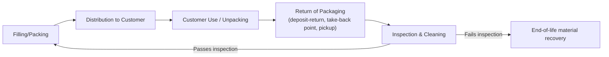
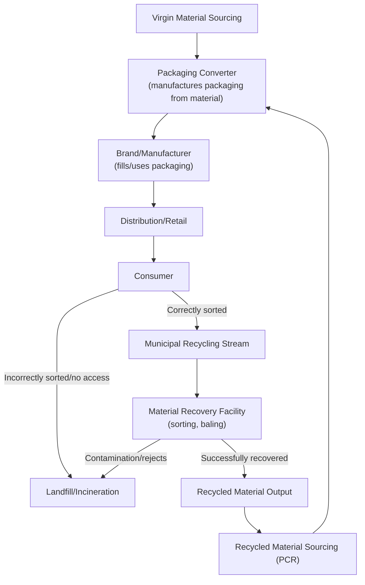

## Sustainable Packaging and Materials Flow

### Definition and Scope

Sustainable packaging and materials flow addresses the design, sourcing, and lifecycle management of packaging materials within the supply chain — a domain distinguished from general circular supply chain design by its focus on the specific material category that touches nearly every product moving through the chain, is often single-use by default, and typically involves distinct waste-stream, regulatory, and consumer-facing dynamics compared to durable product materials. This topic covers packaging material selection, packaging system design, and the material flow architecture required to reduce virgin material dependency and end-of-life impact specifically within the packaging layer of the supply chain.

### Why Packaging Warrants Distinct Treatment

**Key Points**

- **Volume and visibility disproportion**: Packaging typically represents a large share of total supply chain material volume and consumer-visible waste relative to its value, making it a high-scrutiny target for both regulation and public perception independent of its proportional contribution to a firm's total environmental footprint.
- **Functional tension**: Packaging must simultaneously satisfy protection (preventing product damage/spoilage), logistics efficiency (cube utilization, stackability, weight), regulatory/labeling requirements, and increasingly sustainability criteria — objectives that frequently conflict, unlike many other material categories where sustainability improvements face fewer competing functional constraints.
- **End-of-consumer-use disposal pathway**: Unlike product materials that flow through the firm's own or lease-based reverse logistics, packaging disposal decisions are typically made by end consumers at the point of use, meaning the firm has limited direct control over whether packaging is actually recycled, composted, or landfilled regardless of how the packaging was designed — a structurally different recovery challenge than product-level circularity discussed previously.
- **Regulatory concentration**: Packaging is frequently the specific target of Extended Producer Responsibility (EPR) legislation, plastic-specific bans/taxes, and recycled-content mandates, often ahead of and more stringent than regulation applied to durable product materials generally.

### Packaging Material Hierarchy and Selection Criteria

| Material Category | Common Recyclability Profile | Typical Trade-offs |
| --- | --- | --- |
| Corrugated cardboard/paperboard | Widely recyclable in most municipal systems | Lower moisture/durability resistance than plastic alternatives |
| Rigid plastics (PET, HDPE) | Recyclable where collection infrastructure exists, but infrastructure varies significantly by region | High durability/barrier properties; virgin vs. recycled content availability varies |
| Flexible plastic film/multilayer laminates | Frequently NOT recyclable in standard municipal systems due to mixed-material composition | Excellent barrier/protection properties and light weight; among the most difficult packaging formats to recover |
| Molded fiber/pulp | Compostable or recyclable depending on coating/treatment | Lower structural strength than rigid plastic for some applications |
| Compostable bioplastics | Compostable only in industrial composting conditions in most cases, not typically in standard recycling or home composting streams | Requires specific end-of-life infrastructure that may not be locally available, a frequently cited gap between material claim and practical recoverability |
| Reusable/returnable packaging systems | N/A (reuse, not single-use disposal) | Requires reverse logistics infrastructure; economics favor high-frequency, closed-loop distribution scenarios |

[Inference: recyclability and compostability infrastructure availability varies substantially by municipality, region, and country, and changes over time as infrastructure develops; general statements about material recyclability should be understood as infrastructure-dependent rather than universal, and specific claims should be verified against current local infrastructure for any compliance- or claims-related use.]

### Structural Design Principles for Packaging

#### 1. Source Reduction (Lightweighting and Right-Sizing)

Reducing total packaging material mass and volume per unit shipped — the highest-priority strategy in the packaging-specific application of the circularity hierarchy (mirroring the "Refuse/Reduce" priority from the broader circular design framework), since material not used generates no downstream recovery burden at all.

**Key Points**

- **Right-sizing to product dimensions**: Reducing void space in shipping packaging (oversized boxes with excess void-fill) directly reduces material use and, as a secondary benefit, improves transportation cube efficiency (more units per shipment, reducing transportation-related emissions).
- **Structural optimization**: Engineering packaging geometry (corrugated flute design, wall thickness, structural ribbing) to maintain required protective performance with less material, rather than assuming material reduction necessarily compromises product protection.
- **Elimination of unnecessary packaging layers**: Assessing whether multi-layer packaging (e.g., a primary package inside a secondary retail package inside a tertiary shipping package) contains layers that could be eliminated or consolidated without compromising function.

#### 2. Material Substitution

Replacing higher-impact materials with lower-impact alternatives while maintaining required functional performance:

- Substituting virgin plastic with recycled-content plastic (post-consumer recycled, PCR) where barrier and structural requirements allow.
- Substituting flexible multilayer laminates (difficult to recycle) with mono-material flexible structures designed for standard recycling streams, where achievable barrier performance permits.
- Substituting plastic void-fill and cushioning with paper-based or molded-fiber alternatives.

#### 3. Design for Recyclability (Mono-Materiality and Format Compatibility)

**Key Points**

- **Mono-material design**: Structuring packaging from a single recyclable material type rather than bonded multi-material laminates, since mixed-material packaging is a primary cause of otherwise-recyclable-seeming packaging being rejected by standard recycling processes.
- **Format compatibility with existing recycling infrastructure**: Designing packaging to be compatible with widely available municipal recycling stream categories (e.g., standard PET or HDPE bottle shapes recognized by automated sorting systems) rather than novel formats or materials that, while theoretically recyclable, are not accepted or correctly sorted by current infrastructure.
- **Avoidance of recycling-contaminating components**: Eliminating design elements (certain adhesives, non-removable labels of incompatible material, metallic components embedded in plastic/paper) that cause an otherwise recyclable package to be rejected or degrade recycling stream quality.
- **Labeling and consumer guidance**: Clear, standardized recyclability labeling to improve actual consumer sorting behavior, addressing the practical gap between theoretical recyclability and actual recovery rate, since packaging design alone cannot guarantee correct end-of-life disposal without consumer participation.

#### 4. Reusable/Returnable Packaging Systems

A structurally distinct strategy from single-use material optimization — packaging designed for multiple use cycles rather than disposal after first use, requiring dedicated reverse logistics infrastructure analogous to the product-level reverse logistics discussed for remanufacturing.

Reusable packaging economics are generally most favorable in scenarios with high use-cycle frequency, closed or semi-closed distribution loops (e.g., business-to-business shipping between known, recurring parties, or retail systems with reliable customer return behavior), where the cost of reverse logistics and cleaning per cycle is offset by avoided per-use packaging material cost across many reuse cycles. [Inference: the specific break-even use-cycle count favoring reusable over single-use packaging is highly scenario-dependent — varying with material cost, reverse logistics cost, cleaning cost, and loss/breakage rate — and cannot be generalized to a single threshold applicable across all packaging categories.]

### Materials Flow Architecture Across the Packaging Lifecycle

This diagram illustrates the critical structural vulnerability in packaging materials flow: unlike product-level circularity where the focal firm can often exert direct control over collection (via lease terms, take-back programs, or owned reverse logistics), packaging materials flow passes through a consumer decision point and a third-party municipal/commercial recycling infrastructure system largely outside the focal firm's direct operational control — meaning packaging sustainability outcomes depend heavily on factors (local infrastructure availability, consumer sorting behavior, material recovery facility capability) that packaging design alone cannot guarantee.

### Recycled Content Sourcing and Closed-Loop Packaging Systems

**Key Points**

- **Post-consumer recycled (PCR) content sourcing**: Firms increasingly commit to minimum recycled-content percentages in packaging, which requires establishing reliable supply chains for recycled material feedstock — a sourcing category with distinct market dynamics (price volatility, quality variability, supply availability) compared to virgin material sourcing.
- **Closed-loop packaging programs**: Some firms establish direct or near-direct material recovery arrangements (e.g., contracting directly with material recovery facilities or recyclers) to secure a more reliable and traceable PCR supply specifically for their own packaging, reducing dependency on general open-market recycled material availability.
- **Food-grade recycled content constraints**: Packaging in direct food contact applications faces additional regulatory and safety constraints on recycled content sourcing (contamination control, migration testing) not applicable to non-food packaging, a category-specific constraint worth noting when comparing recycled-content feasibility across packaging applications.

### Metrics for Sustainable Packaging Performance

| Metric | Definition |
| --- | --- |
| Packaging-to-product weight ratio | Total packaging mass relative to product mass shipped — a source-reduction indicator |
| Recycled content percentage | Proportion of packaging material sourced from recycled (vs. virgin) feedstock |
| Recyclability rate (design-stage) | Proportion of packaging, by weight or unit, designed to be compatible with widely available recycling infrastructure |
| Actual recovery rate | Proportion of packaging materials actually recovered through recycling/reuse systems post-consumer use (distinct from theoretical/design-stage recyclability, and generally lower due to the consumer-sorting and infrastructure gap) |
| Cube utilization | Volume efficiency of packaged product in transportation, connecting packaging design to logistics emissions |

The distinction between **design-stage recyclability** and **actual recovery rate** is a frequently emphasized measurement nuance in this domain: a package can be technically recyclable by material composition while achieving a low actual recovery rate due to inadequate regional infrastructure, poor consumer sorting compliance, or contamination — meaning recyclability claims and recovery outcome metrics should not be treated as interchangeable.

### Illustrative Example

**Example**

A consumer food brand redesigns its packaging system for a snack product line:

1. **Source reduction**: The primary package is redesigned to reduce film thickness to the minimum required for barrier performance (moisture/oxygen protection), and secondary shipping cartons are right-sized to the actual case-pack dimensions, eliminating void space previously filled with plastic air-pillow cushioning.
2. **Material substitution**: The multilayer flexible film (previously a non-recyclable laminate combining multiple plastic types for barrier performance) is substituted with a newly available mono-material high-barrier film compatible with standard flexible-plastic recycling collection programs in key markets — a substitution the firm validates is not universally accepted across all its distribution regions, given varying regional recycling infrastructure.
3. **Recycled content commitment**: Secondary corrugated shipping cartons are shifted to 100% recycled-content material (both cost-competitive and technically straightforward for corrugated, unlike the more constrained recycled-content sourcing challenge for direct food-contact flexible film).
4. **Consumer labeling**: Packaging incorporates standardized recyclability labeling reflecting accurate, region-specific disposal guidance rather than a single generic claim, addressing the actual-recovery-rate gap by improving the likelihood of correct consumer sorting.
5. **Result**: The firm reduces total packaging material mass per unit shipped, improves transportation cube efficiency (more product per shipment), and increases the proportion of packaging compatible with existing recycling infrastructure — while acknowledging that actual recovery rate remains dependent on regional infrastructure and consumer behavior outside the firm's direct control, illustrating the structural limitation distinguishing packaging circularity from product-level circularity.

### Constraints and Critiques

**Key Points**

- **Functional performance risk**: Aggressive material reduction or substitution can compromise product protection (damage, spoilage, contamination), creating a risk that must be balanced against sustainability objectives rather than treated as a cost-free design change — packaging failure has its own environmental and commercial cost (product waste, returns) that can offset packaging material savings if functional performance is compromised.
- **Infrastructure dependency limits firm control**: As emphasized throughout, packaging sustainability outcomes depend substantially on third-party recycling infrastructure and consumer behavior that the firm cannot directly control, meaning design improvements alone do not guarantee proportional improvement in actual environmental outcome.
- **Greenwashing and claims accuracy risk**: The gap between design-stage recyclability/compostability claims and actual achievable recovery rates creates regulatory and reputational risk if packaging claims are not carefully substantiated against actual regional infrastructure capability — an area of increasing regulatory scrutiny in multiple jurisdictions. [Unverified: specific regulatory requirements and enforcement approaches regarding packaging environmental claims are an active and evolving regulatory area that varies by jurisdiction and should be verified against current regulatory guidance for any compliance-dependent application.]
- **Cost and supply availability of sustainable alternatives**: Recycled-content materials and novel mono-material or bio-based alternatives can carry cost premiums or supply availability constraints relative to conventional packaging materials, requiring the same cost-benefit evaluation applied to other sustainability investments discussed in this chapter.

**Related Topics**

- Circular supply chain design principles (broader material flow architecture)
- Extended Producer Responsibility (EPR) regulation applied specifically to packaging
- Reverse logistics for reusable/returnable packaging systems
- Recycled content sourcing markets and post-consumer recycled (PCR) material supply chains
- Carbon footprint measurement (packaging-related emissions within Scope 3 categories)
- Material Recovery Facility (MRF) sortation technology and infrastructure capability
- Consumer behavior and recycling participation rate research
- Packaging regulatory compliance and environmental claims substantiation