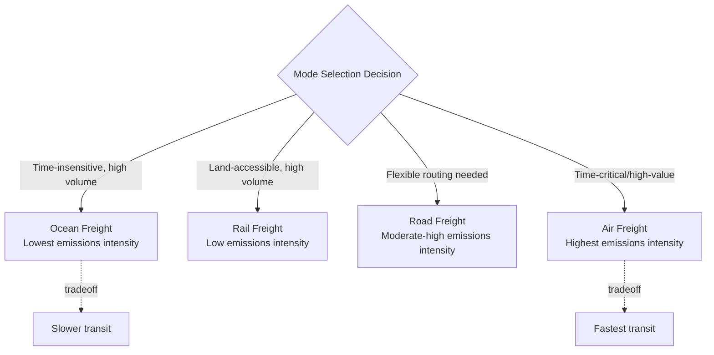

## Green Logistics and Low-Carbon Transportation

### Definition and Scope

Green logistics and low-carbon transportation addresses the design and operation of the physical movement layer of the supply chain — freight transportation, warehousing, and distribution — to reduce greenhouse gas emissions and broader environmental impact. This domain sits within the Scope 3 emissions categories covered in the carbon footprint measurement topic (specifically Categories 4 and 9: upstream and downstream transportation and distribution) but is treated separately here because it involves distinct operational levers — mode selection, network design, fleet technology, and load optimization — that are architecturally different from the material-flow and product-design levers covered in the circularity and packaging topics.

### Emissions Sources Within Logistics Operations

**Key Points**

- **Transportation mode emissions**: Direct combustion or energy-source emissions from moving freight via road, rail, ocean, air, or inland waterway — the largest and most variable component of logistics emissions, since emissions intensity per unit of freight moved differs substantially by mode.
- **Warehousing and distribution center emissions**: Energy consumption (heating, cooling, lighting, material handling equipment) within fixed logistics facilities — generally smaller in aggregate than transportation emissions for most supply chains but addressable through the same Scope 1/2 reduction levers (renewable energy sourcing, facility efficiency) applicable to any owned facility.
- **Last-mile delivery emissions**: The final delivery leg to end customers, increasingly significant in e-commerce-heavy supply chains due to the lower load-consolidation efficiency of individual parcel delivery compared to bulk freight movement.
- **Packaging and load-related emissions**: Connects to the sustainable packaging topic — packaging weight and cube efficiency directly affect the emissions intensity of transportation per unit of product delivered.

### Mode Selection and Emissions Intensity

Transportation mode choice is the single highest-leverage decision point in logistics emissions, since emissions intensity per ton-kilometer (or ton-mile) varies by an order of magnitude or more across modes.

| Mode | Relative Emissions Intensity (indicative ranking) | Typical Trade-off |
| --- | --- | --- |
| Ocean freight | Lowest per ton-km among common freight modes | Slowest transit time; suited to non-time-critical bulk freight |
| Rail freight | Low, generally next-lowest after ocean for land transport | Requires rail-accessible origin/destination; less flexible routing than road |
| Road freight (truck) | Moderate-high | Highest routing flexibility and door-to-door capability |
| Air freight | Highest by a substantial margin | Fastest transit time; reserved for time-critical or high-value/low-weight goods given the emissions and cost premium |

[Inference: exact relative emissions intensity figures vary by source, vehicle/vessel technology, load factor, fuel type, and route, and specific quantitative multipliers should be sourced from current lifecycle emissions databases rather than treated as fixed universal ratios; the qualitative ranking (ocean/rail lowest, air highest) is, however, a well-established and consistently observed pattern across sources.]

### Structural Design Levers for Emissions Reduction

#### 1. Modal Shift

Deliberately shifting freight volume toward lower-emissions modes where service requirements (transit time, reliability, accessibility) permit — for example, shifting road freight to rail for long-haul, non-time-critical lanes, or shifting air freight to ocean or expedited ocean where lead-time flexibility exists. This is typically the highest-impact single lever available, given the magnitude of the emissions-intensity gap between modes, but is constrained by infrastructure availability (rail/ocean access at origin and destination) and service-level requirements that cannot always accommodate slower transit.

#### 2. Network Design and Consolidation

**Key Points**

- **Load consolidation**: Combining multiple smaller shipments into fewer, fuller loads reduces the number of trips (and associated emissions) required to move a given total freight volume — directly connects to the packaging cube-efficiency lever discussed in the sustainable packaging topic.
- **Network node placement**: Facility location decisions (distribution center siting) affect total transportation distance; this connects directly to the center-of-gravity network optimization approach discussed under regionalization, where minimizing weighted transportation distance was framed primarily as a cost and resilience lever but carries an equivalent emissions-reduction rationale, since transportation distance and transportation emissions are directly correlated.
- **Backhaul and empty-mile reduction**: Reducing "empty miles" (return trips or partial loads with unused capacity) through better route planning, freight matching, or network design that creates natural backhaul opportunities.
- **Cross-docking and flow-through distribution**: Reducing dwell time and unnecessary intermediate storage/handling steps, which can reduce both facility energy use and, where it enables better load consolidation, transportation emissions.

#### 3. Fleet and Vehicle Technology

**Key Points**

- **Alternative fuel and powertrain adoption**: Transitioning fleet vehicles (owned or contracted) toward lower-carbon powertrains — electric vehicles for shorter-range/urban delivery, and various alternative fuels (biofuels, hydrogen, and other emerging options) under active development and adoption at different maturity stages for longer-haul and heavier-duty applications. [Unverified: the relative maturity, cost-competitiveness, and adoption trajectory of specific alternative fuel and powertrain technologies for freight (particularly heavy-duty long-haul and marine/aviation applications) is a rapidly evolving area; current technology and market status should be verified against up-to-date sources rather than assumed static, given the pace of development in this space.]
- **Vehicle efficiency and aerodynamic design**: Incremental efficiency improvements in conventional internal combustion fleet vehicles (aerodynamic retrofits, low-rolling-resistance tires, engine efficiency) that reduce fuel consumption per mile without requiring full powertrain transition.
- **Fleet vs. carrier ownership consideration**: For firms using third-party carriers rather than owned fleets, emissions reduction in this category depends on carrier selection criteria and contractual requirements (favoring carriers with lower-emissions fleets or committed reduction targets) rather than direct fleet investment control.

#### 4. Route and Load Optimization

Software-driven optimization of delivery routing, load sequencing, and vehicle utilization to minimize total distance traveled and maximize load factor (the proportion of vehicle capacity utilized) for a given delivery requirement — a operational/technology lever distinct from the structural network design lever above, operating at the tactical execution level rather than strategic network topology level.

$$Emissions_{transport} = \sum_{lanes} Distance_{lane} \times Vehicles_{lane} \times EF_{mode} \times (1 - LoadFactor_{lane})^{-1}_{effective}$$

[Inference: this is a conceptual representation illustrating how distance, vehicle count, mode emission factor, and load factor jointly determine transportation emissions; actual freight emissions calculation methodologies (such as those in the GLEC Framework or similar standards) use more precise, standardized calculation approaches, and this formula should be understood as illustrating the structural relationship between these variables rather than a directly applicable calculation standard.]

#### 5. Renewable Energy for Fixed Facilities

Warehousing and distribution center emissions (Scope 1/2, connecting back to the carbon footprint measurement framework) can be reduced through on-site renewable energy generation (solar installations on warehouse roofing, for example) or renewable energy procurement contracts, alongside standard facility efficiency measures (efficient lighting, HVAC, material handling equipment).

### Measurement and Standardization Frameworks

**Key Points**

- **GLEC Framework (Global Logistics Emissions Council)**: A widely referenced methodology for calculating and reporting logistics emissions across transport modes in a standardized, comparable way, designed to align with GHG Protocol Scope 3 requirements specifically for the freight transportation category. [Inference: specific framework details, version updates, and adoption status should be verified against current GLEC/Smart Freight Centre published guidance, as methodology standards are periodically updated.]
- **Carrier emissions disclosure**: Increasingly, shippers request or require standardized emissions data from freight carriers as part of carrier selection and contracting, mirroring the supplier emissions data collection challenge discussed in the carbon footprint measurement topic — carrier-reported data quality and methodology consistency vary similarly.
- **Well-to-wheel vs. tank-to-wheel accounting**: An important methodological distinction — tank-to-wheel accounts only for emissions from fuel combustion during the transport activity itself, while well-to-wheel (or well-to-wake for marine) includes upstream emissions from fuel production and distribution; this distinction matters particularly for alternative fuel and electric vehicle comparisons, where upstream electricity generation or fuel production emissions can substantially affect the total comparison versus conventional fuels depending on the energy source mix.

### Illustrative Example

**Example**

A consumer goods company redesigns its logistics network to reduce transportation emissions for a product line moving between manufacturing sites and regional distribution centers:

1. **Modal shift assessment**: The firm evaluates current road-freight lanes for long-haul routes between manufacturing and distribution centers, identifying several lanes with rail infrastructure access at both origin and destination where transit-time requirements have sufficient flexibility to accommodate rail's longer transit time.
2. **Network consolidation**: Distribution center locations are reassessed using a weighted center-of-gravity analysis (as covered in the regionalization topic) that now explicitly incorporates an emissions-per-ton-mile factor alongside cost and service-level criteria, rather than optimizing purely for cost and transit time.
3. **Load factor improvement**: Route optimization software is implemented to improve delivery route sequencing and load consolidation, targeting improved average load factor across the regional distribution fleet.
4. **Carrier engagement**: For lanes remaining on road freight, carrier selection criteria are updated to include carrier-reported emissions performance and adoption of efficiency or alternative-fuel technology as an explicit evaluation factor alongside cost and service reliability.
5. **Facility energy transition**: Regional distribution centers are evaluated for on-site solar installation feasibility, prioritized by facility roof area and regional solar generation potential.
6. **Result**: The firm achieves emissions reduction through a combination of modal shift (highest per-unit impact on shifted lanes), improved load factor (incremental but broad-based improvement across the network), and facility energy transition (addressing the Scope 1/2 fixed-facility component) — illustrating that green logistics improvement typically requires a portfolio of levers rather than a single dominant intervention, since no individual lever alone addresses the full emissions profile across transportation modes, load efficiency, and fixed facilities simultaneously.

### Trade-offs and Constraints

**Key Points**

- **Service level trade-offs**: Lower-emissions mode shifts (road to rail, air to ocean) typically involve longer and often less flexible transit times, requiring the firm to accept either longer lead times, increased safety stock to compensate (connecting back to inventory-carrying cost trade-offs from the resilience chapter), or a hybrid approach reserving faster modes for genuinely time-critical volume only.
- **Infrastructure availability constraints**: Modal shift options are fundamentally constrained by physical infrastructure access (rail line proximity, port access) at specific origin and destination points, meaning the lever is not uniformly available across a firm's full network regardless of desirability.
- **Cost implications vary by lever**: Some levers (load factor optimization, empty-mile reduction) often reduce both emissions and cost simultaneously, while others (alternative fuel vehicle adoption, in particular for currently less mature heavy-duty applications) may carry a cost premium at current technology maturity, requiring the same cost-benefit evaluation framework applied to other sustainability investments in this chapter rather than assuming uniform cost-neutrality across all levers.
- **Carrier/third-party dependency**: For firms relying primarily on third-party carriers rather than owned fleets, the pace of emissions reduction in this category is partially dependent on carrier-side technology adoption and reporting capability, outside the shipper's direct operational control — structurally similar to the multi-tier data and influence limitations discussed in the ESG and carbon measurement topics.

**Related Topics**

- Carbon footprint measurement across tiers (Scope 3 Categories 4 and 9 specifically)
- Regionalization and network center-of-gravity design (shared network optimization logic)
- Sustainable packaging and materials flow (cube efficiency and weight impact on transportation emissions)
- GLEC Framework and standardized logistics emissions accounting
- Electric and alternative-fuel commercial vehicle adoption
- Route optimization software and load factor management
- Renewable energy procurement for logistics and warehousing facilities
- Last-mile delivery emissions and e-commerce logistics design