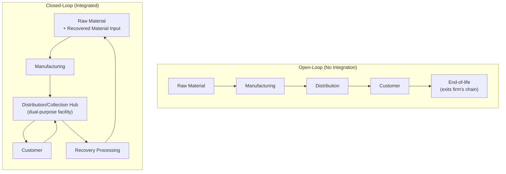
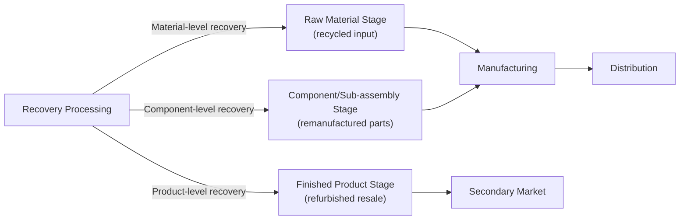

## Closed-Loop Supply Chain Design

### Definition and Scope

Closed-loop supply chain (CLSC) design is the integrated network architecture that unifies forward supply chain flows (raw material to production to distribution to customer) with reverse flows (customer back through collection, recovery, and reintegration into production) into a single, jointly optimized system, rather than treating forward and reverse logistics as separately designed and operated networks. This topic sits at the integration point of several previously covered subjects — circular design principles, remanufacturing/reverse logistics operations, and packaging materials flow — by addressing the network-level, jointly-optimized architecture that connects them, rather than any single recovery process or material category in isolation.

The defining architectural characteristic of closed-loop design is **joint optimization**: forward network decisions (facility location, capacity, inventory policy) and reverse network decisions (collection point placement, recovery facility location, core routing) are determined simultaneously with awareness of their interdependence, rather than the reverse network being designed afterward as an add-on to an already-fixed forward network.

### Closed-Loop vs. Open-Loop vs. Reverse-Only Supply Chains

**Key Points**

- **Open-loop supply chain**: A traditional linear supply chain with no reverse material flow back to the originating firm — used products exit the firm's supply chain entirely at end-of-use.
- **Reverse logistics (standalone)**: Reverse flows exist (as covered in the remanufacturing/reverse logistics topic) but are designed and managed as a largely separate network layered onto an existing, independently-designed forward network.
- **Closed-loop supply chain**: Forward and reverse flows are integrated into a single network design problem, with shared or coordinated infrastructure (facilities that serve both forward distribution and reverse consolidation functions, for example), and forward network decisions explicitly account for reverse flow requirements from the initial design stage.

### Core Design Principle: Joint Network Optimization

Traditional forward network design (as discussed under regionalization) optimizes facility location and capacity primarily against forward demand and cost minimization. Closed-loop design extends this optimization to simultaneously account for reverse flow origin points (where products are returned from), reverse flow volume and timing (as characterized in the reverse logistics topic's forecasting discussion), and the potential for shared facility infrastructure to serve both directions.

$$\min \sum_{f} \big[ C_{forward}(f) + C_{reverse}(f) - Value_{shared\_infrastructure}(f) \big]$$

where the objective jointly minimizes forward network cost and reverse network cost across the candidate facility set $f$, while crediting configurations that capture synergy value from shared/dual-purpose infrastructure rather than evaluating forward and reverse network costs independently. [Inference: this is a conceptual representation of the joint-optimization principle underlying closed-loop network design literature; actual closed-loop network optimization models used in operations research practice are considerably more complex (often formulated as mixed-integer programming problems with multiple echelons, product flows, and capacity constraints), and this simplified formulation illustrates the structural principle rather than a directly applicable solved model.]

### Key Architectural Decisions in Closed-Loop Network Design

#### 1. Facility Role Structure

**Key Points**

- **Dedicated forward and reverse facilities**: Separate facilities for forward distribution and reverse consolidation/recovery — simpler to design and operate but forgoes potential synergy value and generally requires more total facilities/infrastructure.
- **Dual-purpose (hybrid) facilities**: Single facilities serving both forward distribution and reverse consolidation functions — captures potential synergies in fixed infrastructure, transportation routing (using return-trip capacity, as noted in the reverse logistics topic), and labor/equipment utilization, but requires facility design and process flow accommodating both directions without operational conflict.
- **Centralized recovery with decentralized collection**: A common hybrid structure where collection/consolidation occurs at multiple decentralized points (minimizing reverse transportation distance from dispersed customers) while actual recovery processing (remanufacturing, recycling) occurs at fewer centralized facilities (capturing processing scale economies) — mirroring the centralized-vs-decentralized trade-off discussed in the remanufacturing topic, now framed as one design parameter within the broader joint network.

#### 2. Product and Material Flow Routing

Determining how recovered products/materials flow back into the forward network — whether recovered material re-enters at the raw material stage (recycling reintegration), the component stage (remanufactured component reintegration), or the finished product stage (refurbished product resale) — each routing option connects to a different point in the forward network and requires different integration design.

#### 3. Inventory Policy Integration

Closed-loop systems require inventory management that accounts for two coupled supply sources feeding production: conventional (virgin material/new component) procurement and recovered-material/component supply, which — as established in the reverse logistics topic — arrives with different volume predictability and lead-time characteristics than conventional procurement. Joint inventory policy design must reconcile this dual-source structure rather than treating recovered material supply as a simple substitute input with equivalent planning characteristics to virgin material.

**Key Points**

- **Uncertain recovered-supply buffering**: Given the volume and timing unpredictability of reverse flows (established in the reverse logistics topic), production planning in closed-loop systems typically maintains flexibility to draw variably on both conventional and recovered-material sourcing, rather than planning production around an assumed fixed recovered-material contribution.
- **Core-to-production ratio management**: For remanufacturing-integrated closed loops specifically, production planning must account for the fact that not every returned core is usable (some fraction is graded non-recoverable), requiring a buffer or ratio adjustment between core collection targets and planned remanufactured production volume.

#### 4. Information System Integration

A closed-loop network requires information systems capable of tracking product/material flow bidirectionally and linking reverse flow data (returns volume, condition, timing) to forward planning systems (production scheduling, procurement) — an integration requirement beyond what either a standalone forward planning system or a standalone reverse logistics tracking system would provide independently.

### Business Model Structures That Favor Closed-Loop Integration

Certain business models create structural conditions particularly favorable to closed-loop (rather than open-loop or standalone-reverse) architecture, connecting to structures introduced in the circular design principles topic:

| Business Model | Why It Favors Closed-Loop Integration |
| --- | --- |
| Product-as-a-Service / leasing | Firm retains ownership and predictable end-of-lease return timing, enabling tight forward-reverse coordination |
| Deposit-refund / trade-in programs | Creates structured, incentivized return timing correlated with new purchase, supporting the forward-reverse volume linkage |
| Industries with regulatory take-back mandates (e.g., certain electronics, automotive components in some jurisdictions) | Reverse flow becomes a compliance-driven, more predictable and mandatory network component rather than optional/voluntary |
| High unit-value durable goods with remanufacturing economics | Sufficient per-unit value to justify the coordination complexity and shared-infrastructure investment closed-loop design requires |

[Inference: the applicability and specific regulatory mandates for take-back programs vary considerably by jurisdiction, industry, and product category, and should be verified against current regulatory requirements for any specific compliance context.]

### Illustrative Example

**Example**

An office equipment manufacturer (e.g., multifunction printers) redesigns its supply chain from an open-loop to a closed-loop architecture:

1. **Business model shift**: The firm transitions a portion of its commercial customer base to a leasing model, retaining equipment ownership and establishing contractual end-of-lease return obligations — creating the predictable reverse flow timing that favors closed-loop integration, as discussed above.
2. **Facility redesign**: Rather than operating separate forward distribution centers and reverse logistics depots, the firm redesigns select regional distribution centers as dual-purpose facilities, using existing delivery vehicle return trips to collect end-of-lease units (as introduced in the reverse logistics topic), and adding consolidation and initial grading capability at these same facilities.
3. **Routing design**: Recovered units are graded and routed via three pathways: high-condition units to direct refurbishment and re-lease (product-level recovery, shortest loop), moderate-condition units to a centralized remanufacturing facility for full component-level rebuild, and non-recoverable units' materials to recycling processors (material-level recovery, longest loop back into raw material).
4. **Production planning integration**: The firm's production planning system is integrated with lease-return forecasting (using the historical lease-term distribution to project reverse flow timing, per the forecasting approach discussed in the reverse logistics topic) to determine the planned mix of new-build versus remanufactured unit production for upcoming periods.
5. **Result**: The firm achieves lower total network infrastructure cost than operating fully separate forward and reverse networks would have required (via the dual-purpose facility strategy), more predictable core supply for its remanufacturing operation (via the leasing-driven return structure), and reduced virgin material dependency — illustrating how closed-loop design integrates the business model, network topology, and recovery process decisions covered separately in prior topics into a single coordinated system.

### Performance Metrics Specific to Closed-Loop Integration

**Key Points**

- **Loop closure rate**: The proportion of units/materials entering the reverse flow that successfully complete the loop back into production (as opposed to exiting to residual disposal) — a measure of overall system recovery effectiveness distinct from any single process stage's efficiency.
- **Forward-reverse synergy capture**: Assessed via comparison of actual joint network cost against a hypothetical baseline of separately-optimized forward and reverse networks, isolating the value attributable specifically to joint design (shared facilities, coordinated routing) versus what either network would achieve independently. [Inference: this comparative baseline approach is a standard evaluation logic in network design literature generally, not a specific named metric with a single standardized calculation method.]
- **Recovered-input production ratio**: The proportion of total production input (by unit or material volume) sourced from the closed loop's own recovery process versus conventional procurement, tracking the practical degree of loop closure achieved in production planning terms.

### Trade-offs and Constraints

**Key Points**

- **Design complexity**: Joint optimization of forward and reverse networks is a more complex planning problem than either network designed independently, typically requiring more sophisticated network design modeling capability and cross-functional coordination (spanning the operations, logistics, and business-model design functions) than standalone forward network planning.
- **Facility design compromise**: Dual-purpose facilities serving both forward distribution and reverse consolidation/grading functions may require design compromises (space allocation, workflow layout, equipment) relative to a facility optimized purely for one function, a trade-off that must be weighed against the infrastructure-sharing cost savings.
- **Dependency on business model alignment**: As the business-model table above indicates, closed-loop integration's benefit case is strongest under specific business model conditions (leasing, take-back mandates, high unit value); attempting closed-loop integration without a structural mechanism ensuring adequate and predictable reverse flow volume risks under-utilized reverse infrastructure investment.
- **Organizational change requirement**: Because closed-loop design requires coordination across functions (forward supply chain planning, reverse logistics operations, and often sales/commercial teams managing lease or take-back customer relationships) that are frequently organized as separate functional silos, successful implementation often requires deliberate organizational and governance change alongside the network redesign itself.

**Related Topics**

- Circular supply chain design principles (conceptual foundation for closed-loop architecture)
- Remanufacturing, refurbishment, and reverse logistics (operational processes integrated within closed-loop networks)
- Regionalization and network center-of-gravity design (forward network design principles extended to joint optimization)
- Product-as-a-Service and leasing business models (structural enabler of closed-loop integration)
- Network design optimization and mixed-integer programming approaches
- Sustainable packaging and materials flow (material-level closed-loop integration)
- Extended Producer Responsibility (EPR) and take-back mandate regulation
- Information systems integration for bidirectional supply chain visibility