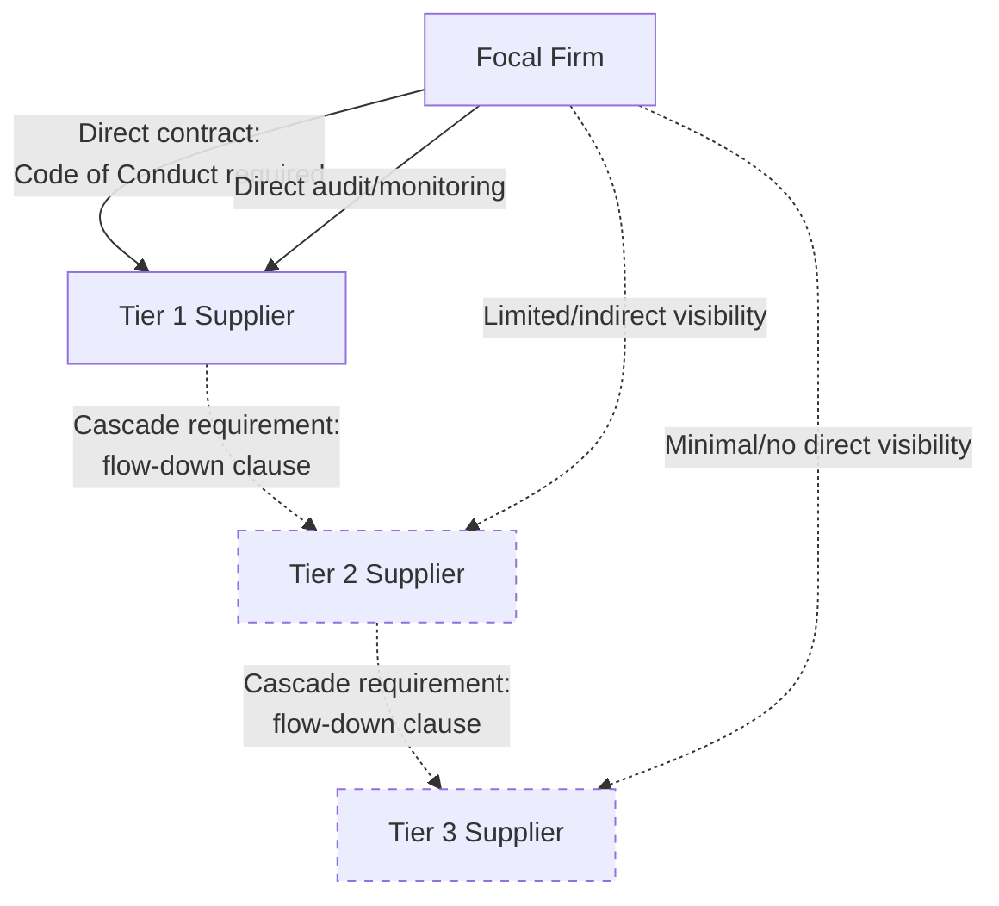

## Supplier Codes of Conduct and Tiered Enforcement

### Definition and Scope

A supplier code of conduct is a formal, documented set of behavioral and operational standards that a focal firm requires its suppliers to meet as a condition of the commercial relationship, typically covering labor practices, environmental compliance, health and safety, business ethics, and anti-corruption. Tiered enforcement refers to the mechanisms and governance structures used to extend, monitor, and enforce these standards not only at Tier 1 (the focal firm's direct contractual suppliers) but cascading through Tier 2, Tier 3, and deeper tiers — the same multi-tier visibility challenge established in earlier topics (resilience mapping, ESG integration, carbon measurement), now applied specifically to code-of-conduct compliance and enforcement.

This topic connects directly to the ESG integration topic's contractual integration point, expanding it into a dedicated treatment of how codes of conduct are structured, cascaded, and enforced as a distinct governance mechanism.

### Core Components of a Supplier Code of Conduct

**Key Points**

- **Labor standards**: Prohibitions on forced labor, child labor, and human trafficking; requirements for freedom of association, non-discrimination, fair wages (often referencing minimum wage or living wage standards), and limits on working hours.
- **Health and safety**: Minimum workplace safety standards, hazard management requirements, emergency preparedness, and safe working conditions.
- **Environmental compliance**: Requirements to comply with applicable environmental law, manage hazardous substances responsibly, and in more advanced codes, specific emissions, waste, or resource-use standards aligned with the firm's broader ESG program.
- **Business ethics and anti-corruption**: Prohibitions on bribery, corruption, conflicts of interest, and requirements for fair competition and accurate business record-keeping.
- **Management systems requirements**: Requirements that suppliers maintain their own internal compliance management systems (policies, training, grievance mechanisms) rather than relying solely on the focal firm's external monitoring — since a supplier with its own functioning compliance system is generally more likely to sustain compliant practices between external audit cycles than one relying entirely on periodic external checks.

### The Cascade Problem: Extending Codes Beyond Tier 1

**Key Points**

- **Direct contractual reach limitation**: A focal firm has direct contractual privity only with its Tier 1 suppliers; it has no direct contract with Tier 2 or deeper suppliers, meaning code-of-conduct requirements cannot be directly imposed on deep-tier suppliers through the focal firm's own contracts alone.
- **Cascade requirement clauses**: The standard mechanism for extending code-of-conduct reach is a contractual requirement that Tier 1 suppliers, in turn, impose equivalent (or the same) code-of-conduct standards on their own sub-suppliers — creating a cascading contractual chain rather than direct focal-firm-to-deep-tier enforcement.
- **Cascade fidelity degradation**: Each cascade step introduces a point of potential fidelity loss — a Tier 1 supplier's flow-down contract to Tier 2 may be less rigorously drafted, monitored, or enforced than the focal firm's own Tier 1 contract, and this degradation risk compounds at each successive tier, mirroring the general visibility-decay pattern established across the multi-tier topics in this chapter and prior chapters.
- **Verification of cascade compliance**: Because the focal firm cannot directly verify that its Tier 1 suppliers are actually flowing down and enforcing the code at Tier 2+, verification of the cascade itself (not just verification of ultimate deep-tier compliance) becomes a distinct governance requirement.

The dashed relationships in the diagram represent the structural weakening of both contractual enforceability and monitoring visibility as tier depth increases — the central architectural challenge this topic addresses.

### Tiered Enforcement Mechanisms

#### 1. Contractual Cascade Design

**Key Points**

- **Flow-down clauses**: Contract language requiring Tier 1 suppliers to include equivalent code-of-conduct obligations in their own supplier contracts, with specificity varying from general ("supplier shall ensure its own suppliers meet comparable standards") to prescriptive (requiring the exact code language or a designated equivalent standard).
- **Audit rights extension**: Contractual provisions granting the focal firm (or its designated third-party auditors) the right to audit not only the Tier 1 supplier but, in more rigorous structures, named or categories of sub-suppliers — though the practical exercise of this right at deep tiers is often limited by resource constraints and the sheer number of deep-tier entities.
- **Joint and several responsibility structures**: Some contract structures hold the Tier 1 supplier partially or wholly responsible for sub-supplier non-compliance, creating a direct commercial incentive for the Tier 1 supplier to actively manage and enforce compliance within its own supply base, rather than treating the cascade requirement as a passive documentation exercise.

#### 2. Risk-Based Tiered Monitoring

Given the practical infeasibility of directly auditing every entity across all tiers, monitoring effort is typically allocated using a risk-based, tiered approach rather than uniform coverage:

| Monitoring Tier | Typical Approach | Coverage Logic |
| --- | --- | --- |
| Tier 1, high-risk category/geography | Direct, frequent third-party audits | Highest direct focal-firm control and highest risk concentration |
| Tier 1, lower-risk category/geography | Self-assessment questionnaires with periodic verification sampling | Lower direct oversight burden justified by lower assessed risk |
| Tier 2, identified high-risk (via mapping) | Targeted audits, often supplier-facilitated | Resource-constrained targeting toward highest-risk known sub-suppliers |
| Tier 2+, general population | Reliance on cascade contractual requirement and Tier 1 supplier's own oversight, with spot-check verification | Practical necessity given scale; connects to the same risk-weighted verification logic established in the ESG integration topic |

This structure directly parallels the risk-weighted audit sampling approach and the progressive primary-data-refinement approach discussed in the ESG integration and carbon footprint measurement topics respectively — a recurring pattern across this chapter and the sustainability chapter, where full uniform coverage is infeasible and risk/materiality-based prioritization is the standard practical response.

#### 3. Supplier Self-Governance Requirements

Rather than relying solely on focal-firm-driven audit, more mature enforcement structures require Tier 1 (and where feasible, deeper-tier) suppliers to maintain their own internal compliance infrastructure:

- Designated internal compliance ownership/responsibility within the supplier's own organization.
- Supplier-level grievance mechanisms allowing the supplier's own workers to report violations, which can surface issues that external periodic audits might miss between audit cycles.
- Supplier-conducted self-assessments of their own sub-suppliers, effectively distributing enforcement responsibility down the chain rather than concentrating all verification effort at the focal firm level.

#### 4. Industry Collaborative and Multi-Stakeholder Mechanisms

**Key Points**

- **Shared audit/certification schemes**: Industry-wide or multi-stakeholder certification programs (third-party verified standards that multiple focal firms recognize) allow a single supplier audit to serve multiple buyer firms' compliance requirements, reducing audit burden duplication and, in principle, extending effective coverage to more suppliers than any single firm's own audit program could reach independently.
- **Collaborative deep-tier mapping initiatives**: Some industry associations or multi-stakeholder initiatives pool supply chain mapping data across member firms, addressing the deep-tier visibility problem at an industry level rather than requiring each firm to independently map the same shared deep-tier suppliers.
- **Limitations of collaborative approaches**: Shared schemes depend on consistent standard definitions and mutual recognition across participating firms; inconsistent standards or non-participation by key buyers in a given supplier's customer base can limit the practical coverage benefit. [Inference: the specific effectiveness and adoption levels of particular collaborative schemes vary by industry and specific initiative, and general claims about their effectiveness should not be treated as uniformly applicable across all industry contexts without verification against current program-specific data.]

### Violation Response and Remediation Structures

**Key Points**

- **Escalating consequence structures**: Rather than immediate contract termination upon any first-instance finding (which, as noted in the ESG integration topic, is often neither commercially feasible at scale nor the most effective mechanism for improving actual practices), most mature enforcement frameworks use a graduated response: initial finding triggers a corrective action plan (CAP) with a defined remediation timeline, followed by re-audit; repeated or severe/egregious violations trigger more significant consequences up to and including contract termination.
- **Severity-based differentiation**: Zero-tolerance categories (e.g., child labor, forced labor, immediate life-safety hazards) typically bypass the standard graduated CAP process and require immediate remediation or immediate relationship consequences, distinct from lower-severity findings (documentation gaps, minor safety deficiencies) that follow the standard corrective-action timeline.
- **Remediation-focused vs. punitive-focused philosophy**: A significant body of practice and critique in this domain distinguishes between enforcement approaches that prioritize immediate supplier exit upon violation (which can simply shift the affected workers/community's exposure to a different, potentially less-scrutinized buyer without actually improving conditions) versus approaches prioritizing sustained engagement and remediation support, particularly for lower-severity or systemic (industry-wide) issues. [Inference: the relative effectiveness of punitive versus remediation-focused enforcement approaches is a genuinely debated area in supply chain ethics and labor rights literature, with reasonable disagreement among practitioners and researchers about the appropriate balance depending on violation severity and context; this should be treated as a live area of professional judgment rather than a settled methodological question.]

### Illustrative Example

**Example**

An apparel and footwear company restructures its supplier code of conduct enforcement across a multi-tier supply base:

1. **Code development and Tier 1 contractual integration**: The firm establishes a code of conduct covering labor, safety, and environmental standards, incorporated as a binding contractual term in all Tier 1 (garment assembly/finishing) supplier agreements, with defined audit rights and a graduated corrective-action process for violations.
2. **Cascade requirement design**: Tier 1 contracts include a flow-down clause requiring Tier 1 suppliers to impose equivalent standards on their own named fabric and material sub-suppliers (Tier 2), with Tier 1 suppliers contractually responsible for maintaining records of their own sub-supplier compliance verification.
3. **Risk-based monitoring allocation**: Direct third-party audits are conducted for all Tier 1 facilities, with audit frequency increased for facilities in higher-risk geographies (based on established labor-risk indices). For Tier 2 fabric mills identified through the firm's multi-tier mapping program (as discussed in the ESG integration topic), the firm conducts targeted audits for the highest-risk facilities and relies on cascade contractual requirements with periodic spot-verification for the remainder.
4. **Violation response**: A Tier 1 audit identifies excessive overtime hours at one facility (a moderate-severity finding); the facility is placed on a 90-day corrective action plan with a defined remediation timeline and re-audit, rather than immediate contract termination. A separate audit at a different facility identifies indicators of forced labor (a zero-tolerance category); this triggers the firm's immediate escalation protocol rather than the standard CAP process.
5. **Result**: The firm achieves layered enforcement coverage — direct, high-confidence monitoring at Tier 1, targeted risk-based monitoring at identified high-risk Tier 2 facilities, and cascade-contract-based (lower-confidence but broader) coverage across the remaining supply base — illustrating the practical, resource-constrained trade-offs inherent in extending code-of-conduct enforcement across tier depth, structurally consistent with the risk-based approaches established across ESG and carbon measurement topics in this program.

### Structural Constraints and Critiques

**Key Points**

- **Audit fatigue and gaming**: Suppliers subject to frequent audits from multiple buyer firms (each with similar but not identical code requirements) can experience audit fatigue, and in some documented cases, suppliers or facilities have engaged in audit preparation practices that present a compliant appearance during scheduled audits without reflecting sustained day-to-day practice — a widely discussed limitation of audit-based verification generally. [Inference: the prevalence and extent of this "audit gaming" phenomenon is discussed in supply chain ethics literature as a known risk category rather than a claim about any universal or majority occurrence; specific prevalence figures vary by source and should not be treated as precisely established.]
- **Resource asymmetry at deep tiers**: The practical capacity of a focal firm to enforce standards diminishes with tier depth not only due to visibility limits but due to the compounding number of entities at deeper tiers, making uniform, high-confidence enforcement across all tiers of a large, complex supply chain a persistent structural challenge rather than a solvable one-time implementation problem.
- **Power asymmetry and small-supplier burden**: Code-of-conduct compliance and audit costs can represent a disproportionate burden for smaller suppliers (particularly at deeper tiers) relative to their commercial relationship size, potentially creating unintended consequences (reduced willingness to engage with buyers requiring extensive compliance documentation) that must be weighed against the enforcement objective.
- **Standard fragmentation across buyers**: As noted in the industry-collaborative mechanisms discussion, inconsistent code requirements and audit standards across different buyer firms sourcing from the same supplier create duplicated compliance burden that collaborative/shared-standard approaches only partially resolve given inconsistent adoption.

**Related Topics**

- ESG integration and contractual ESG clause design (direct foundational connection)
- Multi-tier supply chain mapping and deep-tier visibility infrastructure
- Third-party audit methodology and corrective action plan (CAP) design
- Forced labor and human rights due diligence regulatory requirements
- Industry collaborative certification schemes and shared audit programs
- Grievance mechanism design for worker-reported violations
- OECD Due Diligence Guidance for responsible business conduct
- Regulatory mandatory human rights and environmental due diligence laws