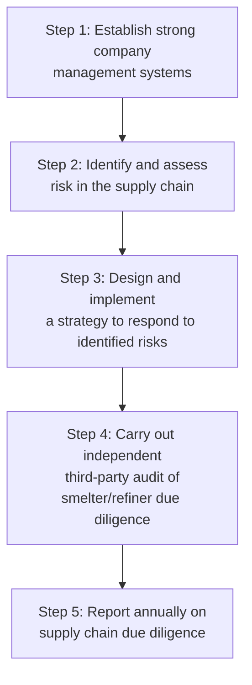
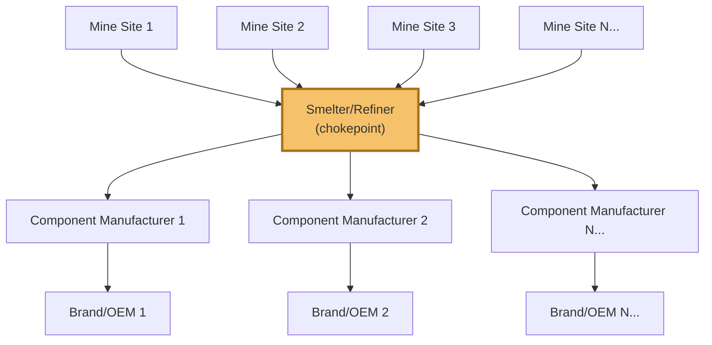

## Conflict Minerals and Responsible Minerals Sourcing

### Definition and Scope

Conflict minerals are minerals — most prominently tin, tantalum, tungsten, and gold, collectively referred to as **3TG** — whose extraction and trade have been linked to financing armed conflict, human rights abuses, and instability, historically centered on the Democratic Republic of the Congo (DRC) and adjoining countries. Responsible minerals sourcing is the broader supply chain discipline of due diligence, traceability, and verification designed to ensure a firm's mineral inputs are not sourced from conflict-financing or human-rights-abusing operations, extending both the geographic scope (beyond the DRC region) and the mineral scope (beyond 3TG) as the discipline has matured. This topic is a specific, heavily regulated application of the multi-tier due diligence and traceability infrastructure introduced in the ESG integration topic, distinguished by its origin in binding securities-disclosure and import regulation rather than voluntary ESG commitment alone.

### Regulatory Foundation

**Key Points**

- **U.S. Dodd-Frank Act Section 1502 (2010)**: Regulates the use of "conflict minerals," the so-called 3TGs: tin, tantalum, tungsten, and gold, requiring manufacturers who file certain reports with the SEC to disclose whether products they manufacture or contract to manufacture contain conflict minerals necessary to the functionality or production of those products. The SEC issued its Conflict Minerals Rule in August 2012 along with guidance for how companies should report on mineral sourcing. [Michigan Business & Entrepreneurial Law Review +2](https://www.mbelr.org/conflict-minerals-a-noble-cause-a-controversial-solution-and-an-uncertain-future-part-1-of-2/)
- **EU Conflict Minerals Regulation (2017/821)**: Aims to ensure EU importers of 3TG meet international responsible sourcing standards set by the OECD, ensure global and EU smelters and refiners of 3TG source responsibly, and help break the link between conflict and illegal mineral exploitation. Requirements for EU importers have applied since January 1, 2021. [trelleborg](https://www.trelleborg.com/en/fluidhandling/news-and-events/conflict-minerals)[trelleborg](https://www.trelleborg.com/en/fluidhandling/news-and-events/conflict-minerals)
- **Status of the U.S. requirement is currently unsettled**: H.R. 7085, introduced in the 119th Congress, proposes to repeal the conflict minerals disclosure requirements established under Section 1502, which would eliminate the requirement for publicly listed companies to disclose 3TG sourcing from the DRC/adjoining countries or conduct due diligence on those supply chains. The bill passed the House and has been referred to the Senate, with its ultimate progress uncertain as of its most recent reporting. Firms operating compliance programs built around Section 1502 should treat this as an active, unresolved legislative development rather than a settled requirement, and should verify current status before relying on this content for compliance purposes. [cdxsystem](https://public.cdxsystem.com/en/web/cdx/w/u.s.-congress-h.r.-7085-on-conflict-minerals-disclosure)
- **EU regulation itself is also evolving**: the EU Conflict Minerals Regulation had operated under a fairly stable due diligence framework since taking full effect in 2021, but this is now shifting amid a newly recognized due diligence scheme, an evolving transparency platform, and a review of the regulation itself, indicating the EU framework should also be checked against current guidance rather than assumed static. [environmentalpeacebuilding](https://www.environmentalpeacebuilding.org/news/show/03b6e1b3a8c8)
- **Non-binding international frameworks**: Several jurisdictions (China, Canada, Australia) maintain non-binding guidance generally aligned with OECD due diligence principles rather than mandatory disclosure regimes, reflecting a spectrum of regulatory approaches from voluntary alignment to binding disclosure/import requirements. [Inference: the specific binding/non-binding status and content of guidance in non-US/EU jurisdictions may change over time and should be verified against current sources for jurisdiction-specific compliance needs.]

### Why 3TG Minerals Specifically

**Key Points**

- **Tin, tantalum, tungsten**: Derived from ores (cassiterite for tin, columbite-tantalite/"coltan" for tantalum, wolframite for tungsten) historically mined in conflict-affected areas of the DRC and surrounding region, with proceeds from mining and trade alleged to help finance armed groups.
- **Gold**: Included due to its high value-to-weight ratio and historical role as a similarly conflict-financing-linked commodity in the same region, though gold's global supply chain (encompassing artisanal, small-scale, and large-scale industrial mining across many countries) is structurally more complex to trace than the other 3TG minerals.
- **Functional ubiquity**: These four minerals are used extensively across electronics, aerospace, automotive, jewelry, and industrial manufacturing (tantalum in capacitors, tin in solder, tungsten in cutting tools and electronics, gold in electrical contacts and plating), meaning the regulatory scope affects an unusually broad range of downstream industries relative to many other targeted-commodity regulations.

### The OECD Due Diligence Framework

The **OECD Due Diligence Guidance for Responsible Supply Chains of Minerals from Conflict-Affected and High-Risk Areas** is the internationally referenced methodological foundation underlying both the EU regulation and voluntary industry programs, structured around a five-step process:

**Key Points**

- **Step 1 (Management systems)**: Establishing internal policy, supply chain mapping capability, and grievance mechanisms — the organizational infrastructure prerequisite, mirroring the governance structures discussed in the ESG integration topic.
- **Step 2 (Risk identification)**: Assessing supply chain risk, specifically identifying the smelters and refiners in the supply chain (a critical structural point addressed below) and evaluating their sourcing practices against conflict-risk indicators.
- **Step 3 (Risk response strategy)**: Designing mitigation actions for identified risks, ranging from continued engagement with remediation requirements to sourcing suspension for the highest-risk relationships.
- **Step 4 (Third-party audit)**: Independent verification of smelter/refiner due diligence practices — a critical control point given the chokepoint structural role smelters/refiners play (discussed next).
- **Step 5 (Annual reporting)**: Public or regulatory disclosure of the due diligence process and findings.

### The Smelter/Refiner Chokepoint: A Structural Solution to the Deep-Tier Visibility Problem

**Key Points**

- **The core structural insight**: Unlike the general multi-tier visibility problem discussed throughout this program (where deep-tier suppliers are numerous and progressively harder to identify), 3TG mineral supply chains have a natural structural chokepoint: raw ore from many dispersed, deep-tier mine sites must pass through a comparatively small number of smelters and refiners before being processed into a form usable in manufacturing.
- **Why this matters for traceability architecture**: Because the smelter/refiner layer aggregates material from numerous upstream mine sites but supplies a much larger number of downstream manufacturers, verifying and certifying smelter/refiner sourcing practices provides leveraged traceability assurance — a single verified smelter's compliance status is relevant to every downstream firm sourcing (even indirectly) from that smelter, rather than requiring each downstream firm to trace individually back to specific mine sites.
- **Practical implication for enforcement design**: This structural chokepoint is why responsible minerals sourcing programs are architected differently from the general code-of-conduct cascade model discussed in the prior topic — enforcement effort concentrates on identifying and verifying the smelter/refiner layer specifically, rather than attempting a uniform tier-by-tier cascade down to individual mine sites.

### Industry Traceability Infrastructure

**Key Points**

- **Responsible Minerals Initiative (RMI)**: Founded in 2008, an industry collaborative program providing smelter/refiner audit and certification infrastructure (a Responsible Minerals Assurance Process) and standardized reporting tools, functioning analogously to the industry collaborative certification schemes discussed in the supplier code-of-conduct topic — allowing a single smelter/refiner audit and certification to serve many downstream buyer firms rather than requiring duplicated individual audits. [z2data](https://www.z2data.com/es/guides/conflict-minerals/)
- **Reporting template standardization**: Industry-standard reporting templates (widely known as the Conflict Minerals Reporting Template, or similar successor/expanded templates) allow downstream firms to collect standardized smelter/refiner sourcing declarations from their direct suppliers, propagating up the supply chain in a structured, comparable format rather than bespoke firm-by-firm data requests.
- **Mineral scope expansion**: Reporting templates have expanded beyond the original 3TG scope — for example, adding minerals such as copper, graphite, lithium, and nickel in 2025 updates to relevant reporting templates, reflecting the broader trend of responsible sourcing programs extending to minerals critical to other supply chains (notably battery and energy-transition-related minerals) beyond the original conflict-minerals scope. [Inference: exact template versions, scope, and specific minerals covered are subject to periodic updates by the maintaining organizations and should be verified against current published template versions for compliance purposes.] [z2data](https://www.z2data.com/es/guides/conflict-minerals/)

### Compliance Program Architecture

#### 1. Reasonable Country of Origin Inquiry (RCOI)

The initial compliance step under the Dodd-Frank framework — a good-faith inquiry into whether a firm's 3TG-containing products may have originated from the covered conflict region, determining whether full due diligence and reporting obligations are triggered.

#### 2. Supply Chain Mapping to the Smelter/Refiner Level

Rather than attempting to map an entire supply chain to the individual mine site (generally infeasible given the number and informality of many mine sites, particularly artisanal and small-scale mining operations), compliance programs focus mapping effort on identifying the specific smelters/refiners in the supply chain — directly leveraging the chokepoint structure described above.

#### 3. Smelter/Refiner Verification Against Certified Lists

Cross-referencing identified smelters/refiners against industry-maintained lists of audited, certified "conformant" facilities (via RMI or equivalent programs), differentiating the compliance response for certified versus non-certified or unknown smelters/refiners in the supply chain.

#### 4. Conflict Minerals Reporting

Preparation of the formal disclosure (where legally required) — historically the SEC Conflict Minerals Report under Dodd-Frank, and the equivalent EU due diligence reporting via the EU Due Diligence Portal — documenting the due diligence process, findings, and any identified risk mitigation actions. [z2data](https://www.z2data.com/es/guides/conflict-minerals/)

### Illustrative Example

**Example**

An electronics manufacturer operates a responsible minerals sourcing program for tantalum capacitors used in its products:

1. **RCOI**: The firm surveys its direct (Tier 1) component suppliers to determine whether tantalum in purchased capacitors may originate from the DRC region or adjoining countries, using a standardized industry reporting template.
2. **Smelter identification**: Rather than attempting to trace to individual mine sites, the firm requires Tier 1 suppliers to identify the specific tantalum smelters in their supply chain — leveraging the chokepoint structure, since a relatively small number of tantalum smelters globally service the industry's capacitor supply chain.
3. **Certification cross-check**: Identified smelters are checked against the current industry-maintained list of audited, conformant facilities; smelters not on the certified list trigger additional due diligence inquiry or, for persistent non-response, consideration of alternate sourcing.
4. **Risk response**: For any smelter identified as sourcing from a high-risk area without adequate due diligence evidence, the firm engages with its direct supplier to either obtain additional assurance or transition sourcing to a certified alternative smelter.
5. **Reporting**: The firm compiles findings into its required disclosure filing, documenting the due diligence process undertaken, consistent with the applicable regulatory framework(s) in its operating jurisdictions.
6. **Result**: The firm achieves leveraged supply chain assurance by concentrating verification effort at the smelter/refiner chokepoint rather than attempting infeasible direct mine-site-level tracing — while remaining dependent on the accuracy of upstream supplier declarations and the coverage/currency of the industry certification list, both practical limitations of the model discussed below.

### Constraints and Critiques

**Key Points**

- **Declaration reliability**: Compliance programs depend heavily on the accuracy of self-reported smelter/refiner identification by direct suppliers, who themselves depend on their own upstream suppliers' declarations — reintroducing a version of the cascade-fidelity-degradation risk discussed in the code-of-conduct topic, since the firm has no independent means of verifying supplier-reported smelter identification beyond the declaration itself absent further investigation.
- **Unintended de facto boycott effects**: A widely discussed critique, reflected in ongoing academic and policy analysis, is that compliance-driven sourcing avoidance of the DRC region entirely (rather than sourcing specifically from verified conflict-free operations within the region) can have the unintended effect of economically harming legitimate, non-conflict-linked artisanal miners and communities in the region whose livelihoods depend on mineral trade — a tension between the law's stated humanitarian intent and its documented practical complications. [Inference: the extent and magnitude of this unintended economic effect is a subject of ongoing debate and empirical study in the policy literature rather than a settled, uniformly agreed-upon finding, and should be treated as a genuinely contested area rather than a definitive conclusion.] [mbelr](https://www.mbelr.org/conflict-minerals-a-noble-cause-a-controversial-solution-and-an-uncertain-future-part-1-of-2/)
- **Compliance cost burden**: Compliance is deliberately structured to be burdensome, requiring companies to file multiple forms with the SEC and publish a Conflict Minerals Report in both their annual report and on their website, affirming country of origin and providing supporting evidence — a significant administrative and investigative cost, particularly for firms with complex, high-part-count products (electronics being a frequently cited example) sourcing from numerous suppliers. [brookings](https://www.brookings.edu/opinions/conflict-minerals-an-assessment-of-the-dodd-frank-act/)
- **Regulatory uncertainty as an active risk factor**: Given the pending U.S. legislative repeal effort and the EU regulation's own stated review process described above, firms currently face genuine uncertainty about the future binding status of specific disclosure requirements — a distinct compliance-planning risk from the underlying due diligence practice itself, since many firms may reasonably choose to maintain due diligence infrastructure regardless of the formal disclosure mandate's status, given continued customer, investor, and reputational expectations independent of strict legal requirement.
- **Artisanal and small-scale mining (ASM) traceability difficulty**: A substantial portion of mineral production in some conflict-affected and high-risk areas originates from informal, artisanal, and small-scale mining operations that are inherently harder to trace and formally verify than large-scale industrial mining operations, representing a persistent structural limitation of due diligence programs regardless of downstream compliance rigor. [Inference: the proportion of supply originating from ASM operations varies by mineral and region and should not be treated as a fixed universal figure.]

**Related Topics**

- Supplier codes of conduct and tiered enforcement (structural comparison: cascade model vs. chokepoint model)
- ESG integration and multi-tier due diligence infrastructure (foundational connection)
- OECD Due Diligence Guidance for responsible business conduct
- Responsible Minerals Initiative (RMI) and smelter/refiner certification programs
- Critical minerals sourcing for battery and energy-transition supply chains (scope expansion trend)
- Human rights due diligence regulatory frameworks (EU and international)
- Artisanal and small-scale mining (ASM) formalization and traceability challenges
- SEC disclosure requirements and securities-law-driven supply chain compliance