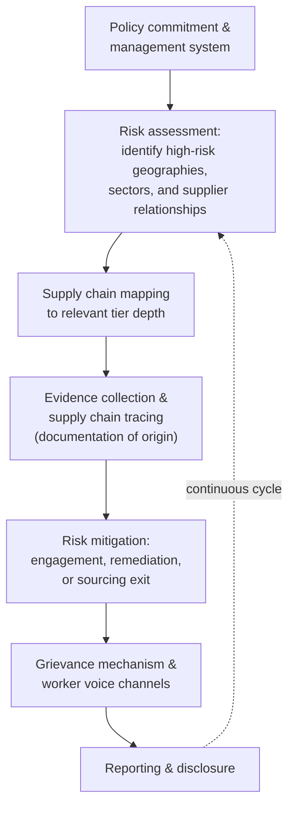

## Forced Labor and Human Rights Due Diligence

### Definition and Scope

Forced labor and human rights due diligence is the supply chain discipline of identifying, preventing, mitigating, and accounting for forced labor and broader human rights risks across a firm's own operations and its multi-tier supply chain. This topic is distinguished from the general supplier code-of-conduct enforcement topic by its focus on a specific, legally elevated risk category — forced labor is treated by an increasing number of regulatory regimes not merely as one compliance item among many but as a category triggering distinct legal mechanisms (import bans, mandatory due diligence directives, rebuttable legal presumptions) that operate differently from general code-of-conduct enforcement.

### Defining Forced Labor and Related Concepts

**Key Points**

- **Forced labor**: Work or service exacted from any person under the menace of penalty and for which the person has not offered themselves voluntarily — a definition rooted in International Labour Organization (ILO) conventions and widely referenced across national and regional regulatory frameworks.
- **Human trafficking**: The recruitment, transport, transfer, harboring, or receipt of persons through coercion, deception, or abuse of vulnerability for purposes of exploitation, which frequently intersects with but is legally distinct from forced labor as a standalone category.
- **Related but distinct exploitative labor categories**: Debt bondage, indentured servitude, and the worst forms of child labor are related concepts frequently addressed within the same due diligence frameworks, though each carries specific legal definitions that can differ by jurisdiction and instrument.
- **State-imposed forced labor**: A distinct sub-category involving forced labor imposed or facilitated by state authorities or state-linked programs, which has become the specific focus of certain import-ban regimes (discussed below) rather than only privately-perpetrated forced labor.

### Regulatory Landscape

#### 1. Import Ban Mechanisms (United States)

**Key Points**

- **Section 307 of the Tariff Act of 1930**: The longstanding U.S. statutory foundation prohibiting the importation of goods mined, produced, or manufactured wholly or in part by forced, convict, or indentured labor — enforced historically by U.S. Customs and Border Protection (CBP) through Withhold Release Orders (WROs) requiring detention of goods reasonably suspected of forced labor involvement.
- **Uyghur Forced Labor Prevention Act (UFLPA)**: Signed into law December 2021, effective June 21, 2022, the UFLPA establishes a rebuttable presumption that goods mined, produced, or manufactured wholly or in part in the Xinjiang Uyghur Autonomous Region (XUAR) of China were made with forced labor and are therefore inadmissible into the United States under Section 307, unless the importer produces documentation meeting a "clear and convincing evidence" standard to qualify for an exception. The prohibition extends to finished products manufactured in whole or in part using inputs sourced directly or indirectly from Xinjiang, even when the finished product is imported from a country other than China.
- **UFLPA Entity List mechanism**: The interagency Forced Labor Enforcement Task Force (FLETF) maintains and designates an Entity List of companies with links to Xinjiang forced labor; products sourced from listed companies are subject to the rebuttable presumption regardless of where the product is actually produced, extending the import-ban reach beyond the XUAR's own geographic boundary to any listed entity's global operations.
- **Rebuttal burden structure**: The "clear and convincing evidence" standard for rebutting the presumption places a substantial documentation and supply chain tracing burden on importers — a materially higher evidentiary bar than the "reasonably indicating" standard that previously governed pre-UFLPA Withhold Release Orders, representing a significant intensification of the enforcement mechanism.
- **Current enforcement-intensity development [as of the most recent available reporting]**: More recent reporting indicates a notable decline in UFLPA enforcement activity — data reportedly showing more than a fourfold drop in stopped shipments across a recent five-month comparison period, and the FLETF has not added any new entities to the UFLPA Entity List since January 15, 2025, despite what advocacy organizations describe as ongoing evidence of forced labor transfers in the region. [Unverified: this reflects reporting current as of January 2026 from an advocacy-affiliated source describing a Congressional inquiry into the decline; the underlying enforcement data, its interpretation, and any subsequent developments should be independently verified against CBP/FLETF official reporting and current news sources given both the sensitivity and the evolving nature of this specific claim.] This illustrates an important general principle for compliance planning: a law remaining formally in effect does not guarantee consistent enforcement intensity over time, and firms should distinguish between legal validity and current enforcement posture when assessing actual compliance risk.

#### 2. Mandatory Due Diligence Directives (European Union)

**Key Points**

- **Shift from voluntary to mandatory due diligence**: The EU regulatory trend has moved toward mandatory human rights and environmental due diligence obligations for companies operating in or importing to the EU market, extending beyond the sector-specific conflict minerals regulation toward broader corporate due diligence requirements — a structural shift from the largely voluntary code-of-conduct model discussed in the prior topic toward legally mandated due diligence with associated liability exposure.
- **Due diligence process requirements**: Mandatory frameworks in this space typically require companies to identify, prevent, mitigate, and account for adverse human rights and environmental impacts across their own operations and value chains, structurally mirroring the OECD five-step due diligence process introduced in the conflict minerals topic, now applied to the broader human rights domain rather than mineral sourcing specifically.
- **EU forced labor product ban**: In parallel with due diligence directives, the EU has also developed a distinct product-ban mechanism specifically targeting forced-labor-made goods, structurally analogous to (though legally distinct in mechanism from) the U.S. Section 307/UFLPA import-ban approach, reflecting convergence toward import-restriction tools as a complement to due diligence-based regulation. [Inference: the specific current status, implementation timeline, and precise mechanics of EU forced labor product ban and mandatory due diligence directive instruments are subject to ongoing legislative and implementation developments; given the pace of change in this area, current status should be verified against official EU sources rather than assumed static.]

#### 3. Comparative Structural Note: Import Ban vs. Due Diligence Directive Models

| Dimension | Import Ban Model (e.g., U.S. Section 307/UFLPA) | Mandatory Due Diligence Directive Model (e.g., EU) |
| --- | --- | --- |
| Primary mechanism | Prohibits entry of goods at the border | Requires companies to conduct and document a due diligence process |
| Burden of proof | Often reversed (rebuttable presumption) for designated high-risk origins | Process-based compliance; liability typically tied to due diligence adequacy, not a factual presumption about specific goods |
| Enforcement point | Customs/border authority at point of import | Corporate regulator/civil liability framework, potentially independent of any single shipment |
| Geographic/entity targeting | Can target specific regions or listed entities specifically | Generally broader value-chain due diligence obligation, less origin-specific |

[Inference: this comparative framing is a structural simplification for pedagogical clarity; the actual mechanics, scope, and interaction between these regulatory models are considerably more detailed and continue to evolve, and specific compliance obligations should be assessed against current legal text and qualified legal counsel rather than this general comparison.]

### Due Diligence Process Architecture for Forced Labor Risk

**Key Points**

- **Risk assessment prioritization**: Given the practical infeasibility of uniform deep-tier investigation across an entire supply base (the same structural constraint established throughout this chapter), forced labor due diligence typically prioritizes risk assessment by geography (regions with documented state-imposed or systemic forced labor risk), sector (industries with known elevated forced labor prevalence, such as certain agricultural, textile, and extractive sectors), and specific entity risk indicators.
- **Supply chain tracing as evidentiary requirement**: Unlike general code-of-conduct compliance (where audit findings inform a graduated remediation response), forced labor due diligence under import-ban regimes specifically requires documentary evidence sufficient to affirmatively demonstrate the absence of forced labor in the traced supply chain — a higher and more specific evidentiary bar than general risk-based monitoring, particularly under a rebuttable-presumption framework.
- **Worker voice and grievance mechanisms**: Given that forced labor circumstances (by definition involving coercion) are less likely to be self-reported or visible through standard document-based audit alone, due diligence frameworks increasingly emphasize direct worker interview methodologies and independent grievance channels as a complement to (not substitute for) document-based verification — reflecting a recognized limitation of audit-only approaches, a concern also noted regarding audit gaming in the supplier code-of-conduct topic.
- **Remediation vs. exit decision**: Consistent with the remediation-focused vs. punitive-focused tension discussed in the code-of-conduct topic, forced labor findings present a particularly acute version of this dilemma — immediate sourcing exit may be the only response consistent with a strict legal prohibition (as under an import ban), while some due diligence directive frameworks explicitly favor engagement and remediation over immediate exit where remediation is judged more likely to improve conditions for affected workers, creating a genuine tension between different regulatory philosophies that a firm operating under multiple regimes simultaneously may need to navigate.

### Supply Chain Tracing Methodologies

**Key Points**

- **Document-based tracing**: Collecting and verifying chain-of-custody documentation (purchase records, bills of lading, certificates of origin) tracing material or product flow back through the supply chain — the primary evidentiary method for import-ban rebuttal purposes, directly connecting to the traceability infrastructure discussed in the ESG integration and conflict minerals topics.
- **Isotopic and forensic testing**: In specific higher-scrutiny contexts (particularly relevant for commodities like cotton, given documented Xinjiang cotton concerns), scientific testing methods (such as isotopic testing) can provide independent, non-documentary evidence of material geographic origin, supplementing or cross-verifying paper-based chain-of-custody claims. [Inference: the specific scientific testing methodologies available, their accuracy, cost, and practical adoption level vary by commodity and continue to develop; specific technical claims about testing capability should be verified against current technical sources for any application requiring precision.]
- **Third-party verification and audit**: As discussed in the code-of-conduct topic, independent audit remains a core verification mechanism, though subject to the same audit-gaming and access limitations noted there — a limitation of particular concern in forced labor contexts involving state-imposed labor programs, where independent auditor access may itself be restricted or compromised in ways that undermine standard audit reliability. [Inference: the reliability of third-party audit specifically in contexts involving alleged state-imposed forced labor is a subject of documented concern in policy and human rights literature, given restricted access and potential coercion of audited parties in such contexts; this should be treated as a recognized limitation rather than a claim that audits are universally unreliable in all forced labor contexts.]

### Illustrative Example

**Example**

An apparel company builds a forced labor due diligence program addressing both U.S. import compliance and broader human rights due diligence expectations:

1. **Risk assessment**: The firm identifies cotton and cotton-derived textile inputs as a specific elevated-risk category given documented regulatory concern regarding the Xinjiang region, prioritizing this input category for enhanced due diligence relative to lower-risk material categories.
2. **Supply chain mapping**: The firm extends its multi-tier mapping (building on the mapping infrastructure discussed in the ESG integration topic) specifically to trace cotton origin from raw fiber through spinning, weaving, and finishing stages, rather than relying on Tier 1 garment-assembly-level sourcing declarations alone.
3. **Evidentiary documentation**: For cotton-containing products destined for the U.S. market, the firm compiles documentary chain-of-custody evidence sufficient to support a "clear and convincing evidence" rebuttal position should any shipment be flagged under the UFLPA's rebuttable presumption, while separately maintaining broader supplier due diligence documentation to meet due diligence directive expectations in other markets.
4. **Worker voice mechanism**: The firm implements a worker-accessible grievance channel at key Tier 1 facilities, providing a complementary information source to document-based tracing and periodic audit, recognizing the acknowledged limitation of audit-only verification for coercion-based risks.
5. **Ongoing monitoring given enforcement uncertainty**: Despite noted fluctuation in specific enforcement intensity (as discussed above), the firm maintains its due diligence infrastructure at consistent rigor rather than scaling down in response to any observed enforcement lull — reflecting the practical reality that the underlying legal prohibition remains in effect, that enforcement intensity can change without notice, and that multiple overlapping regulatory regimes (U.S. import law, potential EU due diligence obligations, customer/investor expectations) create standing due diligence need independent of any single regime's current enforcement posture.

### Structural Constraints and Critiques

**Key Points**

- **Evidentiary burden asymmetry**: Rebuttable-presumption import-ban frameworks place a substantial documentation burden on importers to affirmatively prove the negative (absence of forced labor), which can be genuinely difficult to satisfy with full confidence for products with complex, multi-tier, and internationally dispersed material sourcing, particularly for commodities (like cotton) that are frequently blended or co-mingled across sources before reaching identifiable finished-goods manufacturers.
- **State-imposed forced labor access limitations**: As noted above, verification methodologies (particularly third-party audit and worker interview) face acknowledged access and reliability limitations specifically in contexts involving alleged state-imposed or state-facilitated forced labor programs, a distinct and more difficult verification challenge than privately-perpetrated forced labor at an individual facility.
- **Enforcement variability as an independent risk factor**: The documented fluctuation in UFLPA enforcement intensity illustrates a broader principle relevant to compliance program design generally — legal requirements and their practical enforcement intensity can diverge over time due to administrative, resource, or policy priority factors independent of the underlying law's validity, meaning compliance programs calibrated purely to observed current enforcement levels (rather than to the formal legal standard) carry a distinct risk of being caught unprepared by enforcement intensification.
- **Regulatory regime proliferation and potential inconsistency**: As multiple jurisdictions (U.S. import law, EU due diligence directives and product bans, and others) develop parallel but not fully harmonized forced labor regulatory mechanisms, firms operating across multiple markets face the compliance complexity of navigating potentially inconsistent evidentiary standards, due diligence process requirements, and remediation philosophies simultaneously — an emerging version of the standard fragmentation challenge discussed in the supplier code-of-conduct topic, now elevated to a cross-jurisdictional regulatory (not merely voluntary-scheme) level.

**Related Topics**

- Supplier codes of conduct and tiered enforcement (structural foundation for remediation/escalation approach)
- Conflict minerals and responsible minerals sourcing (parallel chokepoint-based tracing methodology)
- Multi-tier supply chain mapping and deep-tier visibility infrastructure
- Section 307 Tariff Act and Withhold Release Order (WRO) enforcement mechanics
- EU mandatory human rights and environmental due diligence directive developments
- Worker voice and grievance mechanism design for coercion-risk detection
- Chain-of-custody documentation and forensic/isotopic origin verification
- OECD Due Diligence Guidance for responsible business conduct (cross-reference to conflict minerals framework)