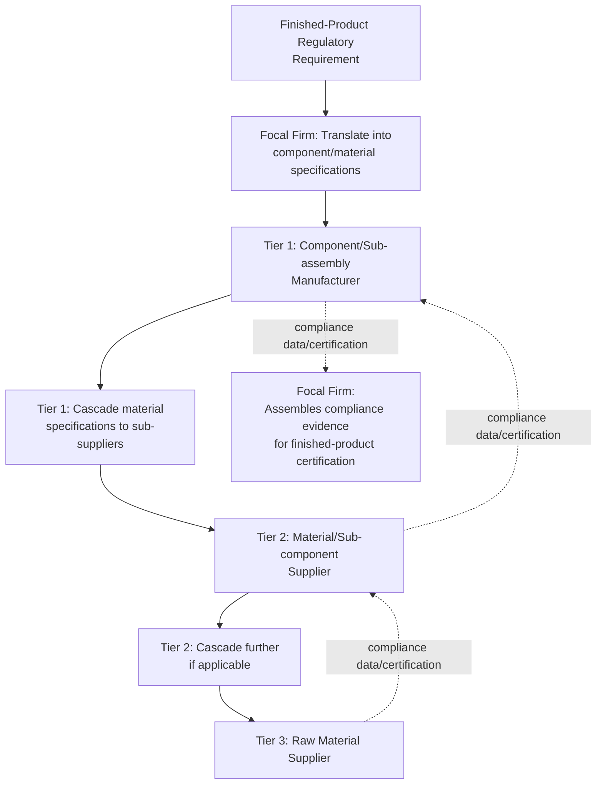
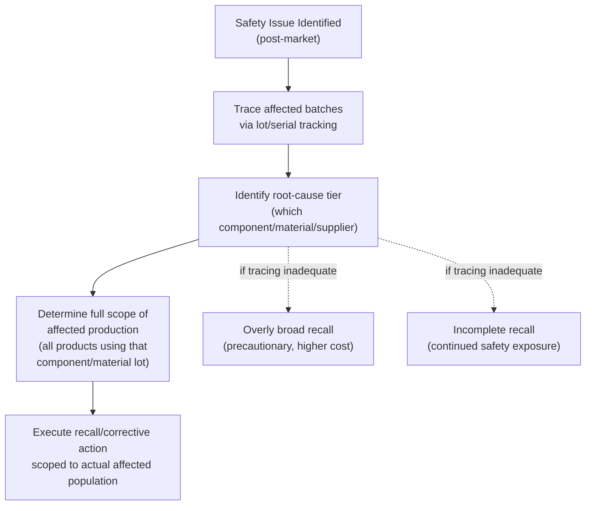

## Product Safety and Regulatory Compliance Across Tiers

### Definition and Scope

Product safety and regulatory compliance across tiers is the discipline of ensuring that products, components, and materials meet applicable safety, technical, and regulatory standards throughout their journey through a multi-tier supply chain — from raw material and component specification at deep tiers through final assembly, distribution, and market entry. Unlike the ethical/human-rights-focused compliance topics preceding it in this chapter (codes of conduct, conflict minerals, forced labor), product safety compliance centers on the technical conformity of the product itself to safety and regulatory standards, though it shares the same core structural challenge established throughout this chapter and program: compliance responsibility and verifiability decay with tier depth, even as the technical risk embedded in deep-tier components can directly determine whether the finished product is safe and legally sellable.

### Why Product Safety Compliance Is Inherently Multi-Tier

**Key Points**

- **Component-level risk propagation**: A finished product's safety and regulatory compliance is frequently determined by the cumulative properties of its components and materials — a single non-compliant component (a hazardous substance in a sub-assembly, a mechanical part failing a stress specification) can render an otherwise well-designed finished product non-compliant or unsafe, regardless of how carefully the finished product's own assembly and design were executed.
- **Focal firm accountability despite deep-tier origin**: In most regulatory regimes, the entity placing the product on the market (the brand owner, importer, or manufacturer of record) bears primary legal and safety accountability for the finished product, even when the actual root cause of a compliance failure originates several tiers upstream — creating a structural misalignment between where compliance risk originates (potentially deep-tier) and where legal/commercial liability concentrates (the focal firm), directly analogous to the misalignment discussed for ESG and forced labor risk in earlier topics.
- **Specification cascade requirement**: Because compliance requirements must ultimately be met at the material and component level, focal firms must translate finished-product regulatory requirements into specific, verifiable specifications cascaded down to relevant tiers — structurally similar to the code-of-conduct cascade mechanism, but focused on technical/material specifications rather than behavioral/labor standards.

### Common Regulatory Domains Requiring Multi-Tier Compliance

| Domain | Focus | Multi-Tier Relevance |
| --- | --- | --- |
| Restricted/hazardous substances (e.g., RoHS-type, REACH-type frameworks) | Limiting or prohibiting specific chemical substances in products | Substance content often determined by raw material and component-level sourcing decisions at deep tiers |
| Product safety/mechanical standards | Physical safety performance (structural integrity, electrical safety, flammability, choking hazards for certain product categories) | Component-level material and manufacturing quality directly determines finished-product performance against these standards |
| Food contact and food safety regulations | Safety of materials and processes for food-contact products/packaging | Raw material sourcing and processing at deep tiers directly affects contamination and migration risk |
| Conformity marking and certification regimes (e.g., CE-type marking systems) | Formal certification that a product meets applicable regional regulatory requirements | Certification typically requires documented evidence spanning the full bill of materials, requiring multi-tier data aggregation |
| Country-of-origin and labeling requirements | Accurate disclosure of manufacturing origin and product content | Requires accurate multi-tier sourcing data, connecting to the same traceability infrastructure discussed in the conflict minerals and forced labor topics |

[Inference: specific regulatory framework names, exact substance lists, and technical standards vary considerably by product category and jurisdiction and change over time through periodic regulatory updates; this table describes general regulatory domain categories rather than citing specific current regulatory text, and firms should consult current, jurisdiction-specific and product-category-specific regulatory sources for compliance purposes.]

### Restricted Substance Compliance as a Structural Case Study

Restricted/hazardous substance compliance illustrates the multi-tier compliance challenge with particular clarity, since substance content is a cumulative, additive property of every material input in a product's full bill of materials:

**Key Points**

- **Full bill-of-materials substance declaration requirement**: Verifying compliance with a substance restriction requires knowing the substance content of every material and component in the product, not merely the Tier 1 assembled components — meaning genuine compliance verification requires data from every tier where a distinct material or substance is introduced, not just the tier where final assembly occurs.
- **Homogeneous material-level assessment**: Many restricted-substance regulatory frameworks assess compliance at the level of "homogeneous materials" (materials that cannot be mechanically separated into different materials) rather than at the finished-product or even component level, meaning compliance data must often be collected at a granularity finer than typical Tier 1 component specifications, pushing data collection requirements deeper into the material supply chain by necessity rather than choice.
- **Substance declaration cascade**: Similar to the code-of-conduct flow-down clause mechanism, substance compliance is typically managed through a cascading declaration requirement — each tier declares the substance content of what it supplies to the next tier, aggregating into a full substance profile by the time the finished product reaches the focal firm, with the same cascade-fidelity-degradation risk noted in the code-of-conduct topic applying equally here (a Tier 2 supplier's inaccurate or incomplete substance declaration propagates undetected unless independently verified).

### Verification and Testing Architecture

#### 1. Documentary Declaration and Certification Collection

Collecting supplier-provided substance declarations, material safety data sheets, and compliance certifications across relevant tiers — the primary, lowest-cost verification method, but subject to the same self-reported-data reliability limitations discussed for ESG and forced labor declarations throughout this chapter.

#### 2. Independent Laboratory Testing

**Key Points**

- **Finished-product and component-level testing**: Independent laboratory analysis of the actual finished product or specific components against applicable safety and substance standards, providing verification independent of supplier self-declaration — analogous in function to the third-party audit mechanisms discussed for code-of-conduct and forced labor verification, but applied to physical/chemical product properties rather than process/behavioral compliance.
- **Risk-based testing prioritization**: Given the cost and time of independent testing, firms typically prioritize testing toward higher-risk product categories, new suppliers or materials without an established compliance track record, and product categories with the most stringent regulatory consequence for non-compliance — mirroring the risk-based, materiality-prioritized monitoring approach established across the ESG, carbon measurement, and code-of-conduct topics in this program.
- **Periodic re-testing and change management**: Because material sourcing or supplier processes can change over time (a supplier switching a sub-material source without necessarily notifying the focal firm), compliance testing programs typically require periodic re-verification rather than one-time qualification testing alone, addressing the risk that an initially compliant supply chain configuration can drift out of compliance through unmonitored downstream changes.

#### 3. Supplier Qualification and Change Notification Requirements

Contractual requirements that suppliers notify the focal firm of any material, process, or sub-supplier change that could affect regulatory compliance status — a proactive control mechanism addressing the change-drift risk noted above, structurally similar to but functionally distinct from the audit-based reactive verification approaches.

### Regulatory Conformity Assessment and Market Access

**Key Points**

- **Self-declaration vs. third-party certification regimes**: Different regulatory frameworks and jurisdictions require different levels of formal verification — ranging from manufacturer self-declaration of conformity (lower verification burden, higher reliance on manufacturer's own internal compliance rigor) to mandatory third-party certification body assessment (higher verification burden, independent assurance) — with the appropriate regime typically determined by product risk category under the applicable jurisdiction's regulatory framework.
- **Technical documentation file requirements**: Many conformity regimes require the manufacturer/importer of record to maintain a technical documentation file substantiating the compliance basis for a product, which in a multi-tier supply chain context requires aggregating and retaining component-level and material-level compliance evidence collected across tiers, connecting directly to the documentary traceability infrastructure discussed throughout this chapter.
- **Post-market surveillance obligations**: Beyond initial conformity assessment prior to market entry, many regulatory regimes impose ongoing post-market surveillance obligations (monitoring for safety incidents, managing recalls) that similarly depend on multi-tier traceability to identify affected product batches and their component/material origins when a safety issue is identified after market entry.

### Recall and Corrective Action Architecture

When a product safety issue is identified post-market, multi-tier traceability directly determines the speed and precision of the response:

**Key Points**

- **Traceability precision directly affects recall scope accuracy**: Strong lot/batch-level traceability linking finished products back to specific component and material sources and production lots enables precisely scoped recalls (affecting only genuinely at-risk units); weak traceability forces a choice between overly broad precautionary recalls (unnecessary cost, affecting compliant units) or under-scoped recalls (continued safety exposure for affected units not correctly identified) — making traceability infrastructure investment a direct determinant of recall efficiency and effectiveness, not merely a compliance-reporting convenience.
- **Root-cause tier identification speed**: The same multi-tier visibility challenge established throughout this chapter directly affects how quickly a firm can identify which specific tier and supplier is the actual root cause of a safety issue, which in turn determines how quickly an effective corrective action (as opposed to a broad precautionary response) can be implemented.

### Illustrative Example

**Example**

A children's toy manufacturer manages product safety and regulatory compliance across its multi-tier supply chain:

1. **Specification cascade**: Finished-product safety requirements (covering restricted substances, mechanical/physical safety standards for the relevant age category, and flammability standards) are translated into specific material and component specifications, cascaded to Tier 1 molded-plastic and electronic component suppliers via technical specification documents incorporated into supplier contracts.
2. **Substance declaration collection**: Tier 1 suppliers are required to provide homogeneous-material-level substance declarations for all plastic resins, colorants, and surface coatings used, with a contractual cascade requirement that Tier 1 suppliers collect equivalent declarations from their own Tier 2 material suppliers.
3. **Risk-based independent testing**: Given the elevated regulatory consequence and consumer-safety sensitivity of children's products specifically, the firm implements independent laboratory testing for all new product introductions and all new material/supplier qualifications, rather than relying solely on documentary declarations, reflecting the risk-based testing prioritization principle given this product category's heightened stakes.
4. **Change notification requirement**: Supplier contracts require notification of any material substitution or sub-supplier change, with the firm requiring re-testing or re-verification for any notified change before continued production is authorized.
5. **Lot traceability implementation**: Production lots are tracked with component and material lot-level linkage, enabling precise identification of affected production runs should a safety issue be identified.
6. **Result**: When an independent post-market test later identifies an unexpected substance level in a specific product line, the firm's lot-traceability system allows rapid identification of the affected component lot and its Tier 1 (and traced-back Tier 2) source, enabling a precisely scoped recall limited to the genuinely affected production run rather than a broader precautionary recall across the full product line — illustrating how the multi-tier compliance and traceability infrastructure investment directly translates into more effective and less costly incident response when (not if, given the general acknowledgment that no compliance system achieves zero-failure certainty) an issue does arise.

### Constraints and Critiques

**Key Points**

- **Verification cost and depth trade-off**: Comprehensive independent testing across all tiers and all products is generally cost-prohibitive at scale, requiring the same risk-based prioritization trade-off discussed throughout this chapter — meaning some residual compliance risk from unverified or under-verified deep-tier materials is a practical reality of most compliance programs rather than a fully eliminable condition.
- **Change-drift detection limitation**: Even with contractual change-notification requirements, a focal firm's ability to detect unauthorized or unreported supplier-side material or process changes is inherently limited without continuous, resource-intensive monitoring, meaning contractual requirements alone do not fully eliminate change-drift risk — periodic re-testing serves as a partial, not complete, mitigation.
- **Regulatory fragmentation across jurisdictions**: Firms selling into multiple regulatory jurisdictions frequently face differing substance restrictions, testing requirements, and certification regimes across those jurisdictions, creating compliance complexity analogous to the standard fragmentation challenges discussed for ESG and forced labor compliance, now applied to technical/safety standards specifically, often requiring jurisdiction-specific product variants or the most-restrictive-common-denominator design approach to manage complexity.
- **Liability concentration vs. root-cause distribution tension**: As noted at the outset, legal and commercial liability for product safety failures concentrates at the focal firm (as manufacturer/importer of record) even when root cause originates at a deep, potentially unverifiable tier — creating a persistent tension between where compliance risk actually originates and where the practical and legal consequences are borne, a structural asymmetry consistent with the pattern observed across every multi-tier compliance domain in this chapter.

**Related Topics**

- Supplier codes of conduct and tiered enforcement (structural comparison: substance/technical cascade vs. behavioral cascade)
- Multi-tier supply chain mapping and traceability infrastructure (shared foundation)
- Conflict minerals and responsible minerals sourcing (parallel material-declaration cascade methodology)
- Restricted substance regulatory frameworks and homogeneous-material compliance assessment
- Lot/batch traceability systems and recall scope optimization
- Conformity assessment, certification marking, and technical documentation file requirements
- Post-market surveillance and product safety incident management
- Country-of-origin labeling and multi-tier sourcing disclosure requirements