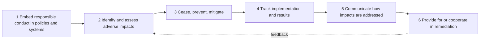
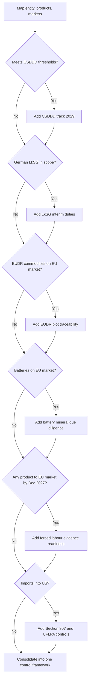

## Supply Chain Due Diligence Legislation


### Overview

Supply chain due diligence legislation is the body of law that requires companies to identify, prevent, mitigate, and account for adverse human rights, labour, and environmental impacts in their own operations and across their supplier tiers. Some regimes set process duties (assess risk, act, monitor), some require disclosure, and some ban goods outright. Most reach past Tier 1 into sub-tiers and raw material origin.

Status information below reflects sources reviewed through 21 September 2026. Dates in this field move often, so verify against primary legal texts. This is technical reference material, not legal advice.

**Key Points**

- Legislative approaches fall into four archetypes: **transparency**, **horizontal due diligence**, **product/commodity-based due diligence**, and **import or market prohibition**.
- The EU horizontal directive (CSDDD) has been narrowed and delayed, while product-based and trade-based measures (EUDR, EU Forced Labour Regulation, US UFLPA) keep tightening. [Inference: this divergence is an observed pattern, not an official policy statement.]
- Legal duties propagate down tiers mainly through contracts, information requests, traceability data, and audits, since the law usually binds only the in-scope company.
- Compliance programmes are most efficient when built as one common core with regime-specific modules.

### International Foundations

Most national and regional laws borrow their vocabulary and methodology from three international instruments:

| Instrument | Role |
| --- | --- |
| UN Guiding Principles on Business and Human Rights (2011) | Corporate responsibility to respect human rights; human rights due diligence concept |
| OECD Guidelines for Multinational Enterprises on Responsible Business Conduct | Government-backed recommendations covering human rights, labour, environment, and integrity |
| OECD Due Diligence Guidance for Responsible Business Conduct (2018) | The widely used six-step process model, plus sector guidance (minerals, garments, agriculture, finance) |
| ILO core conventions (forced labour, child labour, freedom of association, non-discrimination, safe work) | Reference definitions for forced labour and child labour used in statutes |

**The OECD six-step cycle**



**Involvement continuum**

Expected action depends on how the company is connected to a harm:

| Connection to harm | Expected action |
| --- | --- |
| Company **causes** the impact | Stop or prevent it, and remediate |
| Company **contributes** to the impact | Stop the contribution, use leverage to reduce residual harm, and contribute to remediation |
| Impact is **directly linked** via a business relationship | Use leverage to prevent or mitigate; consider disengagement as a last resort |

### Regulatory Archetypes

| Archetype | Mechanism | Standard of duty | Tier reach | Examples |
| --- | --- | --- | --- | --- |
| Transparency | Publish statements or reports | Report on steps taken; no mandated outcome | Whole chain, as disclosed | UK Modern Slavery Act s.54, Australian Modern Slavery Act, Canadian Fighting Against Forced Labour and Child Labour in Supply Chains Act |
| Horizontal due diligence | Risk-based process across operations and chain | Obligation of means (appropriate measures) | Own operations, subsidiaries, business partners (risk-based) | EU CSDDD, German LkSG, French Duty of Vigilance Law, Norwegian Transparency Act |
| Product/commodity-based | Trace and verify inputs to origin | Means plus verification and traceability | Down to plot, smelter, or mine | EUDR, EU Batteries Regulation, EU Conflict Minerals Regulation, Dodd-Frank §1502 |
| Import/market prohibition | Ban goods made with forced labour | Obligation of result (presumption or investigation) | Any tier | US Section 307 and UFLPA, EU Forced Labour Regulation |
| Harm-specific | Declarations or due diligence on one harm | Varies | Varies | Swiss due diligence ordinance (minerals, child labour), Dutch child labour due diligence act |

### Legislative Landscape

| Regime | Jurisdiction | Type | Core trigger |
| --- | --- | --- | --- |
| CSDDD (Directive 2024/1760, as amended) | EU | Horizontal due diligence | Company size and turnover thresholds |
| Forced Labour Regulation (2024/3015) | EU | Product prohibition | Any product placed on, made available on, or exported from the EU market; no size threshold |
| EUDR (Regulation 2023/1115, as amended) | EU | Commodity due diligence | Cattle, cocoa, coffee, oil palm, rubber, soya, wood and derived products |
| Batteries Regulation (2023/1542), Art. 48 | EU | Mineral due diligence | Batteries placed on the EU market; cobalt, lithium, natural graphite, nickel |
| Conflict Minerals Regulation (2017/821) | EU | Mineral due diligence | Union importers of tin, tantalum, tungsten, gold |
| LkSG | Germany | Horizontal due diligence | Employee threshold, German presence |
| Duty of Vigilance Law (2017-399) | France | Horizontal (vigilance plan) | Very large companies (employee thresholds in France or worldwide) |
| Transparency Act | Norway | Horizontal plus information right | Large enterprises; individuals can request information |
| UFLPA / Tariff Act §307 | US | Import prohibition | Xinjiang or listed-entity links |
| Dodd-Frank §1502 | US | Disclosure and due diligence | SEC registrants using 3TG minerals |
| Modern Slavery Act 2015 | UK | Transparency | Turnover-based reporting duty |

### Current Status by Regime

#### EU CSDDD

- The Omnibus I amending directive, Directive (EU) 2026/470, entered into force on 18 March 2026, following publication in the Official Journal on 26 February 2026. [Csddd-navigator](https://csddd-navigator.com/timeline)[Arthur Cox LLP](https://www.arthurcox.com/insights/omnibus-i-directive-published-revised-scope-and-reduced-obligations-under-csrd-and-csddd/)
- **Scope**: The revised directive applies to EU companies with more than 5,000 employees and more than €1.5 billion net turnover, and to non-EU companies with more than €1.5 billion of EU net turnover. The original text had set the bar at 1,000 employees and €450 million. One estimate puts the reduction at roughly 13,000 companies down to about 6,000. [Omnibus I Directive published: Revised scope and reduced obligations under CSRD and CSDDD | Arthur Cox LLP +2](https://www.arthurcox.com/insights/omnibus-i-directive-published-revised-scope-and-reduced-obligations-under-csrd-and-csddd/)
- **Dates**: Member States must transpose by 26 July 2028, and in-scope companies must comply from 26 July 2029, a single date replacing the earlier staggered rollout. [Covington & Burling LLP](https://www.cov.com/en/news-and-insights/insights/2026/02/eu-csddd-csrd-omnibus-published-in-official-journal-transposition-delegated-acts-and-guidelines-are-next)
- **Guidance**: The Commission's first CSDDD guidelines are statutorily due by July 2027. [Covington & Burling LLP](https://www.cov.com/en/news-and-insights/insights/2026/02/eu-csddd-csrd-omnibus-published-in-official-journal-transposition-delegated-acts-and-guidelines-are-next)
- **Substantive changes**:
  - Where not every risk can be addressed at once, companies must prioritise by likelihood and severity. [Lexology](https://www.lexology.com/library/detail.aspx?g=23ce93c6-f0f7-4b18-a935-ae2256968aae)
  - Termination of a business relationship is no longer required; suspension where legally permitted is the last-resort measure. [Accountancyeurope](https://accountancyeurope.eu/wp-content/uploads/2026/01/260129-Omnibus-explained-CSDDD-factseet.pdf)
  - Monitoring frequency drops to once every five years. [Accountancy Europe](https://accountancyeurope.eu/publications/omnibus-explained-key-changes-to-the-csrd-and-csddd/)
  - Penalties for ultimate parents are capped at 3% of net consolidated worldwide turnover. [Clifford Chance](https://www.cliffordchance.com/insights/resources/blogs/business-and-human-rights-insights/2026/02/omnibus-i-the-european-union-concludes-csddd-and-csrd-reforms.html)
  - The EU-wide civil liability regime and the climate transition plan obligation are removed, so civil liability is left to national law. [Arthur Cox LLP](https://www.arthurcox.com/insights/omnibus-i-directive-published-revised-scope-and-reduced-obligations-under-csrd-and-csddd/)
  - Maximum harmonisation now also covers prioritisation, monitoring, and reporting, though Member States keep room for additional obligations on specific products, services, or situations. [Covington & Burling LLP](https://www.cov.com/en/news-and-insights/insights/2026/02/eu-csddd-csrd-omnibus-published-in-official-journal-transposition-delegated-acts-and-guidelines-are-next)
- **SME shielding**: Omnibus I aims to limit "trickle-down" burdens on SMEs and smaller business partners in the value chain. One commentary reports that information requests to companies with fewer than 5,000 employees are intended as a last resort. [DLA Piper](https://knowledge.dlapiper.com/dlapiperknowledge/globalemploymentlatestdevelopments/2026/corporate-sustainability-due-diligence-directive-amendments-under-omnibus-i-finalised)[LegalTegrity](https://legaltegrity.com/en/blog/omnibus-and-lksg-2025/)

#### Germany LkSG

- The LkSG remains in force, but the annual report to BAFA has been abolished retroactively, the reporting form has been inactive since November 2025, and BAFA pursues only serious violations. [Top.legal](https://www.top.legal/en/knowledge/supply-chain-act)
- In September 2025 the ministry instructed BAFA to pursue only "serious" violations. [Taylor Wessing](https://www.taylorwessing.com/en/insights-and-events/insights/2026/01/lksg)
- The Bundestag held its first reading of the government's amending bill on 16 January 2026. Under the bill, the due diligence duties continue but only serious breaches are sanctioned. [German Bundestag](https://www.bundestag.de/dokumente/textarchiv/2026/kw03-de-lieferketten-1136308)
- Final promulgation of the amendment is [Unverified] in the sources reviewed; check the Federal Law Gazette.
- The LkSG is expected to be replaced by law transposing the revised CSDDD, due by mid-2028. Whether Germany's replacement law aligns exactly with the 5,000-employee and €1.5 billion thresholds had not been confirmed as of mid-2026. [DIHK](https://www.dihk.de/en/changes-to-the-german-supply-chain-act-174272)[Osapiens](https://osapiens.com/en/regulations/lksg)

#### EU Forced Labour Regulation

- It entered into force on 13 December 2024 and applies from 14 December 2027. [Trustrace](https://trustrace.com/knowledge-hub/eu-ban-on-forced-labor-regulation-proposal)
- It is an obligation of result rather than a due diligence obligation, has no minimum threshold, and covers every product, sector, and origin, including goods made in the EU. [Trustrace](https://trustrace.com/knowledge-hub/eu-ban-on-forced-labor-regulation-proposal)
- The Commission published implementation guidelines on 26 June 2026. They confirm coverage of privately imposed forced labour, state-imposed forced labour, and forced child labour. [Global Import Blog](https://globalimportblog.bakermckenzie.com/2026/08/24/eu-publishes-guidelines-on-the-application-of-the-eu-forced-labour-regulation/)
- Sources conflict on the risk database: one says the database was made available with the guidelines, while another says the database and information systems are still under development. [Unverified] [Trustrace](https://trustrace.com/knowledge-hub/eu-ban-on-forced-labor-regulation-proposal)[Global Import Blog](https://globalimportblog.bakermckenzie.com/2026/08/24/eu-publishes-guidelines-on-the-application-of-the-eu-forced-labour-regulation/)
- The first review of the regulation is scheduled for 14 December 2029. [europa](https://single-market-economy.ec.europa.eu/single-market/goods/forced-labour-regulation_en)

#### EUDR

- After a second postponement and a targeted revision agreed in late 2025, the application date of 30 December 2026 for large and medium-sized companies (and micro and small timber operators) was confirmed after the Commission's 4 May 2026 simplification package. [Consilium](https://www.consilium.europa.eu/en/press/press-releases/2025/12/04/eu-deforestation-law-council-and-parliament-reach-a-deal-on-targeted-revision/)[Hogan Lovells](https://www.hoganlovells.com/en/publications/eu-deforestation-regulation-commission-publishes-simplification-package-ahead-of-december-2026)
- Other micro and small operators apply from 30 June 2027. [Eustafor](https://eustafor.eu/eudr-what-the-commissions-4-may-2026-simplification-package-means-for-wood-state-forests-and-non-eu-operators/)
- The Commission estimates the simplification measures cut annual compliance costs by about 75%. It also plans a repository of relevant national legislation of producing countries by December 2026. [Baker McKenzie](https://www.bakermckenzie.com/en/insight/publications/2026/05/eu-commission-publishes-simplification-review-of-eudr)[Baker McKenzie](https://www.bakermckenzie.com/en/insight/publications/2026/05/eu-commission-publishes-simplification-review-of-eudr)
- A draft delegated act proposes scope changes, such as bringing soluble coffee and some palm-oil derivatives in and carving out leather and retreaded tyres. Final adoption of that act is [Unverified]. [Lewis Silkin](https://www.lewissilkin.com/insights/2026/05/13/eu-deforestation-regulation-the-european-commissions-simplification-push-102mshv)

#### EU Batteries Regulation

- Due diligence obligations were postponed from 18 August 2025 to 18 August 2027 by Regulation (EU) 2025/1561, and the Commission's guidelines were re-set to 26 July 2026. Whether those guidelines have been published is [Unverified]. [InfoDPP](https://infodpp.eu/en/blog/battery-due-diligence-delay-2025-1561/)
- Core requirements include a formal due diligence policy, supplier communication, traceability for cobalt, natural graphite, lithium, and nickel, third-party verification by a notified body, and at least 10 years of record retention. [ASUENE](https://asuene.com/us/blog/eu-battery-regulation-2027-executive-readiness-for-carbon-footprint-battery-passport-and-due-diligence)

#### United States

- The UFLPA presumes that goods made wholly or partly in Xinjiang, or by Entity List firms, involve forced labour, and puts the burden on the importer to disprove this by clear and convincing evidence. [Ethicaltrade](https://www.ethicaltrade.org/insights/issues/forced-labour-modern-slavery/legislation)
- On 31 July 2026 DHS announced 43 additions to the Entity List, bringing it to 187 entities, effective 3 August 2026. Roughly half of the newly listed firms operate outside Xinjiang. [Homeland Security](https://www.dhs.gov/news/2026/07/31/dhs-announces-addition-43-companies-uflpa-entity-list)[Kharon](https://www.kharon.com/resources/use-cases/forced-labor/uflpa-enforcement-and-compliance-strategy)
- USTR Section 301 forced labour tariffs on 60 economies took effect on 24 July 2026. [Covington & Burling LLP](https://www.cov.com/en/news-and-insights/insights/2026/08/dhs-expands-uflpa-entity-list-amid-intensifying-enforcement-landscape)

#### United Kingdom

- Section 54 of the Modern Slavery Act applies to companies with turnover of at least £36 million, and it imposes no binding due diligence duty and no criminal or financial penalties for non-compliance. [Skadden](https://www.skadden.com/insights/publications/2024/09/uk-modern-slavery-act)[Wikipedia](https://en.wikipedia.org/wiki/Modern_Slavery_Act_2015)
- The Immigration and Asylum Bill 2026, introduced on 30 June 2026, would prescribe statement content, set a six-month publication deadline, extend the regime to public authorities, and add penalties of up to 1% of turnover or £1 million, whichever is higher. Second reading began on 13 July 2026. Enactment is [Unverified]. [Mondaq](https://www.mondaq.com/uk/human-rights/1819172/modern-slavery-act-transparency-reporting-gets-teeth)[Skadden](https://www.skadden.com/insights/publications/2026/07/proposed-amendments-to-the-uk-modern-slavery-act)

#### Other Regimes (Stable Background)

- **France**: The vigilance plan must cover risks from the company, controlled subsidiaries, and established-relationship suppliers or subcontractors. Enforcement runs through formal notice, injunction, and general civil liability. [Inference: thresholds and case law should be checked against current sources.]
- **Norway**: The Transparency Act adds a right for any person to request information from an in-scope enterprise on how it handles impacts, alongside annual reporting.
- **Canada**: The Canadian law came into force on 1 January 2024. [Ethicaltrade](https://www.ethicaltrade.org/insights/issues/forced-labour-modern-slavery/legislation)
- **Netherlands**: The Child Labour Due Diligence Act was adopted in 2019, but its entry into force status is [Unverified] for 2026.
- **Conflict minerals**: The US regime works through SEC Form SD disclosure, and the EU regime binds importers of 3TG. Both rely on the OECD minerals guidance and smelter/refiner assurance schemes.

### Key Dates to Track

- 30 December 2026: EUDR applies to large and medium-sized operators. [Hogan Lovells](https://www.hoganlovells.com/en/publications/eu-deforestation-regulation-commission-publishes-simplification-package-ahead-of-december-2026)
- 30 June 2027: EUDR applies to remaining micro and small operators. [Eustafor](https://eustafor.eu/eudr-what-the-commissions-4-may-2026-simplification-package-means-for-wood-state-forests-and-non-eu-operators/)
- July 2027: statutory deadline for first Commission CSDDD guidelines. [Covington & Burling LLP](https://www.cov.com/en/news-and-insights/insights/2026/02/eu-csddd-csrd-omnibus-published-in-official-journal-transposition-delegated-acts-and-guidelines-are-next)
- 18 August 2027: battery due diligence obligations apply. [InfoDPP](https://infodpp.eu/en/blog/battery-due-diligence-delay-2025-1561/)
- 14 December 2027: Forced Labour Regulation applies. [Trustrace](https://trustrace.com/knowledge-hub/eu-ban-on-forced-labor-regulation-proposal)
- 26 July 2028: CSDDD transposition deadline; 26 July 2029: CSDDD application date. [Covington & Burling LLP](https://www.cov.com/en/news-and-insights/insights/2026/02/eu-csddd-csrd-omnibus-published-in-official-journal-transposition-delegated-acts-and-guidelines-are-next)[Covington & Burling LLP](https://www.cov.com/en/news-and-insights/insights/2026/02/eu-csddd-csrd-omnibus-published-in-official-journal-transposition-delegated-acts-and-guidelines-are-next)

### CSDDD Core Obligations

Duty-holders must, in substance:

1. Integrate due diligence into policies and risk management systems, including a due diligence policy and code of conduct.
2. Identify and assess actual and potential adverse impacts across operations, subsidiaries, and business partners in the chain of activities.
3. Prevent potential impacts (prevention action plans, contractual assurances, supplier support) and end or minimise actual impacts (corrective action plans).
4. Remediate impacts the company caused or jointly caused.
5. Engage meaningfully with affected stakeholders.
6. Provide a complaints and notification mechanism.
7. Monitor the effectiveness of measures. After Omnibus I the periodic review runs on a five-year cycle.
8. Publicly communicate on due diligence.

**Scoping and prioritisation.** Commentators advise documenting the scoping exercise and prioritisation logic early, since these will underpin any showing that the programme is risk-based. The final text clarifies that not addressing a less significant impact does not by itself expose a company to penalties. [Morrison Foerster](https://www.mofo.com/resources/insights/251222-eu-sustainability-omnibus-i-detailed-omnibus)[Clifford Chance](https://www.cliffordchance.com/insights/resources/blogs/business-and-human-rights-insights/2026/02/omnibus-i-the-european-union-concludes-csddd-and-csrd-reforms.html)

**Penalty exposure.** With the cap at 3% of net worldwide turnover $T$:

$$F_{max} = 0.03 \times T$$

**Example**

For $T = €2{,}000$ million, $F_{max} = €60$ million. This is a ceiling that Member States must not exceed. Actual penalties depend on national law and forthcoming Commission guidance.

### Tier Propagation Mechanics

The law binds the in-scope company, but its practical reach depends on whether obligations can be pushed down the chain and whether evidence can be pulled up.

(svg_diagram) Due Diligence Obligation Cascade Across Tiers

<svg xmlns="http://www.w3.org/2000/svg" viewBox="0 0 720 430" width="720" height="430" font-family="sans-serif" font-size="12">
<title>Due Diligence Obligation Cascade Across Tiers (svg_diagram)</title>
<rect width="720" height="430" fill="#ffffff" />
<text x="360" y="24" text-anchor="middle" font-weight="bold" font-size="15">Due Diligence Obligation Cascade Across Tiers (svg_diagram)</text>
<rect x="40" y="48" width="240" height="44" rx="6" fill="#dbeafe" stroke="#1e40af" />
<text x="160" y="75" text-anchor="middle">Duty-holder (in-scope company)</text>
<rect x="40" y="124" width="240" height="44" rx="6" fill="#dcfce7" stroke="#166534" />
<text x="160" y="151" text-anchor="middle">Tier 1 - direct suppliers</text>
<rect x="40" y="200" width="240" height="44" rx="6" fill="#fef9c3" stroke="#854d0e" />
<text x="160" y="227" text-anchor="middle">Tier 2 - indirect suppliers</text>
<rect x="40" y="276" width="240" height="44" rx="6" fill="#ffedd5" stroke="#9a3412" />
<text x="160" y="303" text-anchor="middle">Tier 3 - sub-suppliers</text>
<rect x="40" y="352" width="240" height="44" rx="6" fill="#fee2e2" stroke="#991b1b" />
<text x="160" y="379" text-anchor="middle">Tier N - origin (mine, plot, farm)</text>
<line x1="160" y1="92" x2="160" y2="124" stroke="#334155" stroke-width="2" marker-end="url(#arr)" />
<line x1="160" y1="168" x2="160" y2="200" stroke="#334155" stroke-width="2" marker-end="url(#arr)" />
<line x1="160" y1="244" x2="160" y2="276" stroke="#334155" stroke-width="2" marker-end="url(#arr)" />
<line x1="160" y1="320" x2="160" y2="352" stroke="#334155" stroke-width="2" marker-end="url(#arr)" />
<text x="310" y="113">Contractual assurances, supplier code, direct audits</text>
<text x="310" y="189">Flow-down clauses, information requests, mapping</text>
<text x="310" y="265">Traceability data, risk-based deep dives</text>
<text x="310" y="341">Geolocation, smelter lists, entity-list screening</text>
<text x="310" y="416" fill="#475569">Visibility and leverage generally decrease with depth [Inference]</text>
</svg>

**Exposure growth by tier**

If tier $k$ has average fan-out $f_k$ suppliers per upstream node, the number of nodes at tier $k$ is:

$$N_k = \prod_{j=1}^{k} f_j$$

**Example**

With 200 Tier 1 suppliers, average fan-out of 8 to Tier 2 and 6 to Tier 3:

- Tier 2 nodes: $200 \times 8 = 1{,}600$
- Tier 3 nodes: $1{,}600 \times 6 = 9{,}600$

Evaluating every node equally is impractical, which is why the regimes rely on risk-based prioritisation.

### Risk-Based Prioritisation Model

The OECD guidance ties prioritisation to severity (gravity, scale, irremediability) and likelihood. A simple residual-risk score, with each factor in $[0,1]$:

$$R = L \times S \times (1 - E)$$

where $L$ is likelihood, $S$ is severity, and $E$ is the evidenced effectiveness of existing controls. [Inference: this scoring form is a modelling convenience, not prescribed by any statute.]

**Example**

```python
from dataclasses import dataclass

@dataclass
class SupplierRisk:
    name: str
    tier: int
    likelihood: float       # 0-1: country, sector, commodity, incident signals
    scale: float            # 0-1: gravity of the harm
    scope: float            # 0-1: number affected / geographic spread
    irremediable: float     # 0-1: how hard to restore the situation
    mitigation: float       # 0-1: evidenced effectiveness of controls

    @property
    def severity(self) -> float:
        # Conservative choice: the worst severity dimension dominates
        return max(self.scale, self.scope, self.irremediable)

    @property
    def residual_risk(self) -> float:
        return self.likelihood * self.severity * (1 - self.mitigation)

suppliers = [
    SupplierRisk("Assembler-B", 1, 0.3, 0.5, 0.4, 0.3, 0.7),
    SupplierRisk("Smelter-A", 2, 0.8, 0.9, 0.6, 0.7, 0.2),
    SupplierRisk("Plantation-C", 3, 0.6, 0.8, 0.9, 0.8, 0.1),
    SupplierRisk("Packer-D", 1, 0.2, 0.4, 0.2, 0.2, 0.5),
]

for s in sorted(suppliers, key=lambda x: x.residual_risk, reverse=True):
    print(f"{s.name:<13} tier={s.tier} residual_risk={s.residual_risk:.3f}")
```

**Output** (illustrative; exact formatting depends on the runtime)

```plaintext
Smelter-A     tier=2 residual_risk=0.576
Plantation-C  tier=3 residual_risk=0.486
Assembler-B   tier=1 residual_risk=0.045
Packer-D      tier=1 residual_risk=0.040
```

**Key Points**

- The highest-risk nodes are at Tier 2 and Tier 3, not Tier 1.
- Prioritising by risk rather than tier depth matches the risk-based logic of CSDDD, LkSG, and the OECD guidance.
- Prioritisation decisions should be documented, since they are the evidence of a reasoned approach.

### One Programme, Many Regimes

A shared core plus regime modules avoids building separate systems for each law.

| Capability | CSDDD | LkSG | EUDR | Forced Labour Reg. | UFLPA | Batteries |
| --- | --- | --- | --- | --- | --- | --- |
| Supplier mapping | Risk-based, chain of activities | Direct suppliers; indirect when substantiated knowledge | Plot-level | Evidence on request | To origin of inputs | To mine or refiner |
| Risk analysis | Scoping then in-depth | Annual and event-driven | Country and plot risk | Authority-led investigation | Entity and region screening | Policy plus risk assessment |
| Contract cascade | Assurances and flow-down | Contractual controls | Supplier data commitments | Traceability cooperation | Origin documentation | Supplier communication |
| Verification | Audits and data | Audits and data | Geolocation and satellite checks | Evidence to authorities | Documentary rebuttal | Notified body |
| Grievance | Required mechanism | Required mechanism | Not the central tool | Public submission point | Not central | Grievance mechanism |
| Reporting | Public statement | Reporting duty removed (see status) | Due diligence statements | Not a reporting regime | Customs documentation | Periodic reporting |

The LkSG cells reflect the statute's structure (direct suppliers under routine analysis, indirect suppliers on substantiated knowledge).

**Applicability screening**



### Contractual Cascade

Contracts are the main lever for extending duties to sub-tiers. A flow-down clause typically covers:

```plaintext
1. Supplier shall comply with the Buyer's Supplier Code of Conduct and applicable
   human rights, labour, and environmental laws.
2. Supplier shall map and disclose sub-suppliers for in-scope products on request,
   and shall obtain equivalent commitments from those sub-suppliers.
3. Supplier shall provide information and evidence reasonably required to
   verify compliance, including origin and traceability data.
4. Supplier shall cooperate with audits, corrective action plans, and remediation.
5. Buyer may suspend orders for affected activities where a corrective plan
   is not implemented within the agreed period.
6. Supplier shall operate or provide access to a grievance mechanism for workers.
```

**Key Points**

- Commission guidance may address model contractual clauses under the CSDDD framework. [Unverified whether and how this is retained after Omnibus I.]
- Contractual pass-through works best with capacity-building support and fair cost sharing, otherwise it tends to transfer compliance cost to smaller suppliers without changing behaviour. [Inference]
- The SME-protective wording in the amended CSDDD signals that legislators want to limit this pass-through.

### Enforcement and Liability Landscape

| Regime | Enforcer | Typical consequences | Private liability |
| --- | --- | --- | --- |
| CSDDD | National supervisory authorities | Penalties up to the 3% turnover ceiling; remedial orders | Left to national law after the EU regime was removed |
| LkSG | BAFA | Reduced penalty scope; BAFA pursues only serious violations | Limited under the statute; representation by NGOs and unions is possible |
| Forced Labour Regulation | National competent authorities and the Commission | Prohibition, withdrawal, disposal; customs enforcement | National law |
| EUDR | National competent authorities | Market bans, fines, withdrawal | National law |
| UFLPA | CBP | Detention, exclusion, or seizure of goods | Not the primary mechanism |
| UK MSA (current) | Limited | No automatic penalties | Not the primary mechanism |

### Practical Implementation

1. **Scope**: run the applicability screen by entity, product, and market, and re-run it when laws change.
2. **Map**: build multi-tier maps for high-risk categories first, and store them in a structured supplier data model.
3. **Assess**: score risk by country, sector, commodity, and incident signals; prioritise by severity and likelihood.
4. **Act**: apply prevention and corrective plans, capacity-building, and collaborative initiatives; treat suspension of business as a last resort.
5. **Verify**: combine audits, worker-voice channels, certification (with awareness of its limits), and independent data.
6. **Trace**: capture origin data at the granularity each regime demands, such as plots for EUDR and smelters for minerals.
7. **Remedy**: maintain grievance channels and remediation pathways for affected people.
8. **Document**: keep decision records, prioritisation logic, and evidence. Retention rules vary by regime; battery due diligence, for example, has a stated 10-year retention requirement (see above).
9. **Govern**: assign board-level oversight, escalation triggers, and change monitoring for regulatory updates.

**Common pitfalls**

- Treating Tier 1 questionnaires as sufficient for deep-tier risk.
- Assuming a delay or narrowing in one EU instrument reduces obligations under others. The EUDR, Forced Labour Regulation, and UFLPA proceed on their own schedules.
- Relying on a single certification or audit as proof of a clean chain.
- Passing contractual duties down without support or data-sharing mechanisms.
- Building separate, duplicate data collection for each regime.
- Ignoring downstream and logistics parts of the chain of activities.
- Not tracking national transposition differences within the EU, since Member States retain some room to add requirements.

**Conclusion**

Supply chain due diligence law is moving on two tracks. Horizontal, process-based directives are being narrowed and delayed in the EU, while product-focused and trade-focused instruments (EUDR, the EU Forced Labour Regulation, UFLPA, and the pending UK reforms) continue toward enforcement. The durable strategy is a single risk-based core (mapping, prioritisation, contracts, verification, grievance, remediation) with regime-specific modules layered on top. Regulatory dates, thresholds, and enforcement practice change frequently, and behaviour in specific jurisdictions may differ from the summaries above, so confirm current requirements against primary sources and qualified counsel.

**Related Topics**

- OECD Due Diligence Guidance and sector-specific guidance
- Multi-tier supply chain mapping and traceability
- EUDR geolocation, due diligence statements, and country benchmarking
- Conflict minerals due diligence and smelter/refiner assurance programmes
- Forced labour indicators, risk databases, and evidence for customs enforcement
- Supplier codes of conduct, contractual cascades, and audit design
- Grievance mechanisms and remediation frameworks
- National transposition of the CSDDD and German LkSG replacement law
- Modern slavery statements and transparency reporting reform
- Regulatory monitoring and horizon scanning for sustainability compliance