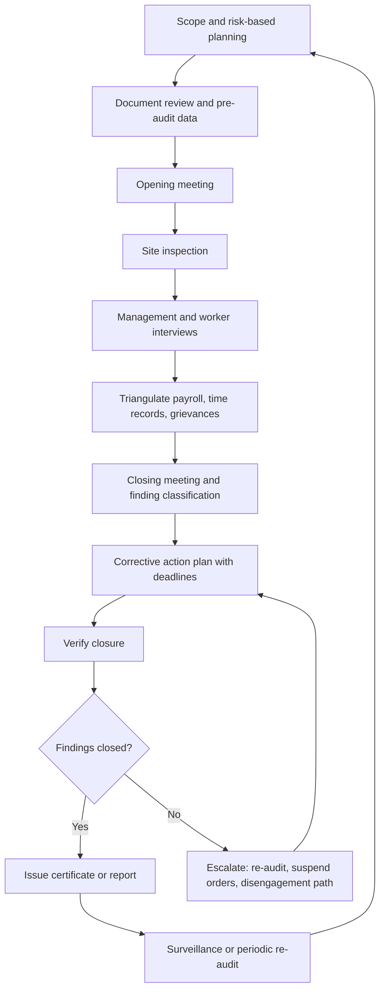
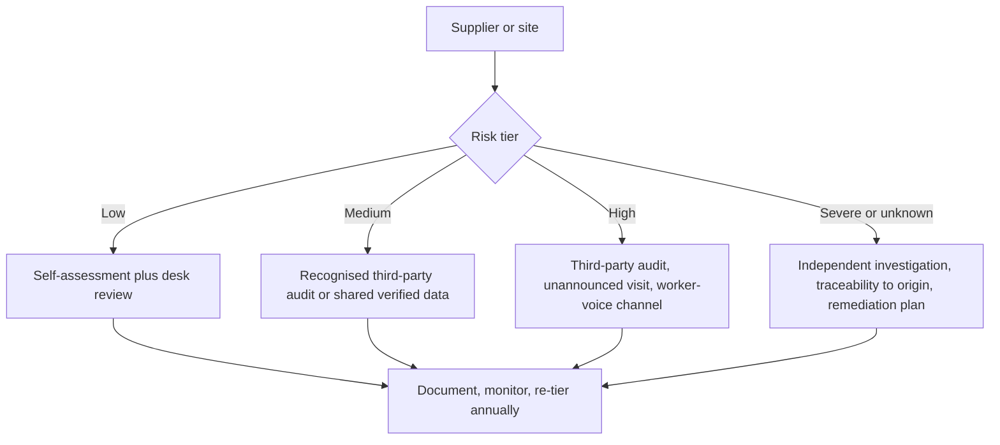

## Auditing and Certification Programs


### Overview

Auditing and certification programs are the conformity assessment mechanisms buyers use to check whether suppliers meet labour, human rights, environmental, and integrity requirements. They range from a buyer's own second-party audit to a scheme-owned, accredited third-party certification, and to shared verified-data platforms. In a tiered supply chain they are the main way evidence travels from the facility, farm, or mine back up to the in-scope buyer.

Status information reflects sources reviewed through 21 September 2026. Scheme rules, recognition decisions, and regulatory guidance change often, so verify against the scheme owner and primary legal texts. This is technical reference material, not legal advice.

**Key Points**

- Auditing, certification, verification, and accreditation are different activities carried out by different actors.
- An audit is a point-in-time sample. It supports due diligence but does not replace it.
- Major regulators (CSDDD, EUDR, German LkSG) allow certification as supporting evidence, not as a legal shield.
- Programs differ in what they evidence: management systems, working conditions, chain of custody, or facility conformity.
- Program design choices (announced vs unannounced, worker-voice methods, auditor independence, data sharing) largely determine whether findings reflect reality.

### Core Definitions

| Term | Meaning | Typical actor |
| --- | --- | --- |
| Audit | Systematic, documented evaluation of conformity against criteria | Auditor (first, second, or third party) |
| Certification | Third-party attestation that a product, process, system, or person conforms to a standard | Certification body (CAB) |
| Verification | Confirmation, often of data or claims, at a stated assurance level | Verifier |
| Accreditation | Formal recognition that a CAB is competent to certify | Accreditation body |
| Benchmarking / recognition | Judgement that one scheme is equivalent to another or to a legal requirement | Scheme owner, buyer group, regulator |
| Assessment | Broader evaluation, often self- or shared-data based, that may not yield a pass/fail | Facility, platform, or assessor |

**Party types**

- **First party**: the organisation audits itself.
- **Second party**: a buyer audits its supplier.
- **Third party**: an independent body audits or certifies.

**Assurance level**

- **Reasonable assurance**: high but not absolute confidence, gained from extensive procedures.
- **Limited assurance**: lower confidence, gained from fewer procedures.
- Many social audits do not state an assurance level. [Inference: buyers should ask what the audit can and cannot conclude.]

**Related international standards**

- ISO/IEC 17021-1: requirements for bodies certifying management systems.
- ISO/IEC 17065: bodies certifying products, processes, and services.
- ISO/IEC 17020: inspection bodies.
- ISO/IEC 17011: accreditation bodies.
- ISO 19011: guidance on auditing management systems.

### Assurance Architecture

Credible schemes separate standard-setting, accreditation, and auditing. This separation supports independence and the ability to challenge poor audit quality.

(svg_diagram) Assurance Architecture

<svg xmlns="http://www.w3.org/2000/svg" viewBox="0 0 720 440" width="720" height="440" font-family="sans-serif" font-size="12">
<title>Assurance Architecture (svg_diagram)</title>
<rect width="720" height="440" fill="#ffffff" />
<text x="360" y="24" text-anchor="middle" font-weight="bold" font-size="15">Assurance Architecture (svg_diagram)</text>
<rect x="40" y="48" width="260" height="46" rx="6" fill="#dbeafe" stroke="#1e40af" />
<text x="170" y="75" text-anchor="middle">Standard owner / scheme manager</text>
<rect x="40" y="128" width="260" height="46" rx="6" fill="#ede9fe" stroke="#5b21b6" />
<text x="170" y="155" text-anchor="middle">Accreditation body</text>
<rect x="40" y="208" width="260" height="46" rx="6" fill="#dcfce7" stroke="#166534" />
<text x="170" y="235" text-anchor="middle">Certification / verification bodies, auditors</text>
<rect x="40" y="288" width="260" height="46" rx="6" fill="#fef9c3" stroke="#854d0e" />
<text x="170" y="315" text-anchor="middle">Audited entity (facility, farm, mine)</text>
<rect x="40" y="368" width="260" height="46" rx="6" fill="#ffedd5" stroke="#9a3412" />
<text x="170" y="395" text-anchor="middle">Buyer / brand (own due diligence)</text>
<line x1="170" y1="94" x2="170" y2="128" stroke="#334155" stroke-width="2" marker-end="url(#arr2)" />
<line x1="170" y1="174" x2="170" y2="208" stroke="#334155" stroke-width="2" marker-end="url(#arr2)" />
<line x1="170" y1="254" x2="170" y2="288" stroke="#334155" stroke-width="2" marker-end="url(#arr2)" />
<line x1="170" y1="334" x2="170" y2="368" stroke="#334155" stroke-width="2" marker-end="url(#arr2)" />
<text x="330" y="115">Requires accredited or approved auditors</text>
<text x="330" y="195">Accredits, witnesses, and supervises quality</text>
<text x="330" y="275">Audit, findings, corrective action, decision</text>
<text x="330" y="355">Certificate, report, or verified data shared</text>
<text x="330" y="430" fill="#475569">Independence risk: the audited entity or buyer usually pays [Inference]</text>
</svg>

**Examples of the roles**

- SA8000 is owned by Social Accountability International, and Social Accountability Accreditation Services (SAAS) oversees certification quality. Stakeholders should look for SA8000 certificates issued by SAAS-accredited bodies.
- SMETA audits can only be carried out by audit firms authorised by Sedex as Affiliate Audit Companies.
- amfori BSCI audits can only be undertaken by approved enabling partners.
- The SLCP requires new verifier bodies to be members of the Association of Professional Social Compliance Auditors (APSCA), a requirement in place since 1 January 2024.

### Program Landscape

#### Social and Labour Compliance

| Program | Owner | Model | Output | Focus |
| --- | --- | --- | --- | --- |
| SA8000 | Social Accountability International | Certification against a standard | Certificate | Labour rights and management systems |
| SMETA | Sedex | Audit methodology (not a certification) | Audit report on the Sedex platform | Labour, health and safety, environment, business ethics |
| amfori BSCI | amfori | Monitoring and improvement program | Audit rating | Labour and ethics, general merchandise and textiles |
| RBA VAP | Responsible Business Alliance | Validated audit against the RBA Code | Score and recognition level after findings close | Electronics and related industries |
| WRAP | WRAP | Certification | Certificate of compliance | Sewn products |
| SLCP CAF | Social & Labor Convergence Program | Converged assessment with verified data | Verified assessment shared with many users | Reduce duplicated audits, apparel and footwear |
| Higg FSLM | Cascale | Facility social and labour module | Shared assessment data | Apparel and footwear |

**Recent developments**

- The revised standard SA8000:2026 is now available, and SAI is running a transition to it.
- amfori discontinued its system recognition of three schemes (SA8000, Equalitas, GlobalGAP) from 3 February 2026, with a grace period to 13 February 2026. It said the focus will be on sharing verified data rather than relying on uploaded PDF certificates, and cited the labour-intensive benchmarking process that recognition requires.
- Validity periods as reported by one sourcing agency: SMETA 12 months, BSCI A or B two years and C one year, WRAP certificates one year. These are secondary-source figures, so confirm them with the scheme owner.

#### Minerals and Metals

- The RMI's Responsible Minerals Assurance Process (RMAP) is an audit of smelters and refiners against OECD-aligned protocols.
- In October 2025 the European Commission recognised RMAP as the first supply chain due diligence scheme under the EU Conflict Minerals Regulation. Recognition covers the RMAP Tin and Tantalum Standard, Tungsten Standard, and Gold Standard, and applies only to RMAP and smelters and refiners conformant with it, not to other schemes RMI cross-recognises.
- EU importers remain responsible for their own compliance, and the Commission plans a list of global responsible smelters and refiners based on recognised schemes and Member State reports.
- In June 2026 the London Metal Exchange granted full recognition to the RMI All Minerals Standard, which RMI describes as covering battery materials such as nickel, cobalt, lithium, and natural graphite.
- Related programs include the LBMA Responsible Gold Guidance and mine-site standards such as IRMA. [Inference: these serve different chain nodes: smelters and refiners versus mine sites.]

#### Commodity and Environmental Certification

| Scheme family | Examples | What it typically evidences |
| --- | --- | --- |
| Forestry | FSC, PEFC | Forest management and chain of custody |
| Agriculture | Rainforest Alliance, Fairtrade, RSPO, RTRS, Better Cotton | Farm or mill practices, sometimes traceability |
| Textiles | GOTS, OEKO-TEX | Input and process criteria, chemicals |
| Marine | MSC, ASC | Fishery and aquaculture practices |
| Management systems | ISO 14001, ISO 45001, ISO 9001 | Management system conformity, not performance |

ISO 20400 (sustainable procurement) and ISO 26000 (social responsibility) are guidance documents rather than certifiable standards.

### Audit Methodology

**Audit modes**

- **Announced**: the site knows the date. It gives access to records but risks staged compliance.
- **Semi-announced**: the site knows a window.
- **Unannounced**: better at seeing normal conditions, but harder to schedule and can miss records.

**Evidence types**

- Document review: payroll, time records, contracts, permits, training, policies.
- Site inspection: fire safety, dormitories, machinery, chemical handling.
- Management interviews.
- Worker interviews, ideally off-site or in confidential settings and in the workers' language.
- Triangulation across payroll, time records, and interviews.
- Grievance and incident logs.
- Recruitment and labour-provider review, including recruitment fees for migrant workers.
- Subcontractor and homeworker checks.

**Audit lifecycle**



#### Finding Classification

| Class | Meaning | Typical response |
| --- | --- | --- |
| Zero tolerance / critical | Severe violation (forced labour, child labour, imminent danger, falsification) | Immediate escalation, possible suspension |
| Major | Systemic or serious non-conformity | Corrective action with short deadline |
| Minor | Isolated or low-severity gap | Corrective action in the normal cycle |
| Observation | Improvement opportunity | Track only |

### Sampling and Detection: Why Audits Have Limits

**Interview sample size**

For a workforce of $N$ workers, an approximate sample size for estimating a proportion with margin of error $e$, confidence multiplier $z$, and assumed proportion $p$ is:

$$n_0 = \frac{z^2 \, p(1-p)}{e^2}, \qquad n = \frac{n_0}{1 + \frac{n_0 - 1}{N}}$$

**Probability of missing a problem**

If a violation affects a fraction $q$ of workers and each interviewed worker discloses it with probability $d$, the chance an audit with $n$ independent interviews misses it is approximately:

$$P_{miss} = (1 - q\,d)^{n}$$

[Inference: this simple model assumes independent sampling and uniform disclosure. Real audits are affected by coaching, fear of retaliation, and non-random selection, so actual detection can be lower.]

**Example**

```python
import math

def sample_size(N, z=1.96, p=0.5, e=0.10):
    n0 = (z**2 * p * (1 - p)) / e**2
    return math.ceil(n0 / (1 + (n0 - 1) / N))

def p_miss(n, q, d=1.0):
    return (1 - q * d) ** n

print(sample_size(1200))
for n in (30, 89):
    for d in (1.0, 0.3):
        print(f"n={n:<3} disclosure={d:.1f} P(miss)={p_miss(n, 0.05, d):.3f}")
```

**Output** (illustrative; exact formatting depends on the runtime)

```plaintext
89
n=30  disclosure=1.0 P(miss)=0.215
n=30  disclosure=0.3 P(miss)=0.635
n=89  disclosure=1.0 P(miss)=0.010
n=89  disclosure=0.3 P(miss)=0.261
```

**Key Points**

- Even a statistically reasonable sample can miss an issue affecting 5% of workers if workers rarely disclose it.
- Hidden coercion, retaliation risk, and recruitment debt reduce disclosure, which is why worker-voice channels matter.
- Real programs prescribe their own sample sizes, which may be smaller than the statistical figure above.

### Criticisms and Failure Modes

- OECD Watch argues that audits and certification, even through multi-stakeholder initiatives, should not be treated as sufficient proof of due diligence. It notes that impacts tied to power relations (gender-based violence, freedom of association, forced labour) are rarely detected because remedial action is complex and costly.
- A US Labor Department official said audits can assess compliance at a point in time but need to sit within a system that supports trade unions, freedom of association, and worker voice.
- Anti-Slavery International describes typical audits as tick-box and linear, and points to an alleged case where a company reportedly relied on social audits while whistle-blowers raised abuses.
- A US congressional commission hearing in 2024 examined why social audits fail to identify forced labour in Chinese factories.
- The Business and Human Rights Resource Centre lists OECD complaints against auditors after factory disasters, showing that legal accountability for auditors is unsettled. A Canadian lawsuit against a retailer and an audit firm over Rana Plaza was dismissed.

| Failure mode | Mechanism | Countermeasure |
| --- | --- | --- |
| Staged compliance | Announced audits, coaching, false records | Unannounced or semi-announced visits, payroll triangulation |
| Conflict of interest | Auditee or buyer pays the auditor | Accreditation, rotation, shadow audits, complaint routes |
| Narrow scope | Audit covers one site or line, not subcontractors or added lines | Scope statements, subcontractor mapping, re-audit on change |
| Worker silence | Fear, debt, language, supervisor presence | Off-site interviews, hotlines, worker-led monitoring |
| Audit fatigue | Many overlapping audits, low data reuse | Shared data (SLCP, platform sharing), recognition of equivalents |
| Certificate as logo | Buyers accept certificate without report or scope check | Ask for report, findings, scope, and validity |
| Fraud and corruption | Bribery, falsified reports | Auditor integrity programs, anonymised reporting, analytics |
| Point-in-time bias | Conditions change between audits | Continuous monitoring, grievance data, risk-triggered visits |

### Regulatory Role of Audits and Certification

| Regime | Position on audits and certification |
| --- | --- |
| CSDDD | Third-party verification and industry or multi-stakeholder initiatives may support due diligence to the extent appropriate. There is no formal Commission recognition procedure for specific initiatives. |
| German LkSG | Recognised certification and audit systems can be used as control mechanisms, but only participation in a scheme is insufficient. |
| EUDR | Certification may be considered in risk assessment but does not replace due diligence, and operators keep full liability. |
| EU Conflict Minerals Regulation | The Commission can recognise schemes, and RMAP has been recognised; importers stay responsible. |
| EU Batteries Regulation | Due diligence policies require third-party verification by a notified body. |
| EU Forced Labour Regulation | An obligation of result, so certificates are evidence at best. [Inference] |
| UFLPA (US) | The importer must overcome a rebuttable presumption with clear and convincing evidence, so audit reports alone are unlikely to suffice for origin or forced labour questions. [Inference] |

**CSDDD detail**

- The directive allows companies to use third-party verification only to the extent it is appropriate to support the relevant obligations.
- The CSDDD text does not grant automatic exemption from civil liability just because a company has audits and a certificate. The EU-wide civil liability regime was later removed by Omnibus I, so how such reliance is weighed will depend on national law and Commission guidance. [Inference]
- The Commission opened a public consultation on CSDDD guidelines on 12 June 2026, open until 24 July 2026, and plans to adopt guidelines in the first quarter of 2027.
- Those guidelines must cover, among other topics, fitness criteria and assessment methodologies for third-party verifiers and industry initiatives, and the Commission is also mandated to guide monitoring of third-party verification accuracy, effectiveness, and integrity.

**EUDR detail**

- The Commission's guidance and FAQ state that no certification scheme is recognised as a substitute for EUDR due diligence. "Taken into account" is not the same as "accepted as proof".
- An academic study of five ISEAL-member schemes (Fairtrade, FSC, Rainforest Alliance, RSPO, RTRS) found that their traceability systems do not fully cover EUDR requirements, so they can support but not demonstrate compliance.
- A vendor analysis reports that FSC covers 58% of compliance indicators. [Unverified: methodology not independently reviewed.]
- Reported universal gaps include misaligned cut-off dates, no plot-level geolocation, incomplete legality scope, and no transfer of operator liability.
- FSC itself states that its certification does not replace due diligence but strengthens the quality of evidence.
- The EUDR context requires compliant and non-compliant products to be segregated at each junction, which limits the use of mass-balance chain-of-custody models. [Inference for specific schemes.]

### Chain-of-Custody Models

| Model | Description | Traceability | Suitability for origin-critical regimes |
| --- | --- | --- | --- |
| Identity preserved | Product from a single certified source is kept separate and traceable | Highest | Strong |
| Segregation | Certified material kept apart from non-certified, possibly from multiple certified sources | High | Strong |
| Mass balance | Certified and non-certified material mixed, with volume accounting | Medium (volume, not physical) | Weak for origin-critical rules |
| Book and claim | Certificates traded separately from physical goods | Low (no physical link) | Not suitable for origin claims |

[Inference: the suitability column is a general assessment. Each regime and scheme should be checked against the specific rules.]

### Designing an Assurance Program

1. **Define assurance objectives** for each risk category (forced labour, chemicals, deforestation, minerals).
2. **Risk-tier suppliers** by country, sector, commodity, spend, and incident signals.
3. **Choose the assurance mix** per tier from self-assessment, desk review, recognised third-party audit, unannounced audit, worker-voice channel, and traceability verification.
4. **Benchmark and recognise schemes** through an explicit equivalence matrix, with a defined policy on which schemes are accepted for which risks.
5. **Manage auditor quality** with accreditation, APSCA or equivalent registration, calibration, witness audits, and rotation.
6. **Handle findings** with severity classes, deadlines, and independent closure verification.
7. **Link to remediation and capacity building**, not only to pass/fail decisions.
8. **Integrate data** into a supplier platform so evidence can be reused and re-tiered.
9. **Govern** with escalation triggers, review of scheme changes, and a clear disengagement policy.

**Assurance selection**



#### Coverage Metrics

Let $a_i = 1$ if supplier $i$ holds a valid, in-scope audit or certificate and $0$ otherwise, and let $w_i$ be a weight (spend or risk). Weighted assurance coverage is:

$$C_w = \frac{\sum_i w_i\, a_i}{\sum_i w_i}$$

**Example**

Four suppliers have spend of €40m, €30m, €20m, and €10m and risk scores of 0.2, 0.3, 0.6, and 0.9. The first two are audited.

- Spend-weighted coverage: $\frac{40+30}{100} = 70\%$
- Risk-weighted coverage: $\frac{0.2+0.3}{0.2+0.3+0.6+0.9} = \frac{0.5}{2.0} = 25\%$

The programme looks well covered by spend but leaves most of the risk unassured, so risk-weighted coverage should be tracked alongside spend coverage.

**Other useful KPIs**

- Share of findings closed on time.
- Repeat finding rate.
- Mean time to close critical findings.
- Share of audits that are unannounced.
- Worker-voice reach (percentage of workers with access to a functioning channel).
- Percentage of sub-tier facilities with verified data.

### Example: Tiered Assurance Plan for an Electronics Product

| Tier | Node | Assurance approach |
| --- | --- | --- |
| 1 | Final assembler | RBA VAP or equivalent audit, worker-voice channel, buyer verification of closure |
| 2 | Component manufacturers | Recognised audit or shared verified data, risk-triggered visits |
| 3 | Smelters and refiners | RMAP conformance, review of assessment reports |
| 4 | Mines and traders | Upstream mechanisms and risk-based checks in conflict-affected areas, traceability to origin |

This mix follows the pattern that assurance intensity should rise with risk and depth, while accepting that direct buyer leverage falls with depth. [Inference]

### Certificate and Report Validation Checklist

- Request the actual report or certificate, not a verbal claim.
- Check validity dates and the certification cycle.
- Review the findings page and status of corrective actions, since critical findings and minor findings mean different things.
- Confirm scope: sites, lines, subcontractors, products, and any exclusions.
- Match the audited address and legal entity with the supplier in your master data.
- Verify the issuing body's accreditation or approval status with the scheme owner.
- Confirm the auditor's registration where a registry exists.
- Compare audit dates against known production changes, such as new lines or new sites.
- Check certificate authenticity through the scheme registry or platform.

### Pitfalls and Best Practices

**Pitfalls**

- Treating a certificate as proof of legal compliance under a specific regulation.
- Accepting logos or PDFs without scope, findings, or validity checks.
- Relying on Tier 1 audits for risks that sit at Tier 3 or Tier 4.
- Using announced audits as the only control for high-risk labour issues.
- Ignoring scheme changes such as loss of recognition by a buying group.
- Overloading suppliers with duplicate audits.
- Letting audit results drive termination by default rather than remediation.

**Best practices**

- Use audits as one input within a risk-based due diligence process.
- Combine audits with worker-voice channels, grievance data, and traceability.
- Prefer shared verified data and converged frameworks to reduce duplication.
- Pay attention to auditor quality, independence, and complaints handling.
- Keep a documented equivalence policy that names accepted schemes per risk.
- Re-check scheme status regularly, since recognition and standards change.
- Feed audit findings into purchasing practices, since price and lead-time pressure often cause the violations audits find. [Inference]

**Conclusion**

Auditing and certification programs provide structured, comparable evidence about supplier conditions, but they are sampling tools with well-documented blind spots, especially for forced labour, freedom of association, and hidden subcontracting. The regulatory direction, including CSDDD, LkSG, and EUDR, treats them as supporting evidence within a company's own due diligence, while a few upstream mineral schemes such as RMAP show how formal recognition can work. The most defensible programs combine risk-tiered assurance, accredited and well-managed auditors, worker voice, traceability, and remediation. Scheme rules and regulatory positions may vary by jurisdiction and change over time, so confirm current requirements with the scheme owners and primary legal texts.

**Related Topics**

- Worker-driven social responsibility and binding brand agreements
- Grievance mechanisms and worker voice technologies
- Supplier codes of conduct and contractual cascades
- Traceability and chain-of-custody systems, including blockchain and satellite monitoring
- Isotopic and forensic origin testing for high-risk materials
- Conflict minerals due diligence and smelter assurance programs
- ISEAL Codes of Good Practice and scheme credibility
- Accreditation and conformity assessment (ISO/IEC 17000 series)
- Responsible purchasing practices and their effect on labour conditions
- CSDDD guidelines on third-party verification and industry initiatives